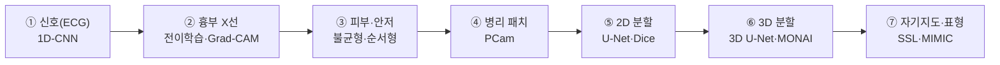

## Overview
의료 AI·코딩을 **매주 하나씩 직접 돌려보며** 익히는 12주 로드맵이다. 각 주차는
`pipelines/datasets.py`의 `CURRICULUM`과 1:1로 묶여 있고, **1주차(신호)부터 순서대로**
진행한다(달력이 아니라 내 진도 기준, 진도는 `state/ailab_progress.json`에 저장):

```bash
python pipelines/datasets.py            # 현재 주차 주제 + 오픈 데이터 카탈로그
python pipelines/datasets.py --list     # 12주 전체 + 진도(현재/완료)
python pipelines/datasets.py --advance  # 이번 주 완료 → 다음 주차로
```

원칙은 MedKOS와 같다 — **신호 → 2D 영상 → 3D → 병리/멀티모달** 순으로 난도를 올린다.
가벼운 데이터로 '전 과정 1회 완주'를 먼저 하고, 뒤로 갈수록 규모·구조를 키운다.

## Architecture
학습 경로(왼쪽이 쉽고 오른쪽이 어렵다):



## Data
아래 12주를 **순서대로** 진행한다(현재 주차는 `datasets.py`가 진도로 관리).
🟢=가입 없이 바로, 🟡=무료가입, 🔴=자격심사(민감정보).

| 주 | 목표 | 모델 | 데이터셋 | 접근 |
|----|------|------|----------|------|
| 1 | 심전도 부정맥 분류 | 1D-CNN | MIT-BIH | 🟢 |
| 2 | 12유도 다중라벨 진단 | 1D-ResNet | PTB-XL | 🟢 |
| 3 | 흉부 X선 폐렴(전이학습) | ResNet50 | NIH ChestX-ray14 | 🟢 |
| 4 | 흉부 14종 + Grad-CAM | DenseNet121 | CheXpert | 🟡 |
| 5 | 피부병변 7종(불균형) | EfficientNet | HAM10000 | 🟡 |
| 6 | 당뇨망막병증 등급 | EfficientNet+회귀 | APTOS 2019 | 🟡 |
| 7 | 병리 패치 전이 | CNN | PatchCamelyon | 🟢 |
| 8 | 폐 CT 결절 분할 | 2D U-Net | MSD Lung | 🟢 |
| 9 | 3D 뇌종양 분할(입문) | 3D U-Net | MSD Brain | 🟢 |
| 10 | 3D 뇌종양 분할(심화) | SwinUNETR | BraTS | 🟡 |
| 11 | 정상 뇌 자기지도 | Autoencoder/SSL | IXI | 🟢 |
| 12 | ICU 임상 예측(표형) | GBM/시계열 | MIMIC-IV | 🔴 |

## Instructions
매주 도는 절차는 `/ai-weekly` 스킬이 오케스트레이션한다(얇은 루틴, 규칙은 repo에):

1. `python pipelines/datasets.py` 로 현재 주차 주제·데이터·**통과 기준** 확인
2. `/gen-ailab` 로 그 주제의 실습 카드(분석·도식·지시어 해설 + `## Gate`)를 생성
3. Colab 노트북(`notebooks/`)에서 직접 돌리고, 결과·막힌 점을 카드 `## My notes`에 기록
4. **완료 판정 → 자동 진급**: 노트북이 `results.json`을 남기면
   `python pipelines/check_week.py --results <파일>` 가 기준과 비교해 통과 시 다음 주차로.
   (바빠서 매주 못 만들어도, 기준을 넘긴 주만 골라 진급할 수 있다.)
5. `indexer.py --check` → `export_ailab_web.py` → 커밋 (홈페이지 🤖 AI랩에 반영)

## Exercises
- 이번 주 주제를 `datasets.py`로 확인하고, 해당 데이터셋 링크를 실제로 열어본다.
- 첫 주(신호)는 반드시 **끝까지 완주**해 '데이터→모델→평가'의 감을 잡는다.
- 매주 카드에 **재현 가능한 한 줄 결과**(Dice/AUROC 등)를 남긴다.

## Resources
- 프로젝트 분석 예시: `ailab-2026-0002` (Keras 3D 뇌종양 분할)
- Colab·Drive 셋업 & 지시어 읽는 법: `ailab-2026-0003`
- 오픈 데이터 레지스트리: `pipelines/datasets.py`

## My notes
<!-- 주차별 진행·회고를 여기에. -->
