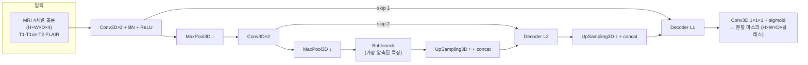

## Overview
공개 프로젝트 하나를 **끝까지 뜯어보며** 의료영상 딥러닝의 전형(典型)을 익히는 카드다.
대상은 Keras 공식 예제 *Brain Tumor Segmentation*(3D U-Net). 하는 일은 한 문장으로:

> **4가지 MRI 시퀀스(3D 볼륨)를 입력받아, 복셀(voxel)마다 '종양/정상'을 칠하는 3D 분할.**

- **문제 유형**: 분류(classification)가 아니라 **분할(segmentation)** — 출력이 라벨 1개가
  아니라 입력과 같은 크기의 '마스크(mask)'다. 각 복셀이 어느 조직인지 픽셀 단위로 예측한다.
- **왜 3D인가**: 뇌 MRI는 슬라이스를 쌓은 볼륨이다. 종양은 위·아래 슬라이스로 이어지므로
  `Conv3D`로 **깊이 방향 맥락**까지 본다(2D보다 무겁지만 경계가 정확).
- **왜 U-Net인가**: 분할의 사실상 표준 구조. 아래 Architecture 참조.

## Architecture
U-Net = **인코더(수축)로 '무엇'을 파악 → 디코더(확장)로 '어디'를 복원**, 그 사이를
**스킵 연결**로 이어 세밀한 경계를 살린다. 3D는 모든 conv/pool이 3차원이라는 점만 다르다.



- **인코더**: `Conv3D → BatchNorm → ReLU`를 두 번 쌓고 `MaxPool3D`로 절반씩 줄인다.
  해상도를 줄이며 채널(특징 수)을 늘려 '무엇이 있는가'를 추상화한다.
- **Bottleneck**: 가장 압축된 표현. 여기서 전역 맥락을 쥔다.
- **디코더**: `UpSampling3D`(또는 `Conv3DTranspose`)로 다시 키우며, **같은 해상도의 인코더
  특징을 concat(스킵 연결)** 해 경계 디테일을 되살린다.
- **출력 헤드**: `Conv3D` 1×1×1 + `sigmoid`(이진) 또는 `softmax`(다중 클래스)로 복셀별 확률.

## Data
- **데이터셋**: BraTS / Medical Segmentation Decathlon Task01(`datasets.py`의 `msd-brain`).
  4개 MRI 시퀀스(T1, T1ce, T2, FLAIR)가 **채널**로 들어가고, 정답은 종양 하위영역 마스크.
- **형식**: `NIfTI(.nii.gz)` — 의료 볼륨 표준. `nibabel`로 읽어 NumPy 배열로 만든다.
- **전처리 정석**(공부 포인트):
  1. **강도 정규화**: MRI는 절대값 의미가 없어 케이스별 z-score/min-max 정규화.
  2. **리샘플/크롭**: 케이스마다 크기가 달라 공통 spacing·크기로 맞추고 배경을 크롭.
  3. **패치 학습**: 볼륨 전체는 GPU 메모리를 초과 → 128³ 같은 **패치**를 잘라 학습.
  4. **증강**: 회전·플립·강도 지터로 일반화. (좌우 플립은 해부학적으로 주의)

## Code walkthrough
아래는 Keras 3 분할 파이프라인의 **대표 골격**이다(실제 예제 코드와 대조하며 읽어라).

```python
import keras
from keras import layers

def conv_block(x, filters):                 # 인코더/디코더 공통 블록
    x = layers.Conv3D(filters, 3, padding="same")(x)
    x = layers.BatchNormalization()(x)
    x = layers.Activation("relu")(x)
    x = layers.Conv3D(filters, 3, padding="same")(x)
    x = layers.BatchNormalization()(x)
    return layers.Activation("relu")(x)

def build_unet3d(shape=(128,128,128,4), n_classes=3):
    inp = keras.Input(shape)
    c1 = conv_block(inp, 16); p1 = layers.MaxPooling3D()(c1)
    c2 = conv_block(p1, 32);  p2 = layers.MaxPooling3D()(c2)
    b  = conv_block(p2, 64)                          # bottleneck
    u2 = layers.UpSampling3D()(b)
    u2 = layers.concatenate([u2, c2])               # skip connection
    d2 = conv_block(u2, 32)
    u1 = layers.UpSampling3D()(d2)
    u1 = layers.concatenate([u1, c1])
    d1 = conv_block(u1, 16)
    out = layers.Conv3D(n_classes, 1, activation="sigmoid")(d1)
    return keras.Model(inp, out)

def dice_loss(y_true, y_pred, eps=1e-6):            # 분할의 핵심 손실
    inter = keras.ops.sum(y_true * y_pred, axis=[1,2,3])
    union = keras.ops.sum(y_true + y_pred, axis=[1,2,3])
    return 1 - keras.ops.mean((2*inter + eps) / (union + eps))

model = build_unet3d()
model.compile(optimizer="adam", loss=dice_loss, metrics=["accuracy"])
model.fit(train_ds, validation_data=val_ds, epochs=30)
```

## Instructions
> **핵심: 코드의 각 '지시어'가 모델에게 뭘 시키는지**를 말로 옮기면 구조가 보인다.
> (사용자가 요청한 '해당 지시어가 어떤 지시문인지' 파트)

| 지시어(코드) | 무엇을 시키는가 | 왜 필요한가 |
|---|---|---|
| `keras.Input(shape)` | "입력은 이 모양의 텐서다"라고 그래프의 입구를 선언 | 모델이 받을 볼륨 크기·채널 수를 고정 |
| `layers.Conv3D(f, 3)` | 3×3×3 커널 `f`개로 **지역 패턴**을 훑어라 | 가장자리·질감 같은 국소 특징 추출 |
| `BatchNormalization()` | 배치 통계로 값을 **정규화**해 학습을 안정화 | 깊은 3D망의 발산 방지·수렴 가속 |
| `Activation("relu")` | 음수는 0으로 눌러 **비선형성** 부여 | 없으면 층을 쌓아도 선형에 불과 |
| `MaxPooling3D()` | 2배 다운샘플: "이 영역의 최댓값만 남겨라" | 시야(receptive field)를 넓히고 계산량↓ |
| `UpSampling3D()` | 다시 2배 키워라 | 디코더에서 원해상도 마스크로 복원 |
| `concatenate([u, c])` | 디코더 특징에 **같은 층 인코더 특징을 붙여라** | 스킵 연결 — 잃어버린 경계 디테일 회복 |
| `Conv3D(n,1,"sigmoid")` | 복셀마다 클래스 확률(0~1)을 내라 | 최종 분할 마스크 생성 |
| `dice_loss` | "예측∩정답을 최대화하라"(겹침 비율) | 종양이 작아 픽셀 정확도는 속기 쉬움 → Dice로 겹침을 직접 최적화 |
| `model.compile(...)` | 손실·옵티마이저·지표를 **묶어라** | 학습 규칙 확정 |
| `model.fit(...)` | 데이터를 반복 투입해 **가중치를 갱신하라** | 실제 학습 루프 |

**한눈 요약**: `Conv3D`가 보고 → `Pool`이 요약하고 → `Bottleneck`이 판단하고 →
`UpSampling+concat`이 복원하고 → `sigmoid`가 칠하고 → `dice_loss`가 채점해 → `fit`이 고친다.

## Exercises
1. **읽기**: 원본 예제(`project_url`)를 열어 위 골격과 1:1 대조하고, 다른 점 3가지를 이 카드
   아래에 메모한다.
2. **돌리기**: `notebook`(Colab)에서 MSD Task01 소량으로 5 epoch 학습 → Dice 곡선을 캡처.
3. **바꿔보기**: 손실을 `dice_loss` → `BCE+Dice` 혼합으로 바꾸고 검증 Dice 변화를 비교.
4. **줄이기**: 패치 크기를 128³→64³로 줄여 메모리·속도·성능의 트레이드오프를 관찰.
5. **연결**: 결과 마스크 1장을 캡처해 `## My notes`에 붙이고, KMLE 신경과 종양 문항과 링크.

## Resources
- 원본 예제: https://keras.io/examples/vision/brain_tumor_segmentation/
- U-Net 원논문: Ronneberger 2015 (MICCAI)
- 3D U-Net: Çiçek 2016 (MICCAI)
- MONAI(의료영상 특화 파이프라인): https://monai.io/
- 데이터: `pipelines/datasets.py`의 `msd-brain`·`brats` 항목

## My notes
<!-- 여기에 실습하며 배운 것, 막힌 것, 아이디어를 적는다. 홈페이지 노트와 왕복 가능. -->
