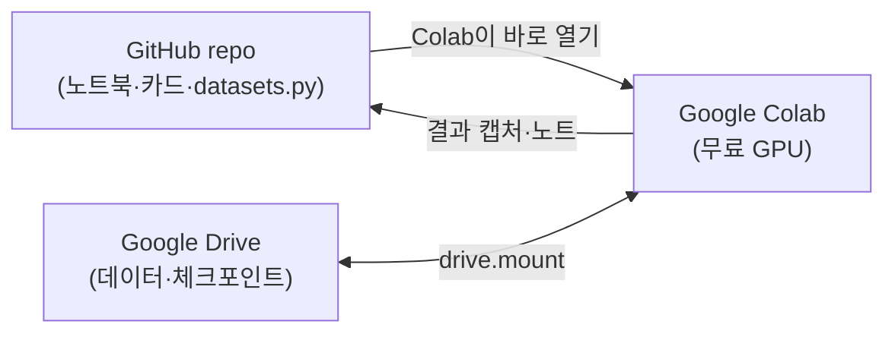

## Overview
실습을 **무료 GPU(Google Colab)** 에서 하고, 결과·데이터는 **Google Drive**에 남기고,
코드·노트는 **GitHub(이 repo)** 에 버전관리하는 3각 구조다. MedKOS 철학 그대로:
*GitHub=원본/코드, Drive=데이터·산출물 백업, 노트=실습장.*



## Data
- **데이터는 Drive에** 둔다: 큰 의료 데이터를 매번 새로 받으면 느리다. 한 번 받아
  `MyDrive/MedKOS/data/<dataset>/`에 풀어두고 매 세션 마운트해 재사용한다.
- **체크포인트도 Drive에**: 학습 중 `.keras`/`.pt`를 `MyDrive/MedKOS/ckpt/`에 저장하면
  Colab 세션이 끊겨도 이어서 할 수 있다.
- **코드·카드는 Drive가 아니라 GitHub에**: 원본은 항상 repo. 노트북은 GitHub에서 Colab이
  바로 연다(`colab_url` 참고).

## Code walkthrough
Colab 첫 셀에서 Drive를 붙이고 repo를 당겨오는 표준 준비 코드:

```python
# 1) Google Drive 마운트 → 데이터·체크포인트를 영구 보관
from google.colab import drive
drive.mount("/content/drive")
import os, pathlib
BASE = pathlib.Path("/content/drive/MyDrive/MedKOS")
(BASE / "data").mkdir(parents=True, exist_ok=True)
(BASE / "ckpt").mkdir(parents=True, exist_ok=True)

# 2) 최신 코드·데이터셋 레지스트리 당겨오기(datasets.py 등)
!git clone --depth 1 https://github.com/ehdbddl06001-ui/my-github-test.git /content/medkos || \
  (cd /content/medkos && git pull)
import sys; sys.path.append("/content/medkos")

# 3) 현재 주차 주제를 '코드'에게 물어본다(LLM 아님, 1→12 순차 진도)
from pipelines.datasets import current_topic, get_dataset
wt = current_topic(); print(wt["week"], "주차:", wt["goal"], "→", wt["dataset_name"])

# 4) GPU 확인
import tensorflow as tf; print("GPU:", tf.config.list_physical_devices("GPU"))
```

이후엔 `BASE/"data"` 아래 데이터를 읽고, 학습이 끝나면
`model.save(BASE/"ckpt"/"week{}.keras".format(wt["week"]))` 로 Drive에 남긴다.

## Instructions
> **모델 코드(지시어)를 처음 볼 때 읽는 순서** — 낯선 프로젝트도 이 5개 질문으로 해부된다.

1. **입력·출력이 뭐냐** — `Input(...)`과 마지막 층(`Dense`/`Conv...`의 활성함수)만 봐도
   문제 유형이 나온다. `sigmoid`=이진/다중라벨, `softmax`=단일 다중클래스, 활성 없음=회귀.
2. **손실이 뭐냐** — `compile(loss=...)`. 문제의 '채점 기준'이자 모델이 최적화하는 목표.
   (분할=Dice, 불균형 분류=weighted BCE, 등급=회귀/QWK …)
3. **몸통이 뭐냐** — 반복되는 블록의 이름(Conv/Residual/Attention)이 곧 아키텍처 이름.
4. **데이터가 어떻게 들어오냐** — `Dataset`/`generator`의 전처리·증강이 성능의 절반.
5. **어떻게 도느냐** — `fit`/학습 루프의 epoch·batch·lr·콜백(early stop, checkpoint).

각 항목의 '지시어→무엇을 시키는가' 대응표는 프로젝트 카드(`ailab-2026-0002`)의
**## Instructions** 표를 템플릿으로 재사용한다. 새 프로젝트를 볼 때마다 그 표를 채우면
자연스럽게 구조가 정리된다.

## Exercises
1. 위 준비 셀을 Colab에서 실행해 Drive 마운트 + `weekly_topic()` 출력까지 확인.
2. `ailab-2026-0002`의 지시어 표를 **가리고**, 코드만 보고 스스로 채운 뒤 대조.
3. 아무 Kaggle/Keras 의료 예제 하나를 골라 위 '5개 질문'으로 1문단 요약을 써 본다.

## Resources
- 템플릿 노트북: `notebooks/ailab_template.ipynb`
- 뇌종양 분할 실습 노트북: `notebooks/ailab_brain_tumor_segmentation.ipynb`
- Colab 문서: https://colab.research.google.com/
- Keras 3 가이드: https://keras.io/guides/

## My notes
<!-- 셋업하며 막힌 점(권한·경로·GPU 등)과 해결을 기록. -->
