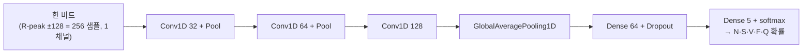

## Overview
커리큘럼 **1주차**. 가장 가벼운 의료 딥러닝으로 **신호 → 라벨** 전 과정을 하루에 완주한다.
심전도(1D 신호) 한 비트를 보고 부정맥 유형을 맞히는 **1D-CNN 분류기**.

> **완료 게이트**: AAMI 5클래스 **macro-F1 ≥ 0.80**. 달성하면 `check_week.py`가 판정해
> 자동으로 2주차(PTB-XL 12유도)로 넘어간다. → `## Gate` 참조.

- **왜 이걸 1주차로**: 이미지보다 가볍고(1D), 오픈 데이터라 바로 받으며, 전처리·불균형·
  평가지표라는 핵심 3요소를 한 번에 만난다.
- **기존 접근**: MIT-BIH는 부정맥 연구의 고전. AAMI EC57 표준으로 비트를 N/S/V/F/Q 5군으로
  묶어 분류하는 것이 관례다. 고전 baseline은 1D-CNN·RNN이며 비트 단위 정확도는 매우 높지만,
  **환자 단위 분리**를 하면 난도가 확 오른다(그래서 이 과제의 진짜 공부 포인트).

## Architecture
1D-CNN = 이미지의 2D 합성곱을 **시간축 1D**로 바꾼 것. 신호의 국소 파형(QRS 모양)을 훑어
비트 유형을 판단한다.



## Data
- **MIT-BIH Arrhythmia**(PhysioNet, 오픈, 48 레코드·2유도·360Hz). `wfdb`로 직접 스트리밍.
- **비트 추출**: 주석(atr)의 R-peak 위치 ±128 샘플을 한 비트로 자르고 비트별 z-score 정규화.
- **라벨(AAMI 5군)**: N(정상계열)·S(상심실성)·V(심실성)·F(융합)·Q(미분류). 심한 **불균형**
  (N이 대부분) → 클래스 가중치로 보정.
- **환자 단위 분리**: 레코드를 train/test로 나눠 같은 환자가 양쪽에 섞이지 않게 한다
  (섞이면 점수가 부풀려짐 — 임상 연구로 그대로 이어지는 핵심 개념).

## Code walkthrough
핵심만. 전체는 `notebook`(Colab)에서 실행한다.

```python
# 비트 하나 = R-peak 양옆을 자른 256 샘플, 비트별 정규화
beat = ch[pos-128:pos+128]
beat = (beat - beat.mean()) / (beat.std() + 1e-6)

# 1D-CNN
from tensorflow.keras import layers, models
model = models.Sequential([
    layers.Input((256, 1)),
    layers.Conv1D(32, 7, activation="relu"), layers.MaxPool1D(2),
    layers.Conv1D(64, 5, activation="relu"), layers.MaxPool1D(2),
    layers.Conv1D(128, 3, activation="relu"), layers.GlobalAveragePooling1D(),
    layers.Dense(64, activation="relu"), layers.Dropout(0.3),
    layers.Dense(5, activation="softmax"),
])
model.compile(optimizer="adam", loss="sparse_categorical_crossentropy", metrics=["accuracy"])
model.fit(Xtr, ytr, validation_split=0.1, epochs=8, class_weight=cw)  # cw=클래스 가중치

# 평가: 불균형이라 accuracy가 아니라 macro-F1로 본다
from sklearn.metrics import f1_score
macro_f1 = f1_score(yte, model.predict(Xte).argmax(1), average="macro")
```

## Instructions
> 코드의 각 지시어가 뭘 시키는지(1D 버전).

| 지시어 | 무엇을 시키는가 | 왜 |
|---|---|---|
| `wfdb.rdsamp/rdann` | 신호와 R-peak 주석을 읽어라 | 원신호 → 비트 조각의 원천 |
| `Conv1D(f, k)` | 길이 k 커널 f개로 시간축 국소 파형을 훑어라 | QRS 모양 같은 국소 특징 |
| `MaxPool1D(2)` | 시간축 절반으로 요약 | 시야↑·계산량↓ |
| `GlobalAveragePooling1D` | 시간축 전체를 하나로 평균 | 가변 위치에 강건한 요약 |
| `Dropout(0.3)` | 학습 때 뉴런 30%를 끔 | 과적합 억제 |
| `softmax(5)` | 5클래스 확률을 내라 | 비트 유형 분류 |
| `class_weight` | 드문 클래스에 가중치를 더 줘라 | N 편중(불균형) 보정 — accuracy 함정 회피 |
| `f1_score(macro)` | 클래스별 F1의 단순평균으로 채점 | 불균형에서 소수 클래스도 공평히 평가 |

## Gate
- **기준**: `macro_f1 ≥ 0.80` (AAMI 5클래스, 환자 단위 분리)
- **산출물**: 혼동행렬 + macro-F1, 체크포인트를 Drive에 저장
- **판정/진급**:
  ```bash
  # 노트북이 남긴 결과로 판정(통과 시 자동으로 2주차로)
  python pipelines/check_week.py --results week01_results.json
  # 또는 값만 직접:
  python pipelines/check_week.py --value 0.83
  ```
  통과가 애매하지만 개념을 충분히 이해했다면 `/ai-mentor` 질적 리뷰 후 `--pass`로 승인 가능.

## Exercises
1. **완주**: Colab에서 끝까지 돌려 macro-F1과 혼동행렬을 얻는다.
2. **관찰**: 어느 클래스가 약한가(보통 S·F)? 왜? 한 문단으로 `## My notes`에 적는다.
3. **개선**: (a) 시프트·노이즈 증강 (b) Residual 블록 (c) 에폭/학습률 조정 중 하나로 macro-F1을
   올려본다.
4. **진급**: 기준을 넘으면 `check_week.py`로 2주차(PTB-XL)로 넘어간다.

## Resources
- 데이터: https://physionet.org/content/mitdb/  · WFDB 파이썬: https://github.com/MIT-LCP/wfdb-python
- AAMI EC57 표준(비트 5군 매핑)  · MedKOS 기존 ECG 에셋: `assets/ecg/mitdb-100.json`
- 신호 딥러닝 개론: PhysioNet Challenges

## My notes
- **2026-07-12 완주 — 게이트 통과 ✅**: AAMI 5클래스 **macro-F1 = 0.8273** (≥ 0.80). 환자 단위 분리, 1D-CNN.
- **클래스별 F1**: N 0.994 · V 0.978 · S 0.881 · F 0.840 · **Q 0.444**.
- **약한 클래스와 이유**:
  - **Q(미분류)**: test에 단 3개(support=3)뿐이라 한 개만 틀려도 F1이 요동친다 — 데이터 자체가 극소수라 통계적으로 불안정. 점수보다 "희소 클래스는 지표가 못 미더움"을 배우는 지점.
  - **F(융합)·S(상심실성)**: N과 파형이 겹쳐 혼동행렬에서 일부가 N으로 흡수됨(F→N 25건, S 파형이 N과 유사). class_weight로 recall은 올렸으나(S recall 0.955) precision 손해.
- **다음 개선 아이디어**(Exercises 3): 시프트·노이즈 증강으로 S·F 보강, Residual 블록으로 파형 표현력↑. 진급했으니 2주차(PTB-XL)와 병행 심화 예정.
