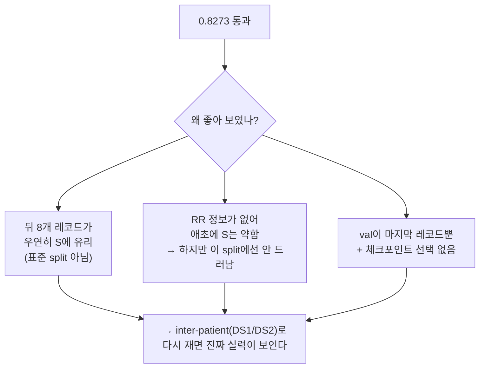
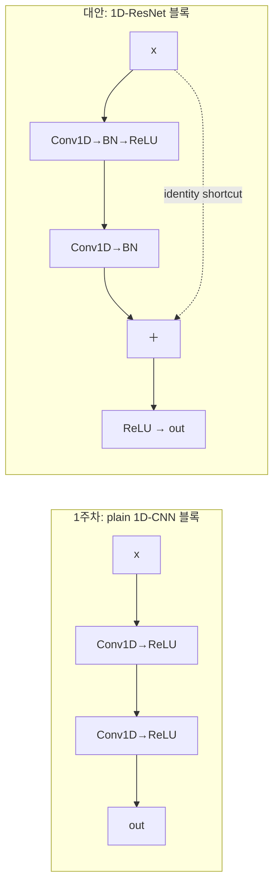
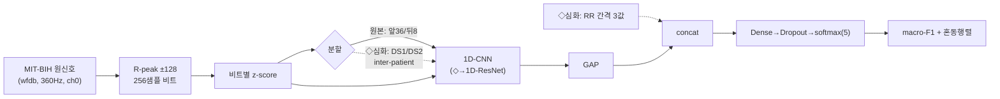

## Overview
1주차(`ailab-2026-0005`)는 **macro-F1 0.8273**으로 게이트를 통과했다. 하지만 회고에
"정확하게 안다는 개념은 아닌 것 같다"고 스스로 적었다 — 맞는 직감이다. **통과(진도)와
이해(깊이)는 다른 축**이고, 이 카드는 그 깊이 축을 채운다.

아래는 실제 노트북 `notebooks/ailab_week01_ecg_mitbih.ipynb`를 셀 단위로 다시 읽고
정리한 것이다. 순서는 요청한 A~E 그대로다:
- **A.** 1주차에 실제로 무엇을 했는가(코드 실측)
- **B.** 그 구조의 문제점·단점(왜 0.8273을 곧이곧대로 믿으면 안 되는가)
- **C.** 다른 구조·방식(무엇으로 바꾸면 무엇이 좋아지는가)
- **D.** 모델 자체의 더 깊은 이해(1D-CNN이 실제로 무엇을 보는가)
- **E.** 자동으로 이어서 공부할 로드맵(루틴이 매주 집어 주는 실험 큐)

> 정직성: A·B는 노트북 코드에 근거한 **사실**(confidence 높음). C·D·E의 수치 추정과
> 문헌 비교(예: inter-patient에서 S 클래스 붕괴)는 **해석·estimate**라 `confidence: medium`.
> 근거는 `## Resources`(de Chazal 2004 등)에 달았다.

## A. 1주차에 실제로 한 것 (코드 실측)
> ⚠️ 나는 네 **구글 코랩/드라이브에 직접 접근하지 못한다**. 아래는 repo에 커밋된 노트북과
> `state/ailab_progress.json`(통과 기록)에서 역산한 것이다. 코랩에서 셀을 바꿔 돌렸다면
> 그 차이는 알려줘야 반영된다.

셀별 실측 요약:

| 셀 | 한 일 | 실측 세부 |
|---|---|---|
| 1~4 | 준비 | Drive 마운트, repo clone, `wfdb`·TensorFlow 로드, 이번 주 주제 확인 |
| 6~7 | 데이터 | MIT-BIH **44개 레코드**(페이스 레코드 102/104/107/217 제외), **채널 0**만 사용. R-peak ±128 = **256 샘플**을 한 비트로, **비트별 z-score 정규화**. AAMI로 N/S/V/F/Q 매핑 |
| 7 | 분할 | `TRAIN=RECORDS[:36]`, `TEST=RECORDS[36:]` → **앞 36 / 뒤 8 레코드**로 자름 |
| 9 | 모델 | 1D-CNN: `Conv1D(32,7)→Pool→Conv1D(64,5)→Pool→Conv1D(128,3)→GAP→Dense(64)→Dropout(0.3)→Dense(5,softmax)` |
| 11 | 학습 | `class_weight='balanced'`, Adam, `sparse_categorical_crossentropy`, **metrics=accuracy**, `validation_split=0.1`, **epochs=8**, batch 256. 학습 후 **마지막 에폭 그대로 저장**(체크포인트 선택 없음) |
| 13 | 평가 | `f1_score(average='macro')` + 혼동행렬 + `classification_report` |
| 15 | 게이트 | `results.json` 저장 → `check_week.py`가 0.80과 비교해 통과 → 2주차로 진급 |

결과: **macro-F1 0.8273** / 클래스별 F1 **N 0.994 · V 0.978 · S 0.881 · F 0.840 · Q 0.444**.

## B. 구조의 문제점·단점
0.8273은 "통과"엔 충분하지만, **몇 가지가 그 숫자를 실제보다 좋게 보이게** 만든다.
우선순위 순으로.

1. **[핵심] 분할이 표준 inter-patient가 아니다.** 노트북은 레코드를 앞36/뒤8로 잘랐다.
   같은 레코드가 train/test에 섞이진 않으니 **환자 단위 분리 자체는 맞다**(좋다). 그러나
   이건 부정맥 연구의 사실상 표준인 **de Chazal DS1/DS2 inter-patient 분할이 아니다**.
   그래서 (a) 0.8273은 문헌 숫자와 **비교 불가**이고, (b) 테스트가 **단 8개 레코드**라
   분산이 크다. 특히 S 클래스 F1이 0.881로 나온 건 뒤 8개 레코드(222·232 등 APB가 많은
   특정 레코드) 구성이 **우연히 S에 유리**했을 가능성이 크다 — 표준 inter-patient에서
   S-F1은 보통 0.4~0.6로 무너진다(de Chazal). **즉 지금 점수는 "쉬운 시험지"로 받은 점수**.
2. **[핵심] S를 가르는 결정적 단서(RR 간격)를 구조적으로 못 본다.** 상심실성 조기박동(S)의
   본질은 **"빨리 온 박동"**(직전 RR이 짧음)인데, 노트북은 비트 하나(±128 샘플)만 보고
   **비트별로 정규화**한다. 즉 **앞뒤 박동과의 간격 정보가 입력에서 통째로 빠진다**. 고전
   feature 기반 연구(de Chazal)가 RR 간격을 최상위 feature로 쓰는 이유가 이것이다. 지금
   모델은 파형 모양만 보므로 **S는 원래부터 약할 수밖에 없다**(D의 수용영역 계산이 이를 뒷받침).
3. **[중간] 검증 분할이 대표성이 없다.** Keras `validation_split=0.1`은 **셔플 전 배열의
   뒤쪽 10%**를 val로 쓴다. `Xtr`은 레코드 순서대로 이어 붙였으니 val은 사실상 **마지막
   훈련 레코드(215)의 비트들**뿐 — 클래스 분포가 편향돼 val 지표가 못 미덥다. 게다가
   `ModelCheckpoint`/`EarlyStopping`이 없어 **마지막 에폭을 그냥 저장**한다. 대화에서 나온
   "CELL 6 체크포인트 기준을 macro-F1으로"는 정확한 지적인데, **지금은 애초에 무엇도 모니터
   하지 않는다**(훈련 accuracy만 찍힘).
4. **[중간] 지표 함정: 훈련은 accuracy로 본다.** N이 ~90%라 **전부 N이라 찍어도 accuracy
   ~0.9**다. 게이트는 macro-F1으로 봐서 다행이지만(좋은 설계), 학습 로그의 accuracy는
   진척을 오해하게 만든다.
5. **[중간] 단일 유도 + 유도 불일치.** `sig[:,0]`(채널 0)만 쓴다. MIT-BIH는 대부분 MLII지만
   일부 레코드는 유도 구성이 다르고(114는 유도가 뒤바뀜) — **서로 다른 유도를 한 통에 섞으면**
   숨은 교란이 된다. 2유도를 다 쓰거나 유도를 맞추면 견고해진다.
6. **[낮음] Q 클래스는 통계적으로 무의미.** 페이스 레코드를 뺐으니 test에 Q가 **3개(support=3)**
   뿐 → F1 0.444는 노이즈다. AAMI 관례대로 **N/S/V/F만 보고 Q는 따로** 두는 편이 정직하다.
7. **[낮음] 비트별 z-score는 진폭 정보를 버린다.** 일반화엔 도움되지만 **절대 진폭이 단서인
   융합박동(F)** 등에선 손해다 — trade-off로 인지하고 있어야 한다.

## C. 다른 구조·방식 (무엇을 바꾸면 무엇이 좋아지나)
"고치면 좋은 것"을 **효과/난이도**로. 위 문제 번호와 연결했다.

1. **표준 inter-patient 분할(DS1/DS2)** — *효과 최상 / 난이도 낮음* (B-1). de Chazal 목록으로
   `TRAIN/TEST`만 교체. 점수는 **떨어질 것**이고 그게 정상이다 — 커리큘럼이 노리는
   "공개 벤치마크와 정직하게 비교"의 본체.
2. **RR 간격 feature 추가** — *효과 최상 / 난이도 중간* (B-2). 비트마다 직전RR·직후RR·국소평균
   대비 비율(3값)을 뽑아 **GAP 뒤 벡터에 concat** → Dense로. S 클래스에 가장 큰 한 방.
3. **1D-ResNet으로 교체** — *효과 중간 / 난이도 중간* (D 참조). 잔차연결로 더 깊은 형태 표현.
   2주차(PTB-XL)가 이미 `1D-ResNet`이라 **지금 포팅하면 다음 주가 그대로 이어진다**.
4. **손실·불균형 전략 교체** — *효과 중간 / 난이도 낮음* (B 회고의 precision 손해). `class_weight`
   대신 **focal loss**(어려운 소수 클래스에 집중) 또는 **표적 증강**(시프트·진폭 스케일·기저선
   변동·가우시안 노이즈를 S·F에만) → recall을 올리면서 precision 손해를 줄인다.
5. **프레임워크를 PyTorch로 정렬** — *효과 중간(장기) / 난이도 중간* (C). ECG 공개 구현 대부분이
   PyTorch(PhysioNet Challenge 코드 등)라, CELL 5를 **PyTorch 1D-ResNet**으로 포팅해두면
   3주차 이후 "레포 뜯어보기"가 매끄럽다.
6. **문맥(rhythm) 모델** — *효과 중상 / 난이도 상* (B-2 확장). 비트 하나가 아니라 **이웃 비트
   시퀀스**를 RNN/1D-Transformer로 → RR 없이도 리듬 맥락을 복원. 상급 실습으로 큐에.
7. **평가·체크포인트 정비** — *효과 중간 / 난이도 낮음* (B-3,4). 커스텀 **macro-F1 콜백** +
   `ModelCheckpoint(monitor='val_macro_f1')` + `EarlyStopping`, **환자 분리된 val**을 명시적으로.

## D. 모델 심화 — 1D-CNN이 실제로 보는 것
1D-CNN을 "이미지 CNN의 1D판"으로만 알고 넘어가면 B-2의 약점이 왜 **구조적**인지 안 보인다.
**수용영역(receptive field)**을 실제로 계산해보자(공식 `RF += (k-1)·jump`, `jump ×= stride`):

| 층 | 커널/스트라이드 | 누적 수용영역 | jump |
|---|---|---|---|
| Conv1D k7 s1 | 7 / 1 | 7 | 1 |
| MaxPool 2 | 2 / 2 | 8 | 2 |
| Conv1D k5 s1 | 5 / 1 | 16 | 2 |
| MaxPool 2 | 2 / 2 | 18 | 4 |
| Conv1D k3 s1 | 3 / 1 | **26** | 4 |

→ GAP 직전 한 뉴런이 보는 폭은 **약 26 샘플 ≈ 72 ms**(360 Hz). QRS 폭(80~120 ms)에 겨우
걸치는 크기다. **결론: 이 모델은 "QRS 하나의 모양"까지만 본다** — 비트 사이 간격(RR)이나
P파–QRS 관계 같은 **더 긴 문맥은 애초에 시야 밖**. B-2의 S 약점이 우연이 아니라 **설계상
필연**임을 수용영역이 증명한다. (해결: 커널·깊이를 키워 RF를 넓히거나, RR을 **직접 feature로**
넣어 우회 — C-2가 후자다.)

**GAP(GlobalAveragePooling)**: 시간축 전체를 채널별 평균 한 값으로 접는다. 위치에 강건하고
파라미터가 없어 과적합에 강하지만, **"특징이 파형의 어디에서 났는지"를 버린다**. 단일 비트
분류엔 무난하나, 위치가 중요한 문제(예: ST 편위 시점)엔 부적합.

**1D-CNN → 1D-ResNet(왜 더 깊이 가나)**: 층을 무작정 쌓으면 gradient가 옅어져 **더 깊은데
더 못 배우는 degradation**이 온다. ResNet은 `출력 = F(x) + x`의 **항등 지름길**로 이를 푼다 —
"아무것도 안 해도(=항등) 최소한 이전 성능은 보장"하고, 그 위에 잔차 F(x)만 학습. 그래서
안전하게 깊어지고 RF도 넓어진다.

## E. 자동 학습 로드맵 (루틴이 매주 집어 주는 실험 큐)
아래는 "직접 하나씩 해보며 배우는" 순서다. **각 항목은 노트북에서 바로 돌릴 수 있는 실험 +
합격 기준**으로 썼다. F에서 만든 `/deepen-week` 루틴이 완료 주차를 감지해 이 큐를 **자동으로
카드에 얹어** 준다(사람이 코랩에서 실행 → `## My notes`에 결과 한 줄).

1. **inter-patient로 정직하게 재기** *(B-1, C-1)* — CELL 7의 `TRAIN/TEST`를 de Chazal DS1/DS2로
   교체하고 클래스별 F1을 다시 본다.
   - 합격: S·F가 얼마나 떨어지는지 **숫자로** `## My notes`에 기록(떨어지는 게 정상).
2. **평가·체크포인트 정비** *(B-3,4, C-7)* — 커스텀 macro-F1 콜백 + `ModelCheckpoint(monitor=
   'val_macro_f1')` + `EarlyStopping`, 셔플/환자분리된 val.
   - 합격: "마지막 에폭"이 아니라 **최고 val-macro-F1 에폭**이 저장됨을 로그로 확인.
3. **RR 간격 feature 추가** *(B-2, C-2)* — 직전/직후/국소평균비 3값을 GAP 뒤에 concat.
   - 합격: inter-patient 기준(1번) 대비 **S-F1 상승폭**을 기록.
4. **1D-ResNet 교체** *(C-3, D)* — CELL 5를 Keras 잔차 블록 3~4개로. 같은 split에서 비교.
   - 합격: 파라미터 수 대비 macro-F1 변화를 표로.
5. **PyTorch 포팅** *(C-5)* — 4번의 1D-ResNet을 PyTorch로 재현(같은 데이터·split).
   - 합격: Keras판과 **±0.02 이내**로 재현되면 프레임워크 이해 OK → 2주차부터 PyTorch.

> 우선순위: **1 → 2 → 3**이 "이해"의 핵심(왜 S가 어려운지 몸으로 안다). **4 → 5**는 2주차
> 진도와 자연스럽게 병합된다. 한 번에 다 하려 하지 말 것(1주차에 완벽주의로 진도 못 뺀 패턴을
> 스스로 경계했다) — **주당 1~2개**.

## Architecture
전체 파이프라인(원본 + 심화가 더하는 지점을 ◇로):

## Exercises
1. **재현**: 원본 노트북을 그대로 돌려 macro-F1·혼동행렬이 0.8273 근처인지 확인(기준선 고정).
2. **E-1 실행**: inter-patient(DS1/DS2)로 바꿔 클래스별 F1 하락을 관찰·기록.
3. **E-3 실행**: RR feature를 넣어 S-F1이 얼마나 회복되는지 측정.
4. **회고**: "왜 0.8273을 곧이곧대로 믿으면 안 되는가"를 한 문단으로 `## My notes`에.

## Resources
- 원본 카드: `content/ailab/ailab-2026-0005.md` · 노트북: `notebooks/ailab_week01_ecg_mitbih.ipynb`
- 데이터: https://physionet.org/content/mitdb/ · WFDB: https://github.com/MIT-LCP/wfdb-python
- **inter-patient 표준 분할·RR feature**: de Chazal et al., *IEEE TBME* 2004 (DS1/DS2, RR 간격 feature의 고전)
- AAMI EC57(N/S/V/F/Q 5군 매핑) · 멘토 논의: `content/ailab/mentor/mentor-2026-W28.md`
- 이 카드를 만든 파이프라인: `pipelines/deepen.py` + `/deepen-week` 스킬

## My notes
<!-- 여기에 각 실험(E-1~E-5) 결과를 한 줄씩 남기면 다음 /deepen-week·/ai-mentor 회차가 이어받는다.
     예: "E-1 inter-patient: S-F1 0.881 → 0.47로 하락 확인(예상대로). F도 0.84→0.51."
         "E-3 RR feature 추가: S-F1 0.47 → 0.63. RR이 결정적이라는 걸 몸으로 확인." -->
