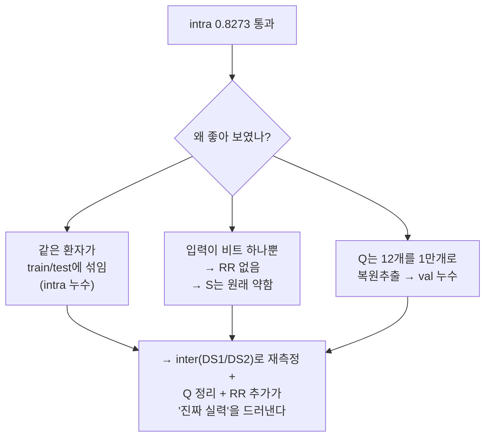
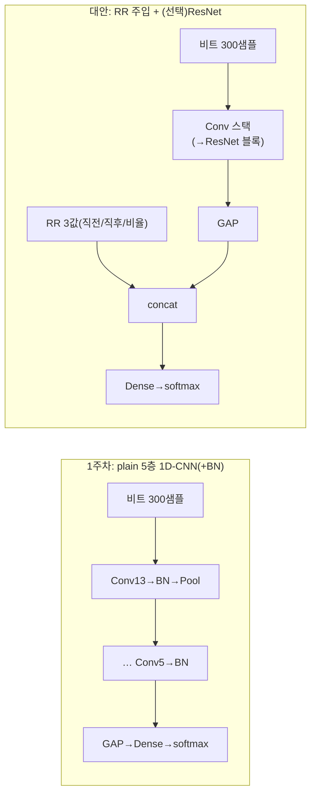
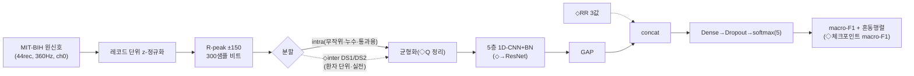

## Overview
1주차는 **macro-F1 0.8273**으로 게이트를 통과했다. 하지만 회고에 "정확하게 안다는 개념은
아닌 것 같다"고 스스로 적었다 — 맞는 직감이다. **통과(진도)와 이해(깊이)는 다른 축**이고,
이 카드가 그 깊이 축을 채운다. 순서는 요청한 A~E 그대로다.

> **이 카드는 실제 노트북 `notebooks/week01_ecg_1dcnn.ipynb`를 셀 단위로 읽고 다시 썼다**
> (실행 로그 `ailab-2026-0008` 기준 — 예측 아님). 이전 판은 repo의 낡은 노트북을 보고
> **추측**해 창 크기·정규화·모델 깊이·체크포인트 유무가 어긋났었다. 실행 로그 루프
> (`pipelines/ingest_run.py`)를 도입해 그 예측을 제거했다.

## A. 1주차에 실제로 한 것 (코드 실측)
셀별 실측 요약(`week01_ecg_1dcnn.ipynb`):

| 셀 | 한 일 | 실측 세부 |
|---|---|---|
| 2 | 설정 | `SPLIT="intra"`(기본), 창 `WIN_BEFORE=WIN_AFTER=150` → **300 샘플(≈0.83초)**, `BALANCE_T=10000`, `EPOCHS=40`. de Chazal **DS1/DS2 목록 내장** |
| 3 | 데이터 | MIT-BIH **44 레코드**(페이스 102/104/107/217 제외), **채널 0**, **레코드 단위 z-정규화**. `intra`=전체 비트를 모아 `train_test_split(stratify, test 0.2)`, `inter`=DS1(train)/DS2(test) |
| 4 | 균형화 | 학습셋을 클래스마다 **10000개로 리샘플**(부족분은 복원추출) → 50000개. 테스트는 자연분포 유지. class_weight 계산(균형 후라 **전부 1.0**), **블록이 중복** |
| 5 | 모델 | **1D-CNN 5층**: Conv 32·64·128·256·512(커널 13·11·9·7·5, `padding=same`) 각 **BatchNorm**+Pool → GAP → Dense64 → Dropout0.2 → softmax(5). **≈102만 파라미터** |
| 6 | 학습 | Adam, `sparse_categorical_crossentropy`, **metrics=accuracy**, `validation_split=0.3`, `EarlyStopping/ModelCheckpoint(monitor=val_accuracy, restore_best)`, batch 128, class_weight(=1.0) |
| 7 | 평가 | `f1_score(macro)` + 혼동행렬 + classification_report |
| 8 | 저장 | 베스트 가중치·혼동행렬·`result.json`을 Drive에 저장 |

결과 — **intra(통과) vs inter(실전) 실측 비교** (이제 둘 다 돌려서 숫자가 붙었다):

| 클래스 | intra F1 | inter F1(DS2) | 변화 |
|---|---|---|---|
| N 정상계열 | 0.993 | 0.913 | −0.08 |
| S 상심실성 | 0.871 | **0.179** | **−0.69 붕괴** |
| V 심실성 | 0.968 | 0.631 | −0.34 |
| F 융합 | 0.822 | **0.005** | **−0.82 붕괴** |
| Q 미분류 | 0.222 | 0.000 | (support 7 — 무의미) |
| **macro-F1** | **≈0.83** | **0.346** | **−0.48** |

> intra=무작위 20% test(같은 환자 누수), inter=de Chazal **DS2 환자 단위**(support가 교과서 DS2와
> 정확히 일치: N 44238·S 1837·V 3220·F 388·Q 7). 로그: `ailab-2026-0008`(intra)·`ailab-2026-0010`(inter).
> intra 클래스별은 intra-test 실행 기준(그 실행의 macro는 Q 때문에 0.775, 게이트 통과 실행은 0.827).

**이게 이 심화의 결론이다**: S·F가 **0.87/0.82 → 0.18/0.005로 무너진 것**이 B-2(RR 부재)의 직접
증거다. V는 0.63으로 상대적으로 버티는데, 심실성 이소성 박동(VEB)은 **형태가 환자와 무관하게
뚜렷**하기 때문이다. 반면 S(상심실성)·F(융합)는 **형태만으론 정상과 구분이 안 돼**, 간격(RR)
정보 없이는 새 환자에서 붕괴한다. 노트북 주석의 "보통 0.5~0.65" 추정보다도 낮게(0.346) 나온 건
F까지 거의 0으로 무너졌기 때문이다.

## B. 구조의 문제점·단점
0.8273은 "통과"엔 충분하지만, **몇 가지가 그 숫자를 실제보다 좋게** 만든다. 우선순위 순.

1. **[핵심] `intra` 분할은 같은 환자가 train/test에 섞인다(누수).** 기본값 `intra`는 44 레코드의
   비트를 **전부 모아** 무작위로 8:2로 가른다. 같은 환자의 다른 비트가 양쪽에 들어가므로,
   모델이 **환자 고유의 파형 버릇을 외워** 점수가 부푼다. 즉 0.8273은 "파이프라인이 돈다"는
   증거이지 **"새 환자에 일반화한다"는 증거가 아니다**. 노트북이 이걸 정직하게 명시하고
   `inter`(DS1/DS2, 환자 단위)를 내장해 "보통 0.5~0.65로 떨어진다"고 적어둔 건 아주 좋은
   태도다. **→ 실제로 돌려 확인됨**(E-1 완료): macro **0.83 → 0.346**, S·F는 사실상 붕괴(위 표).
   Q 제외 N/S/V/F macro도 0.432에 그친다. 즉 intra 통과는 "파이프라인이 돈다"였을 뿐이다.
2. **[핵심] S를 가르는 RR 간격을 여전히 못 본다.** 창이 300 샘플(한 비트)이고 **레코드 단위로
   정규화**하지만, 입력은 **비트 하나**뿐이라 앞뒤 박동과의 **시간 간격(RR)이 통째로 빠진다**.
   상심실성 조기박동(S)의 본질은 "빨리 온 박동"(짧은 직전 RR)인데 모델은 그걸 볼 창구가 없다.
   그래서 5층으로 깊어져도 **S는 `inter`에서 무너질 수밖에 없다**(D의 수용영역 논의 참조).
3. **[중간] Q 클래스는 사실상 학습·측정 불가.** Q는 전체 **12개**뿐인데 리샘플에서 **복원추출로
   10000개까지** 부풀린다 → 같은 ~10개 비트를 수천 번 반복. `validation_split=0.3`도 같은 풀에서
   뽑으니 **train/val에 동일 Q 비트가 겹쳐**(누수) val 지표가 무의미하고, 테스트엔 Q가 극소수.
   → **Q는 빼고 N/S/V/F만 보고**하거나, 최소한 Q는 강제 균형에서 제외한다.
4. **[중간] 불균형 전략이 이중이고 하나는 무효.** CELL 4에서 클래스를 균일(10000)로 리샘플한
   **뒤** class_weight를 계산하면 값이 **전부 1.0** → `fit(class_weight=...)`가 아무 일도 안 한다.
   게다가 그 블록이 **복사되어 두 번** 있다. 리샘플 **또는** class_weight 중 하나만 쓰고 중복 제거.
5. **[중간] 체크포인트 기준이 `val_accuracy`.** 균형 val에선 accuracy가 그럭저럭이지만, **게이트·
   테스트는 자연분포에서 macro-F1**으로 채점한다. 기준이 어긋나면 최고 macro-F1이 아닌 에폭이
   저장될 수 있다 → **자연분포(또는 환자 분리) val에 macro-F1**으로 모니터하는 게 일관적.
6. **[낮음] 단일 유도·유도 불일치.** 채널 0만 쓴다. 대부분 MLII지만 일부 레코드는 유도 구성이
   달라 섞이면 숨은 교란. 2유도를 쓰거나 유도를 맞추면 견고해진다.

## C. 다른 구조·방식 (무엇을 바꾸면 무엇이 좋아지나)
효과/난이도로. 위 문제 번호와 연결.

1. **`SPLIT="inter"`로 정직하게 재기** — *효과 최상 / 난이도 최저* (B-1). 이미 내장돼 있으니
   **한 줄만 바꾸면** 된다. 떨어지는 게 정상이고, 그 하락폭이 곧 "일반화 갭"이다.
2. **Q 정리** — *효과 중상 / 난이도 낮음* (B-3). Q를 빼고 N/S/V/F 4클래스로 보거나, Q를 균형에서
   제외. 지표가 정직해진다.
3. **불균형 전략 단일화** — *효과 중간 / 난이도 최저* (B-4). 리샘플 **또는** focal loss/class_weight
   중 하나만. 중복 블록 제거. (S 표적 증강: 시프트·진폭 스케일·기저선 변동·노이즈)
4. **RR 간격 feature 추가** — *효과 최상 / 난이도 중간* (B-2). 직전RR·직후RR·국소평균 대비 3값을
   **GAP 뒤 벡터에 concat**. `inter`에서 S를 살리는 최대 지렛대.
5. **체크포인트를 macro-F1로** — *효과 중간 / 난이도 낮음* (B-5). 커스텀 macro-F1 콜백 +
   `ModelCheckpoint(monitor='val_macro_f1')`, 자연분포/환자 분리 val.
6. **1D-ResNet · PyTorch 정렬** — *효과 중간(장기) / 난이도 중간*. 2주차(PTB-XL)가 `1D-ResNet`이고
   ECG 공개 구현 대부분이 PyTorch라, 지금 잔차 블록/PyTorch로 포팅해두면 다음 주가 이어진다.

## D. 모델 심화 — 이 5층 CNN이 실제로 보는 것
이전 판은 "수용영역이 ~26샘플이라 QRS도 겨우 본다"고 썼는데, **그건 낡은 3층 노트북 얘기라
틀렸다.** 실제 5층 모델의 수용영역을 다시 계산하자(공식 `RF += (k-1)·jump`, `jump ×= stride`):

| 층 | 커널/풀 | 누적 RF | jump |
|---|---|---|---|
| Conv k13 → Pool2 | | 14 | 2 |
| Conv k11 → Pool2 | | 36 | 4 |
| Conv k9 → Pool2 | | 72 | 8 |
| Conv k7 → Pool2 | | 128 | 16 |
| Conv k5 → GAP | | **≈192** | 16 |

→ 깊은 뉴런의 수용영역은 **약 192 샘플 ≈ 0.53초**로, 입력 창(300 샘플)의 대부분을 덮는다.
**즉 이 모델은 "한 비트의 QRS-T 모양 전체"를 충분히 본다** — 형태 표현력은 부족하지 않다.
**병목은 RF가 아니라 입력 창의 틀**이다: 창이 **R-peak ±150 = 비트 하나**라, 아무리 RF가 커도
**옆 박동(=RR 간격)은 창 밖**이다. 그래서 B-2의 S 약점은 "모델이 얕아서"가 아니라 **"입력이
비트 하나라서"** 생긴다 — 해결은 깊이가 아니라 **입력에 RR을 직접 넣는 것**(C-4)이다.

**GAP**: 시간축 전체를 채널별 평균으로 접어 위치를 버린다. 단일 비트 분류엔 무난.
**BatchNorm**: 층마다 활성 분포를 정규화해 학습을 안정화·가속(이 노트북이 40에폭을 안전하게
도는 이유 중 하나). **1D-ResNet(왜 더 깊이 가나)**: 층을 더 쌓으면 gradient가 옅어지는데,
`출력=F(x)+x`의 항등 지름길이 "최소한 이전 성능은 보장"해 안전하게 깊어진다. 다만 여기선
**깊이보다 입력(RR)·분할(inter)·라벨(Q)** 이 더 큰 지렛대다.

## E. 자동 학습 로드맵 (실행 로그로 쌓이는 실험 큐)
각 항목은 노트북에서 바로 돌릴 **실험 + 합격 기준**이다. 돌린 결과는 `ingest_run.py`로 **실행
로그**(`kind: log`)로 박으면, 다음 `/deepen-week`가 그 실제 코드/수치를 예측 없이 이어받는다.

1. **`SPLIT="inter"`로 재측정** *(B-1,C-1)* — ✅ **완료**: macro 0.83→0.346, S 0.87→0.18,
   F 0.82→0.005 (로그 `ailab-2026-0010`). 다음은 이 무너진 S·F를 아래 2~4로 되살리는 것.
2. **Q 정리** *(B-3,C-2)* — Q 제외(N/S/V/F) 또는 균형에서 빼고 다시.
   - 합격: 클래스별 F1이 "측정 가능한" 숫자가 됨(Q 누수 제거).
3. **불균형 전략 단일화 + 체크포인트 macro-F1** *(B-4,5)* — 중복/무효 class_weight 제거,
   monitor를 macro-F1으로.
   - 합격: 최고 val-macro-F1 에폭이 저장됨을 로그로 확인.
4. **RR 간격 feature 추가** *(B-2,C-4)* — 3값을 GAP 뒤에 concat.
   - 합격: `inter` 기준 대비 **S-F1 상승폭** 기록.
5. **1D-ResNet · PyTorch 포팅** *(C-6)* — 같은 데이터·split에서 재현.
   - 합격: Keras판과 ±0.02 이내 재현 → 2주차부터 PyTorch.

> 우선순위: **1 → 2 → 3**이 "정직한 숫자"를 만들고, **4**가 S의 실력을 올리고, **5**는 2주차와
> 병합된다. 한 번에 다 하지 말 것 — **주당 1~2개**, 매번 실행 로그로.

## Architecture
전체 파이프라인(원본 + 심화가 더하는 지점을 ◇로):

## Exercises
1. **재현**: `intra`로 그대로 돌려 macro-F1이 0.8273 근처인지 확인(기준선 고정).
2. **E-1 실행**: `SPLIT="inter"`로 바꿔 클래스별 F1 하락을 관찰하고 `ingest_run.py`로 로그.
3. **E-4 실행**: RR feature를 넣어 `inter`에서 S-F1이 얼마나 회복되는지 측정.
4. **회고**: "왜 intra 0.8273을 곧이곧대로 믿으면 안 되는가"를 한 문단으로 `## My notes`에.

## Resources
- 실제 노트북: `notebooks/week01_ecg_1dcnn.ipynb` · 실행 로그: `content/ailab/logs/ailab-2026-0008.md`
- 원 실습 카드: `content/ailab/ailab-2026-0005.md` · 데이터: https://physionet.org/content/mitdb/
- **inter-patient 표준 분할·RR feature**: de Chazal et al., *IEEE TBME* 2004 (DS1/DS2, RR 간격 feature의 고전)
- AAMI EC57(N/S/V/F/Q 5군 매핑) · 멘토 논의: `content/ailab/mentor/mentor-2026-W28.md`
- 이 카드를 만든 파이프라인: `pipelines/deepen.py` + `pipelines/ingest_run.py` + `/deepen-week`

## My notes
<!-- 각 실험(E-1~E-5) 결과를 한 줄씩. 실행 로그(ingest_run.py)로도 남기면 자동으로 이어받는다.
     예: "E-1 inter: intra 0.8273 → 0.58로 하락. S/F가 특히 무너짐(예상대로)."
         "E-4 RR feature: inter S-F1 0.4x → 0.6x. RR이 결정적이라는 걸 확인." -->
