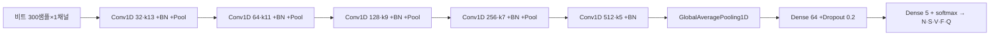
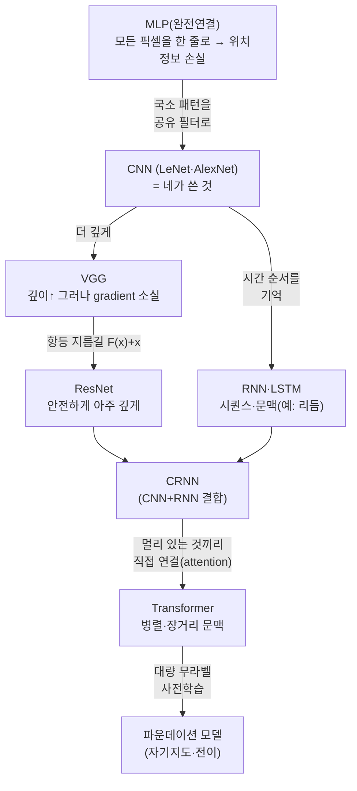

## Overview
1주차에 돌린 게 **정확히 어떤 모델인지**, 그리고 노트북에 나온 `val_accuracy`·`checkpoint`·
`PyTorch` 같은 말들이 뭔지, 나아가 **이런 모델이 어떻게 발전해왔는지**를 한 장에 정리한다.
예시는 전부 네 노트북 `week01_ecg_1dcnn.ipynb`에서 가져왔다(추상론이 아니라 네 코드로).

이 카드는 개념 참고서다 — 1주차에 걸어두었지만 2주차 이후에도 계속 돌아와 보는 용도.

## 내가 쓴 모델: CNN이란
네가 쓴 건 **CNN(Convolutional Neural Network, 합성곱 신경망)**, 그중 신호(1차원)용인
**1D-CNN**이다. 핵심 부품 4개만 알면 된다.

- **Convolution(합성곱) / Kernel(커널·필터)**: 작은 창(예: `Conv1D(32, 13)`의 길이 13짜리)
  하나를 신호 위로 **미끄러뜨리며** 국소 모양을 훑는다. "이 구간이 QRS처럼 뾰족한가?"를 재는
  **패턴 탐지기**. 32개면 32가지 패턴을 동시에 본다.
- **Feature map(특징 지도)**: 커널이 훑고 남긴 반응값의 배열. "어디서 그 패턴이 강했나"의 지도.
- **Pooling(풀링, `MaxPooling1D(2)`)**: 특징 지도를 **절반으로 요약**. 시야를 넓히고 계산을 줄이며
  위치가 조금 달라도 견디게(translation invariance) 한다.
- **깊이(층 쌓기)**: 앞층은 잔파형·기울기 같은 **저수준** 특징을, 뒷층은 그것들을 조합한
  **고수준**(비트 모양 전체)을 본다. 네 모델은 이걸 5번 쌓았다(32→64→128→256→512).

마지막에 **GAP**(시간축 평균)로 한 벡터로 접고, **Dense(완전연결)+softmax**로 5개 클래스
확률을 낸다. 이미지용 2D-CNN과 원리는 같고 **축이 시간 1개**라는 것만 다르다.

## Architecture
네 1D-CNN의 데이터 흐름(1주차 실측):



## 학습 용어 사전 (네 노트북 어디에 있나)
CELL 6(학습)에서 쏟아진 말들의 뜻. **"어디서"** 칸이 네 코드의 위치다.

| 용어 | 뜻 | 네 노트북 어디서 |
|---|---|---|
| **epoch(에폭)** | 학습 데이터를 처음부터 끝까지 **한 바퀴** 도는 것 | `EPOCHS=40` — 최대 40바퀴 |
| **batch(배치)** | 한 번에 모델에 넣는 표본 묶음(가중치 1회 갱신 단위) | `batch_size=128` |
| **loss(손실)** | "얼마나 틀렸나"의 숫자. 학습은 이걸 **줄이는** 방향 | `loss="sparse_categorical_crossentropy"` |
| **optimizer(옵티마이저)** | 손실을 줄이려 가중치를 **어떻게** 바꿀지의 규칙 | `optimizer="adam"`(가장 무난한 기본값) |
| **accuracy(정확도)** | 맞힌 비율. 불균형에선 함정(전부 N만 찍어도 높음) | `metrics=["accuracy"]` |
| **validation_split / val\_** | 학습셋 일부를 떼어 **학습 중 채점**용으로. `val_` 접두사가 그 점수 | `validation_split=0.3` |
| **val_accuracy** | **한 번도 학습에 안 쓴** 검증셋에서의 정확도 | EarlyStopping/체크포인트가 이걸 본다 |
| **overfitting(과적합)** | 학습셋만 외워 새 데이터에 약해짐. `accuracy↑`인데 `val_accuracy↓`면 신호 | Dropout·BN이 이걸 억제 |
| **checkpoint(체크포인트)** | 학습 도중 **가장 좋은 순간의 가중치**를 파일로 저장 | `ModelCheckpoint(CKPT, monitor="val_accuracy", save_best_only=True)` |
| **early stopping** | 검증 점수가 더 안 오르면 **일찍 멈춤**(시간 절약·과적합 방지) | `EarlyStopping(patience=6, restore_best_weights=True)` |
| **class_weight** | 드문 클래스에 가중치를 더 줘 불균형 보정 | CELL 4 (단, 균형화 후라 지금은 1.0=무효) |

## accuracy vs val_accuracy vs macro-F1 (왜 셋을 구분하나)
같은 "잘한다"라도 **어디서 재느냐**가 다르다.

- **accuracy**(train): 학습셋에서 맞힌 비율 → 외우기만 해도 높다. **믿으면 안 됨**.
- **val_accuracy**: 학습 중 안 본 검증셋 → 과적합 감지·체크포인트 선택용. 네 로그에서
  0.99까지 올랐다.
- **macro-F1**(test): 최종 시험. 클래스별 F1의 **단순 평균**이라 소수 클래스(S·F·Q)도 공평히
  본다. 그래서 accuracy 0.986인데 **macro-F1은 0.775**로 낮게 나온다(Q가 끌어내림).
  → **불균형 문제에선 게이트를 macro-F1으로 잡는 이유**가 이것.

> 핵심: 체크포인트는 `val_accuracy`로 고르는데 게이트는 `macro-F1`으로 채점한다 →
> 기준이 어긋난다. 심화 카드(`ailab-2026-0007` B-5)에서 "체크포인트도 macro-F1으로"라고
> 짚은 게 이 얘기다.

## 프레임워크: Keras/TensorFlow vs PyTorch
둘 다 **딥러닝을 짜는 라이브러리**다. 모델의 수학은 같고, **쓰는 문법**이 다르다.

- **TensorFlow/Keras**(네가 쓴 것): `models.Sequential([...])`처럼 **레고 블록 쌓듯** 간결. 입문·
  프로토타입에 빠르다. `model.fit()` 한 줄로 학습 루프가 돈다.
- **PyTorch**: 학습 루프(순전파→손실→역전파→갱신)를 **직접 for문으로** 쓴다. 더 손이 가지만
  **내부가 투명**해 디버깅·연구에 강하다. **공개 의료 AI 구현의 대부분이 PyTorch**라(PhysioNet
  Challenge, timm, MONAI 등), 레포를 뜯어보려면 PyTorch를 읽을 줄 알아야 한다.

같은 한 층을 두 문법으로:
```python
# Keras
layers.Conv1D(32, 13, padding="same", activation="relu")
# PyTorch (대응)
import torch.nn as nn
nn.Conv1d(in_channels=1, out_channels=32, kernel_size=13, padding="same"); nn.ReLU()
```
→ 2주차가 `1D-ResNet`이고 공개 구현이 PyTorch라, 한 번 포팅해두면 이후가 매끄럽다
(심화 카드 C-6).

## 모델은 어떻게 발전해왔나 (구조 발전사)
네 CNN은 큰 계보의 한 지점이다. **각 단계는 앞 단계의 한계를 풀며** 나왔다.



ECG로 구체화하면: **1D-CNN(1주차)** → **1D-ResNet(2주차, PTB-XL)** → **CRNN**(형태+리듬) →
**ECG Transformer** → **ECG 파운데이션 모델**(대량 무라벨로 사전학습 후 소량 라벨 미세조정).
핵심 흐름 = "국소 형태(CNN) → 더 깊이(ResNet) → 시간 문맥(RNN/Attention) → 라벨 없이 배우기".

## 자료·구조도 (어디서 더 보나)
- **개념 교과서**: *Dive into Deep Learning* https://d2l.ai (코드로 배우는 무료 책, CNN·ResNet·
  Transformer 장) · Stanford **CS231n** https://cs231n.github.io (CNN의 정석)
- **프레임워크**: Keras 가이드 https://keras.io/guides · PyTorch 튜토리얼 https://pytorch.org/tutorials
- **SOTA 추적·구조도**: Papers With Code — ECG 분류 https://paperswithcode.com/task/ecg-classification
  (최신 모델·순위·코드가 한눈에)
- **랜드마크 논문**: ResNet(He 2015, arXiv:1512.03385) · Transformer "Attention Is All You Need"
  (Vaswani 2017, arXiv:1706.03762) · **ECG 딥러닝**: Hannun & Rajpurkar et al., *Nature Medicine*
  2019(심장전문의 수준 부정맥 검출) · 리뷰: Hong et al. 2020 "Deep learning for ECG: a review"
- **MedKOS 내부**: 심화 `ailab-2026-0007` · 실행 로그 `ailab-2026-0008` · 뇌종양 분할 `ailab-2026-0002`

## Exercises
1. **용어 찾기**: CELL 6에서 epoch·batch·loss·val_accuracy·checkpoint·early stopping을 각각 짚어본다.
2. **왜 macro-F1?**: accuracy 0.986 vs macro-F1 0.775가 왜 벌어지는지 한 문장으로 `## My notes`에.
3. **PyTorch 눈 익히기**: 위 Conv1d 한 줄을 보고, 네 5층을 PyTorch `nn.Sequential`로 상상해 적어본다.
4. **발전사 위치**: 2주차 1D-ResNet이 위 도식에서 어디인지 표시하고, "무슨 한계를 푸는가" 한 줄.

## Resources
- *Dive into Deep Learning* https://d2l.ai · CS231n https://cs231n.github.io
- Keras https://keras.io/guides · PyTorch https://pytorch.org/tutorials
- Papers With Code(ECG) https://paperswithcode.com/task/ecg-classification
- ResNet arXiv:1512.03385 · Transformer arXiv:1706.03762 · Hannun *Nat Med* 2019

## My notes
<!-- 헷갈렸던 용어나 "아 이거였구나" 한 줄을 남겨두면 다음 학습에 이어진다. -->
