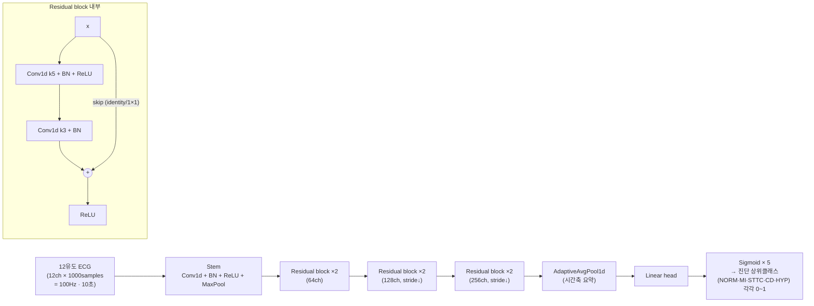

## Overview
커리큘럼 **2주차**. 1주차(MIT-BIH·1D-CNN·단일 비트)에서 배운 신호 딥러닝을 **실제 규모**로
키운다. 이번엔 한 비트가 아니라 **10초짜리 12유도 심전도 한 장**을 통째로 보고, 이 심전도에
**어떤 진단들이 붙는가**를 동시에 맞힌다 — 라벨이 하나가 아닌 **다중라벨(multi-label)** 문제다.

> **1주차와 무엇이 달라지나** (여기가 2주차의 핵심 학습 포인트):
> - **입력**: 1채널 300샘플 한 비트 → **12채널 1000샘플(100Hz·10초) 한 기록**.
> - **출력**: softmax 단일 선택(5택1) → **sigmoid 다중라벨**(각 진단이 독립적으로 0/1).
> - **손실**: `sparse_categorical_crossentropy` → **`BCEWithLogitsLoss`**(라벨마다 이진).
> - **지표**: macro-F1 → **macro-AUROC**(임계값에 안 흔들리는, 다중라벨의 표준 지표).
> - **모델**: plain 1D-CNN → **1D-ResNet**(잔차 연결로 안전하게 더 깊게 — 1주차 발전사의 다음 칸).

- **왜 이걸 2주차로**: 1주차 개념 카드(`ailab-2026-0009`)의 발전사에서 **CNN → ResNet**이
  바로 다음 단계였다. 데이터도 커지고(2만 건), 라벨 구조도 실제 임상처럼 복잡해져
  "다중라벨·불균형·AUROC"라는 임상 AI의 3대 감각을 실제 규모에서 처음 만난다.
- **기존 접근**: PTB-XL 벤치마크(Strodthoff 2021)가 사실상 표준 레퍼런스다. `resnet1d_wang`·
  `xresnet1d101`·`inception1d` 등을 같은 프로토콜로 비교했고, 상위 클래스 진단에서 macro-AUROC
  **0.92~0.93**을 보고한다. 이 공개 구현을 **직접 받아 뜯어보는** 것이 프로젝트 카드
  `ailab-2026-0013`이다.

## Architecture
1D-ResNet = 1주차 1D-CNN에 **잔차(residual) 지름길** `출력 = F(x) + x`를 더한 것.
층을 더 깊이 쌓아도 gradient가 옅어지지 않아 "형태(morphology)"를 더 정교하게 뽑는다.



## Data
- **PTB-XL**(PhysioNet, 오픈, **CC BY 4.0**): 18,885명 환자의 **21,837건 · 12유도 · 10초** 심전도.
  1주차 MIT-BIH와 달리 **가입 없이 바로** 받는다(`datasets.py`의 `ptb-xl`). MedKOS가 이미 12유도
  렌더(`assets/ecg`)에 쓰는 그 데이터셋이다.
- **두 해상도**: `records100`(100Hz, 12×1000) / `records500`(500Hz, 12×5000). 입문·Colab에는
  **100Hz**가 가볍고 충분하다.
- **라벨 구조(SCP-ECG)**: 각 기록에 여러 SCP 코드가 붙고, `scp_statements.csv`가 이를
  **상위 5개 진단군**으로 묶어준다 — **NORM**(정상)·**MI**(심근경색)·**STTC**(ST/T 변화)·
  **CD**(전도장애)·**HYP**(비대). 한 심전도에 여러 개가 동시에 참(→ 다중라벨).
- **표준 분할**: PTB-XL은 `strat_fold` 열로 10겹 층화 분할을 **미리 제공**한다.
  관례상 **fold 1–8 = train, 9 = validation, 10 = test**. (1주차의 환자 누수 교훈이 이미
  데이터에 반영돼 있어, 이걸 그대로 쓰면 환자 단위 분리가 지켜진다.)
- **전처리**: 유도별/기록별 표준화, (선택) 0.5–40Hz 대역 필터. 라벨은 5차원 **멀티핫 벡터**.

## Code walkthrough
아래는 이번 주 노트북(`week02_ptbxl_resnet1d.ipynb`)의 **대표 골격**(PyTorch). 전체는
Colab에서 실행하고, 원본 벤치마크 구현과의 대조는 `ailab-2026-0013`에서 한다.

```python
import torch, torch.nn as nn
from sklearn.metrics import roc_auc_score

class BasicBlock1d(nn.Module):                     # 잔차 블록 = 2주차의 핵심
    def __init__(self, cin, cout, stride=1):
        super().__init__()
        self.conv1 = nn.Conv1d(cin, cout, 5, stride, padding=2, bias=False)
        self.bn1   = nn.BatchNorm1d(cout)
        self.conv2 = nn.Conv1d(cout, cout, 3, 1, padding=1, bias=False)
        self.bn2   = nn.BatchNorm1d(cout)
        self.down  = (nn.Sequential(nn.Conv1d(cin, cout, 1, stride, bias=False),
                                    nn.BatchNorm1d(cout))
                      if stride != 1 or cin != cout else None)
    def forward(self, x):
        idt = x if self.down is None else self.down(x)
        x = torch.relu(self.bn1(self.conv1(x)))
        x = self.bn2(self.conv2(x))
        return torch.relu(x + idt)                 # F(x) + x  ← 잔차 지름길

class ResNet1d(nn.Module):
    def __init__(self, n_classes=5, in_ch=12):
        super().__init__()
        self.stem = nn.Sequential(nn.Conv1d(in_ch, 64, 7, 2, 3, bias=False),
                                  nn.BatchNorm1d(64), nn.ReLU(), nn.MaxPool1d(2))
        self.layer1 = nn.Sequential(BasicBlock1d(64, 64),  BasicBlock1d(64, 64))
        self.layer2 = nn.Sequential(BasicBlock1d(64, 128, 2), BasicBlock1d(128, 128))
        self.layer3 = nn.Sequential(BasicBlock1d(128, 256, 2), BasicBlock1d(256, 256))
        self.head   = nn.Sequential(nn.AdaptiveAvgPool1d(1), nn.Flatten(),
                                    nn.Linear(256, n_classes))   # logits (sigmoid는 손실에서)
    def forward(self, x):                          # x: (B, 12, 1000)
        return self.head(self.layer3(self.layer2(self.layer1(self.stem(x)))))

model = ResNet1d(n_classes=5, in_ch=12)
loss_fn = nn.BCEWithLogitsLoss()                   # 다중라벨: 라벨마다 독립 이진
# ... 학습 루프(순전파→BCE→역전파→step) ...
probs = torch.sigmoid(model(X_test))               # (N, 5) 진단별 확률
macro_auroc = roc_auc_score(y_test, probs.numpy(), average="macro")
```

## Instructions
> 1주차 `## Instructions` 표와 같은 방식. **다중라벨·ResNet에서 새로 등장하는 지시어**에 집중.

| 지시어(코드) | 무엇을 시키는가 | 왜 (1주차와 무엇이 다른가) |
|---|---|---|
| `nn.Conv1d(12, 64, 7, 2)` | 12유도를 **입력 채널 12개**로 받아 시간축을 훑어라 | 1주차는 1채널, 이번엔 **유도 12개를 채널로** 동시에 본다 |
| `x + idt` (잔차) | conv 출력에 **입력을 그대로 더하라** | ResNet의 심장. "최소한 이전 성능 보장"으로 깊이를 안전하게 |
| `self.down = Conv1d(...,1,stride)` | 채널·길이가 바뀌면 지름길도 **1×1로 맞춰라** | skip 연결의 모양을 맞추는 실무 디테일 |
| `nn.AdaptiveAvgPool1d(1)` | 시간축 전체를 하나로 평균 | 1주차 `GlobalAveragePooling1D`의 PyTorch판 |
| `Linear(256, 5)` + **sigmoid** | 진단 **5개 각각**의 확률을 내라(서로 배타 아님) | softmax(5택1)와 결정적으로 다름 — **동시 참** 허용 |
| `BCEWithLogitsLoss()` | 라벨마다 **독립 이진 교차엔트로피**로 채점 | 다중라벨의 표준 손실. `pos_weight`로 불균형 보정 가능 |
| `roc_auc_score(..., average="macro")` | 진단별 AUROC를 구해 **단순 평균** | 임계값에 안 흔들려 다중라벨·불균형에 견고 → **게이트 지표** |
| `strat_fold` 슬라이싱 | fold 9=val, 10=test로 **환자 단위 분리** | 1주차 최대 교훈(누수 금지)이 데이터에 내장돼 있음 |

**한눈 요약**: `Conv1d(12ch)`가 12유도를 보고 → **잔차 블록**이 깊게 형태를 뽑고 →
`AvgPool`이 요약하고 → `sigmoid×5`가 진단별로 칠하고 → `BCE`가 라벨마다 채점하고 →
`macro-AUROC`가 최종 시험을 매긴다.

## Gate
- **기준**: `macro_auroc ≥ 0.85` (상위 5진단군 다중라벨, PTB-XL 표준 분할 test=fold 10)
- **산출물**: 상위클래스 다중라벨 **macro-AUROC + 클래스별 AUROC 표**(+ 체크포인트를 Drive에)
- **판정/진급**:
  ```bash
  # 노트북이 남긴 결과로 판정(통과 시 자동으로 3주차로)
  python pipelines/check_week.py --results week02_result.json   # {"week":2,"metric":"macro_auroc","value":...}
  # 또는 값만 직접:
  python pipelines/check_week.py --value 0.90
  ```
  벤치마크 상위 모델이 0.92~0.93이라 0.85는 입문 기준으로 **넉넉히 도달 가능**하다.
  애매하면 `/ai-mentor` 질적 리뷰 후 `--pass`로 승인.

## Exercises
1. **완주**: Colab에서 `week02_ptbxl_resnet1d.ipynb`를 끝까지 돌려 macro-AUROC와 **클래스별
   AUROC 표**를 얻는다. (100Hz·소량 fold로 먼저 스모크 테스트 → 전체)
2. **다중라벨 감 잡기**: 한 심전도에 라벨이 2개 이상 붙은 사례를 찾아, softmax였다면 왜 안 되는지
   한 문단으로 `## My notes`에.
3. **원본과 대조**: `python pipelines/fetch_project.py --download ptbxl-benchmark`로 실제 벤치마크
   코드를 받아, 우리 `ResNet1d`와 `resnet1d_wang`의 차이 3가지를 `ailab-2026-0013`을 보며 메모.
4. **불균형 실험**: `BCEWithLogitsLoss(pos_weight=...)`를 켜고 **HYP**(가장 드문 진단군) AUROC가
   어떻게 바뀌는지 비교.
5. **진급**: 기준을 넘으면 `check_week.py`로 3주차(흉부 X선 전이학습)로 넘어간다.

## Resources
- 데이터: https://physionet.org/content/ptb-xl/ · SCP-ECG 라벨 계층: `scp_statements.csv`
- **원본 벤치마크(공개 구현)**: https://github.com/helme/ecg_ptbxl_benchmarking
  (분석·다운로드는 프로젝트 카드 `ailab-2026-0013`)
- 논문: Strodthoff, Wagner, Schaeffter, Samek, *IEEE JBHI* 25(5):1519–1528, 2021
- 1주차 연결: 실습 `ailab-2026-0005` · 개념/발전사 `ailab-2026-0009`(CNN→ResNet) · 심화 `ailab-2026-0007`
- 심화 퀘스트(2주차에서 파생되는 열린 문제): `ailab-2026-0014`

## My notes
<!-- 실습하며 배운 것·막힌 것·아이디어를 여기에. 다중라벨/AUROC에서 헷갈린 점을 남겨두면 좋다. -->
