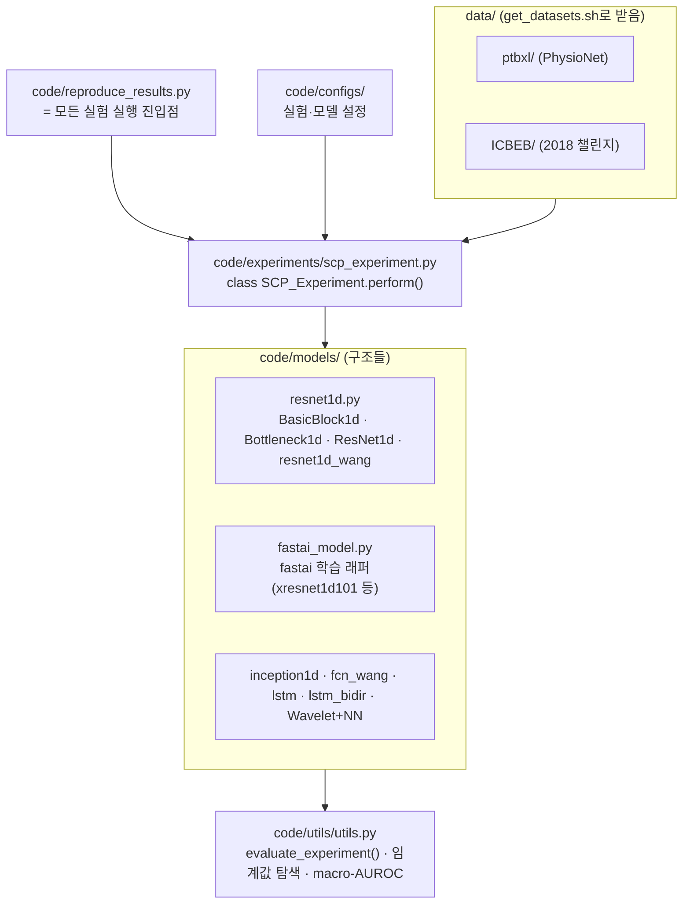

## Overview
2주차 실습(`ailab-2026-0012`)의 **레퍼런스가 되는 실제 공개 프로젝트를 끝까지 뜯어보는** 카드다.
대상은 **PTB-XL 딥러닝 벤치마크** `helme/ecg_ptbxl_benchmarking` — Strodthoff 외, *"Deep Learning
for ECG Analysis: Benchmarks and Insights from PTB-XL"*, **IEEE JBHI 25(5):1519–1528, 2021**의
공식 코드다. 하는 일을 한 문장으로:

> **여러 1D 딥러닝 구조(ResNet·xResNet·Inception·LSTM·Wavelet+NN)를 PTB-XL의 6가지 라벨
> 과제에 대해 동일 프로토콜로 학습·평가해, 무엇이 얼마나 잘 되는지 공정하게 비교한다.**

- **왜 이 저장소인가**: PTB-XL 12유도 분류의 사실상 표준 baseline이다. 상위클래스 진단 과제에서
  `xresnet1d101`/`resnet1d_wang`가 macro-AUROC **0.92~0.93**을 보고해, 우리 게이트(0.85)의
  현실적 상한을 알려준다.
- **⚠️ 라이선스(GPL-3.0)**: 이 저장소는 **GNU GPL v3**(© 2020 Patrick Wagner)다. 그래서 MedKOS는
  이 코드를 **repo에 복사·커밋하지 않는다**. 대신 아래 `## 다운로드`처럼 **받아서 읽기만** 한다
  (copyleft 전염 방지 — MedKOS의 "content가 SoT, 코드는 pipelines" 원칙과도 맞음). 2주차 노트북의
  `ResNet1d`는 그 구조를 **참고해 우리가 새로 쓴** 최소 구현이지 원본의 복사가 아니다.

## Architecture
저장소는 "데이터 → 실험 오케스트레이터 → 모델군 → 평가"의 4층 구조다(실측한 경로 포함).



## Data
- **PTB-XL** + **ICBEB(2018)** 두 데이터셋을 `./get_datasets.sh`가 `data/ptbxl/`·`data/ICBEB/`로
  내려받는다(PTB-XL은 PhysioNet, 오픈).
- **6가지 라벨 과제**를 정의한다: `all`, `diagnostic`, `subdiagnostic`, **`superdiagnostic`**(상위
  5군 — 우리 2주차 타깃), `form`, `rhythm`. 과제마다 라벨 수·난이도가 다르다.
- **표준 10겹 분할**(`strat_fold`)을 그대로 사용 → 환자 단위 분리가 보장된다(1주차 누수 교훈).

## Code walkthrough
저장소에서 **실제로 확인한** 핵심 요소들(클래스·함수 이름은 GitHub 실측). 원본을 받아 대조하라.

```text
code/
├─ reproduce_results.py              # 논문 전체 실험 재현 진입점
├─ experiments/scp_experiment.py     # class SCP_Experiment: perform() 로 학습·예측·저장
├─ models/
│   ├─ resnet1d.py                   # 우리가 집중할 파일 ↓
│   ├─ fastai_model.py               # fastai Learner 래퍼(xresnet1d101 등 학습)
│   └─ (inception1d, fcn_wang, lstm ...)
├─ configs/                          # 실험/모델 하이퍼파라미터
└─ utils/utils.py                    # evaluate_experiment(): macro-AUROC·임계값 탐색
```

`code/models/resnet1d.py`의 실제 구성(시그니처는 GitHub에서 확인):

```python
# --- 실제 저장소의 뼈대(요약; 정확한 코드는 원본 대조) ---
class BasicBlock1d(nn.Module):
    def __init__(self, inplanes, planes, stride=1, kernel_size=[3, 3], downsample=None):
        # conv→bn→relu→conv→bn 후 residual 더하고 relu
        ...

class Bottleneck1d(nn.Module):
    def __init__(self, inplanes, planes, stride=1, kernel_size=3, downsample=None):
        # 1×1 → k → 1×1 병목 후 residual
        ...

class ResNet1d(nn.Sequential):
    def __init__(self, block, layers, kernel_size=3, num_classes=2, input_channels=3,
                 inplanes=64, stride_stem=2, pooling_stem=True, stride=2,
                 concat_pooling=True, ...):
        # stem(conv→bn→relu→maxpool) → 백본 layers → head
        ...

def resnet1d_wang():   # 논문에서 강한 baseline. kernel_size=[5, 3] 로 특화
    ...
def resnet1d18(): ...  # resnet1d34/50/101/152, wrn1d_22 도 제공
```

**읽는 순서(1주차 `ailab-2026-0003`의 5개 질문)**:
1. **입·출력** → `input_channels`(=12유도), `num_classes`(=과제별 라벨 수), 헤드는 다중라벨이라
   최종 sigmoid.
2. **손실/평가** → `utils.evaluate_experiment()`가 **macro-AUROC**를 계산(임계값 무관 지표).
3. **몸통** → `BasicBlock1d`/`Bottleneck1d`의 **잔차 연결**이 곧 ResNet.
4. **데이터 투입** → `SCP_Experiment.perform()`가 fold 기반 분할로 배치를 만든다.
5. **학습 루프** → fastai `Learner`(`fastai_model.py`)가 lr-find·one-cycle로 돈다.

## Instructions
> `resnet1d_wang`의 각 설계 선택이 **무엇을, 왜** 하는지(1주차 지시어 표의 심화판).

| 요소 | 무엇을 시키는가 | 왜 필요한가 |
|---|---|---|
| `input_channels=12` | 12유도를 **입력 채널**로 함께 넣어라 | 유도 간 상호정보(예: 하벽 MI는 II·III·aVF)를 한 모델이 본다 |
| `BasicBlock1d`(잔차) | `F(x)+x`로 블록을 통과시켜라 | 깊이를 늘려도 gradient 소실 없이 형태 표현력↑ |
| `kernel_size=[5,3]` (wang) | 첫 conv는 넓게(5), 둘째는 좁게(3) | 넓은 커널로 파형 맥락을, 좁은 커널로 국소 디테일을 |
| `stride_stem=2`, `MaxPool` | 초반에 시간축을 빠르게 줄여라 | 1000샘플의 계산량을 줄이고 시야를 넓힘 |
| `concat_pooling=True` | avg+max 풀링을 이어 붙여라(fastai head) | 평균·최대 요약을 함께 써 표현을 풍부하게 |
| `num_classes=과제별` | 과제(superdiagnostic=5 등)에 맞춰 출력 수를 바꿔라 | 하나의 구조로 6개 과제를 공정 비교 |
| `evaluate_experiment()` | 예측에서 **macro-AUROC**를 계산하라 | 다중라벨·불균형에서 임계값에 안 흔들리는 표준 지표 |

## 다운로드 (오픈소스 코드 받기)
GPL 코드라 repo에 넣지 않고 **필요할 때 받아서 읽는다**. MedKOS에 결정론 유틸을 새로 뒀다 —
어느 저장소를, 어느 브랜치/커밋으로, 어디에 받을지는 코드(`pipelines/fetch_project.py`)가 정한다.

```bash
# 받을 수 있는 프로젝트 목록(레지스트리)
python pipelines/fetch_project.py --list

# PTB-XL 벤치마크 원본 코드를 받는다 (기본 대상: projects/  ← .gitignore, 커밋 안 됨)
python pipelines/fetch_project.py --download ptbxl-benchmark
#   → projects/ecg_ptbxl_benchmarking/ 에 clone. 핵심 파일 경로를 함께 출력한다.

# 특정 커밋으로 고정해서 재현성 있게 받기(권장)
python pipelines/fetch_project.py --download ptbxl-benchmark --ref <commit-sha>

# 받은 뒤 실제 모델 코드를 읽어본다
sed -n '1,80p' projects/ecg_ptbxl_benchmarking/code/models/resnet1d.py
```

Colab에서는 **2주차 노트북**(`week02_ptbxl_resnet1d.ipynb`)의 "원본 코드 받기" 셀이 같은 일을 한다
(`!git clone` + 데이터 `get_datasets.sh`). 우리 최소 `ResNet1d`로 먼저 게이트를 통과한 뒤,
이 원본과 나란히 놓고 차이를 배우는 흐름이다.

## Exercises
1. **받아서 대조**: `fetch_project.py --download ptbxl-benchmark` 후 `resnet1d.py`를 열어, 2주차
   노트북의 우리 `ResNet1d`와 **다른 점 3가지**(stem·블록 종류·헤드 풀링)를 `## My notes`에.
2. **과제 바꾸기**: `superdiagnostic`(5) 대신 `diagnostic`(더 세분) 라벨로 바꾸면 macro-AUROC가
   어떻게 변하는지 예상 → 노트북에서 확인.
3. **구조 비교**: `resnet1d_wang` vs `xresnet1d101`의 논문 보고값을 표로 옮기고, 우리 결과와 비교.
4. **읽기 훈련**: `SCP_Experiment.perform()`가 fold를 train/val/test로 어떻게 나누는지 코드로 확인해
   1주차 "환자 누수"가 왜 자동으로 막히는지 한 문단으로.

## Resources
- 원본 저장소: https://github.com/helme/ecg_ptbxl_benchmarking (**GPL-3.0**, © 2020 Patrick Wagner)
- 논문: Strodthoff, Wagner, Schaeffter, Samek, *IEEE JBHI* 25(5):1519–1528, 2021
- 데이터: https://physionet.org/content/ptb-xl/ (CC BY 4.0) · SCP-ECG 라벨: `scp_statements.csv`
- 받기 유틸: `pipelines/fetch_project.py` · 실습 카드: `ailab-2026-0012` · 노트북: `notebooks/week02_ptbxl_resnet1d.ipynb`
- 프로젝트 분석 템플릿(3D U-Net): `ailab-2026-0002` · 발전사(CNN→ResNet): `ailab-2026-0009`

## My notes
<!-- 원본 코드를 받아 읽으며 배운 것, 우리 구현과의 차이를 여기에 적는다. -->
