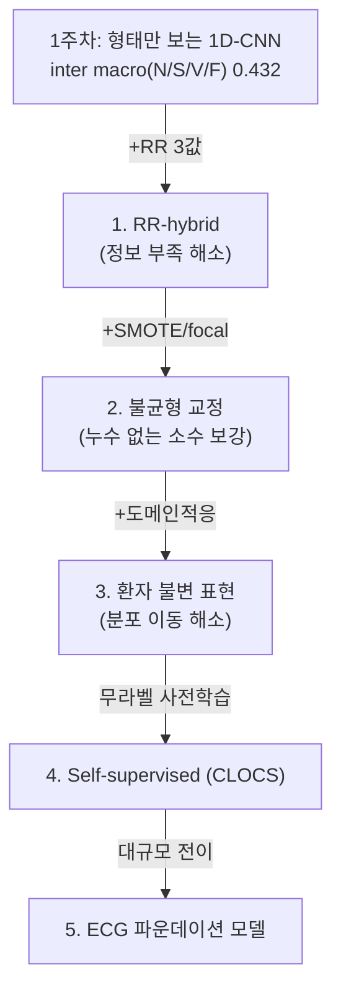

## Overview
1주차에서 **진짜 문제**가 드러났다: 무작위(intra) macro-F1 0.83이 환자분리(inter, de Chazal DS2)에서
**0.346으로 붕괴**하고, 특히 **S 0.87→0.18, F 0.82→0.005**로 죽는다(로그 `ailab-2026-0010`).
이건 1주차 숙제로 끝낼 문제가 아니라 **논문급 열린 문제**라, 별도 심화 퀘스트로 큐에 넣는다.
목표: inter-patient에서 S·F를 **정직하게** 끌어올리는 현대적 방법들을 하나씩 실측한다.

## 왜 독립 퀘스트인가
- inter를 0.8까지 올리는 건 1주차 범위 밖이다 — **여러 방법·여러 논문**이 필요하다.
- 1주차 카드에 다 욱여넣으면 "진도 리듬"이 깨진다(스스로 경계한 완벽주의 패턴).
- 이 문제(환자 간 분포 이동 + 극심한 불균형 + 정보 부족)는 **의료 AI의 본질적 난제**라,
  트랙 하나를 통째로 줄 가치가 있다. 앞서 개념 카드(`ailab-2026-0009`)의 발전사 끝에 있던
  **파운데이션 모델이 바로 이 문제를 겨냥**한다.

## 문제 정의
- **무엇**: MIT-BIH AAMI 5클래스 비트 분류를 **환자 단위 분리(de Chazal DS1 train / DS2 test)**에서.
- **지표**: **N/S/V/F macro-F1**(Q는 support 7로 무의미 → 제외). 출발점 = **0.432**(Q 제외 inter).
- **왜 어려운가**(3중고):
  1. **분포 이동(domain shift)**: 환자마다 파형 버릇이 달라, DS1에서 배운 게 DS2에 안 맞는다.
  2. **정보 부족**: 비트 하나만 보면 S(상심실성)는 **간격(RR)** 없이 정상과 구분 불가.
  3. **극심한 불균형**: F 388개·S 1837개 vs N 44238개. 단순 upsample은 누수(1주차 B-3에서 확인).

## 접근 로드맵
난이도 순. 각 방법이 **위 3중고 중 무엇을 푸는지**와 근거를 붙였다. 하나씩 로그로.

1. **RR 간격 feature 주입** *(정보 부족)* — 직전RR·직후RR·국소평균 대비 3값을 GAP 뒤에 concat.
   S의 본질이 "빠른 박동"이라 **가장 큰 한 방**. 근거: de Chazal 2004(RR이 최상위 feature).
2. **불균형: SMOTE·focal loss·2단계** *(불균형)* — 단순 복원추출 대신 **SMOTE**(소수 클래스
   합성)로 누수를 줄이거나, **focal loss**로 어려운 소수 표본에 집중. 근거: Chawla 2002(SMOTE),
   Lin 2017(Focal Loss).
3. **inter-patient 전용 설계** *(분포 이동)* — (a) de Chazal식 **수작업 feature**(형태+RR+간격)
   기반, (b) **도메인 적응**(adversarial DANN 등)으로 환자 불변 표현 학습. 근거: Ganin 2016(DANN).
4. **Self-supervised 사전학습** *(정보 부족+분포 이동)* — 라벨 없는 대량 ECG로 표현을 먼저 배우고
   소량 라벨로 미세조정. **환자 간 대조학습**이 핵심. 근거: Kiyasseh 2021 **CLOCS**(환자·시간·공간
   대조학습, 부정맥 일반화를 정조준).
5. **ECG 파운데이션 모델** *(전부)* — 대규모 무라벨 사전학습 모델을 전이. 개념 카드 발전사의
   종착점. 근거: Papers With Code의 ECG 사전학습·파운데이션 트렌드(아래 Resources).

## Architecture
"형태만 보는 1D-CNN"에서 "환자 불변 + 문맥 + 사전지식"으로 올라가는 사다리:

## 실험 큐
각 항목 = 노트북에서 돌릴 실험 + 합격 기준. 돌리면 `ingest_run.py`로 로그(예: `--split inter`).

1. **RR-hybrid** — GAP 뒤 RR 3값 concat. 합격: inter S-F1 **0.18 → 0.4+**.
2. **SMOTE vs focal** — 둘을 각각 붙여 비교. 합격: F-F1이 **0.005 → 유의미(>0.2)**.
3. **de Chazal feature baseline** — 수작업 feature + 얕은 분류기로 딥러닝과 대조. 합격: 재현·비교표.
4. **도메인 적응(DANN)** — 환자 도메인 판별기를 적대적으로. 합격: inter macro **> RR-hybrid**.
5. **CLOCS식 대조 사전학습** — 무라벨 사전학습 → 미세조정. 합격: 소량 라벨에서 이득 확인.

> 우선순위: **1 → 2**가 즉효(정보·불균형), **3~5**는 논문 재현 성격의 장기 과제.
> 한 번에 하나씩, 매번 실행 로그로. 완벽주의 금지.

## Resources
- **RR/수작업 feature**: de Chazal et al., *IEEE TBME* 2004
- **불균형**: Chawla et al. 2002 (SMOTE) · Lin et al. 2017 (Focal Loss, arXiv:1708.02002)
- **도메인 적응**: Ganin et al. 2016 (DANN, JMLR)
- **Self-supervised ECG**: Kiyasseh et al. 2021, **CLOCS** (ICML) — 환자 간 대조학습
- **SOTA·파운데이션 추적**: Papers With Code — https://paperswithcode.com/task/ecg-classification
- **MedKOS 내부**: 원천 로그 `ailab-2026-0010` · 심화 `ailab-2026-0007` · 개념/발전사 `ailab-2026-0009`

## My notes
<!-- 각 실험(1~5) 결과를 한 줄씩. inter 로그(ingest_run --split inter)로도 남기면 자동으로 이어진다.
     예: "실험1 RR-hybrid: inter S-F1 0.18 → 0.46. RR이 결정적임을 확인." -->
