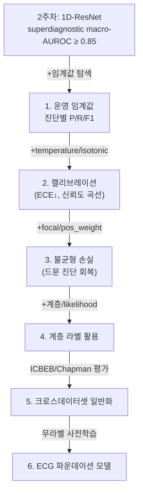

## Overview
2주차(`ailab-2026-0012`)는 macro-AUROC로 게이트를 통과하도록 설계됐다. 그런데 **AUROC를 넘긴다고
'임상에서 쓸 만한 진단기'가 되는 건 아니다.** 12유도 다중라벨에는 한 주차 숙제로 못 끝낼
**열린 문제들**이 줄줄이 딸려 있다 — 임계값·캘리브레이션, 계층적 라벨, 다른 병원·기기로의
일반화, 그리고 파운데이션 모델. 이걸 별도 심화 퀘스트로 큐에 넣고 **하나씩 실측**한다.

이 퀘스트는 1주차 퀘스트(`ailab-2026-0011`, inter-patient 일반화)의 **12유도·다중라벨 판**이다.
1주차가 "형태만으론 S·F가 무너진다"였다면, 2주차는 "라벨을 잘 맞혀도(AUROC↑) **결정을 못 내린다
(임계값·캘리브레이션)**"가 첫 관문이다.

## 왜 독립 퀘스트인가
- macro-AUROC 0.85는 "모델이 진단을 **순위**로 구분한다"는 증거일 뿐, **어느 확률에서 양성이라
  부를지(임계값)**·**그 확률이 진짜 확률인지(캘리브레이션)**는 다른 문제다. 임상 배치에 직결된다.
- PTB-XL 라벨은 **계층(super→sub→diagnostic)** 이고 코드마다 **likelihood**가 붙는다. 이 구조를
  살리는 건 논문급 주제라 2주차 카드에 다 넣으면 진도 리듬이 깨진다(스스로 경계한 완벽주의).
- **다른 데이터셋(ICBEB·Chapman)으로의 일반화**는 1주차 inter-patient 문제가 **병원·기기 단위로
  커진 것**이다. 벤치마크 논문도 여기서 성능이 떨어짐을 보고한다 → 트랙 하나를 줄 가치가 있다.

## 문제 정의
- **무엇**: PTB-XL 12유도 10초 심전도의 **다중라벨 진단**을, 단지 AUROC가 아니라 **배치 가능한
  결정 규칙**까지.
- **지표(다층)**: ① macro-AUROC(순위) → ② **운영 임계값에서의 진단별 precision/recall/F1** →
  ③ **캘리브레이션 오차**(ECE·신뢰도 곡선) → ④ **크로스데이터셋 macro-AUROC 하락폭**.
- **왜 어려운가**:
  1. **임계값·불균형**: HYP·특정 MI 하위형은 매우 드물어, 0.5 고정 임계값은 소수 진단을 다 놓친다.
  2. **캘리브레이션**: 딥넷은 대개 **과신(overconfident)**한다 — 확률 0.9가 실제 0.9가 아니다.
  3. **계층·likelihood 라벨**: super만 쓰면 정보를 버리고, diagnostic까지 가면 극심한 롱테일.
  4. **분포 이동**: 다른 기기·인구(ICBEB)에서 파형·라벨 분포가 달라 그대로는 안 맞는다.

## 접근 로드맵
난이도 순. 각 방법이 위 4난제 중 무엇을 푸는지와 근거를 붙였다. 하나씩 실행 로그로.

1. **운영 임계값 탐색 + 진단별 리포트** *(임계값)* — 검증셋에서 진단마다 **F1 최대 임계값**을 찾아
   test에 적용, precision/recall/F1 표를 낸다. 근거: 벤치마크 `utils.py`의 임계값 탐색과 같은 결.
2. **확률 캘리브레이션** *(캘리브레이션)* — temperature scaling / isotonic으로 보정하고 **ECE**와
   신뢰도 곡선을 before/after 비교. 근거: Guo et al. 2017(*On Calibration of Modern NN*).
3. **불균형 손실** *(임계값+불균형)* — `BCEWithLogitsLoss(pos_weight=...)` 또는 **focal loss**로
   드문 진단(HYP)을 살린다. 근거: Lin et al. 2017(Focal Loss).
4. **계층/likelihood 라벨 활용** *(라벨 구조)* — super→sub→diagnostic 계층 손실, 또는 SCP
   likelihood를 소프트 타깃으로. 근거: PTB-XL/SCP-ECG 라벨 스킴, 계층 다중라벨 학습 문헌.
5. **크로스데이터셋 일반화** *(분포 이동)* — PTB-XL 학습 → **ICBEB/Chapman**에서 평가, 하락폭을
   측정하고 도메인적응/정규화로 좁힌다. 근거: 벤치마크 논문의 cross-dataset 절.
6. **ECG 파운데이션 모델** *(전부)* — 대규모 무라벨 12유도로 사전학습 후 전이. 1주차 발전사
   (`ailab-2026-0009`)의 종착점이 12유도 규모에서 실제로 이득이 있는지 확인.

## Architecture
"AUROC를 넘긴 모델"에서 "믿고 쓸 수 있는 진단기"로 올라가는 사다리:

## 실험 큐
각 항목 = 노트북에서 돌릴 실험 + 합격 기준. 돌리면 이 퀘스트에 귀속되게 로그로 남긴다:
`python pipelines/ingest_run.py --quest ailab-2026-0014 --step "<실험명>" --value <값> --note "<관찰>"`.

1. **임계값 + 진단별 리포트** — 검증셋 F1-최대 임계값을 test 적용. 합격: 5진단군 **F1 표**를 얻고,
   가장 약한 진단(대개 HYP)을 지목.
2. **캘리브레이션** — temperature scaling 전/후 **ECE** 비교. 합격: ECE가 **유의미하게 감소**.
3. **focal vs pos_weight** — 둘을 각각 붙여 HYP AUROC/F1 비교. 합격: 드문 진단 F1 상승 확인.
4. **계층 라벨** — super→sub 계층 손실 or likelihood 소프트타깃. 합격: sub 과제 macro-AUROC 기록.
5. **크로스데이터셋** — PTB-XL→ICBEB 평가. 합격: **하락폭(일반화 갭)**을 숫자로 남김.
6. **파운데이션/SSL 전이** — 무라벨 사전학습→소량 미세조정. 합격: 소량 라벨 구간에서 이득 확인.

> 우선순위: **1 → 2**가 즉효(배치 가능성·신뢰). **3~4**가 소수 진단·라벨 구조. **5~6**은
> 논문 재현 성격의 장기 과제. 한 번에 하나씩, 매번 실행 로그로. 완벽주의 금지.

## Resources
- **임계값/평가**: 벤치마크 `code/utils/utils.py`(임계값 탐색·macro-AUROC) — `fetch_project.py`로 받기
- **캘리브레이션**: Guo et al. 2017, *On Calibration of Modern Neural Networks* (ICML)
- **불균형**: Lin et al. 2017 (Focal Loss, arXiv:1708.02002)
- **데이터/라벨**: PTB-XL https://physionet.org/content/ptb-xl/ · SCP-ECG `scp_statements.csv`
- **크로스데이터셋**: Chapman-Shaoxing https://physionet.org/content/ecg-arrhythmia/ · ICBEB 2018
- **SOTA·파운데이션 추적**: Papers With Code — https://paperswithcode.com/task/ecg-classification
- **MedKOS 내부**: 원천 실습 `ailab-2026-0012` · 프로젝트 분석 `ailab-2026-0013` ·
  1주차 퀘스트(자매편) `ailab-2026-0011` · 발전사 `ailab-2026-0009`

## My notes
<!-- 각 실험(1~6) 결과를 한 줄씩. 실행 로그(ingest_run --quest ailab-2026-0014)로 남기면 자동으로 이어진다.
     예: "실험1 임계값: HYP F1 0.3x, 가장 약함. 실험2 캘리브레이션: ECE 0.08→0.03." -->
