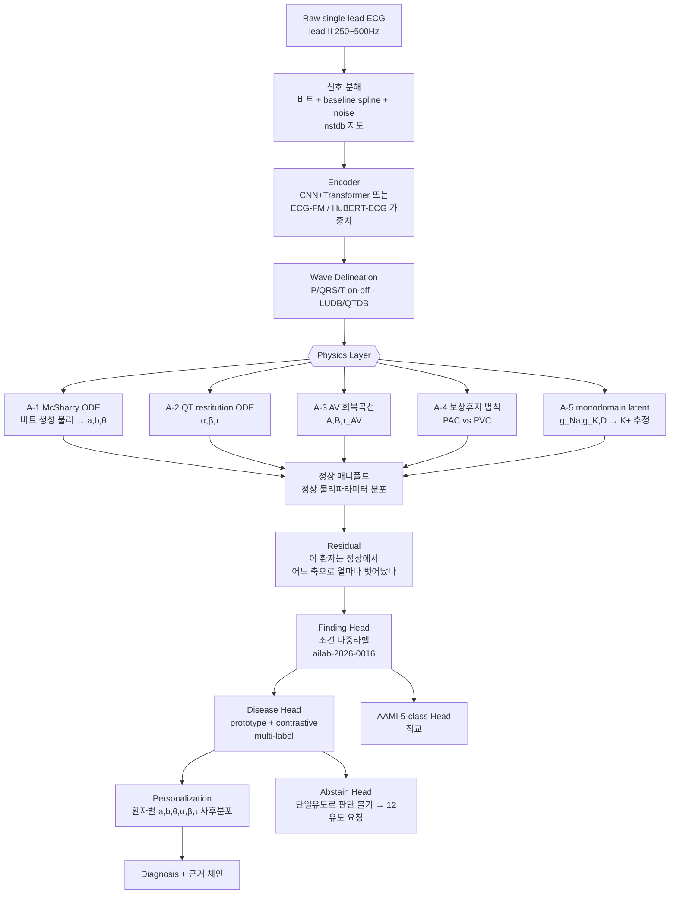

## Overview
PPT의 설계 철학 — **"정상을 먼저 배우고, 질환은 정상에서 얼마나 벗어났는지로 판단하고,
마지막에 그 환자 기준으로 다시 본다"** — 은 그대로 유지할 가치가 있다. 이건 의사가 심전도를
읽는 순서 그 자체이고, 2024~2026년의 ECG foundation model 흐름(자기지도 사전학습 → 정상
표현 학습 → 다운스트림 진단)과도 같은 방향이다.

이 카드는 그 위에 **세 가지를 더한다**:

1. **오픈 데이터 지도** — Step1(정상만)·Step2(질환)·Step3(개인화)에 **각각 다른 데이터셋이
   필요**하다. 단계별로 뭘 쓸지 못 박는다.
2. **Physics Layer를 "규칙 페널티"가 아니라 진짜 미분방정식으로** 넣는 자리 5곳.
   PPT의 판단신호 중 **어디가 진짜 PINN 감이고 어디가 아닌지**를 구분한다.
3. **Validation 설계의 치명적 결함 하나**(같은 시험지를 고쳐가며 재응시 = 시험지 유출)와
   그 교정.

원천 자료: 사용자 설계 PPT 15장(Step1~3 + Validation1~4), Harrison 기반 EKG 44질환 정리 PDF.
정상 판정 규칙세트와 단일유도 진단 가능 범위는 짝 카드 **`ailab-2026-0016`** 으로 분리했다.

## 왜 독립 퀘스트인가
- 이건 한 주차 숙제가 아니라 **학위논문 한 편 분량의 트랙**이다. Step1만 해도 "정상 매니폴드
  학습 + 물리 제약 + 파형 분할"이 다 들어간다.
- 기존 퀘스트 `ailab-2026-0011`(inter-patient 일반화)이 **"왜 안 되는가"** 를 다뤘다면, 이
  퀘스트는 **"그래서 어떤 구조로 갈 것인가"** 를 다룬다. 0011의 실험들은 이 구조의 부분집합이다.
- 1주차 실측이 이미 답을 준다: intra 0.83 → inter 0.35, **S가 0.179로 붕괴**. 형태만 보는
  1D-CNN은 S를 못 잡는다. 그런데 **S를 결정하는 건 형태가 아니라 물리(조기성 + 동방결절
  리셋 여부)** 다. Physics Layer가 정확히 여기를 겨냥한다.

## 문제 정의
- **무엇**: 단일유도(주로 lead II) ECG에서 ① 정상/비정상 ② 소견(finding) ③ 질환 ④ AAMI
  비트클래스를 **환자 단위 분리(inter-patient)** 조건에서 판정하고, ⑤ 환자 개인 baseline으로
  보정한다.
- **왜 어려운가** (1주차에서 실측으로 확인한 3중고에 2개 추가):
  1. 분포 이동(환자마다 파형 버릇이 다름) — inter 0.35
  2. 극심한 클래스 불균형 — F support 수백 개
  3. 형태만으론 정보 부족 — S 0.179
  4. **라벨-유도 불일치**: PTB-XL·Chapman의 라벨은 12유도를 보고 붙은 것인데 lead II만
     입력하면 **관측 불가능한 라벨을 맞히라고 강요**하게 된다(→ 환각 학습).
  5. **정상의 정의가 데이터마다 다름**: "NORM" 라벨은 판독의가 정상이라 부른 것이지
     교과서 기준을 통과한 것이 아니다.

## 1. 오픈 데이터 지도 (2026-07-31 기준)

### Step1 — 정상만 학습 (정상 매니폴드)
PPT가 "학습 데이터셋에는 정상만 넣는다"고 못 박았으므로, **정상 전용 코퍼스**가 따로 필요하다.

| 데이터 | 규모 | 유도 | Step1에서의 역할 |
|---|---|---|---|
| MIT-BIH Normal Sinus Rhythm (`nsrdb`) | 18명 장시간 | MLII 계열 2ch | 순수 정상 장시간 — 시계열 정상 변동 학습의 핵심 |
| Fantasia | 젊은20 + 노년20, 각 120분 | 단일 ECG | **연령별 정상 변이**(HRV 차이) — 노인 정상을 비정상으로 안 부르게 |
| PTB-XL `NORM` 서브셋 | 약 9.5k 레코드 | 12유도(→II 슬라이스) | 10초 스냅샷 정상의 형태 다양성 |
| MIT-BIH NSR RR Interval DB / Autonomic Aging | RR·연령 메타 | — | RR 동역학의 정상 범위 |
| CODE-15 정상 서브셋 | 34.5만 중 다수 | 12유도 | 대규모 사전학습용(브라질 원격의료, Zenodo 공개) |

> **주의**: `nsrdb`+Fantasia만으로는 18+40명이라 **환자 다양성이 절대 부족**하다. PPT의
> "정상만으로 충분히 학습" 은 실제로는 PTB-XL NORM·CODE-15 normal을 섞어야 성립한다.

### Step2 — 질환 학습 (Tier 1: 반드시)
| 데이터 | 규모 | 유도 | 왜 필요한가 |
|---|---|---|---|
| **MIT-BIH Arrhythmia** (`mitdb`) | 48레코드 30분, 360Hz | **MLII + V1** | 비트 단위 AAMI 5-class의 표준. 대부분 레코드가 사실상 lead II |
| **MIT-BIH Supraventricular Arrhythmia** (`svdb`) | 78레코드 | 2ch | **S 클래스 보강용 — 1주차 S붕괴의 직접 해법. 0011 퀘스트에 빠져 있던 데이터** |
| **PTB-XL** | 21,799 / 18,869명, 71 SCP | 12유도 500Hz | 진단 라벨의 표준 벤치마크, CC-BY. 계층 라벨(super/sub/diagnostic) |
| **Chapman-Shaoxing + Ningbo** (`ecg-arrhythmia`) | 45,152레코드 | 12유도 500Hz | 리듬 라벨이 풍부, 최근 Transformer 논문의 기본 |
| **PhysioNet/CinC 2021** 통합셋 | 6개 출처 ~88k | 12/6/4/3/**2유도(I·II)** | **단일·축소유도 연구의 정답지** — SNOMED-CT로 라벨 통일 |
| **PhysioNet/CinC 2017** | 8,528 | **단일유도(AliveCor)** | 정상/AF/기타/**노이즈** 4클래스 — 노이즈가 라벨로 들어있는 유일급 |
| **LUDB** | 200명 12유도 | P/QRS/T **경계 주석** | 파형 분할(delineation) 학습 — Physics Layer의 전제 |
| **QT Database** (`qtdb`) | 105레코드 | 2유도 | QT/T-end 수동 주석 — QT restitution 물리의 정답 |
| **MIT-BIH Noise Stress** (`nstdb`) | 노이즈 3종 | — | baseline wander·EMG·전극 움직임 — PPT 6번 "노이즈 감소" 전용 |

### Step2 — Tier 2 (질환별 보강)
`afdb`(AF 10시간×23) · `ltafdb`(장기 AF 84) · `cpsc2018`(6,877/9클래스) ·
`cpsc2021`(**lead I+II 웨어러블 홀터**, 발작성 AF) · `incartdb`(75명, PVC 풍부) ·
`edb`(European ST-T, ST/T 주석) · `vfdb`·`cudb`(VF/VT) · `sddb`(심장급사 홀터) ·
`ptbdb`(PTB Diagnostic 549, MI) · Georgia 12-lead(10,344) · `apnea-ecg` · `bidmc`(CHF).

### Step3 — 개인화 / 시계열
| 데이터 | 왜 |
|---|---|
| **MIMIC-IV-ECG** (80만 ECG / 16.1만명) | **같은 환자의 여러 시점 ECG + Lab(K⁺·Ca²⁺) + 진단코드**가 연결됨 → 개인 baseline 변화 추적의 사실상 유일한 대규모 공개 자원. *credentialed(CITI+DUA) 필요, 완전 오픈 아님* |
| **Icentia11k** | 11,000명 · 20억 비트 · 250Hz **연속 장기**. 단, **modified lead I**(lead II 아님 — PPT 가정과 다름, 도메인 갭 주의) |
| `ltafdb`, `afdb`, `sddb` | 같은 환자 24~48시간 → "평소 beat 집합 → 변한 beat" 추출에 딱 |
| CODE-15 / SaMi-Trop | 대규모 + 추적 결과(사망) 라벨 |

### 2025~2026 신규 (확인된 것)
- **MEETI** (Sci Data 2026): MIMIC-IV-ECG 기반 **신호 + 이미지 + feature + 판독문** 동기화셋 →
  Step2의 "질환 ECG 특징 텍스트 제공" 아이디어를 그대로 구현 가능.
- **PhysioNet Brugada 12유도 데이터셋** (2026-02 공개), **ARGO**(허혈성 VT의 심내막 EGM +
  12유도 + 전기해부학적 맵, 2026-07 공개) — 희귀질환·기전 연구용.
- **PhysioNet/CinC 2025**: 12유도에서 **샤가스병** 검출(CODE-15 + SaMi-Trop). 2026 챌린지는
  수면다원검사 기반이라 ECG 주제 아님.
- 오픈웨이트 **ECG foundation model**: `ECG-FM`(JAMIA Open 2025, 1.5M ECG, HF 체크포인트),
  `HuBERT-ECG`(9.1M ECG, 4개국), 벤치마크 `OpenECG`(1.2M)·`BenchECG/xECG`·
  `ecg-fm-benchmarking`(12데이터셋 26태스크). **Step1 인코더를 처음부터 짜지 말고 여기서 출발**할 것.

### 라이선스 실무
CC-BY 계열(PTB-XL, CODE-15, LUDB 등)은 자유롭게 쓰되 인용 필수. **MIMIC-IV-ECG는 PhysioNet
credentialed access + DUA** 라 "무료 공개"지만 절차가 있고 **재배포 금지**다(MedKOS의
`assets/ecg/`에 그대로 커밋하면 안 된다 — 파생 수치만).

## 2. PINN을 어디에, 어떻게 넣나

### 먼저 용어 정리 (여기가 핵심)
"P파 폭이 80~120ms를 벗어나면 페널티" 는 **PINN이 아니다.** 그건 범위 규칙(rule penalty)이다.
PINN은 **미분방정식의 잔차(residual)를 손실에 넣어, 해가 그 방정식을 만족하도록 강제**하는
방법이다. 그러니 질문은 이렇게 바꿔야 한다 — **"PPT의 판단신호 중 진짜 미분방정식으로 쓸 수
있는 게 뭔가?"** 다행히 꽤 많다.

### Tier A — 진짜 PINN 감 (미분방정식이 실재함)

**A-1. 정상 비트의 생성 물리 — McSharry–Clifford ODE (PPT 슬라이드2·4의 "정상 집합 벡터")**

```
dx/dt = αx − ωy,   dy/dt = αy + ωx,   α = 1 − √(x²+y²)
dz/dt = −Σᵢ aᵢ·Δθᵢ·exp(−Δθᵢ²/2bᵢ²) − (z − z₀),   i ∈ {P,Q,R,S,T}, Δθᵢ = (θ−θᵢ) mod 2π
```
- 이 ODE를 풀면 각 파형은 **zᵢ(θ) = aᵢbᵢ²·exp(−Δθᵢ²/2bᵢ²)** 가 된다.
- **PPT가 원한 것과 정확히 대응한다**:
  - "극댓값/극솟값" → 진폭 **aᵢbᵢ²**
  - "**하부 적분값**" → 면적 **aᵢbᵢ³√(2π)** (닫힌 해가 존재! 수치적분 필요 없음)
  - "지속시간" → **bᵢ**, "위치" → **θᵢ**
  - "정상 집합 벡터" → **15차원 (a,b,θ) 파라미터 공간**. 불투명한 latent가 아니라
    **물리적으로 해석되는 좌표**라, "무엇이 얼마나 벗어났는가"를 그대로 말할 수 있다.
- **손실**: `L_ode = ‖dẑ/dt − f(ẑ, θ; a,b)‖²` (collocation point에서). 인코더가 뱉은
  (a,b,θ)로 재구성한 비트가 ODE를 만족해야 한다.
- **정상 매니폴드 = 정상 데이터의 (a,b,θ) 분포**, **질환 = 그 분포에서의 이탈 방향**.
  PPT의 "벡터 차이로 질환 판단"이 여기서 문자 그대로 구현된다.

**A-2. QT 재분극 restitution + 기억(hysteresis) — PPT의 "심박수 보정"**

Bazett 공식(QT/√RR)은 극단 심박수에서 틀린다는 게 AHA/ACCF/HRS Part IV의 지적이다.
진짜 물리는 **1차 지연 ODE**다:
```
dQT/dt = ( QT_ss(RR) − QT ) / τ ,   QT_ss(RR) = α + β·RR ,   τ ≈ 2분(rate adaptation lag)
```
- **손실**: 시계열 전체에서 이 ODE 잔차. RR이 갑자기 변한 뒤 QT가 **즉시** 따라가면 페널티.
- **(α, β, τ)가 곧 개인화 파라미터**다 → Step3가 "가중치 재학습"이 아니라
  **환자별 물리 파라미터 추정**이 된다. 훨씬 데이터 효율적이고 해석 가능하다.
- LQTS/약물성 QT연장은 **α 이탈**, TdP 위험은 **β·τ 이상**으로 분리된다.

**A-3. 방실결절 회복곡선 — PPT의 "조기박동 이후 변화" / 2도 AV block**
```
AH(n+1) = A + B·exp( −HP(n) / τ_AV )      (HP = 선행 회복시간)
```
- 이 지수 회복곡선 하나에서 **Wenckebach 주기성(PR 점증 → 탈락)이 자동으로 창발**한다.
- **Mobitz I vs II를 패턴 매칭이 아니라 기전으로 구분**하게 된다(I = 회복곡선 위, II = 곡선
  이탈·all-or-none). 단일 lead II로 충분히 관측 가능한 영역이라 실전성이 높다.

**A-4. 동방결절 리셋 물리 — 보상성 휴지 (★ 1주차 S붕괴의 직격 처방)**
```
PVC (심실 기원, 역행전도가 SA node를 리셋 못함) : RR_pre + RR_post ≈ 2·RR_sinus  (완전보상)
PAC (심방 기원, SA node 리셋)                    : RR_pre + RR_post <  2·RR_sinus  (불완전보상)
```
- 이건 **범위 규칙이 아니라 심박동 생성의 법칙**이다. 미분가능한 제약으로 바로 들어간다:
  `L_pause = |p(V) − σ( −λ·|RR_pre+RR_post−2RR̄| ) |` 식으로 **클래스 확률과 휴지 물리를 결합**.
- 1주차에서 **S가 0.179로 죽은 이유**가 바로 이거다. 형태(morphology)만 보면 PAC의 QRS는
  정상 비트와 거의 같다. **PAC를 정의하는 건 형태가 아니라 타이밍 물리**다.
  → **이 하나만 제대로 넣어도 S가 가장 크게 오른다고 본다. 실험1로 최우선.**

**A-5. 전도·재분극의 세포 물리 — monodomain/eikonal (해석 가능 latent)**
```
∂V/∂t = ∇·(D∇V) + f(V,w)/C_m      (1D cable로 축약 가능; Aliev–Panfilov 2변수면 충분히 쌈)
전도속도 CV ∝ √D · (dV/dt)_max  →  QRS폭 ∝ L/CV
```
- 고칼륨혈증: Na채널 불활성화 ↓(dV/dt)max → CV↓ → **QRS 확장**, 동시에 I_Kr↑ → **뾰족한 T**.
  즉 "QRS폭"과 "T 첨예도"는 **독립 feature가 아니라 하나의 잠재변수([K⁺])의 두 그림자**다.
- **미분가능 시뮬레이터를 디코더로** 두고 (g_Na, g_K, D)를 추정하면, 모델 출력이
  "고칼륨혈증 0.82" 가 아니라 **"추정 [K⁺] 6.4 mM, CV 32% 감소"** 가 된다.
  → MIMIC-IV-ECG의 **실제 혈청 K⁺ 검사값으로 이 latent를 지도학습**할 수 있다(공개 데이터로
  검증 가능한 물리 latent — 이 퀘스트에서 가장 논문 되기 좋은 지점).
- 2025~2026년에 EP용 PINN·neural operator(FNO/DeepONet) 논문이 여럿 나와 있어 밟고 갈 발판이 있다.

**A-6. 단일유도의 관측 한계 — 이것도 물리다**
lead II = 심장 쌍극자 벡터의 **60° 방향 1차원 투영**. 3차원 벡터를 1개 스칼라로 본 것이라
**국소화(전벽/후벽/우심실)는 원리적으로 복원 불가**다. 이건 모델을 잘 짜서 극복할 문제가
아니라 **정보이론적 한계**다. → 그래서 **"판단 불가 / 12유도 필요" 라는 기권(abstain) 출력이
물리적으로 정당화**된다. 상세 범위는 `ailab-2026-0016` 참조.

### Tier B — PINN 아님. 규칙이지만 넣을 가치는 있음
P폭 80~120ms, P진폭 ≤2.5mm, PR 120~200ms, QRS <120ms, HR 40~220, 축 −30~+90 …
- 이건 **통계적 정상범위**지 방정식이 아니다. → **soft rule regularizer**로 넣되,
  **정상 브랜치(재구성/정상 매니폴드)에만** 건다.
- 더 좋은 방법: **손실이 아니라 구조로 강제**한다. 출력을 (a,b,θ) 같은 물리 파라미터로
  **재파라미터화**하면 "불가능한 파형"이 애초에 표현되지 않는다(hard constraint by
  construction). 손실 균형 튜닝 지옥을 피할 수 있다.
- **조건부여 필수**: PR 정상범위는 심박수·연령에 따라 달라진다. 상수 규칙은 노인·운동선수를
  전부 비정상으로 만든다.

### Tier C — 절대 PINN 넣으면 안 되는 곳 (★ 참고 PDF의 조언과 다른 지점)
**최종 질환 분류 헤드에 "생리적으로 불가능한 값" 페널티를 걸면 안 된다.**
- 참고 PDF는 "CNN이 QRS 240ms를 예측하면 페널티" 를 제안했는데, **QRS 240ms는 실제로 존재한다**
  — 고칼륨혈증, 임종기 리듬, 심한 나트륨채널 차단(TCA 중독)에서 흔하다. 여기에 페널티를 걸면
  **모델은 가장 위중한 환자에게서 눈이 먼다.**
- 원칙: **물리 제약은 "정상 생성 브랜치"에만 걸고, 질환 판단은 그 잔차(residual)로 한다.**
  물리를 위반한다는 사실 자체가 **질환의 증거**여야지 억제 대상이 되면 안 된다.
- 즉 구조는 `물리 제약 → 정상 재구성 → 잔차 → 질환` 이지, `물리 제약 → 질환 출력` 이 아니다.

### 손실 균형 (실무에서 제일 많이 터지는 곳)
PINN은 손실 항 가중치가 안 맞으면 **stiff한 잔차항이 다 잡아먹어 학습이 죽는다.**
- 고정 가중치 금지 → **불확실성 기반 자동 가중(Kendall) 또는 GradNorm**.
- **커리큘럼**: 1단계 재구성만 → 2단계 물리 잔차 추가 → 3단계 분류 헤드. 처음부터 다 켜면 안 된다.
- 물리 손실은 **정상 데이터에서만** 켠다(질환 데이터에서 켜면 Tier C 문제가 재발).

## 3. PPT 판단신호 → 어느 계층으로 가는가

| PPT의 판단신호 | 어디로 | 방식 |
|---|---|---|
| P/QRS/T 형태, inverted 여부 | Wave delineation → Physics A-1 | LUDB로 지도학습 + ODE 잔차 |
| 극댓/극솟값 | Physics A-1 파라미터 `aᵢbᵢ²` | 물리 좌표로 흡수 |
| **하부 적분값** | Physics A-1 면적 `aᵢbᵢ³√(2π)` | **닫힌 해 존재 — 수치적분 불필요** |
| 상승·하강 기울기, T파 좌우대칭 | Finding head (feature) | 물리 아님. 단, 대칭성은 A-5의 재분극 분산과 연결 |
| Baseline 형태·기울기 | 구조적 분해 | `신호 = 비트 + baseline 스플라인 + 노이즈` 로 **명시적 분해**. `nstdb`로 지도 |
| RR/PQ/ST/TP interval | Finding head + Physics A-2/A-3/A-4 | 값 자체는 feature, **관계는 물리** |
| 심박수 보정 | **Physics A-2** | Bazett 대신 restitution ODE |
| 단일비트 vs 2/4비트 vs a1↔a20 비교 | Encoder(멀티스케일) | dilated conv + attention. 물리 아님 |
| 조기박동 후 T파 이상 | **Physics A-3/A-4** | 회복곡선 + 보상휴지 |
| 여러 질환 동시 | Disease head | **multi-label**(softmax 금지) |
| AAMI 5-class | 별도 직교 헤드 | PPT 판단대로 질환과 분리. 옳다 |
| 개인 baseline 차이 | Personalization | **A-2의 (α,β,τ) + A-1의 (a,b,θ) 환자별 사후분포** |

## 4. Validation 재설계 (★ 현재 설계의 치명적 결함)

**PPT 슬라이드8·14의 "Validation1a → 조정 → 1b → 조정 → 1c…" 는 통계적으로 무효다.**
시험지를 여러 장 만들어도 **매번 결과를 보고 가중치를 고치면 그 시험지 전부가 학습셋이 된다.**
"오염 차단"을 의도했지만 실제로는 **다중검정으로 오염을 누적**시키는 구조다. 96%는 그렇게 해서
나온 숫자가 되고, 진짜 새 환자에서는 무너진다 — **1주차에서 이미 0.83 → 0.35로 겪은 그 현상**이다.

교정안:

| PPT | 교정 |
|---|---|
| Validation1a/1b/1c… 반복 조정 | **train / val / test 3분할.** 조정은 **val에서만**. test는 **전 과정에서 딱 한 번** |
| 96%까지 계속 올린다 | **목표를 사전 등록(pre-register)**. 못 넘으면 못 넘었다고 보고. 임계 조정으로 만든 96%는 무의미 |
| inter-patient test | 유지 — 이건 잘한 것. **de Chazal DS1/DS2**(mitdb), PTB-XL 공식 fold 1-8/9/10 |
| — | **외부 검증 추가**: PTB-XL로 학습 → Chapman/Georgia로 테스트(병원·기기 이동). 진짜 일반화는 여기서 판정 |
| 민감도·특이도 | + **macro-F1, PR-AUC, 클래스별 sens/spec, 캘리브레이션(ECE), 부트스트랩 95% CI** |

**목표치 현실화** (2026년 문헌 기준):
- inter-patient MIT-BIH AAMI: **V 클래스 sens 90% 내외, S 클래스 sens 60~80%** 가 현재 수준.
  **S에서 96/96은 아직 아무도 못 했다.** 1주차 S 0.179 → 0.4~0.5면 이미 큰 성과다.
- 단일유도 정상 vs 비정상 이분: 민감도·특이도 **동시** 96%는 공개 문헌 최고 수준을 넘는다.
  현실 목표는 **sens 90~93% @ spec 85~90%**.
- 반면 **AF 검출(단일유도)은 sens/spec 95%+ 가 실제로 보고**된다 → **질환마다 목표를 따로 잡아야 한다.**
  전 질환 일괄 96%는 설계 오류다.

**Step3(개인화) 검증 설계** — 여기 leakage가 숨기 쉽다:
- 개인화에 쓴 구간과 평가 구간을 **시간으로 분리**(앞 구간으로 튜닝 → 뒤 구간 평가).
- **대조군 필수**: "전문가 라벨 N비트 추가" vs "무작위 N비트 추가" 를 비교해야 개인화의 효과가
  증명된다. (고전 결과: 환자별 소수 비트 적응만으로 SVEB 민감도가 크게 오른다 — Step3의 근거)

## Architecture



## 실험 큐

| # | 실험 | 데이터 | 무엇을 보나 | 성공 기준 |
|---|---|---|---|---|
| **0** | **라벨-유도 정합성 필터 + finding 라벨 트리 확정** | PTB-XL, mitdb | lead II로 관측 불가한 라벨을 학습에서 제거 | `ailab-2026-0016` 3-tier 적용, 라벨셋 동결 |
| **1** | **보상휴지 물리 제약(A-4)** | mitdb DS1/DS2 + **svdb** | S vs V 분리 | inter **S-F1 0.179 → 0.40+** |
| 2 | McSharry ODE 오토인코더(A-1) | nsrdb + PTB-XL NORM | 정상 매니폴드가 물리좌표로 잡히나 | 정상 재구성 오차 < 노이즈 수준, 파라미터 해석 가능 |
| 3 | 정상 vs 비정상 이분(잔차 기반) | 학습=정상만, 평가=혼합 | PPT Step1/Validation1 그대로 | sens 90% @ spec 85% (96% 아님) |
| 4 | QT restitution ODE(A-2) | qtdb + ltafdb | Bazett 대비 개인 QTc 정확도 | QT 예측 MAE가 Bazett보다 유의하게 낮음 |
| 5 | AV 회복곡선(A-3) | mitdb, incartdb | Mobitz I vs II 기전 구분 | 규칙기반 대비 오분류 감소 |
| 6 | monodomain latent → K⁺(A-5) | **MIMIC-IV-ECG + Lab** | 물리 latent가 실제 검사값과 맞나 | 추정 K⁺ vs 실측 상관 r > 0.5 |
| 7 | 개인화(Step3) | ltafdb, Icentia11k, MIMIC | 시간분리 + 무작위 대조 | 대조군 대비 유의한 향상 |
| 8 | 외부 검증 | PTB-XL → Chapman/Georgia | 병원·기기 이동 | 성능 저하폭 보고(숨기지 않기) |

각 실험은 끝나는 대로 `pipelines/ingest_run.py --quest ailab-2026-0015 --step "<실험명>"` 으로
로그를 이 퀘스트에 귀속시킨다. **수치는 LLM이 쓰지 않는다 — 노트북 실행 결과만.**

## Resources
- Data: [PhysioNet](https://physionet.org/) · [PTB-XL](https://physionet.org/content/ptb-xl/) ·
  [Chapman+Ningbo](https://physionet.org/content/ecg-arrhythmia/1.0.0/) ·
  [CinC 2021 (2유도 I·II)](https://physionet.org/content/challenge-2021/1.0.0/) ·
  [Icentia11k](https://physionet.org/content/icentia11k-continuous-ecg/1.0/) ·
  [nsrdb](https://physionet.org/content/nsrdb/1.0.0/)
- Foundation model: [ECG-FM](https://github.com/bowang-lab/ecg-fm) ·
  [HuBERT-ECG](https://github.com/Edoar-do/HuBERT-ECG) ·
  [ecg-fm-benchmarking](https://github.com/AI4HealthUOL/ecg-fm-benchmarking)
- PINN/EP: [PINN for cardiac EP in 3D & fibrillation](https://arxiv.org/pdf/2409.12712) ·
  [Physics-Informed Neural Operators for Cardiac EP](https://arxiv.org/pdf/2511.08418) ·
  [PINN for physiological signals (Physiol Meas 2025)](https://iopscience.iop.org/article/10.1088/1361-6579/adf1d3/pdf)
- 2026 데이터: [MEETI (Sci Data)](https://www.nature.com/articles/s41597-026-06796-1)
- 짝 카드: `ailab-2026-0016`(정상 규칙세트 + 단일유도 범위), `ailab-2026-0011`(inter-patient)

## My notes
(여기에 직접 채우기)
- 실험1부터 갈지, 실험0 라벨 정리부터 갈지:
- lead II 고정인지, lead I+II 2유도까지 열어둘지(CinC2021 2유도셋이 바로 그 구성):
- MIMIC-IV-ECG credentialed 신청 여부:
