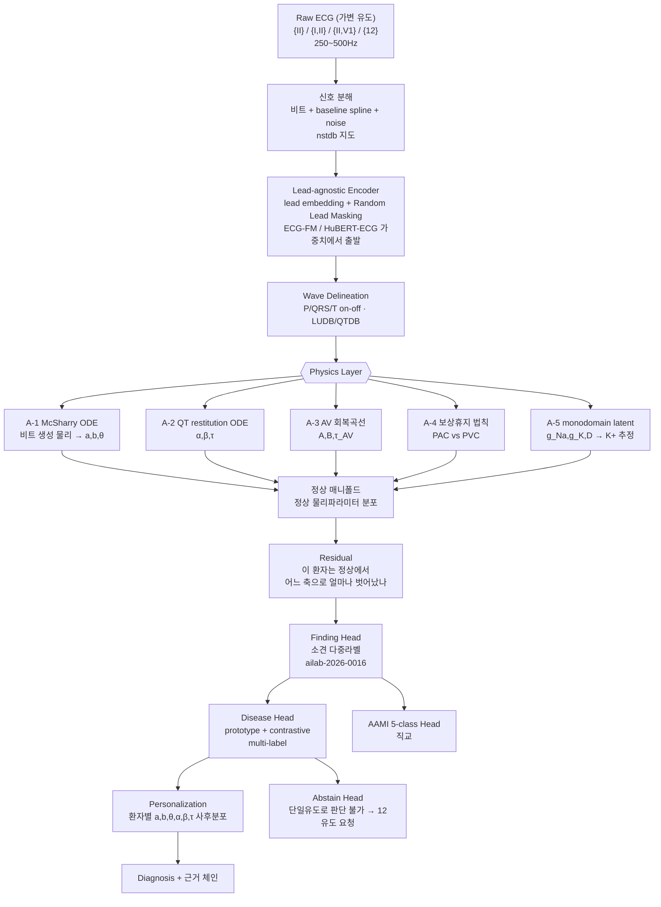

## Overview
PPT의 설계 철학 — **"정상을 먼저 배우고, 질환은 정상에서 얼마나 벗어났는지로 판단하고,
마지막에 그 환자 기준으로 다시 본다"** — 은 그대로 유지할 가치가 있다. 이건 의사가 심전도를
읽는 순서 그 자체이고, 2024~2026년의 ECG foundation model 흐름(자기지도 사전학습 → 정상
표현 학습 → 다운스트림 진단)과도 같은 방향이다.

이 카드는 그 위에 **세 가지를 더한다**:

1. **오픈 데이터 지도** — Step1(정상만)·Step2(질환)·Step3(개인화)에 **각각 다른 데이터셋이
   필요**하다. 단계별로 뭘 쓸지 못 박는다.
2. **Physics Layer를 "규칙 페널티"가 아니라 진짜 미분방정식으로** 넣는 자리 5곳.
   PPT의 판단신호 중 **어디가 진짜 PINN 감이고 어디가 아닌지**를 구분한다.
3. **Validation 설계의 치명적 결함 하나**(같은 시험지를 고쳐가며 재응시 = 시험지 유출)와
   그 교정.

원천 자료: 사용자 설계 PPT 15장(Step1~3 + Validation1~4), Harrison 기반 EKG 44질환 정리 PDF.
정상 판정 규칙세트와 단일유도 진단 가능 범위는 짝 카드 **`ailab-2026-0016`** 으로 분리했다.

## 왜 독립 퀘스트인가
- 이건 한 주차 숙제가 아니라 **학위논문 한 편 분량의 트랙**이다. Step1만 해도 "정상 매니폴드
  학습 + 물리 제약 + 파형 분할"이 다 들어간다.
- 기존 퀘스트 `ailab-2026-0011`(inter-patient 일반화)이 **"왜 안 되는가"** 를 다뤘다면, 이
  퀘스트는 **"그래서 어떤 구조로 갈 것인가"** 를 다룬다. 0011의 실험들은 이 구조의 부분집합이다.
- 1주차 실측이 이미 답을 준다: intra 0.83 → inter 0.35, **S가 0.179로 붕괴**. 형태만 보는
  1D-CNN은 S를 못 잡는다. 그런데 **S를 결정하는 건 형태가 아니라 물리(조기성 + 동방결절
  리셋 여부)** 다. Physics Layer가 정확히 여기를 겨냥한다.

## 문제 정의
- **무엇**: 단일유도(주로 lead II) ECG에서 ① 정상/비정상 ② 소견(finding) ③ 질환 ④ AAMI
  비트클래스를 **환자 단위 분리(inter-patient)** 조건에서 판정하고, ⑤ 환자 개인 baseline으로
  보정한다.
- **왜 어려운가** (1주차에서 실측으로 확인한 3중고에 2개 추가):
  1. 분포 이동(환자마다 파형 버릇이 다름) — inter 0.35
  2. 극심한 클래스 불균형 — F support 수백 개
  3. 형태만으론 정보 부족 — S 0.179
  4. **라벨-유도 불일치**: PTB-XL·Chapman의 라벨은 12유도를 보고 붙은 것인데 lead II만
     입력하면 **관측 불가능한 라벨을 맞히라고 강요**하게 된다(→ 환각 학습).
  5. **정상의 정의가 데이터마다 다름**: "NORM" 라벨은 판독의가 정상이라 부른 것이지
     교과서 기준을 통과한 것이 아니다.

## 1. 오픈 데이터 지도 (2026-07-31 기준)

### Step1 — 정상만 학습 (정상 매니폴드)
PPT가 "학습 데이터셋에는 정상만 넣는다"고 못 박았으므로, **정상 전용 코퍼스**가 따로 필요하다.

| 데이터 | 규모 | 유도 | Step1에서의 역할 |
|---|---|---|---|
| MIT-BIH Normal Sinus Rhythm (`nsrdb`) | 18명 장시간 | MLII 계열 2ch | 순수 정상 장시간 — 시계열 정상 변동 학습의 핵심 |
| Fantasia | 젊은20 + 노년20, 각 120분 | 단일 ECG | **연령별 정상 변이**(HRV 차이) — 노인 정상을 비정상으로 안 부르게 |
| PTB-XL `NORM` 서브셋 | 약 9.5k 레코드 | 12유도(→II 슬라이스) | 10초 스냅샷 정상의 형태 다양성 |
| MIT-BIH NSR RR Interval DB / Autonomic Aging | RR·연령 메타 | — | RR 동역학의 정상 범위 |
| CODE-15 정상 서브셋 | 34.5만 중 다수 | 12유도 | 대규모 사전학습용(브라질 원격의료, Zenodo 공개) |

> **주의**: `nsrdb`+Fantasia만으로는 18+40명이라 **환자 다양성이 절대 부족**하다. PPT의
> "정상만으로 충분히 학습" 은 실제로는 PTB-XL NORM·CODE-15 normal을 섞어야 성립한다.

### Step2 — 질환 학습 (Tier 1: 반드시)
| 데이터 | 규모 | 유도 | 왜 필요한가 |
|---|---|---|---|
| **MIT-BIH Arrhythmia** (`mitdb`) | 48레코드 30분, 360Hz | **MLII + V1** | 비트 단위 AAMI 5-class의 표준. 대부분 레코드가 사실상 lead II |
| **MIT-BIH Supraventricular Arrhythmia** (`svdb`) | 78레코드 | 2ch | **S 클래스 보강용 — 1주차 S붕괴의 직접 해법. 0011 퀘스트에 빠져 있던 데이터** |
| **PTB-XL** | 21,799 / 18,869명, 71 SCP | 12유도 500Hz | 진단 라벨의 표준 벤치마크, CC-BY. 계층 라벨(super/sub/diagnostic) |
| **Chapman-Shaoxing + Ningbo** (`ecg-arrhythmia`) | 45,152레코드 | 12유도 500Hz | 리듬 라벨이 풍부, 최근 Transformer 논문의 기본 |
| **PhysioNet/CinC 2021** 통합셋 | 6개 출처 ~88k | 12/6/4/3/**2유도(I·II)** | **단일·축소유도 연구의 정답지** — SNOMED-CT로 라벨 통일 |
| **PhysioNet/CinC 2017** | 8,528 | **단일유도(AliveCor)** | 정상/AF/기타/**노이즈** 4클래스 — 노이즈가 라벨로 들어있는 유일급 |
| **LUDB** | 200명 12유도 | P/QRS/T **경계 주석** | 파형 분할(delineation) 학습 — Physics Layer의 전제 |
| **QT Database** (`qtdb`) | 105레코드 | 2유도 | QT/T-end 수동 주석 — QT restitution 물리의 정답 |
| **MIT-BIH Noise Stress** (`nstdb`) | 노이즈 3종 | — | baseline wander·EMG·전극 움직임 — PPT 6번 "노이즈 감소" 전용 |

### Step2 — Tier 2 (질환별 보강)
`afdb`(AF 10시간×23) · `ltafdb`(장기 AF 84) · `cpsc2018`(6,877/9클래스) ·
`cpsc2021`(**lead I+II 웨어러블 홀터**, 발작성 AF) · `incartdb`(75명, PVC 풍부) ·
`edb`(European ST-T, ST/T 주석) · `vfdb`·`cudb`(VF/VT) · `sddb`(심장급사 홀터) ·
`ptbdb`(PTB Diagnostic 549, MI) · Georgia 12-lead(10,344) · `apnea-ecg` · `bidmc`(CHF).

### Step3 — 개인화 / 시계열
| 데이터 | 왜 |
|---|---|
| **MIMIC-IV-ECG** (80만 ECG / 16.1만명) | **같은 환자의 여러 시점 ECG + Lab(K⁺·Ca²⁺) + 진단코드**가 연결됨 → 개인 baseline 변화 추적의 사실상 유일한 대규모 공개 자원. *credentialed(CITI+DUA) 필요, 완전 오픈 아님* |
| **Icentia11k** | 11,000명 · 20억 비트 · 250Hz **연속 장기**. 단, **modified lead I**(lead II 아님 — PPT 가정과 다름, 도메인 갭 주의) |
| `ltafdb`, `afdb`, `sddb` | 같은 환자 24~48시간 → "평소 beat 집합 → 변한 beat" 추출에 딱 |
| CODE-15 / SaMi-Trop | 대규모 + 추적 결과(사망) 라벨 |

### 2025~2026 신규 (확인된 것)
- **MEETI** (Sci Data 2026): MIMIC-IV-ECG 기반 **신호 + 이미지 + feature + 판독문** 동기화셋 →
  Step2의 "질환 ECG 특징 텍스트 제공" 아이디어를 그대로 구현 가능.
- **PhysioNet Brugada 12유도 데이터셋** (2026-02 공개), **ARGO**(허혈성 VT의 심내막 EGM +
  12유도 + 전기해부학적 맵, 2026-07 공개) — 희귀질환·기전 연구용.
- **PhysioNet/CinC 2025**: 12유도에서 **샤가스병** 검출(CODE-15 + SaMi-Trop). 2026 챌린지는
  수면다원검사 기반이라 ECG 주제 아님.
- 오픈웨이트 **ECG foundation model**: `ECG-FM`(JAMIA Open 2025, 1.5M ECG, HF 체크포인트),
  `HuBERT-ECG`(9.1M ECG, 4개국), 벤치마크 `OpenECG`(1.2M)·`BenchECG/xECG`·
  `ecg-fm-benchmarking`(12데이터셋 26태스크). **Step1 인코더를 처음부터 짜지 말고 여기서 출발**할 것.

### 라이선스 실무
CC-BY 계열(PTB-XL, CODE-15, LUDB 등)은 자유롭게 쓰되 인용 필수. **MIMIC-IV-ECG는 PhysioNet
credentialed access + DUA** 라 "무료 공개"지만 절차가 있고 **재배포 금지**다(MedKOS의
`assets/ecg/`에 그대로 커밋하면 안 된다 — 파생 수치만).

## 2. PINN을 어디에, 어떻게 넣나

### 먼저 용어 정리 (여기가 핵심)
"P파 폭이 80~120ms를 벗어나면 페널티" 는 **PINN이 아니다.** 그건 범위 규칙(rule penalty)이다.
PINN은 **미분방정식의 잔차(residual)를 손실에 넣어, 해가 그 방정식을 만족하도록 강제**하는
방법이다. 그러니 질문은 이렇게 바꿔야 한다 — **"PPT의 판단신호 중 진짜 미분방정식으로 쓸 수
있는 게 뭔가?"** 다행히 꽤 많다.

### Tier A — 진짜 PINN 감 (미분방정식이 실재함)

**A-1. 정상 비트의 생성 물리 — McSharry–Clifford ODE (PPT 슬라이드2·4의 "정상 집합 벡터")**

```
dx/dt = αx − ωy,   dy/dt = αy + ωx,   α = 1 − √(x²+y²)
dz/dt = −Σᵢ aᵢ·Δθᵢ·exp(−Δθᵢ²/2bᵢ²) − (z − z₀),   i ∈ {P,Q,R,S,T}, Δθᵢ = (θ−θᵢ) mod 2π
```
- 이 ODE를 풀면 각 파형은 **zᵢ(θ) = aᵢbᵢ²·exp(−Δθᵢ²/2bᵢ²)** 가 된다.
- **PPT가 원한 것과 정확히 대응한다**:
  - "극댓값/극솟값" → 진폭 **aᵢbᵢ²**
  - "**하부 적분값**" → 면적 **aᵢbᵢ³√(2π)** (닫힌 해가 존재! 수치적분 필요 없음)
  - "지속시간" → **bᵢ**, "위치" → **θᵢ**
  - "정상 집합 벡터" → **15차원 (a,b,θ) 파라미터 공간**. 불투명한 latent가 아니라
    **물리적으로 해석되는 좌표**라, "무엇이 얼마나 벗어났는가"를 그대로 말할 수 있다.
- **손실**: `L_ode = ‖dẑ/dt − f(ẑ, θ; a,b)‖²` (collocation point에서). 인코더가 뱉은
  (a,b,θ)로 재구성한 비트가 ODE를 만족해야 한다.
- **정상 매니폴드 = 정상 데이터의 (a,b,θ) 분포**, **질환 = 그 분포에서의 이탈 방향**.
  PPT의 "벡터 차이로 질환 판단"이 여기서 문자 그대로 구현된다.

**A-2. QT 재분극 restitution + 기억(hysteresis) — PPT의 "심박수 보정"**

Bazett 공식(QT/√RR)은 극단 심박수에서 틀린다는 게 AHA/ACCF/HRS Part IV의 지적이다.
진짜 물리는 **1차 지연 ODE**다:
```
dQT/dt = ( QT_ss(RR) − QT ) / τ ,   QT_ss(RR) = α + β·RR ,   τ ≈ 2분(rate adaptation lag)
```
- **손실**: 시계열 전체에서 이 ODE 잔차. RR이 갑자기 변한 뒤 QT가 **즉시** 따라가면 페널티.
- **(α, β, τ)가 곧 개인화 파라미터**다 → Step3가 "가중치 재학습"이 아니라
  **환자별 물리 파라미터 추정**이 된다. 훨씬 데이터 효율적이고 해석 가능하다.
- LQTS/약물성 QT연장은 **α 이탈**, TdP 위험은 **β·τ 이상**으로 분리된다.

**A-3. 방실결절 회복곡선 — PPT의 "조기박동 이후 변화" / 2도 AV block**
```
AH(n+1) = A + B·exp( −HP(n) / τ_AV )      (HP = 선행 회복시간)
```
- 이 지수 회복곡선 하나에서 **Wenckebach 주기성(PR 점증 → 탈락)이 자동으로 창발**한다.
- **Mobitz I vs II를 패턴 매칭이 아니라 기전으로 구분**하게 된다(I = 회복곡선 위, II = 곡선
  이탈·all-or-none). 단일 lead II로 충분히 관측 가능한 영역이라 실전성이 높다.

**A-4. 동방결절 리셋 물리 — 보상성 휴지 (★ 1주차 S붕괴의 직격 처방)**
```
PVC (심실 기원, 역행전도가 SA node를 리셋 못함) : RR_pre + RR_post ≈ 2·RR_sinus  (완전보상)
PAC (심방 기원, SA node 리셋)                    : RR_pre + RR_post <  2·RR_sinus  (불완전보상)
```
- 이건 **범위 규칙이 아니라 심박동 생성의 법칙**이다. 미분가능한 제약으로 바로 들어간다:
  `L_pause = |p(V) − σ( −λ·|RR_pre+RR_post−2RR̄| ) |` 식으로 **클래스 확률과 휴지 물리를 결합**.
- 1주차에서 **S가 0.179로 죽은 이유**가 바로 이거다. 형태(morphology)만 보면 PAC의 QRS는
  정상 비트와 거의 같다. **PAC를 정의하는 건 형태가 아니라 타이밍 물리**다.
  → **이 하나만 제대로 넣어도 S가 가장 크게 오른다고 본다. 실험1로 최우선.**

**A-5. 전도·재분극의 세포 물리 — monodomain/eikonal (해석 가능 latent)**
```
∂V/∂t = ∇·(D∇V) + f(V,w)/C_m      (1D cable로 축약 가능; Aliev–Panfilov 2변수면 충분히 쌈)
전도속도 CV ∝ √D · (dV/dt)_max  →  QRS폭 ∝ L/CV
```
- 고칼륨혈증: Na채널 불활성화 ↓(dV/dt)max → CV↓ → **QRS 확장**, 동시에 I_Kr↑ → **뾰족한 T**.
  즉 "QRS폭"과 "T 첨예도"는 **독립 feature가 아니라 하나의 잠재변수([K⁺])의 두 그림자**다.
- **미분가능 시뮬레이터를 디코더로** 두고 (g_Na, g_K, D)를 추정하면, 모델 출력이
  "고칼륨혈증 0.82" 가 아니라 **"추정 [K⁺] 6.4 mM, CV 32% 감소"** 가 된다.
  → MIMIC-IV-ECG의 **실제 혈청 K⁺ 검사값으로 이 latent를 지도학습**할 수 있다(공개 데이터로
  검증 가능한 물리 latent — 이 퀘스트에서 가장 논문 되기 좋은 지점).
- 2025~2026년에 EP용 PINN·neural operator(FNO/DeepONet) 논문이 여럿 나와 있어 밟고 갈 발판이 있다.

**A-6. 단일유도의 관측 한계 — 이것도 물리다**
lead II = 심장 쌍극자 벡터의 **60° 방향 1차원 투영**. 3차원 벡터를 1개 스칼라로 본 것이라
**국소화(전벽/후벽/우심실)는 원리적으로 복원 불가**다. 이건 모델을 잘 짜서 극복할 문제가
아니라 **정보이론적 한계**다. → 그래서 **"판단 불가 / 12유도 필요" 라는 기권(abstain) 출력이
물리적으로 정당화**된다. 상세 범위는 `ailab-2026-0016` 참조.

### Tier B — PINN 아님. 규칙이지만 넣을 가치는 있음
P폭 80~120ms, P진폭 ≤2.5mm, PR 120~200ms, QRS <120ms, HR 40~220, 축 −30~+90 …
- 이건 **통계적 정상범위**지 방정식이 아니다. → **soft rule regularizer**로 넣되,
  **정상 브랜치(재구성/정상 매니폴드)에만** 건다.
- 더 좋은 방법: **손실이 아니라 구조로 강제**한다. 출력을 (a,b,θ) 같은 물리 파라미터로
  **재파라미터화**하면 "불가능한 파형"이 애초에 표현되지 않는다(hard constraint by
  construction). 손실 균형 튜닝 지옥을 피할 수 있다.
- **조건부여 필수**: PR 정상범위는 심박수·연령에 따라 달라진다. 상수 규칙은 노인·운동선수를
  전부 비정상으로 만든다.

### Tier C — 절대 PINN 넣으면 안 되는 곳 (★ 참고 PDF의 조언과 다른 지점)
**최종 질환 분류 헤드에 "생리적으로 불가능한 값" 페널티를 걸면 안 된다.**
- 참고 PDF는 "CNN이 QRS 240ms를 예측하면 페널티" 를 제안했는데, **QRS 240ms는 실제로 존재한다**
  — 고칼륨혈증, 임종기 리듬, 심한 나트륨채널 차단(TCA 중독)에서 흔하다. 여기에 페널티를 걸면
  **모델은 가장 위중한 환자에게서 눈이 먼다.**
- 원칙: **물리 제약은 "정상 생성 브랜치"에만 걸고, 질환 판단은 그 잔차(residual)로 한다.**
  물리를 위반한다는 사실 자체가 **질환의 증거**여야지 억제 대상이 되면 안 된다.
- 즉 구조는 `물리 제약 → 정상 재구성 → 잔차 → 질환` 이지, `물리 제약 → 질환 출력` 이 아니다.

### 손실 균형 (실무에서 제일 많이 터지는 곳)
PINN은 손실 항 가중치가 안 맞으면 **stiff한 잔차항이 다 잡아먹어 학습이 죽는다.**
- 고정 가중치 금지 → **불확실성 기반 자동 가중(Kendall) 또는 GradNorm**.
- **커리큘럼**: 1단계 재구성만 → 2단계 물리 잔차 추가 → 3단계 분류 헤드. 처음부터 다 켜면 안 된다.
- 물리 손실은 **정상 데이터에서만** 켠다(질환 데이터에서 켜면 Tier C 문제가 재발).

## 3. PPT 판단신호 → 어느 계층으로 가는가

| PPT의 판단신호 | 어디로 | 방식 |
|---|---|---|
| P/QRS/T 형태, inverted 여부 | Wave delineation → Physics A-1 | LUDB로 지도학습 + ODE 잔차 |
| 극댓/극솟값 | Physics A-1 파라미터 `aᵢbᵢ²` | 물리 좌표로 흡수 |
| **하부 적분값** | Physics A-1 면적 `aᵢbᵢ³√(2π)` | **닫힌 해 존재 — 수치적분 불필요** |
| 상승·하강 기울기, T파 좌우대칭 | Finding head (feature) | 물리 아님. 단, 대칭성은 A-5의 재분극 분산과 연결 |
| Baseline 형태·기울기 | 구조적 분해 | `신호 = 비트 + baseline 스플라인 + 노이즈` 로 **명시적 분해**. `nstdb`로 지도 |
| RR/PQ/ST/TP interval | Finding head + Physics A-2/A-3/A-4 | 값 자체는 feature, **관계는 물리** |
| 심박수 보정 | **Physics A-2** | Bazett 대신 restitution ODE |
| 단일비트 vs 2/4비트 vs a1↔a20 비교 | Encoder(멀티스케일) | dilated conv + attention. 물리 아님 |
| 조기박동 후 T파 이상 | **Physics A-3/A-4** | 회복곡선 + 보상휴지 |
| 여러 질환 동시 | Disease head | **multi-label**(softmax 금지) |
| AAMI 5-class | 별도 직교 헤드 | PPT 판단대로 질환과 분리. 옳다 |
| 개인 baseline 차이 | Personalization | **A-2의 (α,β,τ) + A-1의 (a,b,θ) 환자별 사후분포** |

## 4. Validation 재설계 (★ 현재 설계의 치명적 결함)

**PPT 슬라이드8·14의 "Validation1a → 조정 → 1b → 조정 → 1c…" 는 통계적으로 무효다.**
시험지를 여러 장 만들어도 **매번 결과를 보고 가중치를 고치면 그 시험지 전부가 학습셋이 된다.**
"오염 차단"을 의도했지만 실제로는 **다중검정으로 오염을 누적**시키는 구조다. 96%는 그렇게 해서
나온 숫자가 되고, 진짜 새 환자에서는 무너진다 — **1주차에서 이미 0.83 → 0.35로 겪은 그 현상**이다.

교정안:

| PPT | 교정 |
|---|---|
| Validation1a/1b/1c… 반복 조정 | **train / val / test 3분할.** 조정은 **val에서만**. test는 **전 과정에서 딱 한 번** |
| 96%까지 계속 올린다 | **목표를 사전 등록(pre-register)**. 못 넘으면 못 넘었다고 보고. 임계 조정으로 만든 96%는 무의미 |
| inter-patient test | 유지 — 이건 잘한 것. **de Chazal DS1/DS2**(mitdb), PTB-XL 공식 fold 1-8/9/10 |
| — | **외부 검증 추가**: PTB-XL로 학습 → Chapman/Georgia로 테스트(병원·기기 이동). 진짜 일반화는 여기서 판정 |
| 민감도·특이도 | + **macro-F1, PR-AUC, 클래스별 sens/spec, 캘리브레이션(ECE), 부트스트랩 95% CI** |

**목표치 현실화** (2026년 문헌 기준):
- inter-patient MIT-BIH AAMI: **V 클래스 sens 90% 내외, S 클래스 sens 60~80%** 가 현재 수준.
  **S에서 96/96은 아직 아무도 못 했다.** 1주차 S 0.179 → 0.4~0.5면 이미 큰 성과다.
- 단일유도 정상 vs 비정상 이분: 민감도·특이도 **동시** 96%는 공개 문헌 최고 수준을 넘는다.
  현실 목표는 **sens 90~93% @ spec 85~90%**.
- 반면 **AF 검출(단일유도)은 sens/spec 95%+ 가 실제로 보고**된다 → **질환마다 목표를 따로 잡아야 한다.**
  전 질환 일괄 96%는 설계 오류다.

**Step3(개인화) 검증 설계** — 여기 leakage가 숨기 쉽다:
- 개인화에 쓴 구간과 평가 구간을 **시간으로 분리**(앞 구간으로 튜닝 → 뒤 구간 평가).
- **대조군 필수**: "전문가 라벨 N비트 추가" vs "무작위 N비트 추가" 를 비교해야 개인화의 효과가
  증명된다. (고전 결과: 환자별 소수 비트 적응만으로 SVEB 민감도가 크게 오른다 — Step3의 근거)

## Architecture



## 5. 유도 구성 전략 — lead-agnostic 설계 ≠ 유도 ablation

이 둘은 자주 혼동되는데 **층위가 다르다**. 섞으면 실험이 오염된다.

| | lead-agnostic 설계 | 유도 ablation |
|---|---|---|
| 무엇 | **학습·아키텍처**의 성질 | **평가**의 설계 |
| 질문 | "한 모델이 임의 유도 조합을 받을 수 있는가" | "유도를 줄이면 무엇을 잃는가" |
| 산출물 | 모델 하나 | 표 하나 (유도구성 × 라벨군) |
| 없어도 되나 | ablation은 모델 N개로도 가능 | lead-agnostic 모델이어도 안 할 수 있음 |

**그런데 실제로는 lead-agnostic이 없으면 ablation이 공정하지 않다.** 유도 구성마다 모델을
따로 학습하면, 성능 차이에 **유도 정보량 + 학습 분산 + 하이퍼파라미터 운**이 섞여 들어간다.
**같은 가중치 하나를 유도만 바꿔 평가**해야 "이 유도가 없어서 잃은 것"이 분리된다.
→ **lead-agnostic은 ablation을 공정하게 만드는 장치**다. 목적이 아니라 수단.

### 세 가지 선택지

| | 구성 | 장 | 단 |
|---|---|---|---|
| A | 유도 구성별 독립 모델 N개 | 각 구성 최적화 가능 | N배 비용, 비교 오염, 배포 N개 유지, 데이터 분절 |
| **B** | **단일 lead-agnostic 모델**<br/>(lead embedding + Random Lead Masking) | **데이터 전부 활용, ablation 깨끗, 배포 하나. CinC2021 우승 방식** | 구현 난도 ↑ |
| C | 12유도 모델 + 재구성 어댑터 | 기존 12유도 모델 재사용 | **위험** — 재구성은 평균회귀라 개인화된 출력이 아님(2025 경고) |

→ **B로 간다.** 학습 시 유도를 p≈0.5로 무작위 마스킹(RLM)하면 한 모델이 `{II}`·`{I,II}`·
`{II,V1}`·`{12}` 를 전부 처리한다.

### ★ 학습 순서는 "작은 것 → 큰 것"이 아니라 **"큰 것으로 배우고 작은 것으로 배포"**

직관은 "2유도부터 하고 나중에 12유도로 확장"이지만, **거꾸로 가는 게 맞다**:

```
사전학습 : 12유도 풀셋 (PTB-XL 21.8k + Chapman 45k + MIMIC 800k) + Random Lead Masking
   ↓
fine-tune : 목표 유도 구성
   ↓
평가      : 유도 구성별 ablation (동일 가중치, 유도만 교체)
   ↓
배포      : 웨어러블 {II} 또는 {I,II} / 텔레메트리 {II,V1}
```
이유: ① 12유도 데이터가 압도적으로 많고 라벨이 풍부하다 ② **흉부유도가 있어야 배울 수 있는
표현이 사지유도 해석에도 도움이 된다**(교사 신호) ③ 2유도만으로 처음부터 학습하면 표현의
상한이 낮게 고정된다.

그리고 이 구조에서는 **"12유도로 넘어간다"는 단계가 아예 없다.** 유도는 토큰이 하나 늘 뿐이라
**처음부터 12유도가 포함되어 있다.** 확장이 아니라 포함 관계다.

### ★ 전두면 벡터 augmentation (I+II를 쓸 때만 가능한 무료 점심)

전두면에서 lead I은 0°, lead II는 +60° 방향 투영이므로 심장벡터의 전두면 성분이 **정확히** 복원된다:
```
Hx = I ,   Hy = (2·II − I)/√3
임의 각도 θ의 사지유도 :  L(θ) = Hx·cosθ + Hy·sinθ
```
- 즉 **I+II만 있으면 임의 각도의 사지유도를 합성**할 수 있다(근사가 아니라 쌍극자 가정 하 정확).
- 활용 ①: **전극 위치 변이 augmentation** — 웨어러블/패치의 modified lead II(실제로는 45°~75°
  어딘가)를 합성해 학습에 섞는다. 배치 환경의 전극 위치 오차에 강해진다.
- 활용 ②: **축(axis) 계산** → LAFB/LPFB·축편위가 진짜로 판정 가능해진다.
- 활용 ③: **전두면 VCG 루프 제약**을 Physics Layer에 추가할 수 있다(아래).

### 유도 구성에 따라 Physics Layer가 "켜지는 만큼" 늘어난다

| 유도 구성 | 작동하는 물리 제약 | 배치 대상 |
|---|---|---|
| `{II}` 단독 | A-1 McSharry · A-2 QT restitution · A-3 AV 회복 · A-4 보상휴지 (전부 작동) | 패치·홀터 단채널 |
| `{I, II}` | 위 전부 **+ 전두면 벡터 복원 → 축 제약 · 전두면 VCG 루프 · 임의각 유도 합성** | 웨어러블·3전극 텔레메트리 |
| `{II, V1}` | `{II}` 전부 + 우측 흉부 정보(P파 형태·wide-complex 감별). 축은 불가 | **병원 5전극 텔레메트리(임상 관행)** |
| `{12}` | 위 전부 **+ 횡단면 → 완전 VCG(Kors/Dower) → 3D 쌍극자 → monodomain 역문제(ECGI 계열)** | 외래·응급 표준 12유도 |

**하나의 프레임워크가 유도가 늘어날수록 물리 제약이 자연히 늘어나는 구조**가 된다.
Physics Layer를 유도별로 다시 짤 필요가 없다.

### ⚠️ lead-agnostic이 흡수하지 **못하는** 것 (과신 금지)
유도 개수는 흡수되지만 **도메인 차이는 흡수되지 않는다**:

| 축 | 웨어러블 | 텔레메트리 | 12유도 진단 |
|---|---|---|---|
| 샘플링 | 250Hz | 250~500Hz | 500Hz |
| 전극 | 건식·패치, **modified 위치** | 습식, 5전극 | 표준 위치 |
| 노이즈 | 움직임 아티팩트 심함 | 중간 | 낮음 |
| 길이 | 수시간~수주 연속 | 연속 | 10초 스냅샷 |

→ 별도 대응 필요: **리샘플링 표준화 + 랜덤 리샘플 augmentation**, **`nstdb` 노이즈(bw/ma/em)
합성 주입**, **전두면 각도 augmentation**(위 활용①), 그리고 도메인별 배치 성능은 **따로 보고**한다.
"유도 ablation을 했으니 웨어러블·텔레메트리 둘 다 된다"는 **아직 아니다** — 유도 축만 통제한 것이다.

## ⚠️ 선행 연구와의 정합 (2026-07-31 확인)

이 퀘스트를 쓴 뒤 `mit-bih/`(별도 트랙, `PAPER.md` 수준)를 확인한 결과 **여기서 제안한 실험 1은
이미 완료**되어 있었다. 중복 방지를 위해 기록한다.

| 이 카드의 계획 | 선행 결과 (`mit-bih/PAPER.md`) | 판정 |
|---|---|---|
| 실험1 A. 형태만 | B2 CNN(raw) 환자매크로 F1 **0.164** | 완료 |
| 실험1 B. +RR | B3 CNN+RR **0.484** — Δ**+0.320** [+0.246,+0.396] Bonferroni 통과 | **확증됨** |
| 실험1 C. +보상지수 물리 | B4(RHYTHM innovation 포함) 0.534 — B4−B3 Δ+0.050 **[−0.022,+0.122]** | **판정 불가(검정력 부족)** |

- 선행 연구의 결론: **정보의 종류가 모델의 정교함을 압도한다**(리듬 +0.320 vs 구조 정교화 +0.050 비유의).
  음성 결과 13건(SMOTE·FiLM·patient embedding·metric learning·다중비트 컨텍스트 등) 확보.
- 선행 연구가 지목한 병목: **데이터(DS1 22명·S 944비트), 그리고 검정력**. `PAPER.md` §8.4 가설 3.
- **따라서 이 퀘스트의 Physics Layer 구상은 "새 물리 특징을 더 만드는" 방향으로 가면 안 된다.**
  선행 연구가 특징 축(RHYTHM innovation = 보상지수)을 이미 넣었고 비유의였다.
  남은 두 갈래는 ① **검정력을 올려 그 비유의를 확정**(실험1′) ② 물리를 **특징이 아니라 loss·구조
  제약**으로 넣기(실험2 이후) — ①이 훨씬 싸고 결과가 ②의 진행 여부를 결정한다.

## 실험 1′ 결과 — 종결 (2026-07-31)

**Icentia11k 600환자 수집 · 467,885비트 · Q비트 제외 후 580명(학습 377 / 테스트 203, 이소성 보유 90) · 단일유도 250 Hz**
실행 로그 카드: `ailab-2026-0017` (run `20260731T1655_exp1p_icentia`, 80분)

| ARM | 환자매크로 F1(이소성) | N | S | V |
|---|---|---|---|---|
| B2 형태만 | 0.5871 | 0.990 | 0.306 | 0.556 |
| B3 형태+RR | 0.7139 | 0.992 | 0.445 | 0.723 |
| B3R 형태+RHYTHM(보상지수) | 0.7188 | 0.994 | 0.501 | 0.772 |

| 비교 | Δ | 95% CI | 판정 |
|---|---|---|---|
| **B3 − B2** (리듬 축) | **+0.1268** | [+0.0810, +0.1759] | **유의 ★** |
| **B3R − B3** (보상지수 축, 사전등록 주가설) | **+0.0049** | **[−0.0254, +0.0321]** | **기각(확정)** |
| B3R − B2 | +0.1318 | [+0.0830, +0.1803] | 유의 ★ |

**CI 반폭 0.0287** (SVDB 73환자 때 0.073) → 사전등록 기준 0.03 미만 = **판정 가능한 음성**.

### 결론 1 — 보상지수를 별도 특징 축으로 빼는 것은 이득이 없다 (확정)
선행 트랙의 미결 가설이 닫혔다. `PAPER.md` §8.4의 세 가설 중 **가설 1(정보 포화)** 이
답이고, 가설 3(표본 한계)은 **배제**된다. 선행 B4−B3 = +0.050 [−0.022, +0.122]은
검정력 부족이 아니라 **실제로 0이었다**(본 실행 +0.005 [−0.025, +0.032]).

### 결론 2 — 왜 실패했는지가 이 퀘스트의 설계 원칙을 확인해준다
**보상지수는 RR의 재조합이다.** `comp = pre_innov + post_innov` 는 RR 계열에서 유도되는
값이고, B3는 이미 RR을 갖고 있었다. 즉 **새 정보가 아니라 같은 정보의 다른 표현**이었다.
선행 트랙의 교훈 "재조합은 안 오른다, 새 정보만 오른다"가 물리 특징에도 그대로 적용된다.
→ **이 결과는 Physics Layer 구상을 부정하지 않는다.** 부정되는 것은 "RR에서 파생된
물리량을 특징으로 더 얹는" 갈래뿐이고, **새 관측을 더하는 갈래(P파 분할, K⁺ latent,
유도 확장)는 그대로 살아 있다.**

### 결론 3 — 리듬 축의 필수성은 재현됐다 (교차 데이터셋)
B3 − B2 = **+0.1268** [+0.0810, +0.1759] 유의. 선행 SVDB의 +0.320보다 작지만 같은 방향.
특히 **B2에서 S 0.306 vs V 0.556** — 형태만으로는 S가 V보다 훨씬 안 잡힌다
(`PAPER.md` §8.1 "S는 형태적으로 N과 구별되지 않는다"의 재현). **다른 기기·다른 인구·
단일유도**에서 재현된 것이라 외적 타당도를 보강한다.

### 결론 4 — 사전점검이 결과를 미리 맞혔다 (도구 검증)
학습 전 물리 사전점검에서 **Cohen's d = +0.283**(예비 114환자 때는 +0.772 — 소표본 낙관).
d < 0.3이면 학습으로 짜낼 게 거의 없다는 노트북의 사전 경고가 그대로 실현됐다.
→ **새 물리 축을 넣을 때마다 학습 전 2분짜리 사전점검으로 걸러낼 수 있다**는 것이 확인됐다.

### 기록해둘 관찰 (교과서와 다른 부분)
대규모 웨어러블 데이터에서 보상지수의 S↔V 분리는 **교과서 기대보다 훨씬 약하다**:
S IQR [−0.098, +0.018] · V IQR [+0.000, +0.035]로 거의 겹친다(예비 소표본에서는 32배
차이로 보였다). 완전/불완전 보상성 휴지의 이분법이 **단일유도 장기 기록에서는 깨끗하게
성립하지 않는다** — 라벨 정의·자동 R검출 오차·환자 이질성 중 무엇 때문인지는 미해결.

### 방법론 메모 — 비트풀링과 환자단위가 반대로 말한다
비트풀링 F1은 B3→B3R에서 **S +0.056, V +0.049로 뚜렷이 개선**된 것처럼 보이지만
환자단위 매크로는 +0.005로 평평하다. 이득이 **이소성 비트가 많은 소수 환자에게 집중**돼
있다는 뜻이다(선행 §8.3의 #232 지배 현상과 같은 구조). **환자단위 매크로를 주지표로
삼았기 때문에 오판을 피했다** — 이 규칙은 앞으로도 유지한다.

### 미해결로 남기는 것
- 학습셋 가중 후 유효 개수가 N 53,810 vs S+V 22,708로 **N이 2.4배 우세**했다.
  effective-number 가중치(β=0.9999)는 표본이 커지면 포화해 소수클래스 상대가중이 줄어든다.
  **다만 이는 세 arm에 동일하게 적용되므로 B3R−B3 비교의 타당성은 훼손하지 않는다.**
  절대 성능의 동작점 문제이므로, 건드린다면 **별도로 새로 사전등록한 실험**에서 할 것.
  (결과를 본 뒤 가중치를 바꿔 재실행하는 것은 시험지 오염이다.)

## 실험 2 결과 — P파 분할 (2026-08-01)

**Icentia11k 580환자(실험1′과 동일 분할) · 테스트 203명(이소성 보유 90명)**
게이트는 둘 다 통과했다: **G1** LUDB held-out P Dice **0.822**(QRS 0.917 · T 0.831,
난이도 순서가 생리학과 일치) · **G2** 최대 |Cohen's d| **0.944**(실험1′ 보상지수 0.283의 3배).
**LUDB(임상 12유도·500Hz) → Icentia(웨어러블·modified lead I·250Hz) 전이 성공** —
P 검출률이 **N 81.8% > S 54.5% > V 25.5%** 로 기전 그대로 갈렸다(PVC는 선행 P가 없다).

| ARM | 환자매크로(이소성) | 환자매크로(전체) | N | S | V |
|---|---|---|---|---|---|
| B3 형태+RR | **0.7289** | 0.7278 | 0.991 | 0.400 | 0.777 |
| B3P +P파 | 0.6854 | 0.7272 | 0.995 | **0.533** | 0.791 |

**사전등록 주가설 B3P − B3 = −0.0435 [−0.0799, −0.0090] → 유의한 음수 = 역효과.**

### ★ 그런데 역설이 있다 — 비트풀링은 세 클래스 전부 올랐다
`S 0.400→0.533(+0.133)` · `V 0.777→0.791` · `N 0.991→0.995`. **모든 클래스가 개선**됐는데
환자단위 매크로는 **떨어졌다**. 실험1′에서 본 괴리(비트풀링 개선 / 환자단위 평평)가
여기서는 **부호까지 뒤집힌** 형태로 나타났다.

가능한 기전 두 가지 — 다음 실험 전에 반드시 구분해야 한다:
1. **오류의 재분배**: 전체 오류는 줄었지만 **더 많은 환자에게 퍼졌다.** 소수 고부담 환자에서
   크게 개선하고 다수 저부담 환자에서 조금씩 나빠지면 정확히 이 패턴이 나온다.
   이 경우 환자단위 지표가 **제 역할을 한 것**이고 B3P는 임상적으로 나쁘다(오경보 증가).
2. **지표 정의 민감도**: `per_patient_macro`가 `present = union(참, 예측)`을 쓴다. 환자에게
   없는 클래스를 한 번이라도 예측하면 그 클래스 F1=0이 합산되어 환자 매크로가 급락한다.
   B3P가 오경보를 더 낸다면 이 규칙이 과도하게 벌점을 줄 수 있다.

### 사후 진단 결과 — 기전이 밝혀졌다 (둘 다 아니었다)

| 진단 | 결과 |
|---|---|
| 지표 정의 민감도 | `present=참라벨만`으로 바꿔도 Δ **−0.0315** — 부호 유지. **주원인 아님**(28%만 기여) |
| 환자별 승패 | 개선 28 · 동일 32 · **악화 30** — 수는 비슷한데 **손실이 이득의 2.6배**(−0.2025 vs +0.0772) |
| S 정밀도/재현율 | B3 **P 0.283** R 0.681 → B3P **P 0.468** R 0.620 |
| 이소성 없는 환자 오예측 | B3 1,312건 → B3P **542건 (−59%)** |

**B3P는 나쁜 모델이 아니라 보수적인 모델이 됐다.** P파 특징이 S 정밀도를 65% 끌어올리고
정상 환자 오경보를 59% 줄였다. 대신 재현율이 조금 떨어졌다(0.681→0.620).

그런데 **환자단위 매크로 F1은 희소 클래스에서 구조적으로 재현율을 편애한다.**
S가 몇 개뿐인 환자에서 하나도 못 잡으면 그 환자의 `F1_S = 0` → 매크로가 0.2 이상 급락한다.
반면 B3처럼 남발하면 하나는 걸려서 부분점수를 받는다. 악화 30명의 평균 손실이 −0.2025로
큰 것이 정확히 이 구조다.

### 동작점을 맞춰도 남는다 — 설명되지 않은 70%

S 재현율을 B3와 동일(0.681)하게 맞춘 뒤 재비교:

| | S 정밀도 | 환자매크로 Δ |
|---|---|---|
| argmax 비교 | 0.283 → 0.468 | **−0.0435** |
| **동작점 정합**(α=1.73) | 0.283 → **0.361** (+28%) | **−0.0304** |

**같은 재현율에서도 P파가 정밀도를 28% 올린다** → P파는 진짜 판별 정보를 더했다(확정).
`α=1.73`은 B3P가 같은 재현율을 내려면 S 확률을 73% 밀어올려야 했다는 뜻 —
**보수성의 정량화**다.

그런데 **환자매크로는 여전히 −0.0304**. 지표 정의(28%)와 동작점(30%)을 합쳐도
**절반 정도만 설명**된다. 남은 부분의 가장 그럴듯한 해석:

> **P파의 이득이 환자별로 고르지 않다.** 총량(pooled)으로는 정밀도가 오르는데
> 환자별로는 고부담 환자에서 크게 얻고 저부담 환자에서 잃는다. 환자매크로는
> 모든 환자를 동등하게 세므로 이 불균등을 그대로 벌점으로 환산한다.

### ⚠️ 이 실행의 프로토콜 이탈 (한계로 명시)
사전등록은 **"저울: seed 3개 확률 평균"** 인데, `QUICK=True` 경로가 `N_SEEDS=2`로
돌았다. 선행 트랙이 단일 seed의 요동을 ±0.15로 보고했으므로 **2 seed 앙상블은
사전등록한 저울보다 약하다.** 방향(음수)은 CI가 0을 배제하므로 뒤집힐 가능성이 낮지만,
크기는 신뢰구간보다 덜 안정적일 수 있다. 헤드라인은 이 한계와 함께 보고한다.

> **결론: "역효과"라는 사전등록 판정은 유지한다. 다만 그 뜻은 "P파가 해롭다"가 아니라
> "P파가 모델을 보수적으로 만들었고, 우리가 고른 지표가 보수성을 벌한다"이다.
> 동작점 정합에서 정밀도 +28%가 남는 것이 그 증거다.**

### 이 실험이 드러낸 진짜 문제 — 지표가 배치 목표를 몰래 정하고 있었다
우리는 선행 트랙을 따라 환자단위 매크로 F1을 주지표로 썼는데, **그게 "놓치지 마라(재현율)"
라는 선호를 암묵적으로 인코딩**하고 있었다. 그런데 이 프로젝트의 배치 목표는 **웨어러블**이고,
웨어러블의 최대 실패는 오진이 아니라 **오경보(alarm fatigue)** 다. 그 기준으로 보면
**B3P가 더 나은 모델**이다(오경보 −59%).

**앞으로 지켜야 할 것 두 가지**:
1. **arm 비교는 argmax가 아니라 동작점을 맞추고** 한다. 특징을 추가하면 결정경계가
   같이 움직이므로 argmax 비교는 성능과 동작점 변화를 섞는다(선행 §6.8 "동작점은 전이되지 않는다").
2. **주지표 하나로 판정하지 않는다.** 환자단위 매크로 F1 + **오경보율**(정상 환자 FP)을
   함께 사전등록한다. 어느 쪽이 중요한지는 **배치 목표가 정하는 것**이지 관행이 정하는 게 아니다.

### 누적되는 패턴 — B3는 이 과제에서 포화됐다
| 실험 | 추가한 축 | B3 대비 |
|---|---|---|
| 실험1′ | 보상지수(RR 재조합) | **+0.005** [−0.025,+0.032] 무효 |
| 실험2 | P파 분할(진짜 새 관측) | **−0.044** [−0.080,−0.009] 역효과 |

**단, 실험2는 "무효"가 아니다.** 사후 진단 결과 P파는 **정밀도 축에서 확실히 작동**했다
(S 정밀도 +65%, 오경보 −59%). 지표가 그 이득을 못 담았을 뿐이다.
→ `ailab-2026-0018`의 "재조합 vs 새 정보" 틀은 유지된다. **P파는 새 정보가 맞았다.**
다만 그 정보가 **재현율이 아니라 정밀도로** 나타났고, 우리 지표가 정밀도를 덜 쳤다.

그럼에도 **AAMI 비트 분류 과제가 형태+RR로 대체로 포화**됐다는 관찰은 유효하다
(두 실험 모두 매크로 F1을 못 올렸다). 병목이 특징이 아니라 **과제·라벨**일 가능성.
→ **실험 3(PTB-XL 진단 라벨)** 로 과제를 바꿔 축이 살아나는지 본다.
→ **실험 4(기권)** 의 가치도 올라갔다. B3P의 오경보 −59%는 abstain이 노리는 바로 그 효과다.

## 실험 3 결과 — 축 분리가 양방향으로 닫혔다 ✅
> 실행 로그: `content/ailab/logs/ailab-2026-0020.md` (수치는 `result.json` 실측)

**이 퀘스트에서 처음 나온 긍정 결과.** PTB-XL lead II · NORM/CD/STTC 5,708건
(테스트 586건) · macro-F1 기준.

| arm | macro-F1 | NORM | CD | STTC | 오경보율 | 놓침율 |
|---|---|---|---|---|---|---|
| **M** 형태만(CNN) | 0.6938 | 0.717 | 0.704 | 0.661 | 0.206 | 0.217 |
| **R** 리듬만(RR요약) | **0.4090** | 0.535 | 0.277 | 0.415 | 0.312 | 0.455 |
| **MR** 형태+리듬 | 0.7017 | 0.692 | 0.714 | 0.698 | 0.276 | 0.189 |

- **M − R = +0.2862 [+0.2348, +0.3370]** 유의 ★ (사전등록 주가설)
- **MR − M = +0.0077 [−0.0203, +0.0351]** 비유의

### 실험1′의 거울상 — 두 축은 상보가 아니라 분업
| | 대상 | 형태만 | +다른 축 | Δ |
|---|---|---|---|---|
| 실험1′ | 심방조기박동(S) | B2 **0.306** | B3 +리듬 0.445 | **+0.1268** ★ |
| 실험3 | 전도장애·ST-T | M **0.694** | MR +리듬 0.702 | **+0.0077** ✗ |

부정맥에서는 형태가 약하고 리듬을 더하면 오른다. 전도장애·ST-T에서는 형태가 이미
강하고 리듬을 더해도 0이다. 리듬만 준 모델은 0.409로 **3클래스 균형 우연수준(≈0.333)
바로 위**. → **⑥ Finding Head의 축 분리가 양방향 실증을 갖췄다.** 한 방향만 봤으면
"리듬이 원래 좋은 특징"으로 착각할 수 있었는데, 반대 방향이 0이라 그게 아님이 확정된다.

### 사전점검이 실험을 구한 자리 — 라벨을 따라가는 AFIB
리듬 사전점검 `|d|`가 0.431로 회색지대(0.3~0.5)에 떨어져 **학습 전에** 원인을 갈랐다.

> **AFIB 비율: NORM 0.3% · CD 8.0% · STTC 17.7%**

**PTB-XL의 리듬 코드는 진단 superclass와 독립 축**이라 `diagnostic == 1`만 보던
라벨 필터에 애초에 안 걸렸다(설계 구멍). 임상적으로 당연한 동반이환이지만,
"리듬으로 STTC를 맞힌다"는 **가짜 지름길**을 만든다.

순수 SR만 남기면 `|d|` 0.431 → **0.264**(사전등록 문턱 0.30 아래), 불규칙 계열
0.393 → 0.181, pNN50 −0.286 → **+0.008**(소멸). 검출실패율은 전 클래스 0.00~0.18%로
**"넓은 QRS가 R검출을 흔든다" 가설은 기각** — 리듬 특징이 형태를 몰래 나르고 있지 않다.

### 2차분석 — 오염을 빼도 결론이 선다 (결과 보기 전 사전지정·커밋)
순수 SR 테스트 453건(168/132/153)에 **같은 예측을 재채점**(재학습 없음):

| arm | 전체 | 순수 SR | 변화 |
|---|---|---|---|
| M 형태 | 0.6938 | 0.6879 | −0.0059 |
| R 리듬 | 0.4090 | **0.3771** | **−0.0319** |
| MR | 0.7017 | 0.6973 | −0.0044 |

**SR 필터가 R만 5~7배 더 깎았다.** R의 우연수준 초과분 0.0757 중 **0.0316(약 42%)이
동반 AFIB 지름길**, 남은 0.0441이 잔존 심박수 차이(d 0.264 = 중증도 대리)다.

M−R은 +0.2862 → **+0.3105 [+0.2533, +0.3716]**, 양쪽 다 유의. 1차는 오염 때문에
**과소추정**, 2차는 R이 오염된 채 학습돼 **과대추정** → **참값은 두 값 사이**로 가둬진다.

### 설계에 반영할 것
1. **형태 과제 헤드에 리듬을 넣으면 특이도만 깎인다.** MR은 M과 macro-F1이 같은데
   오경보율 0.206 → 0.276. 동작점을 M 기준으로 맞추면 MR 0.6975 vs M 0.6938
   (**Δ+0.0037**) — argmax의 +0.0077조차 절반이 동작점이었다(실험2의 교훈이 또 걸렸다).
2. **MI·HYP 제외로 7,300건(전체의 33%)이 빠졌다.** "단일 유도로 원리적으로 못 보는 몫"의
   첫 정량치이자, 실험 10에서 `{I,II}`·`{12}`로 늘릴 때 **되찾아올 대상 집합**이다.
3. **STTC가 가장 어렵다**(recall 0.650 vs CD 0.734). 예상대로 — CD의 넓은 QRS는 lead II에서
   노골적이지만 ST 편위·T 역위는 미세하다.

### 한계 (헤드라인과 함께 보고)
- **QUICK 모드** — 사전등록 seed 3개인데 2개로 돌았다(실험2와 같은 이탈). M−R은 CI가
  0에서 멀어 seed로 뒤집힐 값이 아니지만 **MR−M의 "0"은 2 seed 근거라 약하다.**
- 테스트 세트가 QUICK의 클래스당 2,000 상한 때문에 **인위적 균형**(199/184/203)이다.
  실제 유병률은 NORM 9,069 : CD 1,708 → **오경보율 0.206을 배포 수치로 읽으면 안 된다.**
  M vs R 비교(상대값)는 영향받지 않는다.

## 실험 10 결과 — 평균이 가린 것은 드러났고, 유의성은 표본에 걸렸다 ⚠️
> 실행 로그: `content/ailab/logs/ailab-2026-0022.md` (실험9 동시 수행)

**목적은 달성됐다.** 축소유도 챌린지가 평균 하나로 보고할 때 무엇이 사라지는지:

| 유도구성 | 전체 macro-F1 | 12유도 대비 | **흉부군** | 12유도 대비 | **HYP만** | 12유도 대비 |
|---|---|---|---|---|---|---|
| `{II}` | 0.5025 | 80.3% | 0.3926 | 70.7% | 0.295 | 66.9% |
| `{I,II}` | 0.5555 | **88.8%** | 0.4478 | **80.6%** | 0.317 | **71.9%** |
| `{II,V1}` | 0.5287 | 84.5% | 0.3915 | 70.5% | 0.209 | 47.4% |
| `{12}` | 0.6259 | 100% | 0.5553 | 100% | 0.441 | 100% |

**"2유도가 12유도의 88.8%"는 참이고, HYP 환자에게는 71.9%다.** 평균이 가리는 몫 17%p.

### 사전등록 채점 2/4 — 그런데 두 개는 재해석이 필요하다
| # | 자동 채점 | 실제 |
|---|---|---|
| P1 교호작용 > 0 유의 | ❌ | **검정력 부족** — +0.0646 [−0.0053, +0.1348], 하한이 0을 0.005 차로 걸침 |
| P2 `{I,II}`는 흉부군 거의 못 올림 | ✅ | 확정 — CELL 5가 사지유도 선형종속(최대 오차 2.7%)을 실측해 **"유도를 덜 줘서"가 아니라 "전두면에 정보가 없어서"** 를 확정 |
| P3 `{II,V1}` 부분 회복 | ❌ | **argmax에서만 실패.** 동작점 정합하면 흉부군 +0.043으로 **성립** |
| P4 agnostic`{12}` ≈ 고정`{12}` | ✅ | 맞지만 **가장 쉬운 구성에서만** 참 |

### P1이 걸린 이유는 명확하다 — HYP 54건
```
HYP 535건(cap 1200에 안 걸려 전량) · 테스트 fold 541건 → HYP 약 54건
```
**흉부군 F1의 절반이 54건짜리 클래스에서 나온다.** → **실험 10′(전체 실행)이 1순위.**

### 새로 나온 것 3개
1. **`{II,V1}`에서 HYP가 오히려 떨어졌다** (0.295 → 0.209). Sokolow-Lyon 전압 기준은
   V1의 S파 + V5/V6의 R파를 **합산**하는데 V1만 주면 절반만 보인다.
   → **불완전한 정보가 없는 것보다 나쁠 수 있다**는 실증.
2. **MI는 흉부군이 아니라 혼합군이다.** `{I,II}`에서 MI +0.088 vs HYP +0.022.
   `ailab-2026-0016` 2-bis가 예고한 "하벽 STEMI: `{II}` B → `{I,II}` A" 그대로다.
   → 라벨군을 **전두면 / 혼합 / 횡단면** 3분류로 재정의해야 한다.
3. **동작점 정합이 사전등록 채점을 뒤집었다** (P3). 실험2·3에 이어 **세 번째**다.
   → 사후 분석이 아니라 **사전등록 지표로 승격**한다.

### 【실험9】 lead-agnostic은 저유도에서 붕괴한다
| 유도구성 | 고정 | agnostic | 차이 | 고정 흉부 | agno 흉부 |
|---|---|---|---|---|---|
| `{II}` | 0.5025 | **0.3244** | **−0.1781** | 0.3926 | **0.2002** |
| `{I,II}` | 0.5555 | 0.5337 | −0.0217 | 0.4478 | 0.3976 |
| `{II,V1}` | 0.5287 | 0.4515 | −0.0772 | 0.3915 | 0.3837 |
| `{12}` | 0.6259 | 0.6174 | −0.0084 | 0.5553 | 0.5525 |

> **"한 가중치로 웨어러블·텔레메트리 둘 다"는 텔레메트리 쪽만 공짜다.**
> 주 배치 시나리오인 웨어러블(`{II}`)에서 −0.178, 흉부군은 반토막.

**실험10′(5겹 CV, 붕괴 없음)에서도 같은 비대칭이 재현됐다** — 세 번째 독립 확인이다:

| agnostic − 유도고정 (macro-F1, 동작점 정합) | 실험10 QUICK | 실험10-full | **실험10′ CV** |
|---|---|---|---|
| `{II}` | −0.178 | −0.188 | **−0.0735** |
| `{I,II}` | −0.022 | — | −0.0121 |
| `{II,V1}` | −0.077 | — | −0.0164 |
| `{12}` | −0.008 | +0.011 | **+0.0013** |

크기는 설정에 따라 흔들려도 **부호와 순서는 세 번 다 같다**: `{12}`는 공짜, `{II}`가 문다.

기전 가설이 둘이고, 실험9b가 이를 **갈라서** 검정한다(같이 바꾸면 좋아져도 원인을 모른다):

- **H-데이터** — RLM이 구성을 **균등 샘플링**하니 손실이 빨리 주는 `{12}`로 최적화가 쏠린다.
  처방 `weighted`: `{II}` 40% / `{I,II}` 25% / `{II,V1}` 25% / `{12}` 10%.
- **H-용량** — conv 특징을 네 구성이 **공유**하므로 절충이 일어나고, 그 비용을 어려운 구성이 문다.
  처방 `film`: 마스크가 블록마다 `γ(mask)·x + β(mask)` 로 특징을 변조 → 구성별 경로를 판다.

→ **실험 9b** 로 큐잉. `uniform` arm은 실험10′에서 **재사용**하므로 학습은 10회(2변형×5겹)뿐이고,
재사용이 안전한지는 G0 관문(위 −0.0735/−0.0121/−0.0164/+0.0013 재현)이 지킨다.

## 실험 9b 결과 — 원인은 샘플링이었다 ✅ (2026-08-01)

로그 `ailab-2026-0025` · 노트북 `notebooks/exp9b_rlm_lowlead_fix.ipynb`

| 구성 | 유도고정 | uniform | **weighted** | film |
|---|---|---|---|---|
| `{II}` | 0.5003 | −0.0735 | **−0.0235** | −0.1832 |
| `{I,II}` | 0.5342 | −0.0121 | −0.0140 | −0.0722 |
| `{II,V1}` | 0.5413 | −0.0164 | **+0.0024** | −0.1056 |
| `{12}` | 0.5677 | **+0.0013** | −0.0156 | −0.0444 |
| **4구성 평균** | — | −0.0252 | **−0.0127** | −0.1014 |
| **최악 구성** | — | −0.0735 | **−0.0235** | −0.1832 |

**사전등록 4개 전부 통과.** H1 Δ+0.0500 [+0.0425,+0.0576] · H2 ✅(단서 아래) · H3 −0.0235 ·
H4 기전 = **H-데이터**. `degraded_classes: []`. G0에서 재사용 arm이 실험10′과 **소수점 이하
완전 일치** → arm 재사용 패턴이 검증됐다(후속 실험 비용 절반).

**핵심은 "재배분이 아니라 총량 감소"다.** `{12}`가 +0.0013 → −0.0156으로 나빠졌으니
트레이드오프처럼 보이지만, 4구성 절대손실 합은 **0.1034 → 0.0554**로 절반이다. 균등
샘플링은 비용곡선 위의 한 점이 아니라 **최적화 자원의 오배분**이었다.

> ⚠️ **H2는 점추정으로만 통과.** `{12}` 열화 Δ −0.0169 **[−0.0247, −0.0089]** 의 CI가
> 합격선 −0.02를 걸친다. "텔레메트리는 공짜"가 아니라 **"유의한 열화가 있으나 허용치 안"**.

**film은 실패가 아니라 역효과** — 네 구성 전부 uniform보다 나쁘다. 단 γ=sigmoid의 항상-축소
(블록 4개 → ~1/16), BatchNorm 뒤 무제한 β, 늘어난 파라미터라는 교란이 셋 있어서
**"H-용량 미지지"** 까지만 말할 수 있고 "특징 공유가 이롭다"는 별도 대조군이 필요하다.
**한계**: `n_seeds: 1`(겹당 초기화는 다름). CI는 테스트셋 잡음만 재고 재학습 잡음은 안 잰다.

## 실험 10″ 결과 — 쪼갤 것이 없었다 ⚠️ (2026-08-01)

로그 `ailab-2026-0026` · 노트북 `notebooks/exp10pp_hyp_subclass.ipynb` · **학습 0회**

| 소집단 | 순수 | 포함 | II | I+II | II+V1 | 12 | 비중 |
|---|---|---|---|---|---|---|---|
| **LVH** | **456** | 482 | 0.646 | 0.724 | 0.651 | 0.783 | **57.1% [41%, 74%]** |
| **RVH** | **2** | **2** | — | — | — | — | 정의불가 |
| 심방확대 | 47 | 66 | 0.396 | 0.465 | 0.467 | 0.468 | 정의불가(분모 CI 0 포함) |
| SEHYP | 4 | 11 | 0.181 | 0.416 | 0.209 | 0.588 | 서술만 |

(AUC = 소집단의 HYP 확률 vs 전체 NORM)

**P-A·P-B·P-C 전부 미결.** 그런데 진짜 결과는 AUC가 아니라 **인구조사**다:
**LVH가 HYP의 85.2%**, RVH는 **2건**. PTB-XL에서 `HYP`는 사실상 `LVH`의 다른 이름이고,
"HYP = LVH + RVH 혼합"이라는 실험 전제가 틀렸다.

**계수만으로 죽은 가설**: "실험10′의 65%는 RVH가 섞여 희석된 값"이라는 갈래는
**RVH 2건이 535건을 희석할 수 없으므로** AUC를 보기도 전에 기각된다.
→ 65%는 처음부터 거의 순수한 LVH 측정값이었다.

> ⚠️ **사전등록 설계 결함(기록)** — P-A의 임계값 65%는 실험10′의 **group-F1** 기준인데
> 이번엔 **AUC** 기준 비중을 거기 댔다. 같은 LVH 레코드에서 지표별로
> **46.6%(재현율) / 57.1%(AUC) / 65%(group-F1)** 로 갈린다.
> **"비중"은 지표 불변량이 아니다** — 앞으로 기준선은 **같은 실행·같은 지표**로 계산한다.
> 다만 방향은 세 지표 모두 33%를 크게 넘어, **P2 기각은 지표를 바꿔도 살아남는다**.

**사전등록 밖 관찰 둘(가설로만)**
1. **심방확대 AUC가 전 구성 0.5 미만** — 모델이 심방확대를 NORM보다 덜 HYP스럽게 본다.
   심방확대는 **P파** 소견, 심실비대는 **QRS 전압** 소견인데 `HYP` 한 상자에 들어 있다.
   → `ailab-2026-0016`의 **finding-first 라벨 트리 원칙에 대한 직접 증거**.
2. **심방확대에서만 `{II,V1}` 재현율이 튄다**(0.064 / 0.064 / **0.191** / 0.085).
   V1은 좌심방확대 종말음성력을 읽는 유도 — 2-bis의 "P파 형태 → `{II,V1}`=A" 칸과 일치.
   n=47이라 잡음일 수 있어 **가설로만** 남긴다.

## 실험 13 결과 — 계측기가 검증됐다 ✅ (2026-08-01)

로그 `ailab-2026-0027` · 노트북 `notebooks/exp13_finding_plane_control.ipynb` · **학습 0회**

이 퀘스트의 대전제("유도군 성능차가 소견의 해부학적 평면을 잰다")를 **정답이 확실한
문제**로 처음 대봤다. 통과했다.

| MI 소집단 | n | `{II}` | `{I,II}` | `{II,V1}` | `{12}` | 비중 |
|---|---|---|---|---|---|---|
| [기준선] 전체 | 2,532 | 0.806 | 0.855 | 0.846 | 0.881 | 65.8% [55%, 77%] |
| **하벽(전두면)** | 1,247 | 0.838 | **0.896** | 0.837 | 0.871 | **174.5%** [132%, 273%] |
| **전벽·중격(횡단면)** | 699 | 0.733 | 0.762 | 0.828 | **0.874** | **20.4%** [5%, 34%] |

**P-A ✅** Δ = +1.610 [+1.080, +2.575] · **P-C ✅** · **P-B ⚠️ 미결**(CI 상한 34%가 33%를
1포인트 걸침) · **N0 무효 대조 ✅**(반분 차 CI가 0 포함).

**의미**: 실험10·10′·10″의 숫자들이 무엇을 쟀는지 이제 안다. 차별점 A의 표가
**검증된 계측** 위에 선다. Cornell 해석은 여전히 미확증이지만 **"지표 탓"은 배제됐다.**

### 📏 지표를 바꾼다 — 비중(비율) → **잔여 결손** `AUC({12}) − AUC({I,II})`

비율은 분모가 0에 가까우면 폭발하거나 정의불가가 되는데, **분모가 0이 되는 경우가 하필
가장 강한 양성 사례**다(단일유도가 이미 다 보면 12유도가 더 줄 게 없다). STTC 하벽 허혈이
정확히 그랬다 — `{II}` AUC **0.919**(최고)인데 비중은 정의불가라 P-A를 계산조차 못 했다.

| 소견 | **잔여 결손** | 평면 | 횡단면 앵커 대비 |
|---|---|---|---|
| **MI 하벽** | **−0.025** | 전두면 | −22% |
| STTC 하벽 허혈 | +0.009 | 전두면 | 8% |
| STTC 기준선 | +0.022 | — | — |
| STTC 전벽 허혈 | +0.024 | 횡단면 | 21% |
| MI 기준선 | +0.026 | — | — |
| **HYP LVH**(실험10″) | **+0.059** | ? | **53%** |
| **MI 전벽·중격** | **+0.112** | 횡단면 | 100%(앵커) |

전두면 소견은 0 이하, 횡단면 소견은 양수, 가장 순수한 횡단면이 최대. **비율보다 훨씬
깨끗하게 갈린다.** 차별점 A의 표는 이 지표로 재작성한다.

**이제야 가능해진 것 — LVH를 교정된 눈금 위에 놓기.** 앵커가 생겼다(전두면 −0.025 ↔
횡단면 +0.112). LVH의 +0.059는 **정확히 중간(53%)** 이고, 이는 Cornell 해석("기준의 절반이
사지유도")이 예측하는 위치와 맞는다. **증명은 아니다**(superclass가 달라 앵커 간 비교는
근사) — 그래도 맨숫자 57.1%보다 훨씬 나은 진술이다.

> ⚠️ **비중 174.5%를 "웨어러블이 12유도를 이긴다"로 인용하면 안 된다.**
> `{12}` ⊃ `{I,II}` 이므로 정보론적으로 불가능하고, 이건 **클래스 내부 재배분**이다 —
> 12유도를 주면 단일 MI 헤드가 흉부 증거 쪽으로 전략을 옮겨 전중격을 크게 올리고
> (0.733 → 0.874) 그 대가를 하벽이 문다. 소견별 헤드를 따로 두면 사라질 수 있다.
> **P-A의 방향은 잔여 결손 지표에서도 같으므로 결론에는 영향이 없다.**

## 실험 13b 결과 — 차별점 A의 표가 나왔다 ✅ (2026-08-01)

로그 `ailab-2026-0028` · 노트북 `notebooks/exp13b_deficit_table.ipynb` · **학습 0회**

**소견 14개, `D = AUC({12}) − AUC({I,II})` 오름차순 — 이게 차별점 A의 산출물이다.**

| 소견 | 평면 | n | `{II}` | `{I,II}` | `{II,V1}` | `{12}` | **D** | 95% CI |
|---|---|---|---|---|---|---|---|---|
| 1도 AV차단 _AVB | 무관 | 56 | 0.807 | 0.774 | 0.770 | 0.742 | −0.032 | [−0.117, +0.057] |
| 실내전도지연 IVCD | 무관 | 98 | 0.597 | 0.667 | 0.597 | 0.637 | −0.030 | [−0.091, +0.030] |
| **하벽경색 IMI** | 전두면 | 1247 | 0.838 | 0.896 | 0.837 | 0.871 | **−0.025** | [−0.037, −0.014] |
| **속가지차단 LAFB/LPFB** | 전두면 | 437 | 0.941 | 0.923 | 0.914 | 0.917 | **−0.006** | [−0.023, +0.011] |
| 좌각차단 CLBBB | 횡단면 | 353 | 0.983 | 0.991 | 0.987 | 0.985 | −0.006 | [−0.016, +0.004] |
| 우각차단 CRBBB | 횡단면 | 106 | 0.920 | 0.992 | 0.999 | 0.995 | +0.003 | [−0.005, +0.012] |
| **하벽허혈 ISCI** | 전두면 | 116 | 0.919 | 0.905 | 0.919 | 0.914 | **+0.009** | [−0.018, +0.035] |
| 비특이적 NST_ | 혼합 | 435 | 0.881 | 0.914 | 0.885 | 0.924 | +0.010 | [−0.004, +0.023] |
| **전벽허혈 ISCA** | 횡단면 | 222 | 0.871 | 0.922 | 0.902 | 0.946 | **+0.024** | [+0.004, +0.043] |
| 비특이적 STTC | 혼합 | 1401 | 0.837 | 0.885 | 0.866 | 0.912 | +0.027 | [+0.018, +0.036] |
| WPW | 혼합 | 71 | 0.771 | 0.830 | 0.772 | 0.884 | +0.053 | [−0.003, +0.115] |
| **좌심실비대 LVH** | 혼합 | 456 | 0.646 | 0.724 | 0.651 | 0.783 | **+0.059** | [+0.032, +0.087] |
| **전중격·전벽경색** | 횡단면 | 699 | 0.733 | 0.762 | 0.828 | 0.874 | **+0.112** | [+0.091, +0.134] |
| **불완전우각차단 IRBBB** | 횡단면 | 311 | 0.762 | 0.777 | 0.902 | 0.907 | **+0.130** | [+0.103, +0.156] |

**P-1 ✅** Δ = +0.0601 [+0.0459, +0.0739] (전두면 −0.008 vs 횡단면 +0.053) ·
**P-3 ✅ CD 독립 복제** Δ = +0.0483 [+0.0287, +0.0684] — MI·STTC와 무관한 **세 번째 패널** ·
**P-4 ⚠️ 미결**(ISCI 포화는 확인, ISCA와의 차는 못 보임) ·
**P-2** — 완전순열 p = 0.0714. 노트북이 "❌ 기각"으로 찍었으나 **표기 버그**였다
(2분으로 남아 있었다). p=0.0714는 56조합 중 상위 7%라 **약한 지지**이지 반증이 아니다 →
3분(지지/기각/미결)으로 고쳤다.

### 🔍 예상 못 한 발견 — 완전 vs 불완전 우각차단이 40배 갈렸다

둘 다 "V1의 rsR′"로 배정했는데 정반대로 나왔다.

| | `{II}` | `{I,II}` | `{II,V1}` | `{12}` | D |
|---|---|---|---|---|---|
| **불완전**우각차단 IRBBB | 0.762 | 0.777 | **0.902** | 0.907 | **+0.130** |
| **완전**우각차단 CRBBB | 0.920 | **0.992** | 0.999 | 0.995 | **+0.003** |

**완전각차단에는 `QRS ≥ 120 ms`라는 평면무관 단서가 있다.** 모델은 V1 형태를 볼 필요 없이
**폭**만으로 잡는다(`{I,II}`에서 이미 0.992). 불완전형은 QRS 폭이 정상이라 그 지름길이 없고
**V1 형태 말고는 근거가 없다** → `{II,V1}` 0.902가 `{12}` 0.907을 거의 따라잡는다.
**V1 한 개가 결손의 96%를 메운다.**

→ **평면 배정은 소견 이름이 아니라 "모델이 쓸 수 있는 단서"로 해야 한다.**
CRBBB·CLBBB는 다음 판에서 **혼합(폭+형태)** 으로 재배정한다. 이 오배정은 D≈0인 두 소견을
횡단면 평균에 넣어 **P-1에 불리하게** 작용했으므로, 현재 P-1은 **보수적 통과**이고
효과크기는 과소추정이다. (P-2가 걸린 것도 같은 이유 — 잡음이 아니라 실제 기전이다.)

### 부수 관찰
- **`_AVB`·`IVCD`(평면 무관)의 D가 음수다.** 1도 AV차단은 `{II}` 0.807 → `{12}` 0.742로
  유도를 더 주면 나빠진다. PR 간격은 lead II가 표준 판독 유도이고 나머지는 희석이다.
- **LAFB/LPFB의 `{II}` 단독 AUC 0.941** — 측정한 소견 중 최상위권. 좌축편위는 lead II를
  작게/음성으로 만들어 단일유도로도 잘 보인다(D1 = −0.025).
- **LVH D = +0.059**, 앵커 기준 53% — **세 번째 측정에서도 같은 중간 위치**다.

## 실험 14 결과 — 재현율 우선의 대가는 **특이도가 아니라 경보율** ⚠️ (2026-08-01)

로그 `ailab-2026-0029` · 노트북 `notebooks/exp14_clinical_operating_point.ipynb` · **학습 0회**

| | 구성 | 특이도 (민감도 0.90 고정) | 95% CI | **경보율** |
|---|---|---|---|---|
| **MI** | `{II}` | 0.398 | [0.371, 0.433] | **64.8%** |
| | `{I,II}` | 0.501 | [0.467, 0.544] | 56.1% |
| | `{12}` | **0.605** | **[0.569, 0.640]** | **47.3%** |
| **STTC** | `{II}` | 0.566 | [0.532, 0.597] | 50.3% |
| | **`{I,II}`** | **0.713** | [0.692, 0.737] | 37.8% |
| | **`{12}`** | **0.783** | [0.760, 0.801] | **31.8%** |

**G0 ✅ · P-1 ⚠️ 미결**(0.605의 CI가 하한 0.60을 걸침) **· P-2 ❌ 기각**(−0.104, 선을 **0.004** 넘김)
**· P-3 ✅**(낙관 편차 최대 +0.0355).

> ⚠️ **P-2의 ❌는 내 사전등록 설계의 결함이다.** P-2만 CI 없이 점추정 2분으로 채점했다
> (실험13b의 P-2와 같은 실수). 사전등록 규칙이라 ❌를 남기지만 **CI 폭의 1/10 차이**이므로
> 기각으로 읽으면 안 된다. → **앞으로 모든 관문은 CI 기반 3분으로 통일한다.**

### 📉 진짜 문제

"특이도 0.605"는 그럭저럭 들리지만 같은 동작점의 **경보율이 47.3%** 다 —
**들어온 심전도의 절반을 올린다.** 웨어러블 `{II}`는 **64.8%**. 현장에서 죽는 건 이 숫자다.

### 💡 경고가 좋은 소식으로 뒤집혔다 — STTC가 낫고, 급성은 그쪽에 산다

노트북 서두에 "PTB-XL의 MI는 대부분 경색 패턴이고 **급성 손상은 STTC에 섞여 있다**"고
한계로 적어뒀는데, 정작 **STTC 쪽 성능이 더 좋다**: `{12}` 경보율 31.8%,
웨어러블 격차 **−0.070**(P-2 기준 통과).
→ **ACS 트랙의 1차 타깃은 MI superclass가 아니라 STTC(허혈·손상) 쪽이어야 한다.**

### 🔧 R1을 고쳤다 — F-β 최대화 폐기

| 방법 (MI `{12}`) | 민감도 | 특이도 |
|---|---|---|
| F-β (β=2) | 0.773 | 0.827 |
| F-β (β=5) | 0.961 | **0.361** |
| **제약법(민감도 0.90 고정)** | **0.900** | **0.605** |

β=2는 목표 미달, β=5는 특이도 붕괴. **β 조율은 제약을 우회로 푸는 것**이므로
**제약 하 최적화**를 표준으로 삼는다. → 위 R1 절 수정 완료.

### NPV는 '항상 음성' 기준선과 함께 읽는다

| 유병률 | 기준(항상 음성) | MI `{12}` | 이득 | STTC `{12}` | 이득 |
|---|---|---|---|---|---|
| 5% | 0.950 | 0.991 | +0.041 | 0.993 | +0.043 |
| 10% | 0.900 | 0.982 | +0.082 | 0.986 | +0.086 |
| 20% | 0.800 | 0.960 | +0.160 | 0.969 | +0.169 |

## 실험 15 결과 — 첫 finding head, 3개 예측 전부 통과 ✅ (2026-08-01)

로그 `ailab-2026-0030` · 노트북 `notebooks/exp15_mi_localization_head.ipynb` · 5겹 × 2구성 = 10회 학습(669초)

| 부위 | 평면 | n | AUPRC `{I,II}` | AUPRC `{12}` | 기준선 A | D | 민감도0.90 특이도`{12}` | 경보율 |
|---|---|---|---|---|---|---|---|---|
| **IMI** 하벽 | 전두면 | 2,676 | **0.624** | 0.631 | 0.348 | **−0.003** | **0.774** | 0.309 |
| ILMI 하측벽 | 혼합 | 478 | 0.308 | 0.416 | 0.226 | +0.054 | 0.839 | 0.177 |
| IPLMI | 혼합 | 51 | 0.007 | 0.143 | 0.010 | +0.100 | 0.623 | 0.378 |
| **ASMI** 전중격 | 횡단면 | 2,357 | 0.431 | **0.768** | 0.440 | **+0.128** | 0.880 | 0.204 |
| AMI 전벽 | 횡단면 | 353 | 0.036 | 0.099 | 0.019 | +0.162 | 0.554 | 0.453 |
| ALMI 전측벽 | 혼합 | 288 | 0.331 | 0.457 | 0.084 | +0.058 | 0.852 | 0.158 |
| LMI 측벽 | 혼합 | 201 | **0.132** | 0.114 | 0.017 | **−0.006** | 0.510 | 0.494 |

**P-1 ✅ 7/7** 전부 기준선 A를 유의하게 이김 · **P-2 ✅** · **P-3 ✅** · **붕괴 0건**

### 🎯 세 가지가 결정됐다

**① 소견을 타깃으로 올리면 임상 동작점이 실제로 좋아진다.** IMI 민감도 0.90에서
경보율 **47.3%(실험14 MI 전체) → 30.9%**. 같은 민감도에서 올리는 건수가 1/3 줄었다.
ILMI 0.177 · ALMI 0.158 · ASMI 0.204 로 더 좋은 부위도 있다.

**② 차별점 A에서 '이 모델 기준' 단서를 뗄 수 있다.**

| | 전두면 D | 횡단면 D | 격차 |
|---|---|---|---|
| 실험13b (소견 미학습) | −0.008 | +0.053 | 0.061 |
| **실험15 (소견 학습)** | −0.0032 | **+0.1449** | **0.148** |

부호가 같고 격차가 **2.4배**로 커졌다. 13b 카드의 "오배정 때문에 과소추정"이라는
**예측이 맞았다.** 잔여 결손의 평면 순서는 **모델이 무엇을 배웠는지와 무관한 성질**이다.

**③ 다중라벨 전환이 측벽·하측벽을 되살렸다.** 13b에서 측벽 90건·하측벽 0건이던 것이
LMI 201 + ALMI 288 + ILMI 478 이 됐고, 셋 다 학습 타깃으로 성립한다.

> ⚠️ **P-1은 셋 중 가장 약한 검정이다.** 기준선 A(5-superclass MI 확률)는 하벽과 전벽을
> 구별하라고 배운 적이 없으므로, 부위 전용 검출기가 이기는 건 거의 설계상 보장된다.
> 진짜 시험은 **기준선 B(부위별 개별 이진 분류기) = 실험15c**다.

### 새 관찰
- **LMI(측벽)에서 `{I,II}`가 `{12}`보다 낫다**(D=−0.006). I·aVL 성분이 실제로 크다는 뜻 →
  사전배정 "혼합"보다 **전두면 쪽으로 기운다.**
- **`{I,II}` 단독으로 IMI AUPRC 0.624** — 하벽경색은 2유도 웨어러블로 거의 다 된다.
- **AMI(순수 전벽)가 유독 어렵다**(0.099). ASMI(0.768)와 8배 차이.
- **IPLMI(1:426)가 가중 없이도 살아남았다**(62배 lift). 단 `{I,II}`에서는 0.007로
  "살아있음"과 "쓸 만함"은 다르다 — 붕괴 감시 문턱 1.2배는 관대하다.

## 실험 15c 결과 — 미결, 그런데 **어디를 봐야 하는지가 바뀌었다** ⚠️ (2026-08-01)

로그 `ailab-2026-0031` · 노트북 `notebooks/exp15c_shared_vs_percohort.ipynb` · 40회 학습(2,125초)

**P-1·P-2·P-3 전부 미결.** |Δ| 중앙값 **0.021** vs CI 반폭 중앙값 **0.038** —
효과 자체가 잡음 규모라 이 표본으로는 갈릴 수 없다.

| 구성 | 부위 | Δ(공유−개별) | 95% CI | |
|---|---|---|---|---|
| `{I,II}` | **ASMI** | **+0.0228** | [+0.0043, +0.0404] | **★ 공유** |
| `{12}` | **IMI** | **−0.0301** | [−0.0455, −0.0144] | **✗ 개별** |
| `{12}` | LMI | +0.0257 | [−0.0105, +0.0654] | 미결 |
| `{12}` | ILMI | +0.0210 | [−0.0222, +0.0625] | 미결 |

### 구조는 보인다 — 유도 구성에 따라 방향이 갈린다

**P-3 `{12}` = +0.0440 [+0.0155, +0.0746] ✅** (희소가 풍부보다 공유로 더 이득).
`{I,II}` 에서는 −0.0035로 사라진다.

> **유도가 적어 과제가 어려우면 공유가 정칙화로 작동**하고(ASMI `{I,II}` +0.0228 ★),
> **유도가 많아 정보가 풍부하면 용량 경쟁이 드러난다**(IMI `{12}` −0.0301 ✗).
> → "공유가 낫다/나쁘다"를 하나로 말할 수 없다.

### ⚠️ 이 실험의 CI는 **실제보다 좁다** — 다음 할 일이 바뀐다

부트스트랩은 테스트셋 잡음만 잰다. 그런데 비교 대상은 **두 학습 절차**이고
`n_seeds: 1` 이라 **재학습 잡음이 CI에 없다.** 유일하게 유의했던 IMI `{12}` −0.0301 도
시드 산물일 수 있다.

> **다음에 필요한 것은 소견 수가 아니라 시드다.** 큐를 재정렬한다.

### AUPRC 와 동작점이 어긋난다
8칸 중 **6칸에서 개별이 특이도 우위**다(LMI `{12}`: AUPRC 는 공유 +0.026인데 특이도는
개별 0.635 vs 공유 0.510). AUPRC 는 전 임계값 평균, 특이도는 민감도 0.90 **한 점** —
**배포에 쓰는 건 그 한 점**이다. → 헤드 구조 결정에 임상 동작점을 함께 본다.

### 부록 — 실험15 P-3 이 정량화됐다 ✅

**횡단면 − 전두면 = +0.1481 [+0.1306, +0.1646]** — 실험15가 CI 없이 찍었던 자리이고,
**효과가 CI 폭의 10배**다. 차별점 A 의 근거가 확정된다.
(`LMI` D = −0.0051 [−0.0382, +0.0275] — 측벽이 사지유도로 충분하다는 관찰도 CI로 뒷받침)

**결정**: 사전등록대로 **공유를 잠정 채택**한다. 단 "공유가 낫다"가 아니라
**"차이를 못 보였으니 단순한 쪽"** 이고, 소견이 수십 개로 늘면 용량 경쟁이 커져 바뀔 수 있다.

> 🔴 **실험15d 소급 정정 (2026-08-02)** — 위 표의 **IMI `{12}` −0.0301 ✗ 와
> ASMI `{I,II}` +0.0228 ★ 판정을 철회한다.** 아래 절 참조.

## 실험 15d 결과 — **계측기 검정: 지금까지의 CI 가 좁았다** 🔴 (2026-08-02)

로그 `ailab-2026-0033` · 노트북 `notebooks/exp15d_seed_variance.ipynb` · 30회 학습 28분

**이건 새 실험이 아니라 앞선 15개 실험의 자(尺)를 검정한 것이다. 그리고 자가 틀려 있었다.**

### 무엇이 빠져 있었나

부트스트랩 CI 는 **테스트셋 재표본** 잡음만 잰다. 그런데 실험 9b·13·13b·14·15·15c 가
비교한 것은 전부 **따로 학습한 두 모델**이고 `n_seeds: 1` 이었다 → **같은 데이터로 다시
학습만 해도 생기는 흔들림이 CI 에 아예 없었다.**

임상 비유: 판독 프로토콜 A/B 를 비교하면서 **환자 표본 오차만 재고 판독의 간 변동을
안 잰 것**이다. 지금까지 판독의는 한 명이었다.

### P-1 ✅ — 판독의 간 변동이 환자 간 변동보다 컸다

| 부위 | 시드 SD | 테스트 SD | 비 r | 단일시드 CI 과소평가 √(1+r²) |
|---|---|---|---|---|
| **IMI** | 0.0328 | 0.0078 | **4.22** | **4.34배** |
| LMI | 0.0175 | 0.0176 | 0.99 | 1.41배 |

### P-2 ⚠️ — **실험15c 의 유일한 유의 결과가 뒤집혔다**

| 시드 | 공유 | 개별 | Δ(공유−개별) |
|---|---|---|---|
| 0 | 0.6315 | 0.6618 | **−0.0303** ← 15c 가 본 시드 |
| 1 | 0.6488 | 0.6602 | −0.0114 |
| 2 | 0.6696 | 0.6360 | **+0.0336** ← 부호 반전 |
| 평균 | | | **−0.0027**  t-CI(df=2) **[−0.0842, +0.0788] ⚠️ 미결** |

15c 는 −0.0301 **[−0.0455, −0.0144]** 로 유의하다 했다. 시드를 넣으면 CI 가 5.4배 넓어져
0 을 한복판에 두고 걸친다. **소급 철회.** LMI 도 부호가 +,+,− 로 갈려 P-3 미결.

⚠️ **시드로 짝지어도 상쇄가 안 된다.** 공유는 시드에 따라 **올라가고** 개별은 **내려간다**
→ Δ 의 SD(0.0328)가 공유 단독 SD(0.0191)보다 **크다**. 부트스트랩은 재표본 축을 공유해
상쇄되지만 시드는 아니다. **짝지음의 이득을 기대하면 안 된다.**

### G0 ⚠️→🟢 — 같은 시드로도 재현이 안 됐다 (**실험16 이 철회**)

> 🟢 **소급 정정 (실험16 `ailab-2026-0034`)** — G0-b 가 같은 것을 14배 넓은 표본으로
> 다시 쟀다: `{I,II}`·`{12}` × 7부위 전량 OOF 에서 **ΔAUROC = 0.0000 (14/14)**.
> **학습은 결정론적이다.** 위 판정은 `{12}` 겹 0 하나·IMI AUPRC 하나에 근거한 것이라
> 철회한다. **헤드라인은 강화된다** — 시드 SD 0.0328 이 GPU 잡음 없는 **순수 시드 분산**
> 으로 확정된다. 비 4.22·CI 4.34배·15c 철회·3시드 규약 전부 유효.
> 부수 효과: **저장 arm 은 다른 세션에서 재사용해도 된다**(실험17 이 그렇게 한다).

### 새 관찰 — 시드 잡음은 **표본 수가 아니라 소견의 모호성**을 따라간다

| 부위 | n | 시드 SD | AUPRC |
|---|---|---|---|
| **ASMI** | 2,357 | **0.0035** | 0.77 |
| **IMI** | 2,676 | **0.0191** | 0.65 |
| ILMI | 478 | 0.0115 | 0.41 |
| AMI | 353 | 0.0251 | 0.11 |
| ALMI | 288 | 0.0278 | 0.42 |
| LMI | 201 | 0.0147 | 0.10 |
| IPLMI | 51 | 0.0506 | 0.05~0.14 |

ASMI 와 IMI 는 **n 이 거의 같은데 SD 가 5.5배 차이**난다.

가설(미검증): **ASMI(전중격)는 V1–V3 Q파라는 또렷한 표지가 있어 어떤 모델이든 같은 곳을
본다. IMI(하벽)는 II/III/aVF Q파가 정상 변이와 겹쳐**(특히 III 단독 Q파) **경계가 흐리므로
학습할 때마다 선을 다른 데 긋는다.** 판독의끼리 갈리는 소견에서 모델도 갈린다.
→ **차별점 A 에 붙일 수 있는 새 축**: 저유도 결손 D 와 별개로 **"시드 안정성"이 소견의
모호성을 재는 지표**일 수 있다. 검증하려면 7부위 전부 × 3시드가 필요하다(미실시).

### 🔴 소급 정정 — 실험15 헤드라인 하나가 깨진다

| 시드 | IPLMI AUPRC | lift(유병률 0.234%) |
|---|---|---|
| 0 | 0.1425 | **60.9배** ← 실험15 가 보고 |
| 1 | 0.0551 | 23.6배 |
| 2 | 0.0545 | 23.3배 |

**"IPLMI 가 lift 1위"는 유지되지 않는다** — 중앙값 23.6배로 ALMI(34.6배)와 구별 안 된다.

### 생존 판정 — 큰 효과는 무사하다

IMI 기준 보정계수 4.34배(가장 나쁜 부위 = 보수적)를 적용하면:

| 결론 | 효과 | 시드 잡음 대비 | 판정 |
|---|---|---|---|
| **실험15 P-3 횡단면−전두면** | **+0.1481** | 4.5배 | ✅ **견고** |
| 실험9b `weighted` 회복 | +0.0500 | 1.5배 | ✅ 생존(여유 적음) |
| 실험15c IMI 개별 우위 | −0.0301 | 0.9배 | ❌ **미결로 강등** |
| 실험15c ASMI 공유 우위 | +0.0228 | 0.7배 | ❌ 미결로 강등 |

→ **저유도 결손 D — 이 퀘스트의 핵심 지표 — 는 무사하다.** 깨진 것은 효과가
0.02~0.03 인 헤드 구조 비교뿐이다. 보정계수는 부위마다 다르므로 일괄 적용하지 않는다.

### 결정 — **72시드는 돌리지 않는다**

노트북 계산은 "IMI 72시드 필요"인데, 그 기준(*시드 잡음을 테스트 잡음의 절반 아래로*)은
사치다. 비용 **1,065회 학습 ≈ 17시간**으로 얻을 값이 **−0.0027** 이다. 아무 결정도 안 바뀐다.
진짜 질문은 **"효과가 시드 잡음보다 큰가"** 이고 그건 3시드로 답이 나왔다.

> ### 📐 새 규약 (실험16부터 — 이 퀘스트의 표준)
> 1. 결론에 쓰는 비교는 **최소 3시드**, **시드 수준 t-CI 를 함께 보고**한다(3시드 = 28분).
> 2. 효과가 시드 SD 보다 작으면 표본을 늘리지 말고 **"검출 불가"로 종결**한다.
> 3. 실험 1~15c 의 모든 CI 에는 **'재학습 잡음 미포함'** 단서를 붙인다.
> 4. **두 모델을 따로 학습해 비교할 때만** 해당한다. 같은 모델의 두 임계값·두 부분집합
>    비교(실험13·13b·14 의 상당 부분)는 학습이 한 번이라 영향이 없다.

### 15c 의 답이 오히려 깨끗해졌다

15c 는 "미결이니 단순한 쪽" 이라는 애매한 결론에 "그래도 IMI 는 개별이 유의"라는 가시가
박혀 있었다. 가시가 빠졌다:

> **공유 vs 개별의 차이는 재학습 잡음보다 작다. 검출이 안 되는 게 아니라 실무적으로
> 없는 것에 가깝다. → 공유 채택, 근거 있음.**

논문 관점에서 이것은 결함이 아니라 **결과**다. ECG 딥러닝 논문 대부분이 single-seed 인데,
우리는 **어떤 주장이 시드를 견디고 어떤 게 안 견디는지를 측정해 보고**한다.

### 한계
- **3시드**다. t-CI(df=2)는 넓고 보수적 — "미결"이 "차이 없음"은 아니다.
- IMI·LMI 두 부위, 구성 `{12}` 에서만 쟀다. 저유도 구성의 시드 잡음은 미측정.
- ~~시드 잡음과 GPU 비결정성을 분리하지 못했다(G0 실패).~~ → **실험16 이 분리했다**(결정론 확인).

## 실험 16 결과 — **평면이 유도를 고른다. 차별점 A 가 배치 규칙이 됐다** ✅✅ (2026-08-02)

로그 `ailab-2026-0034` · 노트북 `notebooks/exp16_four_lead_configs.ipynb` · 60회 학습

**사전등록 4개 전부 지지. 효과가 시드 잡음의 12.9~16.3배**라 이번 결론은 시드에 안 흔들린다.

| 부위 | 평면 | n | `{II}` | `{I,II}` | `{II,V1}` | `{12}` | D(`{I,II}`) | D(`{II,V1}`) |
|---|---|---|---|---|---|---|---|---|
| **IMI** | 전두면 | 2,676 | 0.826 | **0.922** | 0.854 | 0.919 | **−0.002** | +0.065 |
| ILMI | 혼합 | 478 | 0.902 | 0.904 | 0.889 | 0.947 | +0.043 | +0.058 |
| IPLMI | 혼합 | 51 | 0.648 | 0.735 | **0.803** | 0.842 | +0.107 | +0.039 |
| **ASMI** | 횡단면 | 2,357 | 0.756 | 0.829 | **0.891** | 0.957 | +0.127 | +0.065 |
| **AMI** | 횡단면 | 353 | 0.603 | 0.675 | **0.796** | 0.839 | +0.164 | +0.043 |
| ALMI | 혼합 | 288 | 0.750 | **0.891** | 0.784 | 0.933 | +0.042 | +0.149 |
| **LMI** | 혼합 | 201 | 0.578 | **0.856** | 0.632 | 0.833 | **−0.023** | +0.202 |

### P-2 ✅ 하벽은 사지 2유도로 끝난다
`IMI` D(`{I,II}`) = **−0.0022 [−0.0134, +0.0090]** → **12유도와 동등**.
II·III·aVF 가 전부 전두면이고 `{I,II}` 에서 `III = II − I`, `aVF = II − I/2` 로 복원된다.

### P-3 ✅ V1 의 선택성 = **+0.1361 [+0.1098, +0.1623]** (12.9배)
V1 이득 `G = D({II}) − D({II,V1})`: **AMI +0.193 · ASMI +0.136** vs **IMI +0.028**.
V1 은 아무 데나 듣는 게 아니라 **횡단면 소견에만 선택적으로** 듣는다.

### P-4 ✅✅ 교차 = **+0.1589 [+0.1346, +0.1832]** (16.3배) · 부호 교차 성립

`W = AUROC({II,V1}) − AUROC({I,II})` 의 **부호가 소견을 해부학적으로 갈라놓는다**:
LMI **−0.225** · ALMI −0.107 · IMI −0.067 · ILMI −0.015 ‖ ASMI **+0.062** · IPLMI +0.068 · AMI **+0.121**

### 가장 극적인 자리 — LMI 와 aVL
`LMI` `{II}` 단독 **0.578**(동전 던지기) → `{I,II}` **0.856**. 유도 하나로 **+0.28**.
고측벽은 I·aVL 의 Q파로 읽는데 **`aVL = I − II/2`** 라 I·II 만 있으면 aVL 이 계산으로
나온다. lead II 하나로는 만들 수 없다. 대신 V1 을 붙이면(0.632) 거의 안 오른다.

### ⚠️ P-1 위반 1건 — 그리고 그게 더 큰 발견이다
`ILMI`: `{II}` 0.902 에 V1 을 더하니 D 가 +0.044 → **+0.058 로 악화**. 정보를 더했는데
나빠지는 것은 정보론적으로 불가능하므로 **용량 문제**다. 같은 현상이 더 크게:

> **LMI(0.856 vs 0.833)와 IMI(0.922 vs 0.919)에서 사지 2유도가 12유도를 이긴다.**
> → **12유도 모델이 전두면 소견에서 성능을 흘린다.** 흉부 6유도가 용량을 가져가 aVL
> 성분을 희석한다. 실험9b(저유도 붕괴를 샘플링으로 해결)의 **거울상**이다.
> 유도별 attention·평면 분리 헤드로 되찾을 여지 → 실험18 로 큐잉.

### 배포 — AUROC 결손보다 **경보율**이 아프다

| 부위 | 최선 2유도 | D | 경보율 2유도 → `{12}` |
|---|---|---|---|
| **IMI** | `{I,II}` | **−0.002** | **28.6% → 30.1%** ✅ |
| **LMI** | `{I,II}` | **−0.023** | **42.6% → 50.6%** ✅ |
| ALMI · ILMI | `{I,II}` | +0.042 · +0.043 | 33.7%→22.4% · 28.8%→16.8% |
| AMI · IPLMI | `{II,V1}` | +0.043 · +0.039 | 53.0%→44.4% · 59.8%→41.8% |
| ASMI | `{II,V1}` | +0.065 | **36.8% → 19.8%** |

잔여 결손은 최대 **0.065** · 중앙값 0.042 로 작은데 **경보율은 1.9배**가 된다.
민감도 0.90 은 분포의 꼬리라 작은 AUROC 차가 거기서 크게 벌어진다.
→ **실험17 의 배포 관문은 AUROC 가 아니라 경보율로 건다.**

`IMI` 경보율: 실험14 MI전체 47.3% → 실험15 `{12}` 30.9% → **실험16 `{I,II}` 28.6%**
— **유도를 줄이면서 개선됐다.**

### ⚠️ 정정 — "전극 수가 같다"는 틀렸다

| 구성 | 유도 수 | **전극 수** |
|---|---|---|
| `{I,II}` | 2 | **3** (RA·LA·LL) |
| `{II,V1}` | 2 | **4** (+흉부 C1) |

V1 은 Wilson 중심단자(RA·LA·LL 평균) 기준의 **단극유도**라 흉부 전극 하나로 못 만든다.
P-4 의 교차(비교 대상 = 두 번째 **유도의 평면**)는 유효하지만 배치 권고는 이걸 반영한다.
→ 설계 사다리: **3전극 `{I,II}`(전두면 완결)** → **4전극 `{I,II,V1}`(두 평면)** = 실험17.

### G0-b 🟢 — 학습은 결정론적이다 (실험15d G0 철회)
실험15 저장 arm vs 새 세션 시드 0: `{I,II}`·`{12}` × 7부위 **ΔAUROC = 0.0000 (14/14)**.
→ 15d 의 시드 SD 는 **순수 시드 분산**으로 확정되고, **저장 arm 은 재사용 가능**하다.

### 한계
- 평면 배정(전두면 IMI / 횡단면 ASMI·AMI)은 **사전배정**이고 혼합 4부위는 P-3·P-4 채점 제외.
- `IPLMI` n=51 — CI 가 넓다(G [+0.028, +0.282]). 방향만 읽는다.
- 3전극·4전극은 12유도를 **마스킹해 모사**한 것이다. 실제 전극 위치 변이·접촉 불량은 미포함(실험11).
- PTB-XL 은 응급실 흉통 코호트가 아니다 — 경보율은 이 유병률에서의 값.

## 실험 17 결과 — **실체는 성공, 관문 설계가 실패** ⚠️ (2026-08-02)

로그 `ailab-2026-0035` · 노트북 `notebooks/exp17_wearable_configs.ipynb`

| 부위 | `{I,II}` 3전극 | **`{I,II,V1}` 4전극** | **`{I,II,V1,V5}` 5전극** | `{I,II,V2}` 4전극 |
|---|---|---|---|---|
| IMI | **−0.002** | +0.009 | +0.005 | +0.007 |
| ILMI | +0.043 | +0.042 | **+0.000** | +0.043 |
| IPLMI | +0.107 | **−0.003** | +0.029 | +0.003 |
| ASMI | +0.127 | +0.030 | +0.027 | **+0.010** |
| AMI | +0.164 | **−0.001** | **−0.001** | +0.005 |
| ALMI | +0.042 | +0.029 | **+0.002** | +0.032 |
| LMI | −0.023 | **−0.034** | −0.017 | −0.025 |
| **최악 D** | +0.164 | **+0.042** | **+0.029** | +0.043 |
| **중앙값 D** | +0.042 | +0.009 | **+0.002** | +0.010 |

실험16 은 "**소견을 알고** 최선 2유도를 골라도 최악 0.065"였다.
실험17 은 **소견을 몰라도 되는 고정 4전극 하나로 0.042** 를 냈다. 3/7 부위는 12유도보다 낫다.
5전극은 중앙값 **+0.0023** — 사실상 12유도다.

### 그런데 관문 5개가 전부 걸렸다 — 원인은 셋 다 **내 사전등록 설계**다

**① `P-1` 은 채점 결함이다.** `IMI` 초과 +0.0108 > 0.01 을 **점추정으로** 기각했다 —
실험15d 가 정한 3분 t-CI 규약 위반이고, 13b P-2·14 P-2 에서 이미 고쳤던 실수의 재발이다.
IMI 의 시드 SD 가 0.0140 이라 초과분은 **시드 하나 흔들리는 폭 안**이다. 기각 성립 안 함.

**② `P-2`·`P-3` 은 문턱을 관측값 바로 위에 놓았다.** 점추정은 둘 다 통과인데
(ILMI 0.0424 < 0.05 · 경보배수 1.161 < 1.25) 3시드 t-CI 반폭(2.484×SD)이 문턱을 걸친다.
**시드를 늘리면 풀린다** — 실험15c 와 정반대다(거기선 효과가 잡음 이하라 시드가 무의미했다):

| 부위 | D | 시드SD | 필요 시드 |
|---|---|---|---|
| **ILMI** | +0.0424 | 0.0071 | **6** |
| ALMI · IPLMI | +0.0294 · −0.0027 | 0.0090 · 0.0273 | 4 |
| 나머지 4부위 | | | 3 (확정) |

**③ `P-4`·`P-5` 는 평균이 효과를 지웠다.** V2 는 `ASMI`(n=2,357, 시드SD **0.0012**)에서
D 0.0295 → **0.0098**, 경보 0.274 → **0.222** 로 뚜렷한데 n 이 7배 작은 `AMI`(반대 방향)와
동등가중 평균해 사라졌다. V5 는 `LAT=[LMI,ALMI]` 로 지정해 **효과가 가장 큰 `ILMI`
(+0.0424 → +0.0004)를 빼먹었다** — ALMI 개선과 LMI 악화가 상쇄됐다.

### 🔍 가장 깨끗한 임상 발견 — **`ILMI` 는 'II + V5' 소견**

```
{II} 0.9024 → {I,II} 0.9044 → {II,V1} 0.8893 → {I,II,V1} 0.9045 → +V5 0.9465 → {12} 0.9469
```

**V5 를 붙이기 전까지 꿈쩍도 안 한다.** V5 하나에 12유도 수준(0.9465 vs 0.9469)이 되고
경보율도 0.278 → **0.168** 로 12유도와 **같아진다.** 같은 '측벽'인데 유도가 다르다:

| | 고측벽 `LMI` | 하후측벽 `ILMI` |
|---|---|---|
| 결정적 유도 | **aVL** (= I − II/2) | **V5** |
| `{I,II}` 로 | 0.578 → **0.856** | 0.902 → 0.904 (무변화) |
| V5 추가로 | **악화** −0.034 → −0.017 | **+0.042 개선** |

### 용량 경쟁은 그대로 — 실험19 의 논거

`IMI` 는 `{I,II}`(−0.0022), `LMI` 는 `{I,II,V1}`(−0.0339), `ILMI` 는 `+V5` 가 최선이다.
**어떤 단일 구성도 7부위 모두에 최적이 아니다.** 그런데 5전극 기기는 신호를 **이미 다
잡으므로**, 부위별로 어느 유도를 쓸지는 **모델 내부 배선 문제**이고 추론 시 공짜다.
실험18 의 `A1` 이 그 천장을 학습 0회로 잰다.

### 한계
- **3시드** — 이 실험의 미결 대부분이 여기서 나왔다.
- `IPLMI` n=51, 시드SD 0.0273 — 4전극 −0.003 과 5전극 +0.029 의 차이는 **읽지 않는다**.
- 위 부위별 관찰(V2/ASMI · V5/ILMI)은 **사후 탐색**이다 → 실험18 에서 사전등록해 재검정.

## 실험 18 결과 — **승자는 5전극 `{I,II,V2,V5}`. 그리고 유도는 천장에 닿았다** (2026-08-02)

로그 `ailab-2026-0036` · 노트북 `notebooks/exp18_wearable_confirm.ipynb`
⚠️ 붙여진 출력에 CELL 6 채점 블록이 없어 **아래는 점추정 기준**이다.

| 구성 | 전극 | 최악 D | 중앙 D | **경보배수 중앙값** |
|---|---|---|---|---|
| `{I,II,V1}` (사전등록 MAIN) | 4 | +0.0361 | +0.0267 | **1.30** ⚠️ 관문 초과 |
| `{I,II,V2}` | 4 | +0.0433 | +0.0068 | 1.12 |
| `{I,II,V1,V5}` | 5 | +0.0286 | +0.0023 | 1.04 |
| **`{I,II,V2,V5}`** | **5** | **+0.0076** | **+0.0030** | **1.03** |

**7부위 전부 12유도의 0.008 AUROC 이내**, 두 부위는 오히려 낫다(ALMI −0.012 · LMI −0.016).
V2 가 V1 을 이기는 자리는 정확히 둘이다 — **ASMI** +0.0267 → **+0.0060**(전중격은 V2 에서
R파 감소가 가장 뚜렷), **IPLMI** +0.0286 → **+0.0030**(후벽은 V1–V3 의 **거울상**).

### A0 ✅ — 실험17 P-1 의 '기각' 정정
`IMI` 초과 +0.0108 **[−0.0209, +0.0425] 미결**. 점추정 채점이 틀렸던 것이 확인됐다.
6시드로 가며 `ILMI` D 도 0.0424 → **0.0352** 로 내려갔다.

### ⚠️ A1 철회 — 앙상블과 라우팅이 섞였다 (내 구현 결함)
라우팅 쪽만 시드 3개 **예측을 평균**하고 기준은 **시드별 AUROC 의 평균**이었다.
결정적 증거: **7부위 중 5부위에서 모든 겹이 같은 구성을 골랐는데도**(라우팅이 한 일이
없다) D 가 개선됐다 — `LMI` 는 −0.0218 → −0.0688 로 0.047 이 전부 앙상블이다.
후보 풀에 V2 구성을 안 넣은 것도 별개 결함이다. **실험19 에서 양쪽 앙상블로 재측정한다.**

### 🔍 대신 발견 — **앙상블이 유도보다 세다**
> 시드 3개 예측 평균만으로 **AUROC +0.0256**(중앙값, 범위 +0.013~+0.067)

이 퀘스트가 쫓아온 **어떤 유도 효과보다 크다.** 배포에서 순전파 3번이면 되니 거의 공짜다.
(단 12유도 쪽을 앙상블하지 않은 비교라 실험19 에서 공정하게 다시 잰다.)

### 🩺 민감도 판단 — 이 실험의 진짜 결론

| 부위 | 유병률 | 경보율 | **PPV** | 경보 1건당 위양성 | **12유도 PPV** |
|---|---|---|---|---|---|
| ASMI | 10.8% | 0.213 | **45.7%** | 1건 | 48.4% |
| IMI | 12.3% | 0.313 | **35.3%** | 2건 | 34.5% |
| ILMI | 2.2% | 0.182 | 10.8% | 8건 | 12.2% |
| ALMI | 1.3% | 0.187 | 6.4% | 15건 | 5.9% |
| AMI | 1.6% | 0.457 | 3.2% | 30건 | 3.3% |
| LMI | 0.9% | 0.465 | 1.8% | 55건 | 1.8% |
| IPLMI | 0.23% | 0.521 | 0.4% | **251건** | 0.6% |

**민감도 0.90 에서 쓸 수 있는 것은 `ASMI`·`IMI` 둘뿐이고, 12유도도 똑같다.**

> **"4/5전극이 12유도와 동등하다"는 확립됐다. 그런데 12유도 자체가 희소 부위에서는
> 민감도 0.90 동작점에서 배포 불가다.** → **유도 최적화는 여기서 천장에 닿았다.**
> 남은 병목은 유도가 아니라 **유병률 × 동작점 설계**다(실험19).

### 🔴 사전등록 채점(시드 6 · t-CI) — 점추정 판단 두 군데 정정

| | 결과 | 판정 |
|---|---|---|
| **P-1** 4전극 D<0.05 | 최악 ALMI +0.0361 · 5/7 확정 (IPLMI·ALMI 미결) | ⚠️ 미결 |
| **P-2** 경보배수 <1.25 | **1.218** [1.120, 1.316] | ⚠️ 미결 |
| **P-3** 전벽 V2 | **−0.0198 [−0.0308, −0.0088] · 4.48배** | ✅ **지지** |
| **P-4** ILMI +V5 | −0.0419 [−0.0861, +0.0023] · 2.36배 | ⚠️ 미결 |
| **P-5** V2+V5 vs V1+V5 | −0.0146 [−0.0704, +0.0412] · 0.65배 | ⚠️ **종결** |

**정정 ①** — "승자는 `{I,II,V2,V5}`" 는 **확립되지 않았다.** P-5 효과가 시드 잡음의
0.65배라 규약 ②로 종결이고, **`최악 D` 는 최댓값 통계라 IPLMI(n=51, SD 0.0430)가
지배한다**(시드별 V1+V5 최악이 +0.0248/**+0.0740**/+0.0238 로 한 시드만 튐).
중앙값은 +0.0023 vs +0.0030 으로 **사실상 같다.** 집계 통계를 max 로 잡은 설계 실수다.
→ **확립된 것은 `P-3` 뿐: 전벽 커버 유도는 V2 다.**

**정정 ②** — 경보배수는 1.30 이 아니라 **1.218** (시드별 중앙값의 평균).

**남은 미결에 시드가 답인가**: P-4 는 4시드면 확정(10회) ✅ · ALMI 는 7시드(10회) ✅ ·
IPLMI 는 16시드(100회) ❌ · 경보배수는 40시드+ ❌ · P-5 는 잡음 이하 ❌.

### 한계
- `{I,II,V2,V5}` 는 아직 3시드다(실험19 에서 6시드로 확정).
- `IPLMI` n=51 — 이 부위 수치는 읽지 않는다.
- PPV·NPV 는 **PTB-XL 유병률** 기준. 응급실 흉통 코호트면 유병률이 올라 PPV 도 오른다.
- **PTB-XL 의 MI 는 대부분 진구성(old) Q파**다. 급성 형태는 미검증 → 실험20(PTBDB).

## 🏁 종착점 재정의 (2026-08-02) — **성능이 아니라 비교가능성**

외부 검토 뒤 목표를 바꾼다. 남은 일의 순서는 "숫자를 올린다" 가 아니라
**"숫자가 무엇을 재고 있는지 확정한다"** 이다.

| 순서 | 미션 | 비용 | 무엇을 확정하나 |
|---|---|---|---|
| 1 | 실험19 (2단계 동작점) | 30회 | 배포 동작점 |
| 2 | **실험22 감별질환별 위양성 분해** | **0회** | 임상 특이도의 진짜 취약점 |
| 3 | **실험20 PTBDB 외부검증** | 3회 | 다른 병원·**급성 MI** 에서의 낙폭 |
| 4 | 실험21 Chapman/Ningbo | 3회 | 규모·도메인 이동 (MI 유무) |
| **5** | **🏁 실험23 표준 벤치마크 프로토콜** | **6회** | **공개 벤치마크와 직접 비교 가능한 단 하나의 숫자** |

**실험23 이 이 퀘스트의 종착점이다.** 거기까지 가면 "PTB-XL 에서 macro AUC 얼마",
"외부에서 얼마 떨어짐", "감별질환에서 얼마 무너짐" 세 숫자가 손에 남고,
그게 이 프로젝트에서 나올 수 있는 **가장 인용 가치 있는 결과물**이다.

그 다음 단계(감별질환을 라벨 트리에 통합, 실험15b, 9c, 4c, 구조 변경)는
**종착점 이후의 확장**으로 미룬다 — 비교 불가능한 숫자를 더 쌓는 것보다
비교 가능한 숫자 하나가 낫다.

## 🗺 최종 모델까지의 단계 (2026-08-01 확정)

**지금까지의 실험 12개는 전부 "자를 만들고 검증한 것"이다.** 5-superclass 분류기는
**계측기이지 제품이 아니다.** 아래가 제품까지의 경로다.

| 단계 | 내용 | 산출물 | 상태 |
|---|---|---|---|
| **1. 계측** | 유도 구성·소견 평면·기권 신호를 측정하고 계측기를 검증 | 차별점 A 표(13b) · 계측기 검증(13) · agnostic 처방(9b) | **거의 완료** — 실험14만 남음 |
| **2. 라벨 공사** | SCP 코드 → finding 노드 매핑 확정, **다중라벨 전환** | `pipelines/label_tree.py` + 동결된 라벨셋 | **미착수** (큐 0번) |
| **3. finding head** | 소견 다중라벨 학습. 15(MI 부위)로 작게 시작 → 전체 트리 | 소견별 성능·소견별 D | 미착수 |
| **4. 임상 동작점·배포** | R1의 민감도 제약, abstain head, 외부검증 | 배포 후보 + 규제 문서 | 미착수 |

**2단계가 생각보다 큰 공사다.** 지금까지 모든 실험이 `len(superclass)==1` 레코드만 썼고
**다중 superclass 5,144건(24%)을 버리고 있었다.** 소견 헤드는 본질적으로 다중라벨이라
softmax → sigmoid, 소견별 임계값, 지표도 macro-AUPRC 계열로 바뀐다. 배관을 다시 깐다.
다행히 **390MB 캐시는 재사용된다**(X·eid만 저장하고 라벨은 매번 CSV에서 계산).

**지름길이 있다** → 실험15. PTB-XL은 MI 부위 라벨을 **이미 갖고 있으므로**, 전체 온톨로지를
짓기 전에 **MI 부위만 다중라벨로 학습**할 수 있다. R1("하벽경색 민감도 0.95")을 직접 배달하고,
차별점 A의 행을 *평가용 소집단*에서 **진짜 학습된 소견**으로 승격시킨다.

> ⚠️ **후벽경색은 다중라벨로 바꿔도 안 된다.** 순수 5건·포함 7건이다. 리샘플링으로 못 만든다.
> V7–V9 없는 표준 12유도의 구조적 한계이기도 하다. → 고칠 대상이 아니라
> **"이 모델은 후벽경색을 탐지하지 못한다"고 명시 보고**하는 것이 정답이고, 그 문장 자체가
> 차별점 A의 산출물이다. 측벽은 다중라벨로 늘 수 있으나 **얼마나 늘지는 세어봐야 안다**
> (실험15의 첫 셀이 그 인구조사다).

**여기서부터 학습 비용이 생긴다.** 1단계는 실험10′ 이후 전부 학습 0회였지만,
15는 5겹 재학습(~GPU 1시간)이다.

## 최종 모델 요구사항 — 임상 동작점 (2026-08-01 기록)

지금까지의 실험은 **유도 구성을 공정하게 비교하기 위한 계측**이었다. 최종 모델은 그것만으로
안 된다. 아래를 **설계 요구사항으로 고정**하고, 최종 모델 단계에서 반드시 반영한다.

### R1. 급성 관상동맥증후군은 **위음성이 지배한다** — 동작점을 재현율 쪽으로 옮긴다
위양성은 트로포닌 검사·관찰이라는 비용을 낳지만, 위음성은 귀가시킨 환자의 사망으로 간다.
→ MI 계열은 **민감도 0.90~0.95를 먼저 고정**하고 그때의 특이도가 임상적으로 수용 가능한지를
본다. AUC 최대화가 아니라 **제약 하 최적화**다.

**임계값은 검증 폴드에서 고르고 테스트 폴드에 적용**한다(교차적합). 테스트에서 고르면
낙관 편향이 들어간다 — 실험14에서 실측한 낙관 편차는 최대 **+0.0355**(민감도)였고,
저유도 구성일수록 컸다.

> 🔧 **2026-08-01 수정 — F-β 최대화는 쓰지 않는다(실험14).** MI `{12}` 기준 β=2는 민감도
> 0.773, β=5는 0.961인데 특이도가 0.361로 무너졌다. **β를 조율해 민감도를 맞추는 건 제약을
> 우회로 푸는 것**이다. 임상이 지정하는 건 "민감도 ≥ 0.90"이라는 **제약**이므로
> **제약 하 최적화(민감도 고정 → 특이도 관측)** 를 표준으로 한다. F-β는 임계값 후보 생성에만.

**그리고 AUC·민감도만으로는 부족하다 — 배제(rule-out) 도구의 핵심 지표는 NPV다.**
응급실 흉통 코호트의 유병률을 가정해 NPV를 함께 보고한다.

> 🔧 **2026-08-01 보강(실험14) — 두 가지를 반드시 같이 낸다.**
> ① **경보율**(전체 중 양성으로 올리는 비율). MI `{12}`는 민감도 0.90에서 특이도 0.605인데
> **경보율이 47.3%** 다 — 들어온 심전도의 절반을 올린다. 현장 배치에서 죽는 건 특이도가
> 아니라 이 숫자다. ② **NPV는 '항상 음성' 기준선(= 1−유병률)과 함께** 낸다. p=5%에서
> NPV 0.991은 좋아 보이지만 기준선이 0.950이라 실제 이득은 **+0.041**이다.

### R2. 학습 쪽 처방은 **하나씩** 바꾼다
가중 교차엔트로피(`pos_weight`)·Focal Loss(γ=2)는 후보로 큐에 넣되, **동작점 조정만으로
목표를 못 맞출 때** 손댄다. 실험9b에서 두 처방을 갈라 검정한 이유와 같다 — 같이 바꾸면
좋아져도 원인을 모른다. 우선순위: ① 동작점(재학습 없음) → ② 손실가중 → ③ Focal.

### ⚠️ R3. 지금 숫자를 임상 지표로 오독하지 않기 — 네 가지 정정

| 오독하기 쉬운 것 | 실제 |
|---|---|
| "MI 재현율 0.594 = 민감도 59%" | **동작점 정합 재현율**이다. `{II}`의 NORM 오분류율 0.391에 맞춰 α를 이분탐색한 **연구용 장치**이지 임상 동작점이 아니다. 게다가 **오경보율 39%라는 관대한 점에서도 재현율이 0.59**라는 뜻이라 상황은 더 나쁘다 |
| "정밀도·특이도는 높다" | **측정한 적 없다.** 오경보율 39%에서 정밀도가 높기는 어렵다. R1의 곡선을 그리기 전까지 이 주장은 하지 않는다 |
| "상용 AI(AUC 0.95)에 근접" | 비교 불가다. 이쪽은 **환자단위 분리·5 superclass·단일 superclass 레코드만·100 Hz·소형 CNN**이다. 과제·집단·유도셋이 다르면 AUC는 비교되지 않는다 |
| "측벽(n=37)·후벽(n=5)은 학습이 덜 됐다 → 오버샘플링" | **모델은 subclass를 학습한 적이 없다.** 5-superclass 분류기이고, 측벽·후벽은 사후에 잘라낸 **평가용 소집단**이다. 학습 타깃이 아니었으므로 리샘플링 대상이 될 수 없다. 게다가 **오버샘플링은 이 트랙에서 이미 해로운 것으로 관측됐다**(선행 N3/SupCon·실험1′) → 채택한 처방은 **언더샘플링**(`BALANCE_RATIO=4.0`, 실험10′·9b). n=5는 어떤 리샘플링으로도 안 되고 **데이터가 더 필요**하다 |

**"모델이 기전을 이해한다"도 과한 표현이다.** 실험13이 보인 것은 *성능이 유도 평면 구조를
반영한다*는 것이지 기전 이해가 아니다. 오히려 하벽 비중 174.5%(= `{12}`가 `{I,II}`보다 나쁨)는
**모델이 최적이 아님**을 보여준다 — 소집단끼리 맞바꾸고 있다.

### R4. 소견(finding) 단위 라벨이 있어야 R1을 소견별로 걸 수 있다
"하벽경색 민감도 0.95"를 요구하려면 하벽경색이 **학습 타깃**이어야 한다.
→ `ailab-2026-0016`의 **finding-first 라벨 트리**가 최종 모델의 전제조건이다.
지금의 5-superclass는 계측용이고, 배포용이 아니다.

## 배치 전략 — 웨어러블 주축 · 텔레메트리 비교축 (비대칭)

**둘 다 하되 대등하게 두지 않는다.** 실험9가 이유를 만들었고, **실험9b가 그 이유를 뒤집었다**:

> ~~lead-agnostic 한 모델로 둘 다 서비스하면 `{12}`는 −0.008인데 `{II}`는 −0.178.~~
> ~~**"한 가중치로 둘 다"는 텔레메트리 쪽만 공짜다.**~~
>
> **2026-08-01 갱신** — 비대칭은 RLM의 성질이 아니라 **균등 샘플링의 부작용**이었다.
> `{II}` 40% 샘플링만으로 −0.0735 → **−0.0235**, 4구성 평균 손실은 절반.
> **한 가중치로 둘 다 서비스하는 전략이 성립한다**(실험9b, H1·H3 통과).
> 다만 여전히 공짜는 아니다 — 웨어러블은 전용 모델 대비 **2.35 F1 포인트**를 낸다.
> 비대칭 배치의 근거는 이제 "agnostic이 저유도에서 무너져서"가 아니라
> **"시장·데이터·신규성"** 쪽으로 옮겨간다(아래 표).

| | 역할 | 근거 |
|---|---|---|
| **웨어러블**(`{II}`·`{I,II}`) | **주 배치** | 시장이 크고, 공개 데이터가 큼(Icentia11k 11,000명), 12유도 대비 미개척 |
| **텔레메트리**(`{II,V1}`·`{12}`) | **비교축·상한 참조** | 이미 잘 연구됨 → 신규성 낮음. 단 상한을 알아야 웨어러블의 손실을 정량화할 수 있다 |

**"둘 다"라는 목표 자체가 연구 질문이다.** 축소유도 논문들은 구성마다 따로 학습해
따로 보고하지, **한 가중치로 여러 구성을 서비스할 때의 비용**은 다루지 않는다.
하나만 하면 또 하나의 축소유도 논문이 된다.

### 이 퀘스트가 쥔 차별점 3개
| | 내용 | 왜 덜 밝혀졌나 |
|---|---|---|
| **A** | **소견 평면별 잔여 결손 표** — 2유도 웨어러블이 12유도 대비 잃는 양: 하벽경색 **−0.025** · 하벽허혈 +0.009 · 전벽허혈 +0.024 · LVH +0.059 · **전중격경색 +0.112**. ★ **실험13에서 '아는 답'으로 계측기 검증 + 실험15에서 학습 타깃을 바꿔도 순서 유지 → '이 모델 기준' 단서 없이 쓸 수 있다** | 챌린지 지표가 평균이라 쪼갤 유인이 없다. 그런데 규제·임상 도입 문서는 "무엇을 못 보는지"를 요구한다. 게다가 남들은 **계측기를 검증하지 않는다** |
| **B** | **재구성 대신 기권** | 다수는 12유도 재구성을 시도. 2025년 후속연구가 "평균으로의 회귀, 임상 부적합"이라 경고(`ailab-2026-0016`). **소수 입장이고 규제 친화적** |
| **C** | **한 가중치 다중 배치의 비용 곡선** | 실험9가 열고 **실험9b가 곡선 위 두 점을 찍었다**(uniform 평균 −0.0252 / weighted −0.0127). 샘플링 비율이 곡선을 움직이는 손잡이라는 것까지 나왔다. 아무도 정량화하지 않았다 |

A·B는 규제 심사(무엇을 못 보는가의 명시)에 직접 쓰이는 자산이다.

## 실험 19 결과 — **동작점도 천장이다. 남은 건 유병률뿐** (2026-08-02)

로그 `ailab-2026-0037` · 노트북 `notebooks/exp19_two_stage_operating_point.ipynb`

| | 결과 | 판정 |
|---|---|---|
| **P-4 앙상블** | **+0.0261 [+0.0218, +0.0304] · 42/42칸 양수** | ✅ **지지** |
| **P-5 라우팅** | 최악 D 라우팅 **+0.0569** vs 고정 **+0.0094** | ❌ **기각** |
| **P-3 2단계 PPV** | 배수 **1.01 [1.00, 1.02]** vs 2.0 | ❌ 기각 |
| P-2 2단계 경보 | −0.0039 [−0.0082, +0.0004] | ⚠️ 미결 |
| P-1 5전극 D<0.02 | 5/7 확정 · 최악 IPLMI +0.0167 | ⚠️ 미결 |

### ✅ 앙상블이 확정됐다 — 이 퀘스트에서 가장 깨끗한 양성 결과
양쪽에 똑같이 걸고 다시 재니 **42칸 전부 양수**. 실험18 A1 이 교란된 채 봤던 효과가
제대로 재도 그대로 있다. 구성별로 **유도가 적을수록 이득이 크다**(`I+II` +0.0302 →
`12` +0.0221 → `I+II+V2+V5` +0.0205) — 정보가 적을수록 모델 간 분산이 큰 것으로 보인다(미검정).

### ❌ 라우팅은 이득이 없는 정도가 아니라 **더 나쁘다** → 실험 하나를 아꼈다

| 부위 | 라우팅 D | 고정 D | 선택 잡음 비용 |
|---|---|---|---|
| **IPLMI** | **+0.0569** | +0.0094 | **+0.0475** |
| LMI | +0.0174 | +0.0031 | +0.0143 |
| AMI | +0.0079 | −0.0055 | +0.0134 |

잡음이 큰 부위에서 **선택이 잡음을 따라간다.** 선택 분산이 실제 구성 차이보다 크다.
→ **평면 분리 헤드·유도 attention 실험은 폐기한다.** 실험18 A1 의 오판이 완전히 정정됐다.
부수 소득: 중첩 선택이 **5겹 전부에서 `{I,II,V2,V5}` 를 최선 단일 구성으로** 골랐다(독립 지지).

### ❌ 2단계 동작점은 사실상 아무것도 안 한다 — 그리고 **왜인지 알겠다**

PPV 41.1→41.1 · 51.8→51.8 · 경보 변화 0~6%. 게이트 3종을 다 재봐도 같다:

| 게이트 | 통과율 | 경보 변화 |
|---|---|---|
| `any` | 0.909 | +0.0111 (민감도 미달) |
| `safe` | 0.992 | −0.0039 |
| **전용 헤드** | 0.941 | −0.0003 |

> **게이트와 부위 헤드가 같은 신호를 본다.** 민감도를 지키려면 게이트가 99% 를
> 통과시켜야 하고 그러면 아무것도 못 거른다. 조건부 2단계는 **게이트가 2단계와 다른
> 정보를 쓸 때만** 이득이 있다 — 임상 변수·트로포닌·증상 같은 것. 심전도 안에서는 안 된다.

### ⚠️ P-1 — 미결이나 점추정은 7부위 전부 문턱 아래
최악 **+0.0167**(IPLMI) · 중앙값 +0.0026 · 평균 +0.0006. 5/7 확정.
필요 시드 `AMI` **13개**(+70회, 값어치 있음) · `IPLMI` **236개**(+2,300회, 포기).

### 📐 배포 산술 — 두 문장을 **반드시 같이** 쓴다
- **앙상블한 5전극은 단일 12유도보다 +0.018 앞선다**(이득 +0.0205 − 결손 +0.0026)
- **공정 비교(양쪽 앙상블)로는 −0.0042 로 12유도가 근소 우위**

앞 문장만 쓰면 실험18 A1 과 같은 종류의 오도다.

### 🩺 결론 — 남은 수단은 유병률뿐
민감도 0.90 → 0.855 로 낮추기만 해도 PPV 가 올랐다(IMI 35.3%→**41.1%**, ASMI 45.7%→**51.8%**).
**민감도–PPV 교환비가 가파르다**는 뜻이고, 이건 2단계 구조가 아니라 **단순 임계값 이동**의 효과다.

> **유도(16~18)도 동작점(19)도 천장에 닿았다.** 희소 부위 PPV 를 올릴 남은 수단은
> **유병률**뿐 → **실험20(PTBDB · MI 51% · 급성/진구성 구분)의 중요도가 올라간다.**

## 실험 22 결과 — **기전 가설이 부정됐다. 위양성은 '비정상' 자체를 따라간다** 🔴 (2026-08-02)

로그 `ailab-2026-0038` · 노트북 `notebooks/exp22_mimic_false_positives.ipynb` · 학습 0회

| | 결과 | 판정 |
|---|---|---|
| **P-1** `CLBBB`→`ASMI` OR ≥ 2 | **6.31 [3.89, 8.73]** (FPR 0.230 vs 0.049) | ✅ 지지 |
| **P-2** 모방군 macro OR ≥ 2 | 3.65 [2.62, 4.67] | ✅ 지지 |
| **P-3 특이성 대조** | 모방 3.65 vs **전도장애 3.44** · 차 +0.21 [−0.62,+1.04] | ⚠️ **미결** |
| **P-4** 5전극 감별 | 3.51 vs 12유도 3.65 · −0.14 [−1.20,+0.93] | ⚠️ 미결(기각 아님) |
| **P-5** 2단계 | 3.65 → **4.05** (+0.40 [+0.05,+0.75]) | ❌ **악화** |

### P-3 미결이 이번의 진짜 결과다
**Q파 기전이 없는 전도장애 대조군이 모방군만큼 위양성을 낸다.** 사전등록대로
"P-1·P-2 를 그대로 읽으면 안 된다" — 사소한 설명을 배제하지 못했다.

### 사후 재분석 — 기준을 `1AVB` 로 바꾸니 순위가 뒤집힌다

`1AVB` 는 **PR 만 길어지고 QRS 는 정상**인데도 NORM 대비 **OR 2.41** 이다.
→ 배수의 상당 부분이 기전이 아니라 **'심장병 환자' 라는 스펙트럼 효과**다.

| 군 | vs NORM | **vs 1AVB** |
|---|---|---|
| **WPW** ★ | 3.68 | **1.56** |
| **LAFB** | 3.47 | **1.40** |
| **LPFB** | 3.50 | **1.34** |
| **CRBBB** (대조) | 3.75 | **1.30** |
| **CLBBB** ★ | 2.35 | **0.80** |
| **LVH** ★ | 1.68 | **0.69** |

**우리가 지목한 모방군 셋 중 둘이 다른 심장병보다도 오히려 낫다.**

### 🔴 교과서와 반대 — 우각차단이 좌각차단보다 나쁘다
`CRBBB`→`ASMI` **OR 11.95**(vs NORM) / 2.32(vs 1AVB) vs `CLBBB` 6.31 / 1.17.
RBBB 는 초기 중격 벡터가 보존돼 **MI 진단을 덜 방해한다**고 배우는데 모델은 반대다.
그리고 후보에 없던 **분지차단(`LAFB`·`LPFB`)이 상위** — `LAFB` 는 V1–V3 R파 진행
불량을 만드는 고전적 가성경색이니 **기전 방향은 맞았고 구성원을 잘못 골랐다.**

### 기전대로 나온 유일한 자리 — WPW
`WPW`→`IMI` **OR 5.41 / 2.62**, 위험차 **+0.334**(표 전체 최대). 음성 델타파가
하벽 Q파를 흉내낸다 — 교과서 그대로. 다만 **n=73**.

### 🩺 배포 함의 — **우리 경보율은 낙관적이다**
위양성이 특정 기전이 아니라 **'심전도가 정상이 아니다' 자체**를 따라간다면,
코호트의 **정상 비율**이 경보율을 지배한다.

> **PTB-XL 은 `NORM` 이 43.6%(9,513/21,799)** 다. 실제 흉통 코호트는 이상 소견이 훨씬 많다.
> → **보고한 경보율·PPV 는 배포에서 더 나빠진다.** 유도로도 동작점으로도 못 고친다.
> **외부검증(실험20)의 중요도가 또 올라간다.**

### 라벨 트리 우선순위 (스펙트럼 보정 후)
1. **LAFB**(1.40 · n=877) — 표본도 넉넉해 **가장 실용적인 1순위**
2. WPW(1.56 · n=73) · LPFB(1.34 · n=93) — 효과는 크나 표본이 작다
3. CRBBB(1.30 · n=255)
→ **`CLBBB`·`LVH` 는 넣을 필요가 없다**(1 미만). 우리 직관과 정반대다.

### 한계
- **`1AVB` 기준 재분석은 사후다** → 실험24 에서 사전등록해 재검정한다.
- `1AVB` 도 완벽한 대조가 아니다(고령·동반질환). 진짜 대조는 **연령·QRS 폭 매칭**인데
  PTB-XL 에 QRS 폭이 없어 신호에서 계산해야 한다.
- 소집단 다수(`WPW` 73 · `LPFB` 93 · `ILBBB` 37 제외 · `SEHYP` 24 제외).
- 민감도 0.90 **한 동작점**의 값이다.

## ⚖️ 이 숫자가 무엇을 재고 있나 — 비교가능성 감사 (2026-08-02)

외부 검토(제3자)를 받아 정리한다. **성능을 올리는 것보다 숫자의 정체를 확정하는 것이
먼저**라는 지적이 옳다. 아래는 채택한 것과 사실관계를 바로잡은 것이다.

### ✅ 채택 ① — **우리는 질병이 아니라 판독문을 예측하고 있다** (가장 중요)

| | 이 프로젝트 | 상용 OMI 모델(PMcardio 등) |
|---|---|---|
| 정답 | **PTB-XL 의 심전도 판독 라벨** | 관상동맥조영술 + 트로포닌 확진 |
| 맞히는 것 | **이 ECG 에 판독의가 붙일 문장** | 지금 관상동맥이 막혀 있는가 |
| 시점 | 대부분 **병적 Q파 = 기왕/진구성** | **급성 폐색** |

`ASMI` 같은 라벨은 **심전도를 읽어서 만든 라벨**이다. 즉 **심전도로 심전도 판독문을
예측**하는 구조이고, 이 과제의 천장은 **질병의 존재가 아니라 판독자 간 일치도**다.

> 📌 **모든 카드·발표·지원서에 이 한 줄을 넣는다**:
> **"본 모델은 급성 심근경색이 아니라 PTB-XL 의 심전도 판독 라벨을 예측한다."**
> 이 문장이 나중에 누가 상용 모델과 숫자를 나란히 놓으려 할 때 스스로를 지킨다.
> 상용 모델과의 직접 비교는 **과제가 달라 성립하지 않는다.**

### ✅ 채택 ② — 역산한 특이도가 낮다

우리 수치를 특이도로 역산하면(민감도 0.90 고정, 베이즈):

| 부위 | 유병률 | PPV | **역산 특이도** | 뜻 |
|---|---|---|---|---|
| ASMI | 10.8% | 48.4% | **88.4%** | 정상 9장 중 1장에 경보 |
| IMI | 12.3% | 34.5% | **76.0%** | **정상 4장 중 1장에 경보** |

`IMI` 특이도 76% 는 배포 관점에서 낮다. 지금까지 우리는 **경보율**로만 봤는데
특이도로 환산하면 더 아프게 읽힌다 — 앞으로 **둘 다** 보고한다.

### 🔴 사실관계 정정 — "AUC 는 전부 NORM 대조" 는 우리 코드에 해당하지 않는다

검토에서 "선생님 표의 AUC 는 전부 MI vs NORM" 이라고 했으나, 실험15 이후 코드는

```python
y = Ymul[:, j].astype(bool)          # 이 부위 양성
_auc(y, sc)                          # 음성군 = 나머지 전량 21,799건
```

**음성군이 NORM 이 아니라 전체 코호트**다. LBBB·LVH·WPW 가 이미 음성군에 들어 있다.
(지적된 `AUC 0.881` 도 우리 로그에 없는 값이다 — 실험15 macro-AUROC 는 **0.9002**.)

**그러나 지적의 알맹이는 살아 있다**: 감별질환이 음성군에 **섞여 있을 뿐 희석**돼 있어,
`CLBBB` 에서 위양성이 100% 여도 전체 AUROC 는 거의 안 움직인다.
**우리는 감별질환별로 위양성을 분해해 본 적이 한 번도 없다.** → 실험22(무료).

### 🔴 사실관계 정정 — 벤치마크 비교는 아직 성립하지 않는다

PTB-XL 표준 벤치마크(Strodthoff 등)의 macro AUC 0.93 대역은
**`superdiagnostic` 5클래스 · fold 1–8 학습 / 9 검증 / 10 테스트** 프로토콜의 값이다.
우리는 **7부위 MI 국소화 · 5겹 CV** 라 **과제도 분할도 다르다.**
어느 쪽이 높다 낮다를 말하려면 **같은 프로토콜로 한 번 재야 한다** → 최종 미션(실험23).

### ⚠️ 이미 알고 있던 함정의 재확인 — `IPLMI`

`IPLMI` n=51 · 유병률 0.23% · 시드 SD 0.0430. **PPV 0.4% 는 발견이 아니라 측정 불가**다.
실험18 의 P-5 가 바로 이 부위에 지배당해 무너졌다(최댓값 통계). 이미 카드에 적었고
**설계 결정의 근거로 쓰지 않는다.**

### 🧭 앞으로의 구조 — MI 만으로는 끝나지 않는다

경색을 흉내내는 것들 — **WPW 조기흥분 · 비후성심근증 · LVH · RVH · 좌각차단**은
병적 Q파·QS 패턴·R파 진행 불량을 만든다. 심낭염·조기재분극·폐색전증도 ST 를 올린다.
**임상에서 특이도를 무너뜨리는 것은 정상 심전도가 아니라 이들이다.**

지금 구조는 MI 7부위 헤드 하나다. 최종 모델은 **감별질환을 같은 라벨 트리 안에서
함께 학습**해야 한다(2단계 라벨 공사에 포함). PTB-XL 에 이미 있는 것부터:
`CLBBB` `ILBBB` `CRBBB` `IRBBB` `IVCD` `LVH` `RVH` `SEHYP` `WPW` `LAFB/LPFB`.
없는 것(심낭염·PE·조기재분극)은 데이터부터 찾아야 한다.

> 이건 **성능 개선이 아니라 과제 정의 확장**이다. 실험22 가 "지금 얼마나 취약한가"를
> 무료로 재고, 그 결과가 라벨 트리 설계의 입력이 된다.

## 🔓 외부검증 데이터 — **MIMIC-IV-ECG 없이 간다** (2026-08-02 확정)

MIMIC-IV-ECG 는 PhysioNet **credentialed** 라 CITI 교육 + **추천인(보통 지도교수) 서명**이
필요하다. 개인 과제로는 문턱이 높아 **Open Access 대체재로 경로를 바꾼다.**

| | PTBDB (원조 PTB) | Chapman-Shaoxing + Ningbo |
|---|---|---|
| 접근 | **Open Access** | **Open Access** |
| 규모 | 549 레코드 / 290명 (**MI 148명**) | **45,152 레코드** |
| 유도 | 12 + Frank XYZ, 1000 Hz | 12유도, 500 Hz |
| **부위 라벨** | **있다** — `.hea` 의 `Acute infarction (localization)` | **없다**(SNOMED, MI 유무 수준) |
| MI 유병률 | **51%** (148/290) | 낮음 |
| 급성/진구성 | **`Acute` 와 `Former` 를 따로 기록** | 구분 없음 |
| 쓰임 | **부위 국소화 외부검증**(실험20) | **도메인 이동·규모**(실험21) |

### 왜 PTBDB 가 MIMIC 을 대신할 수 있나

MIMIC 이 필요했던 이유는 둘이었다.

**① 유병률이 높아야 PPV 가 오른다** → PTBDB 는 MI 51% 로 PTB-XL 의 IMI 12% 보다 4배다.

**② 급성 MI 를 봐야 한다** → 이게 더 중요하다. **PTB-XL 의 MI 라벨은 대부분 진구성(old)
Q파**인데, PTBDB 헤더는 `Acute infarction (localization)` 과 `Former infarction (localization)`
을 **따로** 적는다. **급성만 골라 평가할 수 있다** — MIMIC 으로 하려던 것이 정확히 이것이다.

문헌의 PTBDB 부위 분류가 **AMI · ASMI · ALMI · IMI · ILMI** 로 **우리 7부위와 겹친다.**

### PPV 는 새 데이터 없이도 낼 수 있다

PPV 는 민감도·특이도·유병률의 **베이즈 함수**다. 응급실 흉통 코호트 유병률을 문헌에서
가져와 **PPV–유병률 곡선**을 그리면 새 데이터 없이 정직하게 보고된다.
새 코호트가 실제로 더해주는 것은 **①특이도가 다른 집단에서도 유지되는가
②급성 형태가 다른가** 둘뿐이고, 둘 다 PTBDB 로 된다.

### 한계 (미리 적어둔다)
- PTBDB 는 **작다** — MI 148명. 부위별로 나누면 ILMI·LMI 는 수십 명, **IPLMI 는 못 본다.**
- **단일기관·1990년대**다. 기기 세대가 달라 오히려 **도메인 이동 시험대로는 가혹**하다.
- 1000 Hz → **100 Hz 리샘플링** 필요(우리 캐시 규격에 맞춰야 한다).
- 1인 다레코드 → **환자 단위 분리 필수.**
- 유병률 51% 는 응급실 코호트도 아니다. 유병률 의존성은 **곡선으로** 보고한다.

> 📌 PhysioNet credentialed 는 추천인이 **꼭 교수일 필요는 없다**(기관 이메일이 있는
> 직무상 아는 의사·전공의 등). 지금 경로에는 필요 없으니 나중에 필요해지면 검토한다.

## 실험 큐

| # | 실험 | 데이터 | 무엇을 보나 | 성공 기준 |
|---|---|---|---|---|
| **0** | **라벨-유도 정합성 필터 + finding 라벨 트리 확정** | PTB-XL, mitdb | lead II로 관측 불가한 라벨을 학습에서 제거 | `ailab-2026-0016` 3-tier 적용, 라벨셋 동결 |
| ~~1~~ | ~~보상휴지 물리 제약(A-4)~~ | — | — | **✅ 선행 완료 — `mit-bih/PAPER.md` B2/B3/B4. 재실행 금지** |
| ~~1′~~ | ~~Icentia11k 대규모 확증~~ | Icentia11k 580환자 | B3R−B3 | **✅ 종결 — Δ+0.0049 [−0.0254,+0.0321], CI반폭 0.0287 → 기각(확정). 위 '실험 1′ 결과' 절 참조** |
| **2** | **P파 분할(LUDB→Icentia)** — 새 관측 | LUDB + 실험1′ 캐시 | RR에 없는 정보인가 | `notebooks/exp2_pwave_delineation.ipynb` · G1 P Dice≥0.70, G2 \|d\|≥0.30 |
| ~~3~~ | ~~PTB-XL 형태축 vs 리듬축~~ | PTB-XL lead II 5,708건 | 축 분리 양방향 | **✅ 확증 — M−R +0.2862 [+0.2348,+0.3370] · MR−M +0.0077 비유의. 순수SR 2차 +0.3105. 위 '실험 3 결과' 절 참조** |
| ~~4~~ | ~~신호품질·기권(abstain)~~ | mitdb + nstdb | 인과 실험 | **✅ 확증 — 품질−무작위@80% +0.0217 [+0.0177,+0.0259]. 확률이 품질을 이기지만 그 우위의 63%는 클래스 구성 효과. 확률의 S 내부 AUC 0.184(역전) → 전역 단일 기권 규칙 위험. 로그 `ailab-2026-0021`** |
| **4b** | **예측 클래스 조건부 기권** ★ 실험4 후속 | 실험4 가중치·캐시 재사용(재학습 없음) | 확률의 S 역전(AUC 0.184)이 **예측** 클래스로 전이되는가 | `notebooks/exp4b_class_conditional_abstain.ipynb` · **G0 관문**(참클래스 조건화 이득 ≥0.01) 먼저 → H1 클래스조건부−전역로지스틱 >0. DS2 환자 반갈라 규칙적합/검정 분리 |
| 2b | McSharry ODE 오토인코더(A-1) | nsrdb + PTB-XL NORM | 정상 매니폴드가 물리좌표로 잡히나 | 정상 재구성 오차 < 노이즈 수준, 파라미터 해석 가능 |
| 3 | 정상 vs 비정상 이분(잔차 기반) | 학습=정상만, 평가=혼합 | PPT Step1/Validation1 그대로 | sens 90% @ spec 85% (96% 아님) |
| 4 | QT restitution ODE(A-2) | qtdb + ltafdb | Bazett 대비 개인 QTc 정확도 | QT 예측 MAE가 Bazett보다 유의하게 낮음 |
| 5 | AV 회복곡선(A-3) | mitdb, incartdb | Mobitz I vs II 기전 구분 | 규칙기반 대비 오분류 감소 |
| 6 | monodomain latent → K⁺(A-5) | **MIMIC-IV-ECG + Lab** | 물리 latent가 실제 검사값과 맞나 | 추정 K⁺ vs 실측 상관 r > 0.5 |
| 7 | 개인화(Step3) | ltafdb, Icentia11k, MIMIC | 시간분리 + 무작위 대조 | 대조군 대비 유의한 향상 |
| 8 | 외부 검증 | PTB-XL → Chapman/Georgia | 병원·기기 이동 | 성능 저하폭 보고(숨기지 않기) |
| ~~9~~ | ~~lead-agnostic 인코더(RLM)~~ | PTB-XL 12유도 | 가변 유도 수용 | **⚠️→✅ 조건부였다가 9b가 해결 — 붕괴는 RLM이 아니라 균등 샘플링 탓이었다** |
| ~~9b~~ | ~~RLM 저유도 붕괴 수정~~ | 실험10′ arm 재사용(10회 학습만) | `weighted`(H-데이터) vs `film`(H-용량) 을 갈라 기전 규명 | **✅ 확증 — `{II}` −0.0735 → −0.0235(Δ+0.0500 [+0.0425,+0.0576]), 4구성 평균 손실 절반. H1·H2·H3 통과, 기전 = H-데이터. film은 역효과. 로그 `ailab-2026-0025`** |
| **9c** | **샘플링 비율 스윕 + seed 재현** ★ | 실험10′·9b arm 재사용 | 40/25/25/10은 **튜닝 안 한 값**이다. 비율을 손잡이로 비용곡선(차별점 C)을 그리고, 동시에 seed 3개로 9b의 Δ+0.0500을 재확인 | 비율 3~4점 × seed 3 · 튜닝은 **테스트 겹이 아닌 검증셋**에서 · 곡선의 최저점이 weighted(−0.0127)보다 낮으면 채택 |
| ~~10~~ | ~~유도 구성 ablation~~ | PTB-XL 5,335건(QUICK) | 라벨군별 교호작용 | **⚠️ 미결(검정력) — +0.0646 [−0.0053, +0.1348]. HYP 테스트 54건이 병목. 로그 `ailab-2026-0022`** |
| ~~10-full~~ | ~~같은 설계, 전량 16,244건~~ | PTB-XL 전량 | 표본 3배 | **⛔ 판정 무효 — cap 제거로 클래스 불균형 17:1이 되어 HYP 붕괴(0.441 → 0.088). `{12}`가 `{II}`보다 나쁜 건 정보론적으로 불가능. 로그 `ailab-2026-0023`** |
| ~~10′~~ | ~~유도 ablation 확정판~~ | PTB-XL 16,244건 · 5겹 CV | 라벨군별 교호작용 | **✅ 주장 확증(혼합군) / ⚠️ 주지표 미결(횡단면)** — 혼합군(MI) +0.0859 [+0.0672,+0.1052] 유의, 횡단면(HYP) +0.0185 비유의. 붕괴 없음. **P2 실패가 발견**: HYP는 순수 횡단면군이 아니다(Cornell voltage가 aVL 사용). 로그 `ailab-2026-0024` |
| ~~10″~~ | ~~HYP subclass 분해~~ | PTB-XL HYP 535건 · 학습 0회 | RVH가 순수 횡단면군인가 | **⚠️ 미결(표본) — LVH 456건(HYP의 85.2%) · RVH 2건. 쪼갤 것이 없었다. 'RVH가 희석했다'는 갈래는 계수만으로 사망. LVH 비중 57.1% [41%,74%]. 지표별로 46.6/57.1/65%로 갈려 '비중은 지표 불변량이 아님'을 배웠다. 로그 `ailab-2026-0026`** |
| ~~13~~ | ~~계측기 검증 — 소견 평면 대조~~ | PTB-XL MI 2,532 + STTC 2,400 · 학습 0회 | 유도군 지표가 해부학적 평면을 재는가 | **✅ 통과(MI 단독) — 하벽 174.5% vs 전중격 20.4%, P-A Δ+1.610 [+1.080,+2.575]. N0 무효 대조 통과. P-B는 CI 상한 34%로 1포인트 미결. STTC는 하벽허혈 포화(분모≈0)로 판정불가 → **잔여 결손 지표로 교체**. 로그 `ailab-2026-0027`** |
| ~~13b~~ | ~~차별점 A 표 재작성 — 잔여 결손판~~ | PTB-XL 소견 21개 후보 · 학습 0회 | 평면 구분이 소견 전체로 일반화되는가 | **✅ 확증(이중) — 소견 14개, 전두면 평균 D −0.008 vs 횡단면 +0.053, P-1 Δ+0.0601 [+0.0459,+0.0739]. P-3 CD 독립 복제 ✅(세 번째 패널). 발견: 완전 vs 불완전 우각차단이 D 0.003 대 0.130으로 40배 갈림 — 완전형은 QRS 폭이라는 평면무관 단서로 잡힌다. 로그 `ailab-2026-0028`** |
| ~~15~~ | ~~MI 부위 다중라벨 헤드 — 첫 finding head~~ | 전량 21,799건 · 코드 층위 7부위 · 2구성 × 5겹 | 소견을 학습 타깃으로 올린 값어치 | **✅ 확증 — P-1 7/7 · P-2(IMI 경보율 47.3%→30.9%) · P-3(평면 격차 2.4배 확대) · 붕괴 0건. 로그 `ailab-2026-0030`** |
| ~~15c~~ | ~~기준선 B — 공유가 이득인가 손해인가~~ | 4부위 × 2구성 × 5겹 = 40회 | 공유 vs 개별 | **⚠️ 미결 — |Δ| 0.021 vs CI 반폭 0.038 로 효과가 잡음 규모. 다만 P-3 `{12}` +0.0440 [+0.0155,+0.0746] ✅ 로 기전은 보이고, 유도 구성에 따라 방향이 갈린다(적은 유도=공유가 정칙화 / 많은 유도=용량 경쟁). **CI가 재학습 잡음을 안 재서 실제보다 좁다** → 다음은 시드. 부록으로 실험15 P-3 정량화(+0.1481 [+0.1306,+0.1646] ✅). 로그 `ailab-2026-0031`** |
| ~~15d~~ | ~~시드 반복 — CI 에 빠져 있던 잡음을 잰다~~ | 실험15·15c arm 재사용 + 시드 1·2 = 30회 28분 | 지금까지 모든 CI 가 테스트셋 잡음만 쟀다 | **🔴 P-1 ✅ · P-2·P-3 미결 · G0 실패** — IMI 시드SD/테스트SD = **4.22** → 단일시드 CI 가 **4.34배 좁았다**. 15c 의 IMI −0.0301 유의성 **소급 철회**(3시드 Δ 부호 −,−,+ / t-CI −0.0027 [−0.0842,+0.0788]). 실험15 IPLMI lift **60.9배 → 중앙값 23.6배**로 정정. **효과 0.10 이상은 생존(15 P-3 +0.1481), 0.05 이하는 미결로 강등.** 시드 SD 는 n 이 아니라 소견 모호성을 따라감(ASMI 0.0035 vs IMI 0.0191, n 동일). **72시드는 안 돌린다** — 17시간 들여 얻을 값이 −0.0027. 새 규약: 결론용 비교는 **최소 3시드 + t-CI**. 로그 `ailab-2026-0033` |
| **16** | **유도 4구성 확장 — 전극 하나를 어느 평면에 붙일 것인가** ★★ **다음 실험** | 실험15 전량 캐시 재사용 · `{II}`·`{I,II}`·`{II,V1}`·`{12}` × **3시드** × 5겹 = **60회 (~60분)** · 다운로드 0 | `{I,II}` 와 `{II,V1}` 은 **전극 수가 같다**. 다른 건 두 번째 전극의 **평면**뿐 — 소견에 따라 뒤바뀌면 그게 차별점 A 의 가장 강한 형태이자 곧바로 배치 권고다 | `notebooks/exp16_four_lead_configs.ipynb` · **G0-a** 아인트호벤 항등식으로 유도 순서 검증 · **G0-b** 실험15 대비 환경 드리프트 정량화 · **P-1** 단조성(유도를 더해 나빠지면 계측기 고장) · **P-2** IMI 의 `D({I,II})` 상한 < 0.02(전두면 포화) · **P-3★** V1 이득 `G = D({II})−D({II,V1})` 이 횡단면 > 전두면 · **P-4★★** `AUROC({II,V1})−AUROC({I,II})` 부호 교차. **판정은 시드 t-CI(15d 규약)**, 지표는 AUROC 기반 D(유병률 무관) |
| **17** | **4전극 웨어러블 — 두 평면을 한 번에 덮는다** ★★ **다음 실험** | 실험16 arm **재사용**(60개) + 새 구성 3개 × 3시드 × 5겹 = **45회 (~45분)** | 실험16 은 "소견을 알면 유도를 고를 수 있다"까지였다. 배포는 **소견을 모른 채** 전극을 붙인다 → `{I,II,V1}`(4전극, 두 평면)이 12유도에 얼마나 붙나 | `notebooks/exp17_wearable_configs.ipynb` · **P-1** 합집합 `D({I,II,V1}) ≤ min(D({I,II}),D({II,V1}))+0.01` (실패하면 용량 경쟁 확정 → 실험18) · **P-2★★** 배포 관문 전 부위 `D < 0.05` · **P-3★** 경보율 중앙값 ≤ 12유도의 1.25배 · **P-4** 전벽 커버는 V1 vs **V2** · **P-5** 5번째 전극(V5)의 값어치. 시드 t-CI 판정 |
| ~~17~~ | ~~4전극 웨어러블~~ | 실험16 arm 재사용 + 45회 | 두 평면을 한 번에 덮으면 | **⚠️ 관문 5개 전부 미달, 그러나 실체는 성공** — 4전극 `{I,II,V1}` 최악 D **+0.0424**·중앙값 +0.0086, 5전극 `{I,II,V1,V5}` 최악 +0.0286·**중앙값 +0.0023**. 실험16 의 '소견별 최선 2유도'(최악 0.065)를 **고정 구성 하나로** 이겼다. 미달 원인은 전부 사전등록 설계 결함: ①P-1 점추정 채점(규약 위반) ②P-2·P-3 문턱이 관측값 바로 위 ③P-4·P-5 부위 평균이 효과를 지움. 발견: **ILMI 는 'II + V5' 소견**(V5 전까지 0.90 고정 → V5 에 0.9465, 경보 0.278→0.168). 로그 `ailab-2026-0035` |
| **18** | **4전극 사양 확정 — 시드 6개 + V2·V5 부위별 검정** ★★ **다음 실험** | 실험16·17 arm 재사용 + **45회** | 실험17 의 세 결함을 다 고친다 | `notebooks/exp18_wearable_confirm.ipynb` · **A0** P-1 t-CI 재채점(학습 0회) · **A1** 부위별 유도 라우팅 천장(중첩 선택, 학습 0회) · **P-1★★** 6시드로 `D < 0.05` 전 부위 · **P-2★** 경보배수 < 1.25 · **P-3** ASMI **단일** 검정으로 V2 · **P-4** ILMI **단일** 검정으로 V5 · **P-5** `{I,II,V2,V5}` vs `{I,II,V1,V5}`. 마지막에 관문 결과를 **사양 권고로 번역** |
| ~~18~~ | ~~4전극 사양 확정~~ | 실험16·17 arm + 45회 | 실험17 의 세 결함 교정 | **승자가 바뀌었다: `{I,II,V2,V5}` 5전극** — 최악 D **+0.0076**·중앙값 +0.0030·경보배수 **1.03**. V2 가 ASMI(+0.0267→+0.0060)·IPLMI(+0.0286→+0.0030)를 잡는다. 4전극 `{I,II,V1}` 은 경보배수 **1.30** 으로 관문 초과. **A0 ✅** 실험17 P-1 기각 정정(미결). **⚠️ A1 철회** — 라우팅 쪽만 시드 예측을 평균해 앙상블과 교란(5/7 부위는 전 겹 동일 선택인데도 D 개선). 대신 **앙상블 이득 +0.0256(중앙값)** 발견 — 어떤 유도 효과보다 크다. **민감도 0.90 PPV: ASMI 46%·IMI 35% 외엔 전부 10% 미만이고 12유도도 똑같다 → 유도 최적화는 천장에 닿았다.** 로그 `ailab-2026-0036` |
| **19** | **동작점 2단계 재설계 — 남은 병목은 유병률이다** ★★ **다음 실험** | 실험16~18 arm 재사용 + **30회 (~50분)** | 유도는 풀렸는데 희소 부위 PPV 가 2~6%(12유도도 동일). 임상 순서는 ①MI 유무(놓치면 죽는다) ②부위(이미 ①에서 잡혔다)인데 지금은 **부위마다 민감도 0.90** 을 건다 | `notebooks/exp19_two_stage_operating_point.ipynb` · **P-1** `{I,II,V2,V5}` 6시드 D<0.02 · **P-2★★** 같은 민감도에서 2단계가 희소 4부위 경보를 줄이나 · **P-3★** 희소 PPV 2배 · **P-4** 앙상블 이득 **양쪽 공정 비교** · **P-5** 라우팅 재측정(양쪽 앙상블·V2 포함, ❌면 실험20 불필요). 게이트 3종(`any`/`safe`/**전용 헤드**)을 다 재고 고른다 |
| ~~19~~ | ~~동작점 2단계 재설계~~ | 실험16~18 arm + 30회 | 유병률×동작점 공략 | **P-4 ✅ 앙상블 확정(+0.0261 [+0.0218,+0.0304], 42/42칸) · P-5 ❌ 라우팅은 오히려 나쁘다 · P-3 ❌ 2단계 동작점 무효(PPV 배수 1.01) · P-1 미결이나 점추정 7/7 < 0.02.** 2단계가 실패한 구조적 이유: **게이트와 부위 헤드가 같은 신호를 본다** — 민감도를 지키려면 게이트가 99% 를 통과시켜야 하고 그러면 아무것도 못 거른다. MI-any 전용 헤드를 따로 학습해도 같았다(통과율 0.941, 경보 변화 −0.0003). → **유도도 동작점도 천장. 남은 건 유병률뿐이다.** 로그 `ailab-2026-0037` |
| **20** | **외부검증 — PTBDB(원조 PTB)** ★★★ **다음 실험** · 자격심사 불필요 | **PTB Diagnostic ECG Database** (PhysioNet **Open Access**) · 549레코드/290명 · **MI 148명** · 15유도 1000Hz → 100Hz 리샘플 · 학습은 승자 구성 3시드를 PTB-XL **전량**에 (3회) | **MIMIC-IV-ECG 대체재.** ①**부위 라벨이 있다** — `.hea` 에 `Acute infarction (localization): infero-lateral` 형식이고 문헌 분류가 AMI·ASMI·ALMI·IMI·ILMI 로 **우리 7부위와 겹친다**. ②**MI 유병률 51%**(148/290)라 PPV 문제를 다른 유병률에서 본다. ③**`Acute` 와 `Former` 를 따로 적어둬** PTB-XL 이 못 다룬 **급성 MI**를 갈라 볼 수 있다 | 사전등록: **P-1** 부위별 AUROC 가 PTB-XL 대비 낙폭 < 0.10 · **P-2** 5전극 D 가 외부에서도 < 0.05 · **P-3** 급성 vs 진구성 하위군 성능 차 보고(탐색). 환자 단위 분리 필수(1인 다레코드). ⚠️ 작다 — ILMI·LMI 는 수십 명, IPLMI 는 못 본다 |
| ~~22~~ | ~~감별질환별 위양성 분해~~ (학습 0회) | 실험16~19 저장 arm + PTB-XL scp 코드 | **경색을 흉내내는 것들이 음성군에 섞여 있을 뿐 희석돼 있다.** `CLBBB` 에서 위양성 100% 여도 전체 AUROC 는 안 움직인다. 지금까지 **감별질환별 위양성을 본 적이 없다** | 배포 동작점에서 **위양성을 실제 scp 코드별로 쪼갠다**: `CLBBB`·`ILBBB`·`CRBBB`·`IRBBB`·`IVCD`·`LVH`·`RVH`·`SEHYP`·`WPW`·`LAFB/LPFB` vs `NORM`. 사전등록(**오즈비**로 판정): **P-1** `CLBBB`→`ASMI` OR ≥ 2(단일 검정) · **P-2** 모방군 macro OR ≥ 2 · **P-3 특이성 대조** 모방군 OR − 전도장애군(`CRBBB`·`IRBBB`·`IVCD`) OR ≥ 0.5 · **P-4** 5전극 OR ≤ 12유도 OR + 0.5(**유도를 줄여도 감별이 안 무너지나**) · **P-5** 2단계 동작점 효과. 단일/2단계를 **둘 다** 계산해 실험19 결과에 의존하지 않는다. 결과가 **2단계 라벨 트리 설계의 입력**이 된다. **⚠️ P-1·P-2 ✅ 이나 P-3 미결로 기전 가설이 지지되지 않았다.** `CLBBB`→`ASMI` OR **6.31 [3.89,8.73]** 로 LBBB 모방 자체는 확인. 그러나 전도장애 대조군이 모방군만큼 낸다(3.65 vs 3.44, 효과/잡음 0.27배). **사후 재분석**: `1AVB`(QRS 정상, PR 만 연장)조차 OR **2.41** → 배수의 상당 부분이 **스펙트럼 효과**다. 1AVB 기준으로 재보면 WPW 1.56 · LAFB 1.40 · LPFB 1.34 · CRBBB 1.30 · **CLBBB 0.80 · LVH 0.69** — **우리가 지목한 모방군 둘이 다른 심장병보다도 낫다.** 교과서와 반대 발견: **CRBBB→ASMI OR 11.95 로 우각차단이 좌각차단(6.31)보다 전중격 위양성이 2배 심하다.** 후보에 없던 **분지차단(LAFB·LPFB)이 상위** — 기전 방향은 맞았고 구성원을 잘못 골랐다. WPW→IMI OR 5.41 만 기전대로. **P-5 ❌ 2단계가 모방 위양성을 악화**(3.65→4.05). **P-4 미결(기각 아님)** — 5전극 3.51 vs 12유도 3.65 로 점추정은 오히려 5전극이 낫다(노트북 메시지 버그 수정). 로그 `ailab-2026-0038` |
| **24** | **모방 재검정 — 스펙트럼 효과를 보정한다** ★ 학습 0회 | 실험22 와 같은 arm | 실험22 의 `1AVB` 기준 재분석은 **사후**다. 그리고 `1AVB` 도 완벽한 대조가 아니다(고령·동반질환) | 사전등록: **기준군을 `1AVB` 로 고정**하고 ①WPW→IMI ②LAFB→전벽 을 **주가설 단일 검정** · **연령 보정**(PTB-XL `age` 로 층화 또는 회귀) · 가능하면 **QRS 폭을 신호에서 계산해 매칭**. 실험22 의 사후 관찰(CRBBB>CLBBB, 분지차단 상위)을 정면으로 재검정한다 |
| **23** | **🏁 표준 벤치마크 프로토콜 재현 — 최종 미션** ★★★ | PTB-XL · **fold 1–8 학습 / 9 검증 / 10 테스트** · 3시드 = **6회** | 지금 숫자는 **7부위 MI 국소화 · 5겹 CV** 라 공개 벤치마크(`superdiagnostic` 5클래스, macro AUC 0.93 대역)와 **과제도 분할도 다르다.** 어느 쪽이 높다 낮다를 말할 수 없다 | 같은 백본을 **표준 프로토콜 그대로** 돌려 `superdiagnostic`(5) macro AUC + 부트스트랩 CI 를 낸다. `subdiagnostic`(23)도 함께. **직접 비교 가능한 단 하나의 숫자**를 확보하고, 우리 백본이 SOTA 대비 어디인지 확정한다. 낙폭이 크면 **지금까지의 유도 결론은 '약한 백본 위에서의 상대 비교'** 라고 한계에 명시한다 |
| 21 | **Chapman-Shaoxing + Ningbo 외부검증** (MI-any 한정) | PhysioNet **Open Access** · 45,152 레코드 · CinC2021 데이터 | 기기·인종·병원 이동 검정. **SNOMED 라벨이라 부위 세분화는 없다** → MI 유무 수준 | 부위 국소화는 실험20(PTBDB), 규모·도메인 이동은 여기 |
| ~~평면 분리 헤드~~ | ~~유도 attention · 부위별 라우팅~~ | — | — | **⛔ 폐기 (2026-08-02, 실험19 P-5).** 양쪽 앙상블로 공정하게 재니 **라우팅이 고정보다 나쁘다** — 최악 D 라우팅 **+0.0569** vs 고정 `{I,II,V2,V5}` **+0.0094**. 부위별 선택이 잡음을 따라가서 **선택 분산이 실제 구성 차이보다 크다**(IPLMI 선택잡음 비용 +0.0475). 실험18 A1 의 '라우팅 이득 있음' 은 앙상블 교란이었고 완전히 정정됐다. **실험 하나를 아꼈다.** 부수 소득: 중첩 선택이 5겹 전부에서 `{I,II,V2,V5}` 를 최선 단일 구성으로 골랐다 |
| **15b** | **pos_weight** (R2 두 번째 단계) | 실험15 파이프라인 재사용 · **시드 3개**(새 규약) | 붕괴는 없었으나 **LMI(특이도 0.510)·AMI(0.554) 동작점이 못 쓸 수준** — 소견별 `pos_weight`로 복구되는가 | **한 번에 하나만.** 15d 규약 적용: 3시드 t-CI 로 판정하고, 기대 효과(특이도 +0.10 이상)가 시드 SD 보다 큰지부터 확인. **LMI 는 라벨 잡음도 함께 본다** — 고립성 측벽경색은 I·aVL·V5-6 Q파 기준의 판독자 간 일치도가 낮아 모델만 고쳐서 안 될 수 있다 |
| **14** | **임상 동작점 곡선 — 재현율 우선** ★ | 실험10′ OOF 재분석 · 학습 0회 | R1 요구사항의 실측: MI 민감도 0.90/0.95에서 특이도와 **NPV**가 얼마인가, 유도 구성별로 | 임계값은 **검증 폴드에서 F-β(β=2,5)로 선택 → 테스트 폴드 적용**(교차적합). 민감도-특이도 곡선 + 가정 유병률별 NPV 표. PTB-XL이 응급실 흉통 코호트가 아님을 명시 |
| 11 | 전두면 각도 augmentation | `{I,II}` 구성 | 전극 위치 변이 강건성 | modified lead 합성 학습 시 성능 유지 |
| 12 | 도메인 축 분리 검증 | 웨어러블(Icentia·CPSC2021) vs 12유도 | 유도 통제 후 남는 도메인 갭 | 갭 크기 정량 보고 |

각 실험은 끝나는 대로 `pipelines/ingest_run.py --quest ailab-2026-0015 --step "<실험명>"` 으로
로그를 이 퀘스트에 귀속시킨다. **수치는 LLM이 쓰지 않는다 — 노트북 실행 결과만.**

## Resources
- Data: [PhysioNet](https://physionet.org/) · [PTB-XL](https://physionet.org/content/ptb-xl/) ·
  [Chapman+Ningbo](https://physionet.org/content/ecg-arrhythmia/1.0.0/) ·
  [CinC 2021 (2유도 I·II)](https://physionet.org/content/challenge-2021/1.0.0/) ·
  [Icentia11k](https://physionet.org/content/icentia11k-continuous-ecg/1.0/) ·
  [nsrdb](https://physionet.org/content/nsrdb/1.0.0/)
- Foundation model: [ECG-FM](https://github.com/bowang-lab/ecg-fm) ·
  [HuBERT-ECG](https://github.com/Edoar-do/HuBERT-ECG) ·
  [ecg-fm-benchmarking](https://github.com/AI4HealthUOL/ecg-fm-benchmarking)
- PINN/EP: [PINN for cardiac EP in 3D & fibrillation](https://arxiv.org/pdf/2409.12712) ·
  [Physics-Informed Neural Operators for Cardiac EP](https://arxiv.org/pdf/2511.08418) ·
  [PINN for physiological signals (Physiol Meas 2025)](https://iopscience.iop.org/article/10.1088/1361-6579/adf1d3/pdf)
- 2026 데이터: [MEETI (Sci Data)](https://www.nature.com/articles/s41597-026-06796-1)
- 짝 카드: `ailab-2026-0016`(정상 규칙세트 + 단일유도 범위), `ailab-2026-0011`(inter-patient)
- **산출물 보관(Drive 단일 루트)**: `MyDrive/MedKOS/ecg-model/` — `lib/medkos_run.py`(공용 아티팩트
  헬퍼) · `data/`(코호트 캐시, 실행 간 공유) · `runs/<시각>_<실험id>/`(config·manifest·log·
  figures·arms·result) · **`registry.jsonl`(실험 대장 — 모든 실행 1줄)** · `ASSETS.md`(기존
  흩어진 자산 위치 등록). 기존 `MyDrive/mitbih/`·`MedKOS/ailab/`은 **이동하지 않고 등록만** 한다.

## My notes
(여기에 직접 채우기)
- 실험1부터 갈지, 실험0 라벨 정리부터 갈지:
- 배치 목표: 웨어러블(`{II}`/`{I,II}`)인지 병원 텔레메트리(`{II,V1}`)인지 — 둘 다면 실험10 필수:
- mitdb·svdb의 AAMI 비트 라벨은 **MLII+V1이라 lead I이 없다** → 비트축은 `{II,V1}`, 진단축은
  `{I,II}` 로 데이터가 갈린다. lead-agnostic으로 묶을지, 두 축을 분리 유지할지:
- MIMIC-IV-ECG credentialed 신청 여부:
