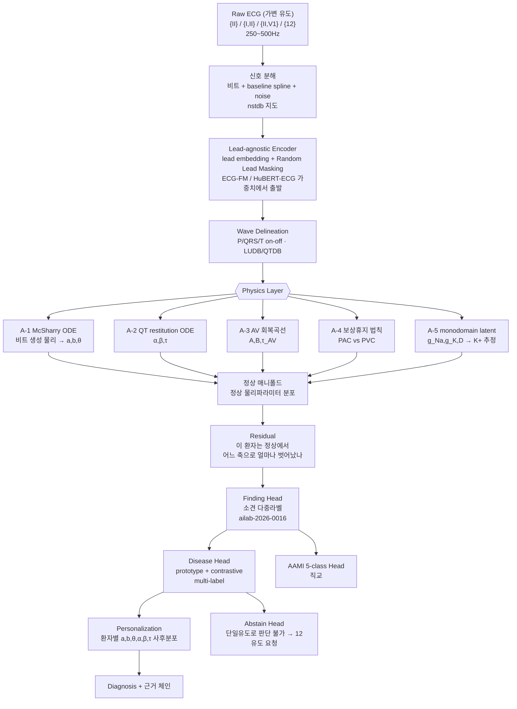

## Overview
PPT의 설계 철학 — **"정상을 먼저 배우고, 질환은 정상에서 얼마나 벗어났는지로 판단하고,
마지막에 그 환자 기준으로 다시 본다"** — 은 그대로 유지할 가치가 있다. 이건 의사가 심전도를
읽는 순서 그 자체이고, 2024~2026년의 ECG foundation model 흐름(자기지도 사전학습 → 정상
표현 학습 → 다운스트림 진단)과도 같은 방향이다.

이 카드는 그 위에 **세 가지를 더한다**:

1. **오픈 데이터 지도** — Step1(정상만)·Step2(질환)·Step3(개인화)에 **각각 다른 데이터셋이
   필요**하다. 단계별로 뭘 쓸지 못 박는다.
2. **Physics Layer를 "규칙 페널티"가 아니라 진짜 미분방정식으로** 넣는 자리 5곳.
   PPT의 판단신호 중 **어디가 진짜 PINN 감이고 어디가 아닌지**를 구분한다.
3. **Validation 설계의 치명적 결함 하나**(같은 시험지를 고쳐가며 재응시 = 시험지 유출)와
   그 교정.

원천 자료: 사용자 설계 PPT 15장(Step1~3 + Validation1~4), Harrison 기반 EKG 44질환 정리 PDF.
정상 판정 규칙세트와 단일유도 진단 가능 범위는 짝 카드 **`ailab-2026-0016`** 으로 분리했다.

## 왜 독립 퀘스트인가
- 이건 한 주차 숙제가 아니라 **학위논문 한 편 분량의 트랙**이다. Step1만 해도 "정상 매니폴드
  학습 + 물리 제약 + 파형 분할"이 다 들어간다.
- 기존 퀘스트 `ailab-2026-0011`(inter-patient 일반화)이 **"왜 안 되는가"** 를 다뤘다면, 이
  퀘스트는 **"그래서 어떤 구조로 갈 것인가"** 를 다룬다. 0011의 실험들은 이 구조의 부분집합이다.
- 1주차 실측이 이미 답을 준다: intra 0.83 → inter 0.35, **S가 0.179로 붕괴**. 형태만 보는
  1D-CNN은 S를 못 잡는다. 그런데 **S를 결정하는 건 형태가 아니라 물리(조기성 + 동방결절
  리셋 여부)** 다. Physics Layer가 정확히 여기를 겨냥한다.

## 문제 정의
- **무엇**: 단일유도(주로 lead II) ECG에서 ① 정상/비정상 ② 소견(finding) ③ 질환 ④ AAMI
  비트클래스를 **환자 단위 분리(inter-patient)** 조건에서 판정하고, ⑤ 환자 개인 baseline으로
  보정한다.
- **왜 어려운가** (1주차에서 실측으로 확인한 3중고에 2개 추가):
  1. 분포 이동(환자마다 파형 버릇이 다름) — inter 0.35
  2. 극심한 클래스 불균형 — F support 수백 개
  3. 형태만으론 정보 부족 — S 0.179
  4. **라벨-유도 불일치**: PTB-XL·Chapman의 라벨은 12유도를 보고 붙은 것인데 lead II만
     입력하면 **관측 불가능한 라벨을 맞히라고 강요**하게 된다(→ 환각 학습).
  5. **정상의 정의가 데이터마다 다름**: "NORM" 라벨은 판독의가 정상이라 부른 것이지
     교과서 기준을 통과한 것이 아니다.

## 1. 오픈 데이터 지도 (2026-07-31 기준)

### Step1 — 정상만 학습 (정상 매니폴드)
PPT가 "학습 데이터셋에는 정상만 넣는다"고 못 박았으므로, **정상 전용 코퍼스**가 따로 필요하다.

| 데이터 | 규모 | 유도 | Step1에서의 역할 |
|---|---|---|---|
| MIT-BIH Normal Sinus Rhythm (`nsrdb`) | 18명 장시간 | MLII 계열 2ch | 순수 정상 장시간 — 시계열 정상 변동 학습의 핵심 |
| Fantasia | 젊은20 + 노년20, 각 120분 | 단일 ECG | **연령별 정상 변이**(HRV 차이) — 노인 정상을 비정상으로 안 부르게 |
| PTB-XL `NORM` 서브셋 | 약 9.5k 레코드 | 12유도(→II 슬라이스) | 10초 스냅샷 정상의 형태 다양성 |
| MIT-BIH NSR RR Interval DB / Autonomic Aging | RR·연령 메타 | — | RR 동역학의 정상 범위 |
| CODE-15 정상 서브셋 | 34.5만 중 다수 | 12유도 | 대규모 사전학습용(브라질 원격의료, Zenodo 공개) |

> **주의**: `nsrdb`+Fantasia만으로는 18+40명이라 **환자 다양성이 절대 부족**하다. PPT의
> "정상만으로 충분히 학습" 은 실제로는 PTB-XL NORM·CODE-15 normal을 섞어야 성립한다.

### Step2 — 질환 학습 (Tier 1: 반드시)
| 데이터 | 규모 | 유도 | 왜 필요한가 |
|---|---|---|---|
| **MIT-BIH Arrhythmia** (`mitdb`) | 48레코드 30분, 360Hz | **MLII + V1** | 비트 단위 AAMI 5-class의 표준. 대부분 레코드가 사실상 lead II |
| **MIT-BIH Supraventricular Arrhythmia** (`svdb`) | 78레코드 | 2ch | **S 클래스 보강용 — 1주차 S붕괴의 직접 해법. 0011 퀘스트에 빠져 있던 데이터** |
| **PTB-XL** | 21,799 / 18,869명, 71 SCP | 12유도 500Hz | 진단 라벨의 표준 벤치마크, CC-BY. 계층 라벨(super/sub/diagnostic) |
| **Chapman-Shaoxing + Ningbo** (`ecg-arrhythmia`) | 45,152레코드 | 12유도 500Hz | 리듬 라벨이 풍부, 최근 Transformer 논문의 기본 |
| **PhysioNet/CinC 2021** 통합셋 | 6개 출처 ~88k | 12/6/4/3/**2유도(I·II)** | **단일·축소유도 연구의 정답지** — SNOMED-CT로 라벨 통일 |
| **PhysioNet/CinC 2017** | 8,528 | **단일유도(AliveCor)** | 정상/AF/기타/**노이즈** 4클래스 — 노이즈가 라벨로 들어있는 유일급 |
| **LUDB** | 200명 12유도 | P/QRS/T **경계 주석** | 파형 분할(delineation) 학습 — Physics Layer의 전제 |
| **QT Database** (`qtdb`) | 105레코드 | 2유도 | QT/T-end 수동 주석 — QT restitution 물리의 정답 |
| **MIT-BIH Noise Stress** (`nstdb`) | 노이즈 3종 | — | baseline wander·EMG·전극 움직임 — PPT 6번 "노이즈 감소" 전용 |

### Step2 — Tier 2 (질환별 보강)
`afdb`(AF 10시간×23) · `ltafdb`(장기 AF 84) · `cpsc2018`(6,877/9클래스) ·
`cpsc2021`(**lead I+II 웨어러블 홀터**, 발작성 AF) · `incartdb`(75명, PVC 풍부) ·
`edb`(European ST-T, ST/T 주석) · `vfdb`·`cudb`(VF/VT) · `sddb`(심장급사 홀터) ·
`ptbdb`(PTB Diagnostic 549, MI) · Georgia 12-lead(10,344) · `apnea-ecg` · `bidmc`(CHF).

### Step3 — 개인화 / 시계열
| 데이터 | 왜 |
|---|---|
| **MIMIC-IV-ECG** (80만 ECG / 16.1만명) | **같은 환자의 여러 시점 ECG + Lab(K⁺·Ca²⁺) + 진단코드**가 연결됨 → 개인 baseline 변화 추적의 사실상 유일한 대규모 공개 자원. *credentialed(CITI+DUA) 필요, 완전 오픈 아님* |
| **Icentia11k** | 11,000명 · 20억 비트 · 250Hz **연속 장기**. 단, **modified lead I**(lead II 아님 — PPT 가정과 다름, 도메인 갭 주의) |
| `ltafdb`, `afdb`, `sddb` | 같은 환자 24~48시간 → "평소 beat 집합 → 변한 beat" 추출에 딱 |
| CODE-15 / SaMi-Trop | 대규모 + 추적 결과(사망) 라벨 |

### 2025~2026 신규 (확인된 것)
- **MEETI** (Sci Data 2026): MIMIC-IV-ECG 기반 **신호 + 이미지 + feature + 판독문** 동기화셋 →
  Step2의 "질환 ECG 특징 텍스트 제공" 아이디어를 그대로 구현 가능.
- **PhysioNet Brugada 12유도 데이터셋** (2026-02 공개), **ARGO**(허혈성 VT의 심내막 EGM +
  12유도 + 전기해부학적 맵, 2026-07 공개) — 희귀질환·기전 연구용.
- **PhysioNet/CinC 2025**: 12유도에서 **샤가스병** 검출(CODE-15 + SaMi-Trop). 2026 챌린지는
  수면다원검사 기반이라 ECG 주제 아님.
- 오픈웨이트 **ECG foundation model**: `ECG-FM`(JAMIA Open 2025, 1.5M ECG, HF 체크포인트),
  `HuBERT-ECG`(9.1M ECG, 4개국), 벤치마크 `OpenECG`(1.2M)·`BenchECG/xECG`·
  `ecg-fm-benchmarking`(12데이터셋 26태스크). **Step1 인코더를 처음부터 짜지 말고 여기서 출발**할 것.

### 라이선스 실무
CC-BY 계열(PTB-XL, CODE-15, LUDB 등)은 자유롭게 쓰되 인용 필수. **MIMIC-IV-ECG는 PhysioNet
credentialed access + DUA** 라 "무료 공개"지만 절차가 있고 **재배포 금지**다(MedKOS의
`assets/ecg/`에 그대로 커밋하면 안 된다 — 파생 수치만).

## 2. PINN을 어디에, 어떻게 넣나

### 먼저 용어 정리 (여기가 핵심)
"P파 폭이 80~120ms를 벗어나면 페널티" 는 **PINN이 아니다.** 그건 범위 규칙(rule penalty)이다.
PINN은 **미분방정식의 잔차(residual)를 손실에 넣어, 해가 그 방정식을 만족하도록 강제**하는
방법이다. 그러니 질문은 이렇게 바꿔야 한다 — **"PPT의 판단신호 중 진짜 미분방정식으로 쓸 수
있는 게 뭔가?"** 다행히 꽤 많다.

### Tier A — 진짜 PINN 감 (미분방정식이 실재함)

**A-1. 정상 비트의 생성 물리 — McSharry–Clifford ODE (PPT 슬라이드2·4의 "정상 집합 벡터")**

```
dx/dt = αx − ωy,   dy/dt = αy + ωx,   α = 1 − √(x²+y²)
dz/dt = −Σᵢ aᵢ·Δθᵢ·exp(−Δθᵢ²/2bᵢ²) − (z − z₀),   i ∈ {P,Q,R,S,T}, Δθᵢ = (θ−θᵢ) mod 2π
```
- 이 ODE를 풀면 각 파형은 **zᵢ(θ) = aᵢbᵢ²·exp(−Δθᵢ²/2bᵢ²)** 가 된다.
- **PPT가 원한 것과 정확히 대응한다**:
  - "극댓값/극솟값" → 진폭 **aᵢbᵢ²**
  - "**하부 적분값**" → 면적 **aᵢbᵢ³√(2π)** (닫힌 해가 존재! 수치적분 필요 없음)
  - "지속시간" → **bᵢ**, "위치" → **θᵢ**
  - "정상 집합 벡터" → **15차원 (a,b,θ) 파라미터 공간**. 불투명한 latent가 아니라
    **물리적으로 해석되는 좌표**라, "무엇이 얼마나 벗어났는가"를 그대로 말할 수 있다.
- **손실**: `L_ode = ‖dẑ/dt − f(ẑ, θ; a,b)‖²` (collocation point에서). 인코더가 뱉은
  (a,b,θ)로 재구성한 비트가 ODE를 만족해야 한다.
- **정상 매니폴드 = 정상 데이터의 (a,b,θ) 분포**, **질환 = 그 분포에서의 이탈 방향**.
  PPT의 "벡터 차이로 질환 판단"이 여기서 문자 그대로 구현된다.

**A-2. QT 재분극 restitution + 기억(hysteresis) — PPT의 "심박수 보정"**

Bazett 공식(QT/√RR)은 극단 심박수에서 틀린다는 게 AHA/ACCF/HRS Part IV의 지적이다.
진짜 물리는 **1차 지연 ODE**다:
```
dQT/dt = ( QT_ss(RR) − QT ) / τ ,   QT_ss(RR) = α + β·RR ,   τ ≈ 2분(rate adaptation lag)
```
- **손실**: 시계열 전체에서 이 ODE 잔차. RR이 갑자기 변한 뒤 QT가 **즉시** 따라가면 페널티.
- **(α, β, τ)가 곧 개인화 파라미터**다 → Step3가 "가중치 재학습"이 아니라
  **환자별 물리 파라미터 추정**이 된다. 훨씬 데이터 효율적이고 해석 가능하다.
- LQTS/약물성 QT연장은 **α 이탈**, TdP 위험은 **β·τ 이상**으로 분리된다.

**A-3. 방실결절 회복곡선 — PPT의 "조기박동 이후 변화" / 2도 AV block**
```
AH(n+1) = A + B·exp( −HP(n) / τ_AV )      (HP = 선행 회복시간)
```
- 이 지수 회복곡선 하나에서 **Wenckebach 주기성(PR 점증 → 탈락)이 자동으로 창발**한다.
- **Mobitz I vs II를 패턴 매칭이 아니라 기전으로 구분**하게 된다(I = 회복곡선 위, II = 곡선
  이탈·all-or-none). 단일 lead II로 충분히 관측 가능한 영역이라 실전성이 높다.

**A-4. 동방결절 리셋 물리 — 보상성 휴지 (★ 1주차 S붕괴의 직격 처방)**
```
PVC (심실 기원, 역행전도가 SA node를 리셋 못함) : RR_pre + RR_post ≈ 2·RR_sinus  (완전보상)
PAC (심방 기원, SA node 리셋)                    : RR_pre + RR_post <  2·RR_sinus  (불완전보상)
```
- 이건 **범위 규칙이 아니라 심박동 생성의 법칙**이다. 미분가능한 제약으로 바로 들어간다:
  `L_pause = |p(V) − σ( −λ·|RR_pre+RR_post−2RR̄| ) |` 식으로 **클래스 확률과 휴지 물리를 결합**.
- 1주차에서 **S가 0.179로 죽은 이유**가 바로 이거다. 형태(morphology)만 보면 PAC의 QRS는
  정상 비트와 거의 같다. **PAC를 정의하는 건 형태가 아니라 타이밍 물리**다.
  → **이 하나만 제대로 넣어도 S가 가장 크게 오른다고 본다. 실험1로 최우선.**

**A-5. 전도·재분극의 세포 물리 — monodomain/eikonal (해석 가능 latent)**
```
∂V/∂t = ∇·(D∇V) + f(V,w)/C_m      (1D cable로 축약 가능; Aliev–Panfilov 2변수면 충분히 쌈)
전도속도 CV ∝ √D · (dV/dt)_max  →  QRS폭 ∝ L/CV
```
- 고칼륨혈증: Na채널 불활성화 ↓(dV/dt)max → CV↓ → **QRS 확장**, 동시에 I_Kr↑ → **뾰족한 T**.
  즉 "QRS폭"과 "T 첨예도"는 **독립 feature가 아니라 하나의 잠재변수([K⁺])의 두 그림자**다.
- **미분가능 시뮬레이터를 디코더로** 두고 (g_Na, g_K, D)를 추정하면, 모델 출력이
  "고칼륨혈증 0.82" 가 아니라 **"추정 [K⁺] 6.4 mM, CV 32% 감소"** 가 된다.
  → MIMIC-IV-ECG의 **실제 혈청 K⁺ 검사값으로 이 latent를 지도학습**할 수 있다(공개 데이터로
  검증 가능한 물리 latent — 이 퀘스트에서 가장 논문 되기 좋은 지점).
- 2025~2026년에 EP용 PINN·neural operator(FNO/DeepONet) 논문이 여럿 나와 있어 밟고 갈 발판이 있다.

**A-6. 단일유도의 관측 한계 — 이것도 물리다**
lead II = 심장 쌍극자 벡터의 **60° 방향 1차원 투영**. 3차원 벡터를 1개 스칼라로 본 것이라
**국소화(전벽/후벽/우심실)는 원리적으로 복원 불가**다. 이건 모델을 잘 짜서 극복할 문제가
아니라 **정보이론적 한계**다. → 그래서 **"판단 불가 / 12유도 필요" 라는 기권(abstain) 출력이
물리적으로 정당화**된다. 상세 범위는 `ailab-2026-0016` 참조.

### Tier B — PINN 아님. 규칙이지만 넣을 가치는 있음
P폭 80~120ms, P진폭 ≤2.5mm, PR 120~200ms, QRS <120ms, HR 40~220, 축 −30~+90 …
- 이건 **통계적 정상범위**지 방정식이 아니다. → **soft rule regularizer**로 넣되,
  **정상 브랜치(재구성/정상 매니폴드)에만** 건다.
- 더 좋은 방법: **손실이 아니라 구조로 강제**한다. 출력을 (a,b,θ) 같은 물리 파라미터로
  **재파라미터화**하면 "불가능한 파형"이 애초에 표현되지 않는다(hard constraint by
  construction). 손실 균형 튜닝 지옥을 피할 수 있다.
- **조건부여 필수**: PR 정상범위는 심박수·연령에 따라 달라진다. 상수 규칙은 노인·운동선수를
  전부 비정상으로 만든다.

### Tier C — 절대 PINN 넣으면 안 되는 곳 (★ 참고 PDF의 조언과 다른 지점)
**최종 질환 분류 헤드에 "생리적으로 불가능한 값" 페널티를 걸면 안 된다.**
- 참고 PDF는 "CNN이 QRS 240ms를 예측하면 페널티" 를 제안했는데, **QRS 240ms는 실제로 존재한다**
  — 고칼륨혈증, 임종기 리듬, 심한 나트륨채널 차단(TCA 중독)에서 흔하다. 여기에 페널티를 걸면
  **모델은 가장 위중한 환자에게서 눈이 먼다.**
- 원칙: **물리 제약은 "정상 생성 브랜치"에만 걸고, 질환 판단은 그 잔차(residual)로 한다.**
  물리를 위반한다는 사실 자체가 **질환의 증거**여야지 억제 대상이 되면 안 된다.
- 즉 구조는 `물리 제약 → 정상 재구성 → 잔차 → 질환` 이지, `물리 제약 → 질환 출력` 이 아니다.

### 손실 균형 (실무에서 제일 많이 터지는 곳)
PINN은 손실 항 가중치가 안 맞으면 **stiff한 잔차항이 다 잡아먹어 학습이 죽는다.**
- 고정 가중치 금지 → **불확실성 기반 자동 가중(Kendall) 또는 GradNorm**.
- **커리큘럼**: 1단계 재구성만 → 2단계 물리 잔차 추가 → 3단계 분류 헤드. 처음부터 다 켜면 안 된다.
- 물리 손실은 **정상 데이터에서만** 켠다(질환 데이터에서 켜면 Tier C 문제가 재발).

## 3. PPT 판단신호 → 어느 계층으로 가는가

| PPT의 판단신호 | 어디로 | 방식 |
|---|---|---|
| P/QRS/T 형태, inverted 여부 | Wave delineation → Physics A-1 | LUDB로 지도학습 + ODE 잔차 |
| 극댓/극솟값 | Physics A-1 파라미터 `aᵢbᵢ²` | 물리 좌표로 흡수 |
| **하부 적분값** | Physics A-1 면적 `aᵢbᵢ³√(2π)` | **닫힌 해 존재 — 수치적분 불필요** |
| 상승·하강 기울기, T파 좌우대칭 | Finding head (feature) | 물리 아님. 단, 대칭성은 A-5의 재분극 분산과 연결 |
| Baseline 형태·기울기 | 구조적 분해 | `신호 = 비트 + baseline 스플라인 + 노이즈` 로 **명시적 분해**. `nstdb`로 지도 |
| RR/PQ/ST/TP interval | Finding head + Physics A-2/A-3/A-4 | 값 자체는 feature, **관계는 물리** |
| 심박수 보정 | **Physics A-2** | Bazett 대신 restitution ODE |
| 단일비트 vs 2/4비트 vs a1↔a20 비교 | Encoder(멀티스케일) | dilated conv + attention. 물리 아님 |
| 조기박동 후 T파 이상 | **Physics A-3/A-4** | 회복곡선 + 보상휴지 |
| 여러 질환 동시 | Disease head | **multi-label**(softmax 금지) |
| AAMI 5-class | 별도 직교 헤드 | PPT 판단대로 질환과 분리. 옳다 |
| 개인 baseline 차이 | Personalization | **A-2의 (α,β,τ) + A-1의 (a,b,θ) 환자별 사후분포** |

## 4. Validation 재설계 (★ 현재 설계의 치명적 결함)

**PPT 슬라이드8·14의 "Validation1a → 조정 → 1b → 조정 → 1c…" 는 통계적으로 무효다.**
시험지를 여러 장 만들어도 **매번 결과를 보고 가중치를 고치면 그 시험지 전부가 학습셋이 된다.**
"오염 차단"을 의도했지만 실제로는 **다중검정으로 오염을 누적**시키는 구조다. 96%는 그렇게 해서
나온 숫자가 되고, 진짜 새 환자에서는 무너진다 — **1주차에서 이미 0.83 → 0.35로 겪은 그 현상**이다.

교정안:

| PPT | 교정 |
|---|---|
| Validation1a/1b/1c… 반복 조정 | **train / val / test 3분할.** 조정은 **val에서만**. test는 **전 과정에서 딱 한 번** |
| 96%까지 계속 올린다 | **목표를 사전 등록(pre-register)**. 못 넘으면 못 넘었다고 보고. 임계 조정으로 만든 96%는 무의미 |
| inter-patient test | 유지 — 이건 잘한 것. **de Chazal DS1/DS2**(mitdb), PTB-XL 공식 fold 1-8/9/10 |
| — | **외부 검증 추가**: PTB-XL로 학습 → Chapman/Georgia로 테스트(병원·기기 이동). 진짜 일반화는 여기서 판정 |
| 민감도·특이도 | + **macro-F1, PR-AUC, 클래스별 sens/spec, 캘리브레이션(ECE), 부트스트랩 95% CI** |

**목표치 현실화** (2026년 문헌 기준):
- inter-patient MIT-BIH AAMI: **V 클래스 sens 90% 내외, S 클래스 sens 60~80%** 가 현재 수준.
  **S에서 96/96은 아직 아무도 못 했다.** 1주차 S 0.179 → 0.4~0.5면 이미 큰 성과다.
- 단일유도 정상 vs 비정상 이분: 민감도·특이도 **동시** 96%는 공개 문헌 최고 수준을 넘는다.
  현실 목표는 **sens 90~93% @ spec 85~90%**.
- 반면 **AF 검출(단일유도)은 sens/spec 95%+ 가 실제로 보고**된다 → **질환마다 목표를 따로 잡아야 한다.**
  전 질환 일괄 96%는 설계 오류다.

**Step3(개인화) 검증 설계** — 여기 leakage가 숨기 쉽다:
- 개인화에 쓴 구간과 평가 구간을 **시간으로 분리**(앞 구간으로 튜닝 → 뒤 구간 평가).
- **대조군 필수**: "전문가 라벨 N비트 추가" vs "무작위 N비트 추가" 를 비교해야 개인화의 효과가
  증명된다. (고전 결과: 환자별 소수 비트 적응만으로 SVEB 민감도가 크게 오른다 — Step3의 근거)

## Architecture



## 5. 유도 구성 전략 — lead-agnostic 설계 ≠ 유도 ablation

이 둘은 자주 혼동되는데 **층위가 다르다**. 섞으면 실험이 오염된다.

| | lead-agnostic 설계 | 유도 ablation |
|---|---|---|
| 무엇 | **학습·아키텍처**의 성질 | **평가**의 설계 |
| 질문 | "한 모델이 임의 유도 조합을 받을 수 있는가" | "유도를 줄이면 무엇을 잃는가" |
| 산출물 | 모델 하나 | 표 하나 (유도구성 × 라벨군) |
| 없어도 되나 | ablation은 모델 N개로도 가능 | lead-agnostic 모델이어도 안 할 수 있음 |

**그런데 실제로는 lead-agnostic이 없으면 ablation이 공정하지 않다.** 유도 구성마다 모델을
따로 학습하면, 성능 차이에 **유도 정보량 + 학습 분산 + 하이퍼파라미터 운**이 섞여 들어간다.
**같은 가중치 하나를 유도만 바꿔 평가**해야 "이 유도가 없어서 잃은 것"이 분리된다.
→ **lead-agnostic은 ablation을 공정하게 만드는 장치**다. 목적이 아니라 수단.

### 세 가지 선택지

| | 구성 | 장 | 단 |
|---|---|---|---|
| A | 유도 구성별 독립 모델 N개 | 각 구성 최적화 가능 | N배 비용, 비교 오염, 배포 N개 유지, 데이터 분절 |
| **B** | **단일 lead-agnostic 모델**<br/>(lead embedding + Random Lead Masking) | **데이터 전부 활용, ablation 깨끗, 배포 하나. CinC2021 우승 방식** | 구현 난도 ↑ |
| C | 12유도 모델 + 재구성 어댑터 | 기존 12유도 모델 재사용 | **위험** — 재구성은 평균회귀라 개인화된 출력이 아님(2025 경고) |

→ **B로 간다.** 학습 시 유도를 p≈0.5로 무작위 마스킹(RLM)하면 한 모델이 `{II}`·`{I,II}`·
`{II,V1}`·`{12}` 를 전부 처리한다.

### ★ 학습 순서는 "작은 것 → 큰 것"이 아니라 **"큰 것으로 배우고 작은 것으로 배포"**

직관은 "2유도부터 하고 나중에 12유도로 확장"이지만, **거꾸로 가는 게 맞다**:

```
사전학습 : 12유도 풀셋 (PTB-XL 21.8k + Chapman 45k + MIMIC 800k) + Random Lead Masking
   ↓
fine-tune : 목표 유도 구성
   ↓
평가      : 유도 구성별 ablation (동일 가중치, 유도만 교체)
   ↓
배포      : 웨어러블 {II} 또는 {I,II} / 텔레메트리 {II,V1}
```
이유: ① 12유도 데이터가 압도적으로 많고 라벨이 풍부하다 ② **흉부유도가 있어야 배울 수 있는
표현이 사지유도 해석에도 도움이 된다**(교사 신호) ③ 2유도만으로 처음부터 학습하면 표현의
상한이 낮게 고정된다.

그리고 이 구조에서는 **"12유도로 넘어간다"는 단계가 아예 없다.** 유도는 토큰이 하나 늘 뿐이라
**처음부터 12유도가 포함되어 있다.** 확장이 아니라 포함 관계다.

### ★ 전두면 벡터 augmentation (I+II를 쓸 때만 가능한 무료 점심)

전두면에서 lead I은 0°, lead II는 +60° 방향 투영이므로 심장벡터의 전두면 성분이 **정확히** 복원된다:
```
Hx = I ,   Hy = (2·II − I)/√3
임의 각도 θ의 사지유도 :  L(θ) = Hx·cosθ + Hy·sinθ
```
- 즉 **I+II만 있으면 임의 각도의 사지유도를 합성**할 수 있다(근사가 아니라 쌍극자 가정 하 정확).
- 활용 ①: **전극 위치 변이 augmentation** — 웨어러블/패치의 modified lead II(실제로는 45°~75°
  어딘가)를 합성해 학습에 섞는다. 배치 환경의 전극 위치 오차에 강해진다.
- 활용 ②: **축(axis) 계산** → LAFB/LPFB·축편위가 진짜로 판정 가능해진다.
- 활용 ③: **전두면 VCG 루프 제약**을 Physics Layer에 추가할 수 있다(아래).

### 유도 구성에 따라 Physics Layer가 "켜지는 만큼" 늘어난다

| 유도 구성 | 작동하는 물리 제약 | 배치 대상 |
|---|---|---|
| `{II}` 단독 | A-1 McSharry · A-2 QT restitution · A-3 AV 회복 · A-4 보상휴지 (전부 작동) | 패치·홀터 단채널 |
| `{I, II}` | 위 전부 **+ 전두면 벡터 복원 → 축 제약 · 전두면 VCG 루프 · 임의각 유도 합성** | 웨어러블·3전극 텔레메트리 |
| `{II, V1}` | `{II}` 전부 + 우측 흉부 정보(P파 형태·wide-complex 감별). 축은 불가 | **병원 5전극 텔레메트리(임상 관행)** |
| `{12}` | 위 전부 **+ 횡단면 → 완전 VCG(Kors/Dower) → 3D 쌍극자 → monodomain 역문제(ECGI 계열)** | 외래·응급 표준 12유도 |

**하나의 프레임워크가 유도가 늘어날수록 물리 제약이 자연히 늘어나는 구조**가 된다.
Physics Layer를 유도별로 다시 짤 필요가 없다.

### ⚠️ lead-agnostic이 흡수하지 **못하는** 것 (과신 금지)
유도 개수는 흡수되지만 **도메인 차이는 흡수되지 않는다**:

| 축 | 웨어러블 | 텔레메트리 | 12유도 진단 |
|---|---|---|---|
| 샘플링 | 250Hz | 250~500Hz | 500Hz |
| 전극 | 건식·패치, **modified 위치** | 습식, 5전극 | 표준 위치 |
| 노이즈 | 움직임 아티팩트 심함 | 중간 | 낮음 |
| 길이 | 수시간~수주 연속 | 연속 | 10초 스냅샷 |

→ 별도 대응 필요: **리샘플링 표준화 + 랜덤 리샘플 augmentation**, **`nstdb` 노이즈(bw/ma/em)
합성 주입**, **전두면 각도 augmentation**(위 활용①), 그리고 도메인별 배치 성능은 **따로 보고**한다.
"유도 ablation을 했으니 웨어러블·텔레메트리 둘 다 된다"는 **아직 아니다** — 유도 축만 통제한 것이다.

## ⚠️ 선행 연구와의 정합 (2026-07-31 확인)

이 퀘스트를 쓴 뒤 `mit-bih/`(별도 트랙, `PAPER.md` 수준)를 확인한 결과 **여기서 제안한 실험 1은
이미 완료**되어 있었다. 중복 방지를 위해 기록한다.

| 이 카드의 계획 | 선행 결과 (`mit-bih/PAPER.md`) | 판정 |
|---|---|---|
| 실험1 A. 형태만 | B2 CNN(raw) 환자매크로 F1 **0.164** | 완료 |
| 실험1 B. +RR | B3 CNN+RR **0.484** — Δ**+0.320** [+0.246,+0.396] Bonferroni 통과 | **확증됨** |
| 실험1 C. +보상지수 물리 | B4(RHYTHM innovation 포함) 0.534 — B4−B3 Δ+0.050 **[−0.022,+0.122]** | **판정 불가(검정력 부족)** |

- 선행 연구의 결론: **정보의 종류가 모델의 정교함을 압도한다**(리듬 +0.320 vs 구조 정교화 +0.050 비유의).
  음성 결과 13건(SMOTE·FiLM·patient embedding·metric learning·다중비트 컨텍스트 등) 확보.
- 선행 연구가 지목한 병목: **데이터(DS1 22명·S 944비트), 그리고 검정력**. `PAPER.md` §8.4 가설 3.
- **따라서 이 퀘스트의 Physics Layer 구상은 "새 물리 특징을 더 만드는" 방향으로 가면 안 된다.**
  선행 연구가 특징 축(RHYTHM innovation = 보상지수)을 이미 넣었고 비유의였다.
  남은 두 갈래는 ① **검정력을 올려 그 비유의를 확정**(실험1′) ② 물리를 **특징이 아니라 loss·구조
  제약**으로 넣기(실험2 이후) — ①이 훨씬 싸고 결과가 ②의 진행 여부를 결정한다.

## 실험 1′ 결과 — 종결 (2026-07-31)

**Icentia11k 600환자 수집 · 467,885비트 · Q비트 제외 후 580명(학습 377 / 테스트 203, 이소성 보유 90) · 단일유도 250 Hz**
실행 로그 카드: `ailab-2026-0017` (run `20260731T1655_exp1p_icentia`, 80분)

| ARM | 환자매크로 F1(이소성) | N | S | V |
|---|---|---|---|---|
| B2 형태만 | 0.5871 | 0.990 | 0.306 | 0.556 |
| B3 형태+RR | 0.7139 | 0.992 | 0.445 | 0.723 |
| B3R 형태+RHYTHM(보상지수) | 0.7188 | 0.994 | 0.501 | 0.772 |

| 비교 | Δ | 95% CI | 판정 |
|---|---|---|---|
| **B3 − B2** (리듬 축) | **+0.1268** | [+0.0810, +0.1759] | **유의 ★** |
| **B3R − B3** (보상지수 축, 사전등록 주가설) | **+0.0049** | **[−0.0254, +0.0321]** | **기각(확정)** |
| B3R − B2 | +0.1318 | [+0.0830, +0.1803] | 유의 ★ |

**CI 반폭 0.0287** (SVDB 73환자 때 0.073) → 사전등록 기준 0.03 미만 = **판정 가능한 음성**.

### 결론 1 — 보상지수를 별도 특징 축으로 빼는 것은 이득이 없다 (확정)
선행 트랙의 미결 가설이 닫혔다. `PAPER.md` §8.4의 세 가설 중 **가설 1(정보 포화)** 이
답이고, 가설 3(표본 한계)은 **배제**된다. 선행 B4−B3 = +0.050 [−0.022, +0.122]은
검정력 부족이 아니라 **실제로 0이었다**(본 실행 +0.005 [−0.025, +0.032]).

### 결론 2 — 왜 실패했는지가 이 퀘스트의 설계 원칙을 확인해준다
**보상지수는 RR의 재조합이다.** `comp = pre_innov + post_innov` 는 RR 계열에서 유도되는
값이고, B3는 이미 RR을 갖고 있었다. 즉 **새 정보가 아니라 같은 정보의 다른 표현**이었다.
선행 트랙의 교훈 "재조합은 안 오른다, 새 정보만 오른다"가 물리 특징에도 그대로 적용된다.
→ **이 결과는 Physics Layer 구상을 부정하지 않는다.** 부정되는 것은 "RR에서 파생된
물리량을 특징으로 더 얹는" 갈래뿐이고, **새 관측을 더하는 갈래(P파 분할, K⁺ latent,
유도 확장)는 그대로 살아 있다.**

### 결론 3 — 리듬 축의 필수성은 재현됐다 (교차 데이터셋)
B3 − B2 = **+0.1268** [+0.0810, +0.1759] 유의. 선행 SVDB의 +0.320보다 작지만 같은 방향.
특히 **B2에서 S 0.306 vs V 0.556** — 형태만으로는 S가 V보다 훨씬 안 잡힌다
(`PAPER.md` §8.1 "S는 형태적으로 N과 구별되지 않는다"의 재현). **다른 기기·다른 인구·
단일유도**에서 재현된 것이라 외적 타당도를 보강한다.

### 결론 4 — 사전점검이 결과를 미리 맞혔다 (도구 검증)
학습 전 물리 사전점검에서 **Cohen's d = +0.283**(예비 114환자 때는 +0.772 — 소표본 낙관).
d < 0.3이면 학습으로 짜낼 게 거의 없다는 노트북의 사전 경고가 그대로 실현됐다.
→ **새 물리 축을 넣을 때마다 학습 전 2분짜리 사전점검으로 걸러낼 수 있다**는 것이 확인됐다.

### 기록해둘 관찰 (교과서와 다른 부분)
대규모 웨어러블 데이터에서 보상지수의 S↔V 분리는 **교과서 기대보다 훨씬 약하다**:
S IQR [−0.098, +0.018] · V IQR [+0.000, +0.035]로 거의 겹친다(예비 소표본에서는 32배
차이로 보였다). 완전/불완전 보상성 휴지의 이분법이 **단일유도 장기 기록에서는 깨끗하게
성립하지 않는다** — 라벨 정의·자동 R검출 오차·환자 이질성 중 무엇 때문인지는 미해결.

### 방법론 메모 — 비트풀링과 환자단위가 반대로 말한다
비트풀링 F1은 B3→B3R에서 **S +0.056, V +0.049로 뚜렷이 개선**된 것처럼 보이지만
환자단위 매크로는 +0.005로 평평하다. 이득이 **이소성 비트가 많은 소수 환자에게 집중**돼
있다는 뜻이다(선행 §8.3의 #232 지배 현상과 같은 구조). **환자단위 매크로를 주지표로
삼았기 때문에 오판을 피했다** — 이 규칙은 앞으로도 유지한다.

### 미해결로 남기는 것
- 학습셋 가중 후 유효 개수가 N 53,810 vs S+V 22,708로 **N이 2.4배 우세**했다.
  effective-number 가중치(β=0.9999)는 표본이 커지면 포화해 소수클래스 상대가중이 줄어든다.
  **다만 이는 세 arm에 동일하게 적용되므로 B3R−B3 비교의 타당성은 훼손하지 않는다.**
  절대 성능의 동작점 문제이므로, 건드린다면 **별도로 새로 사전등록한 실험**에서 할 것.
  (결과를 본 뒤 가중치를 바꿔 재실행하는 것은 시험지 오염이다.)

## 실험 2 결과 — P파 분할 (2026-08-01)

**Icentia11k 580환자(실험1′과 동일 분할) · 테스트 203명(이소성 보유 90명)**
게이트는 둘 다 통과했다: **G1** LUDB held-out P Dice **0.822**(QRS 0.917 · T 0.831,
난이도 순서가 생리학과 일치) · **G2** 최대 |Cohen's d| **0.944**(실험1′ 보상지수 0.283의 3배).
**LUDB(임상 12유도·500Hz) → Icentia(웨어러블·modified lead I·250Hz) 전이 성공** —
P 검출률이 **N 81.8% > S 54.5% > V 25.5%** 로 기전 그대로 갈렸다(PVC는 선행 P가 없다).

| ARM | 환자매크로(이소성) | 환자매크로(전체) | N | S | V |
|---|---|---|---|---|---|
| B3 형태+RR | **0.7289** | 0.7278 | 0.991 | 0.400 | 0.777 |
| B3P +P파 | 0.6854 | 0.7272 | 0.995 | **0.533** | 0.791 |

**사전등록 주가설 B3P − B3 = −0.0435 [−0.0799, −0.0090] → 유의한 음수 = 역효과.**

### ★ 그런데 역설이 있다 — 비트풀링은 세 클래스 전부 올랐다
`S 0.400→0.533(+0.133)` · `V 0.777→0.791` · `N 0.991→0.995`. **모든 클래스가 개선**됐는데
환자단위 매크로는 **떨어졌다**. 실험1′에서 본 괴리(비트풀링 개선 / 환자단위 평평)가
여기서는 **부호까지 뒤집힌** 형태로 나타났다.

가능한 기전 두 가지 — 다음 실험 전에 반드시 구분해야 한다:
1. **오류의 재분배**: 전체 오류는 줄었지만 **더 많은 환자에게 퍼졌다.** 소수 고부담 환자에서
   크게 개선하고 다수 저부담 환자에서 조금씩 나빠지면 정확히 이 패턴이 나온다.
   이 경우 환자단위 지표가 **제 역할을 한 것**이고 B3P는 임상적으로 나쁘다(오경보 증가).
2. **지표 정의 민감도**: `per_patient_macro`가 `present = union(참, 예측)`을 쓴다. 환자에게
   없는 클래스를 한 번이라도 예측하면 그 클래스 F1=0이 합산되어 환자 매크로가 급락한다.
   B3P가 오경보를 더 낸다면 이 규칙이 과도하게 벌점을 줄 수 있다.

### 사후 진단 결과 — 기전이 밝혀졌다 (둘 다 아니었다)

| 진단 | 결과 |
|---|---|
| 지표 정의 민감도 | `present=참라벨만`으로 바꿔도 Δ **−0.0315** — 부호 유지. **주원인 아님**(28%만 기여) |
| 환자별 승패 | 개선 28 · 동일 32 · **악화 30** — 수는 비슷한데 **손실이 이득의 2.6배**(−0.2025 vs +0.0772) |
| S 정밀도/재현율 | B3 **P 0.283** R 0.681 → B3P **P 0.468** R 0.620 |
| 이소성 없는 환자 오예측 | B3 1,312건 → B3P **542건 (−59%)** |

**B3P는 나쁜 모델이 아니라 보수적인 모델이 됐다.** P파 특징이 S 정밀도를 65% 끌어올리고
정상 환자 오경보를 59% 줄였다. 대신 재현율이 조금 떨어졌다(0.681→0.620).

그런데 **환자단위 매크로 F1은 희소 클래스에서 구조적으로 재현율을 편애한다.**
S가 몇 개뿐인 환자에서 하나도 못 잡으면 그 환자의 `F1_S = 0` → 매크로가 0.2 이상 급락한다.
반면 B3처럼 남발하면 하나는 걸려서 부분점수를 받는다. 악화 30명의 평균 손실이 −0.2025로
큰 것이 정확히 이 구조다.

### 동작점을 맞춰도 남는다 — 설명되지 않은 70%

S 재현율을 B3와 동일(0.681)하게 맞춘 뒤 재비교:

| | S 정밀도 | 환자매크로 Δ |
|---|---|---|
| argmax 비교 | 0.283 → 0.468 | **−0.0435** |
| **동작점 정합**(α=1.73) | 0.283 → **0.361** (+28%) | **−0.0304** |

**같은 재현율에서도 P파가 정밀도를 28% 올린다** → P파는 진짜 판별 정보를 더했다(확정).
`α=1.73`은 B3P가 같은 재현율을 내려면 S 확률을 73% 밀어올려야 했다는 뜻 —
**보수성의 정량화**다.

그런데 **환자매크로는 여전히 −0.0304**. 지표 정의(28%)와 동작점(30%)을 합쳐도
**절반 정도만 설명**된다. 남은 부분의 가장 그럴듯한 해석:

> **P파의 이득이 환자별로 고르지 않다.** 총량(pooled)으로는 정밀도가 오르는데
> 환자별로는 고부담 환자에서 크게 얻고 저부담 환자에서 잃는다. 환자매크로는
> 모든 환자를 동등하게 세므로 이 불균등을 그대로 벌점으로 환산한다.

### ⚠️ 이 실행의 프로토콜 이탈 (한계로 명시)
사전등록은 **"저울: seed 3개 확률 평균"** 인데, `QUICK=True` 경로가 `N_SEEDS=2`로
돌았다. 선행 트랙이 단일 seed의 요동을 ±0.15로 보고했으므로 **2 seed 앙상블은
사전등록한 저울보다 약하다.** 방향(음수)은 CI가 0을 배제하므로 뒤집힐 가능성이 낮지만,
크기는 신뢰구간보다 덜 안정적일 수 있다. 헤드라인은 이 한계와 함께 보고한다.

> **결론: "역효과"라는 사전등록 판정은 유지한다. 다만 그 뜻은 "P파가 해롭다"가 아니라
> "P파가 모델을 보수적으로 만들었고, 우리가 고른 지표가 보수성을 벌한다"이다.
> 동작점 정합에서 정밀도 +28%가 남는 것이 그 증거다.**

### 이 실험이 드러낸 진짜 문제 — 지표가 배치 목표를 몰래 정하고 있었다
우리는 선행 트랙을 따라 환자단위 매크로 F1을 주지표로 썼는데, **그게 "놓치지 마라(재현율)"
라는 선호를 암묵적으로 인코딩**하고 있었다. 그런데 이 프로젝트의 배치 목표는 **웨어러블**이고,
웨어러블의 최대 실패는 오진이 아니라 **오경보(alarm fatigue)** 다. 그 기준으로 보면
**B3P가 더 나은 모델**이다(오경보 −59%).

**앞으로 지켜야 할 것 두 가지**:
1. **arm 비교는 argmax가 아니라 동작점을 맞추고** 한다. 특징을 추가하면 결정경계가
   같이 움직이므로 argmax 비교는 성능과 동작점 변화를 섞는다(선행 §6.8 "동작점은 전이되지 않는다").
2. **주지표 하나로 판정하지 않는다.** 환자단위 매크로 F1 + **오경보율**(정상 환자 FP)을
   함께 사전등록한다. 어느 쪽이 중요한지는 **배치 목표가 정하는 것**이지 관행이 정하는 게 아니다.

### 누적되는 패턴 — B3는 이 과제에서 포화됐다
| 실험 | 추가한 축 | B3 대비 |
|---|---|---|
| 실험1′ | 보상지수(RR 재조합) | **+0.005** [−0.025,+0.032] 무효 |
| 실험2 | P파 분할(진짜 새 관측) | **−0.044** [−0.080,−0.009] 역효과 |

**단, 실험2는 "무효"가 아니다.** 사후 진단 결과 P파는 **정밀도 축에서 확실히 작동**했다
(S 정밀도 +65%, 오경보 −59%). 지표가 그 이득을 못 담았을 뿐이다.
→ `ailab-2026-0018`의 "재조합 vs 새 정보" 틀은 유지된다. **P파는 새 정보가 맞았다.**
다만 그 정보가 **재현율이 아니라 정밀도로** 나타났고, 우리 지표가 정밀도를 덜 쳤다.

그럼에도 **AAMI 비트 분류 과제가 형태+RR로 대체로 포화**됐다는 관찰은 유효하다
(두 실험 모두 매크로 F1을 못 올렸다). 병목이 특징이 아니라 **과제·라벨**일 가능성.
→ **실험 3(PTB-XL 진단 라벨)** 로 과제를 바꿔 축이 살아나는지 본다.
→ **실험 4(기권)** 의 가치도 올라갔다. B3P의 오경보 −59%는 abstain이 노리는 바로 그 효과다.

## 실험 3 결과 — 축 분리가 양방향으로 닫혔다 ✅
> 실행 로그: `content/ailab/logs/ailab-2026-0020.md` (수치는 `result.json` 실측)

**이 퀘스트에서 처음 나온 긍정 결과.** PTB-XL lead II · NORM/CD/STTC 5,708건
(테스트 586건) · macro-F1 기준.

| arm | macro-F1 | NORM | CD | STTC | 오경보율 | 놓침율 |
|---|---|---|---|---|---|---|
| **M** 형태만(CNN) | 0.6938 | 0.717 | 0.704 | 0.661 | 0.206 | 0.217 |
| **R** 리듬만(RR요약) | **0.4090** | 0.535 | 0.277 | 0.415 | 0.312 | 0.455 |
| **MR** 형태+리듬 | 0.7017 | 0.692 | 0.714 | 0.698 | 0.276 | 0.189 |

- **M − R = +0.2862 [+0.2348, +0.3370]** 유의 ★ (사전등록 주가설)
- **MR − M = +0.0077 [−0.0203, +0.0351]** 비유의

### 실험1′의 거울상 — 두 축은 상보가 아니라 분업
| | 대상 | 형태만 | +다른 축 | Δ |
|---|---|---|---|---|
| 실험1′ | 심방조기박동(S) | B2 **0.306** | B3 +리듬 0.445 | **+0.1268** ★ |
| 실험3 | 전도장애·ST-T | M **0.694** | MR +리듬 0.702 | **+0.0077** ✗ |

부정맥에서는 형태가 약하고 리듬을 더하면 오른다. 전도장애·ST-T에서는 형태가 이미
강하고 리듬을 더해도 0이다. 리듬만 준 모델은 0.409로 **3클래스 균형 우연수준(≈0.333)
바로 위**. → **⑥ Finding Head의 축 분리가 양방향 실증을 갖췄다.** 한 방향만 봤으면
"리듬이 원래 좋은 특징"으로 착각할 수 있었는데, 반대 방향이 0이라 그게 아님이 확정된다.

### 사전점검이 실험을 구한 자리 — 라벨을 따라가는 AFIB
리듬 사전점검 `|d|`가 0.431로 회색지대(0.3~0.5)에 떨어져 **학습 전에** 원인을 갈랐다.

> **AFIB 비율: NORM 0.3% · CD 8.0% · STTC 17.7%**

**PTB-XL의 리듬 코드는 진단 superclass와 독립 축**이라 `diagnostic == 1`만 보던
라벨 필터에 애초에 안 걸렸다(설계 구멍). 임상적으로 당연한 동반이환이지만,
"리듬으로 STTC를 맞힌다"는 **가짜 지름길**을 만든다.

순수 SR만 남기면 `|d|` 0.431 → **0.264**(사전등록 문턱 0.30 아래), 불규칙 계열
0.393 → 0.181, pNN50 −0.286 → **+0.008**(소멸). 검출실패율은 전 클래스 0.00~0.18%로
**"넓은 QRS가 R검출을 흔든다" 가설은 기각** — 리듬 특징이 형태를 몰래 나르고 있지 않다.

### 2차분석 — 오염을 빼도 결론이 선다 (결과 보기 전 사전지정·커밋)
순수 SR 테스트 453건(168/132/153)에 **같은 예측을 재채점**(재학습 없음):

| arm | 전체 | 순수 SR | 변화 |
|---|---|---|---|
| M 형태 | 0.6938 | 0.6879 | −0.0059 |
| R 리듬 | 0.4090 | **0.3771** | **−0.0319** |
| MR | 0.7017 | 0.6973 | −0.0044 |

**SR 필터가 R만 5~7배 더 깎았다.** R의 우연수준 초과분 0.0757 중 **0.0316(약 42%)이
동반 AFIB 지름길**, 남은 0.0441이 잔존 심박수 차이(d 0.264 = 중증도 대리)다.

M−R은 +0.2862 → **+0.3105 [+0.2533, +0.3716]**, 양쪽 다 유의. 1차는 오염 때문에
**과소추정**, 2차는 R이 오염된 채 학습돼 **과대추정** → **참값은 두 값 사이**로 가둬진다.

### 설계에 반영할 것
1. **형태 과제 헤드에 리듬을 넣으면 특이도만 깎인다.** MR은 M과 macro-F1이 같은데
   오경보율 0.206 → 0.276. 동작점을 M 기준으로 맞추면 MR 0.6975 vs M 0.6938
   (**Δ+0.0037**) — argmax의 +0.0077조차 절반이 동작점이었다(실험2의 교훈이 또 걸렸다).
2. **MI·HYP 제외로 7,300건(전체의 33%)이 빠졌다.** "단일 유도로 원리적으로 못 보는 몫"의
   첫 정량치이자, 실험 10에서 `{I,II}`·`{12}`로 늘릴 때 **되찾아올 대상 집합**이다.
3. **STTC가 가장 어렵다**(recall 0.650 vs CD 0.734). 예상대로 — CD의 넓은 QRS는 lead II에서
   노골적이지만 ST 편위·T 역위는 미세하다.

### 한계 (헤드라인과 함께 보고)
- **QUICK 모드** — 사전등록 seed 3개인데 2개로 돌았다(실험2와 같은 이탈). M−R은 CI가
  0에서 멀어 seed로 뒤집힐 값이 아니지만 **MR−M의 "0"은 2 seed 근거라 약하다.**
- 테스트 세트가 QUICK의 클래스당 2,000 상한 때문에 **인위적 균형**(199/184/203)이다.
  실제 유병률은 NORM 9,069 : CD 1,708 → **오경보율 0.206을 배포 수치로 읽으면 안 된다.**
  M vs R 비교(상대값)는 영향받지 않는다.

## 실험 10 결과 — 평균이 가린 것은 드러났고, 유의성은 표본에 걸렸다 ⚠️
> 실행 로그: `content/ailab/logs/ailab-2026-0022.md` (실험9 동시 수행)

**목적은 달성됐다.** 축소유도 챌린지가 평균 하나로 보고할 때 무엇이 사라지는지:

| 유도구성 | 전체 macro-F1 | 12유도 대비 | **흉부군** | 12유도 대비 | **HYP만** | 12유도 대비 |
|---|---|---|---|---|---|---|
| `{II}` | 0.5025 | 80.3% | 0.3926 | 70.7% | 0.295 | 66.9% |
| `{I,II}` | 0.5555 | **88.8%** | 0.4478 | **80.6%** | 0.317 | **71.9%** |
| `{II,V1}` | 0.5287 | 84.5% | 0.3915 | 70.5% | 0.209 | 47.4% |
| `{12}` | 0.6259 | 100% | 0.5553 | 100% | 0.441 | 100% |

**"2유도가 12유도의 88.8%"는 참이고, HYP 환자에게는 71.9%다.** 평균이 가리는 몫 17%p.

### 사전등록 채점 2/4 — 그런데 두 개는 재해석이 필요하다
| # | 자동 채점 | 실제 |
|---|---|---|
| P1 교호작용 > 0 유의 | ❌ | **검정력 부족** — +0.0646 [−0.0053, +0.1348], 하한이 0을 0.005 차로 걸침 |
| P2 `{I,II}`는 흉부군 거의 못 올림 | ✅ | 확정 — CELL 5가 사지유도 선형종속(최대 오차 2.7%)을 실측해 **"유도를 덜 줘서"가 아니라 "전두면에 정보가 없어서"** 를 확정 |
| P3 `{II,V1}` 부분 회복 | ❌ | **argmax에서만 실패.** 동작점 정합하면 흉부군 +0.043으로 **성립** |
| P4 agnostic`{12}` ≈ 고정`{12}` | ✅ | 맞지만 **가장 쉬운 구성에서만** 참 |

### P1이 걸린 이유는 명확하다 — HYP 54건
```
HYP 535건(cap 1200에 안 걸려 전량) · 테스트 fold 541건 → HYP 약 54건
```
**흉부군 F1의 절반이 54건짜리 클래스에서 나온다.** → **실험 10′(전체 실행)이 1순위.**

### 새로 나온 것 3개
1. **`{II,V1}`에서 HYP가 오히려 떨어졌다** (0.295 → 0.209). Sokolow-Lyon 전압 기준은
   V1의 S파 + V5/V6의 R파를 **합산**하는데 V1만 주면 절반만 보인다.
   → **불완전한 정보가 없는 것보다 나쁠 수 있다**는 실증.
2. **MI는 흉부군이 아니라 혼합군이다.** `{I,II}`에서 MI +0.088 vs HYP +0.022.
   `ailab-2026-0016` 2-bis가 예고한 "하벽 STEMI: `{II}` B → `{I,II}` A" 그대로다.
   → 라벨군을 **전두면 / 혼합 / 횡단면** 3분류로 재정의해야 한다.
3. **동작점 정합이 사전등록 채점을 뒤집었다** (P3). 실험2·3에 이어 **세 번째**다.
   → 사후 분석이 아니라 **사전등록 지표로 승격**한다.

### 【실험9】 lead-agnostic은 저유도에서 붕괴한다
| 유도구성 | 고정 | agnostic | 차이 | 고정 흉부 | agno 흉부 |
|---|---|---|---|---|---|
| `{II}` | 0.5025 | **0.3244** | **−0.1781** | 0.3926 | **0.2002** |
| `{I,II}` | 0.5555 | 0.5337 | −0.0217 | 0.4478 | 0.3976 |
| `{II,V1}` | 0.5287 | 0.4515 | −0.0772 | 0.3915 | 0.3837 |
| `{12}` | 0.6259 | 0.6174 | −0.0084 | 0.5553 | 0.5525 |

> **"한 가중치로 웨어러블·텔레메트리 둘 다"는 텔레메트리 쪽만 공짜다.**
> 주 배치 시나리오인 웨어러블(`{II}`)에서 −0.178, 흉부군은 반토막.

**실험10′(5겹 CV, 붕괴 없음)에서도 같은 비대칭이 재현됐다** — 세 번째 독립 확인이다:

| agnostic − 유도고정 (macro-F1, 동작점 정합) | 실험10 QUICK | 실험10-full | **실험10′ CV** |
|---|---|---|---|
| `{II}` | −0.178 | −0.188 | **−0.0735** |
| `{I,II}` | −0.022 | — | −0.0121 |
| `{II,V1}` | −0.077 | — | −0.0164 |
| `{12}` | −0.008 | +0.011 | **+0.0013** |

크기는 설정에 따라 흔들려도 **부호와 순서는 세 번 다 같다**: `{12}`는 공짜, `{II}`가 문다.

기전 가설이 둘이고, 실험9b가 이를 **갈라서** 검정한다(같이 바꾸면 좋아져도 원인을 모른다):

- **H-데이터** — RLM이 구성을 **균등 샘플링**하니 손실이 빨리 주는 `{12}`로 최적화가 쏠린다.
  처방 `weighted`: `{II}` 40% / `{I,II}` 25% / `{II,V1}` 25% / `{12}` 10%.
- **H-용량** — conv 특징을 네 구성이 **공유**하므로 절충이 일어나고, 그 비용을 어려운 구성이 문다.
  처방 `film`: 마스크가 블록마다 `γ(mask)·x + β(mask)` 로 특징을 변조 → 구성별 경로를 판다.

→ **실험 9b** 로 큐잉. `uniform` arm은 실험10′에서 **재사용**하므로 학습은 10회(2변형×5겹)뿐이고,
재사용이 안전한지는 G0 관문(위 −0.0735/−0.0121/−0.0164/+0.0013 재현)이 지킨다.

## 실험 9b 결과 — 원인은 샘플링이었다 ✅ (2026-08-01)

로그 `ailab-2026-0025` · 노트북 `notebooks/exp9b_rlm_lowlead_fix.ipynb`

| 구성 | 유도고정 | uniform | **weighted** | film |
|---|---|---|---|---|
| `{II}` | 0.5003 | −0.0735 | **−0.0235** | −0.1832 |
| `{I,II}` | 0.5342 | −0.0121 | −0.0140 | −0.0722 |
| `{II,V1}` | 0.5413 | −0.0164 | **+0.0024** | −0.1056 |
| `{12}` | 0.5677 | **+0.0013** | −0.0156 | −0.0444 |
| **4구성 평균** | — | −0.0252 | **−0.0127** | −0.1014 |
| **최악 구성** | — | −0.0735 | **−0.0235** | −0.1832 |

**사전등록 4개 전부 통과.** H1 Δ+0.0500 [+0.0425,+0.0576] · H2 ✅(단서 아래) · H3 −0.0235 ·
H4 기전 = **H-데이터**. `degraded_classes: []`. G0에서 재사용 arm이 실험10′과 **소수점 이하
완전 일치** → arm 재사용 패턴이 검증됐다(후속 실험 비용 절반).

**핵심은 "재배분이 아니라 총량 감소"다.** `{12}`가 +0.0013 → −0.0156으로 나빠졌으니
트레이드오프처럼 보이지만, 4구성 절대손실 합은 **0.1034 → 0.0554**로 절반이다. 균등
샘플링은 비용곡선 위의 한 점이 아니라 **최적화 자원의 오배분**이었다.

> ⚠️ **H2는 점추정으로만 통과.** `{12}` 열화 Δ −0.0169 **[−0.0247, −0.0089]** 의 CI가
> 합격선 −0.02를 걸친다. "텔레메트리는 공짜"가 아니라 **"유의한 열화가 있으나 허용치 안"**.

**film은 실패가 아니라 역효과** — 네 구성 전부 uniform보다 나쁘다. 단 γ=sigmoid의 항상-축소
(블록 4개 → ~1/16), BatchNorm 뒤 무제한 β, 늘어난 파라미터라는 교란이 셋 있어서
**"H-용량 미지지"** 까지만 말할 수 있고 "특징 공유가 이롭다"는 별도 대조군이 필요하다.
**한계**: `n_seeds: 1`(겹당 초기화는 다름). CI는 테스트셋 잡음만 재고 재학습 잡음은 안 잰다.

## 배치 전략 — 웨어러블 주축 · 텔레메트리 비교축 (비대칭)

**둘 다 하되 대등하게 두지 않는다.** 실험9가 이유를 만들었고, **실험9b가 그 이유를 뒤집었다**:

> ~~lead-agnostic 한 모델로 둘 다 서비스하면 `{12}`는 −0.008인데 `{II}`는 −0.178.~~
> ~~**"한 가중치로 둘 다"는 텔레메트리 쪽만 공짜다.**~~
>
> **2026-08-01 갱신** — 비대칭은 RLM의 성질이 아니라 **균등 샘플링의 부작용**이었다.
> `{II}` 40% 샘플링만으로 −0.0735 → **−0.0235**, 4구성 평균 손실은 절반.
> **한 가중치로 둘 다 서비스하는 전략이 성립한다**(실험9b, H1·H3 통과).
> 다만 여전히 공짜는 아니다 — 웨어러블은 전용 모델 대비 **2.35 F1 포인트**를 낸다.
> 비대칭 배치의 근거는 이제 "agnostic이 저유도에서 무너져서"가 아니라
> **"시장·데이터·신규성"** 쪽으로 옮겨간다(아래 표).

| | 역할 | 근거 |
|---|---|---|
| **웨어러블**(`{II}`·`{I,II}`) | **주 배치** | 시장이 크고, 공개 데이터가 큼(Icentia11k 11,000명), 12유도 대비 미개척 |
| **텔레메트리**(`{II,V1}`·`{12}`) | **비교축·상한 참조** | 이미 잘 연구됨 → 신규성 낮음. 단 상한을 알아야 웨어러블의 손실을 정량화할 수 있다 |

**"둘 다"라는 목표 자체가 연구 질문이다.** 축소유도 논문들은 구성마다 따로 학습해
따로 보고하지, **한 가중치로 여러 구성을 서비스할 때의 비용**은 다루지 않는다.
하나만 하면 또 하나의 축소유도 논문이 된다.

### 이 퀘스트가 쥔 차별점 3개
| | 내용 | 왜 덜 밝혀졌나 |
|---|---|---|
| **A** | **라벨군별 유도 이득 표** (`{I,II}` 평균 88.8% ↔ HYP 71.9%) | 챌린지 지표가 평균이라 쪼갤 유인이 없다. 그런데 규제·임상 도입 문서는 "무엇을 못 보는지"를 요구한다 |
| **B** | **재구성 대신 기권** | 다수는 12유도 재구성을 시도. 2025년 후속연구가 "평균으로의 회귀, 임상 부적합"이라 경고(`ailab-2026-0016`). **소수 입장이고 규제 친화적** |
| **C** | **한 가중치 다중 배치의 비용 곡선** | 실험9가 열고 **실험9b가 곡선 위 두 점을 찍었다**(uniform 평균 −0.0252 / weighted −0.0127). 샘플링 비율이 곡선을 움직이는 손잡이라는 것까지 나왔다. 아무도 정량화하지 않았다 |

A·B는 규제 심사(무엇을 못 보는가의 명시)에 직접 쓰이는 자산이다.

## 실험 큐

| # | 실험 | 데이터 | 무엇을 보나 | 성공 기준 |
|---|---|---|---|---|
| **0** | **라벨-유도 정합성 필터 + finding 라벨 트리 확정** | PTB-XL, mitdb | lead II로 관측 불가한 라벨을 학습에서 제거 | `ailab-2026-0016` 3-tier 적용, 라벨셋 동결 |
| ~~1~~ | ~~보상휴지 물리 제약(A-4)~~ | — | — | **✅ 선행 완료 — `mit-bih/PAPER.md` B2/B3/B4. 재실행 금지** |
| ~~1′~~ | ~~Icentia11k 대규모 확증~~ | Icentia11k 580환자 | B3R−B3 | **✅ 종결 — Δ+0.0049 [−0.0254,+0.0321], CI반폭 0.0287 → 기각(확정). 위 '실험 1′ 결과' 절 참조** |
| **2** | **P파 분할(LUDB→Icentia)** — 새 관측 | LUDB + 실험1′ 캐시 | RR에 없는 정보인가 | `notebooks/exp2_pwave_delineation.ipynb` · G1 P Dice≥0.70, G2 \|d\|≥0.30 |
| ~~3~~ | ~~PTB-XL 형태축 vs 리듬축~~ | PTB-XL lead II 5,708건 | 축 분리 양방향 | **✅ 확증 — M−R +0.2862 [+0.2348,+0.3370] · MR−M +0.0077 비유의. 순수SR 2차 +0.3105. 위 '실험 3 결과' 절 참조** |
| ~~4~~ | ~~신호품질·기권(abstain)~~ | mitdb + nstdb | 인과 실험 | **✅ 확증 — 품질−무작위@80% +0.0217 [+0.0177,+0.0259]. 확률이 품질을 이기지만 그 우위의 63%는 클래스 구성 효과. 확률의 S 내부 AUC 0.184(역전) → 전역 단일 기권 규칙 위험. 로그 `ailab-2026-0021`** |
| **4b** | **예측 클래스 조건부 기권** ★ 실험4 후속 | 실험4 가중치·캐시 재사용(재학습 없음) | 확률의 S 역전(AUC 0.184)이 **예측** 클래스로 전이되는가 | `notebooks/exp4b_class_conditional_abstain.ipynb` · **G0 관문**(참클래스 조건화 이득 ≥0.01) 먼저 → H1 클래스조건부−전역로지스틱 >0. DS2 환자 반갈라 규칙적합/검정 분리 |
| 2b | McSharry ODE 오토인코더(A-1) | nsrdb + PTB-XL NORM | 정상 매니폴드가 물리좌표로 잡히나 | 정상 재구성 오차 < 노이즈 수준, 파라미터 해석 가능 |
| 3 | 정상 vs 비정상 이분(잔차 기반) | 학습=정상만, 평가=혼합 | PPT Step1/Validation1 그대로 | sens 90% @ spec 85% (96% 아님) |
| 4 | QT restitution ODE(A-2) | qtdb + ltafdb | Bazett 대비 개인 QTc 정확도 | QT 예측 MAE가 Bazett보다 유의하게 낮음 |
| 5 | AV 회복곡선(A-3) | mitdb, incartdb | Mobitz I vs II 기전 구분 | 규칙기반 대비 오분류 감소 |
| 6 | monodomain latent → K⁺(A-5) | **MIMIC-IV-ECG + Lab** | 물리 latent가 실제 검사값과 맞나 | 추정 K⁺ vs 실측 상관 r > 0.5 |
| 7 | 개인화(Step3) | ltafdb, Icentia11k, MIMIC | 시간분리 + 무작위 대조 | 대조군 대비 유의한 향상 |
| 8 | 외부 검증 | PTB-XL → Chapman/Georgia | 병원·기기 이동 | 성능 저하폭 보고(숨기지 않기) |
| ~~9~~ | ~~lead-agnostic 인코더(RLM)~~ | PTB-XL 12유도 | 가변 유도 수용 | **⚠️→✅ 조건부였다가 9b가 해결 — 붕괴는 RLM이 아니라 균등 샘플링 탓이었다** |
| ~~9b~~ | ~~RLM 저유도 붕괴 수정~~ | 실험10′ arm 재사용(10회 학습만) | `weighted`(H-데이터) vs `film`(H-용량) 을 갈라 기전 규명 | **✅ 확증 — `{II}` −0.0735 → −0.0235(Δ+0.0500 [+0.0425,+0.0576]), 4구성 평균 손실 절반. H1·H2·H3 통과, 기전 = H-데이터. film은 역효과. 로그 `ailab-2026-0025`** |
| **9c** | **샘플링 비율 스윕 + seed 재현** ★ | 실험10′·9b arm 재사용 | 40/25/25/10은 **튜닝 안 한 값**이다. 비율을 손잡이로 비용곡선(차별점 C)을 그리고, 동시에 seed 3개로 9b의 Δ+0.0500을 재확인 | 비율 3~4점 × seed 3 · 튜닝은 **테스트 겹이 아닌 검증셋**에서 · 곡선의 최저점이 weighted(−0.0127)보다 낮으면 채택 |
| ~~10~~ | ~~유도 구성 ablation~~ | PTB-XL 5,335건(QUICK) | 라벨군별 교호작용 | **⚠️ 미결(검정력) — +0.0646 [−0.0053, +0.1348]. HYP 테스트 54건이 병목. 로그 `ailab-2026-0022`** |
| ~~10-full~~ | ~~같은 설계, 전량 16,244건~~ | PTB-XL 전량 | 표본 3배 | **⛔ 판정 무효 — cap 제거로 클래스 불균형 17:1이 되어 HYP 붕괴(0.441 → 0.088). `{12}`가 `{II}`보다 나쁜 건 정보론적으로 불가능. 로그 `ailab-2026-0023`** |
| ~~10′~~ | ~~유도 ablation 확정판~~ | PTB-XL 16,244건 · 5겹 CV | 라벨군별 교호작용 | **✅ 주장 확증(혼합군) / ⚠️ 주지표 미결(횡단면)** — 혼합군(MI) +0.0859 [+0.0672,+0.1052] 유의, 횡단면(HYP) +0.0185 비유의. 붕괴 없음. **P2 실패가 발견**: HYP는 순수 횡단면군이 아니다(Cornell voltage가 aVL 사용). 로그 `ailab-2026-0024` |
| **10″** | **HYP subclass 분해** ★★ **다음 실험** | PTB-XL HYP 535건 → LVH/RVH/LAO·LAE/… · **실험10′ OOF 확률 재분석(학습 0회)** | **RVH가 순수 횡단면군인가**(V1 R/S 비율이 주 기준) ↔ **LVH는 `{I,II}` 비중이 65%보다 오르는가**(Cornell의 R aVL) | `notebooks/exp10pp_hyp_subclass.ipynb` · **G0**(순수 소집단 n≥30만 판정) → **양방향 예측** P-A: LVH 비중 > 65% · P-B: RVH < 33% · P-C: LVH > RVH. 주지표는 소집단 AUC(F1은 수십 건에서 출렁여서). 판정은 지지/기각/**미결** 3분 |
| 11 | 전두면 각도 augmentation | `{I,II}` 구성 | 전극 위치 변이 강건성 | modified lead 합성 학습 시 성능 유지 |
| 12 | 도메인 축 분리 검증 | 웨어러블(Icentia·CPSC2021) vs 12유도 | 유도 통제 후 남는 도메인 갭 | 갭 크기 정량 보고 |

각 실험은 끝나는 대로 `pipelines/ingest_run.py --quest ailab-2026-0015 --step "<실험명>"` 으로
로그를 이 퀘스트에 귀속시킨다. **수치는 LLM이 쓰지 않는다 — 노트북 실행 결과만.**

## Resources
- Data: [PhysioNet](https://physionet.org/) · [PTB-XL](https://physionet.org/content/ptb-xl/) ·
  [Chapman+Ningbo](https://physionet.org/content/ecg-arrhythmia/1.0.0/) ·
  [CinC 2021 (2유도 I·II)](https://physionet.org/content/challenge-2021/1.0.0/) ·
  [Icentia11k](https://physionet.org/content/icentia11k-continuous-ecg/1.0/) ·
  [nsrdb](https://physionet.org/content/nsrdb/1.0.0/)
- Foundation model: [ECG-FM](https://github.com/bowang-lab/ecg-fm) ·
  [HuBERT-ECG](https://github.com/Edoar-do/HuBERT-ECG) ·
  [ecg-fm-benchmarking](https://github.com/AI4HealthUOL/ecg-fm-benchmarking)
- PINN/EP: [PINN for cardiac EP in 3D & fibrillation](https://arxiv.org/pdf/2409.12712) ·
  [Physics-Informed Neural Operators for Cardiac EP](https://arxiv.org/pdf/2511.08418) ·
  [PINN for physiological signals (Physiol Meas 2025)](https://iopscience.iop.org/article/10.1088/1361-6579/adf1d3/pdf)
- 2026 데이터: [MEETI (Sci Data)](https://www.nature.com/articles/s41597-026-06796-1)
- 짝 카드: `ailab-2026-0016`(정상 규칙세트 + 단일유도 범위), `ailab-2026-0011`(inter-patient)
- **산출물 보관(Drive 단일 루트)**: `MyDrive/MedKOS/ecg-model/` — `lib/medkos_run.py`(공용 아티팩트
  헬퍼) · `data/`(코호트 캐시, 실행 간 공유) · `runs/<시각>_<실험id>/`(config·manifest·log·
  figures·arms·result) · **`registry.jsonl`(실험 대장 — 모든 실행 1줄)** · `ASSETS.md`(기존
  흩어진 자산 위치 등록). 기존 `MyDrive/mitbih/`·`MedKOS/ailab/`은 **이동하지 않고 등록만** 한다.

## My notes
(여기에 직접 채우기)
- 실험1부터 갈지, 실험0 라벨 정리부터 갈지:
- 배치 목표: 웨어러블(`{II}`/`{I,II}`)인지 병원 텔레메트리(`{II,V1}`)인지 — 둘 다면 실험10 필수:
- mitdb·svdb의 AAMI 비트 라벨은 **MLII+V1이라 lead I이 없다** → 비트축은 `{II,V1}`, 진단축은
  `{I,II}` 로 데이터가 갈린다. lead-agnostic으로 묶을지, 두 축을 분리 유지할지:
- MIMIC-IV-ECG credentialed 신청 여부:
