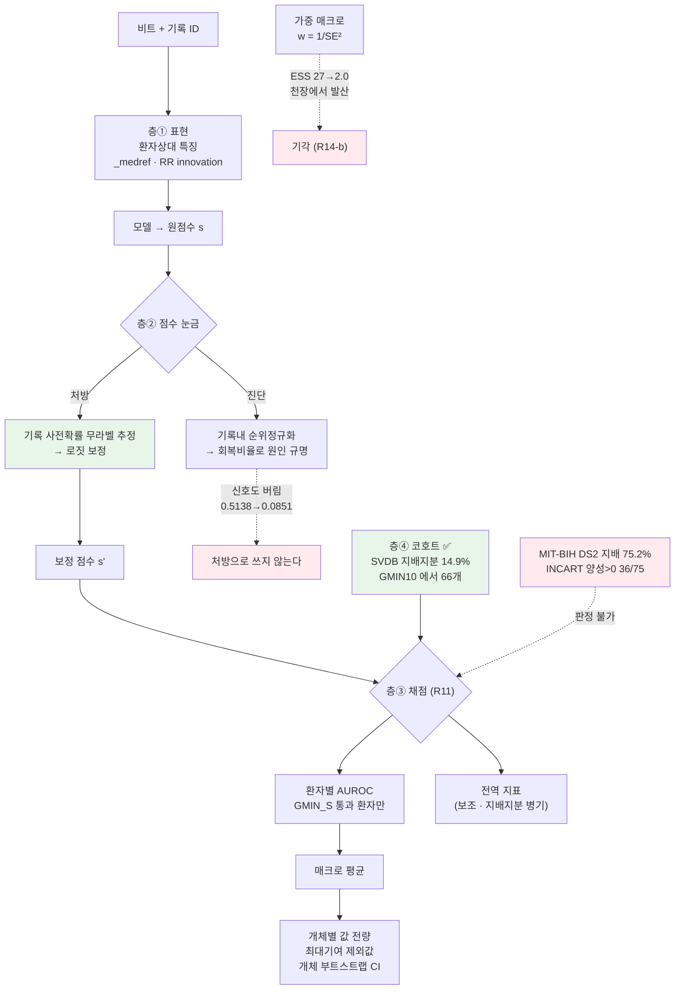

## Overview

**S(상심실성 조기박동, PAC)는 "평소보다 이르다"는 개인 기준 상대량으로 정의된다.**
그런데 우리는 그동안 이걸 **전역 점수**로 채점해 왔다. 실험22-A 에서 그 대가가 드러났다 —
채점 단위를 바꾸자 **결론의 부호가 뒤집혔다**.

이 퀘스트는 "S 를 더 잘 맞히는 모델"이 아니라 **"S 를 제대로 재는 법"** 을 만든다.
지표가 클래스 정의와 어긋나 있으면, 모델을 아무리 고쳐도 그 개선이 보이지 않거나
없는 개선이 보인다. 실제로 둘 다 겪었다.

## 왜 독립 퀘스트인가

한 주차 숙제로 안 되는 이유가 셋이다.

**① 층이 넷인데 서로 다른 도구가 필요하다.** 표현(features)·점수 눈금(calibration)·
채점(metric)·코호트(data)가 각각 다른 문제다. 하나를 고쳤다고 다른 게 풀리지 않는다.
실제로 표현은 리듬 특징으로 상당히 풀렸는데(within S 0.7049 → 0.9166) 눈금은 그대로였다.

**② 현재 코호트로는 판정 자체가 불가능하다.** MIT-BIH DS2 는 **#232 한 명이 S 의
75.2%** 를 갖는다. 채점 가능한 환자가 8명뿐이라 환자 부트스트랩 CI 가 시드 CI 의
3.3배로 벌어지고, S 관련 결론이 **전부 미결**로 나온다. 데이터를 옮기지 않으면
어떤 방법을 써도 결론이 안 난다.

**③ 두 번이나 반대 결론을 냈다.** 같은 확률로 채점만 바꿨는데:

| | 전역 | 환자 매크로 |
|---|---:|---:|
| v1 S 낙폭 | −0.0181 | **+0.0663** |
| v2 S 낙폭 | +0.0321 | **−0.0158** |
| P-B(리듬이 낙폭을 줄이나) | **−0.0502** | **+0.0821** |

전역으로 재면 "리듬이 전이를 악화시킨다"로 읽히고, 매크로로 재면 `PAPER.md §6.5` 의
**"리듬 축이 전이를 구해준다"** 가 재현된다. **이건 모델 문제가 아니라 측정 문제다.**

## 문제 정의

> **무엇을**: 맥락(개인 기준 상대량)으로 정의되는 클래스의 성능을, 환자 간 비교
> 가능성이 깨진 상태에서도 **정직하게 재고 보정하는** 프로토콜.
>
> **무슨 지표로**: 주 지표는 **환자 매크로 AUROC**. 보조로 전역 AUROC·PR-AUC.
> 판정은 **시드 CI 와 환자 부트스트랩 CI 중 넓은 쪽**(R8).
>
> **성공 조건**: 채점 환자 수가 결론을 낼 만큼 확보되고, 같은 확률에 대해
> 채점 방식을 바꿔도 **결론의 부호가 안 바뀌는** 상태.

### 이미 실측된 출발점 (실험22-A · ailab-2026-0045)

| 사실 | 값 | 함의 |
|---|---|---|
| DS2 의 S 지배 지분 | **75.2%** (#232) | 전역 S 지표 = 사실상 한 명 |
| INCART 의 S 지배 지분 | **30.1%** · 75레코드 | **S 평가는 여기서** |
| 표현 효과(리듬 추가) | within S 0.7049 → **0.9166** | ①은 상당히 풀렸다 |
| 눈금 붕괴 기여 | 전역 하락의 **95.4%** | ②가 주범 |
| 채점 환자 | within 8 / cross 11 | ④가 병목 |

### 눈금이 깨진다는 게 무슨 뜻인가 (07-17 SVDB 증강 실험 실측)

전국 단위로 "PAC 의심 상위 N명"을 뽑는다고 하자. 병원 A(#232)의 **내부 등수는
그대로**인데, 병원 B(#210·#219)가 갑자기 모든 환자에게 높은 점수를 주기 시작하면
B의 환자들이 전국 명단을 채우고 A의 진짜 PAC 가 밀려난다.

실측: 진짜 S 가 **9·7·0개**뿐인 #210·#219·#221 이 상위 1,808 슬롯을 **497개**
가져갔다. 진짜 S 가 379개 빠지고 그 자리를 N 이 378개 채웠다.

**환자 안의 판별력은 안 망가졌는데 전역 지표는 무너진다.**

## 접근 로드맵

난이도 순. 각 항목이 **어느 층의 무슨 한계를 푸는지**를 먼저 적는다.

### 층 ③ 채점 — 규약은 이미 섰다 ✅ (R11 · R11-b)

`SCORING_RULES.md` 에 박혀 있다. 남은 일은 **기존 실험에 소급 적용**하는 것.

- 주 지표 = 환자 매크로 · 전역은 보조
- `GMIN_S` 와 제외 환자 명시 · **지배 지분 보고**(>50% 면 전역 단독 인용 금지)
- 개체별 값 전량 · **최대 기여 개체 제외값** · 개체 부트스트랩 CI · 개선/악화 개체 수

⚠️ **`GMIN_S` 는 지표의 해상도를 보고 정한다.** R-prec 에 `GMIN=20` 은 너무 낮았다 —
S 가 28개인 #213 은 해상도가 `1/28 = 3.6%p` 라 Δ 가 **+0.4857** 까지 튀었고, 그 하나가
매크로의 **110%** 를 만들었다. 이게 R11-b 를 낳은 사건이다.

### 층 ④ 코호트 — **가장 급한 병목**

| 후보 | S | 환자/레코드 | 지배 지분 | 상태 |
|---|---:|---:|---:|---|
| MIT-BIH DS2 | 1,837 | 22 | **75.2%** | ❌ 판정 불가 |
| ~~INCART~~ | 1,958 | 75(실제 32명) | 30.1% | ❌ **Q1 에서 기각** — 양성>0 이 36/75 · 중앙값 0 |
| **SVDB** | **12,198** | **78 (환자 1:1)** | **14.9%** | ✅ **Q7 필요조건 통과** — GMIN=10 에서 **66개**. 양성>0 73/78 · 중앙값 61.5 |
| Chapman/Ningbo | 확인 필요 | 45,152 | 확인 필요 | 실험21 에서 접근 예정 |

⚠️ INCART 는 `pid` 가 레코드(75)이고 **실제 환자는 32명**이다(§6.5 한계 L3).
환자 단위 CI 가 **낙관적**일 수 있다 → 레코드→환자 매핑을 확보하거나 한계로 명시한다.

### 층 ② 점수 눈금 — 핵심 미해결

**진단은 됐다**: 레코드 내 순위정규화로 전역 하락의 **95.4%** 가 회복된다.
**처방은 아직 없다.**

⚠️ **순위정규화를 그대로 처방하면 안 된다.** 정규화하면 두 arm 모두 절대 성능이
폭락한다(PR-AUC 0.5138 → 0.0851). **"이 기록은 S 가 많다"는 것도 진짜 정보**이고,
홀터 판독에서 그건 버리면 안 되는 신호다. 정규화는 **진단 도구**다.

처방 후보 (쉬운 것부터):

| # | 방법 | 무슨 한계를 푸나 | 근거 |
|---|---|---|---|
| A | **기록 수준 사전확률 무라벨 추정 후 점수 보정** | 기록마다 다른 S 유병률을 모델이 못 맞히는 문제. 라벨 없이 EM 으로 사전확률을 추정해 로짓을 옮긴다 | Saerens·Latinne·Decaestecker (2002) EM prior adjustment — 표준 기법 |
| B | **기록 내 정규화 + 기록 수준 burden 을 별도 특징으로** | A 를 쓰되 '기록이 S-heavy 하다'는 정보를 **버리지 않고 분리해서** 다시 넣는다 | 우리 실측: 정규화가 신호도 버린다(0.5138→0.0851) |
| C | **환자 정규화를 표현 층에 더 넣기** | `_medref`·RR innovation 을 넘어, 기록 내 z-score·분위수 특징 추가 | within S 0.7049→0.9166 이 이 방향의 증거 |
| D | **conformal / 기록별 임계값** | 동작점을 기록마다 정해 경보율을 고정 | `colab_step69_ratepoint.py::_t_for_rate` 이미 있음 |
| **E** ⚠️ **조건부** | **기준(reference)을 다수에서 뗀다** — `_medref`(레코드 중앙 파형) 대신 **2군 중 긴 RR 군**의 중앙 파형 | 이건 **층①(표현)** 문제다. 다수가 S 인 환자에서 거리형 특징이 통째로 뒤집힌다 | Q7-D: `#865` 0.2103 → **0.9666**(오라클 동률) → R19. **그러나 Q7-E 전수 기각**(`ailab-2026-0055`): 짝지은 차 −0.0018, `#865` 빼면 **−0.0128 [−0.0255, −0.0024]** 순손해. 두 군 RR 분리도 <0.05 인 **31% 개체에서 Δ −0.0390**. 편향↓ 대신 분산↑ 를 사는 거래다 → **R21**. 조건부 사전등록은 Q7-E′ |

### 층 ① 표현 — 상당히 풀렸으나 확증 필요

리듬 특징(RR innovation)이 within S 를 **0.7049 → 0.9166** 으로 올렸다.
남은 질문: **cross 에서도 그런가**. 매크로로 재면 v2 S 낙폭이 −0.0158 (cross 가 오히려
높다)인데 **미결**이다. 환자를 늘려야 확정된다 → 층 ④에 의존한다.

## Architecture

## 실험 큐

각 항목은 돌린 뒤 `ingest_run.py --quest ailab-2026-0046 --step <이름>` 으로 로그를 쌓는다.
**한 번에 하나씩.** 합격 기준은 사전등록이고, CI 가 문턱을 걸치면 **기각이 아니라 미결**이다.

| # | 실험 | 무엇을 묻나 | 합격 기준 |
|---|---|---|---|
| ~~**Q1**~~ ✅ | `gmin-resolution` | `GMIN_S` 를 지표 해상도로 재설정하면 채점 환자가 몇 명이 되나 | **완료 · 전부 기각**(`ailab-2026-0047`) — INCART 도 불가. 20명과 최대SE 0.10 은 교집합이 없다 |
| **Q2** | `svdb-macro-baseline` | **SVDB** 환자 매크로 S 기준선 | **기준선 확보됨: 0.8842 [0.8449, 0.9175]**(`ailab-2026-0053`). 남은 건 GMIN 재사전등록 + 유병률>0.5 제외 여부 사전 선언 |
| **Q3** | `prior-em-calibration` | 방법 A(무라벨 EM 사전확률 보정)가 눈금을 고치나 | 전역 PR-AUC 회복 **≥ 50%** 이면서 매크로가 **안 떨어질 것** |
| **Q4** | `burden-feature` | 방법 B(기록 burden 을 별도 특징으로)가 A 보다 나은가 | Q3 대비 전역 PR-AUC **> 0** · 매크로 비열등 |
| **Q5** | `rate-point-per-record` | 방법 D(기록별 경보율 고정)의 임상 동작점 | 환자당 경보율 고정 시 민감도 CI 가 시드/환자 양쪽에서 0.05 이내 |
| **Q6** | `retro-rescore` | 기존 실험(§6.5·실험1′·22-A)을 R11 로 소급 재채점 | 부호가 바뀌는 결론 목록을 **전부 열거** |
| ~~**Q7-A**~~ ✅ | `svdb-cohort-check` | SVDB 의 S 분포 — 지배 지분 · **양성>0 개체 수 · 중앙값**(R13) | **필요조건 통과**(`ailab-2026-0049`) — GMIN=10 에서 **66개**, GMIN=100 에서도 30개 |
| ~~**Q7-B**~~ ⚠️ | `svdb-se-check` | SVDB 에서 **실제 부트 SE** 를 잰다(첫 학습 실험) | **조건부 통과**(`ailab-2026-0052`) — 관문 5개 전부 ✅(TEST 28개체 · 최대SE 0.0821 · CI폭 0.0617). 단 DEV 반쪽은 기각이었고 빌드 손실이 있다 |
| ~~**Q7-B″**~~ ✅ | `svdb-id-map` | ID 매핑 확정 (`【Q7B-M】` 결정론적 복원 · 학습 0회) | **완료 — 77/78 일치**. 참 = recs[라벨−800]. 손실은 없었다 |
| ~~**Q7-B′**~~ ⚠️ | `svdb-full-rescore` | DEV+TEST 합쳐 **전수 재채점** | **완료**(`ailab-2026-0053`) — 72개체 매크로 **0.8842**. P1~P4 지지 · **P5 기각**(p=0.0139) → 원인은 `#865` 역전 |
| ~~**Q7-D**~~ ✅ | `svdb-inversion-audit` | **#865 반전 감사 + 기준(reference) 선택 실험** — S 수백 개인데 AUROC 0.72~0.84 인 레코드 | **완료**(`ailab-2026-0054`) — 정렬 배제 ✅ · 다수결 0.2103(뒤집힘) → **긴RR 앵커 0.9666** = 오라클 0.9667. 문제는 축이 아니라 **기준**이다 |
| ~~**Q7-E**~~ ✅ | `anchor-sweep` | 긴RR 앵커를 **전수 70개체**에 적용 | **완료 · 처방 기각**(`ailab-2026-0055`) — E2 ❌ · E3 ⚠️ · E5 ❌(−0.1148). ★ 전수 감사(`audit_anchor.py`): 앵커가 큰 군과 같은 개체 **59/70(84%)** — 처방은 **11개체에서만 발동**했고 **그중 10개에서 졌다**(발동 Δ 평균 −0.0229 · `#865` 제외 **−0.1008**). 손해 본 10개는 전부 **오라클 ≈ 다수결** = 고칠 오염이 없던 개체다. **오라클이 다수결보다 0.02+ 나은 개체는 5/70(7%)** → **R21** |
| **Q7-H** ⬅ **다음** | `dispersion-hypothesis` | ★ **`‖b−ref‖` 는 「기저와 다름」이 아니라 「비전형성」을 잰다.** `#822` 실측(오라클 0.6055 · 다수결 0.2291 · 유병률 0.282)은 R19 로 설명이 안 된다 — S 가 28% 뿐인데 뒤집혔다. 남는 설명은 **N 의 산포가 S 보다 크다**는 것. `#865` 도 S CV 0.063 vs N CV 0.224 로 같은 무늬 | 개체별 `σ_N=median‖b−median(N)‖` · `σ_S`. **사전등록**: ① `σ_N/σ_S` vs 오라클 AUROC 음의 상관 ② `σ_N/σ_S>1` 개체가 오라클<0.7 개체와 겹침 ③ **두 템플릿 점수** `‖b−N템‖−‖b−S템‖` 가 `#822`·`#865` 에서 단일 기준 거리를 이김. ③ 이 처방 · ①② 는 기전 |
| **Q7-E′** | `conditional-anchor` | 앵커를 **무감독 이소성 부담 추정치 조건부로만** 적용 | 전수 감사(`audit_anchor.py`)가 조건을 바꿨다: 이득을 정하는 건 RR 분리도가 아니라 **기준 오염의 크기 = 유병률**이다(오라클−다수결: prev<0.20 에서 ≤+0.006, [0.20,0.35) +0.0879, >0.35 +0.7564). 무감독 대리 `#(pre_rr < 0.85×중앙RR)/n` 가 유병률과 상관되는지부터 검증. 문턱은 **INCART/DEV 반쪽**에서 사전등록. **군 크기 n0·n1 을 반드시 저장**(이번엔 없어서 대리치를 못 냈다) |
| **Q7-F** ⬅ **Q7-E 해석의 전제** | `p-window-rate-confound` | **「형태 축」이 실은 리듬 축의 대리변수 아닌가.** P영역은 R 기준 **고정창**(R−300ms~R−42ms)이라 심박수가 다르면 **창 안에 든 것이 다르다**. `#865` 는 S 142bpm · N 77bpm 이라 정확히 이 조건이다 | 심박수 정합(같은 RR 대역 비트끼리만) 또는 RR 정규화 창으로 P영역 거리를 다시 계산 → 앵커 AUROC 가 유지되면 형태, 무너지면 **리듬 대리**. Q7-D 의 0.9666 이 RR 위치형 0.9695 와 거의 같다는 게 의심 근거다 |
| **Q7-G** | `absolute-p-template` | **다수 비의존 앵커의 다른 경로 — 절대(모집단) 기준.** 「이 환자의 평소와 다르다」가 아니라 「**동율동 P 처럼 안 생겼다**」 | 다른 환자들의 N 비트로 만든 교차환자 P 템플릿까지의 거리. 유병률과 무관해야 하고, **늦은 이소성에서도 안 깨져야** 한다(긴RR 앵커가 깨지는 바로 그 지점) |
| **Q7-C** | `band-matched-baseline` | 128Hz 대역 교란 분리 — MIT-BIH 를 64Hz 대역으로 맞춘 대조군 | 낙폭을 인용하려면 **필수**. 사전등록 지표는 Q7-B′ PR-AUC 결과를 보고 정한다 |
| ~~**Q8**~~ ❌ | `weighted-macro` | 양성 적은 개체를 버리는 대신 **SE 역수 가중** 매크로 | **기각 · 종결**(`ailab-2026-0050`) — ESS 2.0/27. 다시 열지 않는다 |

⚠️ **Q8 은 실행 후 기각됐다(`ailab-2026-0050`).** 합격 기준이 처음에 'CI 폭' 하나였는데
그걸로는 못 잡는다 — 실측에서 CI 폭은 **64.3% 좁아졌고** Kish ESS 는 **2.0** 이었다.
점추정은 **정확히 1.0000** 이 나왔다: AUROC 는 천장이 1 이라 완벽 분리 개체의 부트
SE 가 0 으로 가고 `w = 1/SE²` 가 **발산**한다 — 역분산 가중은 '가장 쉬운 개체' 를
빨아들인다(**R14-b**). `w = n_pos` 도 안전하지 않다: 최대 가중이 정의상 **지배 지분**과
같아서(실측 30.2% = INCART 30.1%) 매크로를 전역 지표 쪽으로 되감는다 — R11 이 피하려던
방향이다. **가중치로는 환자를 만들 수 없다. 남은 길은 코호트뿐이고 그게 Q7 이다.**

⚠️ **Q6 은 결론을 바꿀 수 있다.** 실험22-A 에서 이미 P-B 의 부호가 뒤집혔다.
`PAPER.md §6.5` 와 실험1′(Icentia) 도 전역 지표로 되어 있다 — 소급 재채점 전까지
그 수치들은 **"채점 단위 미확인"** 으로 취급한다.

## Resources

- **`notebooks/quest46_q1_gmin_resolution.ipynb`** — **Q1 실행 노트북**(학습 0회).
  픽스처 `pipelines/test_quest46_q1.py` 가 셀을 직접 읽어 세 시나리오로 검정한다
  ⚠️ 이 두 파일은 커밋 `56237e7`(main 병합 커밋)에 섞여 들어갔다 — 커밋 메시지가
  병합만 말하고 있으니 찾을 때 참고할 것
- **`pipelines/audit_anchor.py`** — 앵커 감사를 **유병률 대비 농축비**로 다시 세는 결정론 도구.
  Q7-E 사후 셀의 절대 문턱(S비율>0.5)이 전수에서 **0건**을 냈는데 같은 실행에서 앵커는
  정상 개체를 깎고 있었다 — 유병률 0.029 개체의 앵커군 S비율 0.139 는 **4.8배 농축**인데
  0.5 밑이다. `--selftest` 5개 검사. 노트북은 동결이므로 고친 감사는 여기에 둔다
- **`notebooks/quest46_q7e_anchor_sweep.ipynb`** — **Q7-E 실행 노트북**(학습 0회 · **동결**).
  관문이 발화했으므로 고치지 않는다(Q7-B 선례). **알려진 결함**: 사후 셀 【E-D】의
  「앵커가 S 우세 군을 골랐나」가 **절대 문턱 0.5** 라 저유병률 개체의 농축을 못 본다 —
  후속은 `audit_anchor.py` 와 Q7-E′ 노트북에서 기저 대비로 센다(→ R21 ④).
  Q7-D 가 `#865` 한 개체에서 찾은 **긴RR 앵커**를 전수에 건다. `anchor_split()` 은
  **라벨을 인자로도 받지 않는다** — 픽스처가 함수 본문을 정적으로 뜯어 무감독성을 강제한다.
  ★ 비교는 전부 **짝지은 차**다(개체 간 SD 0.157 짜리 코호트에서 비짝지은 비교는 검정력을
  버린다). ★ **이 노트북의 매크로는 무감독 거리 특징의 값**이라 Q7-B 학습 모델의 0.8842 와
  나란히 놓지 않는다. ★ E1 은 **설계상 저검정력**(유병률>0.5 개체가 SVDB 에 1개뿐) —
  성립 여부는 **E2·E3** 이 판정한다. ★ 관문 E2 는 **개체별 부트스트랩 SE + 본페로니**로
  판정한다 — 점추정 문턱도, 개별 95% CI 도 합성 null 코호트에서 오발했다(→ **R20**).
  · 픽스처 `pipelines/test_quest46_q7e.py` — 정적 9 + 동적 4(**null · 정상 · 반전 ·
  ★역방향(늦은 이소성)**). 역방향 시나리오는 앵커가 **해로울 때 관문이 기각하는지**를 본다
- **`notebooks/quest46_q7d_inversion.ipynb`** — **Q7-D 실행 노트북**(학습 0회 · **완료**).
  `#865` 반전이 사고인지 발견인지 가르고(D1 기각 시 **즉시 중단**), 발견이면
  **축(RR·형태) × 기준(다수결·오라클·무감독 큰군·**긴RR 앵커**)** 격자로 "형태로는 되나" 를
  실측한다. ★ **방향 있는 AUROC 로 판정**한다 — `max(a,1−a)` 로 재면 완벽히 뒤집힌 기준도
  만점을 받아 요점이 지워진다. ★ **RR 위치형은 기준 불변**이다(상수 이동 → 순위 불변) —
  반전은 **거리형 `‖b−ref‖`** 에서만 생긴다. Q7-B′ P5 도 여기서 **같은 55개체**로 다시 짠다.
  · 픽스처 `pipelines/test_quest46_q7d.py`
- **`notebooks/quest46_q7bp_svdb_full.ipynb`** — **Q7-B′ 실행 노트북**(전수 재채점 · 학습 0회).
  Q7-B 노트북은 **얼려 둔다** — 관문이 이미 발화한 노트북을 고치는 건 사후해석이 스며드는
  경로다. 이건 다른 질문(전수에서도 유지되나 · 반쪽 격차가 우연인가)이고 자기 사전등록을
  갖는다. `GMIN=2` 는 Q7-B 에서 **승계한 상수**이고 여기서 다시 고르지 않는다(픽스처가
  `GMINS` 부재를 정적으로 강제한다). **P5 는 순열검정** — 55개체를 무작위 28/27 로 가른
  분포에서 관측 격차 0.0874 가 얼마나 흔한지 본다.
  · 픽스처 `pipelines/test_quest46_q7bp.py`
- **`notebooks/quest46_q7b_svdb_se.ipynb`** — **Q7-B 실행 노트북**(첫 학습 실험 · **동결**).
  오염 차단을 **설계로** 박았다: SVDB 78레코드를 **DEV/TEST 로 사전 분할**해 `GMIN` 은
  DEV 에서만 고르고 관문은 TEST 에서만 매긴다(R12 — 검증이 선택에 의존하면 안 된다).
  DEV 에서 통과 GMIN 이 없으면 **TEST 를 열지 않고 종료**한다.
  · 하니스 `mit-bih/colab_crossdb_svdb.py` — `colab_crossdb.py` 의 부록. WST
    SelectKBest 를 **DS1 에서만** fit 하고(실험22-A 는 전체 fit — 직접 비교 불가),
    `svdb_leak_audit()` 가 학습 **전에** 돌아 실패하면 예외를 던진다.
  · 픽스처 `pipelines/test_quest46_q7b.py` — 절반이 **오염 차단 장치 검정**이다.
    GMIN 선택 셀이 TEST 를 참조하는지, 학습 텐서에 SVDB 가 섞이는지, Drive 자산이
    자리표시자인지를 **정적으로** 잡는다
- **`notebooks/quest46_q7_svdb_cohort.ipynb`** — **Q7-A 실행 노트북**. 주석(`.atr`)만
  내려받아 레코드별 S 개수를 세고 R13 분포를 낸다. 신호(`.dat`)는 안 받고 **학습 0회**.
  픽스처 `pipelines/test_quest46_q7.py` 는 `dist_stats` 가 **DS2 실측**(지배 75.2% ·
  양성>0 16/22 · 중앙값 4.5 · k50=1 · k90=4)을 그대로 재현하는지로 검정한다
- **`notebooks/quest46_q8_weighted_macro.ipynb`** — **Q8 실행 노트북**. 실험22-A
  예측 캐시만 읽으므로 **학습 0회**. arm 넷(단순 GMIN10 · 단순 GMIN2 · 양성수 가중 ·
  역분산 가중)을 나란히 재고 Kish ESS 를 관문으로 쓴다.
  픽스처 `pipelines/test_quest46_q8.py` 가 네 시나리오로 검정한다
- `content/ailab/logs/ailab-2026-0045.md` — 이 퀘스트의 출발점(실험22-A 실측)
- `pipelines/SCORING_RULES.md` — **R4**(유병률 지표로 코호트 비교 금지) · **R7**(부분군
  최소 n) · **R8**(넓은 CI 로 판정) · **R11**(환자 단위 채점) · **R11-b**(매크로도 지배당한다)
- `notebooks/exp22a_axis_transfer.ipynb` — CELL 3b~3d(진단 도구) · CELL 5′(R11 재채점)
- `pipelines/test_exp22a_g1{,b,c,d}.py` — 노트북 셀을 직접 읽어 합성 데이터로 검정하는 픽스처
- `mit-bih/forensics_0717_split.py` — 분할 정체 확인(학습 0회)
- `mit-bih/colab_step69_ratepoint.py::_t_for_rate` — 경보율 고정 임계값
- `mit-bih/PAPER.md §6.5` — MIT-BIH → INCART zero-shot 교차DB(전역 지표 · Q6 대상)
- INCART: https://physionet.org/content/incartdb/ · SVDB: https://physionet.org/content/svdb/
- 사전확률 보정: Saerens M, Latinne P, Decaestecker C. *Adjusting the outputs of a classifier
  to new a priori probabilities: a simple procedure.* Neural Computation 2002 — 표준 EM 기법
  (⚠️ 우리 세팅에서의 효과는 Q3 에서 실측할 것. 인용은 방법 출처일 뿐 결과 근거가 아니다)

## My notes
<!-- 이 퀘스트에서 관찰한 것을 한 줄로. 다음 /ai-mentor·/deepen-week가 이어받는다. -->
