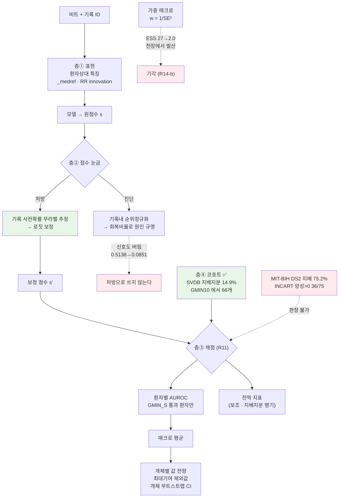

## Overview

**S(상심실성 조기박동, PAC)는 "평소보다 이르다"는 개인 기준 상대량으로 정의된다.**
그런데 우리는 그동안 이걸 **전역 점수**로 채점해 왔다. 실험22-A 에서 그 대가가 드러났다 —
채점 단위를 바꾸자 **결론의 부호가 뒤집혔다**.

이 퀘스트는 "S 를 더 잘 맞히는 모델"이 아니라 **"S 를 제대로 재는 법"** 을 만든다.
지표가 클래스 정의와 어긋나 있으면, 모델을 아무리 고쳐도 그 개선이 보이지 않거나
없는 개선이 보인다. 실제로 둘 다 겪었다.

## 왜 독립 퀘스트인가

한 주차 숙제로 안 되는 이유가 셋이다.

**① 층이 넷인데 서로 다른 도구가 필요하다.** 표현(features)·점수 눈금(calibration)·
채점(metric)·코호트(data)가 각각 다른 문제다. 하나를 고쳤다고 다른 게 풀리지 않는다.
실제로 표현은 리듬 특징으로 상당히 풀렸는데(within S 0.7049 → 0.9166) 눈금은 그대로였다.

**② 현재 코호트로는 판정 자체가 불가능하다.** MIT-BIH DS2 는 **#232 한 명이 S 의
75.2%** 를 갖는다. 채점 가능한 환자가 8명뿐이라 환자 부트스트랩 CI 가 시드 CI 의
3.3배로 벌어지고, S 관련 결론이 **전부 미결**로 나온다. 데이터를 옮기지 않으면
어떤 방법을 써도 결론이 안 난다.

**③ 두 번이나 반대 결론을 냈다.** 같은 확률로 채점만 바꿨는데:

| | 전역 | 환자 매크로 |
|---|---:|---:|
| v1 S 낙폭 | −0.0181 | **+0.0663** |
| v2 S 낙폭 | +0.0321 | **−0.0158** |
| P-B(리듬이 낙폭을 줄이나) | **−0.0502** | **+0.0821** |

전역으로 재면 "리듬이 전이를 악화시킨다"로 읽히고, 매크로로 재면 `PAPER.md §6.5` 의
**"리듬 축이 전이를 구해준다"** 가 재현된다. **이건 모델 문제가 아니라 측정 문제다.**

## 문제 정의

> **무엇을**: 맥락(개인 기준 상대량)으로 정의되는 클래스의 성능을, 환자 간 비교
> 가능성이 깨진 상태에서도 **정직하게 재고 보정하는** 프로토콜.
>
> **무슨 지표로**: 주 지표는 **환자 매크로 AUROC**. 보조로 전역 AUROC·PR-AUC.
> 판정은 **시드 CI 와 환자 부트스트랩 CI 중 넓은 쪽**(R8).
>
> **성공 조건**: 채점 환자 수가 결론을 낼 만큼 확보되고, 같은 확률에 대해
> 채점 방식을 바꿔도 **결론의 부호가 안 바뀌는** 상태.

### 이미 실측된 출발점 (실험22-A · ailab-2026-0045)

| 사실 | 값 | 함의 |
|---|---|---|
| DS2 의 S 지배 지분 | **75.2%** (#232) | 전역 S 지표 = 사실상 한 명 |
| INCART 의 S 지배 지분 | **30.1%** · 75레코드 | **S 평가는 여기서** |
| 표현 효과(리듬 추가) | within S 0.7049 → **0.9166** | ①은 상당히 풀렸다 |
| 눈금 붕괴 기여 | 전역 하락의 **95.4%** | ②가 주범 |
| 채점 환자 | within 8 / cross 11 | ④가 병목 |

### 눈금이 깨진다는 게 무슨 뜻인가 (07-17 SVDB 증강 실험 실측)

전국 단위로 "PAC 의심 상위 N명"을 뽑는다고 하자. 병원 A(#232)의 **내부 등수는
그대로**인데, 병원 B(#210·#219)가 갑자기 모든 환자에게 높은 점수를 주기 시작하면
B의 환자들이 전국 명단을 채우고 A의 진짜 PAC 가 밀려난다.

실측: 진짜 S 가 **9·7·0개**뿐인 #210·#219·#221 이 상위 1,808 슬롯을 **497개**
가져갔다. 진짜 S 가 379개 빠지고 그 자리를 N 이 378개 채웠다.

**환자 안의 판별력은 안 망가졌는데 전역 지표는 무너진다.**

## 접근 로드맵

난이도 순. 각 항목이 **어느 층의 무슨 한계를 푸는지**를 먼저 적는다.

### 층 ③ 채점 — 규약은 이미 섰다 ✅ (R11 · R11-b)

`SCORING_RULES.md` 에 박혀 있다. 남은 일은 **기존 실험에 소급 적용**하는 것.

- 주 지표 = 환자 매크로 · 전역은 보조
- `GMIN_S` 와 제외 환자 명시 · **지배 지분 보고**(>50% 면 전역 단독 인용 금지)
- 개체별 값 전량 · **최대 기여 개체 제외값** · 개체 부트스트랩 CI · 개선/악화 개체 수

⚠️ **`GMIN_S` 는 지표의 해상도를 보고 정한다.** R-prec 에 `GMIN=20` 은 너무 낮았다 —
S 가 28개인 #213 은 해상도가 `1/28 = 3.6%p` 라 Δ 가 **+0.4857** 까지 튀었고, 그 하나가
매크로의 **110%** 를 만들었다. 이게 R11-b 를 낳은 사건이다.

### 층 ④ 코호트 — **가장 급한 병목**

| 후보 | S | 환자/레코드 | 지배 지분 | 상태 |
|---|---:|---:|---:|---|
| MIT-BIH DS2 | 1,837 | 22 | **75.2%** | ❌ 판정 불가 |
| ~~INCART~~ | 1,958 | 75(실제 32명) | 30.1% | ❌ **Q1 에서 기각** — 양성>0 이 36/75 · 중앙값 0 |
| **SVDB** | **12,198** | **78 (환자 1:1)** | **14.9%** | ✅ **Q7 필요조건 통과** — GMIN=10 에서 **66개**. 양성>0 73/78 · 중앙값 61.5 |
| Chapman/Ningbo | 확인 필요 | 45,152 | 확인 필요 | 실험21 에서 접근 예정 |

⚠️ INCART 는 `pid` 가 레코드(75)이고 **실제 환자는 32명**이다(§6.5 한계 L3).
환자 단위 CI 가 **낙관적**일 수 있다 → 레코드→환자 매핑을 확보하거나 한계로 명시한다.

### 층 ② 점수 눈금 — 핵심 미해결

**진단은 됐다**: 레코드 내 순위정규화로 전역 하락의 **95.4%** 가 회복된다.
**처방은 아직 없다.**

⚠️ **순위정규화를 그대로 처방하면 안 된다.** 정규화하면 두 arm 모두 절대 성능이
폭락한다(PR-AUC 0.5138 → 0.0851). **"이 기록은 S 가 많다"는 것도 진짜 정보**이고,
홀터 판독에서 그건 버리면 안 되는 신호다. 정규화는 **진단 도구**다.

처방 후보 (쉬운 것부터):

| # | 방법 | 무슨 한계를 푸나 | 근거 |
|---|---|---|---|
| A | **기록 수준 사전확률 무라벨 추정 후 점수 보정** | 기록마다 다른 S 유병률을 모델이 못 맞히는 문제. 라벨 없이 EM 으로 사전확률을 추정해 로짓을 옮긴다 | Saerens·Latinne·Decaestecker (2002) EM prior adjustment — 표준 기법 |
| B | **기록 내 정규화 + 기록 수준 burden 을 별도 특징으로** | A 를 쓰되 '기록이 S-heavy 하다'는 정보를 **버리지 않고 분리해서** 다시 넣는다 | 우리 실측: 정규화가 신호도 버린다(0.5138→0.0851) |
| C | **환자 정규화를 표현 층에 더 넣기** | `_medref`·RR innovation 을 넘어, 기록 내 z-score·분위수 특징 추가 | within S 0.7049→0.9166 이 이 방향의 증거 |
| D | **conformal / 기록별 임계값** | 동작점을 기록마다 정해 경보율을 고정 | `colab_step69_ratepoint.py::_t_for_rate` 이미 있음 |
| **F** ★ | **두 번째 템플릿을 특징으로 더한다** — `‖b−N템‖ − ‖b−S템‖` | 기준 교체는 **편향**만 고친다. 두 번째 항은 **정보를 보탠다** — 이게 더 크다 | Q7-H(`ailab-2026-0056`): 편향 교정 +0.0228 vs 정보 추가 **+0.0601**. 형태 축 최초로 `<0.5` 개체 0. 단 **S 템플릿에 라벨이 필요**해 무감독판은 −0.0577 로 실패 → Q7-G |
| **E** ⚠️ **조건부** | **기준(reference)을 다수에서 뗀다** — `_medref`(레코드 중앙 파형) 대신 **2군 중 긴 RR 군**의 중앙 파형 | 이건 **층①(표현)** 문제다. 다수가 S 인 환자에서 거리형 특징이 통째로 뒤집힌다 | Q7-D: `#865` 0.2103 → **0.9666**(오라클 동률) → R19. **그러나 Q7-E 전수 기각**(`ailab-2026-0055`): 짝지은 차 −0.0018, `#865` 빼면 **−0.0128 [−0.0255, −0.0024]** 순손해. 두 군 RR 분리도 <0.05 인 **31% 개체에서 Δ −0.0390**. 편향↓ 대신 분산↑ 를 사는 거래다 → **R21**. 조건부 사전등록은 Q7-E′ |

### 층 ① 표현 — 상당히 풀렸으나 확증 필요

리듬 특징(RR innovation)이 within S 를 **0.7049 → 0.9166** 으로 올렸다.
남은 질문: **cross 에서도 그런가**. 매크로로 재면 v2 S 낙폭이 −0.0158 (cross 가 오히려
높다)인데 **미결**이다. 환자를 늘려야 확정된다 → 층 ④에 의존한다.

## Architecture



## 실험 큐

각 항목은 돌린 뒤 `ingest_run.py --quest ailab-2026-0046 --step <이름>` 으로 로그를 쌓는다.
**한 번에 하나씩.** 합격 기준은 사전등록이고, CI 가 문턱을 걸치면 **기각이 아니라 미결**이다.

| # | 실험 | 무엇을 묻나 | 합격 기준 |
|---|---|---|---|
| ~~**Q1**~~ ✅ | `gmin-resolution` | `GMIN_S` 를 지표 해상도로 재설정하면 채점 환자가 몇 명이 되나 | **완료 · 전부 기각**(`ailab-2026-0047`) — INCART 도 불가. 20명과 최대SE 0.10 은 교집합이 없다 |
| **Q2** | `svdb-macro-baseline` | **SVDB** 환자 매크로 S 기준선 | **기준선 확보됨: 0.8842 [0.8449, 0.9175]**(`ailab-2026-0053`). 남은 건 GMIN 재사전등록 + 유병률>0.5 제외 여부 사전 선언 |
| ~~**Q3**~~ ✅ **완료** | `prior-em-calibration` | 방법 A(무라벨 EM 사전확률 보정 · Saerens 2002)가 눈금을 고치나 | **공식 실행 `20260804T1226`** — **C0·C1 ✅** max\|Δ\| = **0.0e+00**(네 팔 매크로가 6자리까지 동일 · 로짓 상수 시프트가 구성으로 섰다) · **C2 ✅** 오라클 이득 **+0.2151** [+0.0852, +0.2994] · MDE 0.1071 (전역 raw **0.3362** → oracle **0.5514**, 매크로 **0.5389** 수준에 붙는다) · **C3 ⚠️ 미결** EM 절대 Δ **−0.0185** [−0.1014, +0.0773] · 회복률 **−0.086** · **C4 ⚠️** (→ Q3-B 가 이 대조의 결함을 밝혔다) · **C6 ✅** 매크로 항등. ★★ **실패 기전 특정** — 지배 레코드 **48**(π\* 0.5764 · TEST S 의 **34.4%**)에서 π̂ 이 clip 바닥 **0.0100** 으로, π_tr 0.0807 보다도 **아래**로 가서 그 레코드의 S 를 pooled 최하위로 밀었다. clip 바닥 레코드 7개가 TEST S 의 **40.7%**. DEV 최고 유병률 0.2926 이 이 극단을 못 덮어 **clip 이 DEV 에서 잘못 골라졌다** |
| ~~**Q3-B**~~ ✅ **완료 · 대조 수리** | `prior-shuffle-control` | Q3 의 C4 대조가 옳았나 (가설이 아니라 **자를 고치는** 런 · R35 ①) | **공식 실행 `20260804T1254`** — **B0 ✅** Q3 을 소수점까지 재현(raw 0.3362 · oracle 0.5514 · 매크로 0.538912/0.871891 · \|Δ\| 0.0000) + 셔플 팔이 **같은 raw 에서 출발**함을 구성으로 보장 · **B1 ✅ (주 관문)** `oracle − shuffled` **+0.2262** [+0.1073, +0.3210] — 성분 oracle−raw +0.2151 · **shuf−raw −0.0111** [−0.0718, +0.0374] → ★★★ **유병률 주입 자체는 아무것도 안 준다. 이득 전부가 「각 레코드가 자기 사전확률을 받는가」의 몫이다** → **C2 ✅ 가 살아난다** · **B2 ✅** 영점을 Δ 가 아니라 **절대 수준**으로 — 영점 raw **0.1576**(Q3 이 안 남긴 수) → oracle 0.4189 vs 관측 0.5514. 영점 이득 +0.2613 이 관측 +0.2151 보다 큰 건 **출발점이 +0.1787 낮아서**(천장 효과)였다 → **Q3 의 C4 ⚠️ 는 대조가 잘못 짜인 탓**(R40 ②) · **B3 ⚠️ 미결** `em − em_shuffled` −0.0523 [−0.1522, +0.0664] |
| ~~**Q4**~~ ⚠️ **1차 · 주 관문 오설정** | `burden-feature` | 방법 B(기록 burden 을 별도 특징으로)가 A 보다 나은가 | **공식 실행 `20260804T2349`** — 사전등록: Q3 대비 전역 PR-AUC **> 0** · 매크로 비열등. ★ **Q7-AA 가 닫은 건 「표적 모집단으로서의 burden」이지 「특징으로서의 burden」이 아니다** — AA4 의 ρ **+0.2898** 은 살아 있다. **전역 — raw 0.3362 · A_oracle 0.5514 · `B_add_oracle` 0.5725 · B_int_oracle 0.4116.** ⛔ **주 관문 D2 를 `B_int − A_oracle` 로 잡은 것이 오설정이었다**(−0.1398 → 「B 가 A 를 못 이긴다」). 구조 대조로 밀어둔 **`B_add − A_oracle` = +0.0212** 이 실제로는 **가장 잘한 팔**이었다 → **가장 잘한 팔이 주 관문 밖에 있었다**(R36 ②). ★★ 원인은 **참인 전제에서 끌어낸 거짓 결론**이다 — 「burden **기여분**이 레코드별 상수」는 **참**(레코드 내 SD **4.46e-16**)이지만, 「따라서 모델 전체가 A 와 구조가 같다」는 **거짓**이다(특징을 더하면 로지스틱이 **리듬 계수를 전부 다시 적합**한다 → raw 대비 레코드 내 ρ **0.792062** · 매크로 **+0.0398**). 픽스처는 합성에 **burden 의존 결정경계**가 없어 ρ 0.99996 만 보고 못 잡았다. ★★★ **1차의 진짜 발견은 매크로다** — `B_add_oracle` **+0.039773** [+0.005381, +0.074179] · `B_int_oracle` +0.045094 [+0.014269, +0.074563] · `B_int_em` +0.037272 [+0.007368, +0.067788] 로 **셋 다 CI 가 0 을 뗀다**(비열등이 아니라 **우월**). 그리고 이건 **A 가 원리적으로 못 하는 일**이다 — A 는 레코드별 상수 시프트라 매크로가 **정의상 불변**이고 실측도 `A_oracle` 매크로 = raw 매크로 = **0.5389** 로 완전히 같았다. 사전등록은 매크로를 **비열등 관문**으로만 뒀다. ★ 배포판 `B_add_em` 은 팔에 **없었다** · TEST 20 레코드라 전역 MDE **0.1614** → **Q4-B 로 재판정** |
| ~~**Q4-B**~~ ✅ **완료 · 주 관문 통과** | `burden-feature-v2` | Q4 의 주 관문을 고쳐 방법 B 를 다시 판정한다 (**가설이 아니라 자를 고치는 런** · R35 ①) | **공식 실행 `20260805T0114`**(1080초 · LORO **56 레코드** · 유병률 0.0070~0.5764 · 지배 지분 0.152) — **E0 ✅** A 팔 매크로 max\|Δ\| **0.0e+00**(A 는 매크로를 못 움직인다 · 구성 확인) · **E1 ✅ Q4 의 추론 오류가 규모에서 재현** 기여분 레코드 내 SD **3.335e-16**(상수 · 참) 인데 모델 전체 ρ **0.784555**(Q4 0.792062 와 일치 · 「A 와 같은 구조」는 거짓) · **E2 ✅ 주 관문(매크로)** `B_add − A` **+0.0582** [+0.0318, +0.0867] · MDE 0.0274 · 측정된 영점 −0.0290 [−0.0544, −0.0059] → **문턱 0 을 써도 통과**(하단 +0.0318) · **E3 ⚠️ 미결(전역)** +0.0773 [−0.0723, +0.2008] · MDE **0.1365** · **E5 ✅ 양 지표** 매크로 +0.0538 · 전역 +0.3233 (대응을 깨면 이득이 사라진다 — `B_add_shuf` 전역 0.2035 ≈ raw 0.2097) · **E6 ⚠️ 미결** `B_add−B_int` 매크로 +0.0219 [−0.0203, +0.0656] → **Q4 의 「상호작용 과적합」(0.5725 vs 0.4116)은 단일분할 인공물**이었다(LORO 0.5268 vs 0.4741). **팔** — 전역/매크로: raw 0.2097/0.5117 · A_oracle 0.4495/0.5117 · **A_em 0.1254**/0.5117 · **B_add_oracle 0.5268/0.5698** · B_add_em 0.3680/0.5663 · B_add_shuf 0.2035/0.5160 · B_int_oracle 0.4741/0.5480. ★★★ **배포 가능판끼리가 결정적이다** — `A_em` 전역 0.1254 는 **raw(0.2097)보다도 나쁘다**(−0.0843) → **방법 A 는 배포 불가 · 오라클은 상한이지 방법이 아니다**. 반면 `B_add_em` 은 raw 대비 전역 **+0.1583** · 매크로 **+0.0546** [+0.0300, +0.0815]. E4(`B_add_em − A_em`)는 매크로 +0.0546 · 전역 **+0.2426** [+0.1630, +0.3555] 로 **양 지표 모두 CI 가 0 을 뗀다** — 그런데 사전등록이 이걸 「참고」로 뒀다(→ Q4-C 에서 관문으로 승격) · ★★★ **π̂ 오차의 비대칭** — `B_add_em − B_add_oracle` 은 매크로 **−0.0035** 인데 전역 **−0.1588** 이다. `add` 모드에서 burden 은 레코드 내 상수라 **보정 전 레코드 내 순위가 테스트시 burden 과 정확히 무관**하다(구성 확인: 순위벡터 동일 · PR-AUC 차 0.000e+00). 즉 **매크로 이득은 학습 때 올바른 burden 을 쓴 몫이고 π̂ 를 필요로 하지 않는다**(−0.0035 는 등장성 보정의 동점 구조 몫) · ★ **진단 — 지배 레코드 48**(π\* 0.5764 · Q3 의 병목): raw/A\_\* **0.6169**(항등) → `B_add_oracle` **0.8034** · `B_add_em` **0.8474** · B_add_shuf 0.6162 · B_int 0.4705. **Q3 이 못 고친 그 레코드를 층② 의 방법 B 가 +0.2305 고쳤다** |
| ~~**Q4-C**~~ ✅ **완료 · 배포판 관문 통과** | `burden-train-vs-test` | 매크로 이득이 **학습 때 burden** 의 몫인가 **테스트시 burden** 의 몫인가 · 전역을 대체할 검정력 있는 교차레코드 지표 | **공식 실행 `20260805T0212`**(456초 · LORO 56 · 2×2 완성) — **F0 ✅** max\|Δ\| 0.0e+00 · **F1 ✅ 자가 정확히 섰다** 보정 전 `TT` ≡ `TS` 매크로 **0.577231 동일** · **순위 일치 56/56** → **테스트시 burden 은 레코드 내 판별에 원리적으로 기여하지 않는다**(구성 증명) · **F2 ✅ 주 관문(매크로)** `TT − A_oracle` **+0.0582** [+0.0313, +0.0876] · 문턱 0(영점 −0.0180 [−0.0312,−0.0058]) · 필요표본 27 ≪ 56 · **F3 ⚠️ 미결(교차레코드)** +0.0167 [−0.0109, +0.0426] · MDE 0.0267 · 문턱 +0.0281 · **F5 ✅ ★★★ 배포 가능판끼리** `TE − A_em` 매크로 **+0.0546** [+0.0291,+0.0810] · 교차 **+0.1479** [+0.1091,+0.1828] — **양 지표 모두 통과 · 둘 다 검정력 충분**(필요 26·11) · **F4 ❌** 테스트 몫 +0.0346 [+0.0064,+0.0661]. **팔**(매크로/교차/전역) — raw 0.5117/0.8829/0.2097 · A_or 0.5117/0.8679/0.4495 · A_em 0.5117/**0.7501**/0.1254 · TT 0.5698/0.8845/0.5268 · **TE 0.5663/0.8980**/0.3680 · TS 0.5353/0.8510/0.2167 · ST 0.5170/0.8838/0.2115 · SS 0.5061/0.8785/0.2083. ★★★ **F4 의 ❌ 는 내 예측의 기각이지 방법의 기각이 아니다 — 그리고 설계 결함 셋에서 나왔다**: ⓐ **반사실이 적대적이다** — `TT − TS` 는 burden 을 **완전히 뒤섞은**(derangement) 최악을 반사실로 쓴다. 배포 반사실로 재면 `TT − TE` = **+0.0035**(합계의 **5%**, 54% 가 아니다)이고 **`TE` 는 `TT` 의 raw 대비 이득 중 94.0% 를 지킨다** ⓑ **분해가 식별되지 않는다** — 상호작용 **+0.0236**(합계의 37%)이라 경로마다 답이 다르다(TS 경유 학습 +0.0292/테스트 +0.0345 · ST 경유 학습 +0.0528/테스트 +0.0109). 노트북이 대체 경로를 찍어 놓고 **판정은 한 경로만** 썼다 ⓒ **보정 전을 `TT`·`TS` 만 쟀다** — `SS`·`ST` 도 쟀으면 보정 전 분해가 **100% 학습**임을 정확히 말할 수 있었다. ★★ **범인은 등장성 보정이다** — 보정 전 0.577231 에서 보정 후 TT −0.0074 · TE −0.0109 · TS −0.0419 로, 손실이 **b̂ 오차 크기를 그대로 따라간다**. ★★★ **지배 레코드 48 이 결정적 반증이다** — 학습 true {TT 0.8034 · TE 0.8474 · **TS 0.8321**} vs 학습 shuf {ST 0.6162 · SS 0.6178} vs raw 0.6169. **테스트 burden 을 완전히 뒤섞어도 0.8321 을 지킨다** — 이 레코드에선 이득이 **100% 학습 몫**이다. ★★★ **새 발견 — 전역과 교차레코드가 정반대다**: `A_oracle − raw` 가 전역 **+0.2398** 인데 교차레코드는 **−0.0150** 이다. **사전확률 정렬의 전역 이득은 「유병률 가중」이지 레코드 간 판별력이 아니다**(Q3 의 +0.2151 도 같은 성질). 그리고 `A_em` 교차 **0.7501** ≪ raw 0.8829 — π̂ 오차가 척도 정렬을 **망가뜨린다**. 반면 **`TE` 교차 0.8980 은 전 팔 중 최고**다 ⚠️ 자체 오류 하나 더 — 요약이 F3 필요표본 「625」를 인용했는데 같은 표가 그 수를 **해석 불가**로 선언했다(R38 ⑦) |
| ~~**Q4-D**~~ ✅ **완료 · ★★★ 앞선 세 런의 주 결론을 뒤집었다** | `calibrator-shift-equivariance` | 등장성 보정을 Platt 로 바꾸면 π̂ 의존이 구성으로 0 이 되는가 — 그리고 그 대가는 | **공식 실행 `20260805T0300`**(1670초 · 8팔 × 2보정기 · N_PERM 10) — **G0 ✅** max\|Δ\| 0.0e+00(보정기 무관) · **G1 ✅ 자가 정확히 섰다** Platt 하 `TT`=`TE`=`TS` = **0.577231 전부 동일**(폭 **0.00e+00**)이고 이건 **보정 전 매크로와 정확히 같다** — Platt 은 강단조 아핀이라 순위를 부동소수점까지 보존한다. 등장성 폭 **0.0346** · 보정 전 항등은 **네 칸 전부** 0.0e+00 · **G2 ⚠️ 미결**(`platt` 매크로 −0.0024 [−0.0154,+0.0139] · 교차 **+0.2002** [+0.1561,+0.2401] ✅) · **G3** `TE` 매크로 +0.0110 · 교차 +0.0203 · ECE 0.0682→0.0693. ★★★ **이 런의 결정적 발견 — 「burden 이 매크로를 올린다」는 보정 인공물이었다.** `raw` 매크로가 iso **0.5117** vs platt **0.5796** 다(G3 짝지은 차 **+0.0680** [+0.0348, +0.1019], CI 가 0 을 뗀다). **등장성 보정이 raw 의 레코드 내 판별을 0.0679 파괴하고 있었다.** Q4~Q4-C 가 주 관문으로 삼은 매크로 이득 **+0.0581** 은 그 파괴의 **85.6% 를 되돌린 것**이었고, 파괴가 없는 Platt 에서는 **−0.0024(사실상 0)** 다. **⇒ 「burden 을 특징으로 넣으면 레코드 내 판별이 오른다」는 명제와 Q4-B/Q4-C 에서 내가 붙인 「계수 재적합이 리듬 특징의 짐을 벗긴다」는 기전 설명은 둘 다 철회한다.** ★★ **살아남는 것은 교차레코드다 — 그리고 더 커졌다**: `TE − A_em` 교차가 iso +0.1479 → platt **+0.2002**(필요표본 8 ≪ 56)이고 **`TE` 교차 0.9184 는 전 팔 최고**로 raw 0.8940 보다도 높다. burden 은 레코드 내 상수라 **원리적으로 레코드 내 정보를 못 더하고**(G1), 대신 **레코드 간 척도를 맞춘다** — 앞뒤가 맞는 그림이다. ★★★ **G5 확정 — 사전확률 정렬은 레코드 간 판별을 해친다**: `A_oracle − raw` 가 전역 **+0.2028** · 균등 +0.1776 인데 교차 **−0.0507** 이고, `A_em` 은 교차 **−0.1758**(ECE 0.1993, 전 팔 최악) 이다. **전역 이득은 유병률 가중의 몫이다 → Q3 의 +0.2151 소급 재해석 확정.** ★ **참값보다 추정치가 낫다** — `TE`(EM) 교차 0.9184 > `TT`(오라클) 0.8994. 참 유병률이 최적 시프트가 아니라는 뜻(기저 모델이 레코드별로 보정돼 있지 않으니 참값은 과보정한다). ★ **예상한 거래가 없었다** — ECE 가 raw 0.0484→0.0405 · TT 0.0369→0.0270 으로 **Platt 이 더 낫다**. 「등장성이 보정을 잘 한다」는 전제가 이 데이터에서 성립하지 않았다 → **Platt 으로 갈아타는 데 대가가 없다** · **G4** 등장성 누출 중앙 0.0112 · 최대 **0.5979** · 시프트 크기와 ρ **+0.5792** · 0.01 미만 27/56. 누출 상위는 전부 **저유병률**(#23 0.598@0.018 · #13 0.533@0.079 · #28 0.302@0.009) — 등장성이 계단 바닥에서 예측을 뭉개 레코드 내 순위를 통째로 날린다. Platt 최대 누출 **0.0e+00**. ⚠️ **자체 결함 하나** — Platt 의 기울기 `a > 0` 을 **런타임에 검사하지 않는다**. 음수면 순위가 뒤집히는데 세 팔이 똑같이 뒤집혀 G1 은 그대로 통과한다 |
| ~~**Q4-E**~~ ✅ **완료 · 눈금과 축이 정해졌다** | `operating-point` | 동작점(위양성·위음성)을 처음으로 재고, 축이 맞는지 결정한다 | **공식 실행 `20260805T0413`**(920초) — **H0 ✅** Platt 기울기 224개 중앙 +0.9046 · **음수 0개** · **H1 ★★★ 눈금이 섰다** 매크로 PR-AUC 0.5772 의 무작위 기저선은 **평균 유병률 0.0837**(평균 **lift 15.7배**)이고, 같은 코호트의 매크로 **AUROC 는 0.9418** 이다 — **Q2/Q7-B′ 의 0.8842 와 비교 가능한 건 이쪽**이고 오히려 더 높다. ★★★ **유병률 사분위별 AUROC 가 0.9513/0.9461/0.9358/0.9340 로 거의 평평**(범위 0.0173)한데 lift 는 31.8→3.3배로 떨어진다 → **「고유병률에서 무의미」는 모델 열화가 아니라 PR-AUC 기저선이 올라가는 것**이다(레코드 48 도 **AUROC 0.8491**) · **H2 ✅ ★★★ 축이 정해졌다** 임의의 레코드별 상수 시프트(SD 3.0 로짓 × 5회)에서 레코드 내 PR-AUC·AUROC 가 **정확히 불변**(0.0e+00) → **층②(사전확률 정렬·부담 주입)로 매크로를 올리는 것은 원리적으로 불가능하다. 층②가 실패한 게 아니라 그 일을 하는 도구가 아니다** · **H3** raw-천장 **0.9499**(좌표 상승) · `A_em` 0.7182(남은 폭 **+0.2317**) · `TE` 0.9184(천장 대비 −0.0316) · 최적 시프트~logit(유병률) ρ **+0.2594** → **최적 시프트는 유병률이 아니다** · **H5 ⚠️ 미결** 경보율 이탈 −0.1862 [−0.2759, −0.1093] · 문턱 −0.2063. ★★★ **위양성·위음성을 처음 쟀고, 전역 단일 문턱이 참사였다** — q=5% 에서 `TE` 민감도 0.2743(SD 0.3438 · **최소 0.0000**) · 경보율 0.0323(목표 5%) · 최악 레코드들이 **민감도 0**: #14 FN 614 · #16 FN 382 · #37 FN 460 · **#48 FN 1816**(AUROC 0.8491 인데 전부 놓친다) — 상위 6개만으로 **FN 3342**. **순위는 좋은데 절대 수준이 어긋나** 문턱을 아무도 못 넘는다. ★★★ **그런데 해법이 같은 로그 안에 있었다** — **환자별 예산**(각 기록 상위 q%)이면 민감도 **0.5030**(q=10% 에선 0.6970), 전역 문턱의 **1.83배**이고 경보율 산포가 **0**이다. 그리고 예산 방식에서 **네 팔이 같다**(raw 0.5054 = A_em 0.5054 ≈ TE 0.5030) — H2 가 증명한 대로 **레코드 내 순위는 층② 가 못 건드리기** 때문 |
| **Q4-F** ▶ **실행 대기** | `deployment-mode` | **배포 방식을 고르고, 고부담 환자의 진짜 과제(부담 정량)를 처음 잰다** | `notebooks/quest46_q4f_deployment_mode.ipynb` · 픽스처 `pipelines/test_quest46_q4f.py` (52/52) · 스모크 2조건 통과. **J1 ★★★ 주 관문** — 전역 문턱이 쓴 **총 경보 수를 그대로 환자별로 배분**했을 때 민감도가 더 높은가(**총 수를 맞춰야** 「많이 울려서 이기는」 경로가 막힌다 · R36 ②). **J2 ★★★ 자** — 예산 방식에서 `raw` ≡ `A_em` 이 **정확히** 성립하는가(예산은 레코드 내 순위만 쓰고 A_em 은 상수 시프트다). **서면 처방에서 층② 를 통째로 뺀다** — 사전확률 보정도, 부담 특징도, π̂ 추정도 불필요. **J3** 분율이 아니라 **절대 예산**(기록당 100·300개) — 24시간 홀터는 박동 10만 개라 5%=5000개로 **판독 불가능**하다. **J4 ★★★ 부담 정량** — 유병률 57.6% 환자에게 「이 박동이 SVEB 인가」는 이미 답이 난 질문이고 필요한 건 **「SVEB 부담 X%」**다. 네 추정기(EM·평균사후·**BBSE/Rogan-Gladen**·문턱초과율)의 \|π̂−π\*\| 를 **이 퀘스트에서 처음으로 산출물 지표로** 잰다(Q3 은 π̂ 가 순위에 주는 영향만 봤다). **J5** 자기 예산으로도 실패하는 환자 = **층①(표현)의 과제**. ★ 스모크가 잡은 것 — **환자 평균 민감도와 총 FN 이 반대로 갈 수 있다**(전자는 레코드 동등 가중 = R11, 후자는 양성 수 가중). 전역 문턱은 S 가 많은 레코드에 경보를 몰아 총 FN 에서 유리해 보이지만 **작은 레코드에 0 을 준다** — 반대 방향이면 **런타임 경고**를 찍게 했다(R38 ⑦) |
| **Q5** | `rate-point-per-record` | 방법 D(기록별 경보율 고정)의 임상 동작점 | 환자당 경보율 고정 시 민감도 CI 가 시드/환자 양쪽에서 0.05 이내 |
| **Q6** | `retro-rescore` | 기존 실험(§6.5·실험1′·22-A)을 R11 로 소급 재채점 | 부호가 바뀌는 결론 목록을 **전부 열거** |
| ~~**Q7-A**~~ ✅ | `svdb-cohort-check` | SVDB 의 S 분포 — 지배 지분 · **양성>0 개체 수 · 중앙값**(R13) | **필요조건 통과**(`ailab-2026-0049`) — GMIN=10 에서 **66개**, GMIN=100 에서도 30개 |
| ~~**Q7-B**~~ ⚠️ | `svdb-se-check` | SVDB 에서 **실제 부트 SE** 를 잰다(첫 학습 실험) | **조건부 통과**(`ailab-2026-0052`) — 관문 5개 전부 ✅(TEST 28개체 · 최대SE 0.0821 · CI폭 0.0617). 단 DEV 반쪽은 기각이었고 빌드 손실이 있다 |
| ~~**Q7-B″**~~ ✅ | `svdb-id-map` | ID 매핑 확정 (`【Q7B-M】` 결정론적 복원 · 학습 0회) | **완료 — 77/78 일치**. 참 = recs[라벨−800]. 손실은 없었다 |
| ~~**Q7-B′**~~ ⚠️ | `svdb-full-rescore` | DEV+TEST 합쳐 **전수 재채점** | **완료**(`ailab-2026-0053`) — 72개체 매크로 **0.8842**. P1~P4 지지 · **P5 기각**(p=0.0139) → 원인은 `#865` 역전 |
| ~~**Q7-D**~~ ✅ | `svdb-inversion-audit` | **#865 반전 감사 + 기준(reference) 선택 실험** — S 수백 개인데 AUROC 0.72~0.84 인 레코드 | **완료**(`ailab-2026-0054`) — 정렬 배제 ✅ · 다수결 0.2103(뒤집힘) → **긴RR 앵커 0.9666** = 오라클 0.9667. 문제는 축이 아니라 **기준**이다 |
| ~~**Q7-E**~~ ✅ | `anchor-sweep` | 긴RR 앵커를 **전수 70개체**에 적용 | **완료 · 처방 기각**(`ailab-2026-0055`) — E2 ❌ · E3 ⚠️ · E5 ❌(−0.1148). ★ 전수 감사(`audit_anchor.py`): 앵커가 큰 군과 같은 개체 **59/70(84%)** — 처방은 **11개체에서만 발동**했고 **그중 10개에서 졌다**(발동 Δ 평균 −0.0229 · `#865` 제외 **−0.1008**). 손해 본 10개는 전부 **오라클 ≈ 다수결** = 고칠 오염이 없던 개체다. **오라클이 다수결보다 0.02+ 나은 개체는 5/70(7%)** → **R21** |
| ~~**Q7-H**~~ ✅ | `dispersion-hypothesis` | 산포 가설 + **두 템플릿 점수** `‖b−N템‖−‖b−S템‖` | **완료**(`ailab-2026-0056`) — H1 ✅ **+0.0601** [+0.0420, +0.0803] · H2 ✅ 반전 0(형태 축 최초) · H3 ⚠️ **−0.0358** (Q7-E −0.1148 에서 69% 좁혔지만 미결) · H4 ✅ 끌림 성립(단 2개체가 전부) · **H5 지지→실질 기각**(SNR 통제 부분상관 +0.040 → **R23**) · H6 ❌ 무감독판 −0.0577. ★ 이득의 대부분은 **편향 교정(+0.0228)이 아니라 정보 추가(+0.0601)** 다 |
| **Q7-E′** | `conditional-anchor` | 앵커를 **무감독 이소성 부담 추정치 조건부로만** 적용 | 전수 감사(`audit_anchor.py`)가 조건을 바꿨다: 이득을 정하는 건 RR 분리도가 아니라 **기준 오염의 크기 = 유병률**이다(오라클−다수결: prev<0.20 에서 ≤+0.006, [0.20,0.35) +0.0879, >0.35 +0.7564). 무감독 대리 `#(pre_rr < 0.85×중앙RR)/n` 가 유병률과 상관되는지부터 검증. 문턱은 **INCART/DEV 반쪽**에서 사전등록. **군 크기 n0·n1 을 반드시 저장**(이번엔 없어서 대리치를 못 냈다) |
| ~~**Q7-F**~~ ✅ | `p-window-rate-confound` | 「형태 축」이 P 파인가 밀린 창인가 | **완료 · 리듬 대리 확정**(`ailab-2026-0057`) — F1 ❌ **심박수 정합 시 −0.1915** [−0.2351, −0.1466] (0.9008 → **0.6890** · 정합 가능 46/59 · 남은 S 비율 중앙 0.800) · F2 ❌ `P_late`(0.8290) < `P_early`(0.8604) · F3 ⚠️ (음성 대조 **STT 0.8515 가 P 파 자리보다 높다**) · F4 ✅ **교란 확인**. S 비트의 창-T 중첩률 **0.557**(N 0.103). → **Q7-D·E·H 형태 축 해석 소급 정정 · Q7-G 취소** → **R24** |
| ~~**Q7-I**~~ ✅ | `rhythm-feature-bundle` | 리듬 특징 5종을 더해 값어치를 잰다 | **완료**(`ailab-2026-0058`) — I1 ✅ +0.0252 · I2 ✅ · I2b ✅ · **I3 ✅ 정합 후 f3 0.5745** [0.5321, 0.6162] · I4 ✅ · I5 ⚠️(런 5개체). ★ 진짜 이야기는 **최악 개체** — `LR(f1)` 최소 0.5959 → `LR(전부)` **0.8364**, SD 0.0791 → **0.0431**. 형태로 안 되던 `#867`(+0.3383) `#879` `#822` 가 기여 상위다. ⚠️ **I3 을 그대로 못 읽는다** — 정합 후 `f1` 이 0.5779 로 안 무너졌다(잔여 RR 격차 0.080) → **R24-b** |
| ~~**Q7-I″**~~ ✅ | `match-residual` | I3 재판정 · 정합 강도 곡선 | **완료**(`ailab-2026-0059` · 59개체 · 정합가능 33) — **J1 ❌ 는 인공물**(바닥을 개체별 `max(f1,STT)` 로 잡고 문턱 0. 바닥 0.6440 vs 성분 0.5331·0.5708 → 팽창 +0.0732 = 기각폭 0.0733). 편향 없는 비교는 `f3−f1` +0.0405 [−0.0161,+0.0943] · `f3−STT` +0.0028 [−0.0802,+0.0835] → **둘 다 미결**. **J3 ⚠️** `f1ₘ` 0.5331 [0.5144,0.5520] vs 0.52 → 노트북이 J1·J2 인용을 자동 봉인. **J2** LR(f3,f4)−f1 +0.0864 (봉인). **J4 ⛔ 판정불가** — 혼합(+0.0125)과 런(−0.2739)을 한 층으로 묶었다. **J5** 상호작용 +0.0009 ≈ 0. **J6 편상관 CI 가 0 을 포함**(+0.246 [−0.020,+0.499]) → 「T 는 독립 통로」 **철회** → **R25** |
| ~~**Q7-I‴**~~ ✅ | `match-exact` | 정합기 감사 + 정확 정합 | **완료**(`ailab-2026-0060` · 채점 59 · **정확 정합 가능 22** · 짝 잔여 **0.000000**) — **K1 ✅ f1 = 0.5000** [0.5000,0.5000] → 정합기 구현 검증 통과. ★ **K3 ✅ f2_16 − f1 = +0.1688** [+0.0760,+0.2535] → **절대 RR 정합은 조기성을 통제한 적이 없다**(f2 0.6688 생존). **K5 ✅** LR(전부) − null **+0.3024** → 0.77 은 교차적합 바닥이 아니다. **K6 이 J4 를 갈랐다** — 고립 **+0.0101** [+0.0026,+0.0187] ✅ · 혼합 +0.0125 ⚠️ · 런 **−0.2739** ❌ → **f2 폐기는 틀렸다**. ★ **f6 이 표적 층을 구했다** — LR(f1,f6) − LR(f1) 혼합 **+0.0382** [+0.0007,+0.0909] ✅. **K4 ⚠️** f3 − STT초과 −0.0520 (단 f3 − f1 **+0.0860** [+0.0192,+0.1567] 은 0 을 뗀다). **K7 ⚠️** +0.0175. ★★ **STT 가 정확 정합에서 초과 +0.1380 으로 생존** — 형태 신호의 가장 깨끗한 증거이고 f3(+0.0887)보다 크다 → **형태 축은 P 파가 아니라 ST/T 다** → **R26** | **BAND_MIN 감사**: 라벨 0.010 의 실효는 **0.0142**(77/78 묶임) · 빈폭/격자 0.050 에서 **14.12배** · 격자 **Δ = 1.0 샘플**(내 2.8125 예측은 틀렸다 — 정수 샘플 인덱스) |
| ~~**Q7-K**~~ ✅ | `relative-match` | 두 축 합동 정합 | **완료**(`ailab-2026-0061` · 채점 59 · 유효대역 0.02 · 정합가능 **19**) — ⛔ **봉인 발동**: L1 미결(`f1ₘ` 0.5526) · **L2 미결**(`f2ₘ` 0.5445 [0.4932,0.5966] vs 0.56). **어느 축도 안 죽었다** — 사전등록한 실패 시나리오 그대로. ★ **원인 확정**: 가장 좁은 대역에서 `f1` 짝 잔여가 **0.006116(≈1.7 샘플)** 인데 `f1ₘ` 0.5526 이다 — `f1` 은 `pre` 의 **결정론적 단조함수**라 잔여가 작아도 순위가 산다. **정확 정합 말고는 안 죽는다**(곡선 첫 줄만 0.5000). ★★ **봉인 아래에서 더 나은 결론**: `f3` 는 국소기저선을 맞출수록 **단조 붕괴**(0.5815→0.5405→0.5373→0.5181→**0.4886**, 초과 +0.0887→**−0.0102**)인데 **형태는 무반응**(`STT` 0.6241→**0.6507**). **L5 ✅ +0.1867** [+0.0532,+0.3300]. → **`post_rr` 의 기여로 보이던 것 상당 부분이 상대 조기성이었다.** ★ **L7**: `P_late` 초과 +0.2033 · `P_full` +0.2055 · `STT` +0.1753 이고 **`P_late`−`STT` = +0.0279 [−0.0344,+0.0878] 미결** → 사전등록대로 **「P 파 고유의 신호는 없다」**. `P_early` 만 낮은 건(+0.0828) **폭 32 vs 85** 때문. ★ **선택 편향 확인**: 고립 16/42 · 혼합 **2**/12 · 런 **1**/5 · RR분리도 0.2815(정합) < 0.3336(제외) · 유병률 0.1064 > 0.0292 → **결론을 「고립 S·고유병률·RR 분리 덜 뚜렷」 밖으로 넓히지 않는다.** ★ **외부 리뷰 우려 둘 기각**: 계수 부호 일치율 전부 ≥0.956(억제변수 불안정 아님) · 침입률 S 0.0037·N 0.0020(사실상 0)이고 `STT_SAFE` 도 +0.1473 ✅. L8 은 개체 6개라 검정력 없음 → **R27** |
| ~~**Q7-M**~~ ✅ | `recover-power` | 표본 회복 + 정확 pre × 기저선 대역 | **완료**(`ailab-2026-0062` · 채점 59 · 유효대역 0.02 · 정합가능 **18** · 479초) — ★★ **M1 ✅ f1 = 0.5000**(짝잔여 0.000000) **· M2 ✅ f2_16ₘ = 0.5078** [0.4711,0.5483] → **`f1`·`f2_16` 을 처음으로 동시에 통제**. ★ **레거시 상수가 지렛대** — `MIN_CELL` 3→1 로 정확pre 개체 **25→40** · 남은 S **0.462→0.812**. 그 조건에서 리듬은 죽고 형태만 남는다: `f1` +0.0000 · `f2_16` +0.0090 · `f3` +0.0195 · `f3_glob` −0.0120 · `lr_f1` −0.0244 **vs** `p_full` **+0.2169** · `stt` **+0.1837** · `p_late` +0.1696 · `stt_safe` +0.1620. **M3b ✅ +0.1642** [+0.0497,+0.3108] · LOO 안정. ★ **`post_rr` 사망 = 실험1′(Icentia 580환자) 독립 재현.** **M5 가 사전등록 두 갈래 어디에도 안 갔다**(`f3_glob` 도 0.3850→0.4863 으로 반응) → **제3의 결과를 사후 해석으로 명시**. ⚠️⚠️ **세 문장을 철회·격하했다**(외부 검토): ①~~「P 파 고유의 신호 없음」~~ → **「우월성 미확립」** — 미결은 등가가 아니고(±0.05 등가에 개체 **34** 필요·현재 18), **창 폭이 불공정**(`P_late` 32 vs `STT` 85)하며 폭 맞춘 두 비교가 **부호 반대**(Q7-F `STT`>`P_full` vs Q7-M `p_full−stt` **+0.0332**) ②~~「형태 축 종료」~~ → **철회** — `elif "M4" in VERD` 분기 버그가 **「⛔ 측정 불가」를 기각처럼 처리**했다 ③~~「두 축 통제」~~ → **「`f1`·`f2_16` 통제」** — `f2_8` 이 **8.1σ**(+0.0632)로 생존. 상쇄검증 rho CI [−0.540,+0.523] 은 **검정력 없어 판단에서 뺐다** → **R28 · R29** |
| ~~**Q7-S**~~ ⏹ **대체됨** | `close-or-continue` | 원래 설계는 **R 기준 고정창** 위에서 종결 여부를 물었다. Q7-F/R 이 그 창 자체를 심박수 대리로 못 박았으므로 **자를 먼저 세우는 쪽**으로 갈아탔다 | **Q7-T → Q7-U → Q7-P0 → Q7-S′** 로 분해. 종결 조건은 Q7-S′ 가 이어받았다 |
| ~~**Q7-T**~~ ✅ | `but-pdb-validate` | ★★ **이 퀘스트에서 처음으로 자를 외부 정답에 맞춘다** — BUT PDB(전문가 2명 P 피크 · P 5,437 · QRS 7,638 중 **2,201(28.8%)이 P 없음**). P delineation + QRST 소거를 정답에 대고 검증 | **완료·동결**(공식 실행 `20260804T0314`) — **T1 ❌** Se 0.4375 / PPV 0.3783 (벤치 Saclova 2022 Se 0.9307/PP 0.8860) · **T2 ✅ +0.2825** 소거가 P 를 도드라지게 한다(P 창 **백분위 순위** — 절대 대비는 배경을 잰다) · **T3 ❌** 0.5190. ★ **죽은 건 검출기이지 가설이 아니다** → Q7-U. ⚠️ **알려진 결함**: 요약 셀이 **CEEMDAN** 을 공개 방법이라 찍는데 벤치마크는 phasor 다(사실오류 · 판정 무관). ★ 픽스처가 설계 결함 셋을 실행 전에 잡았다 — T2 통계량 · PPV 가 유병률을 재던 것 · **팔 선택이 보고 지표로 이뤄지던 누출**(→ LORO 선택) |
| ~~**Q7-U**~~ ✅ | `public-delineator` | 자를 **공개 방법**으로 갈아 끼운다 — `dwt`(NeuroKit2 · Martínez 2004 웨이블릿) · `phasor`(Martínez 2010). 주 질문은 **소거 잔차를 같은 분절기에 넣으면 나아지나** | **완료·동결**(공식 실행 `20260804T0458` · 48레코드 · 컨테이너 재현과 **소수점까지 일치**) — **U1 ⚠️** `dwt|raw` **48/48 LORO** Se 0.9109 [0.8558,0.9569] · PPV 0.7145 · **F1 0.7705**(벤치 0.9307 근접) → **Q7-T 의 실패는 자 탓이 확정** · **U2 ❌ 기각** 격자 **70셀 전부 음수** · LORO −0.1984 [−0.2791,−0.1161] · **U3 항등 대조 0.0000**(`none`≡`raw` 런타임 강제) · U5 ⚠️. ★★ **T2 ✅ 와 U2 ❌ 의 화해**: 소거는 P 의 **상대 진폭**을 올리되 **파형을 부순다** — 「도드라진다」≠「P 처럼 보인다」(R35 ②). ★ 템플릿 적응성 축 @발화율 1.00: **raw 0.7705 ≫ abs 0.6276 ≈ st 0.6270 > blend 0.6220 > local 0.6061 > blendfit 0.5973 > prevfit 0.5915 > prev 0.5847** — 사용자 제안 혼합(0.7/0.3)을 **양끝을 감싼 격자**로 실측했고 최적은 안쪽이 아니라 **w=1 끝**이었다. Shah 2004 가 우리와 **기하가 다르다**(그쪽은 직전 비트 QRST 를 뺀다 · 우리는 그 비트 자신) → R35 ⑤ |
| ~~**Q7-P0**~~ ✅ | `svdb-pdelin` | **자산 생성 런**(가설 검정 아님) — 검증된 자로 SVDB 184,499 비트 전량의 P 위치·점수 표를 만든다 | **완료**(공식 실행 `20260804T0530` · 78레코드 · 2,533초) — **좌표 정합 증명 통과**: `svdb_data5.npz` 에 R 위치가 없어 `svdb_labels.py` 의 비트 절단을 재현하고 `(pid, sym)` 수열 **원소 단위 일치**로 증명(불일치 시 첫 인덱스 찍고 중단). **생리학적 자기검증**: P 위치 중앙 **−164ms**, IQR −192~−139ms(PR 120~200ms 안). 발견률 0.9756 · N 0.9827/점수 3.25 · S 0.9492/2.29 · V 0.8925/1.60. ★ **Q7-S′ 에 건 두 제약**: ① `p_idx ≥ 0` 은 **후보를 놓았다**는 뜻이지 P 가 있다는 뜻이 아니다 → `p_score` 를 **연속**으로 ② 실효 해상도는 **7.8125ms**(=1000/128 · SVDB 원본) → 위치 양자화. → **R35 ⑦** |
| **Q7-S′** ✅ **종결 · 갈래 접음** | `p-aligned-personalize` | ★★★ **퀘스트 46 의 실제 질문에 답하는 런** — 리듬(조기성)이 이미 주는 것 **너머로** P 파 형태가 SVEB 판별에 정보를 더하는가. 로지스틱 회귀만 | **완료**(공식 실행 `20260804T0658` · 1081초 · 56개체 · S3 는 34) — **S4 ✅ 영점**(`noise5` −0.0002 [−0.0007,+0.0002] · `shuf5` −0.0013) · **S1 ⚠️** +0.0029 [−0.0079,+0.0203] · **S2 ⚠️** +0.0035 [−0.0073,+0.0213] · **S3(주) ⚠️** `p_score` 0.5362 [0.4841,0.5903] vs null 0.5090 → **초과 +0.0272 · MDE 0.0531**(효과가 분해능의 절반 · R33 ①) · **S5** +0.0134. ★★★ **결론이 아니라 상한을 세웠다** — 교차환자 ΔAUPRC **CI 상단 +0.0213** → 있어도 **+0.02 이하**. 리듬-only 기저 0.88 에서 P 분절 파이프라인 전체의 대가가 그거면 **비용이 이득을 넘는다**(R36 ①). ★ **S3 안에서 방향이 갈린다** — `p_score` 위 / `pr_q8`≡`pr_dev` 0.4974·`p_miss` 0.4801 **아래** → 신호가 있다면 **위치가 아니라 모양 신뢰도**(U2 기각과 정합). ★ **개인화 가설 지지 안 됨 — S1 ≈ S2**, k 무반응 → **Q7-R 의 R5 +0.0974 는 누출 통제 후 남지 않았다**(인용 정정). ★ **S5 는 성분을 봐야 한다**: `palign` +0.0035≈0 · `pmorph` −0.0100<0 → 「정렬이 이득」이 아니라 **「고정창이 해롭고 정렬이 그 해악을 없앤다」**(R36 ⑤). ⚠️ **자백한 편의**: `k` 는 LORO 인데 **최량 프로브는 5개 중 max** (R36 ②). ★★ **종결 조건 ② 발화** — 필요 표본 S1 222 · S2 269 · S3 도달 불가 vs 도달 가능 풀 **126** → 같은 데이터에서 안 돌린다. **딥러닝 진입 조건(S3 ✅) 미충족**. → **R36** |
| ~~**Q7-S″**~~ ✅ **완료** | `recompute-frames` | 프레임·대비·항등 대조 | **공식 실행 `20260804T0809`** — **W0 재현 완벽**(11항목 |Δ|≤5e-5 · n 56/34 동일) · **W5 ✅★★** `f1` 항등 대조 @w=1 **0.4999** [0.4996,0.5000] → **S3 는 진짜로 조기성을 통제한다**(철회 불필요) · 폭 곡선이 검토 권고 ⑥ 을 **데이터로 기각**(w=16 에서 `f1` 혼자 0.5899 > `p_score` 0.5507 — 넓혀서 얻는 건 **누출**이고, w=2 는 산수상 **검정력 이득 0**) · **프로브 선택 편의 +0.0000**(LORO 가 34/34 에서 `p_score`) · **W1 ⚠️** +0.0048 [−0.0030,+0.0141] — ⚠️ MDE 는 2.6배 좁아졌지만 **신호도 줄어 SNR 0.60→0.56 · 필요표본 154/315→179/365 로 늘었다**(바뀐 건 **추정 대상**) · **W3 ⚠️** 쌍풀링이 오히려 MDE 를 넓힌다(0.0513→0.0759 · 군집 비용 14.1배) → 검토 권고 ⑤ 기각 · **W4 ❌** k=20 `shuf5` −0.0066 이 자기 MDE 0.0050 **밖** → **검토자가 맞고 내가 틀렸다**. ★ 발견된 결함: **관문 문턱 0.5 vs 측정 null 0.5090** · 필요표본이 그 기준을 안 썼다(S3 총 **207**/50% · **422**/80%) → **R38 ①②** |
| ~~**Q7-X**~~ ✅ **완료** | `lambda-diagnostics` | λ 가 어디서 오는지 · null 이 왜 0.5 가 아닌지 | **공식 실행 `20260804T0933`** — **X1 ✅** λ(Δ) 곡선(0ms 1.0000 항등 · 3ms 0.8947 · 5ms 0.6111 · **11ms 0.2891** [0.2333,0.3438] · 20ms −0.1039)이 **Q7-V 의 λ 0.2586 을 CI 안에 담는다** → 검출기 없이 **위치 이동만으로 재현** · **X1b ✅** 적분 분자가 λ 를 **+0.2803** 회복 · **X0 ✅**(⚠️ 단 σ비 검정은 **보정의 전제를 검정하지 않는다** — 진짜 전제는 선형성·오차독립) · **X2 ❌** 꼬리 탓 아님(하위 10% 절삭 +0.0437) · **X3 ✅** 쌍 내 0.5005 · 레코드 안 0.4989 → **Q7-S′ 의 0.5090 이 재현 안 됨** · **X4 ⚠️** 부담 ρ +0.1591 [−0.2449,+0.5166] → 모집단 안 바꿈 · **X5 ❌** 동등분산 잡음도 똑같이 죽인다(−0.0276 vs −0.0267) → **V2 인용 철회**. ⚠️ **알려진 결함 셋**: ① 128Hz 라운딩이 **λ(3ms)뿐 아니라 λ(11ms)도 오염**(128Hz 에서 Δ=5·11 이 같은 1샘플) ② λ_energy 에 **실측 오차 분포 하 짝이 없다**(고정 Δ 였다) ③ 적분폭 ±40ms 에 **근거 없음** → 전부 Q7-Z 가 받는다 |
| ~~**Q7-Z**~~ ✅ **완료** | `deattenuation-test` | 탈감쇠 모형 직접 검정 | **공식 실행 `20260804T1031`** — **Z0 ✅** 창이 온전한 비트 115,039(63.9%) corr **1.000000**(전체 0.9312) · **Z1(주) ❌ 기각** λ 0.2586→0.4898 인데 S3 초과 +0.0421→+0.0407, 차 **−0.0015** [−0.0217,+0.0228] 이 예측 차 +0.0409·+0.0354 를 **둘 다 배제** · **Z2 ✅** null reps 3→50 에서 0.5081→0.5005 수렴(기전은 미규명 — 내 nan 드롭 가설은 지지 안 됨) · **Z3 ✅** 128Hz 층은 w20 정점 뒤 하락 · **Z4 ✅** ρ(쌍수) +0.2898 > 영점. ★★★ **λ 는 신뢰도이지 타당도가 아니다** → 「자가 병목」 철회 · X6 상한 무효 · Q7-Y 폐기. ⚠️ **실행 후 정정**: 예측 비교를 비로 남겨 ⚠️ 로 찍혔던 것을 **차로 환산**해 ❌ 기각으로 고쳤다(비 CI 폭 3.1 · R40 ②) |
| ~~**Q7-Y**~~ ⏹ **폐기** | `shift-invariant-p` | 이동 불변 표현으로 신호 회복 | **Z1 이 전제를 반증했다** — λ 를 올려도 효용이 안 오르므로 「더 나은 표현」의 근거가 없다. **반증된 전제 위에 짓지 않는다**(그래서 Q7-Z 를 먼저 돌렸다 · R40 ①) |
| ~~**Q7-AA**~~ ✅ **완료 · 형태 갈래 종결** | `burden-target` | 사전등록 단발 — 부담 상위군에서는 P 파 형태가 쓸모 있나 | **공식 실행 `20260804T1104`** — **AA0 ✅** S3 재현 |Δ| 0.000045 · **AA3 ✅ 영점** 전체 0.4989 / 고 0.4991 / 저 0.4985 · **AA1 ✅(기전)** 고부담 **0.5608** [0.5170,0.6097] 초과 **+0.0617** (n=23 · MDE 0.0463) · **AA2 ⚠️** 저부담 +0.0046 (MDE 0.1157) · 부분군 차 +0.0577 [−0.0670,+0.1823] 미결 · **AA4 ✅** ρ +0.0946 vs 영점 −0.0339 [−0.0822,+0.0135]. ★★★ **AA5(결정 숫자) 고부담 W1 −0.0007** [−0.0053,+0.0030] — **MDE 0.0042 가 전체 0.0085 보다 좁다 = 정밀한 0**. **AA6** W1 필요표본 917/1871 은 **효과≈0 이라 해석 불가**. → **기전/효용 해리**: P 파 형태 정보는 **환자 특이적**이고 교차환자로 전환되지 않는다. 갈래 종결 · 다음은 **Q3** → **R41** |
| ~~**Q9**~~ ⏸ **접힘 · 조건부 재개** | `personalized-p-morph` | ★★ 환자 개인화 P 형태 딥러닝 — Q7-AA 의 해리(환자 안 0.5608 ✅ / 환자 간 −0.0007)가 연 문 | **G1 1차 `20260804T1340` = 측정 실패** (코호트 35명인데 통계량 n=11 · 층 폭 2.78ms · 선형 리듬 통제 · P 마스크 25ms). **G1′ `20260804T1431` 재설계**(층 폭 27.8ms · 매칭 쌍 기준 코호트 **29명** · 리듬-only 팔 = G3 흡수 · P 전폭 마스크 · 위치 대조 `offwin`). ★ **진단이 재현으로 확인됐다** — 격자에서 층 폭 1샘플이면 채점 가능 **11명**·천장 **0.5901** 로 1차와 **완전 일치**. **H2 ⚠️ 미결** `raw − rhythm` **+0.0852** [+0.0078, +0.1635] 이 **측정된 대비 영점 상단 +0.0548** 을 못 넘고, `raw` 도 런 내 천장 CI 상단(0.5886)을 못 넘었다. **H4 ❌** `raw − offwin` **+0.0474** [−0.0513, +0.1395] — **P 창의 우월성이 확립되지 않았다**(앵커 셔플도 0.5895 로 관측 0.5799 보다 높다 = 정렬 비의존). 팔 — rhythm 0.4947 · raw 0.5799 · cancel 0.5766 · pmask 0.5434 · offwin 0.5325. ★ **「닫는다」가 아니라 「접는다」**(R36 ①) — 상한이 남아 있다: P 창의 리듬 너머 증분 **+0.1635 이하** · 창 위치의 몫 **+0.1395 이하**. ★ **조건부 재개** — 영점 대비로 세우려면 환자 **72명**(검정력 80%)이 필요한데 SVDB 채점 가능 상한이 **29명**이다. 그만한 코호트가 생기면 노트북을 **그대로** 다시 돌린다 |
| ~~**Q7-V**~~ ✅ **완료** | `ruler-audit` | 자가 병목인가 | **공식 실행 `20260804T0834`** — **V0 ✅**(Se·PPV·F1 4자리 재현) · **V1 ✅** λ 0.2586 [0.2028,0.3142] → 탈감쇠 점추정 **+0.1038** · 상한 **+0.1314** ≫ MDE 0.0531 · **V2 ⚠️**(k=1 에서 +0.0272→−0.0061) · **V4 ✅**. ★ **PPV 해부**: 1−PPV 0.2855 ≈ **P 부재율 0.2882**, 진짜 P 가 있는 비트의 적중률 **0.9914** → PPV 0.7145 는 「위치를 못 맞춘다」가 아니라 **「P 없는 비트에도 기권 없이 쏜다」**다. ⚠️ **실행 후 문구 정정 2건**(숫자 불변): 요약이 「가정이 다른 두 경로」라고 찍었는데 같은 셀 주석과 정반대였다(**같은 쌍 분포 공유**) · 「다음 표적 = 오검출 28.5%」도 틀렸다(**표적은 점수 통계량의 신뢰도**) → **R38 ⑦** |
| **Q7-R** ✅ **종결** | `calibrate` | 주 관문을 교차환자 ΔAUPRC 로 갈아타고 양성 대조를 관문에 통과시켰다. **검출·선택 기준 둘 다 틀려 추정량 선택이 무효**(R34 ① ②)였고, **음성 대조가 두 지표에서 1등**(R34 ③), **타이밍 가설 지지 안 됨**, **`dr` 이 누출 4배 감소** | 결과 `ailab-2026-0067` — R1·R1b **⛔ 측정 한계**. 필요 진폭 3% vs 실제 0.8% → **필요 표본 834개체**. 유일한 단서는 **R5**(누출을 키에 넣으면 `p_mid_22` 만 오른다) |
| **Q7-Q** ✅ **종결** | `p-late-strict` + `positive-control` | QRS 개시를 잘라낸 폭 22 창 + 양성 대조. **QRS 개시 가설 기각 쪽**(적응형 창 −0.0666 · `p_mid_22` 최강) · **Q3 창 특이성 없음**(음성 대조가 P 창만큼) · **판정 규칙 단위 오류**로 「신호 없음」을 잘못 출력(R33 ①) | 결과 `ailab-2026-0066` — 관문 전부 미결. 실제는 **측정 한계**(효과 +0.029 vs 분해능 0.12). 유일한 단서는 `p_mid_22` 가 `rank` 에서 Bonferroni 후 지지(+0.0688) |
| **Q7-P** ✅ **종결** | `p-safe` | 침입을 **표본**으로 치려 했다. **노출은 확정**(S 74.9% vs N 20.0%)이지만 **효과 방향이 반대**였고(침입은 P 를 **덮는다**), 마스크는 **정확 `f1` 층화가 이미 하던 통제**를 중복하며 S 비트 90% 를 태웠다(R32 ①). SAFE 는 `f3` 부호 반전으로 **다른 모집단**이었다(R32 ③) | 결과 `ailab-2026-0065` — 관문 전부 미결. **Q7-N 의 「+0.0745 우월성 지지」와 「용량-반응」진단을 함께 철회.** 주 추정치 +0.0314 [−0.0318, +0.0942]. **컷 기반 정화 노선 종료** · **「P창 − STT창」 추정 대상 폐기**(풀링 201개체로도 CI 가 0 을 덮는다) |
| **Q7-O** *(= Q7-G 재개)* ⏸ **Q7-P 다음** | `cross-patient-template` | 형태 신호의 **전이 가능성** — 지금까지의 형태 값은 전부 **개체 내부 템플릿 = 라벨을 쓰는 상한**이다 | 개체를 뺀 나머지로 만든 **교차환자 템플릿**을 잔차화 조건에서 채점 · 내부 템플릿 대비 **회복률 %** · 진폭 정규화 방식 **사전등록**(R18). ⏸ **전이시킬 대상이 P 인지 T 인지 모르는 채로 템플릿을 만들면 무엇을 옮겼는지 해석할 수 없다** |
| **Q7-J** | `baseline-recalibration` | ★ **`#865` 형은 리듬 특징으로 안 고쳐진다.** 런 우세 층에서 오라클 0.99 인데 전이 모델은 0.0595 로 뒤집힌다 — **특징 부족이 아니라 전이 시 기준선 반전**이다 | 레코드 내부 **재보정**(강건 센터링 · 라벨프리 적응 임계). 특징 추가가 아니라 **정규화** 문제로 다룬다. 표적은 런 우세 5개체 + Q7-B′ 에서 반전된 개체 |
| **Q7-I′** | `rhythm-feats-in-model` | 개체 내부 로지스틱은 **상한**이다 — 전역 모델에 넣어야 값어치가 나온다 | `colab_crossdb_svdb.py` 특징 벡터에 `f2`~`f5` 추가 후 Q7-B′ 프로토콜로 재채점. ⚠️ Drive 하니스 업로드 사이클 필요(R9). **여기서 「S 의 전이는 리듬의 전이다」를 처음 검정**할 수 있다. ★ 사전등록에 명시: **주 표적은 혼합 층**(여유 0.1048 · Q7-I Δ +0.0443) · **런 우세 층은 천장**(여유 0.0095)이라 별도 보고 · `f5` 는 상호작용항으로 · **라벨셔플 null 유지**(Q7-I 에서 값어치 증명) · `#865` 형은 표적이 아님(→ Q7-J) |
| **Q7-F′** ⏫ **우선순위 상승** | `p-centered-window` | ★ **창이 P 파에 안 맞는다.** `P_late`(R−131~−42ms)는 PR 160ms·P폭 100ms·QRS시작 R−30ms 로 잡으면 P(R−190~−90ms)의 **~41%** 만 덮는다(`P_early` 는 ~1%). 방향은 설계대로지만 **PR 은 환자마다·박동종류마다 다르다** — PAC 의 P′ 는 이소성 초점이라 PR 이 다를 수 있다 | 개체별 **N 템플릿의 P 봉우리**로 창을 정렬해(U-Net 분절기는 repo 에 없다 · 학습 0회) F2 를 다시 묻는다. F2 의 효과 크기가 애초에 작다(−0.0315 [−0.0557, −0.0063] · late 우세 18/59) — **창 정의 하나로 뒤집힐 크기**다. ★ Q7-I 【I-0】 편상관에서 **RR 격차 통제 후에도 +0.246 이 남았다** — 형태 축이 완전히 죽은 게 아니라는 뜻이라 우선순위가 올랐다 |
| ~~**Q7-N**~~ ✅ | `residualize` | 정합 → 잔차화 전환 | **완료**(`ailab-2026-0063` · **59개체 전부**) — ★ **폭을 맞추니 P 가 이겼다**: `p_full − stt`(85 vs 85) **+0.0745** [+0.0387,+0.1112] **우월성 지지**(Bonf 후) · `p_late − stt_32`(32 vs 32) +0.0310 미결. **Q7-M 의 −0.0141 은 폭 편향**. **폭 효과 단조**(R30 ③). ★ **그런데 P 창 안에서 `p_early` 0.2426 > `p_late` 0.2116**(둘 다 폭 32) → **「앞쪽 창이 이긴다」와 「P 고유 신호 없음」이 동시 성립** · 정체는 **직전 T** 일 수 있다. **N4 +0.2061** 이지만 **수준량이라 봉인 대상**이고 보수적 바닥 0.118 을 빼면 +0.088 → 「이 이력 기저가 표상한 이력으로는」까지만. **N2a ⚠️**(`f2_10` 만 진짜 누수 · `f2_5` 는 **여유 0.02 가 도달 불가**) **N2b ❌**(`f1_rank` −0.0924). ⚠️⚠️ **외부 검토 반영 정정 다섯**: ① **등가 프레임 오용** — 폭 85 는 점추정이 여유 밖이라 **어떤 표본으로도 등가 불가**, 폭 32 는 **개체 276** 필요 → **우월성 프레임으로 전환** ② **누출 바닥은 `f4`(+0.1180)·`f5`(+0.1170)** — `f2` 프로브(0.03)보다 **3배** 크다 ③ **통제 강도별 단조 감쇠**(.0745→.0621→.0564→.0466→층화 **.0359**)는 강건성이 아니라 **잔여 교란** ④ **층별이 폭 불일치**(STT 85 vs P_late 32) → 헤드라인 층 분해 불가 · 폭 무시하고 계산하면 고립 −0.007 · 혼합 −0.016 · **런 5개체 +0.061** 이라 **헤드라인이 5개체에 얹혀 있을 가능성** 배제 못 함 ⑤ **잔차 AUROC 는 팔 간 비교 불가**(`lr_all` +0.1424 < `stt` +0.2144 — 결합기가 성분보다 낮은 인공물) → **R31**. 노트북 수정 완료(등가·우월 분리 판정 · 폭 정합 층 분해 · 보수적 누출 차감) |
| **Q7-C** | `band-matched-baseline` | 128Hz 대역 교란 분리 — MIT-BIH 를 64Hz 대역으로 맞춘 대조군 | 낙폭을 인용하려면 **필수**. 사전등록 지표는 Q7-B′ PR-AUC 결과를 보고 정한다 |
| ~~**Q8**~~ ❌ | `weighted-macro` | 양성 적은 개체를 버리는 대신 **SE 역수 가중** 매크로 | **기각 · 종결**(`ailab-2026-0050`) — ESS 2.0/27. 다시 열지 않는다 |

⚠️ **Q8 은 실행 후 기각됐다(`ailab-2026-0050`).** 합격 기준이 처음에 'CI 폭' 하나였는데
그걸로는 못 잡는다 — 실측에서 CI 폭은 **64.3% 좁아졌고** Kish ESS 는 **2.0** 이었다.
점추정은 **정확히 1.0000** 이 나왔다: AUROC 는 천장이 1 이라 완벽 분리 개체의 부트
SE 가 0 으로 가고 `w = 1/SE²` 가 **발산**한다 — 역분산 가중은 '가장 쉬운 개체' 를
빨아들인다(**R14-b**). `w = n_pos` 도 안전하지 않다: 최대 가중이 정의상 **지배 지분**과
같아서(실측 30.2% = INCART 30.1%) 매크로를 전역 지표 쪽으로 되감는다 — R11 이 피하려던
방향이다. **가중치로는 환자를 만들 수 없다. 남은 길은 코호트뿐이고 그게 Q7 이다.**

### ⚠️ 이 퀘스트가 **판단하지 못하는** 리듬 (2026-08-03)

Q7-B~H 는 암묵적으로 셋을 가정했다 — ① 안정된 기저 리듬 ② S 는 그보다 **이르다**
③ 각 비트에 **불연속 P** 가 R 앞 고정창에 하나 있다. 아래는 각각을 다르게 깬다.

| 리듬 | 깨지는 가정 | 지금 설계의 반응 |
|---|---|---|
| **AFIB** | ②③ | RR 위치형은 잡음. f 파는 위상 고정이 안 돼 **템플릿 평균이 뭉개 없앤다** |
| **AFL** | ③ | F 파 위상이 비트마다 달라진다 — **Q7-F 가 쫓는 것과 같은 종류의 인공물** |
| **SVT·심방빈맥(런)** | ② | 런 첫 비트만 이르다. 레코드 중앙 기준이라 런 전체가 「이르다」로 찍히고, 길면 **중앙값이 끌려간다** → `#865` |
| **접합부(`J`)** | ③ | 역행성 P 가 QRS 안/직후 → 신호가 **`STT`** 에 있다. AAMI 에서 `J` 는 **S** 다 → **F3 대조 가정이 깨진다** |

**라벨 쪽도 막혀 있다.** WFDB 규약상 AFIB/AFL 은 리듬 주석이고 그 안의 전도 비트는
대개 **`N`** 이다 — AAMI 3-class 에서 **AF 는 N** 이라 「AF 를 맞히나」를 물을 수조차 없다.
⚠️ 이건 규약 근거 **예상**이고, Q7-F 【F-E】가 **실측으로 확인**한다.

### ✅ **닫혔다 — 주석 전수 감사 결과 「데이터에 없다」** (2026-08-04)

Q7-F 【F-E】가 사전등록한 분기(「주석이 있는데 npz 에 없으면 **파싱 버그**, 둘 다
없으면 **데이터에 없다**」)의 답이 나왔다. `wfdb.rdann` 으로 **78레코드 전수**를
직독한 결과:

```
'N' 162,339 · 'S' 12,188 · 'V' 9,943 · '|' 2,211 · '~' 1,082
'Q' 79 · 'F' 23 · 'J' 9 · 'a' 1 · '+' 1 · 'B' 1

x(비전도 P · blocked APC)   →  0 / 78 레코드 · 총 **0개**
aux_note(리듬 주석)          →  1 / 78 레코드 · 내용 '(N' 하나뿐
```

세 갈래가 **SVDB 에서 원리적으로 막힌다**:

| 갈래 | 왜 막히나 |
|---|---|
| **AFIB/AFL 판별** | 리듬 주석이 사실상 없다(1레코드 1개) — 「AF 를 맞히나」를 **물을 수조차 없다**는 예상이 실측으로 확정 |
| **S 하위기호 분해**(`J` 접합부 등) | `a` 1개 · `J` 9개 — S **12,188 중 12,178 이 무구분 `'S'`** |
| **Blocked PAC vs 동정지** | ★ `x` 가 **0개**. 「P 파가 유일한 단서인 문제」로 옮기자는 제안은 **이 자료로는 불가능**하다 |

**라벨이 없으면 그 갈래는 그 자료에서 존재하지 않는다.** 설계 전에 센다 → **R37 ⑦**.

**재료가 있는 줄 알았다.** `svdb_data5.npz` 의 `rhythm`·`rhythm_names` 를
**Q7-D 부터 한 번도 안 읽었는데**, 읽어 보니 **원본 주석 자체가 비어 있었다**
(npz 필드는 있으나 내용이 없다 — 파싱 버그가 아니다).
→ Q7-I 는 **고립 S / 런 / AF 개체를 따로 보고**한다. Q7-E′ 의 부담 대리치도
AF 개체에서 무의미하므로 그 층을 분리해야 한다.

### 전략 메모 — **리듬을 먼저 다 정리하고 간다** (2026-08-03)

Q7-D~Q7-H 는 전부 **형태 축**을 파고들었고, 세 실험을 거쳐 도착한 곳이
「형태는 최선을 다해도(라벨 쓴 상한 0.9008) RR 위치형 0.9367 을 못 넘는다」다.
그동안 **리듬 축은 `median(pre) − pre` 특징 하나로 방치**돼 있었다 — `post_rr` 은
파일에 있는데 한 번도 안 썼고, 기준 RR 은 레코드 전체 중앙 그대로다.

그래서 순서를 이렇게 잡는다:

1. **Q7-F** — 지금까지의 형태 축 결론이 창 인공물이 아닌지부터 확정(정오 문제)
2. **Q7-I** — **리듬 축을 끝까지 짜낸다.** 여기가 비용 대비 이득이 제일 크다
3. 그다음에 **형태를 얹을지 다시 판단** — Q7-F 결과와 Q7-I 잔여 오차를 보고 정한다

⚠️ **목표를 헷갈리지 않는다.** Q7-I 는 「좋은 S 검출기」쪽 진전이고,
「형태가 리듬을 대체할 수 있나」라는 진단 질문에서는 **더 멀어진다**. 카드마다
어느 목표의 진전인지 명시한다.

⚠️ **Q6 은 결론을 바꿀 수 있다.** 실험22-A 에서 이미 P-B 의 부호가 뒤집혔다.
`PAPER.md §6.5` 와 실험1′(Icentia) 도 전역 지표로 되어 있다 — 소급 재채점 전까지
그 수치들은 **"채점 단위 미확인"** 으로 취급한다.

## Q3 설계 노트 — 무라벨 EM 사전확률 보정 (층② 눈금의 첫 처방)

### 무엇을 하나

**Saerens · Latinne · Decaestecker (2002)** 의 EM prior adjustment. 학습 사전확률 `π_tr` 로
학습된 분류기의 사후확률을 받아, **테스트 레코드마다 라벨 없이** 사전확률 `π_r` 을 EM 으로
추정하고 그만큼 로짓을 옮긴다.

```
반복:  p⁽ᵏ⁾(y=1|x) = [ (π⁽ᵏ⁾/π_tr)·p(y=1|x) ] / [ (π⁽ᵏ⁾/π_tr)·p(y=1|x) + ((1−π⁽ᵏ⁾)/(1−π_tr))·p(y=0|x) ]
       π⁽ᵏ⁺¹⁾ = mean_x p⁽ᵏ⁾(y=1|x)          ← 레코드 안에서만
```

### ⚠️ 설계 전에 반드시 풀어야 하는 긴장 — 안 풀면 **자명한 0 을 잰다**

**사전확률 보정은 레코드 안에서 상수 로짓 시프트다 → 레코드 내 순위를 보존한다
→ 레코드별 AUROC·PR-AUC 가 정의상 정확히 불변이다.**

그러면 사전등록된 합격 기준의 후반부인 **「매크로가 안 떨어질 것」은 정보량 0 인 항등 관문**
이 된다. 그래서 이 런은 다음을 **먼저 선언하고** 들어간다:

- **Q3 한정 주 지표는 전역(pooled) PR-AUC 다.** 보정이 움직일 수 있는 건 그것뿐이고,
  Q3 의 표적 자체가 **환자 간 점수 비교 가능성**이라 정의상 pooled 에서만 보인다.
- **매크로는 판정 지표가 아니라 항등 대조**로 재정의한다(C1). 움직이면 **버그이거나 비단조**다.
- R11 이 전역을 보조로 격하한 건 유효하다 → **지배 지분(14.9%)·제외 환자·`GMIN_S` 를 병기**
  하고, 전역 단독 인용 금지 조건을 지킨다.
- 비단조 팔(클리핑·레코드별 임계값)을 넣는다면 **그 팔에서만** 매크로가 진짜 판정 대상이 된다.

### ⚠️ 회복률의 **분모를 여기서 못 박는다**

사전등록 문구 「전역 PR-AUC 회복 **≥ 50%**」는 **분모를 안 밝혔다**. 그대로 두면 사후에
유리한 분모를 고르게 된다(R39 ①). **분모 = 오라클 사전확률 팔의 이득**으로 고정한다.

```
회복률 = (PRAUC_EM − PRAUC_raw) / (PRAUC_oracle − PRAUC_raw)
```

그리고 **절대 ΔPR-AUC(EM − raw)를 레코드 군집 부트스트랩 CI 와 함께 항상 병기**한다 —
비만 보면 분모가 0 근처일 때 CI 가 폭발한다(**R40 ② · R41 ②** 가 정확히 이걸로 데였다).

### 사전등록 관문 (★ **읽는 순서가 판정의 일부다**)

| 관문 | 무엇 | 통과 기준 |
|---|---|---|
| **C0** | **항등 대조** — `π_r := π_tr` 로 고정하면 보정이 **정확히 항등** | 구성으로 통과 증명. `max|Δscore| = 0` (R34) |
| **C1** | **순위 보존 항등** — 단조 팔에서 레코드별 AUROC·PR-AUC 가 **불변** | `max|Δ| < 1e-12`. 움직이면 **버그이거나 비단조** → 원인 규명 전엔 아래를 안 읽는다 |
| **C2 ★★ 전제 직접 검정** | **오라클 사전확률 팔** — 진짜 유병률 `π_r*` 로 보정하면 전역 PR-AUC 가 오르나 | **여기를 먼저 읽는다.** 이득이 자기 MDE 를 못 넘으면 **방법 A 는 그 자리에서 답이 난다**(눈금 붕괴가 사전확률 이동으로 설명되지 않는다는 뜻) → **C3 의 비를 읽지 않는다**(R41 ② · R40 ①) |
| **C3 ★★★ 주 관문** | **EM 팔** — 절대 ΔPR-AUC(레코드 군집 부트스트랩 CI) **+** 오라클 대비 **회복률 ≥ 50%** | 절대 Δ 의 CI 가 0 을 뗄 것 **그리고** 회복률 ≥ 50%. 하나만 만족하면 **미결**로 쓴다 |
| **C4** | **영점** — 학습 라벨을 치환해 정보 없는 기저 점수를 만든 뒤 같은 EM 을 태운다 | 회복이 **측정된 영점** 안. 0 을 **가정하지 마라**(R26 · R38 ②) |
| **C5** | **π̂ 진단** — `\|π̂_r − π*_r\|` 분포 · 상관 · **기저 모델 보정도(ECE·신뢰도 곡선)** | 관문 아님. **C2 ✅ 인데 C3 ❌ 이면 병목이 「방법」이 아니라 「추정」**임을 여기서 가른다 |
| **C6** | **매크로** — 단조 팔은 C1 로 항등, 비단조 팔에서만 진짜 비열등 판정 | 팔별로 **어느 관문에 걸리는지 사전등록** |
| **C7** | **결론 검산표를 코드에 고정** | 요약 셀이 관문 판정과 모순되지 않게(R38 ⑦ · R39 ⑤) |

### 설계 제약 (어기면 결과가 무효다)

1. ★★ **기저 모델을 먼저 보정하라.** EM 은 **보정된 사후확률**을 전제로 한다.
   기저가 안 맞으면 `π̂` 는 쓰레기이고, 그러면 C3 의 실패가 **방법 탓인지 기저 탓인지** 못 가른다.
   **Platt/isotonic 을 DEV 에서만 적합**하고 ECE 를 C5 에 찍는다.
2. ★ **label shift 가정을 명시하라.** EM prior adjustment 는 `p(x|y)` 불변을 가정하는데,
   SVDB 는 환자마다 **형태 자체가 다르다**(covariate shift 도 있다). 즉 **가정이 어긋날 수 있다**
   — 그리고 **C2 가 바로 그 가정의 직접 검정**이다(R40 ①).
3. **DEV/TEST 는 레코드 분리.** EM 은 TEST 라벨을 안 쓰므로 TEST 에서 돌려도 누출이 아니다.
   단 **EM 하이퍼(반복수·수렴 tol·클리핑 범위)는 DEV 에서 고정** — 보고할 지표로 고르면
   누출이다(R22 · R36 ②).
4. **전역 지표는 유병률에 민감**하다 → 코호트 구성·제외 환자·지배 지분을 **항상 병기**(R11 · R32).
5. **필요 표본은 프레임(우월/등가)을 밝혀서** 계산하고, **효과가 0 근처면 계산하지 마라**(R37 ① · R41 ②).
6. **새 데이터 0** — SVDB 기존 자산으로 충분하다.

### 출발 숫자 (이미 손에 있다)

| 사실 | 값 | 출처 |
|---|---|---|
| SVDB 전수 재채점 환자 매크로 AUROC | **0.8842** [0.8449, 0.9175] · 72개체 | Q7-B′ (`ailab-2026-0053`) |
| 눈금 붕괴 기여 | 전역 하락의 **95.4%** | 실험22-A |
| 순위정규화의 대가(처방으로 못 쓰는 이유) | PR-AUC 0.5138 → **0.0851** | 07-17 SVDB 증강 |
| SVDB 지배 지분 / 채점 가능 | **14.9%** / GMIN10 에서 **66개** | Q7-A (`ailab-2026-0049`) |

### 판정표 (갈래의 운명)

- **C2 ❌** → 눈금 붕괴는 **사전확률 이동이 아니다**. 방법 A 종결, **방법 B(Q4)** 로 간다.
- **C2 ✅ · C3 ✅** → 처방 확보. Q4 는 **A 대비 증분**으로 판정한다.
- **C2 ✅ · C3 ❌ · C5 가 `π̂` 오차를 지목** → 병목은 **추정**이다. 사전확률 추정기를 갈아
  끼우는 후속(BBSE·MLLS 등)이 정당해진다.
- **C2 ✅ · C3 ❌ · C5 가 `π̂` 를 무죄로 만듦** → 모형 오설정(label shift 가정 실패).
  **한계로 명시**하고 Q4 로 간다.

## Q8 설계 노트 — 환자 개인화 P 형태 (Q7-AA 가 연 유일한 문)

### 왜 이게 논리적으로 남는가

Q7-AA 가 보인 건 **부정**이 아니라 **해리**다.

| | 측정 | 값 | 판정 |
|---|---|---|---|
| **환자 안**(within) | 고부담 매칭 AUROC | **0.5608** [0.5170, 0.6097] vs null 0.4991 | ✅ 초과 +0.0617 |
| **환자 간**(cross) | 같은 군 ΔAUPRC | **−0.0007** [−0.0053, +0.0030] | 정밀한 0 |

「환자 안에는 있는데 환자를 못 건너간다」는 **환자 자신의 라벨로 학습하면 쓸 수 있다**는
뜻이다. 그리고 그건 **가상의 워크플로가 아니다** — 홀터 반자동 판독에서 판독자가 앞부분을
라벨링하고 나머지를 자동 분류하는 건 실제 운용 방식이다.

**임상 주장이 바뀐다는 걸 명시한다.** Q7 은 「처음 보는 환자에서 SVEB 를 잡는다」였고,
Q8 은 「이 환자의 N 비트를 라벨링한 뒤 나머지를 잡는다」다. 같은 갈래가 아니다.

### ⚠️ 천장을 먼저 재고 들어간다 (R35 ① · 자를 먼저 세워라)

**0.5608 은 딥러닝의 천장이 아니다 — `p_score` 라는 1차원 손수 특징의 천장이다.**
Q7 전체가 **손수 만든 특징 + 로지스틱 회귀**만 시험했다. 학습된 표현이 P 창에서 더 뽑아낼
여지가 남아 있고, **그 여지가 Q8 의 존재 이유이자 첫 관문(G1)이다.**

그래도 정직하게 적어 두면: **0.5608 은 낮다.** 우연(0.5)에서 겨우 +0.06 이고,
그것도 **고부담 23명에서만** 섰다(저부담 11명은 +0.0046). G1 이 이걸 뚜렷이 못 넘으면
**Q8 은 거기서 끝난다** — 개인화라는 이름으로 되살리지 않는다.

### 진입 조건을 새로 선언한다

Q7-S′ 가 걸어 둔 **「딥러닝 진입 조건 = S3 ✅」는 교차환자 갈래의 조건**이었고 미충족이다.
Q8 은 **다른 모집단·다른 측정** 위에서 여는 것이므로, **진입 조건도 새로 사전등록**한다:

> **Q8 진입 조건 = G1 ✅** — 환자 안 시간 분할에서 학습 표현의 AUROC 가
> `p_score` 천장 **0.5608 의 CI 상단(0.6097)** 을 **넘을 것**.
> 넘지 못하면 딥러닝을 안 짓고 **G1 결과만 로그로 남기고 종결**한다.

⚠️ 이건 **갈래 재개장이므로**, 카드에 「무엇이 바뀌어서 다시 여는가」를 위 표로 남긴다
(R41 ④ — 닫을 때 안 닫힌 것을 적어라의 반대 방향 적용).

### ★★ G1 의 팔에 **QRST 소거 잔차**를 넣는다 (한 번도 안 잰 축)

**소거는 판별력에서 측정된 적이 없다.** Q7-P0 이 `dwt|raw`(원신호)로 돌았고 그 자산 위에
S′·S″·V·X·Z·AA 가 전부 섰다. 소거에 대해 확정된 건 둘뿐이다:

| | 무엇을 쟀나 | 결과 |
|---|---|---|
| **T2 ✅** | 전문가 정답 P 위치의 **P 창 백분위 순위** | **+0.2825** — 소거가 P 를 **도드라지게 한다** |
| **U2 ❌** | 소거 잔차를 **공개 분절기**에 넣었을 때의 검출 F1 | 격자 **70셀 전부 음수** · LORO **−0.1984** |

화해된 해석(R35 ②): **소거는 P 의 상대 진폭을 올리되 파형을 부순다** —
「도드라진다」 ≠ 「P 처럼 보인다」.

#### 왜 개인화에서는 **U2 의 기각이 그대로 적용되지 않는가**

U2 가 죽인 건 **원 ECG 형태 사전(prior)을 가진 공개 분절기**다(NeuroKit2 `dwt` 는 웨이블릿
형태 가정 위에 있다). 부서진 파형은 그 사전과 안 맞는다. **환자 안에서 학습하는 모델은
그런 사전이 없다** — 그 환자의 잔차가 어떻게 생겼든 **자기 데이터에서 배운다**.
그리고 소거 템플릿은 **그 환자 자신의 중앙 QRST** 라 변환이 **환자 안에서 일관**된다.

**그래서 소거는 Q8 에서 「추가 관문」이 아니라 `G1` 의 팔이어야 한다** — 이득이 있으면
진입 관문에서 바로 보여야 하고, 없으면 뒤에 붙일 이유가 없다.

```
G1 팔 = { raw ,  cancel ,  cancel + P마스크(음성 대조) }   × 환자 안 시간 분할
```

#### ⚠️ 소거 팔에만 걸리는 교란 (이거 없이 돌리면 결과가 무효다)

1. ★★★ **템플릿이 다수 N 비트로 만들어진다 → S 비트의 잔차에는 P 파뿐 아니라
   「소거가 안 맞는 정도」가 같이 들어간다.** SVEB 는 정의상 QRS 가 정상이지만
   변행전도(aberrancy)가 있고, 무엇보다 **소거 실패량 자체가 라벨과 상관될 수 있다.**
   그러면 모델은 **P 파가 아니라 소거 실패를 학습한다.**
   → **`cancel + P마스크` 음성 대조가 반드시 영점으로 떨어져야 한다.**
   ⚠️ 이 프로젝트는 **음성 대조가 표적 창을 이긴 전례가 둘** 있다
   (Q7-F **F3**: `STT` 0.8515 > P 자리 · `ailab-2026-0067`: 음성 대조가 교차환자 최량 창).
   **떨어질 거라고 가정하지 마라.**
2. **적합 구간을 P 창과 겹치지 않게 유지하라** — Q7-T 설계대로 심실 구간 **[85, 250)**
   에서만 적합한다. P 창 **[0, 85)** 에 적합하면 **P 를 지운다.**
3. **λ 교훈이 여기에도 걸린다**(R40 ①) — T2 는 P 의 **가시성**(신뢰도)을 올렸다는 뜻이지
   **판별 정보**(타당도)를 늘렸다는 뜻이 아니다. Q7-Z 가 정확히 그 패턴으로 죽었다.
   **「소거가 P 를 잘 보이게 하니 잘 맞힐 것」을 설계 전제로 삼지 마라.**
4. `abs`(중앙 템플릿 차감)와 `st`(2유도 축소 시공간-lite)는 **Q7-T/U 에 이미 구현**돼 있다.
   Q7-U 격자에서 둘은 사실상 동률이었다(`abs` 0.6276 ≈ `st` 0.6270) →
   **`abs` 하나로 시작**하고, G1 에서 소거 팔이 살아남을 때만 `st` 를 붙인다.

### 이미 알고 있는 **반대 증거**도 같이 들고 간다

- **Q7-S′ S1 ≈ S2, k 무반응** — 프로브 비트로 교차환자 모델을 **가볍게 개인화**하는 건
  이득이 없었다. Q8 은 **완전 환자 내 학습**이라 같은 실험이 아니지만, **회의할 근거**다.
- **Q7-Z**: 자를 개선해도(λ 0.26 → 0.49) 판별력이 안 올랐다. 환자 안이라고 자동으로
  달라진다는 보장이 없다 → **G5 가 반드시 필요**하다.

### 사전등록 관문

| 관문 | 무엇 | 통과 기준 |
|---|---|---|
| **G0** | 자산·좌표 항등(Q7-P0 `p_idx`·`p_score` 재현) | 구성으로 통과 증명(불일치 시 중단) |
| **G1 ★★ 진입** | 환자 안 **시간 분할**에서 학습 표현 vs `p_score` 천장. **팔 = {raw, cancel, cancel+P마스크}** | AUROC > **0.6097**(0.5608 CI 상단). 미달이면 **종결**. ★ **`cancel+P마스크` 음성 대조가 영점으로 안 떨어지면 `cancel` 팔을 읽지 않는다** |
| **G2 ★★★ 결정** | **라벨-이득 곡선** — 환자당 라벨 N ∈ {50, 100, 200, 400, 앞절반} | 증분이 **어느 N 에서** 자기 MDE 를 넘는가. 임상 결정 숫자는 **AUROC 가 아니라 N** |
| **G3 ★★ 기저** | 비교 대상 = **개인화 리듬-only 모델** | 교차환자 리듬 모델과 비교하면 이득이 **개인화 자체**의 것이 된다(R24·R27 이 반복해 잡은 실패) |
| **G4** | 환자 안 라벨 치환 **영점** | 문턱 0.5 를 **가정하지 말고 측정**(R26 · R38 ②) |
| **G5 ★★ 자 인공물** | `p_idx` 를 환자 안에서 셔플한 팔 | **영점으로 떨어져야 한다.** 환자 안에서는 검출기 오차가 **그 환자 고유**(같은 유도·같은 형태)라 모델이 **P 파가 아니라 검출기 버릇**을 학습할 수 있다 |
| **G6** | 부담 층화(고 23 / 저 11) | AA1 이 고부담에서만 섰으므로 **이득이 고부담에 갇히는지**를 사전등록 |
| **G7** | 결론 검산표를 코드에 고정 | R38 ⑦ · R39 ⑤ |

### 설계 제약 (이걸 어기면 결과가 무효다)

1. ★★ **분할은 시간 분할이어야 한다.** 환자 안 무작위 분할은 **누출**이다 —
   이웃 비트는 같은 잡음 실현·같은 유도 접촉·같은 호흡 위상을 공유한다.
   **앞 X 분 학습 / 뒤 Y 분 평가** 로 고정하고, 경계에 **가드밴드**를 둔다.
2. ★ **환자당 학습 가능 S 비트 수를 먼저 세라** — 이건 `GMIN_S` 문제의 재현이다(R11-b).
   앞 절반에 S 가 몇 개인지로 **채점 가능 환자 수**가 정해진다. 세기 전에 설계하지 마라.
3. **새 데이터 0** — Q7-P0 자산(184,499 비트의 P 위치·점수)과 `svdb_data5.npz` 로 충분하다.
   BUT PDB 불필요.
4. 모델은 **P 창 정렬 1D CNN** 정도로 작게. 환자당 수백 라벨이 상한이므로 용량이 크면
   과적합이 전부를 먹는다. **용량 축을 격자로 훑되 선택은 LORO/DEV 반쪽에서**(R22 · R36 ②).
5. **λ 는 여기서도 신뢰도이지 타당도가 아니다**(R40 ①) — 자 개선으로 이득을 예상하지 마라.


## Resources

- **`notebooks/quest46_q7t_p_anchored.ipynb`** — **Q7-T 실행 노트북**(학습 0회 · **완료·동결**).
  ★★ **이 퀘스트에서 처음으로 「자」를 외부 정답에 맞춘다.** Q7-D~S 의 도구는 전부
  **자기검증**이었다(마스크·잔차화·층화·`dr`·양성 대조) — 정답이 없으니 「이 도구가
  맞나」를 도구 자신으로 물어야 했고 매번 미결이 쌓였다. **BUT PDB**(50×2분×2유도 ·
  전문가 2명 P 피크 수동 주석 · **SVDB 파생 신호 포함** · P 5,437개 · QRS 7,638 중
  **2,201개(28.8%)가 P 없음**)가 그걸 바꾼다. **「P 없음」의 정답까지** 있다.
  ★ **질문은 안 바뀐다 — 좌표계가 바뀐다.** R 기준 고정창 + 두 템플릿 거리(R24 가
  「심박수 대리변수」라고 못 박은 도구) → **P delineation + QRST 소거 잔차**.
  Q7-R 실측에서 P 피크가 R−158ms·IQR ±22ms 로 **창 폭만큼 흔들리고**, `p_peak()` 는
  R 로 정의한 창 안에서 P 를 찾아 P 라 부르는 **순환**이었다.
  ★ 소거는 **Stridh & Sörnmo**(IEEE TBME 48:105–111, 2001) — `abs`(median 템플릿 차감)와
  `st`(**2유도 축소 시공간-lite**: 두 유도 템플릿의 선형결합 + 비트별 시프트 최소제곱)를
  나란히. **적합은 심실 구간 [85,250) 에서만**(P 창 [0,85) 과 비겹침 — 겹치면 P 를 지운다).
  관문 — **T1 ★★** Se/PPV vs 전문가 주석(±50ms · **탐욕적 1:1**) ≥ 0.70,
  벤치마크 Saclova 2022 **Se 0.9307/PP 0.8860** 병기 · **T2 ★★** 소거가 P 를 드러내는가
  (정답 P 위치의 **P 창 백분위 순위** — 절대 대비를 쓰면 배경을 재게 된다) ·
  **T3 ★** 「P 부재」 판별 AUROC > 0.65 · **T4** SVDB 전이(관문 아님).
  ⚠️ **이 런은 SVEB 질문에 답하지 않는다** — 「P 를 볼 수 있기는 한가」만 답한다.
  그래야 이후 미결이 **측정 한계인지 효과 없음인지** 갈린다.
  · 픽스처 `pipelines/test_quest46_q7t.py` **20/20**(정적 14 + 동적 6). 픽스처·스모크런이
  설계 결함 **셋**을 **미리** 잡았다: ① **T2 의 통계량이 틀렸다** — 절대 대비(|진폭|/잡음)는
  소거 전 앞 T 꼬리가 P 창을 덮을 때 **더 크게** 나온다(합성 실측 146.5→33.1). 배경을
  재는 것이라 순위 통계량으로 바꿨다(0.365→0.971) ② **PPV 가 유병률을 재고 있었다** —
  검출기가 모든 비트에서 후보를 내면 PPV 상한이 「P 있는 비트 비율」(~0.71)로 **구조적으로
  고정**돼 문턱 0.70 이 검출기가 아니라 유병률을 잰다. **LORO Youden 기권 문턱**을 넣었다
  (자기 레코드 정답은 안 본다 — R22) ③ **소거 방식 선택이 평가 지표로 이뤄지고 있었다** —
  `none`/`abs`/`st` 세 팔의 T1 점수 최대를 골랐는데 그건 **보고할 바로 그 수치로 고르는 것**
  이라 3개 중 최대만큼 낙관 편향된다. T1·T2·T3 모두 **레코드마다 자기를 뺀 레코드들에서
  방식을 고르도록**(LORO 선택) 바꾸고, 「최대를 골랐으면 얼마였는지」를 나란히 찍어
  **선택 편의를 정량**한다.
  ⚠️ **알려진 결함**(관문이 발화했으므로 **고치지 않는다** — Q7-B·Q7-E 선례): 요약 셀이
  「공개 방법(phasor transform · **CEEMDAN**)으로 간다」고 찍는데, **벤치마크 Saclova 2022
  자체가 phasor transform** 기반이고 CEEMDAN 은 그 논문 방법이 아니다. 사전등록 문구의
  사실오류이고 판정에는 영향이 없다 — Q7-U 가 바로잡는다.
  ★ **정답이 코드에 닿는 지점은 정확히 셋뿐이다** — (a) `qrst_cancel()`·`p_detect()` 는
  주석을 **인자로도 안 받는다**(완전 무감독) (b) 운용점(기권 문턱)과 소거 방식 선택은
  **다른 레코드**의 정답에서만 정한다(LORO — train/test 분리와 같은 구조) (c) 채점만
  평가 대상 레코드의 정답으로 한다. **평가 대상 레코드의 답지를 보고 그 레코드를 맞히는
  경로는 없다.**
- **`notebooks/quest46_q7u_public_delineator.ipynb`** — **Q7-U 실행 노트북**(**완료·동결** ·
  공식 실행 `20260804T0458` · 48레코드 · 컨테이너 6판과 **소수점까지 일치** · 학습 0회 ·
  픽스처 `pipelines/test_quest46_q7u.py` **18/18** · **실데이터 4회 사전검증 완료** · 20~35분).
  ★★ **자를 빌려서 내 가설을 잰다.** Q7-T 에서 죽은 건 **검출기**(`argmax|잔차|` Se 0.4375)
  이지 가설이 아니다 — **T2 는 ✅ 였다**(+0.2825). 자가 부정확하면 가설을 못 잰다.
  ★ **자 둘** — `dwt`(NeuroKit2 · Martínez 2004 웨이블릿: QRS 는 scale 2¹~2³ · **P·T 는
  2⁴~2⁵**, 정점은 **modulus maximum 쌍의 영교차** — 진폭이 아니라 **모양**으로 잡는다) ·
  `phasor`(Martínez–Alcaraz–Rieta 2010: `φ = arctan(x/Rv)` 로 **작은 편향은 증폭·QRS 는
  압축**. ⚠️ P 정점만 잡는 축소판). 벤치마크 Saclova 2022 **자체가 phasor + 부정맥별 결정
  규칙**이다. ★★ **요점은 자가 아니다** — 공개 방법은 **전부 원신호**에서 P 를 찾는다.
  **소거 잔차에 거는 조합은 아무도 안 했고**, 그게 주 관문 U2 다. 팔 8개(검출기 2 × 입력
  `raw`/`none`/`abs`/`st`) × 발화율 5.
  ★★★ **실데이터(BUT PDB 50개)로 네 번 돌리며 설계 결함 넷을 실행 전에 잡았다.** S3 미러
  (`physionet-open.s3.amazonaws.com`)가 열려서 노트북을 **한 글자도 안 바꾸고** 그대로
  돌릴 수 있었다.
  ① **작동점이 팔마다 딴판이었다** — 기권 문턱을 팔마다 Youden 으로 최적화했더니 발화율이
  **0.038~0.977 로 26배** 벌어졌고, 거기서 나온 U2 의 「소거 승리」 ΔSe **+0.1413**
  [+0.1111,+0.1741] 은 **6.7배 더 쏜 결과**였다. → 문턱을 **점수 분위수**로 잡아 발화율을
  강제로 맞추고 격자 전체에서 비교. 지표도 Se → **F1**
  ② **재구성 비용이 지배했다** — 비트 잔차를 Voronoi 로 되붙여 연속 신호를 만들었는데 그
  이음매가 파형이라 재구성만으로 F1 **0.7705 → 0.6132**. 소거 이득(+0.01~0.09)보다 **내
  구현 비용(−0.16)이 10배** 컸다. → 소거를 **`raw − 심실추정치`** 로 뒤집었다. 덮이지 않은
  구간은 raw 그대로라 **`none` 은 정의상 raw**(대조가 구성 보장 · 실측 ΔF1 **정확히 0**)
  ③ **선택 편의** — 팔·발화율·Rv·문턱을 성적표에서 고르면 낙관 편향 → **네 군데 전부 LORO**
  ④ **phasor 의 `Rv` 눈금 버그**(픽스처 ⑰) — Rv 를 신호 전체 MAD 로 잡았는데 ECG 는 대부분
  기저선이라 MAD 가 잡음 수준이 되고 **arctan 이 전부 포화**한다. → `Rv = frac × R파 진폭`.
  합성 적중 0.210 → **0.860**. ⚠️ 다만 **실데이터는 안 움직였다**(F1 0.6288 → 0.6268) —
  실제 ECG 는 기저선이 그렇게 지배적이지 않아 원래 포화 구간이 아니었다. 고친 게 맞지만
  **결론은 안 바뀌었다**고 적어 둔다
- **`notebooks/quest46_q7s3_recompute.ipynb`** — **Q7-S″ 실행 노트북**(실행 대기 · 픽스처
  `pipelines/test_quest46_q7s3.py` **37/37** · 스모크런 통과 · **새 데이터 0** · 25~40분).
  ★★★ **자료가 아니라 프레임을 고친다.** 외부 검토가 Q7-S′ 의 오류 하나를 잡았고,
  그게 **종결 판정을 바꾼다** — 필요 표본을 `n × (반폭/(0.01−|효과|))²` 로 계산했는데
  이건 **등가**(「효과가 없다」의 증명) 식이다. S3 는 초과 +0.0272 가 여유 0.01 **밖**
  이라 분모가 음수가 되어 「도달 불가」로 찍혔다. **신호가 약해서가 아니다.**

  | 관문 | 효과 | 반폭 | 등가(옛) | 우월 50% | 우월 80% |
  |---|---:|---:|---:|---:|---:|
  | S1 | +0.0029 | 0.0141 | 222 | 1,324 | 2,701 |
  | S2 | +0.0035 | 0.0143 | 269 | 935 | 1,907 |
  | S5 | +0.0134 | 0.0224 | — | 156 | 318 |
  | **S3** | **+0.0272** | 0.0531 | **도달 불가** | **213** | **435** |

  **S3 는 네 관문 중 가장 싸다.** ⚠️ 다만 80% 검정력이면 풀링 상한 201 도 못 넘으므로
  바뀌는 건 **「불가능」→「비싸다」**이지 「도달권」이 아니다 → **R37 ①**.
  ★★ **주 대비를 옮긴다** — Q7-S′ 의 S5 는 `palign − pmorph` 인데 `pmorph`(−0.0100)가
  자기 영점 `shuf5`(−0.0013 · MDE 0.0107) CI 안에 **통째로** 들어간다. **빈 것에서 빈
  것을 뺀 차이**라 창 특이성을 증명하지 못한다 → **W1(주) = `palign − shuf5` 짝지은 차**
  (픽스처 실측: 짝지으면 반폭 0.0074 → **0.0014**) → **R37 ②**.
  ★★★ **W5 — 「정확 매칭」이 정말 정확한지 처음 잰다.** 매칭 키가 `round(f1)` 이라
  한 층 안에서 `f1` 이 **최대 1샘플(2.78ms) 흔들린다**. 그 잔여로 조기성이 새면 S3 의
  전제가 거짓이다. 확인 방법은 하나 — **`f1` 자신을 같은 매칭에 통과**시킨다(항등 대조).
  픽스처가 양쪽을 다 확인했다: 층 안에서 상수면 **정확히 0.500000**, 층 안에 잔여
  조기성이 있으면 **1.0000 으로 발화**. 0.5±0.02 를 벗어나면 **S3 를 철회**한다 →
  **R37 ③**. ⚠️ 잔차화한 `f1` 을 넣으면 정의상 0 이라 항상 통과한다 — 픽스처가 금지.
  ★ 그 밖에 — **W0** Q7-S′ 재현 증명(어긋나면 AssetError) · **W3** 레코드부트 vs
  쌍풀링(레코드 부트가 「과도하게 보수적」이라는 검토 논거는 틀렸다 — 둘은 **같은 분산을
  추정**한다. 진단으로만 돌린다) · **W4** 전 팔을 자기 영점과 짝지어(검토가 지적한
  `shuf5` k=20 드리프트 −0.0066 이 자기 MDE 0.0107 **안**인지부터) · **프로브 선택을
  LORO 로**(Q7-S′ 가 자백한 max 선택 편의를 정량해 병기).
- **`notebooks/quest46_q7v_ruler_audit.ipynb`** — **Q7-V 실행 노트북**(실행 대기 · 픽스처
  `pipelines/test_quest46_q7v.py` **50/50** · 스모크런 통과 · 학습 0회 · 25~40분).
  ★★★ **자가 병목인가 — 이 하나에 다음 결정이 달렸다.** 자가 무뎌서 못 재는 것이라면
  **435 레코드를 모아도 안 올라온다**(감쇠는 n 으로 안 줄어든다).
  Q7-U 실측 **PPV 0.7145 = 발화의 28.55%가 틀린 자리**이고, 검출기는 **기권하지 않으므로**
  틀릴 때 「없음」이 아니라 **엉뚱한 위치의 값**을 준다. 그게 그대로 `p_score`·`pr_q8`
  가 됐다. 「조용한 오검출」은 가설이 아니라 **측정된 사실**이다.
  ★★★ **V1(주) — 감쇠 상한.** BUT PDB 에는 정답이 있으므로 **같은 비트에서 특징을 두 번**
  잰다(정답 위치 · 검출 위치). `λ = corr(x_true, x_obs)` 를 실측하고 `d` 공간에서
  **신호분만** 탈감쇠한다(`d_sig = d(obs) − d(null)` 를 λ 로 나눈 뒤 null 을 다시 얹는다 —
  통째로 나누면 라벨셔플 null 까지 부풀어 상한이 낙관적이 된다).
  ⚠️ **탈감쇠는 한 방향으로만 움직인다(항상 키운다) → 이건 점추정이 아니라 상한이다.**
  그래서 판정이 깨끗해진다 — **상한조차 MDE 밑이면 자를 고쳐도 못 넘는다** = 자는 병목이
  아니고, 남은 선택은 코호트뿐이다. 상한이 MDE 위면 **데이터 수집 전에 분절기부터** →
  **R37 ④**.
  ★★ **V2 — 용량-반응.** SVDB 엔 정답이 없어 지터를 뺄 수 없으니 **측정된 오차를 한 번
  더 얹는다**(k=0,1,2). **k=0 은 주입 경로를 아예 안 거치므로 구성상 항등**이고, Q7-S′ 의
  0.5362 와 |Δ| > 5e-4 면 **중단**한다. `corrupt()`·`transport()` 는 **라벨을 인자로도
  받지 않는다**(픽스처가 함수 본문을 정적으로 뜯어 강제).
  ⚠️ **1판이 여기서 실전 실행 중 죽었다 — 그리고 그게 옳았다.** 비트 배열에서 `p_score` 를
  다시 계산하려 했는데 **corr 0.7122 · 중앙 |Δ| 0.0000** 이 나왔다. Q7-P0 는 점수를
  **연속 신호**에서 위치 중심 ±100ms(36샘플) 창으로 쟀는데 비트 절단은 R−278ms 에서
  시작한다 — P 후보가 비트 idx < 36 이면 창 왼쪽이 **비트 밖**이고, P 위치 중앙이 idx 41 ·
  IQR 31~50 이라 하위 1/4쯤이 어긋났다(뒤쪽은 정확히 맞아 |Δ| 중앙이 0). 게다가 코드가
  조용히 `np.clip` 으로 **창 중심을 옮겼다**. 직전 비트로 문맥을 복원하는 우회로는
  `36 ≤ pre_rr ≤ 300` 샘플(HR ≥ 72bpm)일 때만 되어 느린 비트에서 또 구멍이 난다.
  → **파형 재계산을 버리고 점수를 「분포로 수송」한다**: 레코드 안 **순위→정규점수**
  공간에서 `z′ = a·z + e`(a·e 모두 BUT PDB 실측)를 걸고 **같은 집합의 경험분위수**로
  되돌린다. 코호트·표본율·진폭 눈금에 **불변**이고, `a=1·e=0` 이면 원값이 정확히 복원돼
  **항등이 구성으로 보장**된다. 부수 효과로 `beat` 배열을 안 읽어 메모리가 크게 준다.
  ★ **그 항등 검사가 또 자기 버그를 잡았다** — 되돌리기 지수가 `r/(m+1)` ↔ `q·(m−1)` 로
  어긋나 최대 |Δ| **1.29** 가 나왔고, 수송을 **집합 내부에서 자기완결**로 다시 짜서 0 이 됐다
  (용량이 오르면 발화 집합이 줄어드는데 바깥 분위수표를 쓰면 길이가 어긋난다).
  ⚠️ **대가**: V1 과 V2 가 **같은 실측 쌍 분포를 공유**하게 됐다. 「가정이 다른 두 경로」가
  아니라 **「닫힌형 이론 상한」 vs 「그 분포를 실제 추정량(리듬 잔차화·레코드 구조·매칭)에
  통과시킨 재표집」**이다 — 일치해도 **독립 증거로 인용하지 않는다**. 2배 넘게 갈리면 둘 다
  안 쓴다 → **R37 ⑤**.
  ★ **V3** 오검출 해부(직전 T 자리 / P 정상 자리 / PR 분절) · **V4** 영점(같은 주입을
  무정보 위치에 걸어 0.5 유지 확인).
  ★ **스모크런이 실데이터로 미리 보여준 것**(로컬 BUT PDB 50레코드 · **본 실행 전 예단
  금지**): 주입 파라미터가 `p_miss 0.0891 / p_wrong 0.2855` = **Se 0.9109 / PPV 0.7145**
  로 Q7-U 와 소수점까지 일치(**자가 그때 그 자다**) · **λ(p_score) 0.2586** [0.2062,
  0.3162]이고 **적중만 0.2725** 로 거의 같아 감쇠의 대부분이 오검출이 아니라 **허용오차
  안 지터**다 · 오검출은 71% 가 P 정상 자리 · 26% 가 직전 T 자리 · 54.6% 가 정답보다 뒤쪽.
  ★ 픽스처 동적 검증 — 잡음으로 λ 를 0.90→0.33 까지 낮춰도 탈감쇠 복원 오차 **0.003 이내**.
  ⚠️ **표본율 전이 가정**: λ 는 BUT PDB 해상도에서 잰 값이고 SVDB 원본은 128Hz 다.
  방향은 보수적이다(대상이 거칠수록 실제 감쇠는 더 심하고 상한은 더 낮게 잡힌다).
  ⚠️ **이 런은 SVEB 질문에 답하지 않는다** — 「더 모을 가치가 있나」에만 답한다.
- **`notebooks/quest46_q7s2_p_aligned.ipynb`** — **Q7-S′ 실행 노트북**(**완료·동결** · 공식
  실행 `20260804T0658` · 1081초 · 채점 56개체 · 픽스처 `pipelines/test_quest46_q7s2.py`
  **15/15** · 스모크런 통과 · 로지스틱 회귀만).
  ★★★ **결과 — S4 ✅ · S1·S2·S3 전부 ⚠️ 미결 · 사전등록 종결 조건 ② 발화.**

  | 관문 | 값 | 판정 |
  |---|---|---|
  | **S4** 영점 | `noise5` −0.0002 [−0.0007,+0.0002] · `shuf5` −0.0013 [−0.0106,+0.0108] | **✅** |
  | **S1** 개인 내 | +0.0029 [−0.0079,+0.0203] (k LORO) | ⚠️ |
  | **S2** 교차환자 | +0.0035 [−0.0073,+0.0213] · MDE 0.0143 | ⚠️ |
  | **S3(주)** `f1` 정확 매칭 쌍 | `p_score` 0.5362 [0.4841,0.5903] · null 0.5090 · MDE 0.0531 | ⚠️ |
  | **S5** `palign`−`pmorph` | +0.0134 [−0.0058,+0.0389] | ⚠️ |

  ★★★ **이 런의 소득은 결론이 아니라 상한이다** — 교차환자 ΔAUPRC **CI 상단 +0.0213**.
  P 형태가 리듬 너머로 더하는 값은 **있어도 AUPRC +0.02 이하**다. 리듬-only 기저가
  매크로 0.88 인 곳에서 P 분절 파이프라인 전체(BUT PDB 검증 + 공개 분절기 + 소거 +
  개인화)의 대가가 최대 +0.02 면 **비용이 이득을 넘는다** → **미결이어도 의사결정은
  된다**(R36 ①). 갈래를 **닫는(❌) 게 아니라 접는다(⚠️ + 상한)**.
  ★ **S3 안에서 프로브 방향이 갈린다** — `p_score`(모양 신뢰도) 0.5362 는 null 위,
  `pr_q8`≡`pr_dev`(P 위치) 0.4974 와 `p_miss` 0.4801 은 **아래**. 신호가 있다면
  **P 가 어디 있나가 아니라 P 처럼 보이나** 쪽이고, **Q7-U 의 U2 기각**(소거는 P 를
  도드라지게 하되 모양을 부순다)과 결이 맞는다.
  ★ **개인화 가설 지지 안 됨 — S1 ≈ S2**(+0.0029 vs +0.0035). k=5/10/20 에서
  +0.0036/+0.0034/+0.0030 으로 **무반응**이라 「k 를 잘못 골랐다」로도 못 도망간다.
  → **Q7-R 의 R5(개체 내 +0.0974)는 누출 통제를 제대로 걸자 남지 않았다** — 그 수치를
  인용하던 자리를 정정한다(R36 ③).
  ★ **S5 는 성분 없이 인용하면 안 된다** — `palign` +0.0035 ≈ 0 · `pmorph` −0.0100 < 0.
  「정렬이 이득을 준다」가 아니라 **「고정창이 해롭고, 정렬이 그 해악을 없앤다」**다.
  R24 를 정렬로 실제 무력화한 증거까지고, 그 위에 얹을 이득은 안 나왔다(R36 ⑤).
  ★ **영점과 처치의 MDE 격차가 이질성의 측정치다** — 같은 56개체·같은 부트스트랩인데
  `noise5` MDE 0.0005 vs `palign` MDE 0.0143(28배). 영점은 전 레코드에서 똑같이 0 이라
  분산이 없고, 처치는 **레코드마다 부호가 갈린다**는 뜻이다(R36 ④).
  ⚠️ **자백하는 편의 하나** — S1 의 `k` 는 LORO 로 골랐는데 **S3 의 최량 프로브는 5개 중
  그냥 `max`** 로 골랐다. 0.5362 는 그만큼 낙관 편향이고, **필요 표본 계산도 낙관적**이다
  (R36 ②).
  ⚠️ **예고한 동어반복은 예고한 대로** — `pr_dev`≡`pr_q8` · `sc_dev`≡`p_score` 가 소수점까지
  같게 나왔다. 실행 **전에** 카드·노트북에 적어 둔 것이고 버그가 아니다.
  ★★ **종결 조건 ② 발화** — 필요 표본 **S1 222 · S2 269 · S3 도달 불가** vs 도달 가능 풀
  **126**. **같은 데이터에서 더 돌리지 않는다.** **딥러닝 진입 조건(S3 ✅)은 미충족**이고,
  여기서 1D-CNN 을 태우면 올라도 그게 P 인지 자유도인지 못 가른다.
  ★ **다음** — ① 리듬-only 모델의 **보정**으로: **Q3**(무라벨 EM 사전확률) → **Q4**(burden
  특징) ② **조건부 재개**: 채점 가능 개체 **≥ 270** 코호트가 서면 이 노트북을 **그대로**
  재실행(Chapman/Ningbo 45,152 — 비트 라벨 구조 확인 선행). 그래서 동결한다 ③ Q7-U 의
  U1 미결(F1 0.7705)은 재개 조건에 포함하되 **단독으로는 안 판다**(자를 더 갈면 무한 회귀).
  ★★★ **퀘스트 46 의 실제 질문에 답하는 런.** Q7-T~Q7-P0 는 전부 자를 세우는 일이었다.
  질문: **리듬(조기성)이 이미 주는 것 너머로 P 파 형태가 SVEB 판별에 정보를 더하는가.**
  ★ **Q7-P0 의 두 제약**을 지킨다 — ① `p_score` 를 **연속**으로(존재 플래그는 「후보를
  놓았다」일 뿐) ② P 위치를 **1000/128 = 7.8125ms 격자**로 양자화(그보다 미세하면 보간
  인공물 · R34 ④ 유도값).
  특징 **5차원**(영점과 차원 정합) — `p_score` · `pr_q8` · **`pr_dev`**(개인 내 편차) ·
  **`sc_dev`**(개인 내 로버스트 z) · `p_miss`. ★ `pr_dev`·`sc_dev` 가 요점이다 — Q7-R 의
  R1(교차 −0.0115) vs R5(개체 내 +0.0974) 모순이 낳은 **「보편 P 템플릿이 없어도 각 환자
  안에서는 「평소와 다르다」가 성립한다」** 가설의 구현.
  관문 — **S1 ★★** 개인 내(개인화 k∈{5,10,20} · k 도 LORO 선택) · **S2 ★★** 교차환자
  (LORO) · **S3 ★★★(주)** **조기성을 통제해도 남는가** · **S4** 영점(`noise5`·`shuf5`) ·
  **S5** `palign` vs `pmorph`(옛 R 기준 고정창).
  ★★★ **S3 이 진짜 관문**이다 — S1·S2 가 ✅ 여도 여기서 죽으면 **조기성을 다시 잰 것**
  이다(R24). `f1` **정확 매칭 쌍** 안에서 Mann-Whitney 를 센다: 같은 레코드·같은 `f1`
  안에서 S 비트마다 N 비트를 짝지어 `P(feat_S > feat_N)`. 쌍 안에서는 조기성이 **상수**
  이므로 거기서도 갈리면 **리듬이 아니다**. `f2_k` 전 계열(k=4..32) 잔차화를 먼저 건다.
  ★ **스모크런이 설계 결함 셋을 실행 전에 잡았다** — ① `RHY_K ⊄ FULL_K` 면 KeyError
  (잔차화 기저에 없는 항을 리듬 기저에 넣으면 S3 의 「리듬으로 설명되는 성분」이
  불완전해진다) → assert 로 강제 ② `strat_auc` 가 **이미 잘린 배열을 전역 인덱스로 다시
  인덱싱**(IndexError) ③ ★★ **층화가 원리적으로 안 선다** — `f1` 이 연속이라 정수
  반올림해도 레코드당 수백 값이고, 레코드 ~2,400비트·S 14% 면 f1 값당 S 가 1개 남짓이라
  「층마다 각 클래스 8개」가 거의 안 채워진다(실제로 ⛔ 가 나왔다) → **층화를 버리고
  정확 매칭 쌍**으로 바꿨다(S 1개·N 7개여도 쌍 7개 · 같은 논리, 훨씬 나은 검정력).
  ★ 성능도 고쳤다 — `f2_k` 29개를 파이썬 루프로 돌면 수십 분이라 pandas rolling 으로.
  ⚠️ **알려진 동어반복**: S3 에서 `pr_dev`≡`pr_q8` · `sc_dev`≡`p_score` 로 **같은 값**이
  나온다. 개인 내 중심화는 레코드 안 **단조변환**이고 AUROC 는 단조변환에 불변이기
  때문이다 — 버그가 아니다. 개인화의 효과는 **S2(교차환자 모형)** 에서만 드러난다.
  ★★ **딥러닝 진입 조건이 코드에 박혀 있다** — 종결 조건 ③ 「딥러닝은 **S3 이 ✅ 일
  때만** 들어간다. 특징에 정보가 0 이면 딥러닝이 만들어내지 못하고, 용량·튜닝 뒤에 null 을
  숨긴다」. 이 런 자체는 **로지스틱 회귀**다.
- **`notebooks/quest46_q1_gmin_resolution.ipynb`** — **Q1 실행 노트북**(학습 0회).
  픽스처 `pipelines/test_quest46_q1.py` 가 셀을 직접 읽어 세 시나리오로 검정한다
  ⚠️ 이 두 파일은 커밋 `56237e7`(main 병합 커밋)에 섞여 들어갔다 — 커밋 메시지가
  병합만 말하고 있으니 찾을 때 참고할 것
- **`notebooks/quest46_q7i2_match_residual.ipynb`** — **Q7-I″ 실행 노트북**(학습 0회 · 실행 대기).
  **I3 의 영가설을 실측 바닥으로 바꿔 다시 묻는다.** ★ 축은 **J3(정합 강도 곡선)** —
  대역폭 0.05→0.01 로 좁히며 **정합 가능 개체 · 잔여 RR 격차 · 각 팔**을 한 장에 낸다.
  **정합이 `f1` 을 무력화하는 대역을 먼저 찾고 거기서 `f3` 를 읽는다.** 유효 대역은
  **규칙이 고른다**(정합가능 ≥ 15 중 가장 좁은 것 — 데이터를 보고 고르지 않는다).
  J3 이 지지가 아니면 **J1·J2 를 인용하지 말라는 경고**가 코드에 박혀 있다.
  · 픽스처 `pipelines/test_quest46_q7i2.py` — 정적 10 + 동적 3. **결정적 쌍**: 「잔여만」
  코호트(`f3` 신호 0 · 정합 불완전)에서 J1 **미결**(+0.0052 [−0.0128, +0.0232]) vs
  「진짜 신호」 코호트에서 J1 **✅ +0.1699**. **Q7-I 의 실수를 되풀이하지 않는다**
- **`notebooks/quest46_q7i_rhythm_bundle.ipynb`** — **Q7-I 실행 노트북**(특징 학습 0회 +
  개체 내부 교차적합 로지스틱 · 실행 대기). 리듬 특징 5종(`f1` 기존 · `f2` 국소 기준 RR ·
  **`f3` 보상성 휴지 — `post_rr` 최초 사용** · `f4` 국소 불규칙성 · `f5` 직전 조기성).
  ★ **핵심은 `f3`** — `f1`·`f2` 는 `pre_rr` 의 함수라 **심박수 정합하면 정의상 무력화**되는데
  `f3` 만 `post_rr` 을 쓴다. Q7-F 가 「무정합 조건의 숫자는 해석 불가」를 확정했으므로
  **정합 조건에서 뭐가 남느냐(I3)** 가 진짜 질문이다.
  ★ **【I-0】가 외부 리뷰의 Q7-F 미결 3건을 측정으로 닫는다** — ② RR격차 통제 편상관
  ③ 정합 불가 ∩ 런 우세 교집합 ④ 정합 전/후 RR 격차 병기 ⑤ **`wfdb.rdann` 으로 78개체
  aux_note 전수 직독** 후 npz 와 대조(주석이 있는데 npz 에 없으면 **파싱 버그**, 둘 다
  없으면 **데이터에 없다** — 단정하지 않는다).
  · 픽스처 `pipelines/test_quest46_q7i.py` — 정적 10 + 동적 4. **결정적 쌍**: 「조기성만」
  코호트에서 정합 후 `f1` 0.540 · `f3` **0.488**(둘 다 붕괴) vs 「비보상성」 코호트에서
  `f1` 0.536 · **`f3` 0.711**(f3 만 생존). ★ 픽스처가 **교차적합 로지스틱의 null 편의**를
  잡았다 — 신호 0 코호트에서 `LR(f1)` 0.394 vs `LR(전부)` 0.452 로 **특징 수만으로** 벌어진다
  → **라벨셔플 null 팔(I2b)** 을 관문으로 추가했고, I1 은 **I2b 가 지지일 때만 읽는다**
- **`notebooks/quest46_q7f_window_confound.ipynb`** — **Q7-F 실행 노트북**(학습 0회 · 실행 대기).
  Q7-D·E·H 의 「형태 축」이 P 파인지, 심박수 때문에 창 안 내용물이 바뀐 인공물인지 가른다.
  창을 넷으로 쪼갠다 — `P_full`(0–85 · Q7-H 재현) · **`P_early`(0–32 · 빠른 비트에서 직전 T 가
  드는 자리)** · **`P_late`(53–85 · P 파 봉우리가 사는 자리)** · `STT`(130–215 · 음성 대조).
  early/late 는 **폭이 같고(32) 겹치지 않으며** 애매 구역(33–52)은 일부러 버린다.
  ★ **F4 만 지지의 방향이 반대다** — 지지 = 교란 있음. ★ F3 지지는 「신호가 P **창** 안에
  있다」까지고 **「P 파다」는 뜻이 아니다**(픽스처의 T 침입 시나리오에서 P 파가 완전히
  같은데도 F3 이 +0.31 로 지지됐다). ★ F1 은 **평가만** 제한한다 — 정합 부분집합에서
  템플릿을 다시 적합하지 않는다.
  · 픽스처 `pipelines/test_quest46_q7f.py` — 정적 10 + 동적 4. 핵심은 **교란을 심어 넣고
  관문이 잡는지** 보는 것이다: **T 침입 코호트**(P 파가 S·N **완전히 동일**하고 RR 만 다름)
  에서 `P_full` 이 **0.821** 을 찍는데 F1 −0.3074 · F2 −0.2331 · **F4 +0.915** 로 전부
  잡아낸다. 반대로 **진짜 P 코호트**(P 다르고 RR 같음)에서는 F1·F2·F3 이 전부 지지 —
  기각기 전용이 아니다.
  ★ **【F-E】 진단 셀(관문 아님)** — `svdb_data5.npz` 의 **`rhythm`·`rhythm_names`·`sym`**
  을 **Q7-D 이후 처음으로** 읽는다. ① AFIB/AFL/SVTA 구간 비트가 **AAMI 로 무엇인지 실측**
  (규약상 AF 는 `N` 일 것 — 예상을 측정으로 바꾼다) ② **S 하위기호 분해** — `J`(접합부)는
  역행성 P 라 신호가 **QRS/초기 ST** 에 있어 **F3 의 음성 대조 가정이 깨진다** ③ **런 구조**
  (고립 S 비율 · 최장 런) — 런의 2번째 이후 비트는 **직전 대비 이르지 않다**. `#865`
  (S 57.6% · 142bpm 규칙적)가 그 모양이다 ④ 층별 분해. 자산이 없으면 **추측 없이 생략**한다
- **`notebooks/quest46_q7h_two_template.ipynb`** — **Q7-H 실행 노트북**(학습 0회 · **완료·동결**).
  Q7-E 가 남긴 두 가설을 **서로 다른 예측**으로 가른다: (A) 오염 끌림은 오라클로 고쳐지고,
  (B) 산포 비대칭은 **오라클로도 안 고쳐진다**. 그리고 둘 다에 구조적으로 면역인
  **두 템플릿 점수** `‖b−N템‖−‖b−S템‖` 의 상한이 존재하는지 잰다. ★ S 템플릿은 라벨을
  쓰므로 **성능이 아니라 상한**이다 — 배포판은 Q7-G. ★★ **모든 템플릿을 5겹 교차적합 ×
  3회 되풀이**하고 `SE = √(부트스트랩SE² + 되풀이간 분산)` 으로 합친다 — 픽스처가 인-샘플
  누수(신호 0인 null 에서 **0.8916**)와 겹 배정 잡음(가짜 유의 반전)을 차례로 잡았다(→ **R22**).
  · 픽스처 `pipelines/test_quest46_q7h.py` — 정적 12 + 동적 5(**null · 산포비대칭 ·
  오염끌림 · ★역방향(S 가 이질적) · 경계**). 산포 비대칭 시나리오에서 단일 오라클 0.000 →
  두 템플릿 0.998 로 회복되는 것과, S 가 이질적이면 H1 이 기각되는 것까지 확인한다.
  **실행 결과**(`ailab-2026-0056`): 59개체(제외 19 · 전부 `S<20`) · 발동 48/59 · 두 템플릿
  매크로 **0.9008**(`<0.5` 0개) vs 오라클단일 0.8407 vs 다수결 0.8179 vs RR 0.9367.
  ⚠️ 코호트가 Q7-E(70)와 다르다 — **매크로를 직접 빼지 않는다**
- **`pipelines/audit_anchor.py`** — 앵커 감사를 **유병률 대비 농축비**로 다시 세는 결정론 도구.
  Q7-E 사후 셀의 절대 문턱(S비율>0.5)이 전수에서 **0건**을 냈는데 같은 실행에서 앵커는
  정상 개체를 깎고 있었다 — 유병률 0.029 개체의 앵커군 S비율 0.139 는 **4.8배 농축**인데
  0.5 밑이다. `--selftest` 5개 검사. 노트북은 동결이므로 고친 감사는 여기에 둔다
- **`notebooks/quest46_q7e_anchor_sweep.ipynb`** — **Q7-E 실행 노트북**(학습 0회 · **동결**).
  관문이 발화했으므로 고치지 않는다(Q7-B 선례). **알려진 결함**: 사후 셀 【E-D】의
  「앵커가 S 우세 군을 골랐나」가 **절대 문턱 0.5** 라 저유병률 개체의 농축을 못 본다 —
  후속은 `audit_anchor.py` 와 Q7-E′ 노트북에서 기저 대비로 센다(→ R21 ④).
  Q7-D 가 `#865` 한 개체에서 찾은 **긴RR 앵커**를 전수에 건다. `anchor_split()` 은
  **라벨을 인자로도 받지 않는다** — 픽스처가 함수 본문을 정적으로 뜯어 무감독성을 강제한다.
  ★ 비교는 전부 **짝지은 차**다(개체 간 SD 0.157 짜리 코호트에서 비짝지은 비교는 검정력을
  버린다). ★ **이 노트북의 매크로는 무감독 거리 특징의 값**이라 Q7-B 학습 모델의 0.8842 와
  나란히 놓지 않는다. ★ E1 은 **설계상 저검정력**(유병률>0.5 개체가 SVDB 에 1개뿐) —
  성립 여부는 **E2·E3** 이 판정한다. ★ 관문 E2 는 **개체별 부트스트랩 SE + 본페로니**로
  판정한다 — 점추정 문턱도, 개별 95% CI 도 합성 null 코호트에서 오발했다(→ **R20**).
  · 픽스처 `pipelines/test_quest46_q7e.py` — 정적 9 + 동적 4(**null · 정상 · 반전 ·
  ★역방향(늦은 이소성)**). 역방향 시나리오는 앵커가 **해로울 때 관문이 기각하는지**를 본다
- **`notebooks/quest46_q7d_inversion.ipynb`** — **Q7-D 실행 노트북**(학습 0회 · **완료**).
  `#865` 반전이 사고인지 발견인지 가르고(D1 기각 시 **즉시 중단**), 발견이면
  **축(RR·형태) × 기준(다수결·오라클·무감독 큰군·**긴RR 앵커**)** 격자로 "형태로는 되나" 를
  실측한다. ★ **방향 있는 AUROC 로 판정**한다 — `max(a,1−a)` 로 재면 완벽히 뒤집힌 기준도
  만점을 받아 요점이 지워진다. ★ **RR 위치형은 기준 불변**이다(상수 이동 → 순위 불변) —
  반전은 **거리형 `‖b−ref‖`** 에서만 생긴다. Q7-B′ P5 도 여기서 **같은 55개체**로 다시 짠다.
  · 픽스처 `pipelines/test_quest46_q7d.py`
- **`notebooks/quest46_q7bp_svdb_full.ipynb`** — **Q7-B′ 실행 노트북**(전수 재채점 · 학습 0회).
  Q7-B 노트북은 **얼려 둔다** — 관문이 이미 발화한 노트북을 고치는 건 사후해석이 스며드는
  경로다. 이건 다른 질문(전수에서도 유지되나 · 반쪽 격차가 우연인가)이고 자기 사전등록을
  갖는다. `GMIN=2` 는 Q7-B 에서 **승계한 상수**이고 여기서 다시 고르지 않는다(픽스처가
  `GMINS` 부재를 정적으로 강제한다). **P5 는 순열검정** — 55개체를 무작위 28/27 로 가른
  분포에서 관측 격차 0.0874 가 얼마나 흔한지 본다.
  · 픽스처 `pipelines/test_quest46_q7bp.py`
- **`notebooks/quest46_q7b_svdb_se.ipynb`** — **Q7-B 실행 노트북**(첫 학습 실험 · **동결**).
  오염 차단을 **설계로** 박았다: SVDB 78레코드를 **DEV/TEST 로 사전 분할**해 `GMIN` 은
  DEV 에서만 고르고 관문은 TEST 에서만 매긴다(R12 — 검증이 선택에 의존하면 안 된다).
  DEV 에서 통과 GMIN 이 없으면 **TEST 를 열지 않고 종료**한다.
  · 하니스 `mit-bih/colab_crossdb_svdb.py` — `colab_crossdb.py` 의 부록. WST
    SelectKBest 를 **DS1 에서만** fit 하고(실험22-A 는 전체 fit — 직접 비교 불가),
    `svdb_leak_audit()` 가 학습 **전에** 돌아 실패하면 예외를 던진다.
  · 픽스처 `pipelines/test_quest46_q7b.py` — 절반이 **오염 차단 장치 검정**이다.
    GMIN 선택 셀이 TEST 를 참조하는지, 학습 텐서에 SVDB 가 섞이는지, Drive 자산이
    자리표시자인지를 **정적으로** 잡는다
- **`notebooks/quest46_q7_svdb_cohort.ipynb`** — **Q7-A 실행 노트북**. 주석(`.atr`)만
  내려받아 레코드별 S 개수를 세고 R13 분포를 낸다. 신호(`.dat`)는 안 받고 **학습 0회**.
  픽스처 `pipelines/test_quest46_q7.py` 는 `dist_stats` 가 **DS2 실측**(지배 75.2% ·
  양성>0 16/22 · 중앙값 4.5 · k50=1 · k90=4)을 그대로 재현하는지로 검정한다
- **`notebooks/quest46_q8_weighted_macro.ipynb`** — **Q8 실행 노트북**. 실험22-A
  예측 캐시만 읽으므로 **학습 0회**. arm 넷(단순 GMIN10 · 단순 GMIN2 · 양성수 가중 ·
  역분산 가중)을 나란히 재고 Kish ESS 를 관문으로 쓴다.
  픽스처 `pipelines/test_quest46_q8.py` 가 네 시나리오로 검정한다
- `content/ailab/logs/ailab-2026-0045.md` — 이 퀘스트의 출발점(실험22-A 실측)
- `pipelines/SCORING_RULES.md` — **R4**(유병률 지표로 코호트 비교 금지) · **R7**(부분군
  최소 n) · **R8**(넓은 CI 로 판정) · **R11**(환자 단위 채점) · **R11-b**(매크로도 지배당한다)
- `notebooks/exp22a_axis_transfer.ipynb` — CELL 3b~3d(진단 도구) · CELL 5′(R11 재채점)
- `pipelines/test_exp22a_g1{,b,c,d}.py` — 노트북 셀을 직접 읽어 합성 데이터로 검정하는 픽스처
- `mit-bih/forensics_0717_split.py` — 분할 정체 확인(학습 0회)
- `mit-bih/colab_step69_ratepoint.py::_t_for_rate` — 경보율 고정 임계값
- `mit-bih/PAPER.md §6.5` — MIT-BIH → INCART zero-shot 교차DB(전역 지표 · Q6 대상)
- INCART: https://physionet.org/content/incartdb/ · SVDB: https://physionet.org/content/svdb/
- 사전확률 보정: Saerens M, Latinne P, Decaestecker C. *Adjusting the outputs of a classifier
  to new a priori probabilities: a simple procedure.* Neural Computation 2002 — 표준 EM 기법
  (⚠️ 우리 세팅에서의 효과는 Q3 에서 실측할 것. 인용은 방법 출처일 뿐 결과 근거가 아니다)

## My notes
<!-- 이 퀘스트에서 관찰한 것을 한 줄로. 다음 /ai-mentor·/deepen-week가 이어받는다. -->
