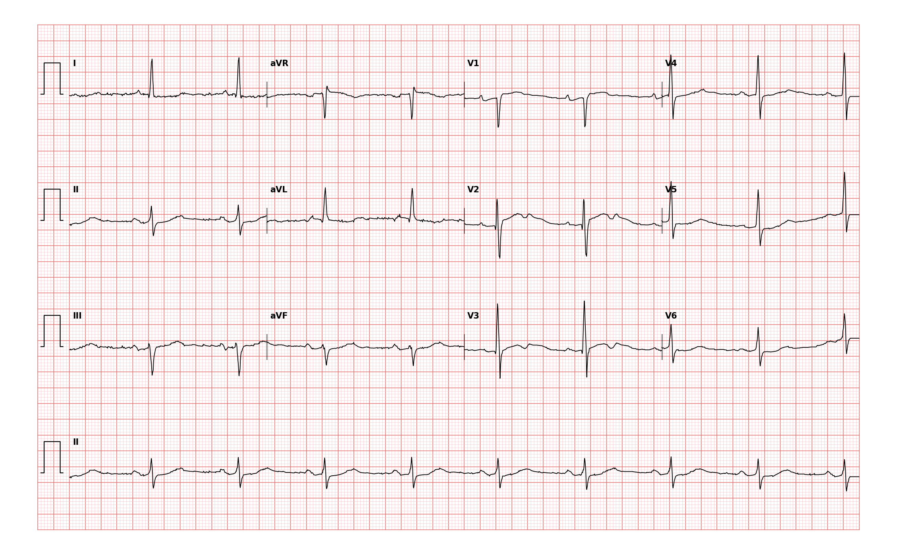

## 문제
79세 남자가 예정 수술 전 검사로 심전도를 찍었다. 증상은 없고 맥박은 분당 55회로 규칙적이다. 심전도는 그림과 같다. 심전도 소견과 수술 후 오심·구토 예방 계획을 옳게 짝지은 것은?

- A. 좌심실비대 — 예방약 선택에 제한이 없다
- B. 고칼륨혈증(뾰족한 T파) — 칼슘을 투여한 뒤 수술을 진행한다
- C. QT 간격 연장 — 온단세트론 투여를 피한다
- D. QT 간격 연장 — 드로페리돌을 우선 투여한다
- E. 완전방실차단 — 수술 전 임시 심박조율기를 삽입한다

_12유도 심전도, 25 mm/s · 10 mm/mV, 3×4 + II 리듬 스트립 (PTB-XL ECG dataset, PhysioNet, CC BY 4.0 — 원신호 그대로 작도)_

## 정답 및 해설
> 정답: C

- **정답 핵심**: 서맥(RR ≈1.1 s)에서 QRS 시작부터 느리고 낮은 T파 끝까지 ≈0.52 s(II·V5, 큰 칸 2.5칸 이상) — Bazett 보정 QTc ≈0.50 s 로 뚜렷한 QT 연장이다. 모든 P 뒤에 QRS 가 따르고 T파는 뾰족하지 않다. QT 연장 환자는 비틀림 심실빈맥(torsades) 위험이 커서 5-HT3 길항제(온단세트론)·드로페리돌 같은 QT 연장 제제를 피하고 덱사메타손·아프레피탄트 등으로 대체하며 K·Mg 를 교정한다.
- **원리**: QT 간격은 <b>심실의 탈분극 시작부터 재분극이 끝날 때까지</b>다. 재분극은 <b>K⁺ 이 세포 밖으로 나가는 전류(주로 IKr)</b>가 만들고, 이 전류가 약물·전해질·선천 이온통로 이상으로 <b>느려지면 T파가 늦게 끝나 QT 가 길어진다</b>.  <b>왜 심박수로 보정하는가</b> — 재분극 시간은 심박수가 느릴수록 생리적으로 길어진다. 그래서 <b>QTc = QT/√RR(Bazett)</b> 로 60회/분 기준에 맞춘다. 이 환자는 RR 1.10 s(55회/분)이므로 <b>√RR≈1.05, QTc≈0.52/1.05≈0.50 s</b> — 남자 기준 <b>0.45 s 를 훌쩍 넘는</b> 뚜렷한 연장이다.  <b>왜 위험한가</b> — 재분극이 길어지면 <b>조기후탈분극(EAD)</b> 이 생기고, 이것이 <b>비틀림 심실빈맥(torsades de pointes)</b> 의 방아쇠가 된다. QT 를 더 늘리는 약(5-HT3 길항제·드로페리돌·할로페리돌·일부 항생제)과 <b>저K·저Mg</b> 는 위험을 곱한다.  <b>그래서 주술기 계획</b> — PONV 예방에서 <b>온단세트론·드로페리돌을 빼고 덱사메타손·아프레피탄트로 대체</b>하며, K·Mg 를 정상 상단으로 교정하고 수술 중 QT 를 감시한다. 「심전도 판독 → 약물 선택」이 한 줄로 이어지는 문항이다.
- **비교**: <table><thead><tr><th style="width:26%">심전도 소견</th><th style="width:30%">이 기록에서의 근거</th><th>주술기 대응</th></tr></thead><tbody> <tr><td><b>QT 연장(정답)</b></td><td><b>QT≈0.52 s · RR 1.10 s → QTc≈0.50 s</b>, T파 낮고 넓음</td><td><b>온단세트론·드로페리돌 회피</b>, K·Mg 교정, QT 감시</td></tr> <tr><td>고칼륨혈증</td><td>T파가 <b>뾰족·좁은 텐트형</b>이어야 함 — 여기선 낮고 넓음</td><td>칼슘·인슐린-포도당 후 수술</td></tr> <tr><td>좌심실비대</td><td>SV1+RV5 ≥3.5 mV 등 전압 기준 — 여기선 ≈2.2 mV</td><td>PONV 약 제한 없음</td></tr> <tr><td>완전방실차단</td><td>P–QRS 해리 · 심실 이탈율동 — 여기선 매 P 뒤 QRS</td><td>임시 조율기</td></tr> </tbody></table> <b>가장 가까운 오답은 ④</b> — 같은 「QT 연장」 판독이지만 <b>드로페리돌은 온단세트론보다 QT 경고가 더 강한 약(블랙박스)</b> 이라 「우선 투여」는 판독을 맞히고도 처치에서 틀리는 자리다.
- **오답 이유**:
  - ① 좌심실비대는 SV1+RV5 ≥3.5 mV 또는 RaVL ≥1.1 mV 같은 전압 기준을 채워야 하고, 설령 비대가 있어도 QT 연장이 함께 있으면 예방약 제한이 생긴다. 이 선지가 정답이 되려면 QT 가 정상이고 전압 기준을 넘어야 한다.
  - ② 고칼륨혈증은 T파가 좁고 뾰족한 텐트형으로 서고 QRS 가 넓어진다. 이 기록은 T파가 낮고 넓어 정반대다. 이 선지가 정답이 되려면 뾰족한 T파와 함께 K⁺ 상승의 임상 배경이 있어야 한다.
  - ④ 판독(QT 연장)은 맞지만 드로페리돌은 QT 연장 경고가 더 강한 약이라 QT 연장 환자에게는 온단세트론보다 먼저 쓸 이유가 없다. 이 선지가 정답이 되려면 QT 가 정상이고 5-HT3 길항제를 못 쓰는 별도 사유가 있어야 한다.
  - ⑤ 완전방실차단은 P파와 QRS 가 서로 무관하게 각자 규칙적으로 뛴다(방실해리). 여기서는 모든 P 뒤에 일정한 간격으로 QRS 가 따른다. 이 선지가 정답이 되려면 P–QRS 해리와 느린 이탈율동이 보여야 한다.
- **함정**: 서맥에서는 「QT < RR 의 절반」 눈대중이 틀어진다. 반드시 QT 를 재서 √RR 로 보정한다 — 55회/분에서 0.52 s 는 QTc ≈0.50 s.
- **학습목표**: 수술 전 심전도에서 QT 연장을 읽고 주술기 약물 선택에 연결
- **근거·출처**: PTB-XL 기록 라벨 LNGQT(2인 심장내과 검증) · 작성자 원신호 계측: QT≈520 ms, RR 1.096 s, QTcB≈497 ms · Fourth Consensus Guidelines for the Management of PONV (Anesth Analg 2020) — QT 연장 환자에서 5-HT3 길항제·드로페리돌 주의

## 출처
- PTB-XL ECG dataset v1.0.3 (PhysioNet, CC BY 4.0) · record 320 · Creative Commons Attribution 4.0 International · https://physionet.org/content/ptb-xl/1.0.3/LICENSE.txt
