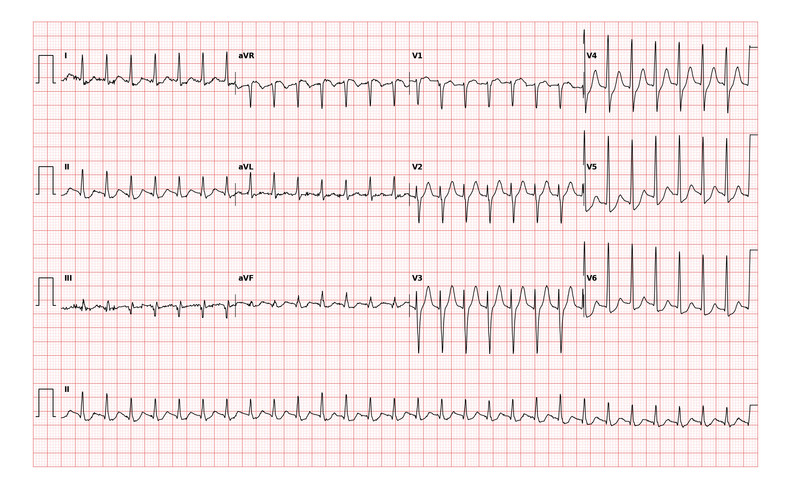

## 문제
79세 여자가 1시간 전 갑자기 시작된 두근거림으로 응급실에 왔다. 의식은 명료하고 흉통·호흡곤란은 없다. 혈압 128/80 mmHg 이다. 심전도는 그림과 같다. 가장 먼저 할 처치는?

- A. 변형 발살바 수기(미주신경자극)
- B. 아데노신 6 mg 급속 정맥주사
- C. 동기화 심장율동전환
- D. 아미오다론 정맥주사
- E. 경구 디곡신

_12유도 심전도, 25 mm/s · 10 mm/mV, 3×4 + II 리듬 스트립 (PTB-XL ECG dataset, PhysioNet, CC BY 4.0 — 원신호 그대로 작도)_

## 정답 및 해설
> 정답: A

- **정답 핵심**: QRS 가 좁고 RR 이 완전히 규칙적인 분당 약 175회 빈맥이며 QRS 앞에 뚜렷한 P파가 없다 — 발작성 상심실빈맥. 혈역학적으로 안정되어 있으므로 미주신경자극(변형 발살바)이 첫 단계이고, 실패하면 아데노신을 쓴다.
- **오답 이유**:
  - ② 아데노신은 미주신경자극이 실패했을 때의 다음 단계다
  - ③ 동기화 율동전환은 저혈압·의식저하·흉통 같은 불안정 징후가 있을 때
  - ④ 아미오다론은 좁은 QRS 규칙적 빈맥의 1차 약이 아니다
  - ⑤ 디곡신은 효과 발현이 느려 급성 종료 목적에 쓰지 않는다
- **함정**: 75세 이상이라 경동맥동 마사지는 피하지만(경동맥 협착·색전 위험), 발살바 수기는 그대로 첫 단계다.
- **학습목표**: 혈역학적으로 안정된 좁은 QRS 규칙적 빈맥의 첫 처치
- **근거·출처**: PTB-XL 기록 라벨 PSVT(2인 심장내과 검증) · 작성자 원신호 계측: RR 0.34 s(sd 5 ms), HR 176 · 2015 ACC/AHA/HRS SVT 가이드라인 · REVERT 시험(Lancet 2015)

## 출처
- PTB-XL ECG dataset v1.0.3 (PhysioNet, CC BY 4.0) · record 16229 · Creative Commons Attribution 4.0 International · https://physionet.org/content/ptb-xl/1.0.3/LICENSE.txt
