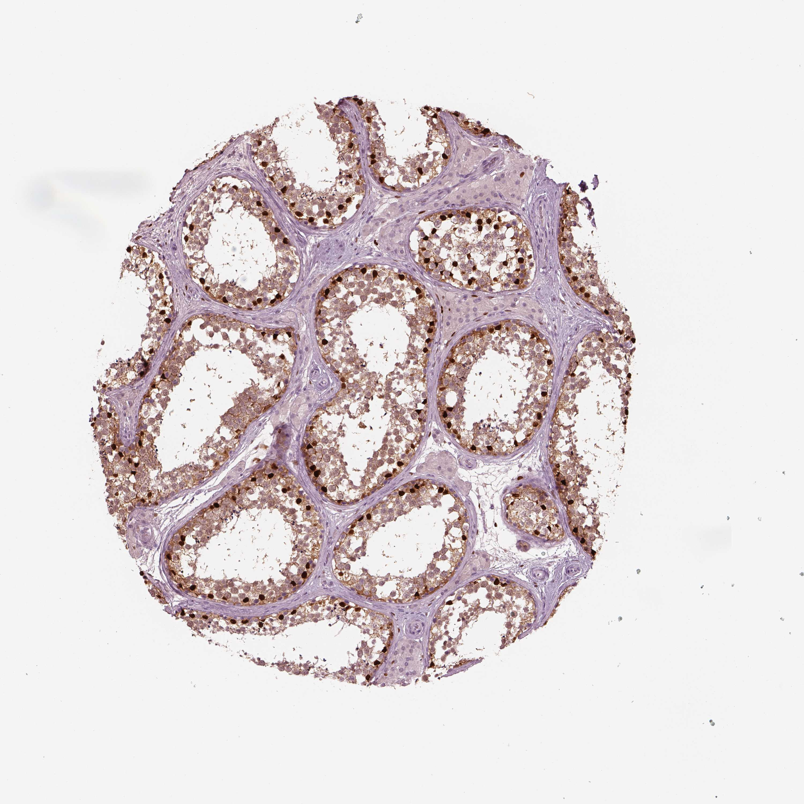

## 문제
65세 남자가 전이 전립선암의 호르몬 치료로 양측 고환절제술을 받았다. 절제한 고환 조직 절편에 어떤 전사인자에 대한 면역조직화학염색(갈색 = 양성, 청색 = 대조염색)을 하였더니 그림과 같았다. 짙은 갈색 핵으로 강하게 염색된 세포가 태아기에 분비하는 물질의 작용으로 옳은 것은?

- A. 외부생식기의 남성화
- B. 고환 하강의 경복부 단계 유도
- C. 태반의 hCG 분비 촉진
- D. 중신옆관(뮐러관)의 퇴화 유도
- E. 중신관(볼프관)의 분화 유지

_사람 장기 조직 절편, 면역조직화학염색(양성 = 갈색, 핵 대조염색 = 청색) (Human Protein Atlas, CC BY 4.0 — 원본 그대로, 크기 조정만)_

## 정답 및 해설
> 정답: D

- **정답 핵심**: 둥근 관(세정관) 안에 생식세포가 층을 이루고, 짙은 갈색 핵은 관의 기저막에 붙어 한 줄로 늘어서 있다 — 세르톨리세포. 관 사이 간질세포는 음성이다. 태아 세르톨리세포는 항뮐러관호르몬(AMH)을 분비해 뮐러관을 퇴화시킨다.
- **원리**: 고환의 조직 구조는 <b>「관 안」과 「관 사이」</b> 두 구획으로 읽는다. 세정관 안에는 <b>생식세포가 층을 이루고</b>, 그 <b>기저막에 발을 붙인 큰 세포가 세르톨리세포</b>다. 관 사이 성긴 결합조직에 <b>무리 지어 있는 세포가 간질(Leydig)세포</b>다. 이 사진의 짙은 갈색 핵은 <b>관 안, 기저막 쪽에 한 줄로</b> 늘어서 있으므로 세르톨리세포다.  <b>왜 SOX9 인가</b> — SOX9 는 <b>SRY 아래에서 세르톨리세포 운명을 정하는 전사인자</b>로, 태아기부터 성인까지 세르톨리 핵에 발현한다. 그래서 IHC 에서 핵이 갈색으로 물든다.  <b>태아기 세르톨리세포의 일</b> — <b>항뮐러관호르몬(AMH, TGF-β 계열 당단백)</b> 을 분비한다. AMH 는 <b>중신옆관(뮐러관) 주변 중간엽의 AMHR2</b> 에 결합해 세포자멸사를 유도하고, 그 결과 <b>자궁·난관·질 상부가 만들어지지 않는다</b>. 임신 8주 무렵부터 작동하며, 이것이 46,XY 태아에 여성 내부생식기가 없는 이유다.  <b>남성화의 나머지 절반</b>은 <b>간질세포의 테스토스테론(볼프관 유지)과 DHT(외부생식기·전립선)</b> 이 맡는다. 즉 「없애는 일은 세르톨리(AMH), 만드는 일은 간질(안드로겐)」로 나뉜다.
- **비교**: <table><thead><tr><th style="width:22%">세포</th><th style="width:22%">사진에서의 위치</th><th style="width:24%">태아기 분비물</th><th>작용</th></tr></thead><tbody> <tr><td><b>세르톨리세포(정답)</b></td><td><b>세정관 안 · 기저막에 한 줄</b></td><td><b>AMH</b></td><td><b>뮐러관 퇴화</b> → 자궁·난관 없음</td></tr> <tr><td>간질(Leydig)세포</td><td>관 사이 결합조직에 무리</td><td>테스토스테론 · INSL3</td><td>볼프관 유지 · 경복부 고환하강</td></tr> <tr><td>표적 조직(5α-환원효소)</td><td>—</td><td>DHT</td><td>외부생식기 남성화 · 전립선</td></tr> <tr><td>태반 합체영양막</td><td>—</td><td>hCG</td><td>초기 간질세포 자극(태아 고환이 촉진하지 않음)</td></tr> </tbody></table> <b>가장 가까운 오답은 ⑤</b> — 같은 고환 세포의 태아기 기능이지만 <b>볼프관 유지는 간질세포의 테스토스테론</b>이다. 사진에서 <b>관 사이가 음성</b>인 것이 결정적 근거다.
- **오답 이유**:
  - ① 외부생식기 남성화는 테스토스테론이 표적 조직의 5α-환원효소로 DHT 가 되어 일으킨다. 세르톨리세포는 안드로겐을 만들지 않는다. 이 선지가 정답이 되려면 갈색 세포가 관 사이 간질세포여야 하고, 그래도 「DHT 작용」으로 한 단계 더 가야 한다.
  - ② 고환의 경복부 하강은 간질세포가 분비하는 INSL3 가 고환도대를 두껍게 해 이끈다. 이 선지가 정답이 되려면 염색된 세포가 관 사이에 무리 지은 간질세포여야 한다.
  - ③ hCG 는 태반 합체영양막이 분비하며 태아 고환 세포가 그 분비를 촉진하는 경로는 없다. 오히려 hCG 가 간질세포를 자극하는 방향이다. 이 선지가 정답이 되려면 분비 주체와 표적이 뒤바뀌어야 하므로 어떤 사진에서도 성립하지 않는다.
  - ⑤ 볼프관을 부고환·정관·정낭으로 분화·유지하는 것은 간질세포의 테스토스테론이다. 이 사진에서는 관 사이가 음성이라 간질세포를 물은 것이 아니다. 이 선지가 정답이 되려면 갈색 세포가 관 사이에 있어야 한다.
- **함정**: 갈색 세포가 「관 안」인지 「관 사이」인지가 세르톨리(AMH)와 간질세포(테스토스테론)를 가르는 첫 갈림길이다.
- **학습목표**: 세정관 기저부 세르톨리세포를 식별하고 태아기 기능(AMH)에 연결
- **근거·출처**: HPA SOX9/testis 주석: Sertoli cells high · 나머지 not detected · 작성자 육안 판독(2026-09-13)

## 출처
- Human Protein Atlas, SOX9 / Testis (CC BY 4.0), https://images.proteinatlas.org/68240/159895_A_5_6.jpg · Creative Commons Attribution 4.0 International · https://www.proteinatlas.org/about/licence
