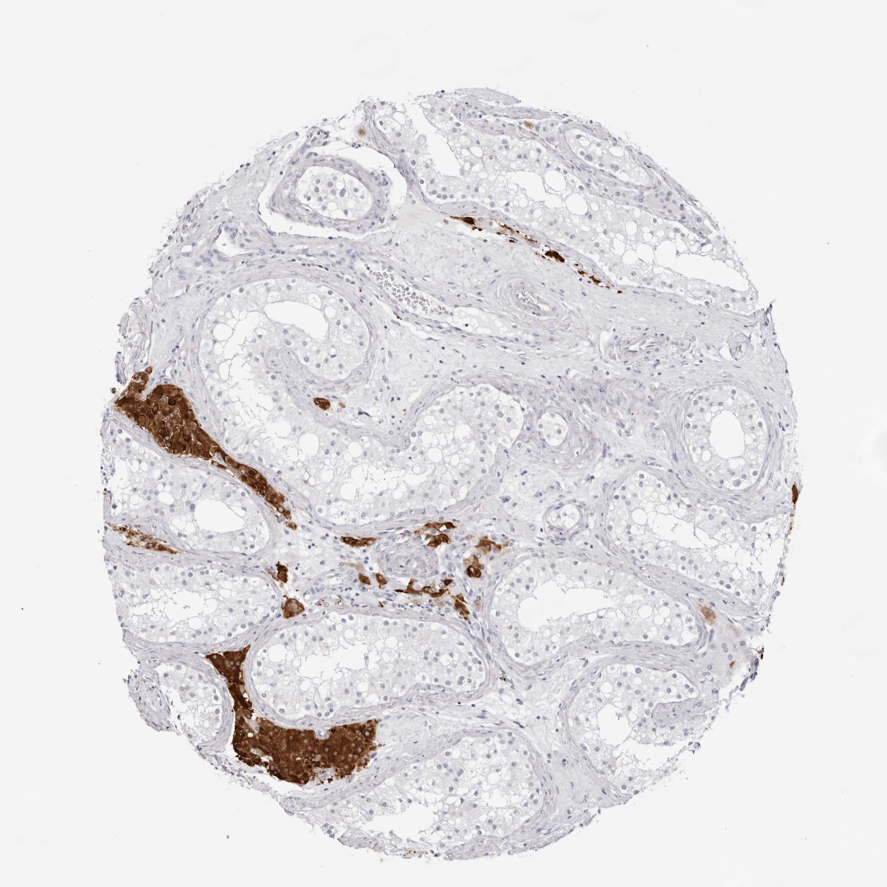

## 문제
A tissue section obtained from an 84-year-old man is stained by immunohistochemistry for a peptide hormone. The strongly brown-stained cells are the principal target of which of the following hormones?

- A. Anti-Müllerian hormone
- B. Prolactin
- C. Luteinizing hormone
- D. Follicle-stimulating hormone
- E. Inhibin B

_Human tissue section, immunohistochemistry (brown = positive, blue = hematoxylin counterstain) (Human Protein Atlas, CC BY 4.0; original image, resized only)_

## 정답 및 해설
> 정답: C

- **정답 핵심**: Round tubules lined by germ cells are unstained; the strongly positive cells form clusters in the interstitium between the tubules — Leydig cells. Leydig cells express LH receptors and make testosterone in response to LH.
- **오답 이유**:
  - (A) AMH is a Sertoli-cell product that acts on Müllerian ducts
  - (B) Prolactin is not the trophic hormone for testicular steroidogenesis
  - (D) FSH acts on Sertoli cells inside the seminiferous tubules, which are negative here
  - (E) Inhibin B is secreted by Sertoli cells and acts on the pituitary; it has no Leydig-cell target role
- **함정**: LH = Leydig(간질), FSH = Sertoli(관 안) — 위치로 먼저 세포를 정하고 수용체를 붙인다.
- **학습목표**: 간질 Leydig 세포 식별과 LH 표적 연결
- **근거·출처**: HPA INSL3/testis 주석: Leydig cells high · 세정관 세포 not detected · 작성자 육안 판독(2026-09-13)

## 출처
- Human Protein Atlas, INSL3 / Testis (CC BY 4.0), https://images.proteinatlas.org/28615/59764_A_5_6.jpg · Creative Commons Attribution 4.0 International · https://www.proteinatlas.org/about/licence
