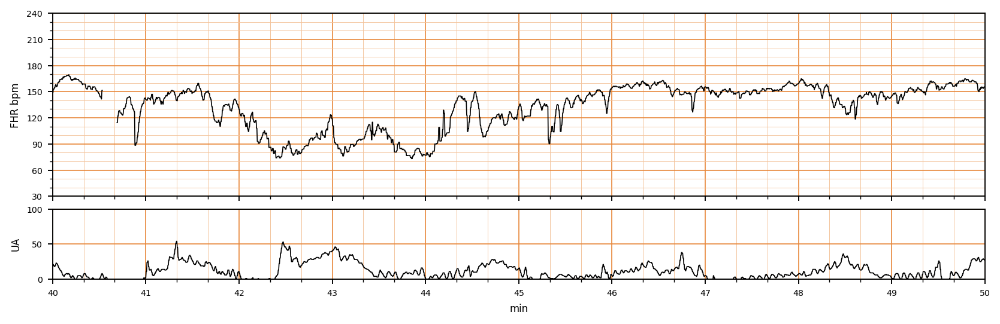

## 문제
A 37-year-old woman, para 1, at 41 weeks' gestation is in labor with continuous electronic fetal monitoring. The tracing from minutes 40 to 50 of monitoring is shown. Which of the following best describes the change in fetal heart rate between minutes 42 and 44?

- A. Sinusoidal pattern
- B. Prolonged deceleration
- C. Variable deceleration
- D. Late deceleration
- E. Early deceleration

_Intrapartum fetal heart rate (upper) and uterine activity (lower), minutes 40–50 of monitoring; 3 cm/min, vertical lines = 1 min (CTU-UHB Intrapartum Cardiotocography Database, PhysioNet, ODC-BY 1.0; 4 Hz raw data, no smoothing)_

## 정답 및 해설
> 정답: B

- **정답 핵심**: Baseline is about 150/min (minutes 46–50). The heart rate leaves baseline at about minute 42, falls to a nadir near 75/min, and does not return until about minute 44.3 — a decrease of ≥15/min lasting ≥2 minutes but <10 minutes, which is a prolonged deceleration (NICHD).
- **원리**: NICHD 분류에서 감속의 이름은 <b>모양이 아니라 「기저선을 떠나 돌아올 때까지의 시간」과 「시작 방식(급격/완만)」</b>으로 정한다. <b>기저선</b>은 감속·가속을 뺀 10분 구간에서 가장 흔한 값으로, 이 기록에서는 46~50분의 <b>약 150/min</b> 이다.  <b>왜 지속 감속인가</b> — 42.0분에 기저선을 떠나 <b>최저 약 75/min</b> 까지 떨어졌다가 <b>44.3분에야 돌아온다</b>. 감소 폭 ≥15/min 이고 지속시간이 <b>2분 이상 10분 미만</b>이므로 정의상 <b>prolonged deceleration</b> 이다. 10분을 넘으면 「기저선 변화」로 부른다.  <b>왜 2분이 경계인가</b> — 변이 감속의 기전은 <b>제대 압박 → 압수용체 반사 → 미주신경 긴장</b>으로, 압박이 풀리면 15초~2분 안에 회복된다. 2분을 넘게 돌아오지 못하면 <b>반사가 아니라 저산소증으로 인한 심근 억제</b>가 의심되는 시간대로 들어간다. 그래서 2분이 이름을 바꾸는 선이다.  <b>그다음 판단</b> — 지속 감속은 <b>2군(indeterminate)</b> 이고, 원인(자궁 과자극·저혈압·제대 탈출·태반 조기박리)을 찾아 <b>체위 변경·옥시토신 중단·수액·산소</b>로 소생 조치를 한다. <b>세로 1분선으로 시간을 세는 것</b>이 판독의 시작이다.
- **비교**: <table><thead><tr><th style="width:24%">감속</th><th style="width:22%">시작 방식</th><th style="width:22%">지속</th><th>수축과의 관계 · 기전</th></tr></thead><tbody> <tr><td><b>지속 감속(정답)</b></td><td>급격 또는 완만</td><td><b>≥2분 ~ &lt;10분</b></td><td>수축과 무관해도 됨 · 저산소·제대압박 지속</td></tr> <tr><td>변이 감속</td><td><b>급격</b>(최저까지 &lt;30초)</td><td><b>15초 ~ &lt;2분</b></td><td>수축과 시점 불규칙 · 제대 압박 반사</td></tr> <tr><td>후기 감속</td><td>완만(≥30초)</td><td>수축 길이만큼</td><td><b>최저점이 수축 정점 뒤</b> · 자궁태반 관류 부전</td></tr> <tr><td>조기 감속</td><td>완만</td><td>수축 길이만큼</td><td><b>최저점이 수축 정점과 일치</b> · 아두 압박</td></tr> <tr><td>정현파형</td><td>—</td><td>≥20분</td><td>3~5 cycles/min 매끈한 사인파 · 태아 빈혈</td></tr> </tbody></table> <b>가장 가까운 오답은 ③ 변이 감속</b> — 모양이 급격해 보이면 변이 감속으로 부르기 쉽지만, <b>2.3분</b>이라는 시간이 이름을 바꾼다. 「급격 + 2분 미만 = 변이, 2분 이상 = 지속」이 경계다.
- **오답 이유**:
  - (A) 정현파형은 3~5 cycles/min 의 매끈한 사인파가 20분 이상 이어지고 기저선 변이도가 사라진 상태로, 태아 빈혈·저산소를 뜻한다. 이 기록은 한 번의 큰 하강이다. 이 선지가 정답이 되려면 규칙적 파동이 20분 넘게 반복돼야 한다.
  - (C) 변이 감속은 급격히 떨어지지만 15초에서 2분 미만에 회복하는 제대 압박 반사다. 이 감속은 2.3분 이어져 정의를 넘는다. 이 선지가 정답이 되려면 44분 전에 기저선으로 돌아왔어야 한다.
  - (D) 후기 감속은 30초 이상 완만하게 내려가고 최저점이 수축 정점 뒤에 오며 수축마다 반복된다. 여기서는 하강이 수축 상승보다 먼저 시작하고 반복도 없다. 이 선지가 정답이 되려면 수축 정점 뒤로 밀린 최저점이 여러 수축에서 반복돼야 한다.
  - (E) 조기 감속은 수축의 거울상처럼 얕고 완만하며 최저점이 수축 정점과 일치하는 아두 압박 소견이다. 75/min 까지 떨어지는 2분 넘는 하강은 그 범주가 아니다. 이 선지가 정답이 되려면 얕은 하강의 최저점이 수축 정점과 겹쳐야 한다.
- **함정**: 감속 이름은 모양보다 「기저선을 떠난 시점부터 돌아온 시점까지」의 시간이 먼저 — 세로 1분선으로 2분을 넘는지 센다.
- **학습목표**: 분만 중 태아심박동 감속의 유형을 지속시간으로 분류
- **근거·출처**: CTU-UHB 원자료(4 Hz) 작성자 계측: 기저 ≈150, 42.0~44.3분 FHR<135, 최저 ≈73 · Macones GA et al. NICHD 2008 workshop report on electronic fetal monitoring (Obstet Gynecol 2008)

## 출처
- CTU-UHB Intrapartum Cardiotocography Database (PhysioNet, ODC-BY 1.0) · record 1486 · Open Data Commons Attribution License v1.0 · https://opendatacommons.org/licenses/by/1-0/
