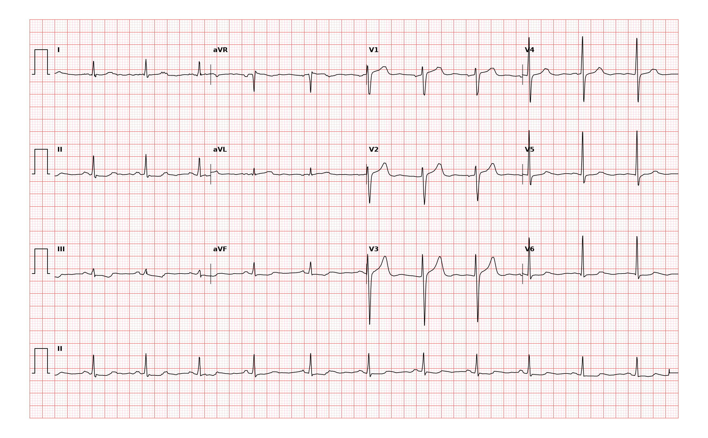

## 문제
63세 남자가 2주 전부터 계단을 오를 때 가슴이 조이는 느낌이 생겨 왔다. 쉬면 5분 안에 사라지고 지금은 통증이 없다. 고혈압으로 약을 먹고 있다. 혈압 138/86 mmHg, 맥박 분당 66회로 규칙적이다. 안정 시 12유도 심전도는 그림과 같다. 심전도 소견은?

- A. 불규칙한 RR 간격과 P파 소실
- B. II·III·aVF·V6 유도의 ST 분절 하강과 III·aVF 유도의 T파 역위
- C. II·III·aVF 유도의 ST 분절 상승과 aVL 유도의 상반성 하강
- D. V1–V3 유도의 ST 분절 상승과 병적 Q파
- E. QRS 폭 0.12초 이상의 우각차단

_12유도 심전도, 25 mm/s · 10 mm/mV, 3×4 + II 리듬 스트립 (PTB-XL ECG dataset, PhysioNet, CC BY 4.0 — 원신호 그대로 작도)_

## 정답 및 해설
> 정답: B

- **정답 핵심**: 모든 QRS 앞에 P파가 일정한 PR 간격으로 있고 RR 이 규칙적인 동율동(약 66회/분)이다. 하벽 유도(II·III·aVF)와 V6 에서 ST 분절이 기준선 아래로 내려가 있고, III·aVF 의 T파는 뒤집혀 있다. ST 상승·병적 Q파·넓은 QRS 는 없다. 노작성 흉통 병력과 함께 하벽·측벽의 심근허혈이 의심되는 소견이다.
- **원리**: ST 분절은 <b>심실 탈분극이 끝나고 재분극이 시작되기 전의 등전위 구간</b>이다. 심내막하층이 허혈에 빠지면 그 부위 세포의 안정막전위와 활동전위 지속시간이 바뀌어 <b>손상전류(injury current)</b> 가 생기고, 심내막하 허혈에서는 이 전류가 <b>심외막 쪽 전극에서 멀어지는 방향</b>이므로 그 유도에서 <b>ST 분절이 내려간다</b>. 반대로 벽 전층이 허혈이면 손상전류 방향이 전극을 향해 <b>ST 가 올라간다</b> — 그래서 ST 하강은 「심내막하 허혈」, ST 상승은 「전층 손상(STEMI)」로 읽는다.  <b>왜 하벽·측벽으로 묶는가</b> — II·III·aVF 는 심장의 아래쪽(가로막면)을, V5·V6 는 왼쪽 옆면을 본다. 이 기록은 II·III·aVF 와 V6 에서 함께 ST 가 내려가고 III·aVF 의 T파가 뒤집혀 있어 <b>하측벽 심내막하 허혈</b>에 합당하다. 다만 <b>ST 하강은 ST 상승만큼 혈관을 정확히 가리키지 못한다</b>(전벽 STEMI 의 상반성 하강, 좌심실비대의 부하 양상과도 겹친다) — 그래서 「소견」을 먼저 정확히 읽고, 진단은 병력(노작 시 흉통, 안정 시 소실)과 함께 붙인다.  <b>판독 순서</b> — 율동(P–QRS 관계·RR 규칙성) → 축 → 간격(PR·QRS·QT) → ST·T. 이 기록은 율동·간격이 정상이라 「ST·T 이상」만 남는다.
- **비교**: <table><thead><tr><th style="width:28%">소견</th><th style="width:36%">이 기록에서 확인할 자리</th><th>의미</th></tr></thead><tbody> <tr><td><b>II·III·aVF·V6 ST 하강 + III·aVF T 역위(정답)</b></td><td>하벽 유도 세 개와 V6 의 ST 가 기준선(PR 분절) 아래, III·aVF 의 T 가 아래로</td><td>하측벽 심내막하 허혈 의심 — 안정협심증 병력과 맞음</td></tr> <tr><td>II·III·aVF ST 상승 + aVL 상반성 하강</td><td>ST 가 <b>올라가야</b> 하고 aVL 만 내려가야 함 — 여기선 하벽 ST 가 내려감</td><td>하벽 STEMI(우관상동맥) — 응급 재관류</td></tr> <tr><td>V1–V3 ST 상승 + Q파</td><td>V1–V3 는 깊은 S 뒤 T 가 크게 서 있을 뿐 ST 는 기준선</td><td>전중격 STEMI</td></tr> <tr><td>우각차단</td><td>QRS 폭 ≈0.09 s, V1 rSR′ 없음</td><td>전도장애</td></tr> </tbody></table> <b>가장 가까운 오답은 ②</b> — 같은 하벽 유도를 가리키지만 ST 의 <b>방향</b>이 반대다. 「하강」이면 심내막하 허혈·비STEMI 쪽, 「상승」이면 STEMI 로 처치 자체가 갈리므로 기준선(PR 분절)과 J점을 대고 방향부터 정한다.
- **오답 이유**:
  - ① 심방세동은 RR 간격이 완전히 불규칙하고 P파 대신 세동파가 보인다. 이 기록은 RR 이 일정하고 모든 QRS 앞에 P파가 있다. 이 선지가 정답이 되려면 리듬 스트립에서 RR 이 제각각이고 P파가 없어야 한다.
  - ③ 하벽 STEMI 는 II·III·aVF 의 ST 가 기준선 위로 올라가고 aVL 이 거울처럼 내려간다. 이 기록은 하벽 ST 가 아래로 내려가 있어 방향이 반대다. 이 선지가 정답이 되려면 J점이 기준선 위 ≥1 mm 에 있어야 한다.
  - ④ V1–V3 에는 깊은 S파 뒤에 T파가 크게 서 있을 뿐 ST 상승도 병적 Q파(폭 ≥0.04 s·깊이 R의 1/4)도 없다. 이 선지가 정답이 되려면 V1–V3 의 J점 상승과 Q파가 실제로 보여야 한다.
  - ⑤ 우각차단은 QRS 폭이 0.12 s 이상이고 V1 에 rSR′, V6 에 넓은 S 가 있어야 한다. 이 기록의 QRS 는 작은 칸 2~2.5칸(≈0.09 s)으로 좁다. 이 선지가 정답이 되려면 QRS 가 큰 칸 3칸 이상으로 넓어야 한다.
- **함정**: V1–V3 의 크고 뾰족한 T파와 깊은 S 에 눈이 가면 「전벽」으로 착각한다 — ST 는 기준선에 있다. 하벽 유도 셋을 한꺼번에 보고 PR 분절과 J점을 대야 하강이 보인다.
- **학습목표**: 노작성 흉통 환자의 안정 시 심전도에서 하벽·측벽 유도의 ST 분절 하강과 T파 역위를 읽는다
- **근거·출처**: PTB-XL 기록 라벨 ISCIN(2인 심장내과 검증) · 판독문: ST depressed II·III·aVF·V6, T inverted III·aVF · 작성자 판독(2026-09-14): 동율동 ≈66/분, QRS ≈0.09 s, 하벽·V6 ST 하강, III·aVF T 역위 · Fourth Universal Definition of Myocardial Infarction (2018) — ST 하강·T 역위의 허혈 판정 기준

## 출처
- PTB-XL ECG dataset v1.0.3 (PhysioNet, CC BY 4.0) · record 1175 · Creative Commons Attribution 4.0 International · https://physionet.org/content/ptb-xl/1.0.3/LICENSE.txt
