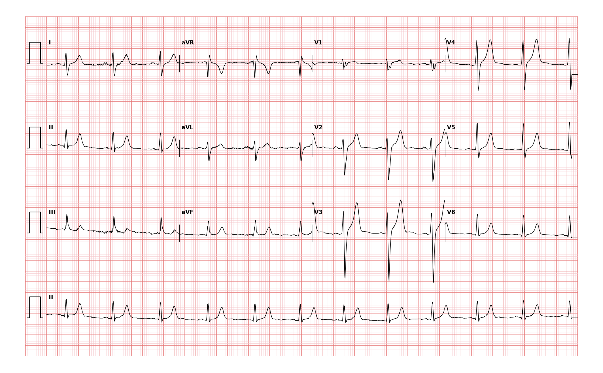

## 문제
A 25-year-old man comes to the clinic for a pre-participation sports examination. He has no symptoms and no history of syncope or chest pain. He is tall and thin. Blood pressure is 118/72 mm Hg and pulse is 72/min and regular. A 12-lead electrocardiogram is shown. Which of the following best describes the mean QRS axis in the frontal plane?

- A. Right axis deviation (+90° to +180°)
- B. Normal axis (−30° to +90°)
- C. Left axis deviation (−30° to −90°)
- D. Extreme (northwest) axis (−90° to −180°)
- E. Indeterminate axis (isoelectric in all limb leads)

_12-lead ECG, 25 mm/s, 10 mm/mV, 3×4 + lead II rhythm strip (PTB-XL, PhysioNet, CC BY 4.0; raw signal, no filtering)_

## 정답 및 해설
> 정답: A

- **정답 핵심**: In lead I the QRS is predominantly negative (small r, deep S); in lead aVF and lead III it is predominantly positive (qR). A negative lead I with a positive aVF places the mean QRS vector between +90° and +180° — right axis deviation. The QRS is narrow and the rhythm is sinus, so this is an isolated axis finding.
- **원리**: The frontal-plane axis is the <b>direction of the mean QRS vector</b>, and each limb lead is a <b>projection of that vector onto the lead's own axis</b>: lead I looks from the left (0°), lead aVF from the feet (+90°). A vector pointing toward a lead writes a positive deflection; a vector pointing away writes a negative one.  <b>Why two leads are enough</b> — leads I and aVF are perpendicular. Positive in both → the vector lies in the lower-left quadrant (0° to +90°, normal). <b>Negative in I but positive in aVF</b> → the vector points down and to the right, i.e. <b>+90° to +180°: right axis deviation</b>. Positive in I, negative in aVF → left axis (0° to −90°, abnormal beyond −30°). Negative in both → extreme axis.  <b>Why it happens</b> — the vector swings toward the mass that depolarizes last or most. Right axis deviation appears with a vertically positioned heart in a tall thin young adult, with right ventricular hypertrophy (pulmonary hypertension, congenital shunts), with lateral wall infarction, and with <b>left posterior fascicular block</b> (the posteroinferior fascicle fails, so the inferior wall depolarizes late and the vector tips inferiorly and rightward — a diagnosis made only after the other causes are excluded).  <b>Reading order</b> — decide the polarity of I, then of aVF, then refine with the most isoelectric limb lead (the axis is perpendicular to it).
- **비교**: <table><thead><tr><th style="width:30%">Axis</th><th style="width:22%">Lead I</th><th style="width:22%">Lead aVF</th><th>This tracing</th></tr></thead><tbody> <tr><td><b>Right axis deviation (answer)</b></td><td><b>negative (rS)</b></td><td><b>positive (qR)</b></td><td>I is net negative, III/aVF strongly positive → ≈ +120°</td></tr> <tr><td>Normal axis</td><td>positive</td><td>positive (or aVF negative with II positive, −30° to 0°)</td><td>would need a dominant R in lead I</td></tr> <tr><td>Left axis deviation</td><td>positive</td><td>negative, and lead II negative</td><td>opposite of this tracing</td></tr> <tr><td>Extreme axis</td><td>negative</td><td>negative</td><td>aVF here is clearly positive</td></tr> </tbody></table> The <b>closest wrong answer is the normal axis</b>: in a tall thin 25-year-old a vertical axis near +90° is common, and only the <b>negative net area of lead I</b> pushes this tracing past +90°. Measure the r and S of lead I with a ruler instead of eyeballing.
- **오답 이유**:
  - (B) A normal axis requires a net positive QRS in lead I. Here lead I is a small r followed by a deep S, so the net area is negative. This option would be correct only if the R wave in lead I exceeded its S wave.
  - (C) Left axis deviation needs a positive lead I with negative leads II and aVF, the mirror image of this tracing. This option would be correct only if aVF and II were predominantly negative.
  - (D) An extreme (northwest) axis needs negative deflections in both lead I and lead aVF. Lead aVF here is strongly positive. This option would be correct only if aVF were also net negative.
  - (E) An indeterminate axis means every limb lead is nearly isoelectric (equal positive and negative area). Leads III and aVF here are clearly positive and lead I clearly negative. This option would be correct only if no limb lead had a dominant deflection.
- **함정**: Do not decide the axis from lead II alone — lead II is positive in both the normal range and in right axis deviation. The discriminating lead is lead I.
- **학습목표**: 사지유도 I·aVF 의 QRS 극성으로 평균 QRS 전기축을 결정한다
- **근거·출처**: PTB-XL record label LPFB (two-cardiologist validated) — implies right axis deviation with narrow QRS · 작성자 판독(2026-09-14): I rS(음성), III·aVF qR(양성), QRS ≈0.09 s → 축 ≈ +120° · AHA/ACCF/HRS Recommendations for the Standardization and Interpretation of the ECG, Part III: Intraventricular Conduction Disturbances (2009)

## 출처
- PTB-XL ECG dataset v1.0.3 (PhysioNet, CC BY 4.0) · record 16116 · Creative Commons Attribution 4.0 International · https://physionet.org/content/ptb-xl/1.0.3/LICENSE.txt
