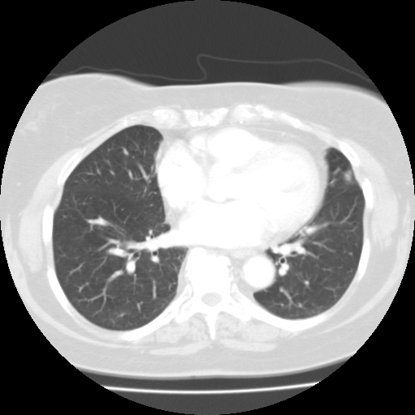

## 문제
67세 여자가 건강검진으로 흉부 CT를 찍었다. 특별한 증상은 없고 흡연력도 없다. 심실 높이의 흉부 CT 축상면(폐창)은 그림과 같다. 척추체의 왼쪽 앞에 접하여 둥근 단면으로 보이는 관 구조물이 가로막을 통과하는 척추 높이는?

- A. 제8등뼈(T8)
- B. 제10등뼈(T10)
- C. 제1허리뼈(L1)
- D. 제3허리뼈(L3)
- E. 제12등뼈(T12)

_흉부 CT 축상면, 폐창(lung window) — 표준 표시 방향(환자의 오른쪽이 그림의 왼쪽) (The Cancer Imaging Archive, CC BY 3.0 — DICOM 원본을 창 설정 외 가공 없이 변환)_

## 정답 및 해설
> 정답: E

- **정답 핵심**: 심실 높이에서 척추체의 왼쪽 앞에 붙어 있는 지름 2~3 cm 의 둥근 관 구조는 하행 흉부대동맥이다(뒤세로칸). 대동맥은 가로막의 두 다리(crura)와 정중활꼴인대 뒤로 지나는 대동맥구멍을 통해 배로 내려가며 그 높이는 제12등뼈다. 식도구멍은 T10, 대정맥구멍은 T8 이다.
- **원리**: 가로막에는 큰 구멍이 셋 있고 각각의 높이가 다르다. <b>대정맥구멍(T8)</b> 은 가로막의 <b>중심널힘줄 안</b>에 있어 숨을 들이쉴 때 오히려 벌어져 정맥 환류를 돕는다. <b>식도구멍(T10)</b> 은 <b>오른쪽 다리(right crus)의 근육섬유가 감싸는</b> 구멍이라 수축할 때 조여 역류를 막는 「생리적 조임근」 역할을 한다. <b>대동맥구멍(T12)</b> 은 엄밀히는 가로막을 「뚫는」 것이 아니라 <b>두 다리와 정중활꼴인대 뒤, 척추체 앞</b>을 지나므로 가로막이 수축해도 대동맥이 눌리지 않는다 — 함께 가슴림프관과 홀정맥이 지난다.  <b>왜 T8·T10·T12 인가</b> — 외우는 요령은 「글자 수」다: vena <b>cava</b>(4자·T8 은 8=4×2), <b>oesophagus</b>(10자→T10), <b>aortic hiatus</b>(12자→T12).  <b>영상에서 대동맥을 어떻게 알아보나</b> — 축상면에서 하행대동맥은 <b>척추체의 왼쪽 앞</b>에 붙어 위아래 모든 단면에서 같은 자리에 나타나는 <b>둥근 단면</b>이다. 식도는 그보다 <b>오른쪽 앞·정중 가까이</b> 있고 안에 공기가 있을 수 있으며 둥글지 않다. 홀정맥은 <b>척추체 오른쪽 앞</b>의 작은 구조다. 그래서 「왼쪽 앞 · 둥글고 · 크다」 세 가지로 하행대동맥이 확정된다 — 폐창에서는 세로칸이 모두 희게 뭉쳐 보이므로 위치 관계로 읽는다.
- **비교**: <table><thead><tr><th style="width:28%">구조</th><th style="width:30%">축상 CT 에서의 자리</th><th style="width:16%">가로막 통과 높이</th><th>함께 지나는 것</th></tr></thead><tbody> <tr><td><b>하행대동맥(정답 구조)</b></td><td><b>척추체 왼쪽 앞, 둥근 단면, 지름 2~3 cm</b></td><td><b>T12(대동맥구멍)</b></td><td>가슴림프관, 홀정맥</td></tr> <tr><td>식도</td><td>정중~약간 왼쪽, 대동맥의 오른쪽 앞, 납작·공기 가능</td><td>T10(식도구멍)</td><td>앞·뒤 미주신경줄기</td></tr> <tr><td>아래대정맥</td><td>이 높이에는 없음(간 위 짧은 구간만 흉강)</td><td>T8(대정맥구멍)</td><td>오른가로막신경 가지</td></tr> <tr><td>홀정맥</td><td>척추체 오른쪽 앞, 작은 점</td><td>T12(대동맥구멍 또는 오른다리)</td><td>—</td></tr> </tbody></table> <b>가장 가까운 오답은 T10</b> — 영상에서 「척추체 앞의 둥근 것」을 식도로 잘못 읽으면 T10 을 고른다. 식도는 대동맥의 오른쪽 앞에 있고 둥글게 꽉 찬 단면이 아니라는 점, 그리고 이 구조가 <b>왼쪽</b>에 붙어 있다는 점이 갈림길이다.
- **오답 이유**:
  - ① T8 은 아래대정맥이 중심널힘줄을 지나는 높이다. 아래대정맥은 척추체 오른쪽 앞에 있고 심실 높이의 흉부 단면에는 나타나지 않는다. 이 선지가 정답이 되려면 그림의 구조가 척추 오른쪽 앞의 정맥이어야 한다.
  - ② T10 은 식도가 오른쪽 다리 섬유 사이로 지나는 높이다. 식도는 대동맥의 오른쪽 앞, 정중 가까이에 있고 둥근 단면이 아니다. 이 선지가 정답이 되려면 그림의 구조가 척추 왼쪽이 아니라 정중 앞의 납작한 관이어야 한다.
  - ③ L1 은 위창자간막동맥이 대동맥에서 갈라지는 높이이지 대동맥이 가로막을 지나는 높이가 아니다. 이 선지가 정답이 되려면 「가로막 통과」가 아니라 「첫 가지의 기시 높이」를 물어야 한다.
  - ④ L3 은 아래창자간막동맥의 기시 높이이고 L4 에서 대동맥이 두 온엉덩동맥으로 갈라진다. 이 선지가 정답이 되려면 「대동맥이 갈라지기 직전의 가지」를 물어야 한다.
- **함정**: 폐창에서는 세로칸 구조가 모두 희게 뭉쳐 보인다 — 「척추체 왼쪽 앞의 둥근 단면」이라는 위치 관계 하나로 하행대동맥을 확정한 뒤 높이를 붙인다.
- **학습목표**: 심실 높이 흉부 CT 에서 하행대동맥을 위치로 식별하고 가로막의 대동맥구멍 높이(T12)에 연결한다
- **근거·출처**: TCIA LIDC-IDRI 시리즈(CC BY 3.0) — 작성자 판독(2026-09-14): 심실 높이, 척추체 왼쪽 앞 둥근 하행대동맥, 폐 실질 정상·결절 없음 · Moore Clinically Oriented Anatomy — 가로막 구멍: 대정맥구멍 T8 · 식도구멍 T10 · 대동맥구멍 T12

## 출처
- LIDC-IDRI, The Cancer Imaging Archive (CC BY 3.0) · series …43069436 · Creative Commons Attribution 3.0 Unported · https://www.cancerimagingarchive.net/data-usage-policies-and-restrictions/
