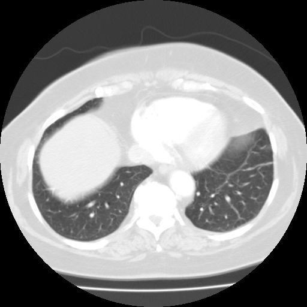

## 문제
A 67-year-old woman undergoes CT of the chest as part of a health screening program. She has no cough, fever, dyspnea, or weight loss, and she has never smoked. An axial image of the chest at the level of the lung bases (lung window) is shown. Which of the following best explains the large, smooth, homogeneous soft-tissue density that occupies the anterior part of the right lower hemithorax?

- A. Dome of the right hemidiaphragm with the liver beneath it
- B. Consolidation of the right lower lobe
- C. Loculated right pleural effusion
- D. Mass arising in the right middle lobe
- E. Atelectasis of the right lower lobe

_Axial chest CT, lung window, standard display orientation (patient's right on the viewer's left) (The Cancer Imaging Archive, CC BY 3.0; converted from DICOM with windowing only)_

## 정답 및 해설
> 정답: A

- **정답 핵심**: The density has a smooth, convex, sharply defined margin, is perfectly homogeneous, and the aerated lung wraps around it posteriorly and laterally without any air bronchograms, volume loss, or septal thickening. At the level of the lung bases the right hemidiaphragm rises higher than the left because of the liver; an axial slice cuts the top of the dome and displays the liver as a round soft-tissue 'mass' surrounded by lung. The normal left lung base and the heart at the same level confirm the level.
- **원리**: An axial CT slice is a <b>3 mm-thick slab</b> through a body whose organs are curved. The right hemidiaphragm is a <b>dome that rises to about the 4th–5th intercostal space</b> in expiration, higher than the left because the liver sits beneath it. A transverse slice through the upper part of that dome therefore contains <b>lung all around and diaphragm-plus-liver in the middle</b>: on the image the liver appears as a round, homogeneous soft-tissue 'mass' surrounded by aerated lung. This is a <b>partial-volume / geometric effect of the dome, not a lesion</b>.  <b>How to recognize it</b> — (1) the margin is <b>smooth and convex toward the lung</b> in every direction, because it is a curved surface; (2) the interior is <b>perfectly homogeneous</b> with no air bronchograms, no vessels running into it and no cavity; (3) the lung around it is <b>normal</b>, with no volume loss (fissures, hilum and mediastinum are not displaced) and no septal thickening; (4) on the slice above it becomes smaller and on the slice below it becomes larger, until it merges with the whole liver.  <b>Why the alternatives look different</b> — consolidation keeps the shape of the lobe and contains air bronchograms; atelectasis shrinks the lobe and pulls the fissure and hilum toward it; an effusion layers dependently (posteriorly in a supine patient) with a meniscus and would not sit anteriorly; a mass has an irregular or lobulated edge, feeding vessels and no 'grows-into-the-liver' behaviour on adjacent slices.
- **비교**: <table><thead><tr><th style="width:30%">Finding</th><th style="width:36%">Shape and interior</th><th>What the surrounding lung does</th></tr></thead><tbody> <tr><td><b>Diaphragm dome + liver (answer)</b></td><td><b>smooth convex margin, homogeneous, anterior right base</b></td><td>normal lung wraps around, no volume loss, merges with liver on lower slices</td></tr> <tr><td>Lobar consolidation</td><td>lobe-shaped, <b>air bronchograms</b>, heterogeneous</td><td>lobe keeps its volume; fissure is a straight boundary</td></tr> <tr><td>Atelectasis</td><td>wedge/triangular, crowded vessels</td><td><b>volume loss</b>: fissure, hilum, mediastinum pulled toward it</td></tr> <tr><td>Pleural effusion</td><td>crescent along the chest wall, <b>dependent (posterior)</b> in a supine patient</td><td>lung compressed anteriorly, meniscus</td></tr> </tbody></table> The <b>closest wrong answer is right lower lobe consolidation</b>: both are soft-tissue density at the base. The discriminator is the <b>absence of air bronchograms and the perfectly smooth convex edge</b>; pneumonia also does not occur in a patient with no symptoms.
- **오답 이유**:
  - (B) Consolidation fills alveoli with fluid or pus but leaves the bronchi open, producing air bronchograms inside a lobe-shaped opacity, usually with cough and fever. This option would be correct only if branching air lucencies were visible inside the density and the patient had symptoms.
  - (C) A pleural effusion collects in the dependent (posterior) pleural space of a supine patient as a crescent with a meniscus against the chest wall; it does not form a round anterior density surrounded by lung. This option would be correct only if the fluid lay posteriorly along the ribs.
  - (D) A lung mass has an irregular, lobulated or spiculated margin, is rarely this large without symptoms, and does not enlarge smoothly into the liver on adjacent slices. This option would be correct only if the edge were irregular and the density persisted as a separate structure below the diaphragm.
  - (E) Atelectasis produces volume loss: the fissure, hilum and mediastinum shift toward the collapsed lobe and the remaining lung over-expands. Here the fissures and mediastinum are in normal position. This option would be correct only if the right hilum and heart were pulled toward the density.
- **함정**: At the lung bases the right dome is always cut first — a round 'mass' appearing at the anterior right base on a single slice is the liver until proven otherwise. Scroll up and down before naming a lesion.
- **학습목표**: 폐 바닥 축상 CT 에서 가로막돔의 부분용적 효과로 생기는 균질 음영을 병변과 구분한다
- **근거·출처**: TCIA LIDC-IDRI series (CC BY 3.0) — author reading (2026-09-14): lung-base slice, right hemidiaphragm dome (liver) occupying the anterior right base, both lower lobes normal, no nodule · Webb WR, Higgins CB. Thoracic Imaging — diaphragm and partial-volume artefacts at the lung bases

## 출처
- LIDC-IDRI, The Cancer Imaging Archive (CC BY 3.0) · series …43069436 · Creative Commons Attribution 3.0 Unported · https://www.cancerimagingarchive.net/data-usage-policies-and-restrictions/
