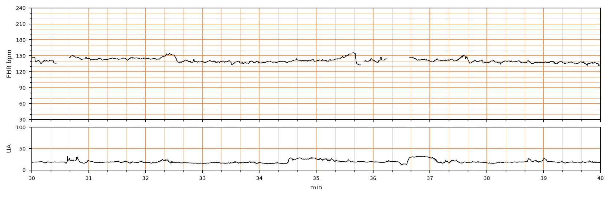

## 문제
A 29-year-old primigravid woman at 39 weeks' gestation is in the active phase of labor with continuous electronic fetal monitoring. Her pregnancy has been uncomplicated and membranes are intact. The tracing from minutes 30 to 40 of monitoring is shown. According to the NICHD three-tier system, which of the following best describes this tracing?

- A. Category II with fetal tachycardia
- B. Category III with absent variability and recurrent late decelerations
- C. Category I (normal tracing)
- D. Category II with minimal baseline variability
- E. Category II with recurrent variable decelerations

_Intrapartum fetal heart rate (upper) and uterine activity (lower), minutes 30–40 of monitoring; 3 cm/min, vertical lines = 1 min (CTU-UHB Intrapartum Cardiotocography Database, PhysioNet, ODC-BY 1.0; 4 Hz raw data, no smoothing)_

## 정답 및 해설
> 정답: C

- **정답 핵심**: The baseline fetal heart rate is about 140–145/min (normal range 110–160). Peak-to-trough fluctuation within 1-minute windows is about 7–10/min, i.e. moderate variability (6–25/min). There are no decelerations of any type; two brief rises toward 155–160/min are accelerations or short signal artefacts, and a brief gap around minute 36 is signal loss, not a deceleration. Normal baseline, moderate variability and no late or variable decelerations define Category I.
- **원리**: The three-tier NICHD system is built on <b>four elements read in order: baseline, variability, accelerations, decelerations</b>.  <b>Baseline</b> is the mean rate rounded to 5/min over a 10-minute window, excluding accelerations, decelerations and segments of marked variability; it must be present for at least 2 minutes. Here the trace sits at 140–145/min, inside 110–160/min.  <b>Variability</b> is the peak-to-trough amplitude of the irregular fluctuations in a 1-minute window: absent (undetectable), minimal (≤5), <b>moderate (6–25)</b>, marked (>25). Moderate variability reflects an <b>intact, oxygenated autonomic system</b> — the sympathetic and parasympathetic inputs continuously tugging the sinus node — and is the single most reassuring feature; its presence makes significant metabolic acidemia unlikely at that moment.  <b>Category I</b> requires <b>all</b> of: normal baseline, moderate variability, no late or variable decelerations (early decelerations and accelerations may be present or absent). <b>Category III</b> is absent variability plus recurrent late or variable decelerations or bradycardia, or a sinusoidal pattern. <b>Everything else is Category II</b> — an indeterminate group that calls for evaluation and continued surveillance, not immediate delivery.  <b>Why decelerations are classified by timing and shape</b> — early (gradual, nadir with contraction peak: head compression), late (gradual, nadir after the peak: uteroplacental insufficiency), variable (abrupt, ≥15/min for ≥15 s and <2 min: cord compression). None of these is present in this window; the short gaps are electrode signal loss.
- **비교**: <table><thead><tr><th style="width:28%">Category</th><th style="width:40%">Defining features</th><th>This tracing</th></tr></thead><tbody> <tr><td><b>Category I (answer)</b></td><td><b>baseline 110–160, moderate variability (6–25), no late/variable decelerations</b></td><td>baseline ≈140–145, variability ≈7–10, no decelerations</td></tr> <tr><td>Category II, minimal variability</td><td>amplitude ≤5/min in a 1-min window, other features normal</td><td>fluctuations are 7–10/min, i.e. above 5</td></tr> <tr><td>Category II, recurrent variable decelerations</td><td>abrupt drops ≥15/min lasting ≥15 s with ≥50 % of contractions</td><td>no drop below baseline; contractions are weak and infrequent</td></tr> <tr><td>Category II, tachycardia</td><td>baseline >160/min</td><td>baseline well under 160</td></tr> <tr><td>Category III</td><td>absent variability + recurrent late/variable decelerations or bradycardia; or sinusoidal</td><td>none of these</td></tr> </tbody></table> The <b>closest wrong answer is Category II with minimal variability</b>: a smoothed or compressed strip can make 7–10/min look flat. The 5/min cut-off is applied to the raw 1-minute peak-to-trough amplitude, and at 3 cm/min the small-square height (5/min) is the ruler.
- **오답 이유**:
  - (A) Fetal tachycardia is a baseline above 160/min for at least 10 minutes. The baseline here is about 140–145/min. This option would be correct only if the trace ran above 160/min throughout the window.
  - (B) Category III needs absent variability together with recurrent late or variable decelerations or bradycardia, or a sinusoidal pattern. This trace has moderate variability and no decelerations. This option would be correct only if the line were flat and dipping after each contraction.
  - (D) Minimal variability means peak-to-trough amplitude of 5/min or less within a 1-minute window. Measured against the 5/min grid this trace fluctuates 7–10/min. This option would be correct only if the line were nearly flat within each minute.
  - (E) Variable decelerations are abrupt drops of at least 15/min lasting at least 15 seconds, and 'recurrent' means with at least half of the contractions. No drop below baseline occurs in this window and contractions are weak. This option would be correct only if abrupt V-shaped dips accompanied most contractions.
- **함정**: Short gaps in the trace are signal loss, not decelerations — a deceleration is a continuous line that leaves the baseline and returns; a gap has no line at all.
- **학습목표**: 분만 중 태아심박동 기록의 기저선·변이도·감속을 읽어 NICHD 3단계 분류를 적용한다
- **근거·출처**: CTU-UHB raw data (4 Hz) — author measurement (2026-09-14): baseline ≈140–145/min, 1-min peak-to-trough ≈7–10/min, no decelerations, brief signal loss 35.8–36.6 min · Macones GA et al. The 2008 NICHD workshop report on electronic fetal monitoring (Obstet Gynecol 2008) · ACOG Practice Bulletin No. 106

## 출처
- CTU-UHB Intrapartum Cardiotocography Database (PhysioNet, ODC-BY 1.0) · record 1339 · Open Data Commons Attribution License v1.0 · https://opendatacommons.org/licenses/by/1-0/
