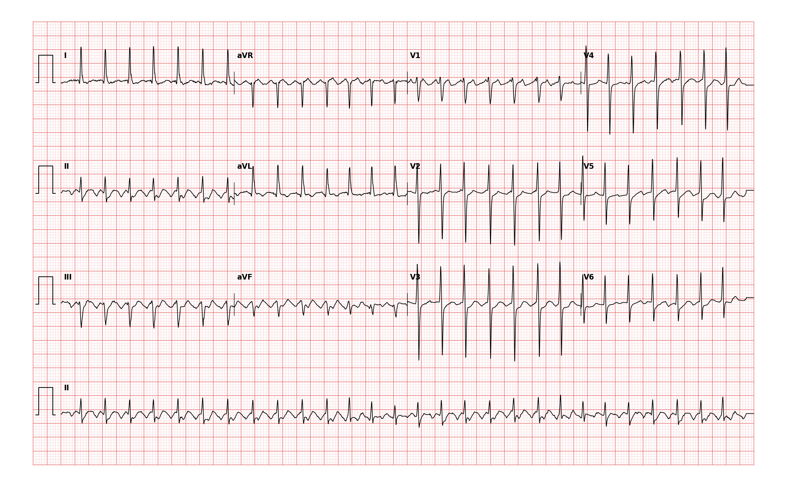

## 문제
63세 여자가 2시간 전부터 갑자기 시작된 두근거림으로 응급실에 왔다. 흉통이나 실신은 없었고 심장질환을 진단받은 적은 없다. 혈압 118/76 mmHg, 맥박 분당 약 165회로 규칙적이며 호흡곤란은 없다. 12유도 심전도는 그림과 같다. 가장 가능성 있는 진단은?

- A. 동성빈맥
- B. 심실빈맥
- C. 심방조동(2:1 방실전도)
- D. 방실결절 회귀성 빈맥
- E. 심방세동

_12유도 심전도, 25 mm/s · 10 mm/mV, 3×4 + II 리듬 스트립 (PTB-XL ECG dataset, PhysioNet, CC BY 4.0 — 원신호 그대로 작도)_

## 정답 및 해설
> 정답: C

- **정답 핵심**: QRS 는 좁고 RR 간격은 약 0.36초(≈165/분)로 규칙적이다. II·III·aVF 에서 QRS 사이에 등전위 구간 없이 이어지는 톱니 모양의 음성 심방파가 보이고, 리듬 스트립 중간에 RR 이 정확히 두 배(≈0.70초)로 늘어나는 곳이 있어 그 순간 전도비가 4:1 로 바뀐 것을 알 수 있다. 심방 박동수 약 330/분의 심방조동이 2:1 로 전도되는 소견이다.
- **원리**: 심방조동은 <b>우심방 안의 큰 회귀회로(대개 삼첨판 고리 주위, 하대정맥-삼첨판 협부를 지나는 반시계 방향)</b> 가 분당 <b>250~350회</b>로 돌면서 심방을 끊임없이 탈분극시키는 부정맥이다. 회로가 한 바퀴 돌 때마다 심방파가 하나 생기므로 심방파 사이에 <b>쉬는 구간(등전위선)이 없고</b>, 회로의 방향이 아래→위이면 II·III·aVF 에서 <b>음성의 톱니 모양(F파)</b>, V1 에서는 뾰족한 양성 파형이 된다.  <b>왜 심실은 150 부근인가</b> — 방실결절은 불응기가 길어 분당 300회를 다 통과시키지 못하고 <b>두 번에 한 번(2:1)</b>만 내려보낸다. 그래서 「규칙적인 좁은 QRS 빈맥이 정확히 150/분 부근(이 기록은 심방 ≈330 이라 ≈165)」이면 먼저 심방조동을 의심하라고 배운다. 방실결절이 순간적으로 더 막히면 4:1 이 되어 RR 이 <b>정확히 두 배</b>로 늘어나는데, 이 기록의 리듬 스트립 중간이 바로 그 자리다 — 회귀빈맥이라면 이렇게 「두 배」로 정확히 떨어지지 않는다.  <b>판독 순서</b> — ① QRS 폭(좁다 → 상심실성) ② RR 규칙성(규칙적 → 세동 제외) ③ QRS 사이 기저선(등전위 없이 톱니 → 조동; 편평하거나 역행 P → 회귀빈맥) ④ 박동수(150 부근 → 2:1 조동 의심). 확실치 않으면 아데노신·미주신경 자극으로 방실전도를 잠시 막아 F파를 드러낸다.
- **비교**: <table><thead><tr><th style="width:26%">진단</th><th style="width:38%">심전도의 갈림길</th><th>이 기록</th></tr></thead><tbody> <tr><td><b>심방조동 2:1(정답)</b></td><td><b>규칙적 좁은 QRS ≈150, QRS 사이 등전위 없는 톱니 F파(II·III·aVF 음성), 전도비 변화 시 RR 이 정수배</b></td><td>≈165/분, 하벽 유도 톱니, RR 두 배 구간 1회</td></tr> <tr><td>방실결절 회귀성 빈맥</td><td>규칙적 좁은 QRS 150~250, P 파가 QRS 안에 숨거나 QRS 끝에 가성 r′/s 로, <b>QRS 사이 기저선은 편평</b></td><td>기저선이 편평하지 않고 계속 물결침</td></tr> <tr><td>심방세동</td><td>RR <b>완전 불규칙</b>, 세동파는 모양·간격이 제각각</td><td>RR 이 일정</td></tr> <tr><td>동성빈맥</td><td>모든 QRS 앞에 정상 모양 P, 대개 <150, 서서히 오르내림</td><td>정상 P 없음, 갑작스러운 시작</td></tr> <tr><td>심실빈맥</td><td>QRS 폭 ≥0.12 s</td><td>QRS 좁음</td></tr> </tbody></table> <b>가장 가까운 오답은 방실결절 회귀성 빈맥</b> — 같은 「규칙적 좁은 QRS 빈맥」이고 박동수도 겹친다. QRS 사이의 <b>기저선이 계속 움직이는가(톱니)</b> 와 <b>RR 이 정확히 정수배로 변하는 순간이 있는가</b>가 갈림길이다. 둘 다 없으면 회귀빈맥, 둘 중 하나라도 있으면 조동을 먼저 둔다.
- **오답 이유**:
  - ① 동성빈맥은 모든 QRS 앞에 정상 모양의 P 파가 일정한 PR 로 있고 대개 150/분을 넘지 않으며 서서히 시작된다. 이 기록은 정상 P 대신 등전위 없는 톱니파가 이어지고 갑자기 시작됐다. 이 선지가 정답이 되려면 각 QRS 앞에 둥근 양성 P 파가 II 유도에서 보여야 한다.
  - ② 심실빈맥은 QRS 폭이 0.12초 이상으로 넓고 대개 방실해리·융합박동이 있다. 이 기록의 QRS 는 작은 칸 2칸 남짓으로 좁다. 이 선지가 정답이 되려면 QRS 가 큰 칸 3칸 이상으로 넓어야 한다.
  - ④ 방실결절 회귀성 빈맥은 QRS 사이 기저선이 편평하고 역행 P 파가 QRS 끝에 붙는다. 이 기록은 하벽 유도의 기저선이 톱니처럼 계속 물결치고 RR 이 두 배로 늘어나는 4:1 구간이 있다. 이 선지가 정답이 되려면 톱니 심방파가 없고 QRS 끝에 가성 r′ 이 보여야 한다.
  - ⑤ 심방세동은 RR 간격이 완전히 불규칙하고 세동파는 모양이 제각각이다. 이 기록의 RR 은 0.33~0.38초로 일정하고 심방파는 일정한 톱니다. 이 선지가 정답이 되려면 리듬 스트립의 RR 이 매 박동 달라야 한다.
- **함정**: 빈맥에서는 T 파와 F 파가 겹쳐 「P 파가 없다」고만 보고 회귀빈맥으로 넘어가기 쉽다. II·III·aVF 의 QRS 사이 기저선을 손가락으로 따라가 보면 평평한 구간이 없다는 것이 보인다.
- **학습목표**: 규칙적인 좁은 QRS 빈맥에서 하벽 유도의 톱니 모양 심방파를 읽어 2:1 전도 심방조동을 진단한다
- **근거·출처**: PTB-XL 기록 라벨 AFLT(2인 심장내과 검증) · 작성자 판독·계측(2026-09-15): RR 0.33~0.38 s(≈167/분), 스트립 중 RR 0.70 s 1회, II·III·aVF 등전위 없는 톱니 심방파, QRS 좁음 · 2015 ACC/AHA/HRS Guideline for the Management of Adult Patients With Supraventricular Tachycardia — atrial flutter 의 심전도 진단

## 출처
- PTB-XL ECG dataset v1.0.3 (PhysioNet, CC BY 4.0) · record 449 · Creative Commons Attribution 4.0 International · https://physionet.org/content/ptb-xl/1.0.3/LICENSE.txt
