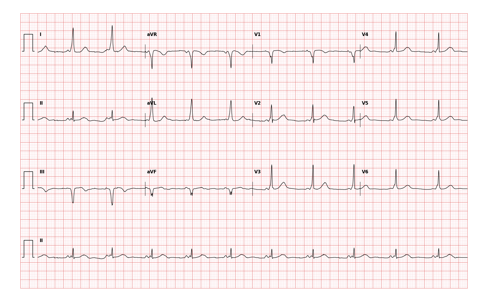

## 문제
A 44-year-old woman comes to the preoperative clinic before an elective laparoscopic myomectomy. She reports occasional brief episodes of rapid palpitations since her twenties that stop on their own; she has never had syncope. Blood pressure is 122/78 mm Hg and pulse is 60/min and regular. A 12-lead electrocardiogram obtained for the preoperative evaluation is shown. Which of the following is the most likely explanation for the abnormality on this tracing?

- A. Prior transmural infarction of the inferior wall
- B. An ectopic atrial pacemaker located near the atrioventricular junction
- C. An accessory pathway conducting atrial impulses directly to ventricular myocardium
- D. Delayed conduction through the right bundle branch
- E. Slowed conduction through the atrioventricular node

_12-lead ECG, 25 mm/s, 10 mm/mV, 3×4 + lead II rhythm strip (PTB-XL, PhysioNet, CC BY 4.0; raw signal, no filtering)_

## 정답 및 해설
> 정답: C

- **정답 핵심**: Every QRS is preceded by a sinus P wave, but the PR interval is short (about 0.10 s) and the QRS begins with a slurred, slowly rising initial segment — a delta wave — best seen in leads I, aVL and V2–V6, widening the QRS to about 0.12 s. The negative initial deflections in III and aVF are negative delta waves, not infarct Q waves. A short PR with a delta wave means part of the ventricle is being activated early by an accessory atrioventricular pathway that bypasses the AV node (ventricular pre-excitation).
- **원리**: In the normal heart the <b>fibrous atrioventricular rings insulate the atria from the ventricles</b>; the only electrical connection is the AV node–His bundle, and the AV node <b>deliberately delays</b> the impulse (this delay is the PR interval). An <b>accessory pathway (bundle of Kent)</b> is a strand of working myocardium that crosses the ring somewhere along the mitral or tricuspid annulus and conducts <b>without delay</b>.  <b>Why the PR is short</b> — the impulse reaches the ventricle through the pathway before the AV node has released it, so the QRS starts early.  <b>Why there is a delta wave</b> — the pre-excited region is activated <b>cell-to-cell through ordinary muscle</b>, not through the fast Purkinje network, so the first part of the QRS rises slowly (the delta wave). Then the normal His–Purkinje wavefront arrives and finishes the ventricle quickly; the QRS is a <b>fusion</b> of both, and its width depends on how much the pathway contributed.  <b>Why it matters</b> — the pathway and the AV node form a circuit for orthodromic re-entrant tachycardia (her palpitations), and if atrial fibrillation develops the pathway can conduct at very high rates because it lacks the node's decremental properties; AV-nodal blockers (verapamil, digoxin, adenosine in AF) can then be dangerous. Curative treatment is catheter ablation of the pathway. The pseudo-infarct Q waves in III and aVF are the <b>negative delta wave</b> of a pathway whose early activation moves away from the inferior leads.
- **비교**: <table><thead><tr><th style="width:30%">Mechanism</th><th style="width:36%">ECG signature</th><th>This tracing</th></tr></thead><tbody> <tr><td><b>Accessory pathway (answer)</b></td><td><b>PR &lt; 0.12 s + slurred delta wave + widened QRS, sinus P present</b></td><td>PR ≈ 0.10 s, delta in I/aVL/V2–V6, QRS ≈ 0.12 s</td></tr> <tr><td>Right bundle branch block</td><td>QRS ≥ 0.12 s with rSR′ in V1 and wide S in I/V6, <b>normal PR, terminal (not initial) slurring</b></td><td>V1 is negative, slurring is at the onset</td></tr> <tr><td>Slowed AV-nodal conduction</td><td>PR <b>prolonged</b> &gt; 0.20 s, normal QRS</td><td>PR is short, not long</td></tr> <tr><td>Prior inferior infarction</td><td>Q waves in II, III, aVF with <b>normal PR and a sharp QRS onset</b></td><td>the 'Q' is a slurred negative delta and PR is short</td></tr> <tr><td>Junctional/low atrial rhythm</td><td>inverted P in II with short PR but a <b>normal, narrow QRS</b></td><td>P is upright in II; QRS is widened with delta</td></tr> </tbody></table> The <b>closest wrong answer is prior inferior infarction</b>: negative delta waves in III and aVF imitate infarct Q waves. The discriminator is the <b>PR interval</b> — a Q wave from scar sits after a normal PR with a crisp onset; a negative delta wave starts early and slurs. Measure the PR before naming a Q wave.
- **오답 이유**:
  - (A) A prior inferior infarction leaves pathologic Q waves in II, III and aVF that follow a normal PR interval and begin sharply. The negative initial deflections here are slurred and start after a short PR — negative delta waves. This option would be correct only if the PR were normal and the QRS onset crisp.
  - (B) An ectopic atrial focus near the AV junction shortens the PR and inverts the P wave in II, but the ventricle is still activated through the His–Purkinje system, so the QRS stays narrow without a delta wave. This option would be correct only if the P wave were inverted in II and the QRS narrow.
  - (D) Right bundle branch block widens the QRS at its end (rSR′ in V1, broad terminal S in I and V6) and leaves the PR interval normal. Here the slurring is at the start of the QRS, V1 is negative, and the PR is short. This option would be correct only if the delay were terminal and V1 showed an rSR′ pattern.
  - (E) Slowed AV-nodal conduction produces a prolonged PR interval (first-degree AV block) with a normal QRS. This tracing has the opposite: a shortened PR. This option would be correct only if the PR exceeded 0.20 s with a sharp, narrow QRS.
- **함정**: Do not read III and aVF in isolation: a 'Q wave' with a short PR is a negative delta wave. The PR interval is the first thing to measure whenever a QRS looks odd.
- **학습목표**: 짧은 PR 간격과 델타파를 읽어 부전도로를 통한 심실 조기흥분의 기전을 설명한다
- **근거·출처**: PTB-XL record label WPW (two-cardiologist validated) · 작성자 판독(2026-09-15): sinus ≈61/min, PR ≈0.10 s, delta wave I·aVL·V2–V6, QRS ≈0.12 s, V1 negative, negative delta III·aVF · 2015 ACC/AHA/HRS Guideline for the Management of Adult Patients With SVT — pre-excitation and accessory-pathway tachycardias

## 출처
- PTB-XL ECG dataset v1.0.3 (PhysioNet, CC BY 4.0) · record 19920 · Creative Commons Attribution 4.0 International · https://physionet.org/content/ptb-xl/1.0.3/LICENSE.txt
