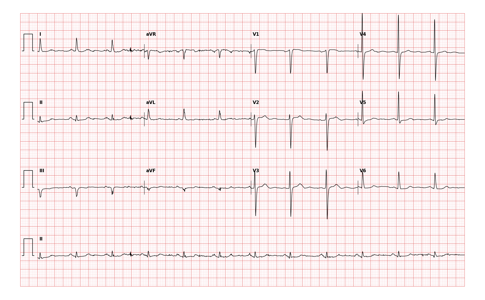

## 문제
A 78-year-old woman is evaluated before elective surgery for symptomatic pelvic organ prolapse. Two years ago she had an episode of chest pressure lasting several hours for which she did not seek care; she has had no chest pain or dyspnea since and walks 30 minutes daily. Blood pressure is 134/80 mm Hg and pulse is 70/min. A 12-lead electrocardiogram is shown. Which of the following best describes the findings on this tracing?

- A. ST-segment elevation in leads II, III and aVF indicating an acute inferior infarction
- B. Poor R-wave progression in leads V1–V4 indicating a prior anterior infarction
- C. Complete left bundle branch block
- D. First-degree atrioventricular block
- E. Pathologic Q waves in leads III and aVF consistent with a prior inferior infarction

_12-lead ECG, 25 mm/s, 10 mm/mV, 3×4 + lead II rhythm strip (PTB-XL, PhysioNet, CC BY 4.0; raw signal, no filtering)_

## 정답 및 해설
> 정답: E

- **정답 핵심**: Lead III shows a QS complex and lead aVF a q wave with a small r, both with inverted T waves; lead II has a low-amplitude r. The QRS is narrow, the ST segments are on the baseline, and R waves in V1–V4 grow normally. Q waves confined to the inferior leads without ST elevation, in a patient whose chest pain was two years ago, indicate an old (completed) inferior infarction — a fixed finding that changes the perioperative risk assessment but is not an acute event.
- **원리**: A <b>pathologic Q wave</b> is the electrical hole left by dead muscle: infarcted myocardium generates no depolarizing current, so the electrode facing it 'sees through' to the opposite wall depolarizing <b>away</b> from it, and the QRS begins with a negative deflection. By convention a Q wave is pathologic when it is <b>≥ 0.04 s wide or deeper than one quarter of the R wave</b>, in two contiguous leads (lead III alone can be a normal positional Q, so aVF and II must agree).  <b>Why the inferior leads</b> — II, III and aVF look at the diaphragmatic wall, which is usually supplied by the right coronary artery; scarring there writes Q waves in these leads.  <b>Old versus acute</b> — the timeline of infarction on the ECG is: hyperacute T → ST elevation (hours) → Q waves appear (hours to a day) → ST returns to baseline and T inverts (days) → <b>only the Q waves and T inversion persist</b> (weeks to permanent). A Q wave with an isoelectric ST segment is therefore a <b>completed infarction</b>, and the patient's two-year-old untreated chest episode is the clinical counterpart.  <b>Why it matters before anesthesia</b> — a prior infarction is one point of the Revised Cardiac Risk Index; it prompts a functional-capacity assessment (she walks 30 minutes, ≥4 METs) and continuation of secondary prevention rather than cancellation of surgery.
- **비교**: <table><thead><tr><th style="width:32%">Finding</th><th style="width:34%">Where to look</th><th>This tracing</th></tr></thead><tbody> <tr><td><b>Old inferior infarction (answer)</b></td><td><b>Q in III and aVF (± II), ST on baseline, T inverted</b></td><td>QS in III, q in aVF, no ST elevation</td></tr> <tr><td>Acute inferior STEMI</td><td>ST elevation ≥ 1 mm in II, III, aVF with reciprocal depression in aVL</td><td>ST segments are flat; aVL shows no reciprocal depression</td></tr> <tr><td>Prior anterior infarction</td><td>Q or absent r in V1–V4, R wave fails to grow</td><td>R wave increases normally from V1 to V4</td></tr> <tr><td>Left bundle branch block</td><td>QRS ≥ 0.12 s, broad notched R in V6, QS in V1</td><td>QRS is narrow</td></tr> <tr><td>First-degree AV block</td><td>PR &gt; 0.20 s</td><td>PR within normal limits where measurable</td></tr> </tbody></table> The <b>closest wrong answer is acute inferior infarction</b>: both involve the same three leads. The discriminator is the <b>ST segment</b> — elevated means acute, isoelectric with a Q wave means old. Check the ST segment against the TP baseline before deciding whether to call the catheterization laboratory.
- **오답 이유**:
  - (A) An acute inferior infarction shows ST-segment elevation in II, III and aVF with reciprocal ST depression in aVL, usually with ongoing chest pain. Here the ST segments lie on the baseline and the symptoms were two years ago. This option would be correct only if the J points in the inferior leads were elevated at least 1 mm.
  - (B) A prior anterior infarction produces Q waves or absent r waves in V1–V4 with poor R-wave progression. In this tracing the R wave grows normally across the precordial leads and the Q waves are inferior. This option would be correct only if V1–V3 showed QS complexes.
  - (C) Left bundle branch block widens the QRS to 0.12 s or more with broad, notched R waves in V5–V6 and a QS in V1. The QRS here is narrow. This option would be correct only if the QRS duration exceeded three small squares in every lead.
  - (D) First-degree AV block is a PR interval longer than 0.20 s with a normal QRS and no Q waves. The PR here is within normal limits where it can be measured, and the abnormality is in the QRS morphology. This option would be correct only if the PR exceeded one large square.
- **함정**: A QS in lead III alone can be a normal positional finding; the diagnosis rests on aVF agreeing with it. Confirm the second contiguous lead before labelling a patient with an old infarction.
- **학습목표**: 수술 전 심전도에서 하벽 유도의 병적 Q 파를 읽어 오래된 경색과 급성 경색을 구분한다
- **근거·출처**: PTB-XL record label IMI (two-cardiologist validated) · 작성자 판독(2026-09-15): ≈70/min, QS in III, q in aVF, low r in II, T inversion III·aVF, no ST elevation, narrow QRS; baseline noise present — rhythm not asked · Fourth Universal Definition of Myocardial Infarction (2018) — ECG criteria for prior MI (pathologic Q waves)

## 출처
- PTB-XL ECG dataset v1.0.3 (PhysioNet, CC BY 4.0) · record 10942 · Creative Commons Attribution 4.0 International · https://physionet.org/content/ptb-xl/1.0.3/LICENSE.txt
