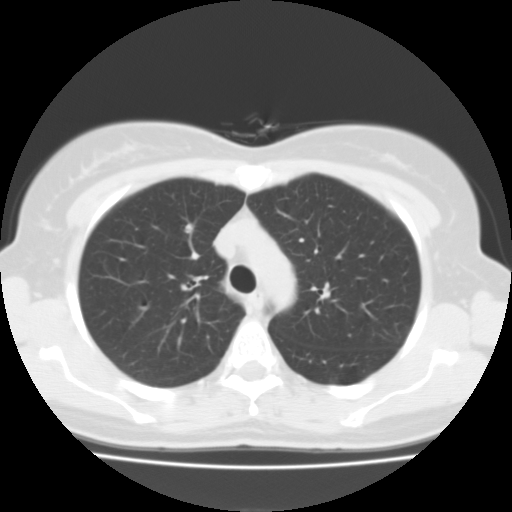

## 문제
A 60-year-old woman undergoes low-dose CT of the chest as part of a lung-cancer screening program. She has no cough, hemoptysis, or weight loss. An axial image of the chest at the level of the upper mediastinum (lung window) is shown; the trachea is seen as the round air-filled structure in the midline. Which of the following best identifies the broad soft-tissue structure that lies anterior to the trachea and sweeps to the left of it toward the left side of the vertebral body?

- A. Left brachiocephalic vein
- B. Pulmonary trunk
- C. Arch of the azygos vein
- D. Arch of the aorta
- E. Superior vena cava

_Axial chest CT, lung window, standard display orientation (patient's right on the viewer's left) (The Cancer Imaging Archive, CC BY 3.0; converted from DICOM with windowing only)_

## 정답 및 해설
> 정답: D

- **정답 핵심**: At this level the trachea is still a single round lumen (above the carina) and the mediastinum to its right is narrow, whereas a wide band of soft tissue starts in front of the trachea, passes along its left side and reaches the left anterolateral surface of the vertebral body. Only the arch of the aorta has this course: it rises from the heart anteriorly, arches backward over the left main bronchus and becomes the descending aorta on the left of the spine. The superior vena cava and azygos arch lie to the right of the trachea, the left brachiocephalic vein crosses only anteriorly and higher, and the pulmonary trunk lies below the arch.
- **원리**: The <b>arch of the aorta</b> begins behind the manubrium at the level of the <b>second right sternocostal joint</b>, runs <b>backward and to the left</b> in front of the trachea, passes over the left main bronchus, and ends at the <b>left side of the body of T4</b>, where it becomes the descending thoracic aorta. On an axial CT slice through the top of the arch this three-dimensional curve is caught as a <b>single broad band</b>: anterior to the trachea, then along its left side, then against the left anterolateral vertebral body.  <b>Why nothing else has this shape</b> — the great veins are on the <b>right</b>: the superior vena cava is a round structure right and anterior to the trachea, and the azygos vein arches forward over the right main bronchus to enter it (the azygos arch is the right-sided mirror of the aortic arch but is much smaller and sits at the level of the carina). The left brachiocephalic vein crosses <b>anterior</b> to the arch's branches, higher, from left to right, and never reaches the vertebral body. The pulmonary trunk is <b>inferior</b> to the arch, at the level of the carina and below, connected to the arch only by the ligamentum arteriosum.  <b>Why this matters clinically</b> — the left recurrent laryngeal nerve hooks under the arch at the ligamentum arteriosum (hoarseness in arch aneurysm or left hilar tumor), and the arch is what produces the 'aortic knob' on the frontal chest radiograph; on CT it is the landmark that separates the superior mediastinum from the middle mediastinum.
- **비교**: <table><thead><tr><th style="width:28%">Structure</th><th style="width:38%">Position relative to the trachea on axial CT</th><th>Level</th></tr></thead><tbody> <tr><td><b>Arch of the aorta (answer)</b></td><td><b>anterior → left of trachea → left anterolateral vertebral body, one continuous band</b></td><td>T3–T4 (upper edge of arch)</td></tr> <tr><td>Superior vena cava</td><td>round, <b>right</b> and anterior to the trachea</td><td>T2–T4, enters right atrium at T5</td></tr> <tr><td>Azygos arch</td><td>small, from posterior-right of trachea forward over the right main bronchus into the SVC</td><td>T4–T5 (carina)</td></tr> <tr><td>Left brachiocephalic vein</td><td>oblique band <b>anterior</b> to the arch vessels, crossing left → right</td><td>T2–T3, above the arch</td></tr> <tr><td>Pulmonary trunk</td><td>anterior-left, <b>below</b> the arch, bifurcates under the carina</td><td>T5–T6</td></tr> </tbody></table> The <b>closest wrong answer is the superior vena cava</b> — also a large mediastinal vessel next to the trachea. The discriminator is <b>side</b>: SVC is right, aortic arch is left. On any axial chest image, 'large vessel hugging the left of the trachea and spine' is the aorta; 'right of the trachea' is the caval–azygos system.
- **오답 이유**:
  - (A) The left brachiocephalic vein crosses the superior mediastinum from left to right in front of the arch's three branches, above the level of the arch itself, and does not extend back to the spine. This option would be correct only for an oblique anterior band on a slice above the arch.
  - (B) The pulmonary trunk lies below the aortic arch at the level of the carina and bifurcates into right and left pulmonary arteries; on a slice where the trachea is still a single lumen it is not yet in view. This option would be correct only on a lower slice showing the main bronchi.
  - (C) The arch of the azygos vein is a small vessel that curves forward over the right main bronchus to enter the superior vena cava, on the patient's right. This option would be correct only if the structure were a thin right-sided band at the level of the carina.
  - (E) The superior vena cava is a round structure to the right of and in front of the trachea, formed by the two brachiocephalic veins; it never reaches the left side of the vertebral body. This option would be correct only if the structure in question lay on the patient's right.
- **함정**: In a lung window every mediastinal structure is the same shade of white, so identification is by position and shape, not density. Fix the side first: left of the trachea belongs to the aorta.
- **학습목표**: 대동맥활 높이의 축상 흉부 CT 에서 기관과 대동맥활의 위치 관계를 읽는다
- **근거·출처**: TCIA LIDC-IDRI series (CC BY 3.0) — author reading (2026-09-15): arch-level slice, trachea above carina, broad band anterior→left of trachea to left anterolateral vertebral body = aortic arch; both lungs normal on this slice · Moore Clinically Oriented Anatomy — superior mediastinum: arch of the aorta, its relations to the trachea and left recurrent laryngeal nerve

## 출처
- LIDC-IDRI, The Cancer Imaging Archive (CC BY 3.0) · series …03408531 · Creative Commons Attribution 3.0 Unported · https://www.cancerimagingarchive.net/data-usage-policies-and-restrictions/
