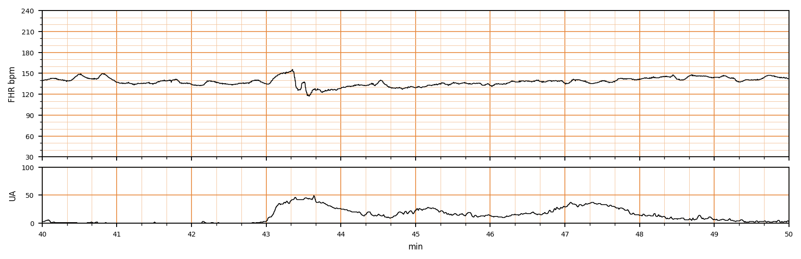

## 문제
33세 초산부가 임신 40주에 자연진통으로 입원하여 활동기 진통 중이며 지속 전자태아감시를 하고 있다. 임신 경과에 특이사항은 없었다. 감시 40~50분 구간의 태아심박동과 자궁수축 기록은 그림과 같다. 43분경 자궁수축과 함께 나타난 태아심박동 변화는?

- A. 후기감속(late deceleration)
- B. 지연감속(prolonged deceleration)
- C. 정현파형(sinusoidal pattern)
- D. 가변감속(variable deceleration)
- E. 조기감속(early deceleration)

_분만 중 태아심박동(위)과 자궁수축(아래), 감시 40~50분 구간; 3 cm/분, 세로선 = 1분 (CTU-UHB Intrapartum Cardiotocography Database, PhysioNet, ODC-BY 1.0 — 4 Hz 원자료, 평활화 없음)_

## 정답 및 해설
> 정답: D

- **정답 핵심**: 기저 태아심박동은 약 135~140/분이고 변이도는 중등도다. 43분의 자궁수축 중 심박동이 150 까지 잠깐 올랐다가(어깨, shoulder) 약 15초 만에 115~119/분까지 급격히 떨어지고 약 40초 뒤 기저선으로 돌아온다. 하강이 급격하고(시작~최저 30초 미만), 깊이 15/분 이상, 지속 15초 이상 2분 미만이며 어깨가 앞서는 V 자형이므로 가변감속이다. 이후 두 번의 수축에는 감속이 없어 반복성은 아니다.
- **원리**: NICHD 정의에서 감속은 <b>하강의 속도</b>와 <b>수축과의 시간 관계</b> 두 축으로 나눈다. 시작에서 최저까지 <b>30초 미만이면 「급격(abrupt)」</b>, 30초 이상이면 「점진(gradual)」이다. <b>가변감속</b>은 급격한 하강이 ≥15/분, ≥15초, &lt;2분 지속되는 것으로 수축과의 시간 관계는 <b>일정하지 않아도</b> 된다. <b>조기감속</b>과 <b>후기감속</b>은 모두 점진적 하강이며, 최저점이 수축의 최고점과 일치하면 조기, 최고점보다 늦으면 후기다. <b>지연감속</b>은 하강 방식과 무관하게 <b>2분 이상 10분 미만</b> 지속되는 것이다.  <b>왜 모양이 다른가 — 기전</b> — 가변감속은 <b>제대 압박</b>이다. 제대정맥이 먼저 눌리면 정맥환류가 줄어 반사성 빈맥(앞 어깨)이 생기고, 이어 제대동맥이 눌리면 태아 혈압이 갑자기 올라 <b>압력수용체 → 미주신경</b> 반사로 심박이 급격히 떨어진다. 신경 반사라서 <b>빠르고(V 자)</b>, 압박이 풀리면 곧 회복되며 다시 어깨가 나타난다. 조기감속은 <b>태아 머리 압박</b>에 의한 미주 반사로 수축의 거울상처럼 완만하다. 후기감속은 <b>자궁태반 관류 저하 → 태아 저산소 → 화학수용체</b> 반사이므로 수축이 최고점을 지난 뒤에야 나타나고 완만하게 회복된다 — 그래서 후기감속만이 「산소 부족」의 직접 신호다.  <b>이 기록의 판정</b> — 43.2분의 짧은 상승(어깨) → 43.35분부터 급강하 → 43.6~43.9분 최저(기저 대비 ≈20~25/분) → 44.0분 회복. 급격·15초 이상·2분 미만 = 가변감속. 한 번뿐이고 변이도가 유지되므로 Category II 의 「간헐적 가변감속」에 해당하며, 체위 변경과 관찰로 충분하다.
- **비교**: <table><thead><tr><th style="width:22%">감속</th><th style="width:20%">하강 속도</th><th style="width:26%">수축과의 관계</th><th>기전 · 이 기록</th></tr></thead><tbody> <tr><td><b>가변감속(정답)</b></td><td><b>급격(&lt;30초), V 자, 어깨 동반</b></td><td>일정하지 않음</td><td>제대 압박 · <b>43.35분 15초 만에 최저</b></td></tr> <tr><td>조기감속</td><td>점진(≥30초), 완만한 U 자</td><td>최저 = 수축 최고점, 거울상</td><td>머리 압박 · 이 기록은 하강이 너무 빠름</td></tr> <tr><td>후기감속</td><td>점진(≥30초)</td><td>시작·최저·회복이 모두 수축보다 늦음</td><td>자궁태반 관류 저하 · 여기선 급격 하강이라 제외</td></tr> <tr><td>지연감속</td><td>무관</td><td>≥2분 ~ &lt;10분 지속</td><td>이 기록은 ≈40초</td></tr> <tr><td>정현파형</td><td>감속 아님</td><td>3~5회/분의 매끈한 사인파, 변이도 없음</td><td>여기선 변이도 정상</td></tr> </tbody></table> <b>가장 가까운 오답은 후기감속</b> — 이 감속의 최저점이 수축 최고점(43.3~43.6분)보다 약간 늦어 「늦게 온다」고만 보면 후기로 읽는다. 갈림길은 <b>하강 속도</b>다: 후기감속은 완만하게 내려가지만 이 기록은 15초 만에 20/분 이상 떨어진다. 시간 관계보다 <b>모양(급격 vs 점진)</b>을 먼저 본다.
- **오답 이유**:
  - ① 후기감속은 완만하게 내려가 최저점이 수축 최고점보다 늦고 회복도 느리며 대개 수축마다 반복된다. 이 기록은 하강이 급격하고 이후 두 수축에는 감속이 없다. 이 선지가 정답이 되려면 하강이 30초 이상 걸리고 매 수축 뒤에 되풀이돼야 한다.
  - ② 지연감속은 하강 방식과 무관하게 2분 이상 10분 미만 지속되는 감속이다. 이 감속은 약 40초 만에 기저선으로 돌아왔다. 이 선지가 정답이 되려면 심박동이 2분 넘게 기저선 아래에 머물러야 한다.
  - ③ 정현파형은 분당 3~5회의 매끈한 사인파가 변이도 없이 지속되는 것으로 태아 빈혈·저산소의 징후다. 이 기록은 변이도가 유지되고 단발 감속만 있다. 이 선지가 정답이 되려면 기저선 자체가 규칙적인 파도 모양이어야 한다.
  - ⑤ 조기감속은 30초 이상에 걸쳐 완만하게 내려가 수축의 최고점과 최저점이 일치하는 거울상이다. 이 기록은 15초 만에 20/분 이상 급격히 떨어지고 어깨가 앞선다. 이 선지가 정답이 되려면 하강이 수축 곡선을 뒤집은 듯 완만해야 한다.
- **함정**: 「수축보다 늦게 나타났으니 후기감속」이라고 시간 관계만 보면 틀린다. 후기·조기는 「점진적」이 전제이고, 급격히 떨어지면 시점과 무관하게 가변감속이다.
- **학습목표**: 분만 중 태아심박동 기록에서 급격한 하강과 회복을 읽어 가변감속을 다른 감속과 구분한다
- **근거·출처**: CTU-UHB 원자료(4 Hz) — 작성자 계측(2026-09-15): 기저 ≈135~140, 43.2분 어깨 ≈150, 43.35분 급강하(≈15초) 최저 ≈115~119, 44.0분 회복, 지속 ≈40초, 이후 수축에 감속 없음 · Macones GA et al. The 2008 NICHD workshop report on electronic fetal monitoring (Obstet Gynecol 2008) — 감속의 정의(급격 vs 점진, 30초 기준) · ACOG Practice Bulletin No. 106: Intrapartum Fetal Heart Rate Monitoring (2009)

## 출처
- CTU-UHB Intrapartum Cardiotocography Database (PhysioNet, ODC-BY 1.0) · record 1245 · Open Data Commons Attribution License v1.0 · https://opendatacommons.org/licenses/by/1-0/
