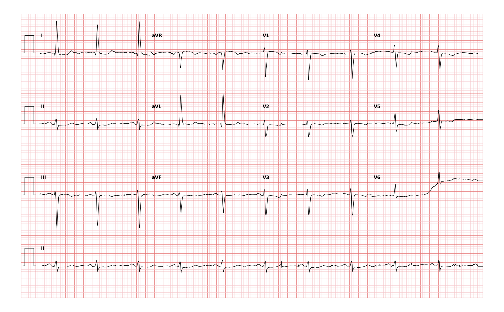

## 문제
64세 여자가 자궁내막암으로 자궁절제술을 받기 위해 수술 전 평가를 받고 있다. 15년 전부터 고혈압으로 약을 먹었으나 최근 2년은 불규칙하게 복용했다. 흉통이나 호흡곤란은 없다. 혈압 168/98 mmHg, 맥박 분당 64회로 규칙적이다. 12유도 심전도는 그림과 같다. 가장 가능성 있는 심전도 진단은?

- A. 완전 좌각차단
- B. 오래된 전벽 심근경색
- C. 정상 심전도
- D. 좌심실비대
- E. 우심실비대

_12유도 심전도, 25 mm/s · 10 mm/mV, 3×4 + II 리듬 스트립 (PTB-XL ECG dataset, PhysioNet, CC BY 4.0 — 원신호 그대로 작도)_

## 정답 및 해설
> 정답: D

- **정답 핵심**: 동율동이고 QRS 는 좁다. 사지유도의 R 파가 매우 크다 — I 유도 R 약 18 mm, aVL 유도 R 약 17 mm(기준 ≥ 11 mm), III 유도 S 약 19 mm 로 R I + S III 가 약 37 mm(기준 ≥ 25 mm)다. I 양성·aVF 음성이므로 좌축편위가 동반된다. 가슴유도는 S V1 + R V5 가 약 21 mm 로 Sokolow-Lyon 기준에는 못 미치지만, R aVL + S V3 가 약 28 mm 로 Cornell 기준(여자 > 20 mm)을 충족한다. 오래 조절되지 않은 고혈압 환자에서 사지유도 전압 증가와 좌축편위는 좌심실비대의 소견이다.
- **원리**: 좌심실비대는 <b>압력 부하(고혈압·대동맥판협착)</b>에 대한 심근의 적응으로, 근세포가 굵어져 심실벽이 두꺼워진다. 심근 질량이 늘면 탈분극 전류의 총량이 커져 <b>좌심실을 향하는 유도의 R 파가 커지고, 반대편 유도의 S 파가 깊어진다</b>. 이것이 모든 전압 기준의 원리다.  <b>왜 이 환자는 가슴유도가 아니라 사지유도에서 크게 보이는가</b> — 전압 기준은 심장의 <b>전기축이 어디를 향하는가</b>에 따라 잡히는 유도가 달라진다. 축이 왼쪽·위로 돌아가 있으면(좌축편위) 벡터가 aVL·I 를 향해 그 유도의 R 이 커지고 III·aVF 에 깊은 S 를 만든다. 이때 V5·V6 는 벡터와 각도가 커 R 이 작게 잡혀 Sokolow-Lyon(S V1 + R V5/V6 ≥ 35 mm)이 <b>미달</b>일 수 있다. 그래서 여러 기준을 함께 본다 — <b>aVL R ≥ 11 mm</b>, <b>R I + S III ≥ 25 mm</b>, <b>Cornell(R aVL + S V3, 남 &gt; 28 mm·여 &gt; 20 mm)</b>. 하나만 충족해도 전압 기준은 양성이고, 좌축편위·좌심방 확장·ST-T 변형(strain)이 있으면 특이도가 더 오른다.  <b>왜 수술 전에 중요한가</b> — 심전도 좌심실비대는 심장초음파로 확인할 대상이며, 이완기 기능장애와 관상동맥 예비능 감소를 시사해 마취 중 저혈압·빈맥에 취약하다. 혈압을 조절한 뒤 수술을 계획하고, 진단이 확실치 않으면 심장초음파로 벽 두께를 잰다. 전압 기준의 <b>민감도는 낮고 특이도는 높다</b> — 기준을 넘으면 비대일 가능성이 높지만, 기준 미달이 비대를 배제하지는 않는다.
- **비교**: <table><thead><tr><th style="width:26%">진단</th><th style="width:40%">심전도의 갈림길</th><th>이 기록</th></tr></thead><tbody> <tr><td><b>좌심실비대(정답)</b></td><td><b>aVL R ≥ 11 mm, R I + S III ≥ 25 mm, Cornell 충족, 좌축편위, QRS 좁음</b></td><td>aVL 17 mm, R I + S III 37 mm, Cornell 28 mm</td></tr> <tr><td>우심실비대</td><td>우축편위, V1 에 우세 R(R/S &gt; 1), V5·V6 깊은 S</td><td>좌축편위, V1 은 rS</td></tr> <tr><td>완전 좌각차단</td><td>QRS ≥ 0.12 s, V5·V6 넓고 파인 R, V1 QS</td><td>QRS 좁음</td></tr> <tr><td>오래된 전벽 심근경색</td><td>V1~V4 QS 또는 R 파 진행 불량</td><td>V1~V3 r 파가 있고 점차 커짐</td></tr> <tr><td>정상 심전도</td><td>모든 전압 기준 미달, 정상 축</td><td>사지유도 전압 초과, 좌축편위</td></tr> </tbody></table> <b>가장 가까운 오답은 「정상 심전도」</b> — 가슴유도의 R 이 크지 않아 Sokolow-Lyon 만 재면 정상으로 넘긴다. 갈림길은 <b>사지유도(aVL·I·III)를 쟀는가</b>다. 좌축편위가 있으면 전압이 사지유도로 옮겨간다는 것을 알면 반대 방향으로 물어도(「Sokolow 만 미달인 좌축편위 기록」) 대응된다.
- **오답 이유**:
  - ① 완전 좌각차단은 QRS 폭이 0.12초 이상으로 넓고 V5·V6 에 넓고 파인 R, V1 에 QS 가 있다. 이 기록의 QRS 는 작은 칸 2~3칸으로 좁다. 이 선지가 정답이 되려면 QRS 가 큰 칸 3칸 이상이어야 한다.
  - ② 오래된 전벽 심근경색은 V1~V4 에 QS 나 R 파 진행 불량을 남긴다. 이 기록은 V1 부터 작은 r 이 있고 V4 이후 R 이 커진다. 이 선지가 정답이 되려면 V1~V3 에서 R 파가 사라지고 QS 형이 보여야 한다.
  - ③ 정상 심전도는 전압 기준을 하나도 넘지 않고 축이 정상이어야 한다. 이 기록은 aVL R 17 mm 와 R I + S III 37 mm 로 사지유도 기준을 넘고 좌축편위가 있다. 이 선지가 정답이 되려면 aVL R 이 11 mm 미만이고 aVF 가 양성이어야 한다.
  - ⑤ 우심실비대는 우축편위와 V1 의 우세한 R 파, V5·V6 의 깊은 S 파로 나타난다. 이 기록은 좌축편위에 V1 이 rS 형이다. 이 선지가 정답이 되려면 I 유도가 음성이고 V1 의 R 이 S 보다 커야 한다.
- **함정**: 가슴유도만 보고 「전압이 크지 않다」고 넘기기 쉽다. 좌축편위가 있으면 aVL 과 I 를 먼저 재고, R I + S III 를 더해 본다.
- **학습목표**: 사지유도 전압 기준(aVL ≥ 11 mm, R I + S III ≥ 25 mm)과 좌축편위로 좌심실비대를 진단한다
- **근거·출처**: PTB-XL 기록 라벨 LVH(2인 심장내과 검증) · 작성자 계측(2026-09-16, 화소 기반): R I 17.8 mm, R aVL 17.0 mm, S III 18.8 mm, S V1 14.7 mm, R V5 6.6 mm, S V3 11.5 mm, I 양성·aVF 음성 · Hancock EW et al. AHA/ACCF/HRS Recommendations for the Standardization and Interpretation of the ECG Part V: Electrocardiogram Changes Associated With Cardiac Chamber Hypertrophy (2009) — 전압 기준(Sokolow-Lyon, Cornell, 사지유도)

## 출처
- PTB-XL ECG dataset v1.0.3 (PhysioNet, CC BY 4.0) · record 18353 · Creative Commons Attribution 4.0 International · https://physionet.org/content/ptb-xl/1.0.3/LICENSE.txt
