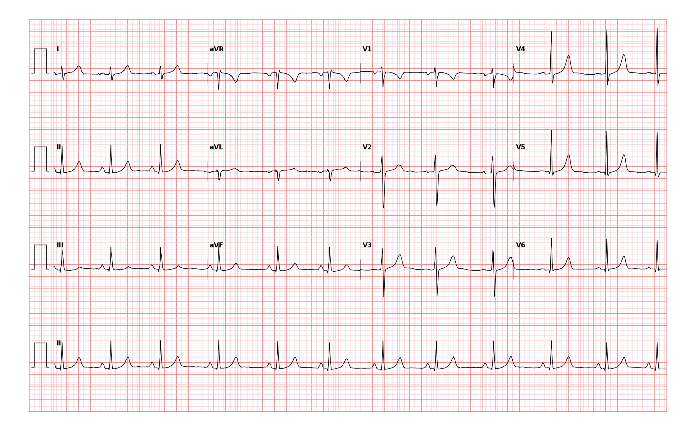

## 문제
24세 여자가 3주 전부터 긴장할 때 가슴이 두근거려 왔다. 증상은 몇 초에서 1분 안에 저절로 사라지고 실신·흉통·호흡곤란은 없다. 커피를 하루 3잔 마신다. 혈압 112/70 mmHg, 맥박 분당 76회로 규칙적이며 심잡음은 없다. 갑상샘기능검사와 혈색소는 정상이다. 12유도 심전도는 그림과 같다. 심전도 판독으로 가장 적절한 것은?

- A. 1도 방실차단
- B. 심실 조기흥분(WPW)
- C. 정상 동율동, 정상 축, 정상 간격
- D. 좌심실비대
- E. 우각차단

_12유도 심전도, 25 mm/s · 10 mm/mV, 3×4 + II 리듬 스트립 (PTB-XL ECG dataset, PhysioNet, CC BY 4.0 — 원신호 그대로 작도)_

## 정답 및 해설
> 정답: C

- **정답 핵심**: 모든 QRS 앞에 정상 모양의 P 파가 일정한 PR(약 0.14~0.16초)로 있고 심박수 약 75/분, QRS 는 좁으며 I·II·aVF 모두 양성이라 축은 정상(약 +70°)이다. V4·V5 의 R 이 17~18 mm 로 커 보이지만 S V1 + R V5 는 약 23 mm(< 35 mm), R aVL + S V3 는 약 13 mm(< 20 mm) 로 어느 전압 기준도 넘지 않는다. 델타파·넓은 QRS·PR 연장이 없다. 젊고 마른 사람에게 흔한 정상 심전도다.
- **원리**: 심전도 판독은 <b>리듬 → 심박수 → 축 → 간격(PR·QRS·QT) → 전압 → ST-T</b> 의 순서로 한다. 정상이라고 결론을 내리려면 각 단계에서 이상이 없음을 <b>적극적으로</b> 확인해야 한다 — 「눈에 띄는 것이 없다」와 「정상」은 다르다.  <b>왜 젊은 여자의 V4·V5 R 파가 커 보이는가</b> — 가슴벽이 얇고 심장이 전극에 가까우면 가슴유도 전압이 크게 잡힌다. 그래서 전압 기준은 <b>합(S V1 + R V5/V6 ≥ 35 mm)</b> 으로 정하고, 35세 미만에서는 특이도가 낮아 전압만으로 비대를 말하지 않는다. Cornell 기준은 성별 차이를 두어 여자는 <b>R aVL + S V3 &gt; 20 mm</b>다. 이 기록은 둘 다 미달이다.  <b>정상 축의 근거</b> — I 과 aVF 가 모두 양성이면 축은 0~+90° 안에 있다. II 가 가장 크고 III 도 양성이므로 +60~+80° 부근의 <b>수직 축</b>이며 젊고 마른 사람에게 흔하다.  <b>간격</b> — PR 0.12~0.20 s, QRS &lt; 0.12 s, QTc &lt; 0.46 s(여자)를 확인한다. 이 기록은 모두 정상 범위다. 델타파(QRS 시작부의 완만한 상승)가 없고 PR 이 짧지 않으므로 조기흥분도 아니다.  <b>임상적 의미</b> — 두근거림의 원인 검색에서 정상 안정 심전도와 정상 진찰·갑상샘기능·혈색소는 구조적 심장질환과 전도 이상의 가능성을 크게 낮춘다. 증상이 짧고 자연 소실되며 실신이 없으면 카페인 감량과 안심으로 시작하고, 증상이 잦거나 지속되면 활동 심전도로 증상-리듬 대응을 확인한다.
- **비교**: <table><thead><tr><th style="width:26%">판독</th><th style="width:40%">필요한 소견</th><th>이 기록</th></tr></thead><tbody> <tr><td><b>정상(정답)</b></td><td><b>동율동, 정상 축, PR·QRS·QT 정상, 전압 기준 미달, ST-T 정상</b></td><td>모두 충족</td></tr> <tr><td>좌심실비대</td><td>S V1 + R V5/V6 ≥ 35 mm 또는 R aVL ≥ 11 mm 또는 Cornell(여 &gt; 20 mm)</td><td>23 mm · 1.6 mm · 13 mm — 모두 미달</td></tr> <tr><td>우각차단</td><td>QRS ≥ 0.12 s, V1 rSR′, I·V6 넓은 S</td><td>QRS 좁음, V1 rS</td></tr> <tr><td>1도 방실차단</td><td>PR &gt; 0.20 s(큰 칸 1칸 초과)</td><td>PR 약 0.15 s</td></tr> <tr><td>심실 조기흥분</td><td>PR &lt; 0.12 s + 델타파 + QRS 넓어짐</td><td>PR 정상, QRS 시작이 날카로움</td></tr> </tbody></table> <b>가장 가까운 오답은 좌심실비대</b> — V4·V5 의 R 이 크게 보인다. 갈림길은 <b>기준을 실제로 더해 보았는가</b>다. 35 mm 와 20 mm 라는 숫자를 대면 정상이고, 반대로 R aVL 이 11 mm 를 넘거나 합이 35 mm 를 넘는 기록이 나오면 비대로 읽는다.
- **오답 이유**:
  - ① 1도 방실차단은 PR 간격이 0.20초(큰 칸 1칸)를 넘는다. 이 기록의 PR 은 약 0.15초로 정상이다. 이 선지가 정답이 되려면 P 파 시작에서 QRS 시작까지가 큰 칸 1칸을 넘어야 한다.
  - ② 심실 조기흥분은 짧은 PR(< 0.12초)과 QRS 시작부의 완만한 델타파, 넓어진 QRS 가 특징이다. 이 기록은 PR 이 정상이고 QRS 가 날카롭게 시작한다. 이 선지가 정답이 되려면 PR 이 작은 칸 3칸 미만이고 델타파가 보여야 한다.
  - ④ 좌심실비대는 S V1 + R V5/V6 ≥ 35 mm, R aVL ≥ 11 mm, Cornell(여자 > 20 mm) 중 하나를 넘어야 한다. 이 기록은 약 23 mm, 1.6 mm, 13 mm 로 모두 미달이며 젊은 여자의 가슴유도 전압은 원래 크게 잡힌다. 이 선지가 정답이 되려면 합이 35 mm 를 넘거나 좌축편위·strain 이 동반돼야 한다.
  - ⑤ 우각차단은 QRS 가 0.12초 이상 넓고 V1 에 rSR′, I·V6 에 넓은 S 가 있다. 이 기록의 QRS 는 좁고 V1 은 rS 형이다. 이 선지가 정답이 되려면 V1 에 토끼귀 모양의 두 번째 R′ 이 보여야 한다.
- **함정**: 「R 파가 크니 비대」라고 눈대중으로 판단하면 틀린다. 젊은 여자의 가슴유도 전압은 정상적으로 크며, 반드시 기준값을 더해서 확인한다.
- **학습목표**: 젊은 여자의 정상 심전도를 전압·축·간격 기준으로 판독하여 좌심실비대와 구분한다
- **근거·출처**: PTB-XL 기록 라벨 NORM(2인 심장내과 검증) · 작성자 계측(2026-09-16, 화소 기반): RR ≈0.80 s(≈75/분), S V1 6.1 mm, R V4 18.3 mm, R V5 16.9 mm, R aVL 1.6 mm, S V3 11.5 mm, I·II·aVF 양성 · Hancock EW et al. AHA/ACCF/HRS Recommendations … Part V (2009) — 좌심실비대 전압 기준과 젊은 연령·성별의 영향

## 출처
- PTB-XL ECG dataset v1.0.3 (PhysioNet, CC BY 4.0) · record 2040 · Creative Commons Attribution 4.0 International · https://physionet.org/content/ptb-xl/1.0.3/LICENSE.txt
