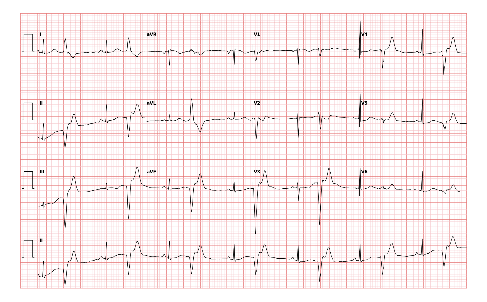

## 문제
A 36-year-old woman at 22 weeks' gestation comes to the physician because of a 2-week history of a 'skipped' or 'thumping' sensation in her chest that is most noticeable when she lies down at night. She has not had syncope, chest pain, or dyspnea. Her pregnancy has been uncomplicated. Pulse is irregular. Blood pressure is 108/66 mm Hg. A 12-lead electrocardiogram is shown. Which of the following best describes the rhythm on this tracing?

- A. Second-degree atrioventricular block with 2:1 conduction
- B. Sinus rhythm with a premature ventricular complex after every sinus beat (ventricular bigeminy)
- C. Sinus rhythm with second-degree atrioventricular block, Mobitz type I, with 3:2 conduction
- D. Atrial fibrillation with a slow ventricular response
- E. Sinus rhythm with premature atrial complexes conducted with a narrow QRS (atrial bigeminy)

_12-lead ECG, 25 mm/s, 10 mm/mV, 3×4 + lead II rhythm strip (PTB-XL, PhysioNet, CC BY 4.0; raw signal, no filtering)_

## 정답 및 해설
> 정답: B

- **정답 핵심**: The tracing shows pairs of beats separated by a pause. In every pair the first beat has a preceding P wave and a narrow QRS (a sinus beat); the second comes early, has a wide, bizarre QRS of about 0.14–0.16 s with a T wave pointing the opposite way, and is followed by a compensatory pause. A premature wide complex that follows every sinus beat with a fixed coupling interval is ventricular bigeminy. Grouped beating from Wenckebach block would show narrow, identical QRS complexes with progressively lengthening PR intervals, and atrial fibrillation would have no P waves and an irregularly irregular rhythm.
- **원리**: A <b>premature ventricular complex (PVC)</b> arises from a focus in ventricular muscle or the distal Purkinje network. Because it does not travel down the His–Purkinje system, activation spreads <b>cell to cell</b>, so the QRS is <b>wide (≥ 0.12 s) and bizarre</b>, and repolarization follows the same abnormal path, giving a <b>T wave opposite in direction to the QRS</b> (discordant). It is not preceded by a premature P wave. The sinus node usually keeps beating undisturbed, so the next sinus P wave falls into the refractory ventricle and is blocked, producing a <b>full compensatory pause</b>: the interval from the sinus beat before the PVC to the sinus beat after it equals two sinus cycles.  <b>Why 'bigeminy'</b> — when a PVC follows every sinus beat with the same coupling interval the rhythm is grouped in pairs: sinus–PVC–pause, sinus–PVC–pause. The patient feels the pause and the forceful post-pause beat as a 'skip' or 'thump'. Palpated pulse rate may be half the electrical rate because the early beat ejects little blood.  <b>Why pregnancy</b> — plasma volume, heart rate and sympathetic tone rise, and PVCs become more frequent or first noticed. In a structurally normal heart they are benign; management is reassurance, removing caffeine and stimulants, and a beta-blocker only for intolerable symptoms. Echocardiography is reasonable when PVCs are very frequent (&gt; 10 % of beats) to exclude structural disease.  <b>Ventricular versus aberrant supraventricular origin</b> — a premature atrial complex conducted with bundle-branch aberrancy can also be wide, but it is preceded by a premature P wave (often hidden in the previous T), usually shows a right-bundle pattern, and the pause after it is non-compensatory. Neither feature is present here, so a ventricular origin is the best reading; the clinical management is the same either way.
- **비교**: <table><thead><tr><th style="width:32%">Rhythm</th><th style="width:38%">ECG signature</th><th>This tracing</th></tr></thead><tbody> <tr><td><b>Ventricular bigeminy (answer)</b></td><td><b>sinus beat → early wide bizarre QRS with discordant T, fixed coupling, compensatory pause</b></td><td>every second beat wide (≈0.15 s), pause after it</td></tr> <tr><td>Mobitz I with 3:2 conduction</td><td>grouped beats, but <b>all QRS narrow and identical</b>, PR lengthens, a P wave is dropped</td><td>second beat is wide and different</td></tr> <tr><td>Atrial fibrillation</td><td>no P waves, irregularly irregular RR, QRS all alike</td><td>P waves before sinus beats, regular pairs</td></tr> <tr><td>Atrial bigeminy (normally conducted)</td><td>premature P wave, <b>narrow QRS</b> identical to sinus, non-compensatory pause</td><td>premature beat is wide</td></tr> <tr><td>2:1 AV block</td><td>slow regular rhythm, two P waves per QRS, no premature beats</td><td>beats come in pairs with early second beat</td></tr> </tbody></table> The <b>closest wrong answer is 3:2 Wenckebach</b>: both produce grouped beating in pairs with a pause. The discriminator is the <b>morphology of the second beat</b> — in Wenckebach every QRS is conducted from above and looks the same; in bigeminy the second beat is early and wide. Look at the QRS shapes before counting P waves.
- **오답 이유**:
  - (A) Second-degree AV block with 2:1 conduction gives a slow, regular rhythm with two P waves for each QRS and no premature beats. This tracing has an early wide beat after each sinus beat, not a dropped beat. This option would be correct only if the rhythm were regular and slow with a non-conducted P wave between beats.
  - (C) Mobitz type I block with 3:2 conduction also gives pairs of beats and a pause, but every QRS is conducted through the AV node and is narrow and identical, and the PR interval lengthens before the dropped beat. Here the second beat of each pair is wide and bizarre. This option would be correct only if all QRS complexes were narrow and a P wave without a QRS were seen at each pause.
  - (D) Atrial fibrillation has no organized P waves and an irregularly irregular ventricular response with uniform QRS morphology. This tracing shows P waves before the narrow beats and a repeating pair pattern. This option would be correct only if the baseline showed fibrillatory waves and no two RR intervals were alike.
  - (E) Atrial bigeminy conducted normally produces a premature narrow QRS identical to the sinus QRS, preceded by an early, often abnormal P wave, with a non-compensatory pause. The premature beats here are wide with discordant T waves and no premature P. This option would be correct only if the early beats were narrow.
- **함정**: Grouped beating has two common causes: a premature beat after every sinus beat, or Wenckebach block. Decide by the shape of the second beat, not by the pause — a wide, early, different-looking QRS means an ectopic beat.
- **학습목표**: 동성 박동마다 조기·넓은 QRS 가 따라오는 이단맥을 읽고 군집 박동의 다른 원인(Wenckebach)과 구분한다
- **근거·출처**: PTB-XL record label BIGU (bigeminal pattern; two-cardiologist validated) · 작성자 판독(2026-09-16): sinus beat with P → premature wide QRS ≈0.14–0.16 s, discordant T, fixed coupling ≈0.5 s, compensatory pause; effective rate ≈83/min · 2017 AHA/ACC/HRS Guideline for Management of Patients With Ventricular Arrhythmias — premature ventricular complexes in structurally normal hearts · Surawicz B, Knilans TK. Chou's Electrocardiography in Clinical Practice — ventricular premature beats, bigeminy, compensatory pause

## 출처
- PTB-XL ECG dataset v1.0.3 (PhysioNet, CC BY 4.0) · record 16361 · Creative Commons Attribution 4.0 International · https://physionet.org/content/ptb-xl/1.0.3/LICENSE.txt
