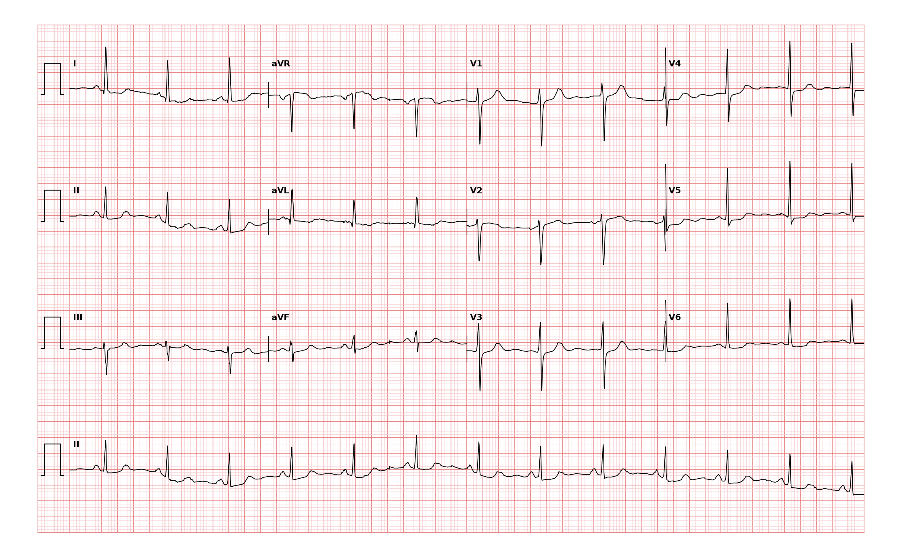

## 문제
A 64-year-old woman comes to the emergency department because of 45 minutes of pressure-like chest discomfort that began at rest and is accompanied by nausea and sweating. She has hypertension and hyperlipidemia and stopped smoking 5 years ago. Blood pressure is 152/90 mm Hg and pulse is 78/min and regular; lungs are clear. A 12-lead electrocardiogram obtained on arrival is shown. Which of the following is the most appropriate next step in management?

- A. Intravenous furosemide and nitroglycerin for acute left ventricular strain
- B. Aspirin, an anticoagulant, and serial troponin measurement with planning for early coronary angiography
- C. Intravenous fibrinolytic therapy within 30 minutes of arrival
- D. Immediate activation of the catheterization laboratory for primary percutaneous coronary intervention as an ST-elevation infarction
- E. Discharge with an outpatient exercise stress test within 72 hours

_12-lead ECG, 25 mm/s, 10 mm/mV, 3×4 + lead II rhythm strip (PTB-XL, PhysioNet, CC BY 4.0; raw signal, no filtering)_

## 정답 및 해설
> 정답: B

- **정답 핵심**: The tracing shows sinus rhythm at about 77/min with horizontal-to-downsloping ST-segment depression of 1–2 mm in leads I, II, aVL, aVF and V4–V6 and slight ST elevation in aVR; there is no ST elevation in two contiguous leads and no new bundle-branch block. Ongoing rest pain with widespread ST depression is a non-ST-elevation acute coronary syndrome. Treatment is antithrombotic — aspirin plus a P2Y12 inhibitor and parenteral anticoagulation — with troponin measurement to distinguish infarction from unstable angina and an early invasive strategy given the extensive ST depression. Fibrinolysis is indicated only for ST elevation and harms patients with ST depression.
- **원리**: The ST segment separates two kinds of acute coronary syndrome because it reports <b>which layer of the wall is ischemic</b>. Complete occlusion of an epicardial artery makes <b>transmural</b> ischemia; the injury current points toward the overlying electrode and produces <b>ST elevation</b>. Subtotal occlusion or supply–demand mismatch makes <b>subendocardial</b> ischemia; the injury current points away from the surface and produces <b>ST depression</b>, often in many leads with a reciprocal rise in aVR.  <b>Why the treatment differs</b> — fibrinolysis dissolves a fresh occlusive thrombus and was shown to save lives only when the ECG shows ST elevation or new LBBB; in ST depression the thrombus is platelet-rich and non-occlusive, and the trials showed <b>no benefit and more bleeding</b>. For NSTE-ACS the pillars are <b>antiplatelet therapy (aspirin + P2Y12 inhibitor), anticoagulation (heparin/enoxaparin/fondaparinux), anti-ischemic drugs (beta-blocker, nitrates), and risk-based timing of angiography</b>: within 24 h for high risk (troponin rise, dynamic ST changes, GRACE &gt; 140), immediately if pain is refractory or the patient is unstable.  <b>Why troponin is measured but not waited for</b> — the ECG plus symptoms already define ACS and start treatment; troponin at 0 and 1–3 h decides NSTEMI versus unstable angina and sharpens risk. A normal first troponin does not exclude infarction 45 minutes after onset.  <b>Confounder: LV hypertrophy with strain</b> — long-standing hypertension can produce lateral ST depression at baseline. Strain depression is downsloping with an asymmetric inverted T in V5–V6 and is usually stable over time; new, symptomatic depression with upright T waves and aVR elevation, as here, is treated as ischemia. When in doubt, compare with an old tracing and repeat the ECG at 15–30 minutes — dynamic change confirms ischemia.
- **비교**: <table><thead><tr><th style="width:30%">Option</th><th style="width:36%">When it is correct</th><th>Why not here</th></tr></thead><tbody> <tr><td><b>Aspirin + anticoagulant + troponin, early invasive (answer)</b></td><td><b>ACS with ST depression / T inversion / positive troponin</b></td><td>—</td></tr> <tr><td>Fibrinolysis</td><td>STEMI when PCI cannot be done within 120 min</td><td>no ST elevation — no benefit, bleeding risk</td></tr> <tr><td>Cath lab as STEMI</td><td>ST elevation ≥ 1 mm in two contiguous leads or new LBBB; or NSTE-ACS with refractory pain/instability</td><td>no elevation, hemodynamically stable — urgent but not 'STEMI' pathway</td></tr> <tr><td>Outpatient stress test</td><td>low-risk chest pain with normal ECG and negative serial troponins</td><td>ongoing pain with ischemic ECG</td></tr> <tr><td>Furosemide + nitroglycerin for strain</td><td>acute pulmonary edema</td><td>lungs clear; 'strain' is not the diagnosis of new rest pain</td></tr> </tbody></table> The <b>closest wrong answer is fibrinolysis</b>: the patient has an acute coronary syndrome and 'clot-busting' feels urgent. The discriminator is the <b>ST segment</b> — up means occlusion and lysis or PCI now; down means subendocardial ischemia and antithrombotic therapy with catheterization on a risk-based clock.
- **오답 이유**:
  - (A) Diuretics and nitrates for 'strain' treat acute heart failure, not acute coronary syndrome, and would leave the thrombus untreated. Her lungs are clear. This option would be correct only if she presented with pulmonary edema and the ST changes were an old, stable strain pattern.
  - (C) Fibrinolytic therapy is reserved for ST-elevation infarction (or new LBBB) when primary PCI is unavailable within 120 minutes. Trials in patients with ST depression showed no mortality benefit and more bleeding. This option would be correct only if two contiguous leads showed ST elevation of at least 1 mm and PCI were not reachable in time.
  - (D) Immediate catheterization as a STEMI requires ST elevation or new LBBB, or an NSTE-ACS with refractory pain, hemodynamic or electrical instability. This patient is stable and has ST depression, so angiography is planned early (within 24 hours) rather than as an emergency STEMI activation. This option would be correct only if the ST segments were elevated or she were in shock or with unrelieved pain.
  - (E) An outpatient stress test is for low-risk chest pain after a normal or non-ischemic ECG and negative serial troponins. Exercise testing during ongoing ischemia is contraindicated. This option would be correct only if the ECG were normal and two troponin values were negative.
- **함정**: Widespread ST depression is a marker of extensive subendocardial ischemia, and aVR elevation raises concern for left-main or multivessel disease — but that makes the case for early angiography, not for fibrinolysis. Never lyse a depression.
- **학습목표**: ST 분절 하강만 있는 급성 흉통에서 비ST상승 급성관상동맥증후군을 인식하고 섬유소용해가 아닌 항혈전·조기 침습 전략을 고른다
- **근거·출처**: PTB-XL record label ISCAL (ischemic changes in anterolateral leads; two-cardiologist validated) — teacher-only report notes ST depression I, II, aVL, aVF, V4–V6 · 작성자 판독(2026-09-16): sinus ≈77/min (RR 0.78 s), ST depression ≈1–2 mm in I, II, aVL, aVF, V4–V6, slight aVR elevation, no ST elevation; S V1 15 + R V5 17 = 32 mm · 2025 ACC/AHA/ACEP/NAEMSP/SCAI Guideline for the Management of Patients With Acute Coronary Syndromes — NSTE-ACS antithrombotic therapy and invasive-strategy timing; fibrinolysis limited to STEMI · Fibrinolytic Therapy Trialists' Collaborative Group. Lancet 1994 — no benefit of fibrinolysis in patients presenting with ST depression

## 출처
- PTB-XL ECG dataset v1.0.3 (PhysioNet, CC BY 4.0) · record 2101 · Creative Commons Attribution 4.0 International · https://physionet.org/content/ptb-xl/1.0.3/LICENSE.txt
