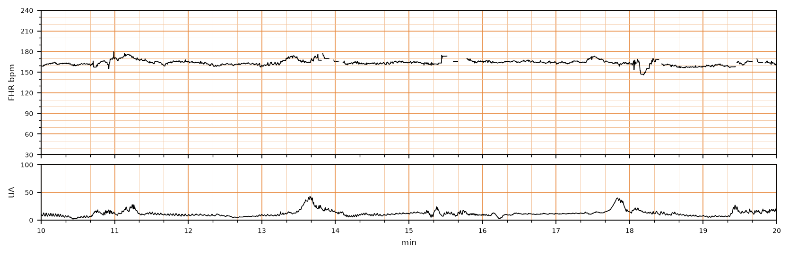

## 문제
A 20-year-old primigravida at 41 weeks' gestation is in the active phase of labor with continuous external electronic fetal monitoring. Her pregnancy was uncomplicated. Cervical dilation is 6 cm and membranes are intact. A 10-minute segment of the fetal heart rate and uterine activity tracing is shown. According to the NICHD three-tier system, which of the following best describes this tracing?

- A. Category I: normal baseline rate with moderate variability and accelerations
- B. Category III: absent variability with recurrent late decelerations
- C. Category III: sinusoidal pattern
- D. Category II: minimal variability with recurrent variable decelerations
- E. Category II: fetal tachycardia with moderate variability and no decelerations

_Intrapartum fetal heart rate (top) and uterine activity (bottom), minutes 10–20 of the recording; 3 cm/min, vertical lines = 1 min (CTU-UHB Intrapartum Cardiotocography Database, PhysioNet, ODC-BY 1.0; raw 4 Hz data, no smoothing)_

## 정답 및 해설
> 정답: E

- **정답 핵심**: The baseline sits just above the 160/min line for the whole 10 minutes — about 160–165/min — which by definition (baseline > 160/min for ≥ 10 minutes) is fetal tachycardia. Variability is moderate (amplitude about 6–10/min), there is at least one acceleration (a rise of about 15/min lasting about 25 seconds near minute 11), and none of the three small contractions is followed by a deceleration; the brief dip near minute 18 lasts less than 15 seconds and is not a deceleration. Tachycardia with preserved variability and no decelerations does not meet Category I (which requires a baseline of 110–160/min) and has no Category III feature, so it is Category II.
- **원리**: The NICHD system classifies a tracing by four elements read in order: <b>baseline rate, baseline variability, accelerations, decelerations</b>. <b>Category I</b> requires <b>all</b> of: baseline 110–160/min, moderate variability (6–25/min), no late or variable decelerations (early decelerations and accelerations may be present or absent). <b>Category III</b> is either <b>absent variability with recurrent late or variable decelerations or bradycardia</b>, or a <b>sinusoidal pattern</b>. Everything else is <b>Category II</b> — an indeterminate group that includes tachycardia, minimal variability, and isolated decelerations.  <b>Why the baseline is read over 10 minutes</b> — baseline is the mean rate rounded to 5/min in a 10-minute window, excluding accelerations, decelerations and periods of marked variability, and must be stable for at least 2 minutes within that window. A rate above 160/min in that sense is tachycardia; here the trace runs 160–165/min throughout.  <b>Why tachycardia matters and why it is not Category III</b> — fetal tachycardia is most often a response to <b>maternal fever or intra-amniotic infection</b>, and also to maternal dehydration, beta-agonist tocolytics, hyperthyroidism, fetal anemia or a fetal tachyarrhythmia (usually &gt; 200/min). By itself, with <b>moderate variability</b> and accelerations, it indicates an intact, non-acidemic fetal autonomic nervous system; the prognostic weight lies in variability, not in rate. The response is to look for and treat the cause (temperature, hydration, drugs), continue monitoring, and escalate only if variability falls or decelerations appear.  <b>Why accelerations here</b> — at ≥ 32 weeks an acceleration is a rise of ≥ 15/min lasting ≥ 15 s; the rise at 11.0–11.4 min qualifies. Its presence essentially excludes metabolic acidemia at that moment.
- **비교**: <table><thead><tr><th style="width:26%">Category</th><th style="width:40%">Defining features</th><th>This tracing</th></tr></thead><tbody> <tr><td><b>II — tachycardia, moderate variability (answer)</b></td><td><b>baseline &gt; 160/min, variability 6–25/min, no late/variable decelerations</b></td><td>≈160–165/min, variability ≈6–10, no decelerations</td></tr> <tr><td>I — normal</td><td>baseline <b>110–160</b>, moderate variability, no late/variable decelerations</td><td>fails on baseline (above 160)</td></tr> <tr><td>III — absent variability + recurrent late decelerations</td><td>flat baseline (0–5/min) and a deceleration after most contractions</td><td>variability preserved, no decelerations</td></tr> <tr><td>III — sinusoidal</td><td>smooth sine wave 3–5 cycles/min, amplitude 5–15, <b>no variability</b>, persisting ≥ 20 min</td><td>irregular moderate variability with accelerations</td></tr> <tr><td>II — minimal variability + recurrent variable decelerations</td><td>variability ≤ 5/min, abrupt decelerations with ≥ 50 % of contractions</td><td>variability &gt; 5, no decelerations</td></tr> </tbody></table> The <b>closest wrong answer is Category I</b>: variability, accelerations and absence of decelerations all look reassuring. The discriminator is the <b>baseline number</b> — read it against the 150 and 180 gridlines; the trace lies above 160 for the whole window, and a single element outside the Category I limits moves the tracing to Category II.
- **오답 이유**:
  - (A) Category I requires a baseline of 110–160/min in addition to moderate variability and absence of late or variable decelerations. This baseline runs above the 160/min line for the full 10 minutes. This option would be correct only if the baseline sat at or below 160/min.
  - (B) Category III with absent variability and recurrent late decelerations needs a flat baseline (amplitude undetectable) and gradual decelerations after most contractions. This tracing has visible moderate variability and no decelerations. This option would be correct only if the baseline were a flat line with a dip following each contraction.
  - (C) A sinusoidal pattern is a smooth, regular sine-wave undulation of 3–5 cycles per minute with no beat-to-beat variability, typical of fetal anemia. This tracing has irregular moderate variability and discrete accelerations. This option would be correct only if the baseline itself formed regular smooth waves.
  - (D) Minimal variability with recurrent variable decelerations means amplitude of 5/min or less with abrupt decelerations accompanying at least half of the contractions. Here variability exceeds 5/min and the contractions are not followed by decelerations. This option would be correct only if the trace were nearly flat and dropped abruptly with each contraction.
- **함정**: Reassuring variability and accelerations do not by themselves make a tracing Category I. Check the baseline against the printed gridlines first — anything above 160 is tachycardia and the tracing is at least Category II.
- **학습목표**: 분만 중 태아심박동 기록에서 기저선(>160/분)·변이도·가속·감속을 읽어 NICHD 3단계 범주를 정한다
- **근거·출처**: CTU-UHB 원자료(4 Hz) — 작성자 계측(2026-09-16, 화소 기반): baseline median ≈163/min (158–168) over minutes 10–20, variability amplitude ≈6–10/min, acceleration ≈+15–18/min × 25 s at 11.0–11.4 min, contractions at 11.2/13.6/17.8 min without decelerations · Macones GA et al. The 2008 NICHD workshop report on electronic fetal monitoring (Obstet Gynecol 2008) — definitions of baseline, variability, tachycardia, three-tier categories · ACOG Practice Bulletin No. 106: Intrapartum Fetal Heart Rate Monitoring (2009) — Category II management

## 출처
- CTU-UHB Intrapartum Cardiotocography Database (PhysioNet, ODC-BY 1.0) · record 1392 · Open Data Commons Attribution License v1.0 · https://opendatacommons.org/licenses/by/1-0/
