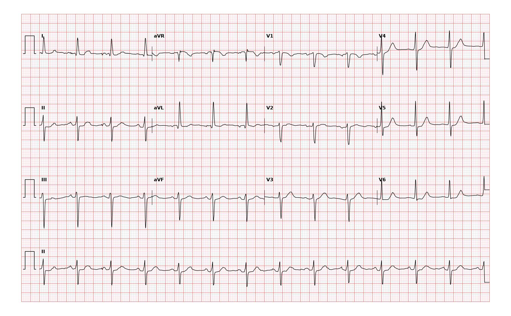

## 문제
65세 여자가 자궁탈출증으로 질식 자궁절제술을 받기 위해 수술 전 평가를 받고 있다. 10년 전부터 고혈압 약을 먹고 있으며 흉통·실신·호흡곤란은 없다. 혈압 148/88 mmHg, 맥박 분당 80회로 규칙적이다. 12유도 심전도는 그림과 같다. 심전도 소견으로 가장 적절한 것은?

- A. 완전 좌각차단
- B. 완전 우각차단
- C. 오래된 하벽 심근경색
- D. 좌전섬유속차단
- E. 좌후섬유속차단

_12유도 심전도, 25 mm/s · 10 mm/mV, 3×4 + II 리듬 스트립 (PTB-XL ECG dataset, PhysioNet, CC BY 4.0 — 원신호 그대로 작도)_

## 정답 및 해설
> 정답: D

- **정답 핵심**: 동율동 약 80/분이다. I 과 aVL 은 qR 형으로 양성이고 II·III·aVF 는 작은 r 뒤에 깊은 S 가 오는 rS 형으로 음성이므로 축은 약 -60° 의 좌축편위다. QRS 폭은 작은 칸 2~2.5칸(약 0.09초)으로 좁다. 좌축편위가 -45° 를 넘고 I·aVL qR, 하벽유도 rS, QRS 가 좁으며 다른 원인(하벽 경색·조기흥분·심실 리듬)이 없으면 좌전섬유속차단이다. 하벽유도에 Q 파가 아니라 작은 r 파가 남아 있으므로 오래된 하벽 경색이 아니다.
- **원리**: 좌각(left bundle)은 <b>앞섬유속(anterior fascicle)</b>과 <b>뒤섬유속(posterior fascicle)</b>으로 갈라진다. 앞섬유속은 좌심실의 <b>앞·위</b>쪽(전측벽)을, 뒤섬유속은 <b>뒤·아래</b>쪽(하벽)을 먼저 탈분극시킨다. 앞섬유속이 끊기면 좌심실은 뒤섬유속을 통해 <b>아래에서 위로, 오른쪽에서 왼쪽·위로</b> 탈분극된다.  <b>왜 좌축편위가 생기는가</b> — 탈분극의 첫 벡터는 아래(하벽)를 향하므로 II·III·aVF 에 <b>작은 r</b>, I·aVL 에 <b>작은 q</b> 가 생기고, 이어 주된 벡터가 위·왼쪽으로 돌아 I·aVL 에 <b>큰 R</b>, II·III·aVF 에 <b>깊은 S</b> 를 만든다. 그래서 축은 <b>-45° ~ -90°</b> 로 크게 왼쪽으로 돈다. 심실 근육 자체를 지나는 것이 아니라 정상 Purkinje 망을 타고 가므로 <b>QRS 는 넓어지지 않는다</b>(0.12초 미만, 보통 0.10초 이내). 좌각 전체가 막힌 좌각차단과 갈리는 지점이 바로 이 QRS 폭이다.  <b>진단 기준(AHA/ACCF/HRS 2009)</b> — ① 축 -45° ~ -90°, ② aVL qR, ③ aVL 의 R 정점 시간 ≥ 45 ms, ④ QRS &lt; 120 ms. 이 기록은 I·aVL qR, 하벽유도 rS, QRS 약 0.09초로 기준을 모두 채운다. 좌전섬유속차단은 고혈압·허혈·노화에 따른 전도계 섬유화에서 흔하고 단독으로는 예후에 큰 의미가 없어 <b>수술을 미룰 이유가 되지 않는다</b>. 다만 우각차단이 함께 있으면(이섬유속차단) 완전 방실차단 진행 가능성을 염두에 둔다.  <b>함께 보이는 소견의 해석</b> — 좌전섬유속차단에서는 벡터가 aVL 을 향해 aVL·I 의 R 이 커지므로 <b>사지유도 전압 기준으로 좌심실비대를 판단하면 과진단</b>이 된다. 이 기록도 aVL R 이 크고 측벽 ST 가 약간 처져 있어 고혈압성 좌심실비대가 동반됐을 수 있으나, 그것은 심장초음파로 확인할 문제이고 전도 소견의 답은 바뀌지 않는다.
- **비교**: <table><thead><tr><th style="width:26%">진단</th><th style="width:44%">심전도의 갈림길</th><th>이 기록</th></tr></thead><tbody> <tr><td><b>좌전섬유속차단(정답)</b></td><td><b>축 -45° 이하, I·aVL qR, II·III·aVF rS, QRS &lt; 0.12 s</b></td><td>축 ≈-60°, qR/rS, QRS ≈0.09 s</td></tr> <tr><td>좌후섬유속차단</td><td>축 +90° ~ +180°(우축편위), I·aVL rS, II·III·aVF qR, 우심실비대·폐질환 배제</td><td>축이 왼쪽</td></tr> <tr><td>완전 좌각차단</td><td>QRS ≥ 0.12 s, V5·V6·I·aVL 넓고 파인 R, q 없음</td><td>QRS 좁음, aVL 에 q 있음</td></tr> <tr><td>완전 우각차단</td><td>QRS ≥ 0.12 s, V1 rSR′, I·V6 넓은 S</td><td>QRS 좁음, V1 rS</td></tr> <tr><td>오래된 하벽 심근경색</td><td>II·III·aVF 에 <b>Q 파</b>(≥ 0.04 s 또는 R 의 1/4) 로 시작, 축은 흔히 좌축</td><td>하벽유도가 작은 <b>r</b> 로 시작(rS)</td></tr> </tbody></table> <b>가장 가까운 오답은 「오래된 하벽 심근경색」</b> — 둘 다 좌축편위를 만들고 하벽유도가 음성이다. 갈림길은 <b>하벽유도 QRS 의 첫 번째 파가 r 인가 Q 인가</b>다. 작은 r 이 남아 있으면 섬유속차단, r 이 사라지고 Q 로 시작하면 경색이다. 반대로 「하벽 Q 파 + 좌축편위」 기록이 나오면 경색을 먼저 읽고, 그때는 섬유속차단을 진단하지 않는다(기준의 배제 조건).
- **오답 이유**:
  - ① 완전 좌각차단은 QRS 폭이 0.12초 이상이고 I·aVL·V5·V6 에 넓고 파인 R 파가 있으며 측벽에 q 파가 없다. 이 기록은 QRS 가 작은 칸 2~2.5칸으로 좁고 aVL 에 q 파가 있다. 이 선지가 정답이 되려면 QRS 가 큰 칸 3칸 이상으로 넓어야 한다.
  - ② 완전 우각차단은 QRS 폭 0.12초 이상에 V1 rSR′(토끼귀), I·V6 의 넓고 뭉툭한 S 가 있다. 이 기록의 V1 은 rS 형이고 QRS 가 좁다. 이 선지가 정답이 되려면 V1 에 두 번째 R′ 이 보이고 QRS 가 넓어야 한다.
  - ③ 오래된 하벽 심근경색은 II·III·aVF 에 병적 Q 파(폭 ≥ 0.04초 또는 R 의 1/4 이상 깊이)로 QRS 가 시작한다. 이 기록의 하벽유도는 작은 r 파로 시작하는 rS 형이며 Q 파가 없다. 이 선지가 정답이 되려면 하벽유도의 첫 파가 위로 향한 r 이 아니라 아래로 향한 Q 이어야 한다.
  - ⑤ 좌후섬유속차단은 축이 +90° 를 넘는 우축편위와 I·aVL rS, II·III·aVF qR 이 특징이며 우심실비대·만성 폐질환·수직 심장을 배제해야 진단한다. 이 기록은 I·aVL 이 양성인 좌축편위다. 이 선지가 정답이 되려면 I 유도가 음성이고 III 유도가 qR 이어야 한다.
- **함정**: 좌축편위를 보고 「하벽 경색」이나 「좌심실비대」로 넘어가기 쉽다. 먼저 QRS 폭(좁음)과 하벽유도의 첫 파(r 인가 Q 인가), aVL 의 qR 을 확인한다.
- **학습목표**: 좌축편위(-45° 이상)와 I·aVL qR, II·III·aVF rS, 좁은 QRS 로 좌전섬유속차단을 진단하고 다른 전도장애·경색과 구분한다
- **근거·출처**: PTB-XL 기록 라벨 LAFB(2인 심장내과 검증) — 교사용 원 판독문: sinus rhythm, left axis deviation, high limb-lead voltages, ST depression I·aVL·V5·V6 · 작성자 계측(2026-09-17, 화소 기반): RR ≈0.75 s(≈80/분), I qR(R ≈8 mm), aVL qR(R ≈13 mm), II·III·aVF rS(S ≈10~13 mm), QRS ≈0.09 s, V1 rS · Surawicz B et al. AHA/ACCF/HRS Recommendations for the Standardization and Interpretation of the ECG Part III: Intraventricular Conduction Disturbances (2009) — 좌전섬유속차단 기준(축 -45~-90°, aVL qR, QRS < 120 ms) · Goldberger's Clinical Electrocardiography — fascicular blocks, differential of left axis deviation

## 출처
- PTB-XL ECG dataset v1.0.3 (PhysioNet, CC BY 4.0) · record 1576 · Creative Commons Attribution 4.0 International · https://physionet.org/content/ptb-xl/1.0.3/LICENSE.txt
