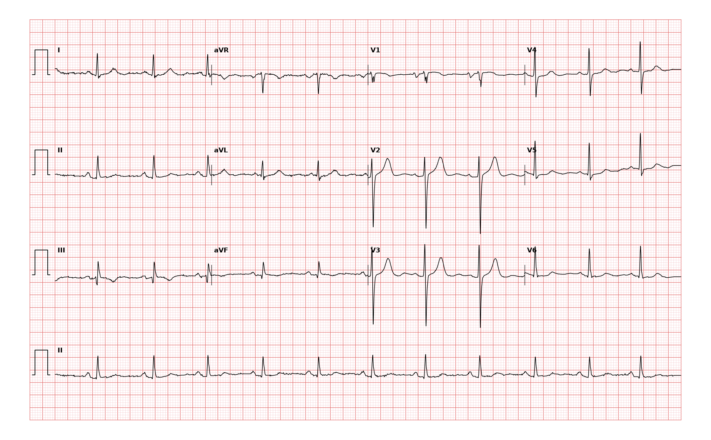

## 문제
A 71-year-old woman comes to the physician because of a 6-month history of progressive exertional dyspnea and two recent episodes of waking at night short of breath. She had rheumatic fever at age 12. Pulse is 70/min and regular, and blood pressure is 118/74 mm Hg. Cardiac auscultation shows a loud first heart sound, an opening snap after the second heart sound, and a low-pitched diastolic rumble at the apex. A 12-lead electrocardiogram is shown. Which of the following is the most likely finding on this electrocardiogram?

- A. First-degree atrioventricular block
- B. Right ventricular hypertrophy
- C. Left atrial enlargement
- D. Right atrial enlargement
- E. Atrial flutter with 4:1 atrioventricular conduction

_12-lead ECG, 25 mm/s, 10 mm/mV, 3×4 + lead II rhythm strip (PTB-XL, PhysioNet, CC BY 4.0; raw signal, no filtering)_

## 정답 및 해설
> 정답: C

- **정답 핵심**: The rhythm is sinus at about 70/min: each QRS is preceded by a P wave with a constant PR interval of about 0.16 s. The P wave in lead II is broad (about 0.12 s, three small squares) and notched, and in V1 the P wave is biphasic with a wide, deep terminal negative component (about 1 mm deep and 1 small square wide) — a positive P terminal force. Both are criteria for left atrial enlargement. The clinical picture of rheumatic mitral stenosis (opening snap, apical diastolic rumble) explains it: the stenotic valve raises left atrial pressure and dilates the chamber. The QRS is narrow with a normal axis and V1 shows an rS pattern, so there is no right ventricular hypertrophy.
- **원리**: The P wave is the sum of right atrial depolarization (first ~40 ms) and left atrial depolarization (last ~40 ms). The right atrium is closer to lead V1 and its vector points anteriorly, giving the <b>initial positive</b> part of the P in V1; the left atrium lies posteriorly, so its vector points <b>away</b> from V1 and produces the <b>terminal negative</b> part. In lead II both atria depolarize toward the electrode, producing a single upright P of ≤ 0.11 s.  <b>Why enlargement changes the P</b> — a dilated, thick-walled left atrium takes <b>longer</b> to depolarize, so the left atrial component is delayed and widened: the P in lead II becomes <b>≥ 0.12 s and notched</b> (the two humps are the right and left atrial peaks separated by ≥ 0.04 s — 'P mitrale'), and the terminal negative deflection in V1 becomes <b>deeper and longer</b> (P terminal force ≥ 0.04 mm·s, i.e., ≥ 1 mm deep for ≥ 0.04 s). Right atrial enlargement, by contrast, increases the <b>amplitude</b> of the early part (peaked P ≥ 2.5 mm in II, tall initial positive P in V1) without prolonging it.  <b>Why mitral stenosis</b> — rheumatic carditis fuses the commissures and thickens the leaflets; when the orifice falls below ~1.5 cm² the left atrium must generate a diastolic gradient to fill the ventricle, so left atrial pressure and volume rise chronically. The ECG consequence is left atrial enlargement, and the natural history is atrial fibrillation, left atrial thrombus, pulmonary hypertension and eventually right ventricular hypertrophy. The loud S1 and opening snap indicate the leaflets are still pliable; the diastolic rumble is the turbulent flow across the narrowed orifice.  <b>What the ECG does not show yet</b> — pulmonary hypertension would add right axis deviation, a dominant R in V1 and a right ventricular strain pattern. Here the axis is normal and V1 is rS, so the disease has not yet produced right ventricular hypertrophy — which makes left atrial enlargement, not RVH, the single best answer.
- **비교**: <table><thead><tr><th style="width:30%">Finding</th><th style="width:40%">ECG signature</th><th>This tracing</th></tr></thead><tbody> <tr><td><b>Left atrial enlargement (answer)</b></td><td><b>P ≥ 0.12 s and notched in II; terminal negative P in V1 ≥ 1 mm × 0.04 s</b></td><td>II P ≈0.12 s notched; V1 terminal negativity ≈1 mm × 1 box</td></tr> <tr><td>Right atrial enlargement</td><td>P <b>tall</b> (≥ 2.5 mm) and peaked in II/III/aVF, tall initial P in V1, duration normal</td><td>P in II is low and broad, not tall</td></tr> <tr><td>Atrial flutter 4:1</td><td>continuous sawtooth F waves ~300/min with no isoelectric baseline; ventricular rate ~75/min</td><td>discrete P waves with flat baseline between them</td></tr> <tr><td>First-degree AV block</td><td>PR &gt; 0.20 s (more than one large square)</td><td>PR ≈0.16 s</td></tr> <tr><td>Right ventricular hypertrophy</td><td>right axis deviation, R/S &gt; 1 in V1, deep S in V5–V6, right strain T inversion</td><td>normal axis, V1 rS</td></tr> </tbody></table> The <b>closest wrong answer is right ventricular hypertrophy</b> because mitral stenosis eventually causes it. The discriminator is <b>V1</b>: an rS complex with a normal axis excludes RVH, whereas the P wave in the same lead carries the diagnosis. The <b>second trap is atrial flutter</b> — a broad notched P at 70/min is not a sawtooth; flutter has no flat baseline at all. If the tracing showed a tall peaked P instead of a broad notched one, the answer would flip to right atrial enlargement.
- **오답 이유**:
  - (A) First-degree atrioventricular block requires a PR interval longer than 0.20 s, more than one large square. Here the PR is about 0.16 s and constant. This option would be correct only if the distance from P onset to QRS onset exceeded five small squares.
  - (B) Right ventricular hypertrophy shows right axis deviation, a dominant R wave in V1 (R/S greater than 1), deep S waves in V5–V6 and often T inversion in V1–V3. This tracing has a normal axis and an rS complex in V1. This option would be correct only if V1 showed a tall R exceeding the S and the axis were rightward.
  - (D) Right atrial enlargement produces tall, peaked P waves of 2.5 mm or more in the inferior leads with normal duration and a tall initial positive P in V1. The P waves here are broad and notched but low in amplitude, with a deep terminal negative component in V1. This option would be correct only if the P in lead II exceeded 2.5 mm and the V1 P were predominantly positive.
  - (E) Atrial flutter with 4:1 conduction shows a continuous sawtooth of flutter waves at about 300/min with no isoelectric segment, and a regular ventricular rate near 75/min. This tracing has discrete P waves separated by a flat baseline. This option would be correct only if the baseline between QRS complexes were an uninterrupted sawtooth.
- **함정**: With a murmur of mitral stenosis the temptation is to look for right heart strain. Read the P wave first: its width and the V1 terminal negativity are the left atrial signature, and the narrow rS in V1 rules out right ventricular hypertrophy.
- **학습목표**: 류마티스 승모판협착증 환자의 심전도에서 P mitrale(II 유도 폭 ≥ 0.12 s·이봉)과 V1 종말 음성 P 로 좌심방 확장을 읽는다
- **근거·출처**: PTB-XL record label LAO/LAE (left atrial overload/enlargement; two-cardiologist validated) · 작성자 판독(2026-09-17): sinus ≈69/min (RR ≈0.87 s), PR ≈0.16 s, P in II ≈0.12 s and notched, V1 P terminal negative ≈1 mm × ≈0.04 s, normal axis, V1 rS, S V2/V3 ≈20 mm · Hancock EW et al. AHA/ACCF/HRS Recommendations … Part V: ECG Changes Associated With Cardiac Chamber Hypertrophy (2009) — left atrial abnormality criteria (P duration ≥ 120 ms, P terminal force in V1) · 2020 ACC/AHA Guideline for the Management of Patients With Valvular Heart Disease — rheumatic mitral stenosis: pathophysiology and natural history

## 출처
- PTB-XL ECG dataset v1.0.3 (PhysioNet, CC BY 4.0) · record 10988 · Creative Commons Attribution 4.0 International · https://physionet.org/content/ptb-xl/1.0.3/LICENSE.txt
