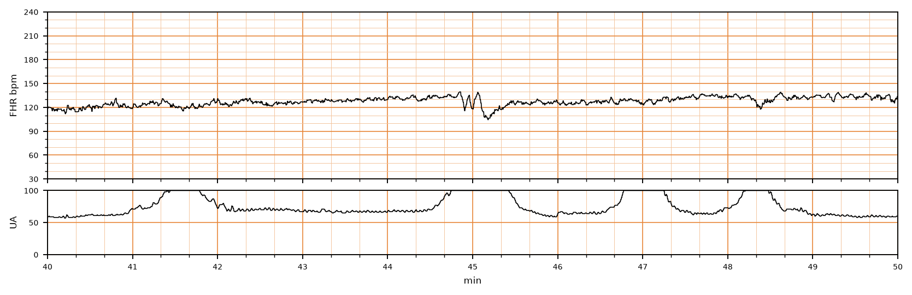

## 문제
28세 여자(1회 출산)가 임신 39주에 진통이 있어 분만실에 입원하였다. 자궁경부는 5 cm 열려 있고 양막은 파열되어 맑은 양수가 보였다. 임신 경과는 정상이었고 산모의 체온과 혈압은 정상이다. 외부 전자태아감시로 얻은 태아심박동(위)과 자궁수축(아래) 기록 10분 구간은 그림과 같다. 기록에서 보이는 감속의 유형은?

- A. 감속이 아닌 정상 변이도
- B. 가변감속
- C. 조기감속
- D. 후기감속
- E. 지속감속

_분만 중 태아심박동(위)과 자궁수축(아래) 기록, 기록 시작 후 40~50분 구간; 3 cm/분, 세로선 = 1분 (CTU-UHB Intrapartum Cardiotocography Database, PhysioNet, ODC-BY 1.0 — 원자료 4 Hz 그대로, 평활화 없음)_

## 정답 및 해설
> 정답: B

- **정답 핵심**: 기저 태아심박동은 약 125~135/분이고 변이도는 중등도(6~10/분)다. 44.8~45.3분에 자궁수축의 정점 무렵 심박동이 약 135에서 105/분으로 30초 안에 급격히 떨어졌다가 급격히 회복하며, 하강은 25~30/분, 지속은 약 35초다. 시작과 회복이 급격하고(onset to nadir < 30초) 15/분 이상 15초 이상 2분 미만 지속하며 모양이 톱니 같은 어깨를 가지므로 가변감속이다. 조기·후기감속은 완만하게(≥ 30초) 내려가며 수축 곡선을 거울처럼 따라가고, 지속감속은 2분 이상 이어진다.
- **원리**: NICHD(2008) 정의에서 감속은 <b>하강 속도</b>와 <b>자궁수축과의 시간관계</b> 두 축으로 나눈다. <b>급격(abrupt)</b> = 시작에서 최저점까지 <b>30초 미만</b>, <b>완만(gradual)</b> = 30초 이상.  <b>가변감속</b>은 급격히 내려가고 급격히 올라오며 하강 ≥ 15/분, 지속 ≥ 15초 &lt; 2분이다. 수축과의 관계가 「가변」이라 이름이 그렇다. 기전은 <b>제대 압박</b>이다 — 제대정맥이 먼저 눌리면 정맥 환류가 줄어 짧은 <b>가속(어깨, shoulder)</b>이 오고, 제대동맥까지 눌리면 태아 혈압이 급상승해 <b>압수용체 반사로 미주신경이 즉시</b> 심박수를 떨어뜨린다. 그래서 하강이 칼처럼 급하다. 압박이 풀리면 반사가 사라져 즉시 회복한다. 양막 파열 뒤·양수과소·제대 탈출·목에 감긴 제대에서 흔하다.  <b>조기감속</b>은 완만하게 내려가 최저점이 수축 정점과 <b>일치</b>한다(거울상). 기전은 <b>태아 머리 압박</b> → 두개내압 상승 → 미주신경 반응이고 양성 소견이다. <b>후기감속</b>은 완만하게 내려가되 시작·최저점·회복이 수축보다 <b>모두 늦다</b>. 기전은 <b>자궁태반 관류부전</b> — 수축으로 융모간강 혈류가 끊기면 태아 PO₂ 가 화학수용체 역치 아래로 떨어지는 데 시간이 걸리므로 늦게 나타난다. <b>지속감속</b>은 15/분 이상 하강이 <b>2분 이상 10분 미만</b> 이어지는 것이다(10분을 넘으면 기저선 변화).  <b>왜 유형이 중요한가</b> — 유형이 곧 기전이고 기전이 곧 처치다. 가변감속은 제대 압박이므로 <b>체위 변경, 양막 파열 뒤라면 양수주입(amnioinfusion)</b>이 대응이고, 후기감속은 관류 개선(좌측위·수액·산소·옥시토신 중단)이며, 조기감속은 처치가 필요 없다. 단발 가변감속에 변이도가 중등도로 남아 있으면 태아 산증 가능성은 낮고 (이 기록의 아기도 정상 출생), 재발하고 깊어지며 변이도가 사라질 때가 위험 신호다.
- **비교**: <table><thead><tr><th style="width:22%">감속 유형</th><th style="width:26%">하강 속도</th><th style="width:30%">수축과의 관계</th><th>기전</th></tr></thead><tbody> <tr><td><b>가변감속(정답)</b></td><td><b>급격(&lt; 30초)</b>, 급격 회복</td><td><b>일정하지 않음</b>, 어깨(가속) 동반</td><td>제대 압박 → 압수용체·미주신경</td></tr> <tr><td>조기감속</td><td>완만(≥ 30초)</td><td>최저점 = 수축 정점(거울상)</td><td>태아 머리 압박</td></tr> <tr><td>후기감속</td><td>완만(≥ 30초)</td><td>최저점이 수축 정점보다 늦음</td><td>자궁태반 관류부전 → 화학수용체</td></tr> <tr><td>지속감속</td><td>급격 또는 완만</td><td>2~10분 지속</td><td>제대 탈출·자궁 과수축·산모 저혈압 등</td></tr> <tr><td>정상 변이도</td><td>진폭 6~25/분의 잔물결</td><td>수축과 무관</td><td>정상 자율신경 상호작용</td></tr> </tbody></table> <b>가장 가까운 오답은 조기감속</b> — 최저점이 수축 정점 부근에 있어 시간관계로는 헷갈린다. 갈림길은 <b>하강의 모양</b>이다. 30초 안에 25~30/분을 뚝 떨어뜨리고 톱니 어깨가 있으면 가변, 수축 곡선을 부드럽게 뒤집어 놓은 듯하면 조기다. 반대로 「완만하게 내려가 수축 뒤에 회복」하는 기록이 나오면 후기감속으로 읽고 관류 개선 처치로 넘어간다.
- **오답 이유**:
  - ① 정상 변이도는 기저선 주위의 6~25/분 진폭 잔물결로 수축과 무관하게 계속된다. 이 기록의 44.8~45.3분 하강은 25~30/분으로 변이도 폭을 훨씬 넘고 수축 정점과 함께 나타난 뚜렷한 사건이다. 이 선지가 정답이 되려면 기저선에서 15/분 이상 벗어나는 구간이 없어야 한다.
  - ③ 조기감속은 30초 이상 걸려 완만하게 내려가고 최저점이 수축 정점과 정확히 겹치는 대칭적인 거울상이다. 이 기록의 감속은 30초 안에 뚝 떨어지고 톱니 모양 어깨가 있다. 이 선지가 정답이 되려면 하강이 수축 곡선을 부드럽게 뒤집은 모양이어야 한다.
  - ④ 후기감속은 완만하게 내려가되 시작·최저점·회복이 모두 수축보다 늦고 반복되는 관류부전의 신호다. 이 기록의 감속은 급격하고 수축 정점과 거의 같은 시각에 시작한다. 이 선지가 정답이 되려면 수축이 끝난 뒤에 최저점이 오고 매 수축마다 되풀이돼야 한다.
  - ⑤ 지속감속은 15/분 이상의 하강이 2분 이상 10분 미만 이어지는 것이다. 이 기록의 감속은 약 35초 만에 기저선으로 돌아왔다. 이 선지가 정답이 되려면 하강이 세로선(1분) 두 칸 이상 이어져야 한다.
- **함정**: 최저점이 수축 정점 근처라고 조기감속으로 읽기 쉽다. 시간관계보다 먼저 하강 속도(30초 기준)와 어깨 모양을 본다 — 급격하면 무조건 가변감속이다.
- **학습목표**: 태아심박동 기록에서 급격한(30초 미만) 하강·회복과 자궁수축과의 시간관계로 가변감속을 조기·후기·지속감속과 구분한다
- **근거·출처**: CTU-UHB 원자료(4 Hz) — 작성자 계측(2026-09-17, 화소 기반): baseline ≈125~135/min, variability ≈6~10/min, deceleration 44.8~45.3 min: 135→105/min in < 30 s, duration ≈35 s, shoulders present; contractions 41.5/45.0/46.8/48.3 min (UA saturating at 100); teacher-only outcome pH 7.33, Apgar 9/9 · Macones GA et al. The 2008 NICHD workshop report on electronic fetal monitoring (Obstet Gynecol 2008) — definitions of abrupt vs gradual, early/late/variable/prolonged decelerations · ACOG Practice Bulletin No. 106: Intrapartum Fetal Heart Rate Monitoring (2009) — physiology of variable decelerations and amnioinfusion · Williams Obstetrics — intrapartum assessment: cord compression and baroreceptor-mediated variable decelerations

## 출처
- CTU-UHB Intrapartum Cardiotocography Database (PhysioNet, ODC-BY 1.0) · record 1189 · Open Data Commons Attribution License v1.0 · https://opendatacommons.org/licenses/by/1-0/
