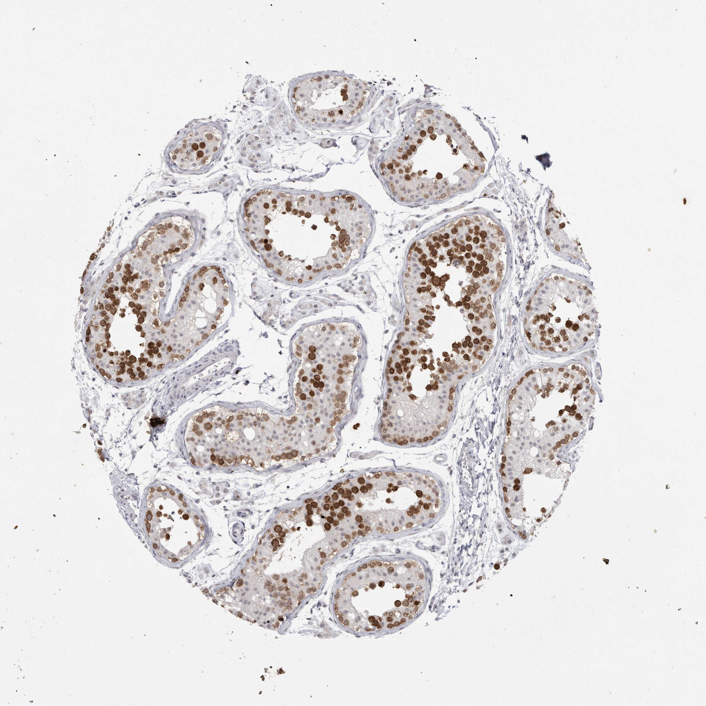

## 문제
26세 남자가 결혼 2년이 지나도록 아이가 생기지 않아 병원에 왔다. 정액검사를 2회 하였더니 정액량 0.8 mL, pH 6.4 이고 정자는 보이지 않았다. 진찰에서 양쪽 고환 크기는 정상(20 mL)이고 양쪽 정관이 만져지지 않는다. 혈청 난포자극호르몬 4.2 IU/L, 테스토스테론은 정상이다. 고환 조직검사 절편에 생식세포 표지자로 면역조직화학염색을 하였더니 그림과 같다. 고환 조직 소견으로 가장 적절한 것은?

- A. 정세관 유리질화와 위축
- B. 라이디히세포 과다형성
- C. 정자형성 보존(폐쇄성 무정자증에 합당)
- D. 세르톨리세포단독증후군
- E. 성숙정지(정모세포 단계)

_면역조직화학염색(DAB 갈색, 헤마톡실린 대조염색) 조직 마이크로어레이 코어, 원본 배율 그대로 (Human Protein Atlas, CC BY 4.0 — 크롭·보정 없음)_

## 정답 및 해설
> 정답: C

- **정답 핵심**: 그림의 모든 정세관 단면에서 기저막 쪽부터 내강 쪽까지 여러 층의 세포가 갈색으로 강하게 염색된다. 생식세포 표지자가 정원세포·정모세포·정자세포에 이르는 다층의 생식세포를 표시하고 있으며, 세르톨리세포와 간질의 라이디히세포·주위세관세포는 청색(음성)이다. 정세관 지름과 간질 구성도 정상이다. 즉 정자형성이 보존된 정상 고환이다. 정관이 만져지지 않고 정액량이 적으며 산성이고(정낭 결손) FSH 가 정상인 임상 소견과 합치면 선천 양측 정관 무형성(CBAVD)에 의한 폐쇄성 무정자증이다.
- **원리**: 무정자증은 두 갈래로 나뉜다. <b>비폐쇄성(NOA)</b>은 고환이 정자를 못 만드는 것이고, <b>폐쇄성(OA)</b>은 만들지만 길이 막힌 것이다. 이를 가르는 것이 <b>고환 크기·FSH·정액량/pH</b> 세 가지다. 정자형성이 없으면 세르톨리세포의 인히빈 B 분비가 줄어 <b>FSH 가 오르고</b> 정세관 부피가 줄어 <b>고환이 작아진다</b>. 정관 무형성이나 사정관 폐쇄에서는 정낭도 함께 결손·폐쇄되므로 정낭액(알칼리성, 프룩토스, 정액의 60~70 %)이 빠져 <b>정액량 &lt; 1 mL, pH &lt; 7.2, 프룩토스 음성</b>이 된다. 이 환자는 셋 다 폐쇄를 가리킨다.  <b>조직이 결론을 확정하는 방식</b> — 생식세포 특이 표지자(VASA/DDX4 계열 — 정원세포에서 정자세포까지 발현, 세르톨리·라이디히세포 음성)로 염색하면 정세관 안에 <b>몇 층의 생식세포가 있는가</b>가 한눈에 보인다. 정상이면 기저막의 정원세포 → 1차·2차 정모세포 → 원형·긴 정자세포가 <b>여러 층</b>을 이룬다. 세르톨리세포단독 증후군이면 정세관 안에 <b>염색되는 세포가 없고</b> 세르톨리세포만 남아 관이 작아진다. 성숙정지면 염색되는 세포가 <b>1~2층(정원세포·정모세포)</b>에서 멈추고 내강 쪽에 정자세포가 없다. 유리질화(클라인펠터 등)는 정세관 벽이 두꺼워지고 내강이 사라지며 간질에 라이디히세포가 상대적으로 뭉친다.  <b>왜 CBAVD 인가</b> — 정관은 볼프관(중신관) 유래이고 정낭·사정관도 같은 관에서 나온다. <b>CFTR</b> 변이가 있으면 태생기 중신관이 폐쇄·퇴화하여 정관·정낭이 없어지고, 남자 낭성섬유증 환자의 98 % 가 이 이유로 불임이다. 폐 증상 없이 CBAVD 만 있는 환자의 70~80 % 에서 CFTR 변이(흔히 ΔF508 + 5T)가 발견되므로 <b>본인과 배우자의 CFTR 검사</b>가 다음 단계이고, CFTR 음성이면 편측 콩팥 무형성이 동반될 수 있어 콩팥 초음파를 본다.  <b>치료의 함의</b> — 정자형성이 보존돼 있으므로 <b>부고환·고환에서 정자를 채취(PESA/MESA/TESE)해 세포질내 정자주입(ICSI)</b>을 하면 자녀를 가질 수 있다. 정관이 없으므로 정관 복원은 불가능하다. 조직 소견이 세르톨리세포단독이었다면 답은 공여 정자로 바뀐다 — 그래서 이 사진 한 장이 치료 경로를 정한다.
- **비교**: <table><thead><tr><th style="width:26%">조직 소견</th><th style="width:40%">생식세포 표지자 염색 양상</th><th>임상 짝</th></tr></thead><tbody> <tr><td><b>정자형성 보존(정답)</b></td><td><b>모든 정세관에 기저막~내강 다층 양성 세포, 정세관 지름 정상</b></td><td>고환 정상 크기, FSH 정상, 정액량·pH 낮음 → 폐쇄성</td></tr> <tr><td>세르톨리세포단독증후군</td><td>정세관 안에 양성 세포 <b>전무</b>, 세르톨리세포만, 관 지름 감소</td><td>고환 작음, FSH ↑, 정액량 정상</td></tr> <tr><td>성숙정지</td><td>양성 세포가 기저부 1~2층(정원·정모세포)에서 멈춤, 정자세포 없음</td><td>고환 정상~약간 작음, FSH 정상~↑</td></tr> <tr><td>정세관 유리질화</td><td>관 벽 두껍고 내강 소실, 양성 세포 거의 없음, 간질 라이디히세포 뭉침</td><td>작고 단단한 고환, FSH·LH ↑, 클라인펠터</td></tr> <tr><td>라이디히세포 과다형성</td><td>간질 세포 증가(표지자 음성), 정세관은 정상 또는 위축</td><td>고환 종괴·호르몬 증상; 폐쇄를 설명하지 못함</td></tr> </tbody></table> <b>가장 가까운 오답은 성숙정지</b> — 얼핏 「염색된 세포가 있으니 만들긴 한다」로 보인다. 갈림길은 <b>양성 세포가 내강 쪽까지 여러 층인가, 기저부 한두 층에서 멈추는가</b>다. 이 사진은 관 안쪽까지 빽빽하다. 반대로 기저부에만 얇게 염색된 사진이 나오면 성숙정지로 읽고, 그때는 정자 채취 성공률이 낮다는 상담으로 넘어간다.
- **오답 이유**:
  - ① 정세관 유리질화와 위축은 클라인펠터증후군처럼 관 벽이 두꺼워지고 내강이 사라지며 생식세포가 거의 없고 간질에 라이디히세포가 뭉친 소견이다. 이 사진의 정세관은 지름·벽·내강이 정상이다. 이 선지가 정답이 되려면 고환이 작고 단단하며 FSH·LH 가 높고 관이 섬유화돼야 한다.
  - ② 라이디히세포 과다형성은 정세관 사이 간질 세포가 늘어나는 것으로, 생식세포 표지자 염색에서는 간질이 음성이라 정세관 소견과 무관하며 정관 결손·저용량 산성 정액을 설명하지 못한다. 이 선지가 정답이 되려면 간질이 넓어져 세포 덩어리를 이루고 호르몬 이상이나 종괴가 있어야 한다.
  - ④ 세르톨리세포단독증후군은 정세관 안에 생식세포가 전혀 없어 생식세포 표지자 염색이 관 안에서 완전히 음성이고, 세르톨리세포만 남아 관 지름이 줄며 FSH 가 오르고 고환이 작다. 이 사진은 모든 관이 양성 세포로 차 있다. 이 선지가 정답이 되려면 정세관 안이 청색(음성)이고 고환이 작으며 FSH 가 높아야 한다.
  - ⑤ 성숙정지는 정원세포·정모세포까지만 있고 정자세포로 넘어가지 못해 양성 세포가 기저막 쪽 1~2층에서 멈춘다. 이 사진은 양성 세포가 내강 쪽까지 여러 층이다. 이 선지가 정답이 되려면 관 안쪽(내강 쪽)에 염색된 세포가 없고 기저부만 얇게 염색돼야 한다.
- **함정**: 정액에 정자가 없다고 고환도 못 만든다고 단정하면 틀린다. 정액량·pH·정관 촉지·FSH 로 폐쇄를 의심하고, 조직에서 다층 생식세포를 확인하면 정자 채취 + ICSI 로 갈 수 있다.
- **학습목표**: 무정자증 환자의 고환 조직에서 생식세포 표지자 면역조직화학으로 정자형성 보존 여부를 읽어 폐쇄성과 비폐쇄성 무정자증을 구분한다
- **근거·출처**: Human Protein Atlas 조직 IHC — 고환 코어(26세 남) 병리의 세포 주석: spermatogonia·spermatocytes·spermatids high, Sertoli cells·peritubular cells not detected, Leydig cells low · 작성자 판독(2026-09-17): 정세관 단면 10여 개 전부에 기저막~내강 다층의 갈색 양성 생식세포, 세르톨리세포·간질 음성, 정세관 지름·간질 정상 · AUA/ASRM Guideline: Diagnosis and Treatment of Infertility in Men (2020/2021) — azoospermia evaluation: semen volume/pH, vasal palpation, FSH, testis size; CBAVD and CFTR testing; sperm retrieval with ICSI · Campbell-Walsh-Wein Urology — male infertility: obstructive vs non-obstructive azoospermia, testicular histology patterns (normal spermatogenesis, hypospermatogenesis, maturation arrest, Sertoli cell-only)

## 출처
- Human Protein Atlas, DDX4 / Testis (CC BY 4.0), https://images.proteinatlas.org/26170/57049_A_5_6.jpg · Creative Commons Attribution 4.0 International · https://www.proteinatlas.org/about/licence
