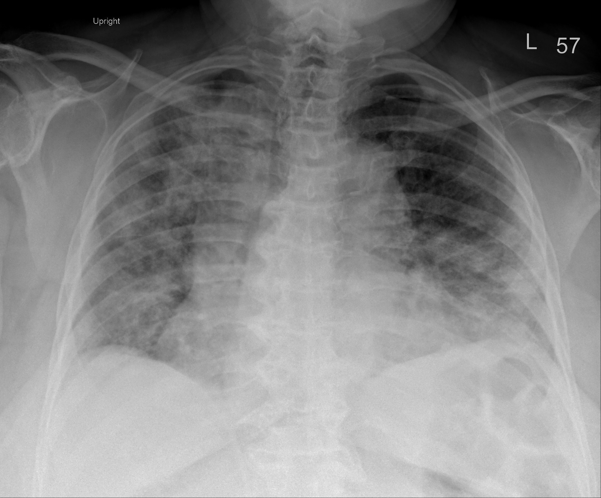

## 문제
A 73-year-old woman is brought to the emergency department because of 6 days of fever, dry cough, and progressively worsening shortness of breath. She has hypertension treated with amlodipine. Her temperature is 38.6°C, pulse is 104/min, respirations are 28/min, blood pressure is 138/82 mm Hg, and oxygen saturation is 88% while breathing room air. Fine crackles are heard over both lung fields. A nasopharyngeal swab is positive for SARS-CoV-2 RNA. An upright anteroposterior chest radiograph is shown. Which of the following best describes the findings on this radiograph?

- A. Thick-walled cavitary lesion in the left upper lobe with an air-fluid level
- B. Bilateral multifocal hazy opacities, more extensive on the right, without lobar consolidation, effusion, or cavitation
- C. Dense lobar consolidation of the right upper lobe with an air bronchogram and a sharp minor-fissure margin
- D. Large right pleural effusion with a meniscus and contralateral mediastinal shift
- E. Bilateral hilar and right paratracheal lymphadenopathy with clear lung fields

_Upright anteroposterior chest radiograph (The Cancer Imaging Archive, CC BY 4.0; original pixel data, no windowing or cropping)_

## 정답 및 해설
> 정답: B

- **정답 핵심**: Both lungs show patchy, ill-defined hazy (ground-glass to consolidative) opacities distributed through the perihilar, middle and lower zones; the right lung is more extensively involved than the left. The opacities do not respect a lobar boundary, there is no air bronchogram within a dense homogeneous consolidation, the costophrenic angles are not blunted by a meniscus, the hila are not enlarged, and no cavity with a wall or air-fluid level is present. Bilateral multifocal hazy opacities in a febrile hypoxemic patient with a positive PCR are the typical radiographic pattern of viral (COVID-19) pneumonia.
- **원리**: A radiograph shows <b>where and how</b> the alveoli have lost their air, and the pattern points to the disease. <b>Viral pneumonia</b> (including COVID-19) injures the alveolar epithelium and capillary endothelium <b>diffusely and multifocally</b>, through the blood and the airways at once, so the alveoli fill partially with fluid, protein and cells. Partial filling attenuates the beam only slightly and leaves the vessels visible: the result is <b>hazy, ground-glass-like opacity</b>, bilateral, patchy, often peripheral and basal, that ignores lobar boundaries. As filling becomes complete the opacity turns into consolidation, but still in a multifocal, non-lobar distribution.  <b>Why the other patterns look different</b> — <b>lobar pneumonia</b> (typically <i>Streptococcus pneumoniae</i>) spreads through the pores of Kohn within one lobe and stops at the fissure, producing a dense homogeneous opacity with a <b>sharp fissural margin</b> and <b>air bronchograms</b> (air-filled bronchi silhouetted by consolidated alveoli). A <b>pleural effusion</b> is fluid outside the lung: it layers dependently, blunts the costophrenic angle and forms a <b>meniscus</b>; a large one pushes the mediastinum away. <b>Lymphadenopathy</b> enlarges the hilar and paratracheal shadows while the lungs stay clear (sarcoidosis, lymphoma). A <b>cavity</b> is necrosis that has drained into a bronchus — a lucency with a wall, sometimes with an air-fluid level (tuberculosis, abscess, squamous carcinoma).  <b>Why the description matters clinically</b> — for COVID-19 the radiograph is not the diagnostic test (the PCR is) but it grades <b>extent</b>: bilateral involvement of most zones with saturation of 88 % places this patient in the severe category, which is what justifies supplemental oxygen and <b>dexamethasone</b> (RECOVERY trial: mortality benefit only in patients needing oxygen), with remdesivir considered early and thromboprophylaxis. A normal radiograph would not exclude COVID-19 but would argue against steroids. The radiograph also screens for the alternatives that change management — a lobar consolidation would prompt antibiotics for bacterial co-infection, an effusion would raise heart failure or empyema, a cavity would raise tuberculosis or abscess.
- **비교**: <table><thead><tr><th style="width:30%">Pattern</th><th style="width:40%">Radiographic hallmark</th><th>On this film</th></tr></thead><tbody> <tr><td><b>Bilateral multifocal hazy opacities (answer)</b></td><td><b>patchy, ill-defined, both lungs, non-lobar, vessels partly visible through the haze</b></td><td>present, right &gt; left, mid–lower zones</td></tr> <tr><td>Lobar consolidation (RUL)</td><td>dense homogeneous opacity bounded by the minor fissure, air bronchogram</td><td>no fissural margin, no single-lobe density</td></tr> <tr><td>Large pleural effusion</td><td>dependent homogeneous density, meniscus, blunted costophrenic angle, mediastinal shift</td><td>angles visible, no meniscus, mediastinum midline</td></tr> <tr><td>Hilar/paratracheal lymphadenopathy</td><td>lobulated enlarged hila and widened right paratracheal stripe with clear lungs</td><td>hila not lobulated; lungs are not clear</td></tr> <tr><td>Cavitary lesion</td><td>rounded lucency with a definable wall ± air-fluid level</td><td>no lucent cavity, no wall</td></tr> </tbody></table> The <b>closest wrong answer is lobar consolidation</b>: the right lung is denser and a beginner may 'see' a lobe. The discriminator is the <b>margin</b> — consolidation from viral pneumonia is patchy and fades into normal lung across lobes, whereas a lobar process is homogeneous and stops sharply at a fissure. The <b>second confounder is pulmonary edema</b>, which also gives bilateral perihilar haze; it is separated by cardiomegaly, upper-lobe vascular redistribution, Kerley lines and effusions, none of which are present, and by the fever and PCR.
- **오답 이유**:
  - (A) A thick-walled cavity is a rounded lucency with a definable wall, often with an air-fluid level, as in tuberculosis or lung abscess. No lucent cavity is present on this film. This option would be correct only if a ring-shaped opacity with a central lucency were visible in the left upper zone.
  - (C) Lobar consolidation is a dense, homogeneous opacity confined to one lobe with a sharp fissural edge and air bronchograms, typical of pneumococcal pneumonia. This film shows patchy haze in both lungs crossing lobar boundaries without a sharp margin. This option would be correct only if a single homogeneous density stopped abruptly at the minor fissure.
  - (D) A large pleural effusion produces a homogeneous dependent density with a concave upper meniscus, obliterates the costophrenic angle and, when large, shifts the mediastinum to the opposite side. Here both costophrenic regions are visible without a meniscus and the mediastinum is midline. This option would be correct only if the right lower hemithorax were uniformly white with a curved upper border.
  - (E) Bilateral hilar and paratracheal lymphadenopathy shows lobulated, enlarged hilar shadows and a widened right paratracheal stripe with otherwise clear lungs, as in sarcoidosis. Here the lungs are diffusely abnormal and the hila are not lobulated. This option would be correct only if the lung fields were clear and the hila were enlarged and lumpy.
- **함정**: Do not name the disease from the film — describe it. Patchy bilateral haze without a fissural margin, meniscus, cavity or enlarged hila is a multifocal alveolar process; the PCR, not the radiograph, makes it COVID-19.
- **학습목표**: 바이러스 폐렴의 흉부 X선에서 양쪽 다발성 반점상·흐린 음영을 엽성 경화·흉수·공동·림프절병증과 구분해 기술한다
- **근거·출처**: TCIA COVID-19-AR (Desai S et al., UAMS; CC BY 4.0) — patient-level label: RT-PCR-confirmed COVID-19 with bilateral opacities; Grade B, this film read by the author · 작성자 판독(2026-09-17): upright AP, bilateral multifocal hazy/patchy opacities (perihilar, mid and lower zones, right > left), no lobar consolidation, no meniscus/effusion, no cavity, hila not enlarged; burned-in text limited to 'Upright', 'L' and a technologist marker · Wong HYF et al. Frequency and distribution of chest radiographic findings in patients positive for COVID-19 (Radiology 2020) — bilateral, peripheral, lower-zone predominant consolidation/ground-glass opacities; effusion and cavitation rare · RECOVERY Collaborative Group. Dexamethasone in hospitalized patients with Covid-19 (N Engl J Med 2021) — benefit confined to patients requiring oxygen · Felson's Principles of Chest Roentgenology — patterns: alveolar (consolidation) vs interstitial, silhouette sign, effusion, cavity

## 출처
- COVID-19-AR, The Cancer Imaging Archive (CC BY 4.0) · series …08718626 · Creative Commons Attribution 4.0 International · https://www.cancerimagingarchive.net/data-usage-policies-and-restrictions/
