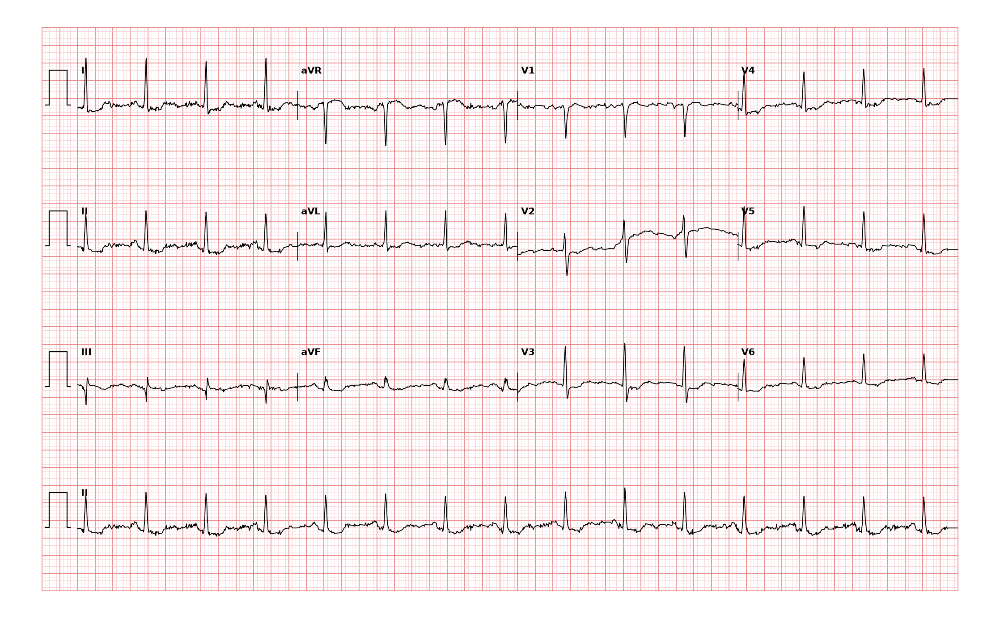

## 문제
An 86-year-old woman comes to the physician for a routine follow-up examination. She has heart failure with reduced ejection fraction and has been taking digoxin 0.125 mg daily, carvedilol, and furosemide for 3 years. She has no chest pain, palpitations, nausea, or visual symptoms. Her pulse is 88/min and regular, and blood pressure is 126/72 mm Hg. Cardiac examination shows no new murmur. Serum potassium concentration is 4.3 mEq/L, creatinine is 0.9 mg/dL, and the serum digoxin concentration measured last week was 0.8 ng/mL. A 12-lead electrocardiogram is shown. Which of the following is the most appropriate next step in management?

- A. Give intravenous potassium chloride
- B. Continue the current regimen
- C. Discontinue digoxin
- D. Administer digoxin-specific antibody fragments
- E. Measure serum troponin and begin heparin

_12-lead ECG, 25 mm/s, 10 mm/mV, 3×4 + lead II rhythm strip (PTB-XL, PhysioNet, CC BY 4.0; raw signal, no filtering)_

## 정답 및 해설
> 정답: B

- **정답 핵심**: The tracing shows sinus rhythm at about 88/min with narrow QRS complexes and a normal axis. In leads I, II and V4–V6 the ST segment sags downward immediately after the J point with a concave ('scooped' or reverse-tick) contour of about 1 mm, the T waves are flattened, and the QT interval is short (about 0.34 s). This combination is the digitalis effect — the expected repolarization change of therapeutic digoxin, not a sign of toxicity. She is asymptomatic, potassium and renal function are normal, and her digoxin level is in the therapeutic range (0.5–0.9 ng/mL in heart failure). Nothing needs to change.
- **원리**: Digoxin inhibits the <b>Na⁺/K⁺-ATPase</b> of the myocyte. Intracellular Na⁺ rises, the Na⁺/Ca²⁺ exchanger removes less Ca²⁺, and the extra Ca²⁺ stored in the sarcoplasmic reticulum gives the positive inotropic effect. The same ion shift <b>shortens phase 2 and phase 3 of the action potential</b>: the plateau is abbreviated and repolarization begins earlier and less uniformly across the ventricular wall. On the surface ECG this appears as a <b>shortened QT interval</b>, a <b>sagging ST segment that is depressed with an upward concavity</b> ('scooped', reverse-tick or Salvador-Dali-moustache appearance) most obvious in leads with tall R waves (I, II, V4–V6), and <b>flattened or inverted T waves</b>. Digoxin also increases vagal tone at the AV node, so a mildly prolonged PR interval and a slow sinus rate are common.  <b>Why this is 'effect', not 'toxicity'</b> — the ST-T change is present in most patients at therapeutic serum concentrations and correlates with neither the level nor the risk of arrhythmia. Toxicity is a different phenomenon: delayed after-depolarizations from Ca²⁺ overload produce ectopy and automaticity (premature ventricular complexes, bigeminy, atrial tachycardia with block, accelerated junctional rhythm, bidirectional ventricular tachycardia), and excess vagal effect produces sinus bradycardia or AV block. Toxicity is diagnosed by <b>symptoms (nausea, anorexia, confusion, xanthopsia) and arrhythmia</b>, supported by a high level or hypokalemia, hypomagnesemia, hypercalcemia or renal failure, which sensitize the myocardium.  <b>Why the level and potassium matter</b> — digoxin and K⁺ compete for the same binding site on the Na⁺/K⁺-ATPase, so hypokalemia increases digoxin binding and precipitates toxicity even at a 'therapeutic' concentration. Here potassium is 4.3 mEq/L, creatinine is normal and the level is 0.8 ng/mL, within the range (0.5–0.9 ng/mL) associated with lower mortality in the DIG trial post-hoc analysis. A scooped ST segment in an asymptomatic patient with these values is a reason to <b>document</b>, not to act.
- **비교**: <table><thead><tr><th style="width:30%">ST-T pattern</th><th style="width:40%">Distinguishing features</th><th>This tracing</th></tr></thead><tbody> <tr><td><b>Digitalis effect (answer)</b></td><td><b>concave, sagging ST depression; flat T; short QT; normal or slow sinus rhythm; asymptomatic</b></td><td>scooped ST in I, II, V4–V6; QT ≈0.34 s; rate 88/min</td></tr> <tr><td>Digitalis toxicity</td><td>ectopy or automaticity (PVCs, bigeminy, atrial tachycardia with block, bidirectional VT), AV block, symptoms, high level or low K⁺</td><td>no ectopy, no block, level 0.8 ng/mL, K⁺ 4.3</td></tr> <tr><td>Subendocardial ischemia</td><td>horizontal or downsloping ST depression ≥ 1 mm with symmetric T inversion; chest pain; normal QT</td><td>ST is concave-up and sagging, T flat, no pain</td></tr> <tr><td>Hypokalemia</td><td>ST depression, flat T, <b>prominent U wave</b>, <b>prolonged</b> QU interval</td><td>QT short, no U wave, K⁺ 4.3</td></tr> <tr><td>LVH with strain</td><td>tall R (SV1 + RV5 ≥ 35 mm), asymmetric downsloping ST with T inversion in V5–V6</td><td>R in V5 ≈10 mm, voltage criteria not met</td></tr> </tbody></table> The <b>closest wrong answer is 'discontinue digoxin'</b>: the ST change looks alarming, but it is the pharmacological signature of the drug, and stopping a guideline-supported therapy that reduces heart-failure hospitalization because of an expected ECG finding would be an error. The discriminator is the <b>combination of the contour (concave sag, short QT) with a normal level, normal potassium and no arrhythmia</b>. If the same patient had nausea and bigeminy, or a level of 3 ng/mL, the answer would flip to stopping the drug — and to antibody fragments only with life-threatening arrhythmia or hyperkalemia.
- **오답 이유**:
  - (A) Intravenous potassium is given when hypokalemia potentiates digoxin (ST depression, flat T, prominent U waves, long QU interval) or in digoxin toxicity with low potassium. Her potassium is 4.3 mEq/L and the QT is short with no U wave, so potassium would risk hyperkalemia without benefit. This option would be correct only if potassium were below 3.5 mEq/L with U waves on the tracing.
  - (C) Discontinuing digoxin is indicated for toxicity — symptoms, arrhythmia (ectopy, atrial tachycardia with block, AV block), a supratherapeutic level, or hypokalemia. None is present: she is asymptomatic, in sinus rhythm without ectopy, with K⁺ 4.3 and a level of 0.8 ng/mL. This option would be correct only if the tracing showed bigeminy or high-grade AV block, or if the level were above 2 ng/mL.
  - (D) Digoxin-specific antibody fragments (Fab) are reserved for life-threatening toxicity: ventricular tachyarrhythmia, bradyarrhythmia unresponsive to atropine, potassium above 5 mEq/L from acute overdose, or massive ingestion. An asymptomatic patient with a therapeutic level and a benign repolarization pattern has no indication. This option would be correct only if she had bidirectional ventricular tachycardia or hyperkalemia after an overdose.
  - (E) Troponin and heparin are for an acute coronary syndrome, which requires ischemic symptoms or ischemic ST-T changes — horizontal or downsloping ST depression with symmetric T inversion, or ST elevation. This concave sagging ST with a short QT in a pain-free patient is a drug effect, not ischemia. This option would be correct only if she had chest pain with new horizontal ST depression or T-wave inversion.
- **함정**: A scooped ST segment on digoxin is not toxicity and is not ischemia. Ask three things before acting: symptoms, rhythm (ectopy or block?), and the level with potassium. All normal → continue.
- **학습목표**: 디곡신 복용 환자의 심전도에서 측벽 유도의 오목한(scooped) ST 하강·편평 T·짧은 QT 를 디기탈리스 효과로 읽고 독성·허혈과 구분해 치료를 유지한다
- **근거·출처**: PTB-XL record label DIG (digitalis effect), STTC class, two-cardiologist validated; teacher-only report: sinus rhythm, normal axis, ST & T abnormal, digitalis change · 작성자 계측(2026-09-18, 화소 기반): RR ≈0.68 s(≈88/분), QRS ≈0.08 s, I·II·V4~V6 J점 직후 오목한 ST 하강 ≈1 mm, T 편평, QT ≈0.34 s; V2 기저선 단차·V5 초반 기저선 하강은 원신호 인공물로 판독에 영향 없음 · Goldberger's Clinical Electrocardiography, 9th ed., ch. 'Digitalis effect and toxicity' — scooped ST depression, short QT, flattened T; toxicity = arrhythmias, not ST-T change · Rathore SS et al. Association of serum digoxin concentration and outcomes in patients with heart failure (JAMA 2003) — lowest mortality at 0.5–0.8 ng/mL · Katzung Basic & Clinical Pharmacology, ch. 13 Drugs used in heart failure — Na⁺/K⁺-ATPase inhibition, potassium interaction, indications for Fab

## 출처
- PTB-XL ECG dataset v1.0.3 (PhysioNet, CC BY 4.0) · record 10512 · Creative Commons Attribution 4.0 International · https://physionet.org/content/ptb-xl/1.0.3/LICENSE.txt
