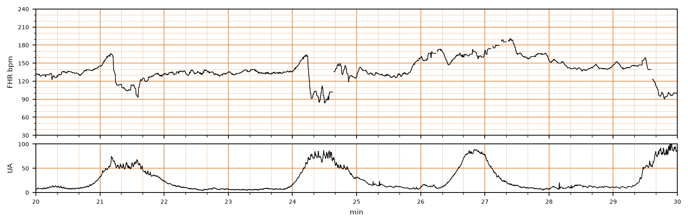

## 문제
25세 초산부가 임신 39주에 규칙적인 진통으로 입원하였다. 산전 진찰에서 특이 소견은 없었다. 자궁경부는 5 cm 개대되었고 2시간 전 양막이 파열되었으며 양수는 맑았다. 옥시토신은 투여하지 않고 있다. 지속 전자태아감시에서 자궁수축은 3분마다 있고, 태아심박동 기록은 그림과 같다. 좌측와위로 바꾸고 안면마스크로 산소를 주었으나 30분 동안 같은 소견이 매 수축마다 반복되었다. 가장 적절한 처치는?

- A. 흡입분만
- B. 터부탈린 피하주사
- C. 양수주입
- D. 옥시토신 투여
- E. 응급 제왕절개술

_분만 중 태아심박동(위)과 자궁수축(아래) 기록, 기록 시작 후 20~30분 구간; 3 cm/분, 세로선 = 1분 (CTU-UHB Intrapartum Cardiotocography Database, PhysioNet, ODC-BY 1.0 — 원자료 4 Hz 그대로, 평활화 없음)_

## 정답 및 해설
> 정답: C

- **정답 핵심**: 기저 태아심박동은 130~140/분이고 변이도는 중등도(6~15/분)로 유지된다. 매 수축(21, 24, 27, 30분)마다 심박동이 30초 안에 165 에서 85~92 로 급격히 떨어졌다가 급격히 회복하며, 하강 전후에 짧은 가속(어깨)과 수축 뒤 185 까지의 overshoot 가 따라온다 — 제대압박에 의한 반복 가변감속이다. 변이도가 유지되고 가속이 있으므로 태아 산증은 아직 시사되지 않아(NICHD 범주 II) 즉시 분만할 단계는 아니다. 체위 변경과 산소로 호전되지 않는 반복 가변감속에서 양막이 파열된 상태라면 양수주입으로 제대 주위의 완충 양수를 늘려 압박을 풀어 주는 것이 다음 처치다.
- **원리**: <b>가변감속의 기전</b> — 자궁수축 중 제대가 눌리면 먼저 <b>제대정맥</b>(벽이 얇음)이 막혀 태아로 가는 혈류가 줄고 태아는 압수용체 반사로 심박동을 잠깐 올린다(하강 전 어깨). 이어 <b>제대동맥</b>까지 막히면 태아 전신혈압이 갑자기 올라 압수용체가 강한 미주신경 반사를 일으켜 심박동이 <b>30초 안에 급격히</b> 떨어진다. 압박이 풀리면 반대 순서로 회복되어 하강 뒤 어깨 또는 overshoot 가 생긴다. 하강이 급격하고 모양·깊이·시간관계가 수축마다 다른 것이 후기감속(자궁태반 부전, 완만한 하강·수축 정점 뒤 최저점)과 구분되는 이유다.  <b>왜 양수주입인가</b> — 양막 파열 뒤에는 제대를 감싸던 양수의 완충이 사라져 수축 때마다 제대가 눌린다. 자궁강 안으로 등장액(생리식염수 또는 젖산링거)을 자궁내 카테터로 넣어 주면 제대 주위의 액체층이 회복되어 압박이 줄고, 무작위 대조시험 메타분석에서 반복 가변감속의 빈도와 태아곤란을 이유로 한 제왕절개가 의미 있게 감소했다(ACOG Practice Bulletin 116). 시행 조건은 <b>양막 파열</b>·<b>자궁내 카테터 삽입 가능</b>·<b>즉시 분만이 필요하지 않은 범주 II 기록</b>이며, 이 산모는 5 cm 개대에 파열 2시간으로 모두 해당한다.  <b>왜 아직 제왕절개가 아닌가</b> — 태아 산증을 예측하는 것은 감속의 존재가 아니라 <b>변이도의 소실</b>과 <b>가속의 소실</b>이다. 이 기록은 변이도 중등도, 가속과 overshoot 가 있으므로 산-염기 상태가 보존되어 있다고 보는 것이 타당하다(실제 교사용 결과: 제대동맥 pH 7.17, Apgar 9/10). 자궁내 소생술(체위·산소·수액·옥시토신 중단)을 이미 했고 그다음 단계가 양수주입이며, 그 뒤에도 변이도가 사라지거나 감속이 60초 이상·60/분 이하로 깊어지면 그때 분만을 앞당긴다.
- **비교**: <table><thead><tr><th style="width:24%">처치</th><th style="width:46%">적응 조건</th><th>이 산모</th></tr></thead><tbody> <tr><td><b>양수주입(정답)</b></td><td><b>반복 가변감속 + 양막 파열 + 체위·산소로 호전 없음 + 변이도 보존(범주 II)</b></td><td>모두 충족</td></tr> <tr><td>응급 제왕절개술</td><td>범주 III(변이도 소실 + 반복 후기·가변감속 또는 서맥, 사인곡선) 또는 소생술에도 악화</td><td>변이도 중등도, 가속 있음</td></tr> <tr><td>옥시토신 투여</td><td>진통 부진(수축 부족)일 때. 수축이 늘면 제대압박도 늘어 감속이 악화</td><td>3분마다 적절한 수축</td></tr> <tr><td>흡입분만</td><td>제2기(완전 개대·아두 하강)에서 분만을 단축해야 할 때</td><td>5 cm 개대 — 제1기</td></tr> <tr><td>터부탈린</td><td>자궁수축과다(10분에 6회 이상)로 감속이 생길 때 수축 억제</td><td>수축 3분 간격, 과다 아님</td></tr> </tbody></table> <b>가장 가까운 오답은 「응급 제왕절개술」</b> — 매 수축마다 90/분 아래로 떨어지는 그림이 위협적으로 보이기 때문이다. 갈림길은 <b>변이도와 가속</b>이다. 변이도가 중등도이고 가속·overshoot 가 있으면 산증이 없다고 보고 양수주입을 먼저 하며, 변이도가 최소·소실로 바뀌거나 감속이 60초 이상 지속되면 그때 제왕절개로 간다. 반대로 「변이도 소실 + 반복 감속」 기록이 나오면 양수주입을 시도하느라 시간을 쓰지 않고 바로 분만한다.
- **오답 이유**:
  - ① 흡입분만은 제2기, 즉 자궁경부 완전 개대와 아두 하강이 있을 때 분만을 단축하는 수술적 질식분만이다. 5 cm 개대의 제1기에서는 시행할 수 없다. 이 선지가 정답이 되려면 완전 개대에 아두가 +2 이하로 내려와 있고 감속이 지속되어야 한다.
  - ② 터부탈린 같은 β2 작용제는 자궁수축과다(10분에 6회 이상)로 태아심박동 이상이 생길 때 수축을 늦추기 위해 쓴다. 이 산모의 수축은 3분 간격으로 정상 범위이며 감속의 원인은 수축 횟수가 아니라 제대압박이다. 이 선지가 정답이 되려면 옥시토신 중단 뒤에도 수축이 2분 이하 간격으로 이어지며 감속이 동반되어야 한다.
  - ④ 옥시토신은 자궁수축이 부족해 진통이 부진할 때 쓴다. 이 산모는 3분마다 충분한 수축이 있고 감속의 원인이 수축 중 제대압박이므로 수축을 늘리면 감속이 더 잦아진다. 이 선지가 정답이 되려면 수축이 10분에 2회 미만으로 드물고 태아심박동은 정상이어야 한다.
  - ⑤ 응급 제왕절개술은 NICHD 범주 III(변이도 소실에 반복 감속·서맥 동반, 사인곡선) 이거나 자궁내 소생술·양수주입에도 기록이 악화될 때 한다. 이 기록은 변이도 중등도에 가속이 있어 태아 산증이 시사되지 않는다. 이 선지가 정답이 되려면 변이도가 사라지고 감속이 60초 이상 지속되거나 서맥이 회복되지 않아야 한다.
- **함정**: 깊은 감속을 보고 바로 제왕절개로 가지 말 것. 먼저 하강의 속도(급격 → 가변감속), 그다음 변이도·가속(보존 → 범주 II)을 읽고, 양막 파열 상태에서 소생술에 반응 없는 반복 가변감속이면 양수주입이 다음 단계다.
- **학습목표**: 분만 중 매 수축마다 반복되는 가변감속(제대압박)에서 체위 변경·산소로 호전되지 않을 때 양막 파열 상태의 다음 처치로 양수주입을 선택한다
- **근거·출처**: CTU-UHB 기록(교사용 결과): 39주 초산, 질식분만, Apgar 9/10, 제대동맥 pH 7.17·BDecf 4.2 — 경한 산혈증, 분만 시 태아 상태 양호 · 작성자 판독(2026-09-18): 20~30분 구간 기저 ≈130~140/분, 변이도 중등도, 수축 21.1·24.2·26.8·29.6분, 매 수축마다 30초 미만의 급격한 하강(165→92, 165→85, 160→90)과 급회복, 어깨·overshoot 동반 · ACOG Practice Bulletin No. 116 (2010, reaffirmed): Management of intrapartum fetal heart rate tracings — recurrent variable decelerations: intrauterine resuscitation, then amnioinfusion; cesarean when tracing does not improve · Hofmeyr GJ, Lawrie TA. Amnioinfusion for potential or suspected umbilical cord compression in labour (Cochrane Database Syst Rev 2012) — fewer variable decelerations and cesareans for fetal distress · Williams Obstetrics 26th ed., ch. 24 Intrapartum assessment — variable deceleration mechanism (umbilical vein → artery occlusion, baroreceptor reflex), shoulders and overshoot

## 출처
- CTU-UHB Intrapartum Cardiotocography Database (PhysioNet, ODC-BY 1.0) · record 1090 · Open Data Commons Attribution License v1.0 · https://opendatacommons.org/licenses/by/1-0/
