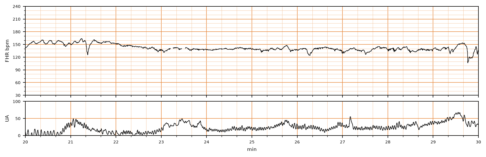

## 문제
27세 경산부(1회 출산)가 임신 42주 0일에 규칙적인 진통으로 내원하였다. 산전 진찰에서 태아 성장과 양수량은 정상이었고 40주와 41주에 시행한 비수축검사는 반응성이었다. 자궁경부는 4 cm 개대되었고 양막은 파열되지 않았다. 지속 전자태아감시의 태아심박동(위)과 자궁수축(아래) 기록은 그림과 같다. 가장 적절한 조치는?

- A. 산소 투여와 좌측와위
- B. 지속 감시하며 진통 경과 관찰
- C. 양수주입
- D. 응급 제왕절개술
- E. 태아 두피 혈액 pH 검사

_분만 중 태아심박동(위)과 자궁수축(아래) 기록, 기록 시작 후 20~30분 구간; 3 cm/분, 세로선 = 1분 (CTU-UHB Intrapartum Cardiotocography Database, PhysioNet, ODC-BY 1.0 — 원자료 4 Hz 그대로, 평활화 없음)_

## 정답 및 해설
> 정답: B

- **정답 핵심**: 기저 태아심박동은 140~145/분으로 정상 범위이고, 변이도는 6~15/분의 중등도로 잘 유지된다. 20.5~21.5분에 160/분까지 오르는 가속이 있고, 21.4분과 29.8분의 짧은(15초 미만) 얕은 하강 외에 후기감속이나 반복 가변감속은 없다. 이는 태아의 산-염기 상태가 정상임을 시사하는 안심할 수 있는 기록이다. 42주 지연임신이라도 이미 자발 진통이 시작되었고 태아 상태가 양호하므로 지속 전자태아감시를 하면서 진통을 계속 관찰하는 것이 적절하다.
- **원리**: 분만 중 태아심박동 판독의 핵심은 <b>변이도</b>다. 기저선의 박동 간 변이(6~25/분, 중등도)는 태아 대뇌피질·뇌간·자율신경계가 정상적으로 작동하고 있음을 뜻하며, 저산소증이 진행되어 중추신경이 억제되면 가장 먼저 사라진다. 그래서 <b>중등도 변이도 하나만으로도 그 시점의 태아 대사성 산증(pH &lt; 7.10)을 높은 확률로 배제</b>할 수 있고, 여기에 <b>가속</b>(32주 이후 15/분 이상·15초 이상)이 있으면 배제의 확실성이 더 커진다. 그래서 NICHD 3단계 분류는 범주 I 의 정의를 「기저 110~160, 변이도 중등도, 후기·가변감속 없음」으로 두고 「경과 관찰」을 처방한다.  <b>지연임신에서 무엇이 다른가</b> — 42주 이후에는 태반 기능 저하와 양수과소로 제대압박·후기감속·태변 흡인 위험이 올라간다. 그래서 41주부터 산전 감시(비수축검사·양수량)를 하고 41~42주에 유도분만을 권한다. 그러나 이 산모는 감시 결과가 정상이었고 <b>이미 자발 진통이 시작</b>되었으므로 남은 문제는 「진통 중 태아가 잘 견디는가」 하나이고, 그 답은 기록이 준다. 기록이 안심할 수 있으면 지연임신이라는 사실만으로 개입할 이유는 없다.  <b>이 기록의 세부</b> — 21.4분과 29.8분의 하강은 15초 안에 끝나는 얕은 것으로, 가변감속의 정의(15/분 이상·15초 이상)에 간신히 닿거나 미치지 못하고 반복적이지 않다. 자궁수축 채널은 외부 토코로 약하게 기록되어 있는데, 외부 토코는 수축의 <b>빈도와 시간</b>만 알려 주고 <b>강도</b>는 반영하지 않으므로 진폭이 낮다고 진통 부진으로 읽지 않는다.
- **비교**: <table><thead><tr><th style="width:26%">조치</th><th style="width:44%">언제 하는가</th><th>이 기록</th></tr></thead><tbody> <tr><td><b>경과 관찰(정답)</b></td><td><b>기저 110~160, 변이도 중등도, 후기·반복 가변감속 없음 — 산증 시사 없음</b></td><td>기저 140~145, 변이도 중등도, 가속 있음</td></tr> <tr><td>산소·좌측와위</td><td>범주 II 의 첫 대응 — 후기감속, 반복 가변감속, 변이도 감소가 나타날 때</td><td>교정할 이상이 없음</td></tr> <tr><td>양수주입</td><td>양막 파열 뒤 반복 가변감속이 소생술로 호전되지 않을 때</td><td>양막 미파열, 반복 가변감속 없음</td></tr> <tr><td>태아 두피 혈액 pH</td><td>범주 II 가 지속되어 산증 여부를 직접 확인해야 할 때(변이도 감소·감속 지속)</td><td>변이도·가속으로 이미 배제</td></tr> <tr><td>응급 제왕절개술</td><td>범주 III 또는 소생술에 반응 없는 악화</td><td>해당 없음</td></tr> </tbody></table> <b>가장 가까운 오답은 「산소 투여와 좌측와위」</b> — 해가 없으니 해 두자는 생각이 들지만, 시험은 「이 기록에 교정할 이상이 있는가」를 묻는다. 갈림길은 <b>변이도·가속의 존재와 반복 감속의 부재</b>다. 반대로 같은 42주 산모에서 기록이 후기감속 반복으로 바뀌면 그때 첫 대응이 체위·산소·수액이고, 변이도까지 사라지면 분만을 서두른다.
- **오답 이유**:
  - ① 산소 투여와 좌측와위는 후기감속·반복 가변감속·변이도 감소처럼 교정할 이상이 나타났을 때 자궁태반 관류를 개선하려는 첫 대응이다. 이 기록에는 교정할 이상이 없어 시행할 근거가 없다. 이 선지가 정답이 되려면 수축 정점 뒤에 최저점이 오는 완만한 감속이 반복되어야 한다.
  - ③ 양수주입은 양막이 파열된 뒤 제대압박으로 반복 가변감속이 생기고 체위·산소로 호전되지 않을 때 한다. 이 산모는 양막이 파열되지 않았고 기록에 반복 가변감속이 없다. 이 선지가 정답이 되려면 파열된 양막과 매 수축마다 급격한 하강이 반복되는 기록이 있어야 한다.
  - ④ 응급 제왕절개술은 변이도가 사라지고 반복 감속·서맥이 동반되는 범주 III 이거나 자궁내 소생술에도 악화될 때 한다. 이 기록은 변이도 중등도에 가속이 있어 태아 산증이 시사되지 않는다. 이 선지가 정답이 되려면 변이도 소실과 반복 후기감속 또는 지속 서맥이 있어야 한다.
  - ⑤ 태아 두피 혈액 pH 검사는 범주 II 기록이 지속되어 산증 여부를 직접 확인해야 할 때 보조적으로 쓴다(현재는 두피 자극으로 가속을 유도하는 검사가 더 흔하다). 중등도 변이도와 자발 가속이 있으면 산증이 이미 배제되므로 침습 검사가 필요 없다. 이 선지가 정답이 되려면 변이도가 최소로 줄고 감속이 지속되어 가속을 유도할 수 없어야 한다.
- **함정**: 「42주」라는 숫자에 끌려 개입을 고르지 말 것. 진통이 이미 시작된 지연임신에서는 기록이 결정한다 — 기저선 정상·변이도 중등도·가속·반복 감속 없음이면 경과 관찰이다.
- **학습목표**: 지연임신 진통 중 태아심박동 기록에서 정상 기저선·중등도 변이도·가속을 읽어 안심할 수 있는 기록으로 판단하고 진통을 계속 관찰한다
- **근거·출처**: CTU-UHB 기록(교사용 결과): 42주 경산, 질식분만, Apgar 9/10, 제대동맥 pH 7.35 — 정상 · 작성자 판독(2026-09-18): 20~30분 구간 기저 ≈140~145/분, 변이도 중등도, 20.5~21.5분 160 까지 가속, 21.4·29.8분 15초 미만의 얕은 하강 2회, 후기감속 없음, 외부 토코 진폭 30~65 · Macones GA et al. The 2008 NICHD workshop report on electronic fetal monitoring (Obstet Gynecol 2008) — Category I 정의와 「routine surveillance」, 변이도의 의미 · ACOG Practice Bulletin No. 146: Management of late-term and postterm pregnancies (2014) — 41~42주 유도분만 권고, 진통 중 지속 감시 · Williams Obstetrics 26th ed., ch. 24 Intrapartum assessment; ch. 43 Postterm pregnancy — 변이도가 산증을 배제하는 근거, 양수과소·제대압박

## 출처
- CTU-UHB Intrapartum Cardiotocography Database (PhysioNet, ODC-BY 1.0) · record 1221 · Open Data Commons Attribution License v1.0 · https://opendatacommons.org/licenses/by/1-0/
