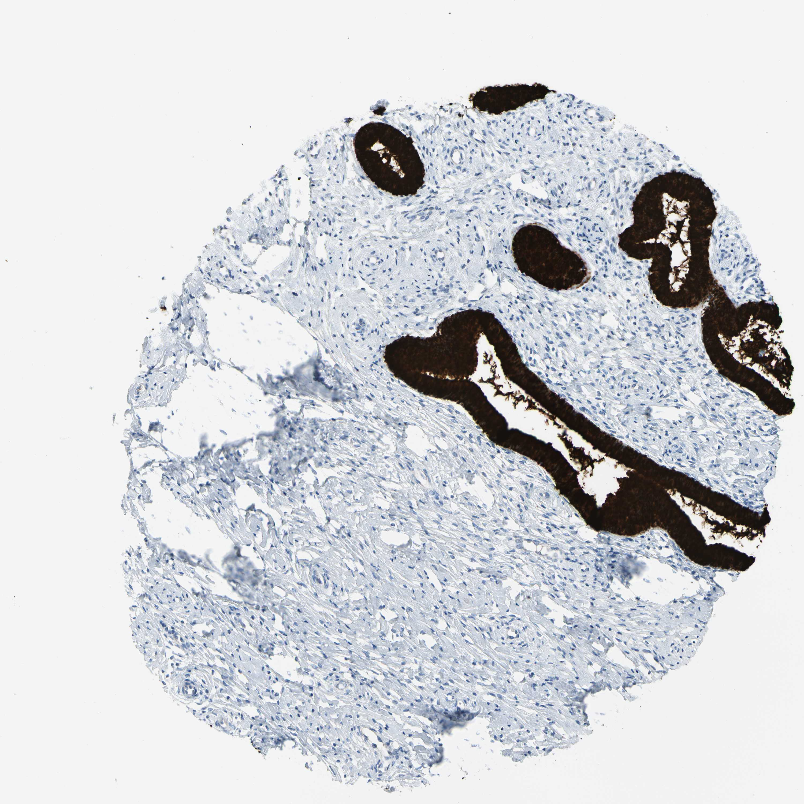

## 문제
A 46-year-old woman, gravida 2, para 2, undergoes loop electrosurgical excision of the cervix because a Papanicolaou smear showed atypical glandular cells. Her last menstrual period was 2 weeks ago. Pelvic examination shows no gross lesion; colposcopy shows the squamocolumnar junction on the ectocervix. A section of the excised cervical tissue stained by immunohistochemistry for a secreted gel-forming mucin is shown. The strongly stained epithelium lines glands within fibromuscular stroma. Which of the following processes normally replaces this epithelium at the transformation zone after puberty?

- A. Squamous metaplasia
- B. Squamous dysplasia
- C. Microglandular hyperplasia
- D. Cervical endometriosis
- E. Hyperkeratosis

_Immunohistochemistry (DAB brown, hematoxylin counterstain) of a tissue-microarray core, original magnification (Human Protein Atlas, CC BY 4.0; no cropping or adjustment)_

## 정답 및 해설
> 정답: A

- **정답 핵심**: The brown-stained cells form glands with a single layer of tall columnar cells whose cytoplasm is filled with mucin, with secretion in the lumina and negative surrounding fibromuscular stroma — the mucin-secreting endocervical columnar epithelium. No squamous epithelium is present in this core. At the transformation zone the endocervical columnar epithelium that has been everted onto the acidic vaginal ectocervix is physiologically replaced by squamous epithelium through squamous metaplasia: subcolumnar reserve cells proliferate, mature into immature and then mature squamous cells, and the columnar layer is shed. The metaplastic zone is where HPV infection and cervical intraepithelial neoplasia arise, which is why colposcopy targets it.
- **원리**: The cervix has two native epithelia. The <b>ectocervix</b> is covered by non-keratinizing stratified squamous epithelium continuous with the vagina; the <b>endocervical canal</b> is lined by a <b>single layer of tall mucin-secreting columnar cells</b> that dip into the stroma as crypts ('glands'). The mucin they secrete (MUC5B and MUC5AC are the gel-forming mucins of endocervical cells) fills the cytoplasm and the crypt lumina — exactly the brown staining pattern in this core: columnar cells positive, fibromuscular stroma and vessels negative.  <b>Why the junction moves</b> — the original squamocolumnar junction lies at the external os before puberty. Estrogen at puberty and in pregnancy enlarges the cervix and <b>everts</b> the endocervical epithelium onto the ectocervix (ectropion), exposing the columnar cells to the acidic vaginal pH (lactobacilli) and to trauma. The columnar epithelium responds by <b>squamous metaplasia</b>: the <b>subcolumnar reserve cells</b> proliferate (reserve cell hyperplasia), differentiate into immature squamous cells that undermine and lift off the columnar layer, and finally mature into glycogenated squamous epithelium. The new squamocolumnar junction migrates back toward the os with age; the area between the original and the new junction is the <b>transformation zone</b>.  <b>Why it matters clinically</b> — immature metaplastic cells are the cells most susceptible to <b>HPV</b> infection and are the origin of almost all cervical intraepithelial neoplasia and squamous carcinoma; the persistence of columnar crypts beneath metaplastic squamous epithelium creates <b>Nabothian cysts</b> when crypt openings are sealed. Metaplasia itself is physiological and reversible-in-principle, distinct from <b>dysplasia</b>, which is a clonal, HPV-driven disturbance of maturation with nuclear atypia and loss of polarity. This is why the patient's atypical glandular cells on cytology require sampling of both the transformation zone and the endocervical canal — the columnar epithelium seen here is the epithelium at risk for adenocarcinoma in situ, whereas the metaplastic zone is at risk for squamous lesions.
- **비교**: <table><thead><tr><th style="width:28%">Process</th><th style="width:44%">What it is</th><th>Relation to the stained epithelium</th></tr></thead><tbody> <tr><td><b>Squamous metaplasia (answer)</b></td><td><b>physiological replacement of everted columnar epithelium by squamous epithelium via reserve-cell proliferation</b></td><td>replaces it at the transformation zone</td></tr> <tr><td>Squamous dysplasia (CIN)</td><td>HPV-driven, clonal maturation disorder of the metaplastic squamous epithelium with nuclear atypia</td><td>arises <i>after</i> metaplasia, in the squamous layer, not a replacement of columnar cells</td></tr> <tr><td>Microglandular hyperplasia</td><td>benign progestin/pregnancy-related crowding of small endocervical glands</td><td>a change <i>of</i> this epithelium, not its replacement</td></tr> <tr><td>Cervical endometriosis</td><td>ectopic endometrial glands and stroma in the cervix after trauma or surgery</td><td>unrelated ectopic tissue</td></tr> <tr><td>Hyperkeratosis</td><td>keratin layer on ectocervical squamous epithelium (prolapse, irritation)</td><td>change of squamous, not columnar, epithelium</td></tr> </tbody></table> The <b>closest wrong answer is squamous dysplasia</b>, because both involve the transformation zone and both change the epithelium. The discriminator is the <b>sequence and the driver</b>: metaplasia comes first, is hormonal-environmental and orderly (maturation preserved); dysplasia comes later, is HPV-driven and disorderly (atypia, loss of polarity, mitoses above the basal third). If the question instead asked which change in the transformation zone is the precursor of invasive carcinoma, the answer would be dysplasia, not metaplasia.
- **오답 이유**:
  - (B) Squamous dysplasia (CIN) is an HPV-driven clonal disorder of maturation in the metaplastic squamous epithelium, with nuclear enlargement, hyperchromasia and mitoses above the basal layer. It develops in squamous epithelium that already replaced the columnar cells and is pathological, not physiological. This option would be correct only if the question asked for the precursor lesion of squamous carcinoma at the transformation zone.
  - (C) Microglandular hyperplasia is a benign crowding of small endocervical glands with squamous metaplasia and neutrophils, associated with progestins and pregnancy. It is a proliferative change of the columnar epithelium itself, not a process that replaces it with another epithelium. This option would be correct only if the question asked which benign endocervical change can mimic adenocarcinoma on a smear from a woman taking progestin.
  - (D) Cervical endometriosis consists of ectopic endometrial glands with endometrial stroma implanted in the cervix, usually after cone biopsy or delivery, and bleeds cyclically. It does not replace endocervical epithelium and is unrelated to the transformation zone. This option would be correct only if the section showed glands surrounded by endometrial-type stroma with hemosiderin.
  - (E) Hyperkeratosis is a surface keratin layer on the ectocervical squamous epithelium, seen with uterine prolapse or chronic irritation, and appears as leukoplakia. It is a change of squamous epithelium, not a replacement of mucin-secreting columnar epithelium. This option would be correct only if the stained cells were stratified squamous cells with a keratin layer.
- **함정**: First identify the cell from the picture — single-layer tall columnar cells packed with mucin lining crypts — then ask what happens to that cell type when it is everted onto the ectocervix. Metaplasia is physiological and precedes dysplasia; do not confuse the process with its later complication.
- **학습목표**: 자궁경부 조직의 점액 면역조직화학에서 강양성 세포를 자궁목내막 원주상피로 읽고, 변형대에서 이를 대체하는 생리적 과정이 편평상피화생임을 설명한다
- **근거·출처**: Human Protein Atlas, MUC5B / cervix, tissue core 24311_B_9_3 (46-year-old female), CC BY 4.0 — strong cytoplasmic positivity in endocervical glandular cells, stroma negative (HPA annotation and author reading) · 작성자 판독(2026-09-17/18): 섬유근육 기질 안 자궁목내막 샘의 단층 원주 점액상피 세포질 강양성, 내강에 점액, 기질·혈관 음성, 편평상피 없음, 글자·식별 표지 없음 · Robbins & Cotran Pathologic Basis of Disease, 10th ed., ch. 22 The female genital tract — cervix: transformation zone, squamous metaplasia, reserve cells, Nabothian cysts, CIN · Kurman RJ (ed.) Blaustein's Pathology of the Female Genital Tract, 7th ed., ch. 'Benign diseases of the cervix' — squamous metaplasia stages, microglandular hyperplasia, endocervical mucins · Gipson IK et al. Mucin genes expressed by human female reproductive tract epithelia (Biol Reprod 1997) — MUC5B/MUC5AC in endocervical columnar cells

## 출처
- Human Protein Atlas, MUC5B / Cervix (CC BY 4.0), https://images.proteinatlas.org/8246/24311_B_9_3.jpg · Creative Commons Attribution 4.0 International · https://www.proteinatlas.org/about/licence
