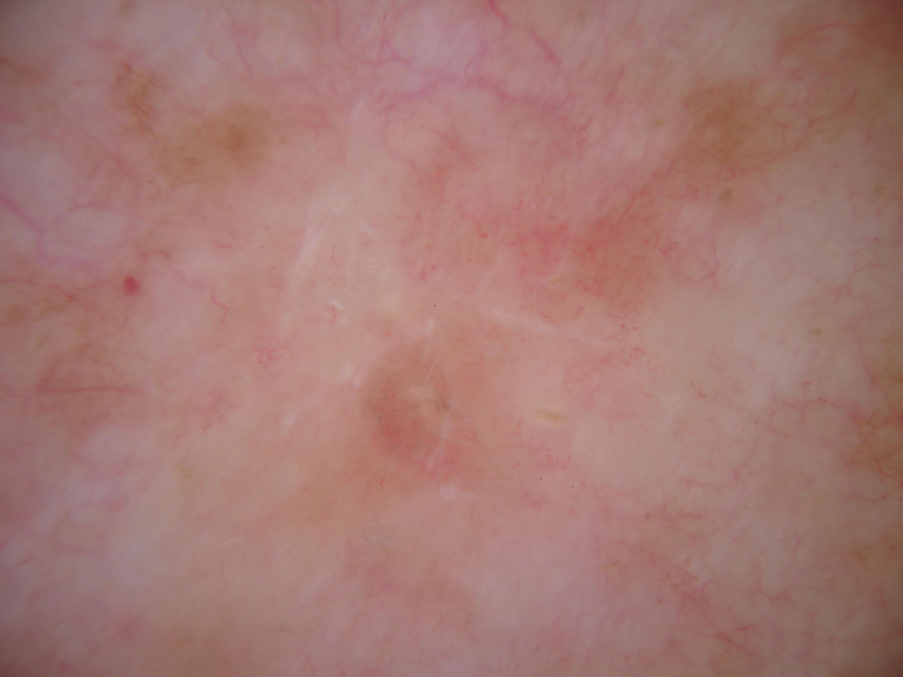

## 문제
55세 여자가 앞가슴에 3년 전부터 있던 옅은 갈색 반점이 2개월 전부터 분홍색으로 변하면서 가렵다고 병원에 왔다. 병변을 긁거나 약을 바른 적은 없고 피부암의 가족력은 없다. 진찰에서 앞가슴에 직경 8 mm 의 경계가 불분명한 분홍-갈색 편평 반이 하나 있고 만져지는 융기나 궤양은 없다. 병변의 더모스코피 사진은 그림과 같다. 가장 적절한 다음 조치는?

- A. 피부 생검으로 조직검사
- B. 국소 스테로이드 도포 후 경과관찰
- C. 액체질소 냉동치료
- D. 6개월 뒤 더모스코피 재검
- E. 국소 이미퀴모드 도포

_더모스코피 사진, 원본 그대로 크기 조정만 (ISIC Archive, CC0 1.0)_

## 정답 및 해설
> 정답: A

- **정답 핵심**: 더모스코피에서 분홍 배경 위에 경계가 불분명한 회갈색 과립과 작은 반점이 흩어져 있고(peppering), 중앙에 흰 비늘·흉터 같은 구조와 미세한 혈관이 보이며 색소망·소구·줄무늬 같은 멜라닌세포 병변의 구조는 없다. 오래된 갈색 반이 분홍색으로 변하며 가려워진 병력과 합치면 퇴행 중인 편평태선양 각화증(lichen planus-like keratosis)에 가장 합당하다. 그러나 회갈색 과립과 흉터양 백색 영역은 「퇴행 구조」이고, 이는 퇴행 중인 흑색종에서도 똑같이 나타난다. 더모스코피만으로 둘을 확실히 가를 수 없으므로 조직검사로 확진해야 한다.
- **원리**: <b>편평태선양 각화증(LPLK, lichenoid keratosis)</b>은 독립된 종양이 아니라 <b>기존의 일광흑자·지루각화증이 태선양(lichenoid) 염증으로 퇴행하는 과정</b>이다. T 세포가 표피 기저층을 공격해 각질형성세포가 괴사하고, 기저층의 멜라닌이 진피 상부로 떨어져 <b>멜라닌탐식세포(melanophage)</b>에 담긴다. 더모스코피의 <b>회갈색 과립(peppering)</b>이 바로 이 진피 멜라닌탐식세포이고, 염증이 지나간 자리는 섬유화되어 <b>흉터양 백색 영역</b>이 된다. 그래서 병력이 「오래된 갈색 반이 분홍색으로 변하며 가렵다」이고, 색소망 같은 원래 구조는 사라지며 과립·백색 영역·미세 혈관만 남는다.  <b>왜 조직검사인가</b> — 퇴행은 병변의 종류가 아니라 <b>면역 반응의 흔적</b>이다. 흑색종도 퇴행하며, 완전히 퇴행한 흑색종은 더모스코피에서 LPLK 와 똑같이 회갈색 과립과 백색 영역만 보일 수 있다. 더모스코피 문헌은 병변의 <b>50 % 이상을 차지하는 퇴행 구조</b>나 <b>단독 병변의 퇴행 소견</b>은 흑색종을 배제할 수 없으므로 조직검사 대상으로 삼는다. LPLK 를 뒷받침하는 단서(오래된 흑자에서 시작, 몸통·전완, 색소망·비정형 혈관 없음)는 확률을 높일 뿐 확정하지 못한다. 조직검사에서 LPLK 는 띠 모양 림프구 침윤·기저층 액화변성·콜로이드 소체·진피 멜라닌탐식세포를 보이고, 비정형 멜라닌세포의 증식이 없다는 것이 퇴행 흑색종과의 결정적 차이다.  <b>왜 다른 처치가 아닌가</b> — 냉동치료·이미퀴모드·스테로이드는 조직을 파괴하거나 염증을 눌러 <b>진단 기회를 없앤다</b>. 흑색종이었다면 치료 지연이 아니라 진단 소실이 된다. 경과관찰도 마찬가지로 퇴행 흑색종의 전이 위험을 안고 가는 선택이다.
- **비교**: <table><thead><tr><th style="width:26%">진단</th><th style="width:44%">더모스코피·병력</th><th>처치</th></tr></thead><tbody> <tr><td><b>편평태선양 각화증(퇴행 중)</b></td><td><b>회갈색 과립(peppering)·흉터양 백색 영역·미세 혈관, 색소망 없음; 오래된 흑자·지루각화증이 분홍색으로 변하며 가려움</b></td><td><b>조직검사로 확진</b></td></tr> <tr><td>퇴행 흑색종(가장 가까운 오답의 근거)</td><td>같은 회갈색 과립·백색 영역 + 남아 있는 비대칭 색소망·비정형 점·다형성 혈관, 청백색 베일; 단독 병변·최근 변화</td><td>절제 생검 — 임상·더모스코피만으로 배제 불가</td></tr> <tr><td>색소성 광선각화증</td><td>모낭 주위 회색 과립이 「딸기 모양」·능형 구조, 얼굴·햇빛 노출부, 거친 비늘</td><td>냉동치료 가능(진단이 확실할 때)</td></tr> <tr><td>지루각화증</td><td>밀리아 유사 낭·면포 유사 개구·뇌 모양 융기, 경계 뚜렷, 「붙여 놓은」 모양</td><td>경과관찰 또는 냉동치료</td></tr> <tr><td>표재성 기저세포암</td><td>짧고 가는 모세혈관확장·나뭇잎 모양 영역·다수의 청회색 소구, 광택 있는 백색·홍색 영역</td><td>이미퀴모드·절제</td></tr> </tbody></table> <b>가장 가까운 오답은 「국소 스테로이드 후 경과관찰」</b>이다 — 가려움과 분홍 염증성 배경이 「염증성 양성 병변」처럼 보이기 때문이다. 갈림길은 <b>퇴행 구조(회갈색 과립·흉터양 백색 영역)가 있는가</b>이다. 있으면 퇴행 흑색종이 같은 그림을 그릴 수 있으므로 조직검사가 먼저이고, 색소망·소구·비대칭이 남아 있으면 더욱 절제 생검 쪽이다. 반대로 밀리아 유사 낭·면포 유사 개구가 뚜렷하고 변화가 없는 지루각화증이라면 경과관찰이 정답이 된다.
- **오답 이유**:
  - ② 국소 스테로이드 후 경과관찰은 진단이 확실한 염증성 병변(습진·편평태선)에서 정답이 된다. 이 병변은 회갈색 과립과 흉터양 백색 영역이라는 퇴행 구조를 보이며, 이는 퇴행 흑색종에서도 똑같이 나타나므로 조직 확진 없이 염증만 누르면 흑색종을 놓친다. 지루각화증의 밀리아 유사 낭·면포 유사 개구가 뚜렷하고 퇴행 구조가 없을 때 이 선지가 맞다.
  - ③ 액체질소 냉동치료는 광선각화증·사마귀·지루각화증처럼 진단이 임상적으로 확실한 병변의 치료다. 퇴행 구조를 보이는 색소 병변을 조직검사 없이 파괴하면 흑색종이었을 경우 진단 자체가 사라진다. 얼굴의 거친 비늘과 딸기 모양 모낭 개구를 보이는 전형적 광선각화증이면 이 선지가 정답이 된다.
  - ④ 6개월 뒤 재검은 변화가 없고 양성 기준을 모두 충족하는 멜라닌세포 모반의 추적 방식이다. 최근 2개월 사이에 색과 증상이 변했고 퇴행 구조가 있는 단독 병변은 추적 대상이 아니라 조직검사 대상이다. 대칭적 색소망만 보이는 안정된 모반에서 이 선지가 정답이 된다.
  - ⑤ 국소 이미퀴모드는 표재성 기저세포암·광선각화증의 치료다. 이 병변에는 나뭇잎 모양 영역이나 짧은 모세혈관확장 같은 기저세포암 구조가 없고, 무엇보다 조직 확진 없이 면역조절제를 쓰면 퇴행 흑색종의 진단이 늦어진다. 조직검사로 표재성 기저세포암이 확인된 뒤라면 이 선지가 정답이 된다.
- **함정**: 분홍색·가려움 때문에 「염증」으로 읽기 쉽다. 더모스코피에서 회갈색 과립과 흉터양 백색 영역은 퇴행의 흔적이고, 퇴행은 흑색종도 한다 — 퇴행 구조가 주된 병변은 조직검사로 확인한다.
- **학습목표**: 더모스코피에서 회갈색 과립(peppering)·흉터양 백색 영역 같은 퇴행 구조를 읽고, 퇴행 중 편평태선양 각화증과 퇴행 흑색종을 육안으로 가를 수 없어 조직검사가 필요함을 판단한다
- **근거·출처**: ISIC Archive ISIC_0001107 — histopathology-confirmed lichen planus like keratosis (benign epidermal proliferation), 55 F, anterior trunk (teacher-only) · 작성자 판독(2026-09-18): 분홍 배경, 경계 불명확한 회갈색 과립·반점, 중앙 흰 비늘·흉터양 구조, 미세 혈관망; 색소망·청백색 베일·비정형 혈관 없음 · Bolognia JL et al. Dermatology, 4th ed., ch. 'Benign epidermal tumors and proliferations' — lichenoid keratosis: regressing lentigo/seborrheic keratosis, biopsy to exclude melanoma · Marghoob AA, Malvehy J, Braun RP. Atlas of Dermoscopy, 2nd ed. — regression structures (peppering, scar-like depigmentation) and the rule that lesions with predominant regression are excised/biopsied · Zaballos P et al. Dermoscopy of lichenoid regressing keratoses — gray granules and scar-like areas overlap with regressing melanoma; histopathology required (JEADV)

## 출처
- ISIC Archive ISIC_0001107 (CC-0) · CC0 1.0 Universal · https://creativecommons.org/publicdomain/zero/1.0/
