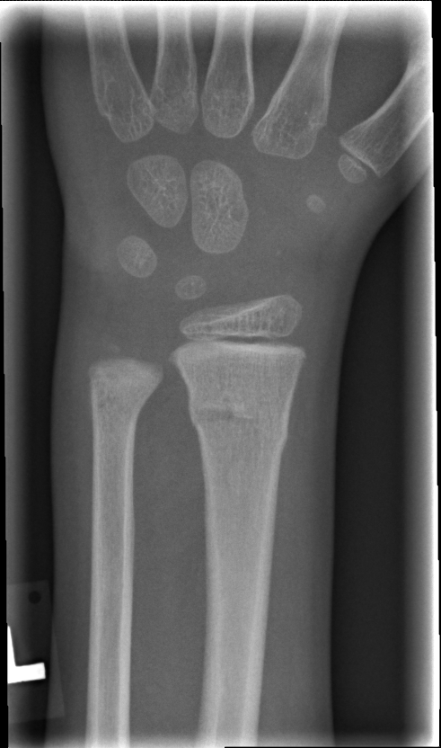

## 문제
6세 남아가 2시간 전 놀이터에서 넘어지며 왼손을 짚은 뒤 왼쪽 손목이 아프다고 하여 부모와 함께 응급실에 왔다. 다른 곳을 다치지는 않았다. 진찰에서 왼쪽 손목 등쪽에 경한 부종과 원위 요골 부위의 압통이 있으나 눈에 띄는 변형은 없고, 손가락의 움직임·감각·모세혈관 재충만은 정상이다. 왼쪽 손목 전후면 단순 X선 사진은 그림과 같다. 가장 적절한 치료는?

- A. 단상지 석고 붕대로 6주 고정
- B. 손목 자기공명영상으로 성장판 손상 평가
- C. 제거 가능한 손목 부목으로 3주 고정
- D. 도수 정복 후 장상지 석고 고정
- E. 수술적 정복과 금속핀 고정

_왼쪽 손목 전후면 단순 X선, 원본 그대로 크기 조정만 (GRAZPEDWRI-DX, figshare, CC BY 4.0)_

## 정답 및 해설
> 정답: C

- **정답 핵심**: 전후면 X선에서 원위 요골 골간단의 척측 피질이 국소적으로 불룩하게 융기하고 골간단을 가로지르는 희미한 경화선이 보이며, 피질의 완전한 단절·전위·각형성은 없고 성장판과 골단은 정상이다. 넘어지며 손을 짚은 소아의 이 소견은 원위 요골 융기(torus, buckle) 골절이다. 융기 골절은 압박에 의한 피질의 국소 좌굴로 본질적으로 안정된 불완전 골절이므로 정복이 필요 없고, 통증 조절과 보호를 위해 제거 가능한 부목으로 약 3주 고정하면 충분하다.
- **원리**: 소아의 뼈는 성인보다 <b>물과 콜라겐이 많고 무기질이 적어 탄성이 크며</b>, 두꺼운 골막이 뼈를 감싸고 있다. 그래서 축 방향 압박이 걸리면 뼈가 부러져 갈라지는 대신 <b>피질이 국소적으로 좌굴(buckling)</b>한다. 이것이 <b>융기 골절(torus fracture)</b>이다 — 「torus」는 기둥 밑동의 볼록한 테를 뜻한다. 호발 부위는 피질이 얇고 해면골로 바뀌는 <b>골간단(metaphysis)</b>이고, 넘어지며 손을 짚는 기전(FOOSH)으로 원위 요골에 가장 흔하다. X선에서는 한쪽 피질의 매끈한 융기 또는 각진 꺾임과 골간단을 가로지르는 희미한 경화선이 보이며, 반대쪽 피질은 이어져 있고 골편의 전위가 없다.  <b>왜 정복도 석고도 필요 없는가</b> — 피질이 압축되어 서로 맞물린 상태라 <b>불안정해질 수 없고</b>(전위될 골편이 없다), 골막이 온전하며, 성장판에서 떨어져 있어 성장 장애를 남기지 않는다. 소아의 왕성한 골막 골형성으로 3~4주면 유합되고, 남은 미세한 각형성은 성장하면서 재형성된다. 무작위 대조시험(FORCE, Lancet 2022)은 소아 원위 요골 융기 골절에서 <b>탄력 붕대만으로도 단단한 고정과 통증·기능 결과가 같다</b>는 것을 보였고, 현재 표준은 제거 가능한 부목을 3주 정도 착용하고 통증이 사라지면 추적 X선 없이 활동을 재개하는 것이다. 정복·긴 석고·수술은 이 골절의 안정성을 오해한 과잉치료이며, 장상지 석고는 팔꿈치 강직과 피부 문제만 더한다.  <b>같은 소아 손목에서 처치가 달라지는 골절</b> — 피질 양쪽이 끊기고 각형성이 있는 완전 골간단 골절, 골절선이 성장판을 지나는 Salter-Harris 골절, 한쪽 피질만 갈라지며 휘는 생나무(greenstick) 골절은 각도와 나이에 따라 정복·석고 고정이 필요하다.
- **비교**: <table><thead><tr><th style="width:24%">소아 원위 요골 손상</th><th style="width:44%">X선 소견</th><th>치료</th></tr></thead><tbody> <tr><td><b>융기(torus/buckle) 골절(정답)</b></td><td><b>한쪽 피질의 국소 융기 + 골간단 경화선, 반대쪽 피질 연속, 전위·각형성 없음, 성장판 정상</b></td><td><b>제거 가능 부목 3주, 정복 불필요, 추적 X선 불필요</b></td></tr> <tr><td>전위된 완전 골간단 골절(가장 가까운 오답)</td><td>양쪽 피질 단절, 골편 전위 또는 각형성(연령별 허용 각도 초과), 변형 촉지</td><td>도수 정복 후 석고 고정, 정복 유지 안 되면 핀 고정</td></tr> <tr><td>생나무(greenstick) 골절</td><td>장력 쪽 피질만 갈라지고 압박 쪽 피질은 휘어짐, 각형성 동반</td><td>각형성 정도에 따라 정복 후 석고 3~6주</td></tr> <tr><td>Salter-Harris II 형 성장판 골절</td><td>골절선이 성장판을 지나 골간단 삼각 조각(Thurston-Holland) 동반, 골단 전위</td><td>정복 후 석고 3~4주, 성장판 손상 추적</td></tr> <tr><td>정상 X선의 손목 염좌</td><td>피질 연속, 경화선·융기 없음</td><td>보호대·통증 조절, 압통 지속 시 재촬영(주상골)</td></tr> </tbody></table> <b>가장 가까운 오답은 「도수 정복 후 장상지 석고」</b>다 — 골절이 보이면 정복·석고를 떠올리기 때문이다. 갈림길은 <b>피질 단절과 전위·각형성이 있는가</b>이다. 융기 골절은 한쪽 피질이 압축되어 맞물린 안정 골절이라 정복할 것이 없고, 어느 쪽 피질도 끊기지 않았다. 반대로 양쪽 피질이 끊기고 배측 각형성이 20° 를 넘으면 정복과 석고가 정답이 된다.
- **오답 이유**:
  - ① 단상지 석고 6주는 유합 기간 3~4주인 융기 골절에 지나치게 길고, 제거 가능한 부목과 결과가 같다는 무작위 시험이 있어 표준이 아니다. 골편이 있어 정복을 유지해야 하는 완전 골절에서 석고 고정이 정답이 된다.
  - ② 손목 MRI 는 X선에서 보이지 않는 성장판·인대 손상이 임상적으로 의심될 때 쓴다. 이 X선은 골간단의 융기 골절을 이미 보여 주고 성장판과 골단이 정상이라 추가 영상이 진단이나 치료를 바꾸지 않는다. X선이 정상인데 성장판 부위 압통이 지속되어 Salter-Harris I 형이 의심될 때 이 선지가 정답이 된다.
  - ④ 도수 정복 후 장상지 석고는 전위·각형성이 있는 완전 골간단 골절이나 생나무 골절의 치료다. 이 X선은 한쪽 피질의 융기와 경화선뿐 전위나 각형성이 없고 반대쪽 피질이 이어져 있어 정복할 변형이 없다. 양쪽 피질이 끊기고 배측 각형성이 연령별 허용 각도를 넘을 때 이 선지가 정답이 된다.
  - ⑤ 수술적 정복과 핀 고정은 정복이 유지되지 않는 불안정 골절, 개방 골절, 성장판 전위가 큰 골절에 쓴다. 융기 골절은 피질이 맞물린 안정 골절이라 수술 적응이 없다. 정복 후에도 전위가 재발하거나 골절이 개방성일 때 이 선지가 정답이 된다.
- **함정**: 소아 손목 X선에서 「골절이 있다」에서 멈추지 말고 「어떤 골절인가」까지 읽는다. 한쪽 피질의 융기 + 전위·각형성 없음 = 융기 골절 → 정복 없이 부목 3주.
- **학습목표**: 소아 손목 X선에서 원위 요골 골간단의 피질 융기(torus/buckle)를 읽고, 전위·각형성·성장판 침범이 없는 안정 골절이므로 정복 없이 짧은 기간의 부목 고정을 선택한다
- **근거·출처**: GRAZPEDWRI-DX label: fracture, AO/OTA pediatric 23-M/2.1 (distal radius, metaphyseal, incomplete), initial exam, 6.4 M, left AP; expert pediatric radiologist annotation (Sci Data 2022) · 작성자 판독(2026-09-18): 원위 요골 골간단을 가로지르는 경화선과 척측 피질의 작은 굴곡, 전위 없음, 성장판·골단 정상; 전후면 한 장뿐이라 측면 소견은 묻지 않음 · Perry DC et al. Immobilisation of torus fractures of the wrist in children (FORCE): a randomised controlled equivalence trial. Lancet 2022;400:39 — bandage vs rigid immobilization equivalent · Nelson Textbook of Pediatrics 21st ed., ch. 'Common fractures' — torus (buckle) fracture: stable, splint 3–4 weeks, no reduction · Rockwood and Wilkins' Fractures in Children, 9th ed., ch. 'Fractures of the distal radius and ulna' — torus vs complete metaphyseal vs greenstick, acceptable angulation by age

## 출처
- GRAZPEDWRI-DX (figshare, CC BY 4.0) · Creative Commons Attribution 4.0 International · https://creativecommons.org/licenses/by/4.0/
