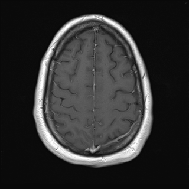

## 문제
A 28-year-old man is brought to the emergency department 1 hour after a generalized tonic-clonic seizure that lasted 2 minutes and was witnessed by his roommate. He has had mild headaches for 3 weeks. He has no history of head trauma, fever, or drug use. His temperature is 37.0°C, pulse is 84/min, and blood pressure is 128/78 mm Hg. He is drowsy but oriented; neurologic examination shows no focal deficits and no neck stiffness. Contrast-enhanced T1-weighted MRI of the brain is obtained; an axial section at the level of the high convexity, above the lateral ventricles, is shown. Which of the following best explains the bright linear signal along the midline in this image?

- A. Dural metastases along the falx cerebri
- B. Normal enhancement of blood in the superior sagittal sinus and the adjacent dura
- C. Thrombus within the superior sagittal sinus
- D. Meningioma arising from the falx cerebri
- E. Pus in the interhemispheric subdural space

_Contrast-enhanced axial T1-weighted MRI of the brain, standard display orientation (patient's right on the viewer's left) (The Cancer Imaging Archive, CC BY 4.0; converted from DICOM without cropping)_

## 정답 및 해설
> 정답: B

- **정답 핵심**: The image is a gadolinium-enhanced T1-weighted axial section at the vertex. The falx cerebri and the superior sagittal sinus form a thin, smooth, uniformly bright midline line, and the cortical veins draining into the sinus are also bright; the underlying gyri are symmetric, the sulci are open, and there is no mass, no midline shift and no nodular or thick dural enhancement at this level. Gadolinium shortens the T1 of blood, so slowly flowing venous blood in the dural sinuses and cortical veins is normally bright on post-contrast T1 images, as are the dura, choroid plexus, pituitary and pineal gland, which lack a blood-brain barrier. The bright midline structure is therefore normal enhancing venous blood and dura, not a lesion.
- **원리**: Gadolinium chelates shorten the T1 relaxation time of the water protons around them, so on T1-weighted images everything the contrast agent reaches becomes bright. <b>Two normal compartments enhance</b>: (1) <b>the blood pool</b> — arteries at normal flow often appear dark because of flow-void, but the slow, steady flow in the <b>dural venous sinuses and cortical veins</b> lets the gadolinium-laden blood be imaged, so the superior sagittal sinus, transverse sinuses and the 'straight' cortical veins converging on them are bright; (2) <b>tissues without a blood–brain barrier</b> — dura mater (including the falx and tentorium), choroid plexus, pituitary gland and stalk, pineal gland, area postrema and the nasal mucosa. Brain parenchyma stays dark because tight endothelial junctions keep the contrast in the vessels; parenchymal enhancement always means barrier breakdown (tumor, abscess, infarct, demyelination).  <b>Why the pattern is reassuring here</b> — normal dural enhancement is <b>thin (&lt; 2 mm), smooth, linear and discontinuous</b>, and the sinus is uniformly filled. Pathology changes the shape: a thrombosed sinus shows a <b>non-enhancing dark clot surrounded by an enhancing dural wall</b> (the 'empty delta' sign on axial images through the posterior sinus); a meningioma is a broad-based, homogeneously enhancing mass with a 'dural tail' that displaces brain; dural metastases and pachymeningitis give thick, nodular or diffuse dural enhancement; a subdural empyema is a crescent of fluid with a rim of enhancement and mass effect. None of these is present at this level.  <b>Why a first seizure still needs the whole study</b> — an adult with a new seizure and weeks of headache is imaged to look for a structural cause, and a lesion may lie on other sections than the one shown. The task here is narrower: recognizing that the bright midline line on this slice is physiologic, so that a normal structure is not misread as venous thrombosis or a tumor.
- **비교**: <table><thead><tr><th style="width:26%">Midline enhancement on post-gadolinium T1</th><th style="width:44%">Appearance</th><th>Meaning</th></tr></thead><tbody> <tr><td><b>Normal superior sagittal sinus and falx (answer)</b></td><td><b>thin, smooth, uniformly bright line; sinus completely filled; cortical veins bright; no mass effect</b></td><td><b>physiologic — gadolinium in venous blood and barrier-free dura</b></td></tr> <tr><td>Superior sagittal sinus thrombosis (closest wrong answer)</td><td>central dark filling defect inside the sinus with an enhancing rim ('empty delta'), dilated collateral veins, venous infarcts or hemorrhage</td><td>needs anticoagulation; confirm with MR venography</td></tr> <tr><td>Falx meningioma</td><td>focal, broad-based, homogeneously enhancing mass with a dural tail, displaces adjacent gyri</td><td>extra-axial tumor; surgery if symptomatic</td></tr> <tr><td>Dural metastases / pachymeningitis</td><td>thick (&gt; 2 mm), nodular or diffuse enhancement along the falx and convexity dura</td><td>systemic cancer, IgG4 disease, tuberculosis</td></tr> <tr><td>Interhemispheric subdural empyema</td><td>crescent of fluid along the falx with rim enhancement, restricted diffusion, mass effect, fever</td><td>neurosurgical emergency</td></tr> </tbody></table> The <b>closest wrong answer is sinus thrombosis</b>, because a first seizure with weeks of headache in a young adult is exactly its presentation. The discriminator is <b>what fills the sinus</b>: a thrombosed sinus is dark inside with only its wall enhancing, whereas this sinus is uniformly bright from edge to edge. If the image showed a central non-enhancing clot with an enhancing rim, the answer would flip to thrombosis and the next step would be MR venography and anticoagulation.
- **오답 이유**:
  - (A) Dural metastases produce thick, nodular or diffuse enhancement of the falx and convexity dura, usually in a patient with a known cancer. The dural enhancement here is thin, smooth and uniform, the normal pattern. This option would be correct if the enhancement were more than 2 mm thick, nodular, or if there were a known primary tumor with other dural deposits.
  - (C) A thrombosed superior sagittal sinus appears on post-contrast T1 as a dark, non-enhancing clot inside the sinus surrounded by an enhancing dural wall (the empty delta sign), often with dilated collateral veins or venous infarcts. Here the sinus is uniformly bright with no filling defect. This option would be correct if the center of the sinus were dark with only its rim enhancing on this or an adjacent section.
  - (D) A falx meningioma is a focal, broad-based, homogeneously enhancing extra-axial mass with a dural tail that indents the adjacent cortex. The midline structure here is a thin, smooth line without a mass or displacement of the gyri. This option would be correct if a rounded enhancing mass were attached to the falx and pushing the medial frontal gyrus aside.
  - (E) An interhemispheric subdural empyema is a crescent of fluid along the falx with rim enhancement, restricted diffusion, mass effect and, clinically, fever, meningism and rapid deterioration. This afebrile patient has no neck stiffness and the image shows no fluid collection. This option would be correct if he were febrile with a rim-enhancing crescent along the falx.
- **함정**: On contrast-enhanced T1 images, dural venous sinuses, cortical veins, the dura, choroid plexus and pituitary are supposed to be bright. Before calling a bright midline structure a lesion, ask whether it is thin, smooth and completely filled — thrombosis leaves a dark center, tumors make a mass.
- **학습목표**: 조영증강 T1 강조 MRI 에서 대뇌낫·위시상정맥굴의 균일한 조영증강을 정상 소견으로 읽고 정맥굴 혈전·수막종·경막 전이·경막하 농양과 구분한다
- **근거·출처**: TCIA UPENN-GBM series 'AX T1 POST', instance 20 (high-convexity level) — Grade B; teacher-only: the cohort patient has a glioblastoma on other sections, which is why the question asks only about the structure visible on this slice and does not call the study normal · 작성자 판독(2026-09-18): 조영 후 T1 축상면, 반타원중심 위 높이; 대뇌낫·위시상정맥굴 균일 조영증강, 피질정맥 밝음, 이 높이에 종괴·충만결손·중앙선 이동 없음 · Osborn AG. Osborn's Brain, 2nd ed., ch. 'Normal enhancement patterns' — dural venous sinuses, cortical veins, dura, choroid plexus, pituitary and pineal enhance physiologically; normal dura is thin, smooth and discontinuous · Virapongse C et al. The empty delta sign: frequency and significance in 76 cases of dural sinus thrombosis. Radiology 1987;162:779 · Harrison's Principles of Internal Medicine 21st ed., ch. 'Seizures and epilepsy' — neuroimaging after a first unprovoked seizure in an adult

## 출처
- The Cancer Imaging Archive (CC BY 4.0) · series …35053496 · Creative Commons Attribution 4.0 International · https://www.cancerimagingarchive.net/data-usage-policies-and-restrictions/
