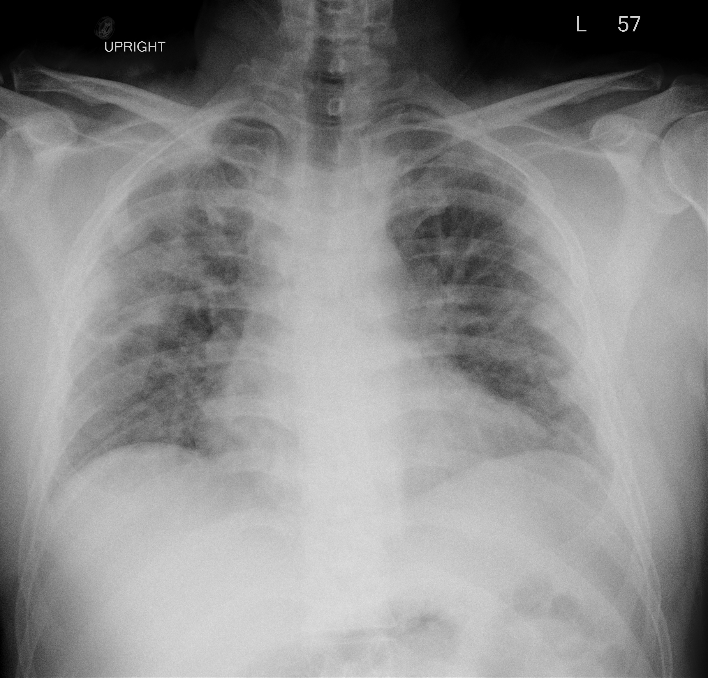

## 문제
A 41-year-old man is brought to the emergency department because of 2 days of worsening shortness of breath. He has had fever, dry cough, and myalgia for 6 days. He has no history of heart disease and takes no medications. His temperature is 38.6°C, pulse is 118/min, respirations are 34/min, and blood pressure is 118/72 mm Hg. Oxygen saturation is 84% on room air and rises to 90% on a nonrebreather mask. Crackles are heard over both lung fields; there is no jugular venous distention or peripheral edema. Serum B-type natriuretic peptide concentration is 40 pg/mL, and bedside echocardiography shows normal left ventricular function without pericardial effusion. He is intubated; on a positive end-expiratory pressure of 10 cm H2O and an FiO2 of 0.8, arterial PaO2 is 68 mm Hg. An upright anteroposterior chest radiograph obtained before intubation is shown. Which of the following is the most appropriate next step in management?

- A. Intravenous furosemide with reduction of the positive end-expiratory pressure
- B. Therapeutic anticoagulation with intravenous unfractionated heparin
- C. Emergent tube thoracostomy of the right hemithorax
- D. Tidal volume of 6 mL/kg predicted body weight with plateau pressure kept below 30 cm H2O
- E. Tidal volume of 12 mL/kg predicted body weight to normalize the PaCO2

_Upright anteroposterior chest radiograph obtained before intubation (The Cancer Imaging Archive, CC BY 4.0; original pixel data, no windowing or cropping)_

## 정답 및 해설
> 정답: D

- **정답 핵심**: The radiograph shows multifocal patchy and nodular opacities in both lungs, denser in the right mid-to-lower and left lower zones, with no pleural effusion or pneumothorax. Acute onset within a week of a respiratory illness, bilateral opacities, a PaO2/FiO2 ratio of 85 (68/0.8) on PEEP ≥ 5 cm H2O, and a cardiac cause excluded by a normal BNP, no venous distention and a normal echocardiogram meet the Berlin definition of severe acute respiratory distress syndrome. The intervention with the strongest mortality benefit is lung-protective ventilation: tidal volume 6 mL/kg of predicted body weight with plateau pressure below 30 cm H2O.
- **원리**: ARDS is <b>diffuse alveolar damage</b>: an inflammatory insult (here a viral pneumonia) injures the alveolar epithelium and capillary endothelium, so protein-rich fluid floods the alveoli, surfactant is inactivated and dependent lung units collapse. Two consequences drive management. First, <b>hypoxemia is shunt physiology</b> — blood passes flooded, non-ventilated alveoli — so it responds poorly to FiO2 alone and needs PEEP to recruit alveoli. Second, the aerated lung is small (the 'baby lung'): a normal-sized tidal volume delivered into a lung that is one third its usual size over-distends the open alveoli (<b>volutrauma</b>) and repeatedly reopens collapsed ones (<b>atelectrauma</b>), releasing cytokines that worsen the injury and cause distant organ failure (biotrauma).  <b>Why 6 mL/kg</b> — the ARDS Network ARMA trial randomized 861 patients to 6 versus 12 mL/kg of <b>predicted</b> body weight (a function of height and sex, because lung size does not grow with obesity) with plateau pressure limited to 30 cm H2O; mortality fell from 39.8 % to 31.0 %. Permissive hypercapnia is accepted as the price of low volumes. The Berlin definition grades severity by the PaO2/FiO2 ratio on PEEP ≥ 5 cm H2O: mild 201–300, moderate 101–200, severe ≤ 100. This patient's ratio of 85 is severe, which additionally justifies higher PEEP, neuromuscular blockade in the first 48 h and prone positioning for ≥ 16 h/day (PROSEVA), and consideration of ECMO if the ratio stays below 80 despite these.  <b>Why the cardiac work-up matters</b> — the Berlin definition requires that the edema is <b>not fully explained by cardiac failure or fluid overload</b>. Bilateral opacities with a low BNP, no jugular venous distention and normal ventricular function on echocardiography point away from hydrostatic edema, so diuresis would only deplete intravascular volume without clearing the alveoli.
- **비교**: <table><thead><tr><th style="width:28%">Cause of bilateral opacities with hypoxemia</th><th style="width:42%">Distinguishing features</th><th>Initial management</th></tr></thead><tbody> <tr><td><b>ARDS (answer)</b></td><td><b>onset ≤ 1 week after an insult; PaO2/FiO2 ≤ 300 on PEEP ≥ 5; BNP low, echocardiography normal, no volume overload</b></td><td><b>tidal volume 6 mL/kg PBW, plateau &lt; 30, PEEP; prone if PaO2/FiO2 &lt; 150</b></td></tr> <tr><td>Cardiogenic pulmonary edema (closest wrong answer)</td><td>BNP &gt; 400 pg/mL, jugular venous distention, S3, reduced ejection fraction or severe valve disease, effusions, perihilar 'bat-wing' pattern</td><td>diuretics, nitrates, treat the cardiac cause; PEEP still helps</td></tr> <tr><td>Massive pulmonary embolism</td><td>clear or near-clear lungs despite hypoxemia, right-ventricular strain on echocardiography, hypotension</td><td>anticoagulation; thrombolysis if unstable</td></tr> <tr><td>Diffuse alveolar hemorrhage</td><td>hemoptysis, falling hemoglobin, vasculitis or anticoagulant history, bloody lavage</td><td>immunosuppression, correct coagulopathy</td></tr> <tr><td>Tension pneumothorax</td><td>unilateral absent breath sounds, tracheal deviation, hyperlucent hemithorax, hypotension</td><td>needle decompression and chest tube</td></tr> </tbody></table> The <b>closest wrong answer is a 'normal' tidal volume of 12 mL/kg</b>: it seems to correct the respiratory acidosis of a patient breathing 34/min, but in ARDS the aerated lung is small and large volumes over-distend it. The discriminator is the <b>combination of bilateral opacities, PaO2/FiO2 ≤ 100 on PEEP and an excluded cardiac cause</b>: once ARDS is diagnosed, the goal is protecting the lung, not normalizing the blood gas. If BNP were high with jugular venous distention and a dilated, poorly contracting ventricle, diuresis would move ahead of the ventilator settings.
- **오답 이유**:
  - (A) Furosemide and lowering PEEP treat hydrostatic (cardiogenic) pulmonary edema. Here the BNP is 40 pg/mL, there is no jugular venous distention or edema, and echocardiography shows normal left ventricular function, so the alveolar fluid is inflammatory, not hydrostatic; diuresis would worsen perfusion, and lowering PEEP would de-recruit alveoli. This option would be correct if BNP were above 400 pg/mL with a dilated, hypokinetic left ventricle.
  - (B) Therapeutic heparin is the treatment for pulmonary embolism, which causes hypoxemia with clear lungs and right-ventricular strain. This patient has bilateral parenchymal opacities after a febrile respiratory illness and a normal echocardiogram. This option would be correct if the radiograph were clear, the D-dimer high and CT angiography showed a clot.
  - (C) Tube thoracostomy is for pneumothorax or a large effusion. The radiograph shows lung markings extending to the chest wall on both sides, no visceral pleural line and no meniscus; the opacities are parenchymal. This option would be correct if the right hemithorax were hyperlucent without lung markings and the mediastinum shifted to the left.
  - (E) A tidal volume of 12 mL/kg normalizes the PaCO2 but over-distends the small aerated lung of ARDS (volutrauma), which in the ARMA trial increased mortality from 31 % to 40 % compared with 6 mL/kg. Permissive hypercapnia is accepted instead. This option would be correct for no ARDS patient; it belongs to the pre-2000 era of ventilation.
- **함정**: Bilateral opacities plus hypoxemia is not automatically 'heart failure' — check BNP, neck veins and the echocardiogram. Once ARDS is recognized, the first decision is how not to injure the lung further (6 mL/kg PBW, plateau < 30), not how to normalize the PaCO2.
- **학습목표**: 양측 폐 음영과 PaO2/FiO2 저하가 심부전으로 설명되지 않을 때 급성호흡곤란증후군으로 판단하고 저일회호흡량 폐보호 환기를 선택한다
- **근거·출처**: TCIA COVID-19-AR (UAMS) series label: chest radiograph with bilateral opacities — Grade B; teacher-only: patient in a confirmed COVID-19 cohort, 41 M · 작성자 판독(2026-09-19): 직립 AP, 양쪽 폐야 다발성 반점상·결절상 음영(오른쪽 중·하부, 왼쪽 하부 우세), 흉수·기흉 없음, 번인 문자 'UPRIGHT'·'L'·'57' 뿐 · ARDS Definition Task Force. Acute respiratory distress syndrome: the Berlin definition. JAMA 2012;307:2526 — timing, bilateral opacities, PaO2/FiO2 on PEEP ≥ 5, not fully explained by cardiac failure · ARDS Network. Ventilation with lower tidal volumes as compared with traditional tidal volumes. N Engl J Med 2000;342:1301 (ARMA) — 6 vs 12 mL/kg PBW, mortality 31.0 % vs 39.8 % · Guérin C et al. Prone positioning in severe ARDS. N Engl J Med 2013;368:2159 (PROSEVA); Harrison's Principles of Internal Medicine 21st ed., ch. 'Acute respiratory distress syndrome'

## 출처
- COVID-19-AR, The Cancer Imaging Archive (CC BY 4.0) · series …85398017 · Creative Commons Attribution 4.0 International · https://www.cancerimagingarchive.net/data-usage-policies-and-restrictions/
