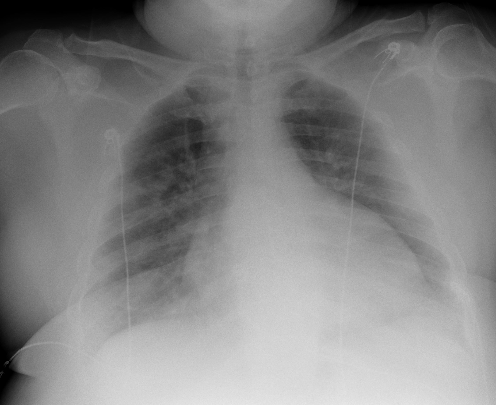

## 문제
55세 남자가 5일 전부터 발열과 기침이 있다가 이틀 전부터 숨이 차서 응급실에 왔다. 고혈압으로 암로디핀을 복용하며 심장병 병력은 없다. 혈압 82/48 mmHg, 맥박 122회/분, 호흡 32회/분, 체온 39.1℃이고, 비재호흡마스크 15 L/분에서 산소포화도 92% 이다. 양쪽 폐에서 거품소리가 들리고 경정맥 팽대와 다리 부종은 없다. 혈액검사: 백혈구 18,500/μL, 젖산 4.2 mmol/L, 크레아티닌 1.6 mg/dL. 침상 심초음파에서 좌심실 수축은 정상이고 하대정맥은 가늘며 호흡에 따라 잘 허탈된다. 이동식 흉부 X선 사진은 그림과 같다. 혈액배양 채취와 항생제 투여를 시작하면서 함께 해야 할 처치로 가장 적절한 것은?

- A. 정질액 30 mL/kg 급속 정주
- B. 노르에피네프린 지속 정주 시작
- C. 하이드로코르티손 200 mg/일 정주
- D. 푸로세미드 40 mg 정주
- E. 5% 알부민 500 mL 정주

_이동식 전후면 흉부 X선, 원본 그대로 크기 조정만 (The Cancer Imaging Archive, CC BY 4.0 — 크롭·윈도우 조정 없음)_

## 정답 및 해설
> 정답: A

- **정답 핵심**: 흉부 X선에서 양쪽 폐야에 폐문 주위와 중·하부에 우세한 미만성 흐린 간유리·반점상 음영이 있고 기흉이나 큰 흉수는 없다. 발열·기침 5일에 이어 나타난 양쪽 폐렴이 감염원이고, 저혈압(82/48)·빈맥·빈호흡·젖산 4.2 mmol/L·크레아티닌 상승은 패혈증에 의한 장기 관류 저하, 즉 패혈성 쇼크를 뜻한다. 경정맥 팽대와 부종이 없고 좌심실 수축이 정상이며 하대정맥이 가늘고 잘 허탈되므로 심장성 폐부종·용적 과부하가 아니라 혈관 확장과 모세혈관 누출로 유효 순환 혈액량이 모자란 상태다. 패혈증 초기 소생의 첫 처치는 3시간 안에 정질액 30 mL/kg 를 급속 정주하는 것이며, 그래도 평균동맥압 65 mmHg 에 못 미치면 노르에피네프린을 더한다.
- **원리**: 패혈성 쇼크는 감염에 대한 숙주 반응이 조절을 잃어 <b>혈관이 확장되고 모세혈관 투과성이 커지며 혈관 내 용적이 조직 사이로 새어 나가는</b> 분포성 쇼크다. 심장은 대개 처음에는 정상 이상으로 뛰지만(빈맥·정상 좌심실 수축), 되돌아오는 정맥 환류가 모자라 심박출량과 조직 관류가 떨어진다. 젖산이 2 mmol/L 를 넘고 승압제 없이 평균동맥압 65 mmHg 를 유지하지 못하면 Sepsis-3 정의의 패혈성 쇼크이며, 이 환자는 젖산 4.2 에 수축기 혈압 82 로 그 기준을 넘는다.  <b>왜 수액이 먼저인가</b> — 쇼크의 기전이 「용적 부족」이므로 관류를 회복하는 첫 단계는 빈 혈관을 채우는 것이다. Surviving Sepsis Campaign 은 저혈압 또는 젖산 ≥ 4 mmol/L 인 패혈증에서 <b>3시간 안에 정질액 30 mL/kg</b> 를 주고, 그 뒤에는 동적 지표(하대정맥 허탈, 수동 하지 거상 반응, 젖산 추이)로 추가 수액을 결정하라고 권고한다. 심초음파의 가늘고 잘 허탈되는 하대정맥은 수액에 반응할 가능성이 높다는 신호이고, 정상 좌심실 수축과 경정맥 팽대 없음은 수액을 줘도 폐부종으로 악화될 위험이 낮다는 뜻이다. 양쪽 폐 음영은 폐렴(감염원)이지 심장성 부종이 아니므로 이뇨제는 관류를 더 떨어뜨린다.  <b>승압제·스테로이드의 자리</b> — 노르에피네프린은 수액을 주는 중에도 평균동맥압이 65 미만이면 <b>병행</b>해서 시작하는 약이지 수액을 대신하지 않는다. 하이드로코르티손은 충분한 수액과 승압제(노르에피네프린 ≥ 0.25 μg/kg/분, 4시간 이상)에도 혈압이 유지되지 않을 때 더한다. 알부민은 정질액을 대량으로 준 뒤에 고려하는 보조 수액이며 초기 소생의 1차 수액이 아니다(SAFE·ALBIOS 에서 사망률 이득 없음).
- **비교**: <table><thead><tr><th style="width:26%">처치</th><th style="width:44%">언제 정답이 되는가</th><th>이 증례</th></tr></thead><tbody> <tr><td><b>정질액 30 mL/kg 급속 정주(정답)</b></td><td><b>패혈증 + 저혈압 또는 젖산 ≥ 4 — 소생의 첫 단계(3시간 내)</b></td><td><b>혈압 82/48, 젖산 4.2, 하대정맥 허탈 → 수액 반응 기대</b></td></tr> <tr><td>노르에피네프린(가장 가까운 오답)</td><td>수액 중·후에도 평균동맥압 &lt; 65 — 수액과 병행하되 대체하지 않는다</td><td>아직 수액 전 — 채우지 않고 조이면 관류가 더 나빠진다</td></tr> <tr><td>하이드로코르티손</td><td>수액 + 승압제로도 혈압 불안정(불응성 쇼크)</td><td>순서상 아직</td></tr> <tr><td>푸로세미드</td><td>심장성 폐부종·용적 과부하(경정맥 팽대, BNP 상승, 좌심실 기능 저하)</td><td>좌심실 정상, 경정맥 팽대 없음 — 오히려 금기에 가깝다</td></tr> <tr><td>5% 알부민</td><td>정질액 대량 투여 후 추가 수액이 필요할 때의 보조</td><td>1차 수액이 아니다</td></tr> </tbody></table> <b>가장 가까운 오답은 「노르에피네프린 먼저」</b>다 — 혈압이 매우 낮아 보이면 승압제를 떠올리기 쉽다. 갈림길은 <b>혈관 내 용적이 채워졌는가</b>이다. 가늘고 허탈되는 하대정맥과 정상 좌심실은 「빈 혈관」을 말하므로 수액이 먼저이고, 30 mL/kg 를 주는 중에도 평균동맥압 65 에 못 미치면 그때 노르에피네프린을 병행한다. 반대로 좌심실 수축이 나쁘고 경정맥이 팽대되어 있었다면 수액 대신 승압제·강심제와 이뇨제 쪽으로 방향이 바뀐다.
- **오답 이유**:
  - ② 노르에피네프린은 정질액 30 mL/kg 를 주는 중에도 평균동맥압이 65 mmHg 에 못 미칠 때 수액과 병행해 시작하는 약이다. 빈 혈관을 채우지 않고 먼저 조이면 조직 관류가 더 나빠진다. 수액 투여 후에도 저혈압이 지속되거나 수액을 줄 수 없는 심부전이 있을 때 이 선지가 정답이 된다.
  - ③ 하이드로코르티손은 충분한 수액과 노르에피네프린 0.25 μg/kg/분 이상을 4시간 이상 써도 혈압이 유지되지 않는 불응성 패혈성 쇼크에 더하는 약이다. 아직 수액도 승압제도 시작하지 않은 시점에는 순서가 맞지 않는다. 승압제 용량이 계속 올라가는 환자라면 이 선지가 정답이 된다.
  - ④ 푸로세미드는 심장성 폐부종·용적 과부하에서 정답이 된다. 이 환자는 경정맥 팽대와 부종이 없고 좌심실 수축이 정상이며 하대정맥이 가늘고 허탈되므로 용적이 모자란 상태다. 이뇨제는 혈압과 관류를 더 떨어뜨린다. BNP 가 높고 좌심실 기능이 나쁜 폐부종이라면 이 선지가 맞다.
  - ⑤ 알부민은 정질액을 대량으로 준 뒤 추가 수액이 필요할 때 고려하는 보조 수액이며 초기 소생의 1차 수액이 아니다(SAFE·ALBIOS 에서 정질액 대비 사망률 이득 없음). 이미 정질액 수 리터를 받고도 수액 반응이 남아 있으면서 부종이 걱정될 때 이 선지가 정답이 된다.
- **함정**: 혈압이 82/48 이라고 승압제부터 떠올리지 않는다. 심초음파의 가늘고 허탈되는 하대정맥과 정상 좌심실이 「빈 혈관」을 말한다 — 채우고(30 mL/kg), 그래도 안 되면 조인다(노르에피네프린).
- **학습목표**: 폐렴에서 비롯한 패혈성 쇼크(저혈압·젖산 4 mmol/L 이상)를 알아보고, 심장성 폐부종을 배제한 뒤 초기 소생의 첫 처치로 정질액 30 mL/kg 급속 정주를 선택한다
- **근거·출처**: TCIA COVID-19-AR (UAMS) series label: chest radiograph with bilateral opacities — Grade B; teacher-only: patient in a confirmed COVID-19 cohort, 55 M · 작성자 판독(2026-09-20): 이동식 AP, 양쪽 폐야 미만성 흐린 간유리·반점상 음영(폐문 주위·중하부 우세), 폐용적 작음, 기흉·큰 흉수 없음, 전극 3개·선 1개, 번인 문자 없음 · Evans L et al. Surviving Sepsis Campaign: international guidelines for management of sepsis and septic shock 2021. Crit Care Med 2021;49:e1063 — 30 mL/kg crystalloid within 3 h for hypotension or lactate ≥ 4; norepinephrine first-line vasopressor; hydrocortisone for ongoing vasopressor requirement · Singer M et al. The Third International Consensus Definitions for Sepsis and Septic Shock (Sepsis-3). JAMA 2016;315:801 — septic shock: vasopressor for MAP ≥ 65 and lactate > 2 despite resuscitation · Harrison's Principles of Internal Medicine 21st ed., ch. 'Sepsis and septic shock'; Tintinalli's Emergency Medicine 9th ed., ch. 'Septic shock'

## 출처
- COVID-19-AR, The Cancer Imaging Archive (CC BY 4.0) · series …34816003 · Creative Commons Attribution 4.0 International · https://www.cancerimagingarchive.net/data-usage-policies-and-restrictions/
